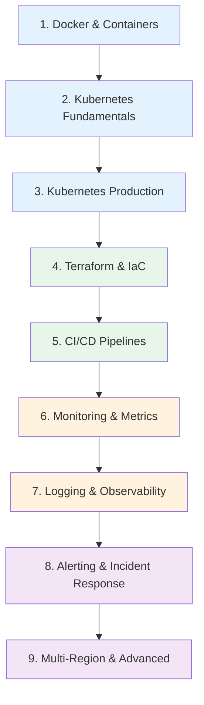

# DevOps Engineer Learning Path

A structured journey through the Knowledge Vault for DevOps engineers, SREs, and platform engineers. This path takes you from containerization through orchestration, infrastructure as code, CI/CD pipelines, observability, incident response, and multi-region architectures.

**Total estimated time**: ~35 hours across 9 sections

## Learning Progression

---

## Section 1: Docker & Containers

*Estimated reading time: 3.5 hours*

Containers are the foundation of modern infrastructure. Understand how they work, how to build efficient images, and how to secure them.

- [ ] **Required** — [Docker Overview](/infrastructure/docker/) *(15 min)*
- [ ] **Required** — [Docker Internals](/infrastructure/docker/internals) *(30 min)*
- [ ] **Required** — [Production Dockerfiles](/infrastructure/docker/production-dockerfiles) *(25 min)*
- [ ] **Required** — [Multi-Stage Builds](/infrastructure/docker/multi-stage-builds) *(25 min)*
- [ ] **Required** — [Image Optimization](/infrastructure/docker/image-optimization) *(25 min)*
- [ ] **Required** — [Compose Patterns](/infrastructure/docker/compose-patterns) *(25 min)*
- [ ] **Required** — [Security Hardening](/infrastructure/docker/security-hardening) *(25 min)*

::: tip Checkpoint
After this section you should be able to: write production-grade multi-stage Dockerfiles, optimize image size and layer caching, use Docker Compose for local development, and apply security best practices (non-root users, read-only filesystems, minimal base images).
:::

---

## Section 2: Kubernetes Fundamentals

*Estimated reading time: 4 hours*

Kubernetes is the standard for container orchestration. Start with the architecture and core resource types.

- [ ] **Required** — [Kubernetes Overview](/infrastructure/kubernetes/) *(15 min)*
- [ ] **Required** — [Architecture & Internals](/infrastructure/kubernetes/architecture-internals) *(35 min)*
- [ ] **Required** — [Pod Lifecycle](/infrastructure/kubernetes/pod-lifecycle) *(25 min)*
- [ ] **Required** — [Deployments & StatefulSets](/infrastructure/kubernetes/deployments-statefulsets) *(30 min)*
- [ ] **Required** — [Services & Ingress](/infrastructure/kubernetes/services-ingress) *(25 min)*
- [ ] **Required** — [Secrets Management](/infrastructure/kubernetes/secrets-management) *(25 min)*
- [ ] **Required** — [Network Policies](/infrastructure/kubernetes/network-policies) *(25 min)*
- [ ] **Optional** — [Helm Charts](/infrastructure/kubernetes/helm-charts) *(25 min)*

::: tip Checkpoint
After this section you should be able to: explain the K8s control plane components, create Deployments and Services, configure health probes, manage secrets, and write basic network policies.
:::

---

## Section 3: Kubernetes Production

*Estimated reading time: 3.5 hours*

Running Kubernetes in production requires understanding scaling, security, debugging, and operational patterns.

- [ ] **Required** — [RBAC](/infrastructure/kubernetes/rbac) *(25 min)*
- [ ] **Required** — [HPA, VPA & KEDA](/infrastructure/kubernetes/hpa-vpa-keda) *(30 min)*
- [ ] **Required** — [Production Checklist](/infrastructure/kubernetes/production-checklist) *(25 min)*
- [ ] **Required** — [Troubleshooting](/infrastructure/kubernetes/troubleshooting) *(30 min)*
- [ ] **Optional** — [Operators](/infrastructure/kubernetes/operators) *(25 min)*
- [ ] **Optional** — [Service Mesh](/architecture-patterns/microservices/service-mesh) *(25 min)*

**Cloud-managed Kubernetes:**

- [ ] **Optional** — [ECS vs EKS](/infrastructure/aws/ecs-vs-eks) *(25 min)*
- [ ] **Optional** — [GKE](/infrastructure/gcp/gke) *(25 min)*

::: tip Checkpoint
After this section you should be able to: configure RBAC policies, set up horizontal pod autoscaling, run through a production readiness checklist, debug CrashLoopBackOff and OOMKilled pods, and choose between ECS, EKS, and GKE.
:::

---

## Section 4: Terraform & Infrastructure as Code

*Estimated reading time: 4 hours*

Manage infrastructure declaratively. Terraform is the most widely adopted IaC tool across cloud providers.

- [ ] **Required** — [Terraform Overview](/infrastructure/terraform/) *(15 min)*
- [ ] **Required** — [Terraform Fundamentals](/infrastructure/terraform/fundamentals) *(30 min)*
- [ ] **Required** — [State Management](/infrastructure/terraform/state-management) *(30 min)*
- [ ] **Required** — [Modules](/infrastructure/terraform/modules) *(25 min)*
- [ ] **Required** — [Workspaces](/infrastructure/terraform/workspaces) *(20 min)*
- [ ] **Required** — [Security Hardening](/infrastructure/terraform/security-hardening) *(25 min)*
- [ ] **Optional** — [AWS Startup Stack](/infrastructure/terraform/aws-startup-stack) *(30 min)*
- [ ] **Optional** — [GCP Startup Stack](/infrastructure/terraform/gcp-startup-stack) *(25 min)*
- [ ] **Optional** — [Cost Optimization](/infrastructure/terraform/cost-optimization) *(20 min)*
- [ ] **Optional** — [Multi-Region Terraform](/infrastructure/terraform/multi-region) *(25 min)*

::: tip Checkpoint
After this section you should be able to: write modular Terraform configurations, manage remote state safely, use workspaces for environment separation, and apply security best practices to IaC.
:::

---

## Section 5: CI/CD Pipelines

*Estimated reading time: 3.5 hours*

Automate building, testing, and deploying your applications with robust CI/CD pipelines.

- [ ] **Required** — [CI/CD Overview](/infrastructure/ci-cd/) *(15 min)*
- [ ] **Required** — [Pipeline Patterns](/infrastructure/ci-cd/pipeline-patterns) *(25 min)*
- [ ] **Required** — [GitHub Actions Deep Dive](/infrastructure/ci-cd/github-actions-deep-dive) *(30 min)*
- [ ] **Required** — [Environment Promotion](/infrastructure/ci-cd/environment-promotion) *(25 min)*
- [ ] **Required** — [Artifact Management](/infrastructure/ci-cd/artifact-management) *(20 min)*
- [ ] **Required** — [Security Scanning](/infrastructure/ci-cd/security-scanning) *(25 min)*
- [ ] **Optional** — [GitLab CI](/infrastructure/ci-cd/gitlab-ci) *(25 min)*

**Deployment strategies (applied via CI/CD):**

- [ ] **Required** — [Deployment Strategies Overview](/devops/deployment-strategies/) *(15 min)*
- [ ] **Required** — [Blue-Green Deployments](/devops/deployment-strategies/blue-green) *(20 min)*
- [ ] **Required** — [Canary Deployments](/devops/deployment-strategies/canary) *(20 min)*
- [ ] **Optional** — [Rolling Updates](/devops/deployment-strategies/rolling-updates) *(20 min)*
- [ ] **Optional** — [Feature Flags for Deployment](/devops/deployment-strategies/feature-flags-deployment) *(20 min)*
- [ ] **Optional** — [Rollback Procedures](/devops/deployment-strategies/rollback-procedures) *(20 min)*
- [ ] **Optional** — [Database Migrations](/devops/deployment-strategies/database-migrations) *(25 min)*

::: tip Checkpoint
After this section you should be able to: design a multi-stage CI/CD pipeline, implement blue-green and canary deployments, integrate security scanning into the pipeline, and manage artifacts and environment promotions.
:::

---

## Section 6: Monitoring & Metrics

*Estimated reading time: 3 hours*

You cannot manage what you cannot measure. Build comprehensive observability into your infrastructure.

- [ ] **Required** — [Monitoring Overview](/devops/monitoring/) *(15 min)*
- [ ] **Required** — [Metrics Design](/devops/monitoring/metrics-design) *(25 min)*
- [ ] **Required** — [Prometheus Deep Dive](/devops/monitoring/prometheus-deep-dive) *(30 min)*
- [ ] **Required** — [Grafana Dashboards](/devops/monitoring/grafana-dashboards) *(25 min)*
- [ ] **Required** — [Custom Metrics](/devops/monitoring/custom-metrics) *(20 min)*
- [ ] **Optional** — [Monitoring Anti-Patterns](/devops/monitoring/monitoring-antipatterns) *(20 min)*

::: tip Checkpoint
After this section you should be able to: design metrics using RED and USE methodologies, set up Prometheus with service discovery, build Grafana dashboards with meaningful alerts, and avoid common monitoring anti-patterns.
:::

---

## Section 7: Logging & Observability

*Estimated reading time: 2.5 hours*

Logs are your forensic trail. Learn structured logging, aggregation, and how to tie everything together with correlation IDs.

- [ ] **Required** — [Logging Overview](/devops/logging/) *(10 min)*
- [ ] **Required** — [Structured Logging](/devops/logging/structured-logging) *(25 min)*
- [ ] **Required** — [Log Levels Strategy](/devops/logging/log-levels-strategy) *(20 min)*
- [ ] **Required** — [Correlation IDs](/devops/logging/correlation-ids) *(20 min)*
- [ ] **Required** — [Log Aggregation](/devops/logging/log-aggregation) *(25 min)*
- [ ] **Required** — [Sensitive Data Redaction](/devops/logging/sensitive-data-redaction) *(20 min)*

::: tip Checkpoint
After this section you should be able to: implement structured JSON logging, design a log level strategy, propagate correlation IDs across services, set up centralized log aggregation, and redact PII from logs.
:::

---

## Section 8: Alerting & Incident Response

*Estimated reading time: 3.5 hours*

When things break -- and they will -- you need clear processes for detection, response, and learning.

### Alerting

- [ ] **Required** — [Alerting Overview](/devops/alerting/) *(10 min)*
- [ ] **Required** — [Alert Design](/devops/alerting/alert-design) *(25 min)*
- [ ] **Required** — [Severity Levels](/devops/alerting/severity-levels) *(20 min)*
- [ ] **Required** — [Escalation Policies](/devops/alerting/escalation-policies) *(20 min)*
- [ ] **Required** — [On-Call Best Practices](/devops/alerting/on-call-best-practices) *(20 min)*
- [ ] **Optional** — [Runbook Templates](/devops/alerting/runbook-templates) *(20 min)*

### Incident Response

- [ ] **Required** — [Incident Response Overview](/devops/incident-response/) *(10 min)*
- [ ] **Required** — [Incident Classification](/devops/incident-response/incident-classification) *(20 min)*
- [ ] **Required** — [War Room Procedures](/devops/incident-response/war-room-procedures) *(20 min)*
- [ ] **Required** — [Postmortem Framework](/devops/incident-response/postmortem-framework) *(25 min)*
- [ ] **Optional** — [Communication Templates](/devops/incident-response/communication-templates) *(15 min)*
- [ ] **Optional** — [Chaos Engineering](/devops/incident-response/chaos-engineering) *(25 min)*

::: tip Checkpoint
After this section you should be able to: design alerts that reduce noise and on-call fatigue, classify incidents by severity, run an effective incident war room, write blameless postmortems, and introduce chaos engineering practices.
:::

---

## Section 9: Multi-Region & Advanced Infrastructure

*Estimated reading time: 4 hours*

Scale beyond a single region for high availability and global performance.

### Multi-Region

- [ ] **Required** — [Multi-Region Overview](/infrastructure/multi-region/) *(15 min)*
- [ ] **Required** — [Architecture Patterns](/infrastructure/multi-region/architecture-patterns) *(30 min)*
- [ ] **Required** — [Data Replication](/infrastructure/multi-region/data-replication) *(25 min)*
- [ ] **Required** — [Failover Strategies](/infrastructure/multi-region/failover-strategies) *(25 min)*
- [ ] **Required** — [Traffic Routing](/infrastructure/multi-region/traffic-routing) *(25 min)*
- [ ] **Optional** — [Cost Analysis](/infrastructure/multi-region/cost-analysis) *(20 min)*

### Cloud Provider Deep Dives

- [ ] **Optional** — [AWS VPC Networking](/infrastructure/aws/vpc-networking) *(25 min)*
- [ ] **Optional** — [AWS IAM Deep Dive](/infrastructure/aws/iam-deep-dive) *(25 min)*
- [ ] **Optional** — [AWS RDS & Aurora](/infrastructure/aws/rds-aurora) *(25 min)*
- [ ] **Optional** — [AWS Lambda](/infrastructure/aws/lambda) *(20 min)*
- [ ] **Optional** — [AWS Well-Architected](/infrastructure/aws/well-architected) *(25 min)*
- [ ] **Optional** — [AWS Cost Optimization](/infrastructure/aws/cost-optimization) *(20 min)*
- [ ] **Optional** — [GCP Cloud Run](/infrastructure/gcp/cloud-run) *(20 min)*
- [ ] **Optional** — [GCP IAM](/infrastructure/gcp/iam) *(20 min)*
- [ ] **Optional** — [GCP Pub/Sub](/infrastructure/gcp/pub-sub) *(20 min)*

::: tip Checkpoint
After this section you should be able to: design active-active and active-passive multi-region architectures, implement cross-region data replication, configure DNS-based traffic routing with health checks, and plan failover strategies.
:::

---

## What to Read Next

After completing this path, consider:

- **[Backend Engineer Path](/learning-paths/backend-engineer)** — Deep dive into databases, caching, and application architecture
- **[Security Engineer Path](/learning-paths/security-engineer)** — Secure your infrastructure and pipelines
- **[System Design Interview Path](/learning-paths/system-design-interview)** — Apply infrastructure knowledge to interview-style problems
- **[Production Blueprints](/production-blueprints/)** — See complete system designs you can deploy

---

::: info Total Progress
This path contains approximately 70 pages. At a pace of 5 pages per day, you can complete it in about 2 weeks. Sections 1-5 form the core -- prioritize those if you are short on time.
:::
