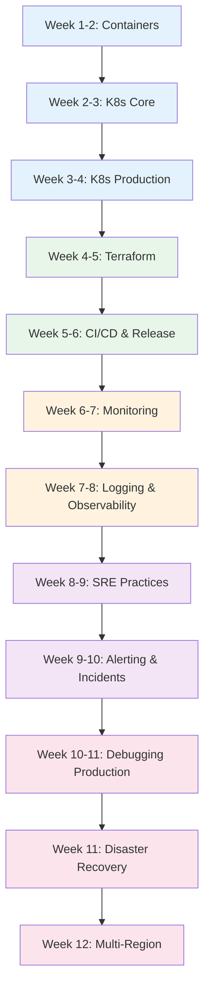

# DevOps Engineer Learning Path

A structured 12-week journey through the Knowledge Vault for DevOps engineers, SREs, and infrastructure engineers. This path takes you from containerization through orchestration, infrastructure as code, CI/CD pipelines, SRE practices, observability tools, incident response, debugging in production, disaster recovery, runbooks, and release engineering.

## Who This Is For

- Developers transitioning into DevOps or SRE roles
- Junior DevOps engineers building towards mid-level
- Backend engineers who want to own their production infrastructure
- Anyone preparing for SRE interviews

## Prerequisites

- Basic Linux command line (navigation, processes, permissions)
- Understanding of networking (TCP/IP, DNS, HTTP)
- Some experience with at least one cloud provider (AWS, GCP, or Azure)
- Familiarity with Git and CI/CD concepts

**Total estimated time**: ~55 hours across 12 weeks

## Learning Progression

---

## Week 1-2: Docker & Containers

*Estimated reading time: 4 hours*

Containers are the foundation of modern infrastructure. Understand how they work, how to build efficient images, and how to secure them.

- [ ] **Required** -- [Docker Overview](/infrastructure/docker/) *(15 min)*
- [ ] **Required** -- [Docker Internals](/infrastructure/docker/internals) *(30 min)*
- [ ] **Required** -- [Production Dockerfiles](/infrastructure/docker/production-dockerfiles) *(25 min)*
- [ ] **Required** -- [Multi-Stage Builds](/infrastructure/docker/multi-stage-builds) *(25 min)*
- [ ] **Required** -- [Image Optimization](/infrastructure/docker/image-optimization) *(25 min)*
- [ ] **Required** -- [Compose Patterns](/infrastructure/docker/compose-patterns) *(25 min)*
- [ ] **Required** -- [Security Hardening](/infrastructure/docker/security-hardening) *(25 min)*
- [ ] **Reference** -- [Docker Cheat Sheet](/cheat-sheets/docker) *(10 min)*
- [ ] **Reference** -- [Docker Compose Cheat Sheet](/cheat-sheets/docker-compose) *(10 min)*

::: tip Checkpoint
After this section you should be able to: write production-grade multi-stage Dockerfiles, optimize image size and layer caching, use Docker Compose for local development, and apply security best practices (non-root users, read-only filesystems, minimal base images).
:::

---

## Week 2-3: Kubernetes Fundamentals

*Estimated reading time: 4.5 hours*

Kubernetes is the standard for container orchestration. Start with the architecture and core resource types.

- [ ] **Required** -- [Kubernetes Overview](/infrastructure/kubernetes/) *(15 min)*
- [ ] **Required** -- [Architecture & Internals](/infrastructure/kubernetes/architecture-internals) *(35 min)*
- [ ] **Required** -- [Pod Lifecycle](/infrastructure/kubernetes/pod-lifecycle) *(25 min)*
- [ ] **Required** -- [Deployments & StatefulSets](/infrastructure/kubernetes/deployments-statefulsets) *(30 min)*
- [ ] **Required** -- [Services & Ingress](/infrastructure/kubernetes/services-ingress) *(25 min)*
- [ ] **Required** -- [Secrets Management](/infrastructure/kubernetes/secrets-management) *(25 min)*
- [ ] **Required** -- [Network Policies](/infrastructure/kubernetes/network-policies) *(25 min)*
- [ ] **Required** -- [Helm Charts](/infrastructure/kubernetes/helm-charts) *(25 min)*
- [ ] **Reference** -- [Kubernetes Cheat Sheet](/cheat-sheets/kubernetes) *(10 min)*
- [ ] **Reference** -- [Helm Cheat Sheet](/cheat-sheets/helm) *(10 min)*

::: tip Checkpoint
After this section you should be able to: explain the K8s control plane components, create Deployments and Services, configure health probes, manage secrets, and write basic Helm charts.
:::

---

## Week 3-4: Kubernetes Production

*Estimated reading time: 4 hours*

Running Kubernetes in production requires understanding scaling, security, debugging, and operational patterns.

- [ ] **Required** -- [RBAC](/infrastructure/kubernetes/rbac) *(25 min)*
- [ ] **Required** -- [HPA, VPA & KEDA](/infrastructure/kubernetes/hpa-vpa-keda) *(30 min)*
- [ ] **Required** -- [Production Checklist](/infrastructure/kubernetes/production-checklist) *(25 min)*
- [ ] **Required** -- [Troubleshooting](/infrastructure/kubernetes/troubleshooting) *(30 min)*
- [ ] **Required** -- [CNI Networking](/infrastructure/kubernetes/cni-networking) *(25 min)*
- [ ] **Optional** -- [Operators](/infrastructure/kubernetes/operators) *(25 min)*
- [ ] **Optional** -- [CRDs & Operators](/infrastructure/kubernetes/crds-operators) *(25 min)*
- [ ] **Optional** -- [Admission Webhooks](/infrastructure/kubernetes/admission-webhooks) *(25 min)*
- [ ] **Optional** -- [GitOps](/infrastructure/kubernetes/gitops) *(25 min)*
- [ ] **Optional** -- [ECS vs EKS](/infrastructure/aws/ecs-vs-eks) *(25 min)*
- [ ] **Optional** -- [GKE](/infrastructure/gcp/gke) *(25 min)*
- [ ] **Reference** -- [kubectl Advanced Cheat Sheet](/cheat-sheets/kubectl-advanced) *(10 min)*

::: tip Checkpoint
After this section you should be able to: configure RBAC policies, set up horizontal pod autoscaling, debug CrashLoopBackOff and OOMKilled pods, implement GitOps with ArgoCD/Flux, and understand CRDs and admission webhooks.
:::

---

## Week 4-5: Terraform & Infrastructure as Code

*Estimated reading time: 5 hours*

Manage infrastructure declaratively. Terraform is the most widely adopted IaC tool across cloud providers.

- [ ] **Required** -- [Terraform Overview](/infrastructure/terraform/) *(15 min)*
- [ ] **Required** -- [Terraform Fundamentals](/infrastructure/terraform/fundamentals) *(30 min)*
- [ ] **Required** -- [State Management](/infrastructure/terraform/state-management) *(30 min)*
- [ ] **Required** -- [Modules](/infrastructure/terraform/modules) *(25 min)*
- [ ] **Required** -- [Workspaces](/infrastructure/terraform/workspaces) *(20 min)*
- [ ] **Required** -- [Security Hardening](/infrastructure/terraform/security-hardening) *(25 min)*
- [ ] **Optional** -- [AWS Startup Stack](/infrastructure/terraform/aws-startup-stack) *(30 min)*
- [ ] **Optional** -- [GCP Startup Stack](/infrastructure/terraform/gcp-startup-stack) *(25 min)*
- [ ] **Optional** -- [Cost Optimization](/infrastructure/terraform/cost-optimization) *(20 min)*
- [ ] **Optional** -- [Multi-Region Terraform](/infrastructure/terraform/multi-region) *(25 min)*
- [ ] **Reference** -- [Terraform Cheat Sheet](/cheat-sheets/terraform) *(10 min)*

::: tip Checkpoint
After this section you should be able to: write modular Terraform configurations, manage remote state safely, use workspaces for environment separation, and apply security best practices to IaC.
:::

---

## Week 5-6: CI/CD Pipelines & Release Engineering

*Estimated reading time: 5 hours*

Automate building, testing, and deploying your applications with robust CI/CD pipelines and mature release practices.

### CI/CD

- [ ] **Required** -- [CI/CD Overview](/infrastructure/ci-cd/) *(15 min)*
- [ ] **Required** -- [Pipeline Patterns](/infrastructure/ci-cd/pipeline-patterns) *(25 min)*
- [ ] **Required** -- [GitHub Actions Deep Dive](/infrastructure/ci-cd/github-actions-deep-dive) *(30 min)*
- [ ] **Required** -- [Environment Promotion](/infrastructure/ci-cd/environment-promotion) *(25 min)*
- [ ] **Required** -- [Artifact Management](/infrastructure/ci-cd/artifact-management) *(20 min)*
- [ ] **Required** -- [Security Scanning](/infrastructure/ci-cd/security-scanning) *(25 min)*
- [ ] **Optional** -- [GitLab CI](/infrastructure/ci-cd/gitlab-ci) *(25 min)*

### Deployment & Release

- [ ] **Required** -- [Deployment Strategies Overview](/devops/deployment-strategies/) *(15 min)*
- [ ] **Required** -- [Blue-Green Deployments](/devops/deployment-strategies/blue-green) *(20 min)*
- [ ] **Required** -- [Canary Deployments](/devops/deployment-strategies/canary) *(20 min)*
- [ ] **Required** -- [Rolling Updates](/devops/deployment-strategies/rolling-updates) *(20 min)*
- [ ] **Required** -- [Release Engineering](/devops/release-engineering) *(25 min)*
- [ ] **Required** -- [Feature Flags](/devops/feature-flags) *(25 min)*
- [ ] **Optional** -- [Feature Flags for Deployment](/devops/deployment-strategies/feature-flags-deployment) *(20 min)*
- [ ] **Optional** -- [Rollback Procedures](/devops/deployment-strategies/rollback-procedures) *(20 min)*
- [ ] **Optional** -- [Database Migrations](/devops/deployment-strategies/database-migrations) *(25 min)*

::: tip Checkpoint
After this section you should be able to: design multi-stage CI/CD pipelines, implement blue-green and canary deployments, integrate security scanning into the pipeline, manage release trains with feature flags, and handle rollbacks safely.
:::

---

## Week 6-7: Monitoring & Metrics

*Estimated reading time: 3.5 hours*

You cannot manage what you cannot measure. Build comprehensive observability into your infrastructure.

- [ ] **Required** -- [Monitoring Overview](/devops/monitoring/) *(15 min)*
- [ ] **Required** -- [Metrics Design](/devops/monitoring/metrics-design) *(25 min)*
- [ ] **Required** -- [Prometheus Deep Dive](/devops/monitoring/prometheus-deep-dive) *(30 min)*
- [ ] **Required** -- [Grafana Dashboards](/devops/monitoring/grafana-dashboards) *(25 min)*
- [ ] **Required** -- [Custom Metrics](/devops/monitoring/custom-metrics) *(20 min)*
- [ ] **Required** -- [Observability Tools](/devops/observability-tools/) *(25 min)*
- [ ] **Optional** -- [Monitoring Anti-Patterns](/devops/monitoring/monitoring-antipatterns) *(20 min)*
- [ ] **Reference** -- [PromQL Cheat Sheet](/cheat-sheets/promql) *(10 min)*

::: tip Checkpoint
After this section you should be able to: design metrics using RED and USE methodologies, set up Prometheus with service discovery, build Grafana dashboards with meaningful alerts, and avoid common monitoring anti-patterns.
:::

---

## Week 7-8: Logging & Observability

*Estimated reading time: 3 hours*

Logs are your forensic trail. Learn structured logging, aggregation, and how to tie everything together with correlation IDs.

- [ ] **Required** -- [Logging Overview](/devops/logging/) *(10 min)*
- [ ] **Required** -- [Structured Logging](/devops/logging/structured-logging) *(25 min)*
- [ ] **Required** -- [Log Levels Strategy](/devops/logging/log-levels-strategy) *(20 min)*
- [ ] **Required** -- [Correlation IDs](/devops/logging/correlation-ids) *(20 min)*
- [ ] **Required** -- [Log Aggregation](/devops/logging/log-aggregation) *(25 min)*
- [ ] **Required** -- [Sensitive Data Redaction](/devops/logging/sensitive-data-redaction) *(20 min)*
- [ ] **Required** -- [Debugging in Production](/devops/debugging-production) *(25 min)*

::: tip Checkpoint
After this section you should be able to: implement structured JSON logging, design a log level strategy, propagate correlation IDs across services, set up centralized log aggregation, redact PII from logs, and debug production issues systematically.
:::

---

## Week 8-9: SRE Practices

*Estimated reading time: 4 hours*

SRE gives you the framework to balance reliability with velocity. Learn error budgets, SLOs, toil reduction, and capacity planning.

- [ ] **Required** -- [SRE Overview](/devops/sre/) *(15 min)*
- [ ] **Required** -- [SLI, SLO, SLA](/devops/sre/sli-slo-sla) *(25 min)*
- [ ] **Required** -- [Error Budgets](/devops/sre/error-budgets) *(25 min)*
- [ ] **Required** -- [Toil Reduction](/devops/sre/toil-reduction) *(25 min)*
- [ ] **Required** -- [Capacity Planning](/devops/sre/capacity-planning) *(25 min)*
- [ ] **Required** -- [On-Call Best Practices](/devops/alerting/on-call-best-practices) *(20 min)*
- [ ] **Optional** -- [On-Call Handbook](/devops/engineering-practices/on-call-handbook) *(25 min)*

### Checklists

- [ ] **Required** -- [Checklists Overview](/devops/checklists/) *(10 min)*
- [ ] **Required** -- [Pre-Launch Checklist](/devops/checklists/pre-launch) *(20 min)*
- [ ] **Required** -- [Security Review Checklist](/devops/checklists/security-review) *(20 min)*
- [ ] **Required** -- [Observability Readiness](/devops/checklists/observability-readiness) *(20 min)*
- [ ] **Optional** -- [Performance Review Checklist](/devops/checklists/performance-review) *(20 min)*

::: tip Checkpoint
After this section you should be able to: define SLOs and error budgets for your services, identify and reduce toil, plan capacity for growth, run effective on-call rotations, and use pre-launch checklists to prevent outages.
:::

---

## Week 9-10: Alerting & Incident Response

*Estimated reading time: 4 hours*

When things break -- and they will -- you need clear processes for detection, response, and learning.

### Alerting

- [ ] **Required** -- [Alerting Overview](/devops/alerting/) *(10 min)*
- [ ] **Required** -- [Alert Design](/devops/alerting/alert-design) *(25 min)*
- [ ] **Required** -- [Severity Levels](/devops/alerting/severity-levels) *(20 min)*
- [ ] **Required** -- [Escalation Policies](/devops/alerting/escalation-policies) *(20 min)*
- [ ] **Optional** -- [Runbook Templates](/devops/alerting/runbook-templates) *(20 min)*

### Incident Response

- [ ] **Required** -- [Incident Response Overview](/devops/incident-response/) *(10 min)*
- [ ] **Required** -- [Incident Classification](/devops/incident-response/incident-classification) *(20 min)*
- [ ] **Required** -- [War Room Procedures](/devops/incident-response/war-room-procedures) *(20 min)*
- [ ] **Required** -- [Postmortem Framework](/devops/incident-response/postmortem-framework) *(25 min)*
- [ ] **Required** -- [Chaos Engineering](/devops/incident-response/chaos-engineering) *(25 min)*
- [ ] **Optional** -- [Communication Templates](/devops/incident-response/communication-templates) *(15 min)*

### Runbooks

- [ ] **Required** -- [Runbooks Overview](/devops/runbooks/) *(10 min)*
- [ ] **Required** -- [Database Failover](/devops/runbooks/database-failover) *(20 min)*
- [ ] **Required** -- [DDoS Response](/devops/runbooks/ddos-response) *(20 min)*
- [ ] **Required** -- [Service Degradation](/devops/runbooks/service-degradation) *(20 min)*
- [ ] **Optional** -- [Certificate Rotation](/devops/runbooks/certificate-rotation) *(20 min)*

::: tip Checkpoint
After this section you should be able to: design alerts that reduce on-call fatigue, classify incidents by severity, run a war room, write blameless postmortems, execute runbooks for common failures, and introduce chaos engineering.
:::

---

## Week 10-11: Debugging in Production

*Estimated reading time: 3.5 hours*

Systematic approaches to diagnosing production problems based on symptoms, not guesses.

- [ ] **Required** -- [Debugging Playbooks Overview](/debugging-playbooks/) *(10 min)*
- [ ] **Required** -- [API Slow Response](/debugging-playbooks/api-slow) *(25 min)*
- [ ] **Required** -- [Intermittent 502](/debugging-playbooks/intermittent-502) *(25 min)*
- [ ] **Required** -- [Database CPU](/debugging-playbooks/database-cpu) *(25 min)*
- [ ] **Required** -- [Memory Leak](/debugging-playbooks/memory-leak) *(25 min)*
- [ ] **Required** -- [High Error Rate](/debugging-playbooks/high-error-rate) *(25 min)*
- [ ] **Required** -- [Pods Restarting](/debugging-playbooks/pods-restarting) *(20 min)*

::: tip Checkpoint
After this section you should be able to: systematically diagnose API latency spikes, intermittent 502 errors, database CPU exhaustion, memory leaks, and pod restart loops using structured playbooks.
:::

---

## Week 11: Disaster Recovery

*Estimated reading time: 3 hours*

Plan for the worst. Understand disaster recovery strategies, failover, and business continuity.

- [ ] **Required** -- [Disaster Recovery Overview](/devops/disaster-recovery/) *(25 min)*
- [ ] **Required** -- [Multi-Region Overview](/infrastructure/multi-region/) *(15 min)*
- [ ] **Required** -- [Data Replication](/infrastructure/multi-region/data-replication) *(25 min)*
- [ ] **Required** -- [Failover Strategies](/infrastructure/multi-region/failover-strategies) *(25 min)*
- [ ] **Optional** -- [Database Migrations](/devops/migrations/) *(15 min)*
- [ ] **Optional** -- [Cloud Migration](/devops/migrations/cloud-migration) *(25 min)*
- [ ] **Optional** -- [Monolith to Microservices](/devops/migrations/monolith-to-microservices) *(25 min)*

::: tip Checkpoint
After this section you should be able to: design disaster recovery plans with RPO/RTO targets, implement cross-region data replication, plan failover strategies, and manage large-scale migrations.
:::

---

## Week 12: Multi-Region & Advanced Infrastructure

*Estimated reading time: 4 hours*

Scale beyond a single region for high availability and global performance.

- [ ] **Required** -- [Architecture Patterns](/infrastructure/multi-region/architecture-patterns) *(30 min)*
- [ ] **Required** -- [Traffic Routing](/infrastructure/multi-region/traffic-routing) *(25 min)*
- [ ] **Optional** -- [Cost Analysis](/infrastructure/multi-region/cost-analysis) *(20 min)*

**Cloud Provider Deep Dives:**

- [ ] **Optional** -- [AWS VPC Networking](/infrastructure/aws/vpc-networking) *(25 min)*
- [ ] **Optional** -- [AWS IAM Deep Dive](/infrastructure/aws/iam-deep-dive) *(25 min)*
- [ ] **Optional** -- [AWS RDS & Aurora](/infrastructure/aws/rds-aurora) *(25 min)*
- [ ] **Optional** -- [AWS Lambda](/infrastructure/aws/lambda) *(20 min)*
- [ ] **Optional** -- [AWS Well-Architected](/infrastructure/aws/well-architected) *(25 min)*
- [ ] **Optional** -- [AWS Cost Optimization](/infrastructure/aws/cost-optimization) *(20 min)*
- [ ] **Optional** -- [GCP Cloud Run](/infrastructure/gcp/cloud-run) *(20 min)*
- [ ] **Optional** -- [GCP IAM](/infrastructure/gcp/iam) *(20 min)*
- [ ] **Optional** -- [GCP Pub/Sub](/infrastructure/gcp/pub-sub) *(20 min)*

::: tip Checkpoint
After this section you should be able to: design active-active and active-passive multi-region architectures, configure DNS-based traffic routing with health checks, and optimize cloud costs.
:::

---

## What You Will Be Able to Do After This Path

- Build and optimize Docker containers for production workloads
- Deploy and manage Kubernetes clusters with RBAC, autoscaling, and GitOps
- Write modular Terraform for multi-environment infrastructure
- Design CI/CD pipelines with security scanning and progressive deployment
- Define and enforce SLOs with error budgets
- Build observability stacks (metrics, logs, traces) from scratch
- Respond to incidents with runbooks, postmortems, and chaos engineering
- Debug production issues systematically using debugging playbooks
- Plan disaster recovery and multi-region architectures

## Cross-References to Related Paths

- **[Backend Engineer Path](/learning-paths/backend-engineer)** -- Deep dive into databases, caching, and application architecture
- **[Platform Engineer Path](/learning-paths/platform-engineer)** -- Build internal developer platforms on top of this foundation
- **[Security Engineer Path](/learning-paths/security-engineer)** -- Secure your infrastructure and pipelines
- **[System Design Interview Path](/learning-paths/system-design-interview)** -- Apply infrastructure knowledge to interview problems
- **[Cybersecurity Engineer Path](/learning-paths/cybersecurity-engineer)** -- Offensive and defensive security operations

---

::: info Total Progress
This path contains approximately 90 pages. At a pace of 5 pages per day, you can complete it in about 3 weeks. Weeks 1-6 form the core -- prioritize those if you are short on time.
:::
