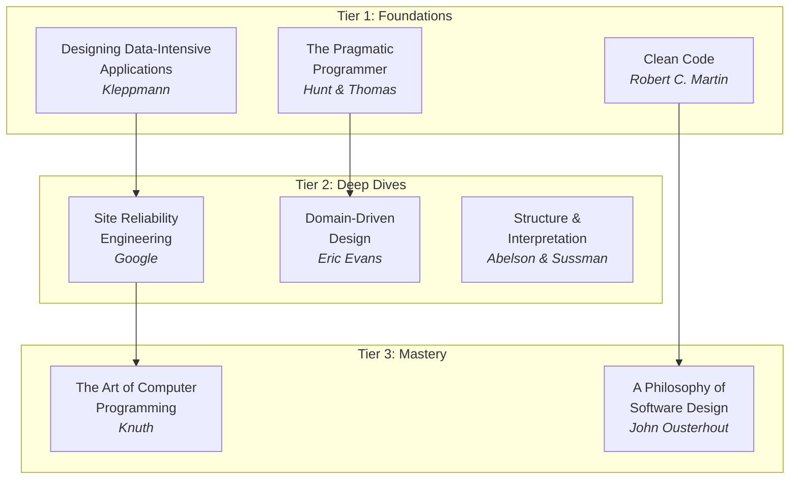
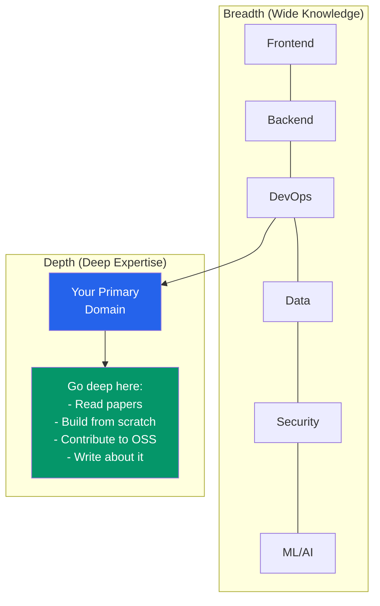

# Engineering Resources Guide

The best engineers are relentless learners. They read engineering blogs to understand how companies solve problems at scale, watch conference talks to learn new paradigms, study papers to understand the theory behind the tools, and read books to build deep foundational knowledge. This page curates the highest-signal resources across all these categories so you can skip the noise and focus on what actually makes you a better engineer.

## Engineering Blogs by Company

### Why Company Engineering Blogs Matter

Company engineering blogs are not marketing — they are detailed technical write-ups by engineers who built the systems. They describe real problems, real trade-offs, and real failures. Reading them teaches you patterns you will never learn in a textbook.

### Tier 1: Must-Read (Consistently Excellent)

| Company | Blog URL | Strengths | Notable Posts |
|---------|---------|-----------|---------------|
| **Netflix** | [netflixtechblog.com](https://netflixtechblog.com) | Distributed systems, resilience, chaos engineering, data pipelines | "Scaling Event Sourcing", "Zuul 2", "Chaos Monkey" |
| **Uber** | [eng.uber.com](https://eng.uber.com) | Real-time systems, geospatial, payments, platform engineering | "Schemaless", "Ringpop", "H3 Geo Index" |
| **Stripe** | [stripe.com/blog/engineering](https://stripe.com/blog/engineering) | API design, idempotency, payments infrastructure, Ruby/Sorbet | "Idempotency Keys", "Online Migrations", "Sorbet Type System" |
| **Cloudflare** | [blog.cloudflare.com](https://blog.cloudflare.com) | Networking, DNS, edge computing, security, performance | "HTTP/3", "1.1.1.1", "Workers Architecture" |
| **Discord** | [discord.com/blog](https://discord.com/blog) | Real-time messaging at scale, Rust migration, data storage | "Switching from Go to Rust", "Storing Trillions of Messages", "Data Infrastructure" |

### Tier 2: Excellent (Frequent High-Quality Posts)

| Company | Strengths |
|---------|-----------|
| **Google** ([research.google/blog](https://research.google/blog)) | Infrastructure, ML, search, distributed systems (MapReduce, Spanner, Borg) |
| **Meta** ([engineering.fb.com](https://engineering.fb.com)) | React, mobile, infrastructure, ML at scale |
| **LinkedIn** ([engineering.linkedin.com/blog](https://engineering.linkedin.com/blog)) | Kafka, data infrastructure, search, real-time systems |
| **Airbnb** ([medium.com/airbnb-engineering](https://medium.com/airbnb-engineering)) | Frontend architecture, ML, payments, microservices migration |
| **Shopify** ([shopify.engineering](https://shopify.engineering)) | Ruby on Rails at scale, resilience, platform engineering |
| **GitHub** ([github.blog/engineering](https://github.blog/engineering)) | Git internals, code search, infrastructure, Rails at scale |
| **Figma** ([figma.com/blog/engineering](https://figma.com/blog/engineering)) | Real-time collaboration, CRDTs, multiplayer architecture |
| **Datadog** ([datadoghq.com/blog/engineering](https://www.datadoghq.com/blog/engineering)) | Observability, monitoring, high-throughput data pipelines |

### Tier 3: Specialized (Deep in Specific Domains)

| Company | Domain Focus |
|---------|-------------|
| **Fly.io** ([fly.io/blog](https://fly.io/blog)) | Edge computing, containers, distributed systems |
| **Vercel** ([vercel.com/blog](https://vercel.com/blog)) | Frontend infrastructure, Next.js, edge functions |
| **PlanetScale** ([planetscale.com/blog](https://planetscale.com/blog)) | Database engineering, Vitess, MySQL at scale |
| **Cockroach Labs** ([cockroachlabs.com/blog](https://www.cockroachlabs.com/blog)) | Distributed SQL, consensus, database internals |
| **Tailscale** ([tailscale.com/blog](https://tailscale.com/blog)) | Networking, WireGuard, NAT traversal |

## Individual Engineering Blogs

Some of the best technical writing comes from individual engineers:

| Author | Blog | Known For |
|--------|------|-----------|
| **Julia Evans** | [jvns.ca](https://jvns.ca) | Networking, Linux, systems — accessible, visual explanations |
| **Dan Abramov** | [overreacted.io](https://overreacted.io) | React internals, JavaScript, mental models |
| **Martin Kleppmann** | [martin.kleppmann.com](https://martin.kleppmann.com) | Distributed systems, CRDTs, data-intensive applications |
| **Charity Majors** | [charity.wtf](https://charity.wtf) | Observability, engineering management, SRE |
| **Will Larson** | [lethain.com](https://lethain.com) | Engineering management, systems thinking, org design |
| **Jessie Frazelle** | [jess.dev](https://jess.dev) | Containers, Linux internals, hardware |
| **Tania Rascia** | [taniarascia.com](https://taniarascia.com) | Web development, tutorials, fundamentals |
| **Alex Xu** | [blog.bytebytego.com](https://blog.bytebytego.com) | System design, visual explanations |
| **The Pragmatic Engineer (Gergely Orosz)** | [pragmaticengineer.com](https://pragmaticengineer.com) | Engineering culture, industry trends, career advice |

## Must-Watch Conference Talks

### Distributed Systems

| Talk | Speaker | Event | Why Watch |
|------|---------|-------|-----------|
| "Turning the database inside-out" | Martin Kleppmann | Strange Loop 2014 | Reframes databases as log-oriented systems |
| "How NOT to Measure Latency" | Gil Tene | Strange Loop 2015 | Coordinated omission, HDR histograms — required viewing |
| "The Language of the System" | Rich Hickey | Clojure/conj 2012 | Values, identity, state — foundational systems thinking |
| "Jepsen" series | Kyle Kingsbury | Various | Breaking distributed databases; learn what "CP" and "AP" really mean |
| "Consistency without Consensus" | Peter Bourgon | GOTO 2016 | CRDTs and eventual consistency in practice |

### Software Design

| Talk | Speaker | Event | Why Watch |
|------|---------|-------|-----------|
| "Simple Made Easy" | Rich Hickey | Strange Loop 2011 | The difference between "simple" and "easy" — career-changing |
| "The Art of Destroying Software" | Greg Young | Vimeo 2014 | Why small services that can be rewritten in 2 weeks beat everything |
| "Boundaries" | Gary Bernhardt | RubyConf 2012 | Functional core, imperative shell — 30 min that changes how you design |
| "Nothing is Something" | Sandi Metz | RailsConf 2015 | Composition over inheritance, null object pattern |
| "All the Little Things" | Sandi Metz | RailsConf 2014 | How to break down a God class step by step |

### Performance & Reliability

| Talk | Speaker | Event | Why Watch |
|------|---------|-------|-----------|
| "Performance Matters" | Emery Berger | Strange Loop 2019 | Why microbenchmarks lie and how to measure properly |
| "Debugging Under Fire" | Bryan Cantrill | GOTO 2018 | Production debugging war stories from DTrace's creator |
| "Breaking Things on Purpose" | Kolton Andrus | QCon 2018 | Netflix's chaos engineering philosophy |

### Frontend & Web

| Talk | Speaker | Event | Why Watch |
|------|---------|-------|-----------|
| "Hot Takes on the Web" | Rich Harris | JSConf 2024 | Creator of Svelte on the future of web frameworks |
| "Rethinking Reactivity" | Rich Harris | You Gotta Love Frontend 2019 | Why Svelte's compile-time approach works |
| "In the Loop" | Jake Archibald | JSConf.Asia 2018 | The event loop visualized — best explanation ever made |
| "What the heck is the event loop anyway?" | Philip Roberts | JSConf EU 2014 | The classic event loop talk, still relevant |

## Must-Read Books

### Foundational (Read These First)

### By Topic

#### System Design & Architecture

| Book | Author | Key Takeaway |
|------|--------|-------------|
| **Designing Data-Intensive Applications** | Martin Kleppmann | The single best book on distributed systems for practitioners |
| **System Design Interview** (Vol 1 & 2) | Alex Xu | Practical system design frameworks for interviews and real work |
| **Building Microservices** (2nd ed) | Sam Newman | When and how to decompose monoliths |
| **A Philosophy of Software Design** | John Ousterhout | Complexity is the enemy; deep modules over shallow ones |
| **Domain-Driven Design** | Eric Evans | Ubiquitous language, bounded contexts, aggregates |

#### Software Craft

| Book | Author | Key Takeaway |
|------|--------|-------------|
| **The Pragmatic Programmer** (20th Anniversary) | Hunt & Thomas | Timeless advice on being a professional developer |
| **Clean Code** | Robert C. Martin | Naming, functions, comments — read critically, not religiously |
| **Refactoring** (2nd ed) | Martin Fowler | Catalog of refactoring techniques with JavaScript examples |
| **Working Effectively with Legacy Code** | Michael Feathers | How to add tests to untestable code |
| **Code Complete** (2nd ed) | Steve McConnell | The encyclopedia of software construction |

#### DevOps & Reliability

| Book | Author | Key Takeaway |
|------|--------|-------------|
| **Site Reliability Engineering** | Google (Beyer et al.) | SLOs, error budgets, toil reduction — the SRE bible |
| **The Phoenix Project** | Gene Kim | DevOps principles as a novel — accessible introduction |
| **Accelerate** | Forsgren, Humble, Kim | DORA metrics — scientific evidence for DevOps practices |
| **Release It!** (2nd ed) | Michael Nygard | Stability patterns: circuit breakers, bulkheads, timeouts |

#### Engineering Management

| Book | Author | Key Takeaway |
|------|--------|-------------|
| **An Elegant Puzzle** | Will Larson | Systems thinking for engineering management |
| **The Manager's Path** | Camille Fournier | From IC to CTO — every level of the management ladder |
| **Staff Engineer** | Will Larson | What staff+ engineers actually do day-to-day |
| **Team Topologies** | Skelton & Pais | Stream-aligned, enabling, platform, complicated-subsystem teams |

::: tip
If you read only one book from this entire list, make it **Designing Data-Intensive Applications**. It covers replication, partitioning, transactions, batch processing, stream processing, and consistency — the topics that come up in every system design interview and every architecture decision.
:::

## Must-Read Papers

### The Foundational Papers

| Paper | Year | Why It Matters |
|-------|------|---------------|
| **"MapReduce: Simplified Data Processing on Large Clusters"** | 2004 | The paper that launched big data; influenced Hadoop |
| **"Dynamo: Amazon's Highly Available Key-Value Store"** | 2007 | Inspired DynamoDB, Cassandra, Riak — core distributed systems concepts |
| **"The Google File System"** | 2003 | Influenced HDFS and modern distributed storage design |
| **"Bigtable: A Distributed Storage System"** | 2006 | Influenced HBase, Cassandra column families |
| **"Spanner: Google's Globally-Distributed Database"** | 2012 | TrueTime, globally-consistent distributed transactions |
| **"Raft: In Search of an Understandable Consensus Algorithm"** | 2014 | Easier-to-understand Paxos alternative; used in etcd, CockroachDB |
| **"Time, Clocks, and the Ordering of Events"** | 1978 | Lamport clocks — foundational to all distributed systems |
| **"A Note on Distributed Computing"** | 1994 | Why treating remote calls like local calls is fundamentally wrong |

### Modern Papers (2018-2026)

| Paper | Year | Topic |
|-------|------|-------|
| **"Zanzibar: Google's Consistent, Global Auth System"** | 2019 | Permission systems at scale; inspired SpiceDB, Authzed |
| **"Monarch: Google's Planet-Scale Monitoring"** | 2020 | Time-series monitoring architecture |
| **"Attention Is All You Need"** | 2017 | The Transformer architecture — foundation of modern AI |
| **"Scaling Laws for Neural Language Models"** | 2020 | Why bigger models get better and how to predict performance |
| **"TAO: Facebook's Distributed Data Store for the Social Graph"** | 2013 | Graph data at massive scale |
| **"Metaflow: A Human-Centric Framework for Data Science"** | 2019 | Netflix's ML infrastructure philosophy |

### Where to Find Papers

| Source | Description |
|--------|-------------|
| [papers-we-love](https://github.com/papers-we-love/papers-we-love) | Curated collection with community discussions |
| [the morning paper](https://blog.acolyer.org/) | Adrian Colyer's paper summaries (archived, still invaluable) |
| [arxiv.org](https://arxiv.org) | Preprint server; search for CS papers |
| [USENIX](https://www.usenix.org/publications) | Systems conferences: OSDI, NSDI, ATC |
| [ACM Digital Library](https://dl.acm.org/) | Comprehensive CS research archive |

## Podcasts

### Active Podcasts (2026)

| Podcast | Host(s) | Focus | Episode Length |
|---------|---------|-------|---------------|
| **Software Engineering Daily** | Various | Deep dives into specific technologies | 45-60 min |
| **The Changelog** | Adam Stacoviak, Jerod Santo | Open source, software development | 60-90 min |
| **CoRecursive** | Adam Gordon Bell | Stories behind famous codebases and decisions | 40-60 min |
| **Ship It!** | The Changelog team | DevOps, deployment, infrastructure | 30-45 min |
| **Syntax** | Wes Bos, Scott Tolinski | Web development, frontend, tooling | 30-60 min |
| **Go Time** | Mat Ryer et al. | Go ecosystem, architecture | 45-60 min |
| **Rust in Production** | Matthias Endler | Companies using Rust in production | 30-45 min |
| **The Pragmatic Engineer** | Gergely Orosz | Industry trends, big tech insights | 30-60 min |
| **Thoughtworks Technology Podcast** | Various | Architecture, practices, industry trends | 30-45 min |

## Newsletters

### Must-Subscribe

| Newsletter | Author | Frequency | Focus |
|-----------|--------|-----------|-------|
| **The Pragmatic Engineer** | Gergely Orosz | 2x/week | Industry analysis, big tech insights, career |
| **ByteByteGo** | Alex Xu | Weekly | System design, visual explanations |
| **TLDR** | Dan Ni | Daily | Tech news digest — 5 min read |
| **Pointer** | Zach Lloyd | Daily | Best engineering articles curated |
| **Software Lead Weekly** | Oren Ellenbogen | Weekly | Engineering leadership, management |
| **Quastor** | Justin Gage | 3x/week | System design case studies |
| **Console** | David Mytton | Weekly | Developer tools, open source |
| **React Status** | Peter Cooper | Weekly | React ecosystem updates |
| **Node Weekly** | Peter Cooper | Weekly | Node.js ecosystem updates |
| **Golang Weekly** | Peter Cooper | Weekly | Go ecosystem updates |

## Learning Platforms

### For Depth (Courses)

| Platform | Best For | Cost |
|----------|----------|------|
| **MIT OpenCourseWare** | CS fundamentals (6.824 distributed systems is legendary) | Free |
| **Coursera** | University courses, specializations | Free to audit, paid for certificates |
| **educative.io** | System design, coding interviews | Subscription |
| **frontendmasters.com** | Frontend deep dives, instructor quality | Subscription |
| **neetcode.io** | Algorithm patterns, interview prep | Free + paid |
| **pluralsight.com** | Enterprise tech stacks, cloud certifications | Subscription |

### For Breadth (Practice)

| Platform | Best For |
|----------|----------|
| **LeetCode** | Algorithm practice, company-specific problems |
| **Exercism** | Learning new programming languages through practice |
| **Advent of Code** | Annual December puzzle challenge — algorithmic thinking |
| **Project Euler** | Mathematical/computational problems |
| **Hacker News** | Daily dose of engineering articles and discussions |

::: warning
Avoid tutorial hell. Watching courses and reading blogs without building things creates an illusion of learning. For every hour of consumption, spend at least two hours building. The best learning loop: read/watch → build → get stuck → research → build more.
:::

## Open Source Projects to Study

Reading code from well-engineered open source projects is one of the best ways to learn patterns used in production.

| Project | Language | What You Learn |
|---------|----------|---------------|
| **Redis** | C | Elegant data structures, event loop design, single-threaded performance |
| **SQLite** | C | The most-deployed database in the world; impeccable testing (100% branch coverage) |
| **Postgres** | C | MVCC, query planning, extensibility architecture |
| **Go standard library** | Go | Clean API design, concurrency patterns, documentation standards |
| **React** | JavaScript | Fiber architecture, reconciliation algorithm, hooks implementation |
| **Next.js** | TypeScript | Server components, hybrid rendering, build system design |
| **Kubernetes** | Go | Distributed systems patterns, controller pattern, API design |
| **Tokio** | Rust | Async runtime design, work-stealing scheduler |
| **FastAPI** | Python | Type-driven API design, dependency injection, auto-documentation |
| **Tailwind CSS** | JavaScript | Build tool plugins, utility-first CSS methodology, JIT compilation |

### How to Study Codebases

1. **Start with the README and architecture docs** — understand the high-level design before diving into code
2. **Read tests first** — tests show intended behavior and common usage patterns
3. **Trace a single request** — follow one HTTP request from entry to response through the entire system
4. **Read git blame on complex files** — commit messages explain *why* the code evolved this way
5. **Build it locally and experiment** — modify things, break things, understand through experimentation

## Communities and Conferences

### Top Engineering Conferences

| Conference | Focus | Format |
|-----------|-------|--------|
| **Strange Loop** | Multi-paradigm, distributed systems, languages | In-person (St. Louis) |
| **QCon** | Software architecture, engineering leadership | In-person (multiple cities) + online |
| **GOTO** | Software development, architecture | In-person (multiple cities) + online |
| **KubeCon** | Cloud native, Kubernetes, CNCF ecosystem | In-person + online |
| **React Conf** | React ecosystem | In-person |
| **RustConf** | Rust language and ecosystem | In-person |
| **P99 CONF** | Performance engineering, low-latency systems | Online |
| **SREcon** | Site reliability engineering, operations | In-person |

### Online Communities

| Community | Platform | Best For |
|-----------|----------|----------|
| **Hacker News** | Web | General tech discussion, high signal-to-noise |
| **r/programming** | Reddit | Broad programming topics |
| **r/ExperiencedDevs** | Reddit | Senior engineer discussions, career advice |
| **Dev.to** | Web | Beginner-friendly tutorials and discussions |
| **Lobste.rs** | Web | Curated, invite-only tech discussion |
| **Discord (various)** | Discord | Language-specific communities (Rust, Go, TypeScript) |

## Building a Learning System

### The T-Shaped Engineer

### Weekly Learning Schedule

| Day | Activity | Time | Resource Type |
|-----|----------|------|---------------|
| Monday | Read engineering blog post | 30 min | Company blog |
| Tuesday | Watch conference talk | 45 min | YouTube/conference |
| Wednesday | Read book chapter | 30 min | Technical book |
| Thursday | Build / experiment | 60 min | Side project |
| Friday | Read paper summary | 20 min | Papers We Love |
| Weekend | Deep dive project | 2-3 hours | Hands-on building |

## Related Pages

- [Backend Engineer](/learning-paths/backend-engineer) — structured path for backend specialization
- [Frontend Engineer](/learning-paths/frontend-engineer) — structured path for frontend specialization
- [System Design Interview](/learning-paths/system-design-interview) — preparing for system design interviews
- [DevOps Engineer](/learning-paths/devops-engineer) — structured path for DevOps and SRE
- [Performance Benchmarks Reference](/performance/benchmarks) — the numbers every engineer should know
