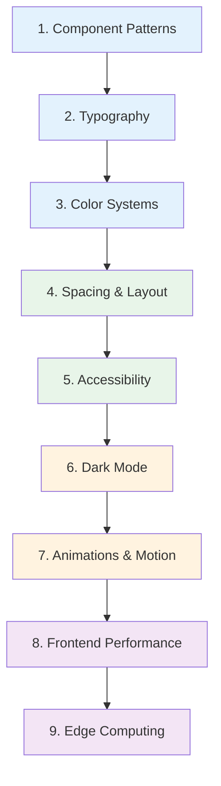

# Frontend Engineer Learning Path

A structured journey through the Knowledge Vault for frontend engineers building design systems, accessible interfaces, and high-performance applications. This path covers component patterns, typography, color systems, spacing, accessibility, dark mode, animations, performance optimization, and edge computing.

**Total estimated time**: ~20 hours across 9 sections

## Learning Progression

---

## Section 1: Component Patterns

*Estimated reading time: 3 hours*

The foundation of frontend engineering is building reusable, composable, maintainable components. These patterns are framework-agnostic and apply to React, Vue, Svelte, and web components.

- [ ] **Required** — [Component Patterns Overview](/ui-design-systems/component-patterns/) *(15 min)*
- [ ] **Required** — [Atomic Design](/ui-design-systems/component-patterns/atomic-design) *(25 min)*
- [ ] **Required** — [Compound Components](/ui-design-systems/component-patterns/compound-components) *(25 min)*
- [ ] **Required** — [Controlled vs Uncontrolled](/ui-design-systems/component-patterns/controlled-uncontrolled) *(20 min)*
- [ ] **Required** — [Headless Components](/ui-design-systems/component-patterns/headless-components) *(25 min)*
- [ ] **Optional** — [Render Props & Hooks](/ui-design-systems/component-patterns/render-props-hooks) *(25 min)*
- [ ] **Optional** — [Polymorphic Components](/ui-design-systems/component-patterns/polymorphic-components) *(20 min)*
- [ ] **Optional** — [Slot Pattern](/ui-design-systems/component-patterns/slot-pattern) *(20 min)*

::: tip Checkpoint
After this section you should be able to: structure a component library using atomic design, build compound components with shared state, choose between controlled and uncontrolled patterns, and implement headless UI components.
:::

---

## Section 2: Typography

*Estimated reading time: 2 hours*

Typography is the backbone of any interface. Good type systems improve readability, establish hierarchy, and create visual rhythm.

- [ ] **Required** — [Typography Overview](/ui-design-systems/typography/) *(10 min)*
- [ ] **Required** — [Type Scale](/ui-design-systems/typography/type-scale) *(25 min)*
- [ ] **Required** — [Responsive Typography](/ui-design-systems/typography/responsive-typography) *(25 min)*
- [ ] **Required** — [Font Loading](/ui-design-systems/typography/font-loading) *(25 min)*
- [ ] **Optional** — [Variable Fonts](/ui-design-systems/typography/variable-fonts) *(20 min)*

::: tip Checkpoint
After this section you should be able to: define a modular type scale, implement fluid typography with clamp(), optimize font loading to prevent layout shifts, and use variable fonts for performance and flexibility.
:::

---

## Section 3: Color Systems

*Estimated reading time: 2 hours*

Color is one of the most powerful design tools. Learn to build systematic, accessible, and themeable color palettes.

- [ ] **Required** — [Color Tokens Overview](/ui-design-systems/color-tokens/) *(10 min)*
- [ ] **Required** — [Color Theory](/ui-design-systems/color-tokens/color-theory) *(25 min)*
- [ ] **Required** — [Semantic Tokens](/ui-design-systems/color-tokens/semantic-tokens) *(25 min)*
- [ ] **Required** — [Contrast & Accessibility](/ui-design-systems/color-tokens/contrast-accessibility) *(25 min)*
- [ ] **Optional** — [Palette Generation](/ui-design-systems/color-tokens/palette-generation) *(20 min)*

::: tip Checkpoint
After this section you should be able to: build a color token system with primitive and semantic layers, ensure WCAG AA/AAA contrast compliance, and generate harmonious palettes programmatically.
:::

---

## Section 4: Spacing & Layout

*Estimated reading time: 2 hours*

Consistent spacing and responsive layouts create visual order and adapt gracefully across screen sizes.

- [ ] **Required** — [Spacing & Layout Overview](/ui-design-systems/spacing-layout/) *(10 min)*
- [ ] **Required** — [Spacing Scale](/ui-design-systems/spacing-layout/spacing-scale) *(25 min)*
- [ ] **Required** — [Layout Patterns](/ui-design-systems/spacing-layout/layout-patterns) *(25 min)*
- [ ] **Required** — [Responsive Breakpoints](/ui-design-systems/spacing-layout/responsive-breakpoints) *(25 min)*
- [ ] **Optional** — [Container Queries](/ui-design-systems/spacing-layout/container-queries) *(20 min)*

::: tip Checkpoint
After this section you should be able to: define a spacing scale based on a base unit, implement common layout patterns with CSS Grid and Flexbox, design a breakpoint system, and use container queries for component-level responsiveness.
:::

---

## Section 5: Accessibility

*Estimated reading time: 2.5 hours*

Accessibility is not optional. Learn to build interfaces that work for everyone, including users of assistive technologies.

- [ ] **Required** — [Accessibility Overview](/ui-design-systems/accessibility/) *(15 min)*
- [ ] **Required** — [ARIA Deep Dive](/ui-design-systems/accessibility/aria-deep-dive) *(30 min)*
- [ ] **Required** — [Keyboard Navigation](/ui-design-systems/accessibility/keyboard-navigation) *(25 min)*
- [ ] **Required** — [Focus Management](/ui-design-systems/accessibility/focus-management) *(25 min)*
- [ ] **Required** — [Testing Accessibility](/ui-design-systems/accessibility/testing-accessibility) *(25 min)*
- [ ] **Optional** — [Screen Reader Patterns](/ui-design-systems/accessibility/screen-reader-patterns) *(20 min)*

::: tip Checkpoint
After this section you should be able to: use ARIA roles and properties correctly, implement full keyboard navigation, manage focus in modals and dynamic content, and test accessibility with automated tools and screen readers.
:::

---

## Section 6: Dark Mode

*Estimated reading time: 1.5 hours*

Dark mode is a user expectation. Learn to implement it systematically using design tokens.

- [ ] **Required** — [Dark Mode Overview](/ui-design-systems/dark-mode/) *(10 min)*
- [ ] **Required** — [Implementation Patterns](/ui-design-systems/dark-mode/implementation-patterns) *(25 min)*
- [ ] **Required** — [Token Mapping](/ui-design-systems/dark-mode/token-mapping) *(25 min)*
- [ ] **Optional** — [System Preference Detection](/ui-design-systems/dark-mode/system-preference-detection) *(15 min)*
- [ ] **Optional** — [Image Handling](/ui-design-systems/dark-mode/image-handling) *(15 min)*

::: tip Checkpoint
After this section you should be able to: implement dark mode using CSS custom properties and semantic tokens, respect system preferences with prefers-color-scheme, and handle images and illustrations in dark contexts.
:::

---

## Section 7: Animations & Motion

*Estimated reading time: 2.5 hours*

Motion brings interfaces to life. Learn the principles of good animation and how to implement them performantly.

- [ ] **Required** — [Animations Overview](/ui-design-systems/animations/) *(10 min)*
- [ ] **Required** — [Motion Principles](/ui-design-systems/animations/motion-principles) *(25 min)*
- [ ] **Required** — [CSS Animations](/ui-design-systems/animations/css-animations) *(25 min)*
- [ ] **Required** — [Timing Curves](/ui-design-systems/animations/timing-curves) *(20 min)*
- [ ] **Required** — [Performance Considerations](/ui-design-systems/animations/performance-considerations) *(25 min)*
- [ ] **Optional** — [Framer Motion Patterns](/ui-design-systems/animations/framer-motion-patterns) *(25 min)*
- [ ] **Optional** — [Gesture Animations](/ui-design-systems/animations/gesture-animations) *(20 min)*

::: tip Checkpoint
After this section you should be able to: apply the 12 principles of animation to UI motion, implement CSS transitions and keyframe animations, choose appropriate timing curves, use the FLIP technique for performant layout animations, and respect prefers-reduced-motion.
:::

---

## Section 8: Frontend Performance

*Estimated reading time: 2.5 hours*

Performance is a feature. Learn to profile, measure, and optimize frontend applications.

- [ ] **Required** — [Browser Profiling](/performance/profiling/browser-profiling) *(30 min)*
- [ ] **Required** — [Node.js Profiling](/performance/profiling/nodejs-profiling) *(25 min)*
- [ ] **Required** — [V8 Optimization](/performance/optimization/v8-optimization) *(25 min)*
- [ ] **Required** — [Memory Management](/performance/optimization/memory-management) *(25 min)*
- [ ] **Optional** — [Node.js Event Loop](/performance/optimization/nodejs-event-loop) *(25 min)*
- [ ] **Optional** — [Worker Threads](/performance/optimization/worker-threads) *(20 min)*
- [ ] **Optional** — [Algorithmic Optimization](/performance/optimization/algorithmic-optimization) *(20 min)*

::: tip Checkpoint
After this section you should be able to: use Chrome DevTools Performance panel effectively, profile memory leaks, understand V8 hidden classes and inline caches, and optimize critical rendering paths.
:::

---

## Section 9: Edge Computing

*Estimated reading time: 1.5 hours*

The frontier of frontend architecture: running code at the edge, closer to users, with sub-millisecond cold starts.

- [ ] **Required** — [Edge Computing Overview](/performance/edge-computing/) *(10 min)*
- [ ] **Required** — [Edge Runtime Constraints](/performance/edge-computing/edge-runtime-constraints) *(20 min)*
- [ ] **Required** — [Cloudflare Workers](/performance/edge-computing/cloudflare-workers) *(25 min)*
- [ ] **Optional** — [Vercel Edge](/performance/edge-computing/vercel-edge) *(20 min)*
- [ ] **Optional** — [Deno Deploy](/performance/edge-computing/deno-deploy) *(20 min)*

::: tip Checkpoint
After this section you should be able to: understand edge runtime limitations (no Node.js APIs, limited execution time), build edge functions on Cloudflare Workers, and decide when edge computing is the right choice vs traditional server-side rendering.
:::

---

## What to Read Next

After completing this path, consider:

- **[Backend Engineer Path](/learning-paths/backend-engineer)** — Understand the APIs and databases your frontend talks to
- **[Security Engineer Path](/learning-paths/security-engineer)** — Learn about XSS, CSRF, CSP headers, and frontend security
- **[Prompt Engineering for UI](/prompt-engineering/ui-prompts/)** — Use AI to generate components, design systems, and accessibility audits
- **[Production Blueprints](/production-blueprints/)** — See how complete systems are designed end to end

---

::: info Total Progress
This path contains approximately 45 pages. At a pace of 5 pages per day, you can complete it in about 9 days. Sections 1-5 cover the essentials -- prioritize those if time is limited.
:::
