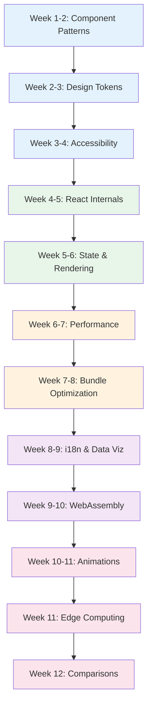

# Frontend Engineer Learning Path

A structured 12-week journey through the Knowledge Vault for frontend engineers building design systems, accessible interfaces, high-performance applications, and modern web experiences. This path covers component patterns, React internals, WebAssembly, internationalization, data visualization, bundle optimization, accessibility, animations, edge computing, and framework comparisons.

## Who This Is For

- Junior frontend engineers leveling up to mid/senior
- Backend engineers transitioning to full-stack with frontend depth
- UI/UX developers wanting deeper engineering knowledge
- Anyone preparing for frontend-focused interviews

## Prerequisites

- HTML, CSS, JavaScript fundamentals
- Basic experience with at least one frontend framework (React, Vue, or Svelte)
- Understanding of HTTP, REST APIs, and browser DevTools
- Familiarity with npm/pnpm and modern build tools

**Total estimated time**: ~45 hours across 12 weeks

## Learning Progression

---

## Week 1-2: Component Patterns

*Estimated reading time: 4 hours*

The foundation of frontend engineering is building reusable, composable, maintainable components. These patterns are framework-agnostic.

- [ ] **Required** -- [Component Patterns Overview](/ui-design-systems/component-patterns/) *(15 min)*
- [ ] **Required** -- [Atomic Design](/ui-design-systems/component-patterns/atomic-design) *(25 min)*
- [ ] **Required** -- [Compound Components](/ui-design-systems/component-patterns/compound-components) *(25 min)*
- [ ] **Required** -- [Controlled vs Uncontrolled](/ui-design-systems/component-patterns/controlled-uncontrolled) *(20 min)*
- [ ] **Required** -- [Headless Components](/ui-design-systems/component-patterns/headless-components) *(25 min)*
- [ ] **Required** -- [Render Props & Hooks](/ui-design-systems/component-patterns/render-props-hooks) *(25 min)*
- [ ] **Optional** -- [Polymorphic Components](/ui-design-systems/component-patterns/polymorphic-components) *(20 min)*
- [ ] **Optional** -- [Slot Pattern](/ui-design-systems/component-patterns/slot-pattern) *(20 min)*

::: tip Checkpoint
After this section you should be able to: structure a component library using atomic design, build compound components with shared state, choose between controlled and uncontrolled patterns, and implement headless UI components.
:::

---

## Week 2-3: Design Tokens & Systems

*Estimated reading time: 4 hours*

Design tokens create consistent, themeable, scalable design systems. Cover typography, color, spacing, and dark mode.

### Typography

- [ ] **Required** -- [Typography Overview](/ui-design-systems/typography/) *(10 min)*
- [ ] **Required** -- [Type Scale](/ui-design-systems/typography/type-scale) *(25 min)*
- [ ] **Required** -- [Responsive Typography](/ui-design-systems/typography/responsive-typography) *(25 min)*
- [ ] **Required** -- [Font Loading](/ui-design-systems/typography/font-loading) *(25 min)*
- [ ] **Optional** -- [Variable Fonts](/ui-design-systems/typography/variable-fonts) *(20 min)*

### Color & Spacing

- [ ] **Required** -- [Color Tokens Overview](/ui-design-systems/color-tokens/) *(10 min)*
- [ ] **Required** -- [Color Theory](/ui-design-systems/color-tokens/color-theory) *(25 min)*
- [ ] **Required** -- [Semantic Tokens](/ui-design-systems/color-tokens/semantic-tokens) *(25 min)*
- [ ] **Required** -- [Contrast & Accessibility](/ui-design-systems/color-tokens/contrast-accessibility) *(25 min)*
- [ ] **Required** -- [Spacing Scale](/ui-design-systems/spacing-layout/spacing-scale) *(25 min)*
- [ ] **Required** -- [Layout Patterns](/ui-design-systems/spacing-layout/layout-patterns) *(25 min)*

### Dark Mode

- [ ] **Required** -- [Dark Mode Overview](/ui-design-systems/dark-mode/) *(10 min)*
- [ ] **Required** -- [Implementation Patterns](/ui-design-systems/dark-mode/implementation-patterns) *(25 min)*
- [ ] **Optional** -- [Token Mapping](/ui-design-systems/dark-mode/token-mapping) *(25 min)*

::: tip Checkpoint
After this section you should be able to: define a modular type scale with fluid typography, build semantic color token systems, implement dark mode with CSS custom properties, and design responsive spacing scales.
:::

---

## Week 3-4: Accessibility

*Estimated reading time: 3 hours*

Accessibility is not optional. Learn to build interfaces that work for everyone.

- [ ] **Required** -- [Accessibility Overview](/ui-design-systems/accessibility/) *(15 min)*
- [ ] **Required** -- [WCAG Compliance](/ui-design-systems/accessibility/wcag-compliance) *(25 min)*
- [ ] **Required** -- [ARIA Deep Dive](/ui-design-systems/accessibility/aria-deep-dive) *(30 min)*
- [ ] **Required** -- [Keyboard Navigation](/ui-design-systems/accessibility/keyboard-navigation) *(25 min)*
- [ ] **Required** -- [Focus Management](/ui-design-systems/accessibility/focus-management) *(25 min)*
- [ ] **Required** -- [Testing Accessibility](/ui-design-systems/accessibility/testing-accessibility) *(25 min)*
- [ ] **Optional** -- [Screen Reader Patterns](/ui-design-systems/accessibility/screen-reader-patterns) *(20 min)*

::: tip Checkpoint
After this section you should be able to: use ARIA roles and properties correctly, implement full keyboard navigation, manage focus in modals and dynamic content, and test with automated tools and screen readers.
:::

---

## Week 4-5: React Internals & Advanced Frontend

*Estimated reading time: 4 hours*

Go beyond using React to understanding how it works. This knowledge lets you write performant code and debug tricky issues.

- [ ] **Required** -- [React Internals](/frontend-engineering/react-internals) *(35 min)*
- [ ] **Required** -- [Browser Rendering Pipeline](/frontend-engineering/browser-rendering) *(30 min)*
- [ ] **Required** -- [State Management Patterns](/frontend-engineering/state-management) *(30 min)*
- [ ] **Required** -- [Rendering Strategies: SSR vs SSG vs ISR](/frontend-engineering/rendering-strategies) *(30 min)*
- [ ] **Required** -- [Web Performance & Core Web Vitals](/frontend-engineering/web-performance) *(30 min)*
- [ ] **Optional** -- [Micro-Frontends](/frontend-engineering/micro-frontends) *(25 min)*
- [ ] **Reference** -- [TypeScript Cheat Sheet](/cheat-sheets/typescript) *(10 min)*

::: tip Checkpoint
After this section you should be able to: explain React Fiber architecture, reconciliation, and concurrent rendering, understand the critical rendering path, choose the right rendering strategy (SSR/SSG/ISR/CSR), and diagnose performance issues from first principles.
:::

---

## Week 5-6: State Management & TypeScript Patterns

*Estimated reading time: 3.5 hours*

Master advanced state management and TypeScript patterns for large frontend applications.

- [ ] **Required** -- [TypeScript Advanced](/infrastructure/languages/typescript-advanced) *(30 min)*
- [ ] **Required** -- [TypeScript Patterns](/infrastructure/languages/typescript-patterns) *(30 min)*
- [ ] **Required** -- [Next.js Patterns](/infrastructure/languages/nextjs-patterns) *(30 min)*
- [ ] **Required** -- [Node.js Internals](/infrastructure/languages/nodejs-internals) *(30 min)*
- [ ] **Optional** -- [Tailwind Architecture](/infrastructure/languages/tailwind-architecture) *(25 min)*
- [ ] **Optional** -- [Deno & Bun](/infrastructure/languages/deno-bun) *(20 min)*
- [ ] **Optional** -- [Fastify Deep Dive](/infrastructure/languages/fastify-deep-dive) *(25 min)*

::: tip Checkpoint
After this section you should be able to: use advanced TypeScript patterns (conditional types, template literals, branded types), build type-safe API layers, implement Next.js patterns (App Router, server actions, middleware), and understand Node.js internals for SSR.
:::

---

## Week 6-7: Frontend Performance

*Estimated reading time: 4 hours*

Performance is a feature. Learn to profile, measure, and optimize frontend applications.

- [ ] **Required** -- [Browser Profiling](/performance/profiling/browser-profiling) *(30 min)*
- [ ] **Required** -- [V8 Optimization](/performance/optimization/v8-optimization) *(25 min)*
- [ ] **Required** -- [Memory Management](/performance/optimization/memory-management) *(25 min)*
- [ ] **Required** -- [Node.js Event Loop](/performance/optimization/nodejs-event-loop) *(25 min)*
- [ ] **Required** -- [HTTP Caching](/performance/caching-strategies/http-caching) *(25 min)*
- [ ] **Required** -- [CDN Deep Dive](/system-design/caching/cdn-deep-dive) *(25 min)*
- [ ] **Optional** -- [Worker Threads](/performance/optimization/worker-threads) *(20 min)*
- [ ] **Optional** -- [Node.js Profiling](/performance/profiling/nodejs-profiling) *(25 min)*
- [ ] **Optional** -- [Continuous Profiling](/performance/profiling/continuous-profiling) *(20 min)*

::: tip Checkpoint
After this section you should be able to: use Chrome DevTools Performance panel effectively, profile memory leaks, understand V8 hidden classes and inline caches, and optimize critical rendering paths.
:::

---

## Week 7-8: Bundle Optimization

*Estimated reading time: 3 hours*

Reduce bundle size and improve load times through code splitting, tree shaking, and modern bundler techniques.

- [ ] **Required** -- [Bundle Optimization](/frontend-engineering/bundle-optimization) *(30 min)*
- [ ] **Required** -- [Edge Caching](/performance/caching-strategies/edge-caching) *(25 min)*
- [ ] **Required** -- [Application-Level Caching](/performance/caching-strategies/application-level) *(25 min)*
- [ ] **Optional** -- [Algorithmic Optimization](/performance/optimization/algorithmic-optimization) *(20 min)*
- [ ] **Optional** -- [Benchmarks](/performance/benchmarks) *(20 min)*

**Comparisons -- know the trade-offs:**

- [ ] **Required** -- [Vite vs Webpack](/comparisons/vite-vs-webpack) *(20 min)*
- [ ] **Required** -- [pnpm vs npm vs Yarn](/comparisons/pnpm-vs-npm-vs-yarn) *(15 min)*
- [ ] **Optional** -- [Tailwind vs CSS Modules](/comparisons/tailwind-vs-css-modules) *(15 min)*

::: tip Checkpoint
After this section you should be able to: implement code splitting and lazy loading, configure tree shaking, choose between Vite and Webpack, and measure the impact of bundle optimization.
:::

---

## Week 8-9: Internationalization & Data Visualization

*Estimated reading time: 3 hours*

Build applications for global audiences and present data effectively.

### Internationalization

- [ ] **Required** -- [i18n & l10n](/frontend-engineering/i18n-l10n) *(30 min)*

### Data Visualization

- [ ] **Required** -- [Data Visualization](/frontend-engineering/data-visualization) *(30 min)*
- [ ] **Optional** -- [Matplotlib](/eda/matplotlib) *(25 min)*
- [ ] **Optional** -- [Plotly](/eda/plotly) *(25 min)*
- [ ] **Optional** -- [Seaborn](/eda/seaborn) *(25 min)*
- [ ] **Optional** -- [Visualization Decision Tree](/eda/visualization-decision-tree) *(20 min)*

::: tip Checkpoint
After this section you should be able to: implement i18n with ICU message format and locale detection, handle RTL layouts, choose the right chart type for your data, and build interactive data visualizations.
:::

---

## Week 9-10: WebAssembly

*Estimated reading time: 2.5 hours*

WebAssembly lets you run near-native code in the browser. Understand when and how to use it.

- [ ] **Required** -- [WebAssembly](/frontend-engineering/webassembly) *(30 min)*
- [ ] **Optional** -- [Rust for Backend](/infrastructure/languages/rust-for-backend) *(25 min)*
- [ ] **Optional** -- [Go Concurrency](/infrastructure/languages/go-concurrency) *(25 min)*
- [ ] **Optional** -- [Compiler & Interpreters](/performance/compiler-interpreters) *(25 min)*

::: tip Checkpoint
After this section you should be able to: understand when WebAssembly provides performance benefits, integrate Wasm modules into web applications, and choose between JavaScript and Wasm for compute-intensive tasks.
:::

---

## Week 10-11: Animations & Motion

*Estimated reading time: 2.5 hours*

Motion brings interfaces to life. Learn the principles of good animation and how to implement them performantly.

- [ ] **Required** -- [Animations Overview](/ui-design-systems/animations/) *(10 min)*
- [ ] **Required** -- [Motion Principles](/ui-design-systems/animations/motion-principles) *(25 min)*
- [ ] **Required** -- [CSS Animations](/ui-design-systems/animations/css-animations) *(25 min)*
- [ ] **Required** -- [Timing Curves](/ui-design-systems/animations/timing-curves) *(20 min)*
- [ ] **Required** -- [Performance Considerations](/ui-design-systems/animations/performance-considerations) *(25 min)*
- [ ] **Optional** -- [Framer Motion Patterns](/ui-design-systems/animations/framer-motion-patterns) *(25 min)*
- [ ] **Optional** -- [Gesture Animations](/ui-design-systems/animations/gesture-animations) *(20 min)*

::: tip Checkpoint
After this section you should be able to: apply animation principles to UI motion, use the FLIP technique for performant layout animations, and respect prefers-reduced-motion.
:::

---

## Week 11: Edge Computing

*Estimated reading time: 2 hours*

Running code at the edge for sub-millisecond cold starts and global performance.

- [ ] **Required** -- [Edge Computing Overview](/performance/edge-computing/) *(10 min)*
- [ ] **Required** -- [Edge Runtime Constraints](/performance/edge-computing/edge-runtime-constraints) *(20 min)*
- [ ] **Required** -- [Cloudflare Workers](/performance/edge-computing/cloudflare-workers) *(25 min)*
- [ ] **Optional** -- [Vercel Edge](/performance/edge-computing/vercel-edge) *(20 min)*
- [ ] **Optional** -- [Deno Deploy](/performance/edge-computing/deno-deploy) *(20 min)*

::: tip Checkpoint
After this section you should be able to: understand edge runtime limitations, build edge functions on Cloudflare Workers, and decide when edge computing is the right choice.
:::

---

## Week 12: Framework Comparisons & Architecture

*Estimated reading time: 3 hours*

Make informed technology decisions by understanding the trade-offs between major frameworks, libraries, and tools.

- [ ] **Required** -- [React vs Vue vs Svelte](/comparisons/react-vs-vue-vs-svelte) *(25 min)*
- [ ] **Required** -- [Next.js vs Nuxt vs SvelteKit](/comparisons/nextjs-vs-nuxt-vs-sveltekit) *(25 min)*
- [ ] **Required** -- [Jest vs Vitest](/comparisons/jest-vs-vitest) *(20 min)*
- [ ] **Required** -- [Playwright vs Cypress](/comparisons/playwright-vs-cypress) *(20 min)*
- [ ] **Optional** -- [REST vs GraphQL vs gRPC vs tRPC](/comparisons/rest-vs-graphql-vs-grpc-vs-trpc) *(20 min)*
- [ ] **Optional** -- [Vercel vs Netlify vs Cloudflare](/comparisons/vercel-vs-netlify-vs-cloudflare) *(20 min)*
- [ ] **Optional** -- [Supabase vs Firebase](/comparisons/supabase-vs-firebase) *(15 min)*
- [ ] **Optional** -- [Prisma vs Drizzle vs TypeORM](/comparisons/prisma-vs-drizzle-vs-typeorm) *(15 min)*

::: tip Checkpoint
After this section you should be able to: justify your framework choices with concrete trade-offs, evaluate new tools against established options, and make architecture decisions that align with team size and project requirements.
:::

---

## What You Will Be Able to Do After This Path

- Build production-quality component libraries with atomic design
- Implement accessible, performant UIs with proper ARIA, keyboard nav, and focus management
- Understand React Fiber architecture and debug rendering issues
- Optimize bundle size, load time, and runtime performance
- Implement i18n for global audiences and interactive data visualizations
- Use WebAssembly for compute-intensive browser workloads
- Build edge functions for global, low-latency applications
- Make informed framework and tooling decisions

## Cross-References to Related Paths

- **[Full-Stack Engineer Path](/learning-paths/fullstack-engineer)** -- Add backend depth to your frontend skills
- **[Backend Engineer Path](/learning-paths/backend-engineer)** -- Understand the APIs your frontend talks to
- **[Mobile Engineer Path](/learning-paths/mobile-engineer)** -- Apply frontend skills to mobile with React Native
- **[Security Engineer Path](/learning-paths/security-engineer)** -- Learn about XSS, CSRF, CSP headers, and frontend security
- **[System Design Interview Path](/learning-paths/system-design-interview)** -- Frontend system design questions

---

::: info Total Progress
This path contains approximately 80 pages. At a pace of 5 pages per day, you can complete it in about 2.5 weeks. Weeks 1-5 cover the essentials -- prioritize those if time is limited.
:::
