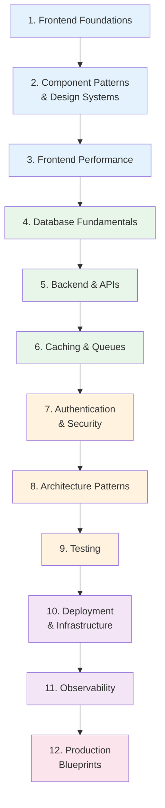

# Full-Stack Engineer Learning Path

A structured journey through the Knowledge Vault for full-stack engineers. Full-stack means owning a feature end-to-end: the UI users interact with, the API that powers it, the database that stores it, and the deployment that runs it. This path gives you depth in both frontend and backend, rather than shallow familiarity with each.

This is the broadest path in the Knowledge Vault. It draws from frontend engineering, backend systems, databases, architecture patterns, DevOps, security, and testing. The order is intentional — it builds from UI fundamentals through backend systems, then connects them with APIs, deployment, and production operations.

**Total estimated time**: ~55 hours across 12 sections

**Prerequisites**: HTML, CSS, JavaScript fundamentals. Basic understanding of how the web works (HTTP requests, client-server model). Some experience building a web application (any framework).

## Learning Progression

---

## Section 1: Frontend Foundations

*Estimated reading time: 4 hours*

Before building UIs with frameworks, understand how the browser actually renders pages. This knowledge lets you write performant frontends and debug layout issues from first principles.

- [ ] **Required** — [Browser Rendering Pipeline](/frontend-engineering/browser-rendering) *(30 min)*
- [ ] **Required** — [Rendering Strategies: SSR vs SSG vs ISR vs CSR](/frontend-engineering/rendering-strategies) *(30 min)*
- [ ] **Required** — [State Management Patterns](/frontend-engineering/state-management) *(30 min)*
- [ ] **Required** — [Web Performance & Core Web Vitals](/frontend-engineering/web-performance) *(30 min)*
- [ ] **Required** — [Bundle Optimization](/frontend-engineering/bundle-optimization) *(25 min)*
- [ ] **Optional** — [Micro-Frontends](/frontend-engineering/micro-frontends) *(25 min)*
- [ ] **Reference** — [TypeScript Cheat Sheet](/cheat-sheets/typescript) *(10 min)*

::: tip Checkpoint
After this section you should be able to: explain the critical rendering path (parse HTML, build DOM, CSSOM, layout, paint, composite), choose the right rendering strategy for different pages (SSR for SEO, CSR for dashboards, ISR for content), optimize bundle size with code splitting and tree shaking, and measure Core Web Vitals (LCP, INP, CLS).
:::

---

## Section 2: Component Patterns & Design Systems

*Estimated reading time: 5 hours*

Modern frontends are built from components. Understanding component patterns is the difference between a maintainable codebase and a tangle of props drilling and state bugs.

- [ ] **Required** — [Component Patterns Overview](/ui-design-systems/component-patterns/) *(15 min)*
- [ ] **Required** — [Atomic Design](/ui-design-systems/component-patterns/atomic-design) *(25 min)*
- [ ] **Required** — [Compound Components](/ui-design-systems/component-patterns/compound-components) *(25 min)*
- [ ] **Required** — [Headless Components](/ui-design-systems/component-patterns/headless-components) *(25 min)*
- [ ] **Required** — [Controlled vs Uncontrolled](/ui-design-systems/component-patterns/controlled-uncontrolled) *(25 min)*
- [ ] **Required** — [Render Props & Hooks](/ui-design-systems/component-patterns/render-props-hooks) *(25 min)*
- [ ] **Required** — [Accessibility Overview](/ui-design-systems/accessibility/) *(15 min)*
- [ ] **Required** — [Keyboard Navigation](/ui-design-systems/accessibility/keyboard-navigation) *(20 min)*
- [ ] **Optional** — [Polymorphic Components](/ui-design-systems/component-patterns/polymorphic-components) *(20 min)*
- [ ] **Optional** — [Slot Pattern](/ui-design-systems/component-patterns/slot-pattern) *(20 min)*
- [ ] **Optional** — [Color Theory](/ui-design-systems/color-tokens/color-theory) *(20 min)*
- [ ] **Optional** — [Spacing Scale](/ui-design-systems/spacing-layout/spacing-scale) *(20 min)*
- [ ] **Optional** — [Type Scale](/ui-design-systems/typography/type-scale) *(20 min)*

::: tip Checkpoint
After this section you should be able to: structure a component library using atomic design principles, implement compound components for complex UI patterns (Tabs, Accordion, Select), build accessible components with keyboard navigation and ARIA attributes, and choose between controlled and uncontrolled patterns based on use case.
:::

---

## Section 3: Frontend Performance

*Estimated reading time: 4 hours*

Performance is a feature. Slow frontends lose users. This section covers optimization from the browser to the edge.

- [ ] **Required** — [HTTP Caching](/performance/caching-strategies/http-caching) *(25 min)*
- [ ] **Required** — [Edge Caching](/performance/caching-strategies/edge-caching) *(25 min)*
- [ ] **Required** — [Edge Computing Overview](/performance/edge-computing/) *(15 min)*
- [ ] **Required** — [CDN Deep Dive](/system-design/caching/cdn-deep-dive) *(25 min)*
- [ ] **Required** — [Browser Profiling](/performance/profiling/browser-profiling) *(25 min)*
- [ ] **Optional** — [Cloudflare Workers](/performance/edge-computing/cloudflare-workers) *(25 min)*
- [ ] **Optional** — [Vercel Edge](/performance/edge-computing/vercel-edge) *(20 min)*
- [ ] **Optional** — [CSS Animations](/ui-design-systems/animations/css-animations) *(20 min)*
- [ ] **Optional** — [Motion Principles](/ui-design-systems/animations/motion-principles) *(20 min)*
- [ ] **Optional** — [Performance Considerations (Animations)](/ui-design-systems/animations/performance-considerations) *(20 min)*

::: tip Checkpoint
After this section you should be able to: configure HTTP caching headers for different asset types, use browser DevTools to profile rendering performance, understand CDN architecture and cache invalidation strategies, and optimize for Core Web Vitals with measurable improvements.
:::

---

## Section 4: Database Fundamentals

*Estimated reading time: 5 hours*

Full-stack engineers must understand databases deeply enough to design schemas, write efficient queries, and choose the right database for the job.

- [ ] **Required** — [Database Selection Guide](/system-design/databases/database-selection-guide) *(20 min)*
- [ ] **Required** — [PostgreSQL Internals](/system-design/databases/postgres-internals) *(35 min)*
- [ ] **Required** — [Indexing Deep Dive](/system-design/databases/indexing-deep-dive) *(30 min)*
- [ ] **Required** — [Isolation Levels](/system-design/databases/isolation-levels) *(25 min)*
- [ ] **Required** — [Query Planning & Optimization](/system-design/databases/query-planning-optimization) *(30 min)*
- [ ] **Required** — [Redis Internals](/system-design/databases/redis-internals) *(25 min)*
- [ ] **Required** — [Connection Pooling](/system-design/databases/connection-pooling) *(20 min)*
- [ ] **Optional** — [MongoDB Internals](/system-design/databases/mongodb-internals) *(25 min)*
- [ ] **Optional** — [Storage Engines](/system-design/databases/storage-engines) *(30 min)*
- [ ] **Reference** — [SQL Cheat Sheet](/cheat-sheets/sql) *(10 min)*
- [ ] **Reference** — [Redis Cheat Sheet](/cheat-sheets/redis) *(10 min)*

::: tip Checkpoint
After this section you should be able to: design normalized database schemas for common application domains, create indexes that speed up real query patterns, read EXPLAIN output and identify slow queries, understand transaction isolation levels and when they matter, and choose between PostgreSQL, MongoDB, and Redis for different use cases.
:::

---

## Section 5: Backend & APIs

*Estimated reading time: 5 hours*

The backend is where business logic lives. This section covers API design, query optimization, and the patterns that make backends reliable.

- [ ] **Required** — [REST API Best Practices](/system-design/api-design/rest-best-practices) *(25 min)*
- [ ] **Required** — [API Versioning](/system-design/api-design/api-versioning) *(20 min)*
- [ ] **Required** — [Pagination Patterns](/system-design/api-design/pagination-patterns) *(25 min)*
- [ ] **Required** — [OpenAPI & Swagger](/system-design/api-design/openapi-swagger) *(20 min)*
- [ ] **Required** — [GraphQL vs REST](/system-design/networking/graphql-vs-rest) *(25 min)*
- [ ] **Required** — [N+1 Problem](/performance/database-tuning/n-plus-one) *(20 min)*
- [ ] **Required** — [Query Optimization](/performance/database-tuning/query-optimization) *(25 min)*
- [ ] **Required** — [Webhook Design Patterns](/system-design/api-design/webhooks) *(20 min)*
- [ ] **Optional** — [HTTP/2 and HTTP/3](/system-design/networking/http2-http3) *(25 min)*
- [ ] **Optional** — [gRPC Internals](/system-design/networking/grpc-internals) *(25 min)*
- [ ] **Optional** — [Node.js Internals](/infrastructure/languages/nodejs-internals) *(30 min)*
- [ ] **Optional** — [Node.js Event Loop](/performance/optimization/nodejs-event-loop) *(25 min)*

::: tip Checkpoint
After this section you should be able to: design RESTful APIs with proper status codes, error formats, and pagination, implement API versioning strategies, solve the N+1 query problem with eager loading/DataLoader, choose between REST and GraphQL based on use case, and design webhook endpoints for third-party integrations.
:::

---

## Section 6: Caching & Message Queues

*Estimated reading time: 4 hours*

Caching makes things fast. Message queues make things reliable. Together, they are the foundation of scalable full-stack applications.

- [ ] **Required** — [Caching Strategies](/system-design/caching/caching-strategies) *(25 min)*
- [ ] **Required** — [Redis Caching Patterns](/system-design/caching/redis-caching-patterns) *(25 min)*
- [ ] **Required** — [Cache Invalidation](/system-design/caching/cache-invalidation) *(25 min)*
- [ ] **Required** — [Multi-Layer Caching](/system-design/caching/multi-layer-caching) *(20 min)*
- [ ] **Required** — [Queue Selection Guide](/system-design/message-queues/queue-selection-guide) *(20 min)*
- [ ] **Required** — [Dead Letter Queues](/system-design/message-queues/dead-letter-queues) *(20 min)*
- [ ] **Optional** — [Thundering Herd](/system-design/caching/thundering-herd) *(20 min)*
- [ ] **Optional** — [Cache Warming](/system-design/caching/cache-warming) *(20 min)*
- [ ] **Optional** — [SQS & SNS](/system-design/message-queues/sqs-sns) *(25 min)*

::: tip Checkpoint
After this section you should be able to: implement cache-aside, write-through, and write-behind patterns, design a multi-layer caching strategy (browser, CDN, application, database), handle cache invalidation without stale data, use message queues for async processing (email sending, image resize), and implement dead letter queues for failed job handling.
:::

---

## Section 7: Authentication & Security

*Estimated reading time: 5 hours*

Every full-stack engineer must understand authentication and common security vulnerabilities. This section covers what you need to build secure applications.

- [ ] **Required** — [Authentication Overview](/security/authentication/) *(15 min)*
- [ ] **Required** — [Session Management](/security/authentication/session-management) *(25 min)*
- [ ] **Required** — [JWT Deep Dive](/security/authentication/jwt-deep-dive) *(25 min)*
- [ ] **Required** — [OAuth 2.0 & OIDC](/security/authentication/oauth2-oidc) *(30 min)*
- [ ] **Required** — [OWASP Top 10 Overview](/security/owasp/) *(20 min)*
- [ ] **Required** — [A01: Broken Access Control](/security/owasp/a01-broken-access-control) *(25 min)*
- [ ] **Required** — [A03: Injection](/security/owasp/a03-injection) *(25 min)*
- [ ] **Required** — [CORS Deep Dive](/security/api-security/cors-deep-dive) *(25 min)*
- [ ] **Required** — [Input Validation](/security/api-security/input-validation) *(25 min)*
- [ ] **Optional** — [CSP Headers](/security/api-security/csp-headers) *(20 min)*
- [ ] **Optional** — [API Rate Limiting](/security/api-security/rate-limiting) *(20 min)*
- [ ] **Optional** — [MFA Implementation](/security/authentication/mfa-implementation) *(20 min)*

::: tip Checkpoint
After this section you should be able to: implement session-based and JWT-based authentication, integrate OAuth 2.0 / OIDC for social login, prevent the OWASP Top 10 vulnerabilities in your code, configure CORS properly (the most common full-stack debugging headache), and validate and sanitize all user input.
:::

---

## Section 8: Architecture Patterns

*Estimated reading time: 5 hours*

As you build larger applications, architecture matters. This section covers the patterns that keep codebases maintainable as they grow.

- [ ] **Required** — [Clean Architecture Overview](/architecture-patterns/clean-architecture/) *(15 min)*
- [ ] **Required** — [Layers and Boundaries](/architecture-patterns/clean-architecture/layers-and-boundaries) *(25 min)*
- [ ] **Required** — [Repository Pattern](/architecture-patterns/design-patterns/repository-pattern) *(25 min)*
- [ ] **Required** — [Dependency Injection](/architecture-patterns/design-patterns/dependency-injection) *(25 min)*
- [ ] **Required** — [Event-Driven Architecture](/architecture-patterns/event-driven/) *(15 min)*
- [ ] **Required** — [Event Types](/architecture-patterns/event-driven/event-types) *(20 min)*
- [ ] **Required** — [Microservices Overview](/architecture-patterns/microservices/) *(15 min)*
- [ ] **Required** — [Decomposition Strategies](/architecture-patterns/microservices/decomposition-strategies) *(25 min)*
- [ ] **Optional** — [DDD Overview](/architecture-patterns/domain-driven-design/) *(15 min)*
- [ ] **Optional** — [API Gateway Pattern](/architecture-patterns/microservices/api-gateway-pattern) *(25 min)*
- [ ] **Optional** — [Communication Patterns](/architecture-patterns/microservices/communication-patterns) *(25 min)*
- [ ] **Optional** — [Anti-patterns (Microservices)](/architecture-patterns/microservices/anti-patterns) *(20 min)*

::: tip Checkpoint
After this section you should be able to: structure a backend with clean architecture layers, use the repository pattern to abstract database access, understand when to use events vs direct API calls between services, evaluate whether microservices are appropriate for your team size, and identify common architecture anti-patterns before they cause pain.
:::

---

## Section 9: Testing

*Estimated reading time: 4 hours*

Full-stack engineers write tests across the entire stack — unit tests for business logic, integration tests for APIs, and end-to-end tests for critical user flows.

- [ ] **Required** — [Test Architecture](/testing/test-architecture) *(25 min)*
- [ ] **Required** — [Unit Testing](/testing/unit-testing) *(25 min)*
- [ ] **Required** — [Integration Testing](/testing/integration-testing) *(25 min)*
- [ ] **Required** — [E2E Testing](/testing/e2e-testing) *(25 min)*
- [ ] **Required** — [TDD & BDD](/testing/tdd-bdd) *(25 min)*
- [ ] **Optional** — [Contract Testing](/testing/contract-testing) *(25 min)*
- [ ] **Optional** — [Property-Based Testing](/testing/property-based-testing) *(25 min)*

::: tip Checkpoint
After this section you should be able to: design a test pyramid for a full-stack application, write unit tests for business logic with proper mocking, write integration tests for API endpoints, set up E2E tests for critical user journeys, and use contract testing for frontend-backend API boundaries.
:::

---

## Section 10: Deployment & Infrastructure

*Estimated reading time: 5 hours*

Full-stack engineers should be able to deploy their own applications. This section covers the minimum infrastructure knowledge needed to go from laptop to production.

- [ ] **Required** — [Docker Overview](/infrastructure/docker/) *(15 min)*
- [ ] **Required** — [Production Dockerfiles](/infrastructure/docker/production-dockerfiles) *(25 min)*
- [ ] **Required** — [Multi-Stage Builds](/infrastructure/docker/multi-stage-builds) *(25 min)*
- [ ] **Required** — [CI/CD Overview](/infrastructure/ci-cd/) *(15 min)*
- [ ] **Required** — [GitHub Actions Deep Dive](/infrastructure/ci-cd/github-actions-deep-dive) *(30 min)*
- [ ] **Required** — [Deployment Strategies Overview](/devops/deployment-strategies/) *(15 min)*
- [ ] **Required** — [Blue-Green Deployment](/devops/deployment-strategies/blue-green) *(20 min)*
- [ ] **Required** — [Database Migrations](/devops/deployment-strategies/database-migrations) *(25 min)*
- [ ] **Optional** — [Kubernetes Overview](/infrastructure/kubernetes/) *(15 min)*
- [ ] **Optional** — [Terraform Fundamentals](/infrastructure/terraform/fundamentals) *(30 min)*
- [ ] **Optional** — [AWS Lambda](/infrastructure/aws/lambda) *(25 min)*
- [ ] **Optional** — [GCP Cloud Run](/infrastructure/gcp/cloud-run) *(25 min)*
- [ ] **Reference** — [Docker Cheat Sheet](/cheat-sheets/docker) *(10 min)*
- [ ] **Reference** — [Git Cheat Sheet](/cheat-sheets/git) *(10 min)*

::: tip Checkpoint
After this section you should be able to: containerize a full-stack app with multi-stage Docker builds, set up CI/CD with automated testing and deployment, deploy using blue-green or rolling strategies, handle database migrations safely during deployment, and understand when to use serverless (Lambda/Cloud Run) vs containers.
:::

---

## Section 11: Observability

*Estimated reading time: 3 hours*

You deployed it — now you need to know if it is working. This section covers the monitoring and logging every full-stack app needs.

- [ ] **Required** — [Monitoring Overview](/devops/monitoring/) *(15 min)*
- [ ] **Required** — [Metrics Design](/devops/monitoring/metrics-design) *(25 min)*
- [ ] **Required** — [Structured Logging](/devops/logging/structured-logging) *(25 min)*
- [ ] **Required** — [Correlation IDs](/devops/logging/correlation-ids) *(20 min)*
- [ ] **Required** — [Alert Design](/devops/alerting/alert-design) *(25 min)*
- [ ] **Optional** — [Grafana Dashboards](/devops/monitoring/grafana-dashboards) *(25 min)*
- [ ] **Optional** — [Log Levels Strategy](/devops/logging/log-levels-strategy) *(20 min)*

::: tip Checkpoint
After this section you should be able to: instrument your app with the four golden signals (latency, traffic, errors, saturation), implement structured logging with JSON output, use correlation IDs to trace requests across frontend and backend, and set up alerts that wake you up only when something actually matters.
:::

---

## Section 12: Production Blueprints

*Estimated reading time: 5 hours*

Tie everything together by studying complete production systems that integrate frontend, backend, database, and infrastructure.

- [ ] **Required** — [Auth Service Blueprint](/production-blueprints/auth-service/) *(45 min)*
- [ ] **Required** — [Feature Flag Blueprint](/production-blueprints/feature-flag-service/) *(35 min)*
- [ ] **Required** — [File Storage Blueprint](/production-blueprints/file-storage/) *(35 min)*
- [ ] **Required** — [Chat Service Blueprint](/production-blueprints/chat-service/) *(40 min)*
- [ ] **Optional** — [Notification Service Blueprint](/production-blueprints/notification-service/) *(35 min)*
- [ ] **Optional** — [Search Service Blueprint](/production-blueprints/search-service/) *(40 min)*

### Suggested Capstone Project

Build a production-quality full-stack application:

1. **Frontend**: React/Vue/Svelte with component library, responsive design, dark mode
2. **Backend**: REST API with authentication, authorization, and input validation
3. **Database**: PostgreSQL with proper schema, indexes, and migrations
4. **Caching**: Redis for sessions and frequently accessed data
5. **File upload**: Presigned URLs for direct-to-S3 uploads with image processing
6. **Testing**: Unit, integration, and E2E tests with > 80% coverage
7. **CI/CD**: GitHub Actions pipeline with linting, testing, and deployment
8. **Monitoring**: Structured logging, error tracking, and basic alerting

---

## How This Path Relates to Others

| If You Want to Go Deeper In... | Follow Up With... |
|---|---|
| Frontend | [Frontend Engineer Path](/learning-paths/frontend-engineer) |
| Backend | [Backend Engineer Path](/learning-paths/backend-engineer) |
| Infrastructure | [Platform Engineer Path](/learning-paths/platform-engineer) |
| Security | [Security Engineer Path](/learning-paths/security-engineer) |
| System design interviews | [System Design Interview Path](/learning-paths/system-design-interview) |
| Data engineering | [Data Engineer Path](/learning-paths/data-engineer) |
| AI/ML features | [AI/ML Engineer Path](/learning-paths/ai-ml-engineer) |

The full-stack path gives you breadth. Use the specialized paths to add depth in the areas most relevant to your role and interests.

---

## Career Progression

| Level | Focus Areas | Key Skills |
|---|---|---|
| **Junior FS** | Build features end-to-end | HTML/CSS/JS, one framework, basic SQL, REST APIs |
| **Mid-Level FS** | Own features and systems | Performance, testing, security, architecture basics |
| **Senior FS** | Design systems, mentor | System design, tech debt management, cross-team influence |
| **Staff FS** | Technical strategy | Architecture decisions, platform choices, engineering culture |

---

::: tip Full-Stack Is Not "Know Everything"
Full-stack does not mean you are an expert in everything. It means you can own a feature from UI to database without being blocked by missing knowledge. You will always be stronger in some areas than others — and that is fine. The goal is to have no blind spots that prevent you from shipping.
:::
