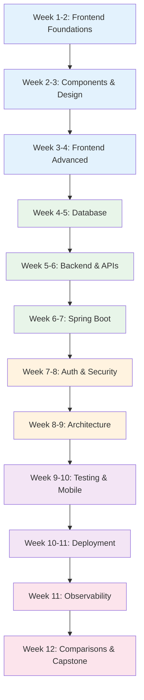

# Full-Stack Engineer Learning Path

A structured 12-week journey through the Knowledge Vault for full-stack engineers. This path gives you depth in both frontend and backend, covering component patterns, Spring Boot, mobile engineering, data visualization, WebAssembly, databases, APIs, caching, authentication, deployment, comparisons, and production operations.

## Who This Is For

- Junior full-stack engineers leveling up to mid/senior
- Frontend engineers adding backend depth (or vice versa)
- Engineers who want to own features end-to-end
- Anyone preparing for full-stack interviews

## Prerequisites

- HTML, CSS, JavaScript fundamentals
- Basic understanding of HTTP and REST APIs
- Some experience building a web application (any framework)
- Familiarity with at least one database (SQL preferred)

**Total estimated time**: ~60 hours across 12 weeks

## Learning Progression

---

## Week 1-2: Frontend Foundations

*Estimated reading time: 5 hours*

- [ ] **Required** -- [Browser Rendering Pipeline](/frontend-engineering/browser-rendering) *(30 min)*
- [ ] **Required** -- [Rendering Strategies: SSR vs SSG vs ISR](/frontend-engineering/rendering-strategies) *(30 min)*
- [ ] **Required** -- [State Management Patterns](/frontend-engineering/state-management) *(30 min)*
- [ ] **Required** -- [Web Performance & Core Web Vitals](/frontend-engineering/web-performance) *(30 min)*
- [ ] **Required** -- [Bundle Optimization](/frontend-engineering/bundle-optimization) *(25 min)*
- [ ] **Required** -- [React Internals](/frontend-engineering/react-internals) *(35 min)*
- [ ] **Optional** -- [Micro-Frontends](/frontend-engineering/micro-frontends) *(25 min)*
- [ ] **Reference** -- [TypeScript Cheat Sheet](/cheat-sheets/typescript) *(10 min)*

---

## Week 2-3: Component Patterns & Design Systems

*Estimated reading time: 5 hours*

- [ ] **Required** -- [Component Patterns Overview](/ui-design-systems/component-patterns/) *(15 min)*
- [ ] **Required** -- [Atomic Design](/ui-design-systems/component-patterns/atomic-design) *(25 min)*
- [ ] **Required** -- [Compound Components](/ui-design-systems/component-patterns/compound-components) *(25 min)*
- [ ] **Required** -- [Headless Components](/ui-design-systems/component-patterns/headless-components) *(25 min)*
- [ ] **Required** -- [Controlled vs Uncontrolled](/ui-design-systems/component-patterns/controlled-uncontrolled) *(25 min)*
- [ ] **Required** -- [Accessibility Overview](/ui-design-systems/accessibility/) *(15 min)*
- [ ] **Required** -- [Keyboard Navigation](/ui-design-systems/accessibility/keyboard-navigation) *(20 min)*
- [ ] **Required** -- [Data Visualization](/frontend-engineering/data-visualization) *(30 min)*
- [ ] **Optional** -- [Color Theory](/ui-design-systems/color-tokens/color-theory) *(20 min)*
- [ ] **Optional** -- [i18n & l10n](/frontend-engineering/i18n-l10n) *(30 min)*

---

## Week 3-4: Frontend Advanced -- WebAssembly & Performance

*Estimated reading time: 4 hours*

- [ ] **Required** -- [WebAssembly](/frontend-engineering/webassembly) *(30 min)*
- [ ] **Required** -- [HTTP Caching](/performance/caching-strategies/http-caching) *(25 min)*
- [ ] **Required** -- [Edge Caching](/performance/caching-strategies/edge-caching) *(25 min)*
- [ ] **Required** -- [Browser Profiling](/performance/profiling/browser-profiling) *(25 min)*
- [ ] **Required** -- [V8 Optimization](/performance/optimization/v8-optimization) *(25 min)*
- [ ] **Optional** -- [Edge Computing Overview](/performance/edge-computing/) *(15 min)*
- [ ] **Optional** -- [Cloudflare Workers](/performance/edge-computing/cloudflare-workers) *(25 min)*
- [ ] **Optional** -- [CSS Animations](/ui-design-systems/animations/css-animations) *(20 min)*

---

## Week 4-5: Database Fundamentals

*Estimated reading time: 5 hours*

- [ ] **Required** -- [Database Selection Guide](/system-design/databases/database-selection-guide) *(20 min)*
- [ ] **Required** -- [PostgreSQL Internals](/system-design/databases/postgres-internals) *(35 min)*
- [ ] **Required** -- [Indexing Deep Dive](/system-design/databases/indexing-deep-dive) *(30 min)*
- [ ] **Required** -- [Isolation Levels](/system-design/databases/isolation-levels) *(25 min)*
- [ ] **Required** -- [Query Planning & Optimization](/system-design/databases/query-planning-optimization) *(30 min)*
- [ ] **Required** -- [Redis Internals](/system-design/databases/redis-internals) *(25 min)*
- [ ] **Required** -- [Connection Pooling](/system-design/databases/connection-pooling) *(20 min)*
- [ ] **Optional** -- [MongoDB Internals](/system-design/databases/mongodb-internals) *(25 min)*
- [ ] **Reference** -- [SQL Cheat Sheet](/cheat-sheets/sql) *(10 min)*

---

## Week 5-6: Backend & APIs

*Estimated reading time: 5 hours*

- [ ] **Required** -- [REST API Best Practices](/system-design/api-design/rest-best-practices) *(25 min)*
- [ ] **Required** -- [API Versioning](/system-design/api-design/api-versioning) *(20 min)*
- [ ] **Required** -- [Pagination Patterns](/system-design/api-design/pagination-patterns) *(25 min)*
- [ ] **Required** -- [OpenAPI & Swagger](/system-design/api-design/openapi-swagger) *(20 min)*
- [ ] **Required** -- [GraphQL vs REST](/system-design/networking/graphql-vs-rest) *(25 min)*
- [ ] **Required** -- [N+1 Problem](/performance/database-tuning/n-plus-one) *(20 min)*
- [ ] **Required** -- [Webhook Design](/system-design/api-design/webhooks) *(20 min)*
- [ ] **Optional** -- [gRPC Internals](/system-design/networking/grpc-internals) *(25 min)*
- [ ] **Optional** -- [tRPC](/system-design/api-design/trpc) *(15 min)*
- [ ] **Optional** -- [Node.js Internals](/infrastructure/languages/nodejs-internals) *(30 min)*

---

## Week 6-7: Spring Boot for Full-Stack

*Estimated reading time: 5 hours*

Spring Boot adds enterprise-grade backend capabilities. Essential for full-stack engineers in Java ecosystems.

- [ ] **Required** -- [Spring Boot Overview](/spring-boot/) *(15 min)*
- [ ] **Required** -- [Core Concepts](/spring-boot/core-concepts) *(30 min)*
- [ ] **Required** -- [REST API](/spring-boot/rest-api) *(25 min)*
- [ ] **Required** -- [Spring Data JPA](/spring-boot/spring-data-jpa) *(30 min)*
- [ ] **Required** -- [Exception Handling](/spring-boot/exception-handling) *(20 min)*
- [ ] **Required** -- [Security](/spring-boot/security) *(25 min)*
- [ ] **Required** -- [JWT Auth](/spring-boot/jwt-auth) *(25 min)*
- [ ] **Required** -- [Testing](/spring-boot/testing) *(25 min)*
- [ ] **Optional** -- [WebSocket](/spring-boot/websocket) *(20 min)*
- [ ] **Optional** -- [GraphQL](/spring-boot/graphql) *(20 min)*
- [ ] **Optional** -- [File Upload](/spring-boot/file-upload) *(15 min)*
- [ ] **Reference** -- [Spring Boot Cheat Sheet](/cheat-sheets/spring-boot) *(10 min)*

---

## Week 7-8: Authentication & Security

*Estimated reading time: 5 hours*

- [ ] **Required** -- [Authentication Overview](/security/authentication/) *(15 min)*
- [ ] **Required** -- [Session Management](/security/authentication/session-management) *(25 min)*
- [ ] **Required** -- [JWT Deep Dive](/security/authentication/jwt-deep-dive) *(25 min)*
- [ ] **Required** -- [OAuth 2.0 & OIDC](/security/authentication/oauth2-oidc) *(30 min)*
- [ ] **Required** -- [OWASP Overview](/security/owasp/) *(20 min)*
- [ ] **Required** -- [A01: Broken Access Control](/security/owasp/a01-broken-access-control) *(25 min)*
- [ ] **Required** -- [A03: Injection](/security/owasp/a03-injection) *(25 min)*
- [ ] **Required** -- [CORS Deep Dive](/security/api-security/cors-deep-dive) *(25 min)*
- [ ] **Required** -- [Input Validation](/security/api-security/input-validation) *(25 min)*
- [ ] **Optional** -- [CSP Headers](/security/api-security/csp-headers) *(20 min)*

---

## Week 8-9: Architecture Patterns

*Estimated reading time: 5 hours*

- [ ] **Required** -- [Clean Architecture Overview](/architecture-patterns/clean-architecture/) *(15 min)*
- [ ] **Required** -- [Layers and Boundaries](/architecture-patterns/clean-architecture/layers-and-boundaries) *(25 min)*
- [ ] **Required** -- [Repository Pattern](/architecture-patterns/design-patterns/repository-pattern) *(25 min)*
- [ ] **Required** -- [Dependency Injection](/architecture-patterns/design-patterns/dependency-injection) *(25 min)*
- [ ] **Required** -- [Caching Strategies](/system-design/caching/caching-strategies) *(25 min)*
- [ ] **Required** -- [Cache Invalidation](/system-design/caching/cache-invalidation) *(25 min)*
- [ ] **Required** -- [Queue Selection Guide](/system-design/message-queues/queue-selection-guide) *(20 min)*
- [ ] **Optional** -- [Event-Driven Architecture](/architecture-patterns/event-driven/) *(15 min)*
- [ ] **Optional** -- [Microservices Overview](/architecture-patterns/microservices/) *(15 min)*
- [ ] **Optional** -- [DDD Overview](/architecture-patterns/domain-driven-design/) *(15 min)*

---

## Week 9-10: Testing & Mobile Engineering

*Estimated reading time: 5 hours*

### Testing

- [ ] **Required** -- [Test Architecture](/testing/test-architecture) *(25 min)*
- [ ] **Required** -- [Unit Testing](/testing/unit-testing) *(25 min)*
- [ ] **Required** -- [Integration Testing](/testing/integration-testing) *(25 min)*
- [ ] **Required** -- [E2E Testing](/testing/e2e-testing) *(25 min)*
- [ ] **Optional** -- [Contract Testing](/testing/contract-testing) *(25 min)*

### Mobile Engineering

- [ ] **Required** -- [Mobile Engineering Overview](/mobile-engineering/) *(15 min)*
- [ ] **Required** -- [React Native](/mobile-engineering/react-native) *(25 min)*
- [ ] **Required** -- [Flutter](/mobile-engineering/flutter) *(25 min)*
- [ ] **Required** -- [Mobile Performance](/mobile-engineering/mobile-performance) *(25 min)*
- [ ] **Optional** -- [Offline-First](/mobile-engineering/offline-first) *(20 min)*
- [ ] **Optional** -- [Push Notifications](/mobile-engineering/push-notifications) *(20 min)*

---

## Week 10-11: Deployment & Infrastructure

*Estimated reading time: 5 hours*

- [ ] **Required** -- [Docker Overview](/infrastructure/docker/) *(15 min)*
- [ ] **Required** -- [Production Dockerfiles](/infrastructure/docker/production-dockerfiles) *(25 min)*
- [ ] **Required** -- [CI/CD Overview](/infrastructure/ci-cd/) *(15 min)*
- [ ] **Required** -- [GitHub Actions Deep Dive](/infrastructure/ci-cd/github-actions-deep-dive) *(30 min)*
- [ ] **Required** -- [Deployment Strategies](/devops/deployment-strategies/) *(15 min)*
- [ ] **Required** -- [Blue-Green Deployment](/devops/deployment-strategies/blue-green) *(20 min)*
- [ ] **Required** -- [Database Migrations](/devops/deployment-strategies/database-migrations) *(25 min)*
- [ ] **Optional** -- [Kubernetes Overview](/infrastructure/kubernetes/) *(15 min)*
- [ ] **Optional** -- [AWS Lambda](/infrastructure/aws/lambda) *(25 min)*
- [ ] **Optional** -- [GCP Cloud Run](/infrastructure/gcp/cloud-run) *(25 min)*

---

## Week 11: Observability

*Estimated reading time: 3 hours*

- [ ] **Required** -- [Monitoring Overview](/devops/monitoring/) *(15 min)*
- [ ] **Required** -- [Metrics Design](/devops/monitoring/metrics-design) *(25 min)*
- [ ] **Required** -- [Structured Logging](/devops/logging/structured-logging) *(25 min)*
- [ ] **Required** -- [Correlation IDs](/devops/logging/correlation-ids) *(20 min)*
- [ ] **Required** -- [Alert Design](/devops/alerting/alert-design) *(25 min)*

---

## Week 12: Comparisons, Blueprints & Capstone

*Estimated reading time: 5 hours*

### Framework Comparisons

- [ ] **Required** -- [React vs Vue vs Svelte](/comparisons/react-vs-vue-vs-svelte) *(25 min)*
- [ ] **Required** -- [Next.js vs Nuxt vs SvelteKit](/comparisons/nextjs-vs-nuxt-vs-sveltekit) *(25 min)*
- [ ] **Required** -- [REST vs GraphQL vs gRPC vs tRPC](/comparisons/rest-vs-graphql-vs-grpc-vs-trpc) *(20 min)*
- [ ] **Required** -- [Prisma vs Drizzle vs TypeORM](/comparisons/prisma-vs-drizzle-vs-typeorm) *(15 min)*
- [ ] **Optional** -- [Express vs Fastify vs Hono](/comparisons/express-vs-fastify-vs-hono) *(15 min)*
- [ ] **Optional** -- [Supabase vs Firebase](/comparisons/supabase-vs-firebase) *(15 min)*
- [ ] **Optional** -- [Vite vs Webpack](/comparisons/vite-vs-webpack) *(15 min)*

### Production Blueprints

- [ ] **Required** -- [Auth Service Blueprint](/production-blueprints/auth-service/) *(45 min)*
- [ ] **Required** -- [Feature Flag Blueprint](/production-blueprints/feature-flag-service/) *(35 min)*
- [ ] **Required** -- [File Storage Blueprint](/production-blueprints/file-storage/) *(35 min)*
- [ ] **Optional** -- [Chat Service Blueprint](/production-blueprints/chat-service/) *(40 min)*
- [ ] **Optional** -- [Notification Service Blueprint](/production-blueprints/notification-service/) *(35 min)*

---

## What You Will Be Able to Do After This Path

- Build production UIs with component patterns, accessibility, and performance optimization
- Implement backends with Spring Boot, REST/GraphQL APIs, and proper security
- Design database schemas, write optimized queries, and implement caching
- Build mobile experiences with React Native or Flutter
- Implement data visualization and WebAssembly for compute-intensive tasks
- Deploy full-stack applications with CI/CD, Docker, and monitoring
- Make informed technology decisions using framework comparisons

## Cross-References to Related Paths

- **[Frontend Engineer Path](/learning-paths/frontend-engineer)** -- Deep frontend specialization
- **[Backend Engineer Path](/learning-paths/backend-engineer)** -- Deep backend specialization
- **[Spring Boot Engineer Path](/learning-paths/spring-boot-engineer)** -- Comprehensive Spring Boot
- **[Mobile Engineer Path](/learning-paths/mobile-engineer)** -- Deep mobile specialization
- **[System Design Interview Path](/learning-paths/system-design-interview)** -- Interview preparation

---

::: info Total Progress
This path contains approximately 110 pages. At a pace of 5 pages per day, you can complete it in about 3.5 weeks of focused study. This is the broadest path -- use specialized paths to go deeper in your areas of interest.
:::
