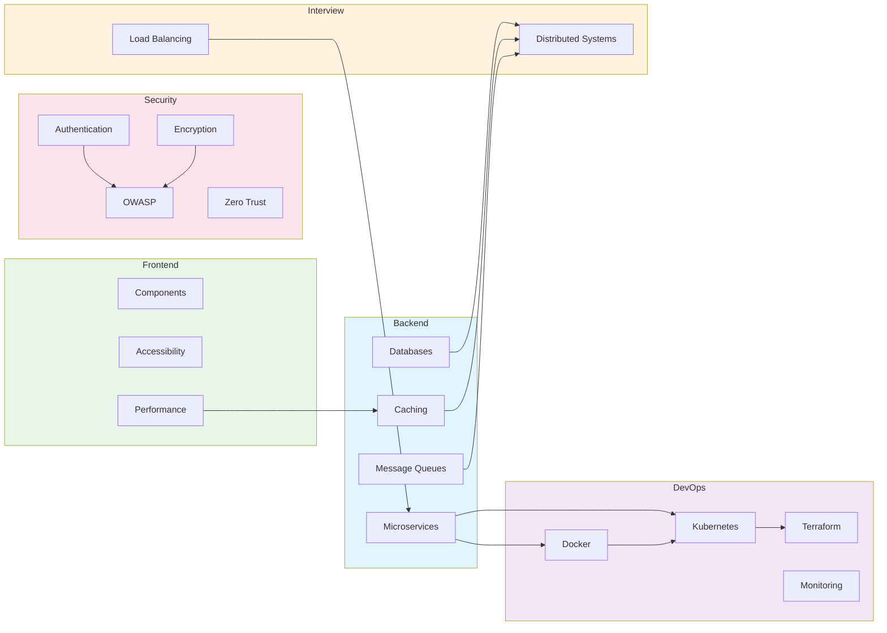

# Learning Paths

Structured reading orders through the 424-page Knowledge Vault. Each path takes you from fundamentals to advanced topics with clear progression, estimated reading times, and progress tracking.

## Choose Your Path

### Backend Engineer
**Database internals to production microservices**

Best for: Server-side developers building APIs, services, and data-heavy applications.

Covers: Databases, caching, message queues, APIs, microservices, DDD, CQRS, deployment, monitoring.

[Start the Backend Path](/learning-paths/backend-engineer)

---

### DevOps Engineer
**Containers to multi-region infrastructure**

Best for: Platform engineers, SREs, and infrastructure specialists.

Covers: Docker, Kubernetes, Terraform, CI/CD, monitoring, logging, alerting, incident response, multi-region.

[Start the DevOps Path](/learning-paths/devops-engineer)

---

### Frontend Engineer
**Component patterns to edge computing**

Best for: UI engineers building design systems, accessible interfaces, and high-performance frontends.

Covers: Component patterns, typography, color, spacing, accessibility, dark mode, animations, performance, edge computing.

[Start the Frontend Path](/learning-paths/frontend-engineer)

---

### System Design Interview
**Ace the system design round**

Best for: Engineers preparing for system design interviews at top companies.

Covers: Distributed systems fundamentals, databases, caching, queues, load balancing, and interview walkthroughs.

[Start the Interview Prep Path](/learning-paths/system-design-interview)

---

### Security Engineer
**OWASP to zero trust architecture**

Best for: Security-focused engineers, AppSec specialists, and anyone hardening production systems.

Covers: OWASP Top 10, authentication, encryption, secrets management, zero trust, API security, security scanning.

[Start the Security Path](/learning-paths/security-engineer)

## How to Use These Paths

### Progress Tracking

Each path contains checkboxes you can use to track your progress. While VitePress renders these as static checkboxes, you can:

1. **Fork the repo** and check them off in your local copy
2. **Use a notebook** to track which pages you have completed
3. **Print the path** and check items off on paper

### Reading Time Estimates

Every section includes an estimated reading time. These assume:

- Careful reading, not skimming
- Time to study code examples
- No time for hands-on exercises (add 50-100% for practice)

### Required vs Optional

Each page is marked as one of:

| Label | Meaning |
|-------|---------|
| **Required** | Core concept you must understand before moving forward |
| **Optional** | Deepens understanding but can be skipped on first pass |
| **Reference** | Look up as needed; not meant for linear reading |

### Suggested Approach

1. **First pass**: Read all Required pages in order
2. **Second pass**: Go back and read Optional pages that interest you
3. **Reference**: Bookmark Reference pages for when you need them on the job
4. **Practice**: Build something using the concepts from each section before moving on

## Path Comparison

| Path | Pages | Est. Time | Prerequisite Knowledge |
|------|-------|-----------|----------------------|
| [Backend Engineer](/learning-paths/backend-engineer) | ~65 pages | ~30 hours | Basic programming, HTTP basics |
| [DevOps Engineer](/learning-paths/devops-engineer) | ~70 pages | ~35 hours | Linux basics, networking fundamentals |
| [Frontend Engineer](/learning-paths/frontend-engineer) | ~45 pages | ~20 hours | HTML/CSS/JS, React basics |
| [System Design Interview](/learning-paths/system-design-interview) | ~55 pages | ~25 hours | 2+ years backend experience |
| [Security Engineer](/learning-paths/security-engineer) | ~45 pages | ~22 hours | Web development basics, networking |

## Path Overlap

Many paths share foundational pages. The diagram below shows how topics connect across paths:

## Combining Paths

If you are pursuing more than one path, here is the recommended order:

1. **Backend + DevOps**: Complete Backend through Section 5 (Microservices), then switch to DevOps. Circle back for DDD/CQRS later.
2. **Backend + Security**: Alternate sections -- Backend databases, then Security OWASP, Backend caching, then Security authentication, etc.
3. **Interview Prep + Backend**: The Interview path is a curated subset of Backend. Start with Interview prep, then fill gaps with the full Backend path.
4. **Full Stack**: Frontend path first (shorter), then Backend path, then cherry-pick from DevOps and Security.

## Staying Current

These learning paths reference pages across the vault. As new pages are added, paths will be updated to incorporate them. Check the `lastReviewed` date in the frontmatter of each path to see when it was last audited for accuracy and completeness.

---

::: tip Start Anywhere
You do not have to follow a path from the beginning. If you already know databases well, skip ahead to caching in the Backend path. The paths are guides, not mandates.
:::
