# ML/DL Engineer Learning Path

This 16-week study plan takes you from fundamentals to deployment-ready deep learning engineer. Each week has specific readings from the Archon knowledge base, hands-on exercises, and a milestone to verify your progress. Budget 15--20 hours per week.

## Prerequisites

Before starting, you should have:
- Python programming (comfortable with classes, list comprehensions, decorators)
- Basic linear algebra (vectors, matrices, dot products)
- Basic calculus (derivatives, chain rule)
- Basic probability (Bayes' theorem, distributions)

## Overview

```mermaid
graph LR
    subgraph "Phase 1: Foundations (Weeks 1-4)"
        W1["Week 1<br/>Math + Python"]
        W2["Week 2<br/>Neural Networks"]
        W3["Week 3<br/>PyTorch"]
        W4["Week 4<br/>Training Mastery"]
    end

    subgraph "Phase 2: Architectures (Weeks 5-8)"
        W5["Week 5<br/>CNNs"]
        W6["Week 6<br/>RNNs + Sequences"]
        W7["Week 7<br/>Transformers"]
        W8["Week 8<br/>NLP"]
    end

    subgraph "Phase 3: Advanced (Weeks 9-12)"
        W9["Week 9<br/>Generative Models"]
        W10["Week 10<br/>Advanced CV"]
        W11["Week 11<br/>LLMs + Alignment"]
        W12["Week 12<br/>Multimodal + RL"]
    end

    subgraph "Phase 4: Production (Weeks 13-16)"
        W13["Week 13<br/>Optimization"]
        W14["Week 14<br/>Deployment"]
        W15["Week 15<br/>Capstone Project"]
        W16["Week 16<br/>Portfolio + Interview"]
    end

    W1 --> W2 --> W3 --> W4
    W4 --> W5 --> W6 --> W7 --> W8
    W8 --> W9 --> W10 --> W11 --> W12
    W12 --> W13 --> W14 --> W15 --> W16
```

## Phase 1: Foundations (Weeks 1--4)

### Week 1: Mathematical Foundations and Python for ML

**Read:**
- [Deep Learning Overview](/deep-learning/) --- understand the landscape, when DL beats classical ML

**Study:**
- Linear algebra: matrix multiplication, eigenvalues, SVD
- Calculus: partial derivatives, chain rule, gradient
- Probability: Bayes' theorem, Gaussian distribution, MLE
- NumPy: array operations, broadcasting, vectorization

**Exercise:**
- Implement matrix multiplication from scratch in Python
- Implement gradient descent for linear regression using only NumPy
- Compute derivatives of $f(x) = x^3 + 2x^2 - 5x + 1$ by hand and verify numerically

**Milestone:** You can explain the chain rule, compute matrix products by hand, and write vectorized NumPy code.

---

### Week 2: Neural Network Basics

**Read:**
- [Neural Network Basics](/deep-learning/neural-network-basics) --- perceptrons, activations, backprop derivation, optimizers
- [Architecture Selection Guide](/deep-learning/architecture-selection-guide) --- overview of all architectures

**Study:**
- Derive sigmoid, tanh, and ReLU derivatives
- Derive backpropagation for a 2-layer network
- Understand SGD, momentum, and Adam
- Understand cross-entropy loss and why it works for classification

**Exercise:**
- Implement the from-scratch NumPy MLP on MNIST (from the Neural Network Basics page)
- Achieve >97% accuracy by tuning learning rate and architecture
- Implement numerical gradient checking to verify your backprop

**Milestone:** You can derive backpropagation by hand and implement a working MLP from scratch.

---

### Week 3: PyTorch Fundamentals

**Read:**
- [PyTorch Fundamentals](/deep-learning/pytorch-fundamentals) --- tensors, autograd, nn.Module, DataLoader, training loop

**Study:**
- Tensor creation, operations, broadcasting
- Autograd: computation graph, .backward(), .grad
- nn.Module: defining models, parameters, forward pass
- Dataset and DataLoader: custom datasets, batching
- GPU training: .to(device), CUDA

**Exercise:**
- Rewrite your NumPy MLP in PyTorch using nn.Module
- Train CIFAR-10 classifier (from the PyTorch page)
- Debug a broken training loop (introduce common bugs and fix them)

**Milestone:** You can write a complete PyTorch training loop from memory and debug common issues.

---

### Week 4: Training Techniques

**Read:**
- [Training Techniques](/deep-learning/training-techniques) --- BatchNorm, dropout, weight init, LR scheduling, mixed precision
- [DL Checklist](/deep-learning/dl-checklist) --- 40-item project checklist

**Study:**
- Batch normalization math and train/eval difference
- Dropout mechanism and inverted dropout
- Xavier vs He initialization
- Cosine annealing, one-cycle, warmup schedules
- Mixed precision training with AMP
- Data augmentation strategies

**Exercise:**
- Take your CIFAR-10 model and systematically add: BatchNorm, dropout, data augmentation, cosine LR schedule
- Measure the improvement from each technique
- Implement early stopping and model checkpointing
- Use mixed precision training and measure speedup

**Milestone:** You can apply every standard training technique and understand when each helps.

## Phase 2: Architectures (Weeks 5--8)

### Week 5: Convolutional Neural Networks

**Read:**
- [CNN](/deep-learning/cnn) --- convolution math, output size formula, LeNet to ResNet to EfficientNet
- [Image Classification](/deep-learning/image-classification) --- augmentation, ViT, transfer learning

**Study:**
- Convolution operation, output size formula
- Pooling, 1x1 convolutions, receptive fields
- ResNet skip connections (why they solve the degradation problem)
- Transfer learning with pretrained models

**Exercise:**
- Implement ResNet-18 from scratch (with residual blocks)
- Train on CIFAR-10 from scratch --- target >93% accuracy
- Fine-tune a pretrained EfficientNet on a custom dataset (e.g., Flowers-102)
- Visualize feature maps and learned filters

**Milestone:** You can implement ResNet from scratch and apply transfer learning to any image dataset.

---

### Week 6: Sequences: RNNs and LSTMs

**Read:**
- [RNN and LSTM](/deep-learning/rnn-lstm) --- RNN equations, vanishing gradients, LSTM gates, GRU
- [NLP Fundamentals](/deep-learning/nlp-fundamentals) --- tokenization, Word2Vec, embeddings

**Study:**
- RNN forward pass and backpropagation through time (BPTT)
- Why gradients vanish (spectral analysis of $W_{hh}$)
- LSTM gates: forget, input, output, cell state
- GRU: simpler alternative
- Tokenization: BPE from scratch, WordPiece, SentencePiece

**Exercise:**
- Implement LSTM from scratch in PyTorch
- Build BPE tokenizer from scratch
- Train sentiment classifier on IMDB using bidirectional LSTM --- target >87%
- Implement Word2Vec Skip-gram with negative sampling

**Milestone:** You can implement LSTM from scratch and explain why it solves vanishing gradients.

---

### Week 7: Transformers

**Read:**
- [Transformers](/deep-learning/transformers) --- self-attention, multi-head attention, positional encoding, encoder-decoder

**Study:**
- Scaled dot-product attention: full derivation of $\frac{QK^T}{\sqrt{d_k}}$
- Multi-head attention: why multiple heads help
- Positional encoding: sinusoidal and learned
- Encoder and decoder layers: residual + LayerNorm
- Causal masking for autoregressive generation
- Pre-norm vs post-norm

**Exercise:**
- Implement a transformer from scratch (attention, multi-head, encoder, decoder)
- Train a small translation model or language model
- Visualize attention patterns

**Milestone:** You can implement a transformer from scratch and explain every component.

---

### Week 8: NLP with Transformers

**Read:**
- [Language Models](/deep-learning/language-models) --- n-gram to GPT, pre-training objectives, scaling laws
- [BERT Family](/deep-learning/bert-family) --- BERT, RoBERTa, DeBERTa, sentence-transformers, fine-tuning
- [Text Generation](/deep-learning/text-generation) --- decoding strategies, RLHF, DPO

**Study:**
- CLM vs MLM pre-training objectives
- Encoder-only (BERT) vs decoder-only (GPT) vs encoder-decoder (T5)
- Fine-tuning BERT for classification and NER
- Decoding: greedy, beam search, top-k, top-p, temperature
- Sentence-transformers for semantic search

**Exercise:**
- Fine-tune BERT on CoLA and measure Matthews correlation
- Fine-tune BERT for NER on CoNLL-2003
- Build a semantic search engine with sentence-transformers
- Fine-tune GPT-2 on a custom text corpus and generate text

**Milestone:** You can fine-tune any HuggingFace model for classification, NER, or generation.

## Phase 3: Advanced Topics (Weeks 9--12)

### Week 9: Generative Models

**Read:**
- [Autoencoders](/deep-learning/autoencoders) --- vanilla AE, VAE, ELBO derivation, reparameterization trick
- [GANs](/deep-learning/gans) --- minimax, mode collapse, WGAN-GP, conditional GAN
- [Diffusion Models](/deep-learning/diffusion-models) --- forward/reverse process, DDPM, Stable Diffusion, LoRA

**Study:**
- VAE: ELBO derivation, KL divergence closed form, reparameterization trick
- GAN: minimax objective, optimal discriminator, training instability
- Diffusion: forward process, reverse denoising, noise prediction, guidance

**Exercise:**
- Implement VAE from scratch on MNIST and generate digits
- Implement GAN from scratch on MNIST
- Fine-tune Stable Diffusion with LoRA on a custom concept (e.g., your pet)

**Milestone:** You can implement VAE and GAN from scratch and explain the math behind diffusion models.

---

### Week 10: Advanced Computer Vision

**Read:**
- [Object Detection](/deep-learning/object-detection) --- R-CNN family, YOLO, DETR, mAP
- [Image Segmentation](/deep-learning/image-segmentation) --- U-Net, DeepLab, Mask R-CNN, SAM
- [Transfer Learning](/deep-learning/transfer-learning) --- feature extraction, fine-tuning, CLIP, few-shot

**Study:**
- Faster R-CNN: RPN, anchor boxes, NMS
- YOLO: grid cells, single-stage detection
- DETR: set prediction with transformers
- U-Net: encoder-decoder with skip connections
- Dice loss and IoU metrics

**Exercise:**
- Train YOLOv8 on a custom object detection dataset
- Implement U-Net from scratch and train on a medical imaging dataset
- Use CLIP for zero-shot image classification
- Build a few-shot classifier with Siamese networks

**Milestone:** You can train object detectors and segmentation models on custom data.

---

### Week 11: Large Language Models and Alignment

**Read:**
- [Language Models](/deep-learning/language-models) (revisit scaling laws and emergent abilities)
- [Text Generation](/deep-learning/text-generation) (revisit RLHF and DPO)
- [Papers Reading List](/deep-learning/papers-reading-list) --- read papers #14-19 (Transformer through DPO)

**Study:**
- Scaling laws: $L(N) \propto N^{-\alpha}$
- Chinchilla-optimal training
- RLHF pipeline: SFT + reward model + PPO
- DPO: direct preference optimization
- LoRA and parameter-efficient fine-tuning

**Exercise:**
- Build a tiny language model from scratch (character-level, ~1M params)
- Fine-tune an open LLM with LoRA on a custom instruction dataset
- Implement DPO on a small preference dataset

**Milestone:** You can train a small LM from scratch and fine-tune open LLMs with LoRA/DPO.

---

### Week 12: Multimodal Models and Reinforcement Learning

**Read:**
- [Multimodal Models](/deep-learning/multimodal-models) --- CLIP, VQA, image captioning, image search
- [Reinforcement Learning](/deep-learning/reinforcement-learning) --- MDP, Q-learning, DQN, PPO
- [Graph Neural Networks](/deep-learning/graph-neural-networks) --- message passing, GCN, GAT

**Study:**
- CLIP contrastive learning objective
- Vision-language model architectures (LLaVA)
- MDP, Bellman equations, Q-learning
- DQN with experience replay
- PPO clipped surrogate objective
- GNN message passing framework

**Exercise:**
- Build an image search system with CLIP
- Implement Q-learning from scratch for FrozenLake
- Train DQN on CartPole
- Train a GNN on Cora citation network for node classification

**Milestone:** You can build multimodal systems and train RL agents on standard environments.

## Phase 4: Production (Weeks 13--16)

### Week 13: Model Optimization

**Read:**
- [Model Optimization](/deep-learning/model-optimization) --- pruning, quantization, distillation, ONNX, TensorRT

**Study:**
- Pruning: unstructured vs structured
- Quantization: INT8, GPTQ, AWQ
- Knowledge distillation: temperature, soft targets
- ONNX export and TensorRT optimization

**Exercise:**
- Quantize a BERT model to INT8 and measure speedup vs accuracy
- Distill a large model into a small student model
- Export a model to ONNX and benchmark inference speed
- Apply GPTQ to a small LLM and measure quality

**Milestone:** You can optimize a model for production (2-4x speedup with minimal quality loss).

---

### Week 14: Deployment and MLOps

**Read:**
- [DL Checklist](/deep-learning/dl-checklist) (revisit deployment and monitoring sections)
- [DevOps: Observability](/devops/observability-tools/) --- monitoring production systems

**Study:**
- Model serving: TorchServe, Triton Inference Server, FastAPI
- Containerization: Docker for ML models
- CI/CD for ML: testing, versioning, automated retraining
- Monitoring: prediction drift, data drift, model performance

**Exercise:**
- Wrap a model in a FastAPI endpoint
- Containerize with Docker and deploy
- Set up model versioning with MLflow or Weights & Biases
- Build a monitoring dashboard for prediction distributions

**Milestone:** You can deploy a model as an API endpoint with monitoring.

---

### Week 15: Capstone Project

Choose one of these end-to-end projects:

**Option A: Image Classification Pipeline**
1. Collect a custom dataset (web scraping or Kaggle)
2. Train a CNN or ViT with full training recipe (augmentation, scheduling, etc.)
3. Optimize (quantize + prune)
4. Deploy as a web API
5. Add monitoring

**Option B: NLP Pipeline**
1. Fine-tune a BERT model for a real-world classification task
2. Build a semantic search system with sentence-transformers
3. Quantize for production
4. Deploy with FastAPI
5. Add logging and monitoring

**Option C: Generative AI**
1. Fine-tune an LLM with LoRA on a custom domain
2. Implement proper decoding (temperature, top-p)
3. Add safety filters (toxicity detection)
4. Deploy as a chat API
5. Evaluate with human preferences

**Milestone:** You have an end-to-end deployed project demonstrating your skills.

---

### Week 16: Portfolio and Interview Prep

**Read:**
- [Papers Reading List](/deep-learning/papers-reading-list) --- review the 30 must-read papers
- [Architecture Selection Guide](/deep-learning/architecture-selection-guide) --- be ready to justify architecture choices

**Activities:**
- Write up your capstone project (problem, approach, results, learnings)
- Create a portfolio with 3--5 projects (GitHub + README for each)
- Practice explaining your projects in 2 minutes
- Review common interview topics:

**Technical Interview Topics:**
1. Backpropagation derivation
2. Why use BatchNorm? What happens at inference?
3. Explain the transformer attention mechanism
4. CNN vs Transformer: when to use each?
5. How to handle class imbalance
6. What is the difference between BERT and GPT?
7. Explain the bias-variance tradeoff
8. How does dropout work? Why does it help?
9. What is transfer learning and when does it work?
10. Explain the ELBO in VAEs

**Milestone:** You have a portfolio of projects and can explain DL concepts clearly in interviews.

## Ongoing Learning

After the 16 weeks:
- Read 1--2 papers per week from [Papers Reading List](/deep-learning/papers-reading-list)
- Follow ML Twitter/X, Hacker News, and arXiv (cs.LG, cs.CV, cs.CL)
- Participate in Kaggle competitions
- Contribute to open-source ML projects (HuggingFace, PyTorch)
- Build side projects that solve real problems

## Cross-References

- **All Deep Learning pages:** [Deep Learning Overview](/deep-learning/) --- index of all topics
- **Checklist:** [DL Checklist](/deep-learning/dl-checklist) --- 40-item project guide
- **Architecture guide:** [Architecture Selection Guide](/deep-learning/architecture-selection-guide) --- decision tree
- **Papers:** [Papers Reading List](/deep-learning/papers-reading-list) --- 30 must-read papers
- **Other learning paths:** [Backend Engineer](/learning-paths/backend-engineer) | [Frontend Engineer](/learning-paths/frontend-engineer)
