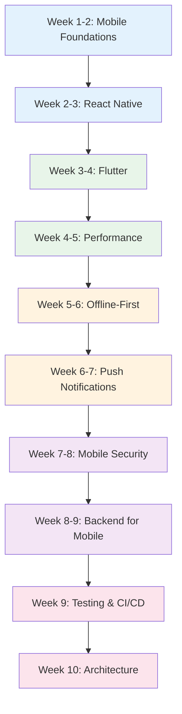

# Mobile Engineer Learning Path

A structured 10-week journey through the Knowledge Vault for mobile engineers. This path covers the 6 mobile engineering pages plus cross-platform development with React Native and Flutter, mobile performance optimization, push notifications, offline-first architecture, mobile security, and the backend/API knowledge needed to build complete mobile applications.

## Who This Is For

- Web developers transitioning to mobile development
- Junior mobile engineers leveling up to mid-level
- Full-stack engineers adding mobile to their skillset
- Anyone choosing between React Native and Flutter

## Prerequisites

- JavaScript/TypeScript fundamentals (for React Native path)
- Dart basics (for Flutter path) or willingness to learn
- Understanding of REST APIs and JSON
- Basic familiarity with mobile app concepts (screens, navigation, state)

**Total estimated time**: ~35 hours across 10 weeks

## Learning Progression

---

## Week 1-2: Mobile Engineering Foundations

*Estimated reading time: 3 hours*

Understand the mobile landscape, platform differences, and cross-platform architecture decisions before diving into specific frameworks.

- [ ] **Required** -- [Mobile Engineering Overview](/mobile-engineering/) *(25 min)*
- [ ] **Required** -- [Mobile Performance](/mobile-engineering/mobile-performance) *(25 min)*
- [ ] **Required** -- [React Native](/mobile-engineering/react-native) *(25 min)*
- [ ] **Required** -- [Flutter](/mobile-engineering/flutter) *(25 min)*
- [ ] **Required** -- [Push Notifications](/mobile-engineering/push-notifications) *(20 min)*
- [ ] **Required** -- [Offline-First](/mobile-engineering/offline-first) *(20 min)*

::: tip Checkpoint
After this section you should be able to: compare React Native and Flutter architectures, understand mobile-specific performance constraints (battery, memory, network), and know the key mobile engineering challenges (offline support, push, deep linking).
:::

---

## Week 2-3: React Native Deep Dive

*Estimated reading time: 4 hours*

React Native is the leading cross-platform framework for teams with JavaScript/TypeScript expertise.

- [ ] **Required** -- [React Native](/mobile-engineering/react-native) *(25 min -- deep read)*
- [ ] **Required** -- [React Internals](/frontend-engineering/react-internals) *(35 min)*
- [ ] **Required** -- [State Management Patterns](/frontend-engineering/state-management) *(30 min)*
- [ ] **Required** -- [Component Patterns Overview](/ui-design-systems/component-patterns/) *(15 min)*
- [ ] **Required** -- [Compound Components](/ui-design-systems/component-patterns/compound-components) *(25 min)*
- [ ] **Optional** -- [TypeScript Advanced](/infrastructure/languages/typescript-advanced) *(30 min)*
- [ ] **Optional** -- [TypeScript Patterns](/infrastructure/languages/typescript-patterns) *(30 min)*
- [ ] **Reference** -- [TypeScript Cheat Sheet](/cheat-sheets/typescript) *(10 min)*

::: tip Checkpoint
After this section you should be able to: build React Native apps with proper component architecture, understand the React Native bridge and new architecture (Fabric, TurboModules), implement state management for mobile, and use TypeScript effectively.
:::

---

## Week 3-4: Flutter Deep Dive

*Estimated reading time: 3.5 hours*

Flutter is the fastest-growing cross-platform framework with excellent performance and a rich widget ecosystem.

- [ ] **Required** -- [Flutter](/mobile-engineering/flutter) *(25 min -- deep read)*
- [ ] **Required** -- [Accessibility Overview](/ui-design-systems/accessibility/) *(15 min)*
- [ ] **Required** -- [Keyboard Navigation](/ui-design-systems/accessibility/keyboard-navigation) *(25 min)*
- [ ] **Required** -- [Motion Principles](/ui-design-systems/animations/motion-principles) *(25 min)*
- [ ] **Required** -- [Gesture Animations](/ui-design-systems/animations/gesture-animations) *(20 min)*
- [ ] **Optional** -- [Color Theory](/ui-design-systems/color-tokens/color-theory) *(20 min)*
- [ ] **Optional** -- [Spacing Scale](/ui-design-systems/spacing-layout/spacing-scale) *(20 min)*

::: tip Checkpoint
After this section you should be able to: build Flutter apps with widget composition, implement custom animations and gestures, design accessible mobile interfaces, and understand the rendering pipeline (Skia).
:::

---

## Week 4-5: Mobile Performance

*Estimated reading time: 4 hours*

Mobile performance is fundamentally different from web -- battery, memory, network, and startup time are critical constraints.

- [ ] **Required** -- [Mobile Performance](/mobile-engineering/mobile-performance) *(25 min -- deep read)*
- [ ] **Required** -- [Web Performance & Core Web Vitals](/frontend-engineering/web-performance) *(30 min)*
- [ ] **Required** -- [Memory Management](/performance/optimization/memory-management) *(25 min)*
- [ ] **Required** -- [V8 Optimization](/performance/optimization/v8-optimization) *(25 min)*
- [ ] **Required** -- [Browser Profiling](/performance/profiling/browser-profiling) *(30 min)*
- [ ] **Required** -- [Bundle Optimization](/frontend-engineering/bundle-optimization) *(25 min)*
- [ ] **Optional** -- [Algorithmic Optimization](/performance/optimization/algorithmic-optimization) *(20 min)*

::: tip Checkpoint
After this section you should be able to: profile and optimize mobile app startup time, reduce memory usage for mobile constraints, optimize list rendering and image loading, and measure performance with platform-specific tools.
:::

---

## Week 5-6: Offline-First Architecture

*Estimated reading time: 3.5 hours*

Mobile apps must work without a reliable network. Offline-first is a design philosophy, not just a feature.

- [ ] **Required** -- [Offline-First](/mobile-engineering/offline-first) *(20 min -- deep read)*
- [ ] **Required** -- [Caching Strategies](/system-design/caching/caching-strategies) *(25 min)*
- [ ] **Required** -- [Cache Invalidation](/system-design/caching/cache-invalidation) *(25 min)*
- [ ] **Required** -- [Consistency Models](/system-design/distributed-systems/consistency-models) *(30 min)*
- [ ] **Required** -- [CRDT Fundamentals](/system-design/distributed-systems/crdt-fundamentals) *(25 min)*
- [ ] **Optional** -- [Eventual Consistency](/architecture-patterns/event-driven/eventual-consistency) *(20 min)*
- [ ] **Optional** -- [SQLite Internals](/system-design/databases/sqlite-internals) *(20 min)*

::: tip Checkpoint
After this section you should be able to: design offline-first data synchronization, implement optimistic UI updates with conflict resolution, use CRDTs for collaborative offline editing, and choose between local storage options (SQLite, Realm, Hive).
:::

---

## Week 6-7: Push Notifications & Real-Time

*Estimated reading time: 3 hours*

Push notifications and real-time updates are core mobile capabilities.

- [ ] **Required** -- [Push Notifications](/mobile-engineering/push-notifications) *(20 min -- deep read)*
- [ ] **Required** -- [WebSockets](/system-design/networking/websockets) *(20 min)*
- [ ] **Required** -- [Notification Patterns](/system-design/patterns/notification-patterns) *(20 min)*
- [ ] **Required** -- [Notification Service Architecture](/production-blueprints/notification-service/architecture) *(25 min)*
- [ ] **Required** -- [Channel Adapters](/production-blueprints/notification-service/channel-adapters) *(20 min)*
- [ ] **Optional** -- [Rate Limiting](/production-blueprints/notification-service/rate-limiting) *(20 min)*
- [ ] **Optional** -- [Delivery Tracking](/production-blueprints/notification-service/delivery-tracking) *(20 min)*

::: tip Checkpoint
After this section you should be able to: implement APNs and FCM push notification flows, design notification preference systems, handle background vs foreground notification delivery, and build real-time features with WebSockets.
:::

---

## Week 7-8: Mobile Security

*Estimated reading time: 3.5 hours*

Mobile apps have unique security challenges: local data storage, certificate pinning, API key protection, and jailbreak detection.

- [ ] **Required** -- [Mobile Security](/cybersecurity/mobile-security) *(25 min)*
- [ ] **Required** -- [Authentication Overview](/security/authentication/) *(15 min)*
- [ ] **Required** -- [OAuth2 & OIDC](/security/authentication/oauth2-oidc) *(30 min)*
- [ ] **Required** -- [JWT Deep Dive](/security/authentication/jwt-deep-dive) *(25 min)*
- [ ] **Required** -- [Biometric Authentication](/security/authentication/biometric-auth) *(20 min)*
- [ ] **Required** -- [Device Trust](/security/authentication/device-trust) *(20 min)*
- [ ] **Optional** -- [Encryption at Rest](/security/encryption/encryption-at-rest) *(25 min)*
- [ ] **Optional** -- [API Key Design](/security/authentication/api-key-design) *(20 min)*

::: tip Checkpoint
After this section you should be able to: implement secure token storage on mobile, integrate biometric authentication, implement certificate pinning, and protect against reverse engineering.
:::

---

## Week 8-9: Backend for Mobile

*Estimated reading time: 4 hours*

Mobile engineers need to understand the APIs and services their apps consume.

- [ ] **Required** -- [REST API Best Practices](/system-design/api-design/rest-best-practices) *(25 min)*
- [ ] **Required** -- [API Versioning](/system-design/api-design/api-versioning) *(20 min)*
- [ ] **Required** -- [Pagination Patterns](/system-design/api-design/pagination-patterns) *(25 min)*
- [ ] **Required** -- [GraphQL vs REST](/system-design/networking/graphql-vs-rest) *(25 min)*
- [ ] **Required** -- [CDN Deep Dive](/system-design/caching/cdn-deep-dive) *(25 min)*
- [ ] **Required** -- [HTTP Caching](/performance/caching-strategies/http-caching) *(25 min)*
- [ ] **Optional** -- [GraphQL Advanced](/system-design/api-design/graphql-advanced) *(25 min)*
- [ ] **Optional** -- [File Storage Blueprint](/production-blueprints/file-storage/) *(35 min)*

::: tip Checkpoint
After this section you should be able to: design mobile-friendly APIs (pagination, partial responses, ETags), implement efficient image/asset loading with CDNs, choose between REST and GraphQL for mobile, and handle API versioning without breaking older app versions.
:::

---

## Week 9: Testing & CI/CD for Mobile

*Estimated reading time: 3 hours*

- [ ] **Required** -- [Test Architecture](/testing/test-architecture) *(25 min)*
- [ ] **Required** -- [Unit Testing](/testing/unit-testing) *(25 min)*
- [ ] **Required** -- [Integration Testing](/testing/integration-testing) *(25 min)*
- [ ] **Required** -- [E2E Testing](/testing/e2e-testing) *(25 min)*
- [ ] **Required** -- [CI/CD Overview](/infrastructure/ci-cd/) *(15 min)*
- [ ] **Required** -- [GitHub Actions Deep Dive](/infrastructure/ci-cd/github-actions-deep-dive) *(30 min)*

::: tip Checkpoint
After this section you should be able to: write unit and widget tests for mobile apps, set up E2E testing with Detox (RN) or Integration Test (Flutter), and build CI/CD pipelines for mobile app builds and distribution.
:::

---

## Week 10: Mobile Architecture & Capstone

*Estimated reading time: 3 hours*

- [ ] **Required** -- [Clean Architecture Overview](/architecture-patterns/clean-architecture/) *(15 min)*
- [ ] **Required** -- [Layers and Boundaries](/architecture-patterns/clean-architecture/layers-and-boundaries) *(25 min)*
- [ ] **Required** -- [Repository Pattern](/architecture-patterns/design-patterns/repository-pattern) *(25 min)*
- [ ] **Required** -- [Dependency Injection](/architecture-patterns/design-patterns/dependency-injection) *(25 min)*
- [ ] **Optional** -- [Feature Flags](/devops/feature-flags) *(25 min)*
- [ ] **Optional** -- [Feature Flag Blueprint](/production-blueprints/feature-flag-service/) *(35 min)*

### Suggested Capstone Project

Build a production-quality mobile application:

1. **Framework**: React Native or Flutter
2. **Auth**: OAuth2 with biometric login and secure token storage
3. **Offline**: Local database with sync, conflict resolution
4. **Push**: FCM/APNs with notification preferences
5. **Performance**: Optimized lists, image caching, startup < 2s
6. **Testing**: Unit, widget, and E2E tests
7. **CI/CD**: Automated builds and TestFlight/Play Store distribution

---

## What You Will Be Able to Do After This Path

- Build cross-platform mobile apps with React Native or Flutter
- Optimize mobile performance (startup, memory, battery, network)
- Design offline-first architectures with data synchronization
- Implement push notification systems with APNs and FCM
- Secure mobile apps with biometric auth, certificate pinning, and secure storage
- Design mobile-friendly APIs and handle API versioning
- Set up CI/CD pipelines for mobile app distribution

## Cross-References to Related Paths

- **[Frontend Engineer Path](/learning-paths/frontend-engineer)** -- Deep web frontend (React internals, WebAssembly, a11y)
- **[Full-Stack Engineer Path](/learning-paths/fullstack-engineer)** -- Backend + frontend for complete apps
- **[Backend Engineer Path](/learning-paths/backend-engineer)** -- APIs and services your app consumes
- **[Security Engineer Path](/learning-paths/security-engineer)** -- Deep auth and security
- **[System Design Interview Path](/learning-paths/system-design-interview)** -- Design mobile-heavy systems (Uber, Instagram)

---

::: info Total Progress
This path contains approximately 60 pages. At a pace of 5 pages per day, you can complete it in about 2 weeks. Choose either React Native (weeks 2-3) or Flutter (weeks 3-4) to focus on, or study both if you need to make a framework decision.
:::
