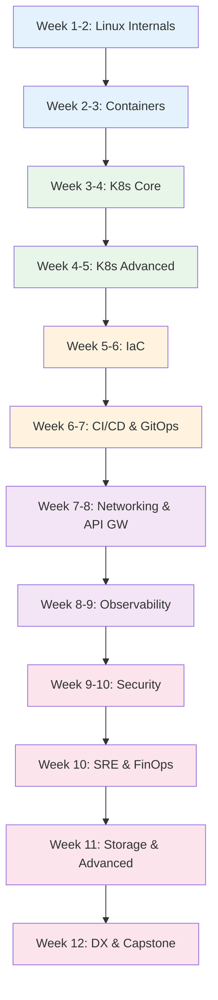

# Platform Engineer Learning Path

A structured 12-week journey through the Knowledge Vault for platform engineers. This path goes deeper than the DevOps path into Kubernetes advanced topics (CRDs, operators, admission webhooks), GitOps, FinOps, observability tools, API gateway patterns, storage systems, and developer experience. Platform engineering is the evolution of DevOps -- building self-service platforms that abstract infrastructure complexity.

## Who This Is For

- DevOps engineers evolving into platform engineering
- Infrastructure engineers building internal developer platforms
- SREs who want to shift from reactive to proactive platform building
- Anyone designing self-service infrastructure for engineering teams

## Prerequisites

- Basic Linux command line and networking (TCP/IP, DNS, HTTP)
- Experience with Docker and basic Kubernetes concepts
- Some experience with at least one cloud provider (AWS, GCP, Azure)
- Comfortable with at least one programming language

**Total estimated time**: ~55 hours across 12 weeks

## Learning Progression

---

## Week 1-2: Linux Internals

*Estimated reading time: 4 hours*

- [ ] **Required** -- [Linux Internals Overview](/infrastructure/linux-internals/) *(15 min)*
- [ ] **Required** -- [Linux Process Model](/infrastructure/linux-internals/process-model) *(30 min)*
- [ ] **Required** -- [Linux Memory Management](/infrastructure/linux-internals/memory-management) *(30 min)*
- [ ] **Required** -- [Containers from Scratch](/infrastructure/linux-internals/containers-from-scratch) *(35 min)*
- [ ] **Required** -- [eBPF](/infrastructure/linux-internals/ebpf) *(25 min)*
- [ ] **Required** -- [TCP/IP Deep Dive](/system-design/networking/tcp-ip-deep-dive) *(30 min)*
- [ ] **Required** -- [DNS Deep Dive](/system-design/networking/dns-deep-dive) *(25 min)*
- [ ] **Reference** -- [Linux Cheat Sheet](/cheat-sheets/linux) *(10 min)*
- [ ] **Reference** -- [Bash Cheat Sheet](/cheat-sheets/bash) *(10 min)*

---

## Week 2-3: Containers Deep Dive

*Estimated reading time: 4.5 hours*

- [ ] **Required** -- [Docker Overview](/infrastructure/docker/) *(15 min)*
- [ ] **Required** -- [Docker Internals](/infrastructure/docker/internals) *(30 min)*
- [ ] **Required** -- [Production Dockerfiles](/infrastructure/docker/production-dockerfiles) *(25 min)*
- [ ] **Required** -- [Multi-Stage Builds](/infrastructure/docker/multi-stage-builds) *(25 min)*
- [ ] **Required** -- [Image Optimization](/infrastructure/docker/image-optimization) *(25 min)*
- [ ] **Required** -- [Docker Security Hardening](/infrastructure/docker/security-hardening) *(25 min)*
- [ ] **Required** -- [Compose Patterns](/infrastructure/docker/compose-patterns) *(25 min)*
- [ ] **Reference** -- [Docker Cheat Sheet](/cheat-sheets/docker) *(10 min)*

---

## Week 3-4: Kubernetes Core

*Estimated reading time: 5 hours*

- [ ] **Required** -- [Kubernetes Overview](/infrastructure/kubernetes/) *(15 min)*
- [ ] **Required** -- [Architecture & Internals](/infrastructure/kubernetes/architecture-internals) *(35 min)*
- [ ] **Required** -- [Pod Lifecycle](/infrastructure/kubernetes/pod-lifecycle) *(25 min)*
- [ ] **Required** -- [Deployments & StatefulSets](/infrastructure/kubernetes/deployments-statefulsets) *(30 min)*
- [ ] **Required** -- [Services & Ingress](/infrastructure/kubernetes/services-ingress) *(25 min)*
- [ ] **Required** -- [Secrets Management](/infrastructure/kubernetes/secrets-management) *(25 min)*
- [ ] **Required** -- [Network Policies](/infrastructure/kubernetes/network-policies) *(25 min)*
- [ ] **Required** -- [Helm Charts](/infrastructure/kubernetes/helm-charts) *(25 min)*
- [ ] **Reference** -- [Kubernetes Cheat Sheet](/cheat-sheets/kubernetes) *(10 min)*

---

## Week 4-5: Kubernetes Advanced (CRDs, Operators, Webhooks)

*Estimated reading time: 6 hours*

This is where platform engineering diverges from basic DevOps. Master the extension points that let you build platform abstractions on top of Kubernetes.

- [ ] **Required** -- [HPA, VPA & KEDA](/infrastructure/kubernetes/hpa-vpa-keda) *(25 min)*
- [ ] **Required** -- [RBAC](/infrastructure/kubernetes/rbac) *(25 min)*
- [ ] **Required** -- [CRDs & Operators](/infrastructure/kubernetes/crds-operators) *(30 min)*
- [ ] **Required** -- [Operators](/infrastructure/kubernetes/operators) *(25 min)*
- [ ] **Required** -- [Admission Webhooks](/infrastructure/kubernetes/admission-webhooks) *(30 min)*
- [ ] **Required** -- [CNI Networking](/infrastructure/kubernetes/cni-networking) *(25 min)*
- [ ] **Required** -- [GitOps](/infrastructure/kubernetes/gitops) *(25 min)*
- [ ] **Required** -- [Production Checklist](/infrastructure/kubernetes/production-checklist) *(30 min)*
- [ ] **Required** -- [Troubleshooting](/infrastructure/kubernetes/troubleshooting) *(30 min)*
- [ ] **Optional** -- [ECS vs EKS](/infrastructure/aws/ecs-vs-eks) *(25 min)*
- [ ] **Optional** -- [GKE Deep Dive](/infrastructure/gcp/gke) *(25 min)*
- [ ] **Reference** -- [kubectl Advanced Cheat Sheet](/cheat-sheets/kubectl-advanced) *(10 min)*

::: tip Checkpoint
After this section you should be able to: build custom CRDs and operators for platform abstractions, implement admission webhooks for policy enforcement, configure GitOps with ArgoCD/Flux, and understand CNI networking internals.
:::

---

## Week 5-6: Infrastructure as Code

*Estimated reading time: 6 hours*

- [ ] **Required** -- [Terraform Overview](/infrastructure/terraform/) *(15 min)*
- [ ] **Required** -- [Terraform Fundamentals](/infrastructure/terraform/fundamentals) *(30 min)*
- [ ] **Required** -- [State Management](/infrastructure/terraform/state-management) *(30 min)*
- [ ] **Required** -- [Terraform Modules](/infrastructure/terraform/modules) *(30 min)*
- [ ] **Required** -- [Workspaces](/infrastructure/terraform/workspaces) *(25 min)*
- [ ] **Required** -- [Security Hardening](/infrastructure/terraform/security-hardening) *(25 min)*
- [ ] **Required** -- [Multi-Region](/infrastructure/terraform/multi-region) *(25 min)*
- [ ] **Optional** -- [Cost Optimization (Terraform)](/infrastructure/terraform/cost-optimization) *(25 min)*
- [ ] **Optional** -- [AWS Startup Stack](/infrastructure/terraform/aws-startup-stack) *(30 min)*
- [ ] **Optional** -- [GCP Startup Stack](/infrastructure/terraform/gcp-startup-stack) *(30 min)*
- [ ] **Reference** -- [Terraform Cheat Sheet](/cheat-sheets/terraform) *(10 min)*

---

## Week 6-7: CI/CD & GitOps

*Estimated reading time: 5 hours*

- [ ] **Required** -- [CI/CD Overview](/infrastructure/ci-cd/) *(15 min)*
- [ ] **Required** -- [GitHub Actions Deep Dive](/infrastructure/ci-cd/github-actions-deep-dive) *(30 min)*
- [ ] **Required** -- [Pipeline Patterns](/infrastructure/ci-cd/pipeline-patterns) *(25 min)*
- [ ] **Required** -- [Environment Promotion](/infrastructure/ci-cd/environment-promotion) *(20 min)*
- [ ] **Required** -- [Artifact Management](/infrastructure/ci-cd/artifact-management) *(20 min)*
- [ ] **Required** -- [Security Scanning](/infrastructure/ci-cd/security-scanning) *(25 min)*
- [ ] **Required** -- [Deployment Strategies Overview](/devops/deployment-strategies/) *(15 min)*
- [ ] **Required** -- [Blue-Green Deployment](/devops/deployment-strategies/blue-green) *(20 min)*
- [ ] **Required** -- [Canary Deployment](/devops/deployment-strategies/canary) *(20 min)*
- [ ] **Required** -- [Release Engineering](/devops/release-engineering) *(25 min)*
- [ ] **Required** -- [Feature Flags](/devops/feature-flags) *(25 min)*
- [ ] **Optional** -- [GitLab CI](/infrastructure/ci-cd/gitlab-ci) *(25 min)*

---

## Week 7-8: Networking, Service Mesh & API Gateway

*Estimated reading time: 5 hours*

- [ ] **Required** -- [Load Balancing Overview](/system-design/load-balancing/) *(15 min)*
- [ ] **Required** -- [L4 vs L7 Load Balancing](/system-design/load-balancing/l4-vs-l7) *(25 min)*
- [ ] **Required** -- [Health Checks](/system-design/load-balancing/health-checks) *(20 min)*
- [ ] **Required** -- [NGINX Config](/system-design/load-balancing/nginx-config) *(25 min)*
- [ ] **Required** -- [Service Discovery](/system-design/networking/service-discovery) *(25 min)*
- [ ] **Required** -- [TLS Handshake](/system-design/networking/tls-handshake) *(20 min)*
- [ ] **Required** -- [Service Mesh Overview](/infrastructure/service-mesh/) *(25 min)*
- [ ] **Required** -- [API Gateway Overview](/infrastructure/api-gateway/) *(25 min)*
- [ ] **Optional** -- [Envoy Config](/system-design/load-balancing/envoy-config) *(25 min)*
- [ ] **Optional** -- [gRPC Internals](/system-design/networking/grpc-internals) *(25 min)*
- [ ] **Optional** -- [Global Load Balancing](/system-design/load-balancing/global-load-balancing) *(25 min)*
- [ ] **Reference** -- [Nginx Cheat Sheet](/cheat-sheets/nginx) *(10 min)*

---

## Week 8-9: Observability Stack

*Estimated reading time: 6 hours*

- [ ] **Required** -- [Observability Overview](/infrastructure/observability/) *(15 min)*
- [ ] **Required** -- [Observability Tools](/devops/observability-tools/) *(25 min)*
- [ ] **Required** -- [Monitoring Overview](/devops/monitoring/) *(15 min)*
- [ ] **Required** -- [Metrics Design](/devops/monitoring/metrics-design) *(25 min)*
- [ ] **Required** -- [Prometheus Deep Dive](/devops/monitoring/prometheus-deep-dive) *(30 min)*
- [ ] **Required** -- [Custom Metrics](/devops/monitoring/custom-metrics) *(25 min)*
- [ ] **Required** -- [Grafana Dashboards](/devops/monitoring/grafana-dashboards) *(25 min)*
- [ ] **Required** -- [Structured Logging](/devops/logging/structured-logging) *(25 min)*
- [ ] **Required** -- [Correlation IDs](/devops/logging/correlation-ids) *(20 min)*
- [ ] **Required** -- [Log Aggregation](/devops/logging/log-aggregation) *(20 min)*
- [ ] **Required** -- [Alert Design](/devops/alerting/alert-design) *(25 min)*
- [ ] **Required** -- [Severity Levels](/devops/alerting/severity-levels) *(20 min)*
- [ ] **Optional** -- [Monitoring Antipatterns](/devops/monitoring/monitoring-antipatterns) *(20 min)*
- [ ] **Optional** -- [Sensitive Data Redaction](/devops/logging/sensitive-data-redaction) *(20 min)*
- [ ] **Reference** -- [PromQL Cheat Sheet](/cheat-sheets/promql) *(10 min)*

**Comparisons:**

- [ ] **Optional** -- [Datadog vs Grafana](/comparisons/datadog-vs-grafana) *(20 min)*

---

## Week 9-10: Security & Compliance

*Estimated reading time: 5 hours*

- [ ] **Required** -- [Secrets Management Overview](/security/secrets-management/) *(15 min)*
- [ ] **Required** -- [HashiCorp Vault](/security/secrets-management/vault-deep-dive) *(30 min)*
- [ ] **Required** -- [Secrets in CI/CD](/security/secrets-management/secrets-in-ci-cd) *(25 min)*
- [ ] **Required** -- [Rotation Automation](/security/secrets-management/rotation-automation) *(25 min)*
- [ ] **Required** -- [Zero Trust Principles](/security/zero-trust/principles) *(25 min)*
- [ ] **Required** -- [Network Segmentation](/security/zero-trust/network-segmentation) *(25 min)*
- [ ] **Required** -- [Least Privilege](/security/zero-trust/least-privilege) *(25 min)*
- [ ] **Optional** -- [AWS IAM Deep Dive](/infrastructure/aws/iam-deep-dive) *(30 min)*
- [ ] **Optional** -- [GCP IAM](/infrastructure/gcp/iam) *(25 min)*
- [ ] **Optional** -- [Encryption at Rest](/security/encryption/encryption-at-rest) *(20 min)*
- [ ] **Optional** -- [VPC Networking](/infrastructure/aws/vpc-networking) *(30 min)*

---

## Week 10: SRE Practices & FinOps

*Estimated reading time: 5 hours*

### SRE

- [ ] **Required** -- [SRE Overview](/devops/sre/) *(15 min)*
- [ ] **Required** -- [SLI, SLO, SLA](/devops/sre/sli-slo-sla) *(25 min)*
- [ ] **Required** -- [Error Budgets](/devops/sre/error-budgets) *(25 min)*
- [ ] **Required** -- [Toil Reduction](/devops/sre/toil-reduction) *(25 min)*
- [ ] **Required** -- [Capacity Planning](/devops/sre/capacity-planning) *(25 min)*
- [ ] **Required** -- [Chaos Engineering](/devops/incident-response/chaos-engineering) *(30 min)*
- [ ] **Required** -- [Postmortem Framework](/devops/incident-response/postmortem-framework) *(25 min)*

### FinOps

- [ ] **Required** -- [FinOps Overview](/infrastructure/finops/) *(15 min)*
- [ ] **Required** -- [Cost Optimization](/infrastructure/finops/cost-optimization) *(25 min)*
- [ ] **Required** -- [Cost Allocation](/infrastructure/finops/cost-allocation) *(25 min)*
- [ ] **Optional** -- [AWS Cost Optimization](/infrastructure/aws/cost-optimization) *(25 min)*
- [ ] **Optional** -- [GCP Cost Optimization](/infrastructure/gcp/cost-optimization) *(25 min)*

::: tip Checkpoint
After this section you should be able to: define SLOs and error budgets, implement FinOps practices with cost allocation and optimization, run chaos experiments, and reduce toil systematically.
:::

---

## Week 11: Storage Systems & Advanced Topics

*Estimated reading time: 4 hours*

- [ ] **Required** -- [Storage Systems Overview](/infrastructure/storage/) *(15 min)*
- [ ] **Required** -- [Distributed Filesystems](/infrastructure/storage/distributed-filesystems) *(25 min)*
- [ ] **Required** -- [Multi-Region Overview](/infrastructure/multi-region/) *(15 min)*
- [ ] **Required** -- [Architecture Patterns (Multi-Region)](/infrastructure/multi-region/architecture-patterns) *(25 min)*
- [ ] **Required** -- [Failover Strategies](/infrastructure/multi-region/failover-strategies) *(25 min)*
- [ ] **Required** -- [Data Replication](/infrastructure/multi-region/data-replication) *(25 min)*
- [ ] **Required** -- [Traffic Routing](/infrastructure/multi-region/traffic-routing) *(25 min)*
- [ ] **Optional** -- [Cloud Comparison](/infrastructure/cloud-comparison) *(20 min)*
- [ ] **Optional** -- [AWS Well-Architected](/infrastructure/aws/well-architected) *(25 min)*
- [ ] **Optional** -- [CAP Theorem](/system-design/distributed-systems/cap-theorem) *(25 min)*

---

## Week 12: Developer Experience & Capstone

*Estimated reading time: 4 hours*

### Platform Engineering & DX

- [ ] **Required** -- [Platform Engineering Overview](/infrastructure/platform-engineering/) *(15 min)*
- [ ] **Required** -- [Developer Experience](/infrastructure/platform-engineering/developer-experience) *(25 min)*
- [ ] **Required** -- [Backstage](/infrastructure/platform-engineering/backstage) *(25 min)*

### Engineering Practices

- [ ] **Optional** -- [Architecture Decision Records](/devops/engineering-practices/architecture-decision-records) *(25 min)*
- [ ] **Optional** -- [Design Doc Template](/devops/engineering-practices/design-doc-template) *(20 min)*
- [ ] **Optional** -- [Technical Leadership](/devops/engineering-practices/technical-leadership) *(25 min)*
- [ ] **Optional** -- [Tech Debt](/devops/engineering-practices/tech-debt) *(25 min)*

### Comparisons

- [ ] **Optional** -- [Terraform vs Pulumi](/comparisons/terraform-vs-pulumi) *(20 min)*
- [ ] **Optional** -- [Docker vs Podman](/comparisons/docker-vs-podman) *(15 min)*
- [ ] **Optional** -- [GitHub Actions vs GitLab CI](/comparisons/github-actions-vs-gitlab-ci) *(15 min)*
- [ ] **Optional** -- [Nginx vs Caddy vs Traefik](/comparisons/nginx-vs-caddy-vs-traefik) *(15 min)*

---

## What You Will Be Able to Do After This Path

- Build custom Kubernetes operators, CRDs, and admission webhooks
- Implement GitOps with ArgoCD/Flux for declarative infrastructure
- Design FinOps practices with cost allocation and optimization
- Build comprehensive observability stacks with metrics, logs, and traces
- Manage API gateways and service meshes at scale
- Design storage systems and multi-region architectures
- Build internal developer platforms with golden paths and self-service
- Apply SRE practices: SLOs, error budgets, chaos engineering

## Cross-References to Related Paths

- **[DevOps Engineer Path](/learning-paths/devops-engineer)** -- Operational foundation this path builds on
- **[Backend Engineer Path](/learning-paths/backend-engineer)** -- Understand the applications your platform serves
- **[Security Engineer Path](/learning-paths/security-engineer)** -- Deep security expertise
- **[System Design Interview Path](/learning-paths/system-design-interview)** -- Infrastructure design interview prep
- **[AI/ML Engineer Path](/learning-paths/ai-ml-engineer)** -- GPU infrastructure and model serving

---

::: info Total Progress
This path contains approximately 100 pages. The Kubernetes advanced section (CRDs, operators, admission webhooks, GitOps) is the differentiator from the DevOps path. Budget 12 weeks at 5 hours per week.
:::
