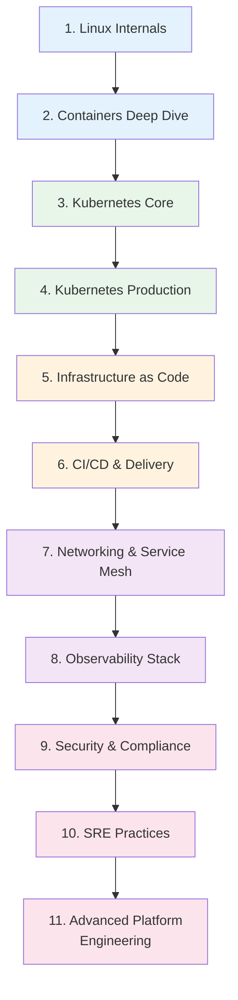

# Platform Engineer Learning Path

A structured journey through the Knowledge Vault for platform engineers. Platform engineering has emerged as the evolution of DevOps — instead of embedding ops engineers in product teams, you build a platform that abstracts infrastructure complexity and gives developers self-service capabilities.

This path covers the full stack of platform engineering: containers, orchestration, infrastructure as code, CI/CD pipelines, observability, SRE practices, security hardening, and developer experience (DX). It goes deeper on infrastructure than the [DevOps Engineer](/learning-paths/devops-engineer) path and adds platform-specific concerns like internal developer platforms, golden paths, and self-service tooling.

**Total estimated time**: ~50 hours across 11 sections

**Prerequisites**: Basic Linux command line. Understanding of networking (TCP/IP, DNS, HTTP). Some experience with cloud providers (AWS, GCP, or Azure). Comfortable with at least one programming language.

## Learning Progression

---

## Section 1: Linux Internals

*Estimated reading time: 4 hours*

Platform engineers must understand the operating system layer. Containers are built on Linux primitives (namespaces, cgroups), and debugging production issues often requires kernel-level understanding.

- [ ] **Required** — [Linux Internals Overview](/infrastructure/linux-internals/) *(15 min)*
- [ ] **Required** — [Linux Process Model](/infrastructure/linux-internals/process-model) *(30 min)*
- [ ] **Required** — [Linux Memory Management](/infrastructure/linux-internals/memory-management) *(30 min)*
- [ ] **Required** — [Containers from Scratch](/infrastructure/linux-internals/containers-from-scratch) *(35 min)*
- [ ] **Required** — [TCP/IP Deep Dive](/system-design/networking/tcp-ip-deep-dive) *(30 min)*
- [ ] **Required** — [DNS Deep Dive](/system-design/networking/dns-deep-dive) *(25 min)*
- [ ] **Reference** — [Linux Cheat Sheet](/cheat-sheets/linux) *(10 min)*
- [ ] **Reference** — [Bash Cheat Sheet](/cheat-sheets/bash) *(10 min)*

::: tip Checkpoint
After this section you should be able to: explain how Linux namespaces and cgroups provide container isolation, debug process issues using /proc and system calls, understand memory management (virtual memory, OOM killer), and trace network issues through the TCP/IP stack.
:::

---

## Section 2: Containers Deep Dive

*Estimated reading time: 4.5 hours*

Containers are the deployment primitive of modern platforms. Go beyond `docker run` to understand image internals, security, and optimization.

- [ ] **Required** — [Docker Overview](/infrastructure/docker/) *(15 min)*
- [ ] **Required** — [Docker Internals](/infrastructure/docker/internals) *(30 min)*
- [ ] **Required** — [Production Dockerfiles](/infrastructure/docker/production-dockerfiles) *(25 min)*
- [ ] **Required** — [Multi-Stage Builds](/infrastructure/docker/multi-stage-builds) *(25 min)*
- [ ] **Required** — [Image Optimization](/infrastructure/docker/image-optimization) *(25 min)*
- [ ] **Required** — [Docker Security Hardening](/infrastructure/docker/security-hardening) *(25 min)*
- [ ] **Required** — [Compose Patterns](/infrastructure/docker/compose-patterns) *(25 min)*
- [ ] **Reference** — [Docker Cheat Sheet](/cheat-sheets/docker) *(10 min)*

::: tip Checkpoint
After this section you should be able to: write production-grade multi-stage Dockerfiles, optimize image size (distroless, minimal layers, .dockerignore), apply security hardening (non-root, read-only filesystem, capability dropping), and understand OCI image format and layer caching.
:::

---

## Section 3: Kubernetes Core

*Estimated reading time: 5 hours*

Kubernetes is the standard platform for running containerized workloads. Start with the architecture and core primitives.

- [ ] **Required** — [Kubernetes Overview](/infrastructure/kubernetes/) *(15 min)*
- [ ] **Required** — [Architecture & Internals](/infrastructure/kubernetes/architecture-internals) *(35 min)*
- [ ] **Required** — [Pod Lifecycle](/infrastructure/kubernetes/pod-lifecycle) *(25 min)*
- [ ] **Required** — [Deployments & StatefulSets](/infrastructure/kubernetes/deployments-statefulsets) *(30 min)*
- [ ] **Required** — [Services & Ingress](/infrastructure/kubernetes/services-ingress) *(25 min)*
- [ ] **Required** — [Secrets Management](/infrastructure/kubernetes/secrets-management) *(25 min)*
- [ ] **Required** — [Network Policies](/infrastructure/kubernetes/network-policies) *(25 min)*
- [ ] **Required** — [Helm Charts](/infrastructure/kubernetes/helm-charts) *(25 min)*
- [ ] **Reference** — [Kubernetes Cheat Sheet](/cheat-sheets/kubernetes) *(10 min)*

::: tip Checkpoint
After this section you should be able to: explain the K8s control plane (API server, etcd, scheduler, controller manager), create and manage Deployments, Services, and Ingress resources, configure health probes (liveness, readiness, startup), manage secrets securely, and write Helm charts for reusable deployments.
:::

---

## Section 4: Kubernetes Production

*Estimated reading time: 5 hours*

Running Kubernetes in production requires autoscaling, RBAC, operators, and operational hardening that goes far beyond tutorials.

- [ ] **Required** — [HPA, VPA & KEDA](/infrastructure/kubernetes/hpa-vpa-keda) *(25 min)*
- [ ] **Required** — [RBAC](/infrastructure/kubernetes/rbac) *(25 min)*
- [ ] **Required** — [Operators](/infrastructure/kubernetes/operators) *(25 min)*
- [ ] **Required** — [Production Checklist](/infrastructure/kubernetes/production-checklist) *(30 min)*
- [ ] **Required** — [Troubleshooting](/infrastructure/kubernetes/troubleshooting) *(30 min)*
- [ ] **Optional** — [ECS vs EKS](/infrastructure/aws/ecs-vs-eks) *(25 min)*
- [ ] **Optional** — [GKE Deep Dive](/infrastructure/gcp/gke) *(25 min)*

::: tip Checkpoint
After this section you should be able to: configure horizontal and vertical pod autoscaling, implement RBAC policies for multi-tenant clusters, debug common Kubernetes issues (CrashLoopBackOff, ImagePullBackOff, evictions), evaluate managed K8s offerings (EKS vs GKE vs self-managed), and create a production readiness checklist.
:::

---

## Section 5: Infrastructure as Code

*Estimated reading time: 6 hours*

Platform engineers define infrastructure declaratively. Terraform is the industry standard, and this section covers it thoroughly.

- [ ] **Required** — [Terraform Overview](/infrastructure/terraform/) *(15 min)*
- [ ] **Required** — [Terraform Fundamentals](/infrastructure/terraform/fundamentals) *(30 min)*
- [ ] **Required** — [State Management](/infrastructure/terraform/state-management) *(30 min)*
- [ ] **Required** — [Terraform Modules](/infrastructure/terraform/modules) *(30 min)*
- [ ] **Required** — [Workspaces](/infrastructure/terraform/workspaces) *(25 min)*
- [ ] **Required** — [Security Hardening](/infrastructure/terraform/security-hardening) *(25 min)*
- [ ] **Required** — [Multi-Region](/infrastructure/terraform/multi-region) *(25 min)*
- [ ] **Optional** — [Cost Optimization (Terraform)](/infrastructure/terraform/cost-optimization) *(25 min)*
- [ ] **Optional** — [AWS Startup Stack](/infrastructure/terraform/aws-startup-stack) *(30 min)*
- [ ] **Optional** — [GCP Startup Stack](/infrastructure/terraform/gcp-startup-stack) *(30 min)*
- [ ] **Reference** — [Terraform Cheat Sheet](/cheat-sheets/terraform) *(10 min)*

::: tip Checkpoint
After this section you should be able to: write modular Terraform with reusable modules, manage state safely (remote backends, locking, state splitting), implement multi-environment infrastructure (dev/staging/prod), apply security scanning to Terraform plans, and design multi-region infrastructure.
:::

---

## Section 6: CI/CD & Delivery

*Estimated reading time: 5 hours*

Platform engineers build the delivery pipelines that every team uses. This section covers CI/CD design, deployment strategies, and artifact management.

- [ ] **Required** — [CI/CD Overview](/infrastructure/ci-cd/) *(15 min)*
- [ ] **Required** — [GitHub Actions Deep Dive](/infrastructure/ci-cd/github-actions-deep-dive) *(30 min)*
- [ ] **Required** — [Pipeline Patterns](/infrastructure/ci-cd/pipeline-patterns) *(25 min)*
- [ ] **Required** — [Environment Promotion](/infrastructure/ci-cd/environment-promotion) *(20 min)*
- [ ] **Required** — [Artifact Management](/infrastructure/ci-cd/artifact-management) *(20 min)*
- [ ] **Required** — [Security Scanning](/infrastructure/ci-cd/security-scanning) *(25 min)*
- [ ] **Required** — [Deployment Strategies Overview](/devops/deployment-strategies/) *(15 min)*
- [ ] **Required** — [Blue-Green Deployment](/devops/deployment-strategies/blue-green) *(20 min)*
- [ ] **Required** — [Canary Deployment](/devops/deployment-strategies/canary) *(20 min)*
- [ ] **Required** — [Rolling Updates](/devops/deployment-strategies/rolling-updates) *(20 min)*
- [ ] **Optional** — [Feature Flags as Deployment](/devops/deployment-strategies/feature-flags-deployment) *(20 min)*
- [ ] **Optional** — [Database Migrations](/devops/deployment-strategies/database-migrations) *(25 min)*
- [ ] **Optional** — [Rollback Procedures](/devops/deployment-strategies/rollback-procedures) *(20 min)*
- [ ] **Optional** — [GitLab CI](/infrastructure/ci-cd/gitlab-ci) *(25 min)*

::: tip Checkpoint
After this section you should be able to: design CI/CD pipelines for multiple teams and languages, implement blue-green, canary, and rolling deployments, set up security scanning in the pipeline (SAST, SCA, container scanning), manage artifacts and promote them across environments, and handle database migrations safely during deployments.
:::

---

## Section 7: Networking & Service Mesh

*Estimated reading time: 5 hours*

Platform engineers manage the network layer — load balancing, service mesh, DNS, and TLS.

- [ ] **Required** — [Load Balancing Overview](/system-design/load-balancing/) *(15 min)*
- [ ] **Required** — [L4 vs L7 Load Balancing](/system-design/load-balancing/l4-vs-l7) *(25 min)*
- [ ] **Required** — [Health Checks](/system-design/load-balancing/health-checks) *(20 min)*
- [ ] **Required** — [NGINX Config](/system-design/load-balancing/nginx-config) *(25 min)*
- [ ] **Required** — [Service Discovery](/system-design/networking/service-discovery) *(25 min)*
- [ ] **Required** — [TLS Handshake](/system-design/networking/tls-handshake) *(20 min)*
- [ ] **Required** — [Service Mesh Overview](/infrastructure/service-mesh/) *(25 min)*
- [ ] **Optional** — [Envoy Config](/system-design/load-balancing/envoy-config) *(25 min)*
- [ ] **Optional** — [HAProxy Config](/system-design/load-balancing/haproxy-config) *(25 min)*
- [ ] **Optional** — [gRPC Internals](/system-design/networking/grpc-internals) *(25 min)*
- [ ] **Optional** — [Global Load Balancing](/system-design/load-balancing/global-load-balancing) *(25 min)*
- [ ] **Reference** — [Nginx Cheat Sheet](/cheat-sheets/nginx) *(10 min)*

::: tip Checkpoint
After this section you should be able to: configure L4 and L7 load balancers for different workloads, implement service discovery and health checking, understand service mesh data plane/control plane architecture, configure mTLS for service-to-service communication, and debug network issues across the stack.
:::

---

## Section 8: Observability Stack

*Estimated reading time: 6 hours*

"If you cannot measure it, you cannot improve it." Observability is a core platform capability — metrics, logs, and traces that every team relies on.

- [ ] **Required** — [Observability Overview](/infrastructure/observability/) *(15 min)*
- [ ] **Required** — [Monitoring Overview](/devops/monitoring/) *(15 min)*
- [ ] **Required** — [Metrics Design](/devops/monitoring/metrics-design) *(25 min)*
- [ ] **Required** — [Prometheus Deep Dive](/devops/monitoring/prometheus-deep-dive) *(30 min)*
- [ ] **Required** — [Custom Metrics](/devops/monitoring/custom-metrics) *(25 min)*
- [ ] **Required** — [Grafana Dashboards](/devops/monitoring/grafana-dashboards) *(25 min)*
- [ ] **Required** — [Logging Overview](/devops/logging/) *(15 min)*
- [ ] **Required** — [Structured Logging](/devops/logging/structured-logging) *(25 min)*
- [ ] **Required** — [Correlation IDs](/devops/logging/correlation-ids) *(20 min)*
- [ ] **Required** — [Log Aggregation](/devops/logging/log-aggregation) *(20 min)*
- [ ] **Required** — [Alert Design](/devops/alerting/alert-design) *(25 min)*
- [ ] **Required** — [Severity Levels](/devops/alerting/severity-levels) *(20 min)*
- [ ] **Optional** — [Log Levels Strategy](/devops/logging/log-levels-strategy) *(20 min)*
- [ ] **Optional** — [Sensitive Data Redaction](/devops/logging/sensitive-data-redaction) *(20 min)*
- [ ] **Optional** — [Monitoring Antipatterns](/devops/monitoring/monitoring-antipatterns) *(20 min)*
- [ ] **Optional** — [Escalation Policies](/devops/alerting/escalation-policies) *(20 min)*
- [ ] **Reference** — [PromQL Cheat Sheet](/cheat-sheets/promql) *(10 min)*

::: tip Checkpoint
After this section you should be able to: design a complete observability stack (metrics, logs, traces), write PromQL queries and build Grafana dashboards, implement structured logging with correlation IDs for distributed tracing, design alerts that minimize noise and maximize actionability, and build platform-wide monitoring templates for product teams.
:::

---

## Section 9: Security & Compliance

*Estimated reading time: 5 hours*

Platform engineers are responsible for security at the infrastructure layer — secrets, access control, network segmentation, and compliance.

- [ ] **Required** — [Security Overview](/security/) *(15 min)*
- [ ] **Required** — [Secrets Management Overview](/security/secrets-management/) *(15 min)*
- [ ] **Required** — [HashiCorp Vault](/security/secrets-management/vault-deep-dive) *(30 min)*
- [ ] **Required** — [Secrets in CI/CD](/security/secrets-management/secrets-in-ci-cd) *(25 min)*
- [ ] **Required** — [Secret Rotation Automation](/security/secrets-management/rotation-automation) *(25 min)*
- [ ] **Required** — [Zero Trust Principles](/security/zero-trust/principles) *(25 min)*
- [ ] **Required** — [Network Segmentation](/security/zero-trust/network-segmentation) *(25 min)*
- [ ] **Required** — [Least Privilege](/security/zero-trust/least-privilege) *(25 min)*
- [ ] **Optional** — [AWS IAM Deep Dive](/infrastructure/aws/iam-deep-dive) *(30 min)*
- [ ] **Optional** — [GCP IAM Deep Dive](/infrastructure/gcp/iam) *(25 min)*
- [ ] **Optional** — [Encryption at Rest](/security/encryption/encryption-at-rest) *(20 min)*
- [ ] **Optional** — [VPC Networking](/infrastructure/aws/vpc-networking) *(30 min)*

::: tip Checkpoint
After this section you should be able to: implement secrets management with Vault or cloud-native solutions, apply zero trust principles to infrastructure design, configure network segmentation and least-privilege access, automate secret rotation, and design IAM policies for multi-team environments.
:::

---

## Section 10: SRE Practices

*Estimated reading time: 4 hours*

Platform engineers practice Site Reliability Engineering — error budgets, incident management, chaos engineering, and reliability culture.

- [ ] **Required** — [Incident Response Overview](/devops/incident-response/) *(15 min)*
- [ ] **Required** — [Incident Classification](/devops/incident-response/incident-classification) *(20 min)*
- [ ] **Required** — [War Room Procedures](/devops/incident-response/war-room-procedures) *(25 min)*
- [ ] **Required** — [Postmortem Framework](/devops/incident-response/postmortem-framework) *(25 min)*
- [ ] **Required** — [Communication Templates](/devops/incident-response/communication-templates) *(20 min)*
- [ ] **Required** — [Chaos Engineering](/devops/incident-response/chaos-engineering) *(30 min)*
- [ ] **Required** — [On-Call Best Practices](/devops/alerting/on-call-best-practices) *(25 min)*
- [ ] **Optional** — [On-Call Handbook](/devops/engineering-practices/on-call-handbook) *(25 min)*
- [ ] **Optional** — [Runbook Templates](/devops/alerting/runbook-templates) *(20 min)*

::: tip Checkpoint
After this section you should be able to: lead incident response with clear roles and communication, write blameless postmortems that drive systemic improvements, design and run chaos experiments to find weaknesses, build runbooks for common failure modes, and define SLOs and error budgets for platform services.
:::

---

## Section 11: Advanced Platform Engineering

*Estimated reading time: 5 hours*

Advanced topics that distinguish a senior platform engineer: multi-region infrastructure, cost optimization, and developer experience.

- [ ] **Required** — [Multi-Region Overview](/infrastructure/multi-region/) *(15 min)*
- [ ] **Required** — [Architecture Patterns (Multi-Region)](/infrastructure/multi-region/architecture-patterns) *(25 min)*
- [ ] **Required** — [Failover Strategies](/infrastructure/multi-region/failover-strategies) *(25 min)*
- [ ] **Required** — [Cross-Region Data Replication](/infrastructure/multi-region/data-replication) *(25 min)*
- [ ] **Required** — [Traffic Routing](/infrastructure/multi-region/traffic-routing) *(25 min)*
- [ ] **Optional** — [Multi-Region Cost Analysis](/infrastructure/multi-region/cost-analysis) *(20 min)*
- [ ] **Optional** — [AWS Cost Optimization](/infrastructure/aws/cost-optimization) *(25 min)*
- [ ] **Optional** — [GCP Cost Optimization](/infrastructure/gcp/cost-optimization) *(25 min)*
- [ ] **Optional** — [AWS Well-Architected](/infrastructure/aws/well-architected) *(25 min)*
- [ ] **Optional** — [CAP Theorem](/system-design/distributed-systems/cap-theorem) *(25 min)*
- [ ] **Optional** — [Consistency Models](/system-design/distributed-systems/consistency-models) *(30 min)*

### Suggested Capstone Project

Build an internal developer platform:

1. **Golden path template**: Terraform module + Helm chart for a standard microservice
2. **CI/CD pipeline**: Reusable GitHub Actions workflow with security scanning
3. **Observability**: Pre-configured Prometheus alerts + Grafana dashboard template
4. **Self-service**: CLI tool or web UI for teams to provision new services
5. **Documentation**: Runbooks, ADRs, and onboarding guides

---

## Platform Engineer vs DevOps Engineer

| Aspect | DevOps Engineer | Platform Engineer |
|---|---|---|
| **Focus** | Team-level automation | Organization-level platform |
| **Users** | The ops team | All engineering teams |
| **Output** | Scripts, pipelines, infrastructure | Self-service platform, golden paths |
| **Measure** | Uptime, deployment frequency | Developer productivity, time-to-production |
| **Key skill** | Deep tool expertise | Abstraction and product thinking |

The [DevOps Engineer path](/learning-paths/devops-engineer) covers much of the same ground but focuses on operational execution. This path adds the platform layer: how to build infrastructure that other teams can use without your direct involvement.

---

## Career Progression

| Level | Focus Areas | Key Skills |
|---|---|---|
| **Junior PE** | Containers, K8s basics, CI/CD | Follow golden paths, basic troubleshooting |
| **Mid-Level PE** | IaC, observability, security | Build platform components, respond to incidents |
| **Senior PE** | Architecture, multi-region, DX | Design platform services, define standards |
| **Staff PE** | Platform strategy, cost, culture | Drive platform adoption, influence engineering org |

---

::: tip Platform Engineering Is a Product Role
The best platform engineers think like product managers. Your users are developers. Your product is the platform. Measure developer satisfaction, onboarding time, and deployment frequency — not just uptime.
:::
