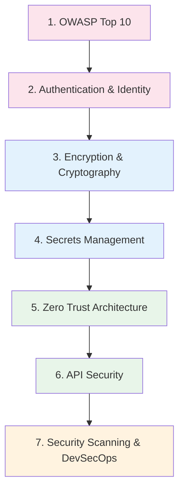

# Security Engineer Learning Path

A structured journey through the Knowledge Vault for security engineers, AppSec specialists, and any developer serious about building secure systems. This path covers the OWASP Top 10, authentication mechanisms, encryption fundamentals, secrets management, zero trust architecture, API security, and security scanning in CI/CD.

**Total estimated time**: ~22 hours across 7 sections

## Learning Progression

---

## Section 1: OWASP Top 10

*Estimated reading time: 4 hours*

The OWASP Top 10 is the baseline for web application security. Every security engineer must know these vulnerabilities, how they are exploited, and how to prevent them.

- [ ] **Required** — [OWASP Overview](/security/owasp/) *(15 min)*
- [ ] **Required** — [A01: Broken Access Control](/security/owasp/a01-broken-access-control) *(25 min)*
- [ ] **Required** — [A02: Cryptographic Failures](/security/owasp/a02-cryptographic-failures) *(25 min)*
- [ ] **Required** — [A03: Injection](/security/owasp/a03-injection) *(25 min)*
- [ ] **Required** — [A04: Insecure Design](/security/owasp/a04-insecure-design) *(25 min)*
- [ ] **Required** — [A05: Security Misconfiguration](/security/owasp/a05-security-misconfiguration) *(25 min)*
- [ ] **Required** — [A06: Vulnerable Components](/security/owasp/a06-vulnerable-components) *(20 min)*
- [ ] **Required** — [A07: Authentication Failures](/security/owasp/a07-auth-failures) *(25 min)*
- [ ] **Required** — [A08: Data Integrity Failures](/security/owasp/a08-data-integrity-failures) *(20 min)*
- [ ] **Required** — [A09: Logging & Monitoring Failures](/security/owasp/a09-logging-monitoring-failures) *(20 min)*
- [ ] **Required** — [A10: SSRF](/security/owasp/a10-ssrf) *(20 min)*
- [ ] **Optional** — [2017 to 2021 Mapping](/security/owasp/2017-to-2021-mapping) *(15 min)*

::: tip Checkpoint
After this section you should be able to: identify all 10 OWASP vulnerability categories, explain real-world exploitation scenarios for each, and implement preventive controls in your codebase.
:::

---

## Section 2: Authentication & Identity

*Estimated reading time: 3.5 hours*

Authentication is the front door of your application. A single flaw here can compromise everything.

- [ ] **Required** — [Authentication Overview](/security/authentication/) *(15 min)*
- [ ] **Required** — [OAuth2 & OIDC](/security/authentication/oauth2-oidc) *(30 min)*
- [ ] **Required** — [JWT Deep Dive](/security/authentication/jwt-deep-dive) *(30 min)*
- [ ] **Required** — [Session Management](/security/authentication/session-management) *(25 min)*
- [ ] **Required** — [MFA Implementation](/security/authentication/mfa-implementation) *(25 min)*
- [ ] **Required** — [API Key Design](/security/authentication/api-key-design) *(20 min)*
- [ ] **Optional** — [Passwordless Authentication](/security/authentication/passwordless) *(20 min)*
- [ ] **Optional** — [Biometric Authentication](/security/authentication/biometric-auth) *(15 min)*

**Production reference:**

- [ ] **Optional** — [Auth Service Blueprint](/production-blueprints/auth-service/) *(15 min)*
- [ ] **Optional** — [Auth Service Architecture](/production-blueprints/auth-service/architecture) *(25 min)*
- [ ] **Optional** — [Auth Service Database Schema](/production-blueprints/auth-service/database-schema) *(20 min)*

::: tip Checkpoint
After this section you should be able to: implement OAuth2 authorization code flow with PKCE, validate JWTs correctly (including audience, issuer, and expiration checks), design secure session management, and add MFA to an existing application.
:::

---

## Section 3: Encryption & Cryptography

*Estimated reading time: 3 hours*

Encryption protects data at rest and in transit. Understand the primitives so you can use them correctly.

- [ ] **Required** — [Encryption Overview](/security/encryption/) *(15 min)*
- [ ] **Required** — [Symmetric vs Asymmetric](/security/encryption/symmetric-vs-asymmetric) *(25 min)*
- [ ] **Required** — [Encryption at Rest](/security/encryption/encryption-at-rest) *(25 min)*
- [ ] **Required** — [Encryption in Transit](/security/encryption/encryption-in-transit) *(25 min)*
- [ ] **Required** — [Hashing Algorithms](/security/encryption/hashing-algorithms) *(25 min)*
- [ ] **Required** — [Key Management](/security/encryption/key-management) *(25 min)*
- [ ] **Optional** — [Envelope Encryption](/security/encryption/envelope-encryption) *(20 min)*

**Related networking topics:**

- [ ] **Optional** — [TLS Handshake](/system-design/networking/tls-handshake) *(20 min)*

::: tip Checkpoint
After this section you should be able to: choose between AES-256-GCM and ChaCha20-Poly1305, implement envelope encryption with a KMS, hash passwords with bcrypt/argon2, and explain the TLS 1.3 handshake.
:::

---

## Section 4: Secrets Management

*Estimated reading time: 2.5 hours*

Hardcoded secrets are one of the most common security failures. Learn to manage secrets properly across development, CI/CD, and production.

- [ ] **Required** — [Secrets Management Overview](/security/secrets-management/) *(15 min)*
- [ ] **Required** — [HashiCorp Vault Deep Dive](/security/secrets-management/vault-deep-dive) *(30 min)*
- [ ] **Required** — [AWS Secrets Manager](/security/secrets-management/aws-secrets-manager) *(25 min)*
- [ ] **Required** — [Secrets in CI/CD](/security/secrets-management/secrets-in-ci-cd) *(25 min)*
- [ ] **Required** — [Rotation Automation](/security/secrets-management/rotation-automation) *(25 min)*

**Related Kubernetes security:**

- [ ] **Optional** — [K8s Secrets Management](/infrastructure/kubernetes/secrets-management) *(25 min)*

::: tip Checkpoint
After this section you should be able to: set up HashiCorp Vault for dynamic secrets, configure AWS Secrets Manager with automatic rotation, inject secrets into CI/CD pipelines without exposing them in logs, and design a secret rotation strategy that does not cause downtime.
:::

---

## Section 5: Zero Trust Architecture

*Estimated reading time: 2.5 hours*

The perimeter is dead. Zero trust assumes every request is potentially hostile, even from inside the network.

- [ ] **Required** — [Zero Trust Overview](/security/zero-trust/) *(10 min)*
- [ ] **Required** — [Zero Trust Principles](/security/zero-trust/principles) *(25 min)*
- [ ] **Required** — [Identity Verification](/security/zero-trust/identity-verification) *(25 min)*
- [ ] **Required** — [Least Privilege](/security/zero-trust/least-privilege) *(25 min)*
- [ ] **Required** — [Network Segmentation](/security/zero-trust/network-segmentation) *(25 min)*
- [ ] **Required** — [Continuous Verification](/security/zero-trust/continuous-verification) *(25 min)*

**Related infrastructure security:**

- [ ] **Optional** — [K8s RBAC](/infrastructure/kubernetes/rbac) *(25 min)*
- [ ] **Optional** — [K8s Network Policies](/infrastructure/kubernetes/network-policies) *(20 min)*
- [ ] **Optional** — [AWS IAM Deep Dive](/infrastructure/aws/iam-deep-dive) *(25 min)*
- [ ] **Optional** — [GCP IAM](/infrastructure/gcp/iam) *(20 min)*

::: tip Checkpoint
After this section you should be able to: articulate the core zero trust principles (never trust, always verify), implement identity-based access instead of network-based access, design least-privilege policies, and implement micro-segmentation in Kubernetes.
:::

---

## Section 6: API Security

*Estimated reading time: 2.5 hours*

APIs are the primary attack surface of modern applications. Every endpoint is a potential vulnerability.

- [ ] **Required** — [API Security Overview](/security/api-security/) *(15 min)*
- [ ] **Required** — [Input Validation](/security/api-security/input-validation) *(25 min)*
- [ ] **Required** — [CORS Deep Dive](/security/api-security/cors-deep-dive) *(25 min)*
- [ ] **Required** — [CSP Headers](/security/api-security/csp-headers) *(25 min)*
- [ ] **Required** — [Rate Limiting](/security/api-security/rate-limiting) *(20 min)*
- [ ] **Required** — [API Abuse Prevention](/security/api-security/api-abuse-prevention) *(25 min)*
- [ ] **Optional** — [Request Signing](/security/api-security/request-signing) *(20 min)*

**Production rate limiting reference:**

- [ ] **Optional** — [Rate Limiter Blueprint](/production-blueprints/rate-limiter/) *(15 min)*
- [ ] **Optional** — [Rate Limiter Algorithms](/production-blueprints/rate-limiter/algorithms) *(25 min)*
- [ ] **Optional** — [Distributed Rate Limiting](/production-blueprints/rate-limiter/distributed-rate-limiting) *(20 min)*

::: tip Checkpoint
After this section you should be able to: validate and sanitize all API inputs, configure CORS policies correctly, set up Content Security Policy headers, implement rate limiting at multiple levels, and design abuse prevention for public APIs.
:::

---

## Section 7: Security Scanning & DevSecOps

*Estimated reading time: 3 hours*

Shift security left by integrating it into your development and CI/CD workflows.

### CI/CD Security

- [ ] **Required** — [Security Scanning in CI/CD](/infrastructure/ci-cd/security-scanning) *(25 min)*
- [ ] **Required** — [Pipeline Patterns](/infrastructure/ci-cd/pipeline-patterns) *(20 min)*

### Container Security

- [ ] **Required** — [Docker Security Hardening](/infrastructure/docker/security-hardening) *(25 min)*
- [ ] **Required** — [Image Optimization](/infrastructure/docker/image-optimization) *(20 min)*

### Infrastructure Security

- [ ] **Required** — [Terraform Security Hardening](/infrastructure/terraform/security-hardening) *(25 min)*

### Monitoring & Detection

- [ ] **Required** — [Structured Logging](/devops/logging/structured-logging) *(20 min)*
- [ ] **Required** — [Sensitive Data Redaction](/devops/logging/sensitive-data-redaction) *(20 min)*
- [ ] **Required** — [Alert Design](/devops/alerting/alert-design) *(20 min)*

### Related OWASP Topics

- [ ] **Optional** — [A06: Vulnerable Components](/security/owasp/a06-vulnerable-components) *(15 min)* — revisit with DevSecOps lens
- [ ] **Optional** — [A09: Logging & Monitoring Failures](/security/owasp/a09-logging-monitoring-failures) *(15 min)* — revisit with DevSecOps lens

::: tip Checkpoint
After this section you should be able to: integrate SAST, DAST, and SCA into CI/CD pipelines, scan Docker images for vulnerabilities, audit Terraform configurations for security misconfigurations, and set up security monitoring and alerting.
:::

---

## Security Maturity Model

Use this model to assess where your organization stands and what to work on next:

| Level | Name | Description |
|-------|------|-------------|
| 1 | **Reactive** | Fix vulnerabilities when found. No proactive scanning. |
| 2 | **Foundational** | OWASP awareness, basic auth patterns, secrets not in code. |
| 3 | **Managed** | CI/CD security scanning, structured logging, incident response plan. |
| 4 | **Proactive** | Zero trust principles, automated secret rotation, chaos engineering. |
| 5 | **Optimized** | Threat modeling in design, security champions program, continuous compliance. |

---

## What to Read Next

After completing this path, consider:

- **[Backend Engineer Path](/learning-paths/backend-engineer)** — Understand the systems you are securing
- **[DevOps Engineer Path](/learning-paths/devops-engineer)** — Deep dive into infrastructure security
- **[System Design Interview Path](/learning-paths/system-design-interview)** — Learn to design systems that are secure by design
- **[Production Blueprints](/production-blueprints/)** — See security applied in complete system designs

---

::: info Total Progress
This path contains approximately 45 pages. At a pace of 5 pages per day, you can complete it in about 9 days. Sections 1-3 cover the critical fundamentals -- start there.
:::
