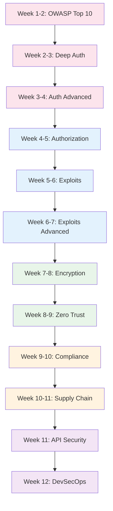

# Security Engineer Learning Path

A structured 12-week journey through the Knowledge Vault for security engineers, AppSec specialists, and any developer serious about building secure systems. This path covers the OWASP Top 10, deep authentication (12 pages), real-world exploits (12 pages), authorization models, zero trust architecture, compliance frameworks, supply chain security, API security, encryption, secrets management, and DevSecOps.

## Who This Is For

- Developers transitioning into AppSec or security engineering
- Junior security engineers building towards mid-level
- Backend engineers who want to build secure systems by default
- Anyone preparing for security-focused roles or certifications

## Prerequisites

- Backend development experience (familiar with APIs, databases, deployments)
- Basic understanding of HTTP, TLS, and web architecture
- Some familiarity with Linux command line
- No prior security specialization required

**Total estimated time**: ~55 hours across 12 weeks

## Learning Progression

---

## Week 1-2: OWASP Top 10

*Estimated reading time: 4.5 hours*

The OWASP Top 10 is the baseline for web application security. Every security engineer must know these vulnerabilities.

- [ ] **Required** -- [OWASP Overview](/security/owasp/) *(15 min)*
- [ ] **Required** -- [A01: Broken Access Control](/security/owasp/a01-broken-access-control) *(25 min)*
- [ ] **Required** -- [A02: Cryptographic Failures](/security/owasp/a02-cryptographic-failures) *(25 min)*
- [ ] **Required** -- [A03: Injection](/security/owasp/a03-injection) *(25 min)*
- [ ] **Required** -- [A04: Insecure Design](/security/owasp/a04-insecure-design) *(25 min)*
- [ ] **Required** -- [A05: Security Misconfiguration](/security/owasp/a05-security-misconfiguration) *(25 min)*
- [ ] **Required** -- [A06: Vulnerable Components](/security/owasp/a06-vulnerable-components) *(20 min)*
- [ ] **Required** -- [A07: Authentication Failures](/security/owasp/a07-auth-failures) *(25 min)*
- [ ] **Required** -- [A08: Data Integrity Failures](/security/owasp/a08-data-integrity-failures) *(20 min)*
- [ ] **Required** -- [A09: Logging & Monitoring Failures](/security/owasp/a09-logging-monitoring-failures) *(20 min)*
- [ ] **Required** -- [A10: SSRF](/security/owasp/a10-ssrf) *(20 min)*
- [ ] **Optional** -- [2017 to 2021 Mapping](/security/owasp/2017-to-2021-mapping) *(15 min)*
- [ ] **Optional** -- [Secure Coding](/cybersecurity/secure-coding) *(25 min)*

::: tip Checkpoint
After this section you should be able to: identify all 10 OWASP vulnerability categories, explain real-world exploitation scenarios, and implement preventive controls.
:::

---

## Week 2-3: Deep Authentication (Part 1)

*Estimated reading time: 5 hours*

Authentication is the front door of your application. This section covers the first half of the 12 deep auth pages.

- [ ] **Required** -- [Authentication Overview](/security/authentication/) *(15 min)*
- [ ] **Required** -- [Auth Architecture](/security/authentication/auth-architecture) *(30 min)*
- [ ] **Required** -- [OAuth2 & OIDC](/security/authentication/oauth2-oidc) *(30 min)*
- [ ] **Required** -- [OAuth2 Flows](/security/authentication/oauth2-flows) *(25 min)*
- [ ] **Required** -- [JWT Deep Dive](/security/authentication/jwt-deep-dive) *(30 min)*
- [ ] **Required** -- [Session Deep Dive](/security/authentication/session-deep-dive) *(25 min)*
- [ ] **Required** -- [Session Management](/security/authentication/session-management) *(25 min)*
- [ ] **Required** -- [Token Strategies](/security/authentication/token-strategies) *(25 min)*

::: tip Checkpoint
After this section you should be able to: implement OAuth2 authorization code flow with PKCE, validate JWTs correctly, design secure session management, and choose between session and token strategies.
:::

---

## Week 3-4: Deep Authentication (Part 2)

*Estimated reading time: 4.5 hours*

Advanced auth patterns: MFA, passkeys, biometrics, enterprise SSO, device trust, and attack defense.

- [ ] **Required** -- [MFA Deep Dive](/security/authentication/mfa-deep-dive) *(25 min)*
- [ ] **Required** -- [MFA Implementation](/security/authentication/mfa-implementation) *(25 min)*
- [ ] **Required** -- [Passkeys & WebAuthn](/security/authentication/passkeys-webauthn) *(25 min)*
- [ ] **Required** -- [Passwordless Authentication](/security/authentication/passwordless) *(20 min)*
- [ ] **Required** -- [Auth Attack & Defense](/security/authentication/auth-attack-defense) *(30 min)*
- [ ] **Required** -- [API Key Design](/security/authentication/api-key-design) *(20 min)*
- [ ] **Optional** -- [Biometric Authentication](/security/authentication/biometric-auth) *(20 min)*
- [ ] **Optional** -- [Enterprise SSO](/security/authentication/enterprise-sso) *(25 min)*
- [ ] **Optional** -- [Device Trust](/security/authentication/device-trust) *(20 min)*
- [ ] **Optional** -- [Account Sharing Prevention](/security/authentication/account-sharing-prevention) *(20 min)*
- [ ] **Optional** -- [Auth Providers](/security/authentication/auth-providers) *(20 min)*

**Production reference:**

- [ ] **Optional** -- [Auth Service Blueprint](/production-blueprints/auth-service/) *(15 min)*
- [ ] **Optional** -- [Auth Service Architecture](/production-blueprints/auth-service/architecture) *(25 min)*
- [ ] **Optional** -- [Auth Service Database Schema](/production-blueprints/auth-service/database-schema) *(20 min)*

::: tip Checkpoint
After this section you should be able to: implement MFA with TOTP/WebAuthn, design passwordless auth flows, defend against credential stuffing and brute force, and plan an enterprise SSO rollout.
:::

---

## Week 4-5: Authorization

*Estimated reading time: 3 hours*

Authorization decides what authenticated users can do. Master RBAC, ABAC, ReBAC, and policy engines.

- [ ] **Required** -- [Authorization Overview](/security/authorization/) *(15 min)*
- [ ] **Required** -- [RBAC, ABAC, ReBAC](/security/authorization/rbac-abac-rebac) *(30 min)*
- [ ] **Required** -- [Zanzibar](/security/authorization/zanzibar) *(30 min)*
- [ ] **Required** -- [Policy Engines](/security/authorization/policy-engines) *(25 min)*

::: tip Checkpoint
After this section you should be able to: choose between RBAC, ABAC, and ReBAC for different access control needs, understand Google Zanzibar-style authorization, and evaluate policy engines (OPA, Cedar, Casbin).
:::

---

## Week 5-6: Real-World Exploits (Part 1)

*Estimated reading time: 4 hours*

Study real exploits to understand how vulnerabilities manifest and how to prevent them.

- [ ] **Required** -- [Exploits Overview](/security/exploits/) *(15 min)*
- [ ] **Required** -- [XSS Advanced](/security/exploits/xss-advanced) *(25 min)*
- [ ] **Required** -- [Injection Advanced](/security/exploits/injection-advanced) *(25 min)*
- [ ] **Required** -- [Heartbleed](/security/exploits/heartbleed) *(25 min)*
- [ ] **Required** -- [Log4Shell](/security/exploits/log4shell) *(25 min)*
- [ ] **Required** -- [Dirty Pipe](/security/exploits/dirty-pipe) *(25 min)*
- [ ] **Required** -- [SolarWinds](/security/exploits/solarwinds) *(25 min)*

::: tip Checkpoint
After this section you should be able to: explain the technical details of each exploit, identify similar patterns in your own codebase, and implement defenses against each attack class.
:::

---

## Week 6-7: Real-World Exploits (Part 2)

*Estimated reading time: 4 hours*

More exploits covering crypto attacks, container escapes, cloud misconfigurations, and supply chain compromises.

- [ ] **Required** -- [Crypto Attacks](/security/exploits/crypto-attacks) *(25 min)*
- [ ] **Required** -- [Container Escapes](/security/exploits/container-escapes) *(25 min)*
- [ ] **Required** -- [Cloud Misconfigurations](/security/exploits/cloud-misconfigs) *(25 min)*
- [ ] **Required** -- [Spectre & Meltdown](/security/exploits/spectre-meltdown) *(25 min)*
- [ ] **Required** -- [XZ Backdoor 2024](/security/exploits/xz-backdoor-2024) *(25 min)*

::: tip Checkpoint
After this section you should be able to: detect cryptographic implementation flaws, prevent container escapes, audit cloud configurations for security holes, and understand hardware-level vulnerabilities.
:::

---

## Week 7-8: Encryption & Cryptography

*Estimated reading time: 3.5 hours*

Encryption protects data at rest and in transit. Understand the primitives so you can use them correctly.

- [ ] **Required** -- [Encryption Overview](/security/encryption/) *(15 min)*
- [ ] **Required** -- [Symmetric vs Asymmetric](/security/encryption/symmetric-vs-asymmetric) *(25 min)*
- [ ] **Required** -- [Cryptography for Engineers](/security/encryption/cryptography-for-engineers) *(30 min)*
- [ ] **Required** -- [Encryption at Rest](/security/encryption/encryption-at-rest) *(25 min)*
- [ ] **Required** -- [Encryption in Transit](/security/encryption/encryption-in-transit) *(25 min)*
- [ ] **Required** -- [Hashing Algorithms](/security/encryption/hashing-algorithms) *(25 min)*
- [ ] **Required** -- [Key Management](/security/encryption/key-management) *(25 min)*
- [ ] **Optional** -- [Envelope Encryption](/security/encryption/envelope-encryption) *(20 min)*
- [ ] **Optional** -- [TLS Handshake](/system-design/networking/tls-handshake) *(20 min)*

**Secrets management:**

- [ ] **Required** -- [Secrets Management Overview](/security/secrets-management/) *(15 min)*
- [ ] **Required** -- [HashiCorp Vault](/security/secrets-management/vault-deep-dive) *(30 min)*
- [ ] **Required** -- [Rotation Automation](/security/secrets-management/rotation-automation) *(25 min)*
- [ ] **Optional** -- [AWS Secrets Manager](/security/secrets-management/aws-secrets-manager) *(25 min)*
- [ ] **Optional** -- [Secrets in CI/CD](/security/secrets-management/secrets-in-ci-cd) *(25 min)*

::: tip Checkpoint
After this section you should be able to: choose between AES-256-GCM and ChaCha20-Poly1305, implement envelope encryption, hash passwords with bcrypt/argon2, manage secrets with Vault, and automate secret rotation.
:::

---

## Week 8-9: Zero Trust Architecture

*Estimated reading time: 3 hours*

The perimeter is dead. Zero trust assumes every request is potentially hostile.

- [ ] **Required** -- [Zero Trust Overview](/security/zero-trust/) *(10 min)*
- [ ] **Required** -- [Zero Trust Principles](/security/zero-trust/principles) *(25 min)*
- [ ] **Required** -- [Identity Verification](/security/zero-trust/identity-verification) *(25 min)*
- [ ] **Required** -- [Least Privilege](/security/zero-trust/least-privilege) *(25 min)*
- [ ] **Required** -- [Network Segmentation](/security/zero-trust/network-segmentation) *(25 min)*
- [ ] **Required** -- [Continuous Verification](/security/zero-trust/continuous-verification) *(25 min)*
- [ ] **Optional** -- [K8s RBAC](/infrastructure/kubernetes/rbac) *(25 min)*
- [ ] **Optional** -- [K8s Network Policies](/infrastructure/kubernetes/network-policies) *(20 min)*
- [ ] **Optional** -- [AWS IAM Deep Dive](/infrastructure/aws/iam-deep-dive) *(25 min)*

::: tip Checkpoint
After this section you should be able to: articulate zero trust principles, implement identity-based access, design least-privilege policies, and implement micro-segmentation.
:::

---

## Week 9-10: Compliance & Governance

*Estimated reading time: 3.5 hours*

Security without compliance is incomplete. Understand the major regulatory frameworks and how to implement them.

- [ ] **Required** -- [Compliance Overview](/security/compliance/) *(15 min)*
- [ ] **Required** -- [GDPR Engineering](/security/compliance/gdpr-engineering) *(30 min)*
- [ ] **Required** -- [SOC 2](/security/compliance/soc2) *(25 min)*
- [ ] **Required** -- [PCI-DSS](/security/compliance/pci-dss) *(25 min)*
- [ ] **Required** -- [Audit Logging](/security/compliance/audit-logging) *(25 min)*
- [ ] **Optional** -- [Audit Log Blueprint](/production-blueprints/audit-log/) *(25 min)*

::: tip Checkpoint
After this section you should be able to: implement GDPR data handling requirements, prepare for SOC 2 audits, design PCI-compliant payment flows, and build comprehensive audit logging.
:::

---

## Week 10-11: Supply Chain Security

*Estimated reading time: 2.5 hours*

Your code is only as secure as your dependencies. Understand supply chain attacks and how to defend against them.

- [ ] **Required** -- [Supply Chain Security Overview](/security/supply-chain/) *(25 min)*
- [ ] **Required** -- [XZ Backdoor 2024](/security/exploits/xz-backdoor-2024) *(25 min -- revisit with supply chain lens)*
- [ ] **Required** -- [SolarWinds](/security/exploits/solarwinds) *(25 min -- revisit)*
- [ ] **Required** -- [A06: Vulnerable Components](/security/owasp/a06-vulnerable-components) *(20 min -- revisit)*
- [ ] **Required** -- [Security Scanning in CI/CD](/infrastructure/ci-cd/security-scanning) *(25 min)*

::: tip Checkpoint
After this section you should be able to: assess supply chain risk in your dependency tree, implement SBOM generation and dependency scanning, and design secure CI/CD pipelines that catch compromised packages.
:::

---

## Week 11: API Security

*Estimated reading time: 3 hours*

APIs are the primary attack surface. Every endpoint is a potential vulnerability.

- [ ] **Required** -- [API Security Overview](/security/api-security/) *(15 min)*
- [ ] **Required** -- [Input Validation](/security/api-security/input-validation) *(25 min)*
- [ ] **Required** -- [CORS Deep Dive](/security/api-security/cors-deep-dive) *(25 min)*
- [ ] **Required** -- [CSP Headers](/security/api-security/csp-headers) *(25 min)*
- [ ] **Required** -- [Rate Limiting](/security/api-security/rate-limiting) *(20 min)*
- [ ] **Required** -- [Advanced Rate Limiting](/security/api-security/advanced-rate-limiting) *(20 min)*
- [ ] **Required** -- [API Abuse Prevention](/security/api-security/api-abuse-prevention) *(25 min)*
- [ ] **Optional** -- [Request Signing](/security/api-security/request-signing) *(20 min)*

::: tip Checkpoint
After this section you should be able to: validate and sanitize all inputs, configure CORS and CSP correctly, implement multi-level rate limiting, and prevent API abuse.
:::

---

## Week 12: DevSecOps & Production Security

*Estimated reading time: 4 hours*

Shift security left by integrating it into your development and CI/CD workflows.

- [ ] **Required** -- [Security Scanning in CI/CD](/infrastructure/ci-cd/security-scanning) *(25 min)*
- [ ] **Required** -- [Docker Security Hardening](/infrastructure/docker/security-hardening) *(25 min)*
- [ ] **Required** -- [Terraform Security Hardening](/infrastructure/terraform/security-hardening) *(25 min)*
- [ ] **Required** -- [Structured Logging](/devops/logging/structured-logging) *(20 min)*
- [ ] **Required** -- [Sensitive Data Redaction](/devops/logging/sensitive-data-redaction) *(20 min)*
- [ ] **Required** -- [Alert Design](/devops/alerting/alert-design) *(20 min)*

**Cybersecurity integration:**

- [ ] **Optional** -- [API Security Testing](/cybersecurity/api-security-testing) *(25 min)*
- [ ] **Optional** -- [Container Security](/cybersecurity/container-security) *(25 min)*
- [ ] **Optional** -- [Cryptography Practical](/cybersecurity/cryptography-practical) *(25 min)*

::: tip Checkpoint
After this section you should be able to: integrate SAST, DAST, and SCA into pipelines, scan containers for vulnerabilities, audit IaC for misconfigurations, and set up security alerting.
:::

---

## What You Will Be Able to Do After This Path

- Identify and remediate all OWASP Top 10 vulnerabilities
- Design and implement production-grade authentication systems (OAuth2, JWT, MFA, passkeys)
- Analyze real-world exploits and defend against each attack class
- Implement authorization with RBAC/ABAC/ReBAC and policy engines
- Design zero trust architectures with continuous verification
- Achieve compliance with GDPR, SOC 2, and PCI-DSS
- Secure the software supply chain from dependency to deployment
- Build DevSecOps pipelines with automated security scanning

## Cross-References to Related Paths

- **[Cybersecurity Engineer Path](/learning-paths/cybersecurity-engineer)** -- Offensive security, pentesting, and OSCP prep
- **[Backend Engineer Path](/learning-paths/backend-engineer)** -- Understand the systems you are securing
- **[DevOps Engineer Path](/learning-paths/devops-engineer)** -- Infrastructure security and incident response
- **[Platform Engineer Path](/learning-paths/platform-engineer)** -- Secrets management and network segmentation at scale
- **[System Design Interview Path](/learning-paths/system-design-interview)** -- Design secure systems in interviews

---

::: info Total Progress
This path contains approximately 100 pages. At a pace of 5 pages per day, you can complete it in about 3 weeks. Weeks 1-4 (OWASP + auth) are the critical foundation -- start there.
:::
