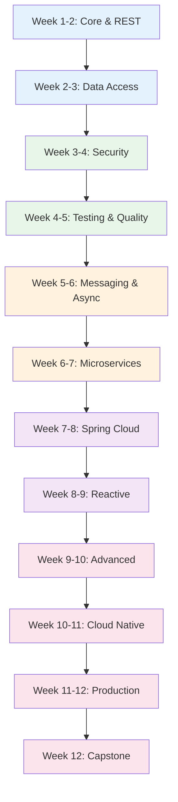

# Spring Boot Engineer Learning Path

A structured 12-week journey through all 55 Spring Boot pages in the Knowledge Vault. This is the definitive Spring Boot learning path, covering everything from core concepts through REST APIs, security, data access, messaging, microservices, reactive programming, cloud-native patterns, testing, and production deployment.

## Who This Is For

- Java developers starting with Spring Boot
- Backend engineers transitioning from other frameworks (Express, Django, Rails) to Spring
- Junior Spring Boot developers leveling up to mid/senior
- Anyone preparing for Java backend interviews at enterprise companies

## Prerequisites

- Java programming fundamentals (classes, interfaces, generics, lambdas)
- Basic SQL knowledge
- Understanding of HTTP and REST concepts
- Maven or Gradle basics

**Total estimated time**: ~50 hours across 12 weeks

## Learning Progression

---

## Week 1-2: Core Concepts & REST APIs

*Estimated reading time: 5 hours*

Start with the foundation: dependency injection, auto-configuration, and building REST APIs.

- [ ] **Required** -- [Spring Boot Overview](/spring-boot/) *(15 min)*
- [ ] **Required** -- [Core Concepts](/spring-boot/core-concepts) *(30 min)*
- [ ] **Required** -- [REST API](/spring-boot/rest-api) *(25 min)*
- [ ] **Required** -- [Exception Handling](/spring-boot/exception-handling) *(20 min)*
- [ ] **Required** -- [OpenAPI](/spring-boot/openapi) *(20 min)*
- [ ] **Required** -- [API Versioning](/spring-boot/api-versioning) *(15 min)*
- [ ] **Required** -- [File Upload](/spring-boot/file-upload) *(15 min)*
- [ ] **Required** -- [Internationalization](/spring-boot/internationalization) *(15 min)*
- [ ] **Reference** -- [Spring Boot Cheat Sheet](/cheat-sheets/spring-boot) *(10 min)*

::: tip Checkpoint
After this section you should be able to: create Spring Boot applications from scratch, build REST APIs with proper error handling, generate OpenAPI documentation, and implement API versioning.
:::

---

## Week 2-3: Data Access & JPA

*Estimated reading time: 5 hours*

Spring Data JPA is how most Spring Boot apps interact with databases. Master it deeply.

- [ ] **Required** -- [Spring Data JPA](/spring-boot/spring-data-jpa) *(30 min)*
- [ ] **Required** -- [Spring Data Advanced](/spring-boot/spring-data-advanced) *(30 min)*
- [ ] **Required** -- [Hibernate Tuning](/spring-boot/hibernate-tuning) *(25 min)*
- [ ] **Required** -- [Database Migrations](/spring-boot/database-migrations) *(20 min)*
- [ ] **Required** -- [Caching](/spring-boot/caching) *(20 min)*

**Database context:**
- [ ] **Optional** -- [PostgreSQL Internals](/system-design/databases/postgres-internals) *(35 min)*
- [ ] **Optional** -- [N+1 Problem](/performance/database-tuning/n-plus-one) *(20 min)*
- [ ] **Optional** -- [Query Optimization](/performance/database-tuning/query-optimization) *(25 min)*

::: tip Checkpoint
After this section you should be able to: write JPA repositories with custom queries, optimize Hibernate for N+1 problems, manage database migrations with Flyway/Liquibase, and implement Spring Cache abstraction.
:::

---

## Week 3-4: Security

*Estimated reading time: 5 hours*

Spring Security is one of the most complex Spring modules. This section covers it thoroughly.

- [ ] **Required** -- [Security](/spring-boot/security) *(25 min)*
- [ ] **Required** -- [Security Advanced](/spring-boot/security-advanced) *(25 min)*
- [ ] **Required** -- [Spring Security Deep Dive](/spring-boot/spring-security-deep-dive) *(30 min)*
- [ ] **Required** -- [JWT Auth](/spring-boot/jwt-auth) *(25 min)*
- [ ] **Required** -- [OAuth2 & OIDC](/spring-boot/oauth2-oidc) *(25 min)*
- [ ] **Required** -- [Rate Limiting](/spring-boot/rate-limiting) *(20 min)*

**Security context:**
- [ ] **Optional** -- [Authentication Overview](/security/authentication/) *(15 min)*
- [ ] **Optional** -- [JWT Deep Dive](/security/authentication/jwt-deep-dive) *(30 min)*
- [ ] **Optional** -- [OAuth2 & OIDC](/security/authentication/oauth2-oidc) *(30 min)*

::: tip Checkpoint
After this section you should be able to: configure Spring Security filter chains, implement JWT authentication and authorization, integrate OAuth2/OIDC providers, implement method-level security, and add rate limiting.
:::

---

## Week 4-5: Testing & Quality

*Estimated reading time: 4 hours*

Spring Boot has excellent testing support. Master it to ship with confidence.

- [ ] **Required** -- [Testing](/spring-boot/testing) *(25 min)*
- [ ] **Required** -- [Best Practices](/spring-boot/best-practices) *(25 min)*
- [ ] **Required** -- [Logging](/spring-boot/logging) *(20 min)*
- [ ] **Required** -- [AOP](/spring-boot/aop) *(20 min)*
- [ ] **Required** -- [Actuator](/spring-boot/actuator) *(20 min)*

**Testing context:**
- [ ] **Optional** -- [Test Architecture](/testing/test-architecture) *(25 min)*
- [ ] **Optional** -- [Unit Testing](/testing/unit-testing) *(25 min)*
- [ ] **Optional** -- [Integration Testing](/testing/integration-testing) *(25 min)*

::: tip Checkpoint
After this section you should be able to: write @SpringBootTest integration tests, use @WebMvcTest for controller tests, mock dependencies with @MockBean, implement custom health indicators with Actuator, and use AOP for cross-cutting concerns.
:::

---

## Week 5-6: Messaging & Async Processing

*Estimated reading time: 5 hours*

Enterprise applications need async processing, event-driven patterns, and messaging.

- [ ] **Required** -- [Kafka](/spring-boot/kafka) *(25 min)*
- [ ] **Required** -- [Event-Driven](/spring-boot/event-driven) *(20 min)*
- [ ] **Required** -- [Async](/spring-boot/async) *(20 min)*
- [ ] **Required** -- [Batch](/spring-boot/batch) *(25 min)*
- [ ] **Required** -- [Spring Batch Deep Dive](/spring-boot/spring-batch-deep-dive) *(25 min)*
- [ ] **Required** -- [Spring Integration](/spring-boot/spring-integration) *(20 min)*
- [ ] **Required** -- [Spring State Machine](/spring-boot/spring-statemachine) *(20 min)*

**Messaging context:**
- [ ] **Optional** -- [Kafka Internals](/system-design/message-queues/kafka-internals) *(35 min)*
- [ ] **Optional** -- [Background Jobs Overview](/system-design/background-jobs/) *(15 min)*
- [ ] **Optional** -- [Temporal](/system-design/background-jobs/temporal) *(30 min)*

::: tip Checkpoint
After this section you should be able to: produce and consume Kafka messages, implement application events for decoupling, run async methods with proper error handling, design batch processing jobs, and implement state machines for complex workflows.
:::

---

## Week 6-7: Microservices Patterns

*Estimated reading time: 5 hours*

Spring Boot is the dominant framework for Java microservices.

- [ ] **Required** -- [Microservices Patterns](/spring-boot/microservices-patterns) *(25 min)*
- [ ] **Required** -- [Service Discovery](/spring-boot/service-discovery) *(20 min)*
- [ ] **Required** -- [Resilience](/spring-boot/resilience) *(20 min)*
- [ ] **Required** -- [gRPC](/spring-boot/grpc) *(20 min)*
- [ ] **Required** -- [GraphQL](/spring-boot/graphql) *(20 min)*
- [ ] **Required** -- [Spring GraphQL Deep Dive](/spring-boot/spring-graphql-deep-dive) *(25 min)*
- [ ] **Required** -- [WebSocket](/spring-boot/websocket) *(20 min)*

**Architecture context:**
- [ ] **Optional** -- [Microservices Overview](/architecture-patterns/microservices/) *(15 min)*
- [ ] **Optional** -- [Communication Patterns](/architecture-patterns/microservices/communication-patterns) *(30 min)*
- [ ] **Optional** -- [API Gateway Pattern](/architecture-patterns/microservices/api-gateway-pattern) *(25 min)*

::: tip Checkpoint
After this section you should be able to: implement service discovery with Eureka/Consul, build resilient services with circuit breakers and retries, create gRPC services, implement GraphQL APIs, and add WebSocket support.
:::

---

## Week 7-8: Spring Cloud

*Estimated reading time: 4.5 hours*

Spring Cloud provides production-ready patterns for distributed systems.

- [ ] **Required** -- [Spring Cloud](/spring-boot/spring-cloud) *(25 min)*
- [ ] **Required** -- [Spring Cloud Gateway](/spring-boot/spring-cloud-gateway) *(20 min)*
- [ ] **Required** -- [Spring Cloud Config](/spring-boot/spring-cloud-config) *(20 min)*
- [ ] **Required** -- [Observability](/spring-boot/observability) *(25 min)*
- [ ] **Required** -- [Multi-Tenancy](/spring-boot/multi-tenancy) *(20 min)*

**Infrastructure context:**
- [ ] **Optional** -- [API Gateway Overview](/infrastructure/api-gateway/) *(25 min)*
- [ ] **Optional** -- [Distributed Tracing](/architecture-patterns/microservices/distributed-tracing) *(25 min)*

::: tip Checkpoint
After this section you should be able to: set up Spring Cloud Gateway for API routing, externalize configuration with Spring Cloud Config, implement distributed tracing with Micrometer, and build multi-tenant applications.
:::

---

## Week 8-9: Reactive Programming

*Estimated reading time: 4 hours*

Spring WebFlux and reactive programming for high-throughput, non-blocking applications.

- [ ] **Required** -- [Reactive](/spring-boot/reactive) *(25 min)*
- [ ] **Required** -- [Spring WebFlux Deep Dive](/spring-boot/spring-webflux-deep-dive) *(30 min)*
- [ ] **Required** -- [Virtual Threads](/spring-boot/virtual-threads) *(25 min)*

**Concurrency context:**
- [ ] **Optional** -- [Concurrency Overview](/system-design/concurrency/) *(15 min)*
- [ ] **Optional** -- [Lock-Free Data Structures](/system-design/concurrency/lock-free) *(25 min)*
- [ ] **Optional** -- [Actor Model](/system-design/concurrency/actor-model) *(20 min)*

::: tip Checkpoint
After this section you should be able to: build reactive REST APIs with WebFlux, use Mono and Flux operators effectively, understand when reactive is worth the complexity, and leverage Project Loom virtual threads for concurrent IO.
:::

---

## Week 9-10: Advanced Spring Boot

*Estimated reading time: 5 hours*

Advanced topics that distinguish senior Spring Boot engineers.

- [ ] **Required** -- [Modulith](/spring-boot/modulith) *(25 min)*
- [ ] **Required** -- [Spring Modulith Deep Dive](/spring-boot/spring-modulith-deep-dive) *(25 min)*
- [ ] **Required** -- [Spring AI](/spring-boot/spring-ai) *(25 min)*
- [ ] **Required** -- [Native Image](/spring-boot/native-image) *(25 min)*
- [ ] **Required** -- [Spring AOT](/spring-boot/spring-aot) *(25 min)*
- [ ] **Required** -- [Migration Guide](/spring-boot/migration-guide) *(20 min)*

::: tip Checkpoint
After this section you should be able to: design modular monoliths with Spring Modulith, integrate AI with Spring AI, compile to GraalVM native images for fast startup, and migrate between Spring Boot versions.
:::

---

## Week 10-11: Cloud-Native Deployment

*Estimated reading time: 5 hours*

Deploy Spring Boot applications to production with containers, Kubernetes, and cloud services.

- [ ] **Required** -- [Docker](/spring-boot/docker) *(20 min)*
- [ ] **Required** -- [Deployment](/spring-boot/deployment) *(20 min)*

**Infrastructure context:**
- [ ] **Required** -- [Docker Overview](/infrastructure/docker/) *(15 min)*
- [ ] **Required** -- [Production Dockerfiles](/infrastructure/docker/production-dockerfiles) *(25 min)*
- [ ] **Required** -- [Kubernetes Overview](/infrastructure/kubernetes/) *(15 min)*
- [ ] **Required** -- [Deployments & StatefulSets](/infrastructure/kubernetes/deployments-statefulsets) *(30 min)*
- [ ] **Required** -- [CI/CD Overview](/infrastructure/ci-cd/) *(15 min)*
- [ ] **Required** -- [GitHub Actions Deep Dive](/infrastructure/ci-cd/github-actions-deep-dive) *(30 min)*
- [ ] **Optional** -- [Blue-Green Deployment](/devops/deployment-strategies/blue-green) *(20 min)*
- [ ] **Optional** -- [Canary Deployment](/devops/deployment-strategies/canary) *(20 min)*

---

## Week 11-12: Production Operations

*Estimated reading time: 4 hours*

Monitor, debug, and operate Spring Boot in production.

- [ ] **Required** -- [Monitoring Overview](/devops/monitoring/) *(15 min)*
- [ ] **Required** -- [Metrics Design](/devops/monitoring/metrics-design) *(25 min)*
- [ ] **Required** -- [Prometheus Deep Dive](/devops/monitoring/prometheus-deep-dive) *(30 min)*
- [ ] **Required** -- [Structured Logging](/devops/logging/structured-logging) *(25 min)*
- [ ] **Required** -- [Correlation IDs](/devops/logging/correlation-ids) *(20 min)*

**Debugging:**
- [ ] **Required** -- [API Slow Response](/debugging-playbooks/api-slow) *(25 min)*
- [ ] **Required** -- [Memory Leak](/debugging-playbooks/memory-leak) *(25 min)*
- [ ] **Required** -- [Database CPU](/debugging-playbooks/database-cpu) *(25 min)*

---

## Week 12: Capstone & Architecture

*Estimated reading time: 4 hours*

Tie everything together with production blueprints and architecture patterns.

- [ ] **Required** -- [Auth Service Blueprint](/production-blueprints/auth-service/) *(45 min)*
- [ ] **Required** -- [Billing Engine Blueprint](/production-blueprints/billing-engine/) *(40 min)*
- [ ] **Required** -- [Job Queue Blueprint](/production-blueprints/job-queue/) *(40 min)*

### Suggested Capstone Project

Build a production Spring Boot microservice:

1. **API**: REST + GraphQL with OpenAPI docs and versioning
2. **Data**: JPA + PostgreSQL with Flyway migrations and Redis caching
3. **Security**: JWT auth with OAuth2/OIDC and rate limiting
4. **Messaging**: Kafka producer/consumer with dead letter handling
5. **Testing**: Unit, integration, and @WebMvcTest with >80% coverage
6. **Observability**: Micrometer metrics, structured logging, Actuator
7. **Deployment**: Docker + Kubernetes + GitHub Actions CI/CD
8. **Resilience**: Circuit breakers, retries, bulkheads

---

## All 55 Spring Boot Pages Reference

For quick access, here is every Spring Boot page in the Knowledge Vault:

| # | Page | Category |
|---|------|----------|
| 1 | [Overview](/spring-boot/) | Core |
| 2 | [Core Concepts](/spring-boot/core-concepts) | Core |
| 3 | [REST API](/spring-boot/rest-api) | API |
| 4 | [Exception Handling](/spring-boot/exception-handling) | API |
| 5 | [OpenAPI](/spring-boot/openapi) | API |
| 6 | [API Versioning](/spring-boot/api-versioning) | API |
| 7 | [File Upload](/spring-boot/file-upload) | API |
| 8 | [GraphQL](/spring-boot/graphql) | API |
| 9 | [Spring GraphQL Deep Dive](/spring-boot/spring-graphql-deep-dive) | API |
| 10 | [gRPC](/spring-boot/grpc) | API |
| 11 | [WebSocket](/spring-boot/websocket) | API |
| 12 | [Spring Data JPA](/spring-boot/spring-data-jpa) | Data |
| 13 | [Spring Data Advanced](/spring-boot/spring-data-advanced) | Data |
| 14 | [Hibernate Tuning](/spring-boot/hibernate-tuning) | Data |
| 15 | [Database Migrations](/spring-boot/database-migrations) | Data |
| 16 | [Caching](/spring-boot/caching) | Data |
| 17 | [Security](/spring-boot/security) | Security |
| 18 | [Security Advanced](/spring-boot/security-advanced) | Security |
| 19 | [Spring Security Deep Dive](/spring-boot/spring-security-deep-dive) | Security |
| 20 | [JWT Auth](/spring-boot/jwt-auth) | Security |
| 21 | [OAuth2 & OIDC](/spring-boot/oauth2-oidc) | Security |
| 22 | [Rate Limiting](/spring-boot/rate-limiting) | Security |
| 23 | [Testing](/spring-boot/testing) | Quality |
| 24 | [Best Practices](/spring-boot/best-practices) | Quality |
| 25 | [Logging](/spring-boot/logging) | Quality |
| 26 | [AOP](/spring-boot/aop) | Quality |
| 27 | [Actuator](/spring-boot/actuator) | Quality |
| 28 | [Kafka](/spring-boot/kafka) | Messaging |
| 29 | [Event-Driven](/spring-boot/event-driven) | Messaging |
| 30 | [Async](/spring-boot/async) | Messaging |
| 31 | [Batch](/spring-boot/batch) | Messaging |
| 32 | [Spring Batch Deep Dive](/spring-boot/spring-batch-deep-dive) | Messaging |
| 33 | [Spring Integration](/spring-boot/spring-integration) | Messaging |
| 34 | [Spring State Machine](/spring-boot/spring-statemachine) | Messaging |
| 35 | [Microservices Patterns](/spring-boot/microservices-patterns) | Architecture |
| 36 | [Service Discovery](/spring-boot/service-discovery) | Architecture |
| 37 | [Resilience](/spring-boot/resilience) | Architecture |
| 38 | [Spring Cloud](/spring-boot/spring-cloud) | Cloud |
| 39 | [Spring Cloud Gateway](/spring-boot/spring-cloud-gateway) | Cloud |
| 40 | [Spring Cloud Config](/spring-boot/spring-cloud-config) | Cloud |
| 41 | [Observability](/spring-boot/observability) | Cloud |
| 42 | [Multi-Tenancy](/spring-boot/multi-tenancy) | Cloud |
| 43 | [Reactive](/spring-boot/reactive) | Reactive |
| 44 | [Spring WebFlux Deep Dive](/spring-boot/spring-webflux-deep-dive) | Reactive |
| 45 | [Virtual Threads](/spring-boot/virtual-threads) | Reactive |
| 46 | [Modulith](/spring-boot/modulith) | Advanced |
| 47 | [Spring Modulith Deep Dive](/spring-boot/spring-modulith-deep-dive) | Advanced |
| 48 | [Spring AI](/spring-boot/spring-ai) | Advanced |
| 49 | [Native Image](/spring-boot/native-image) | Advanced |
| 50 | [Spring AOT](/spring-boot/spring-aot) | Advanced |
| 51 | [Migration Guide](/spring-boot/migration-guide) | Advanced |
| 52 | [Internationalization](/spring-boot/internationalization) | Core |
| 53 | [Docker](/spring-boot/docker) | Deploy |
| 54 | [Deployment](/spring-boot/deployment) | Deploy |

---

## What You Will Be Able to Do After This Path

- Build production-ready Spring Boot REST, GraphQL, and gRPC APIs
- Implement Spring Security with JWT, OAuth2/OIDC, and method-level security
- Master Spring Data JPA with Hibernate tuning and database migrations
- Design event-driven systems with Kafka and Spring Integration
- Build microservices with Spring Cloud (gateway, config, discovery, resilience)
- Implement reactive APIs with WebFlux and leverage virtual threads
- Design modular monoliths with Spring Modulith
- Deploy to Docker/Kubernetes with full observability

## Cross-References to Related Paths

- **[Backend Engineer Path](/learning-paths/backend-engineer)** -- Broader backend skills (databases, caching, queues, DDD)
- **[Full-Stack Engineer Path](/learning-paths/fullstack-engineer)** -- Spring Boot + frontend
- **[System Design Interview Path](/learning-paths/system-design-interview)** -- Apply Spring Boot knowledge to interviews
- **[DevOps Engineer Path](/learning-paths/devops-engineer)** -- Deploy and operate Spring Boot in production
- **[Security Engineer Path](/learning-paths/security-engineer)** -- Deep security beyond Spring Security

---

::: info Total Progress
This path covers all 55 Spring Boot pages plus essential infrastructure and architecture context. Budget 12 weeks at 4-5 hours per week. Weeks 1-5 cover the core essentials -- prioritize those if time is limited.
:::
