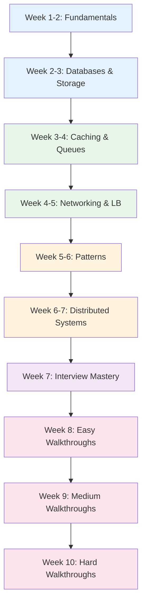

# System Design Interview Learning Path

A structured 10-week preparation path for system design interviews. This is the most comprehensive path in the Knowledge Vault, covering 12 fundamentals pages, 12 patterns pages, 10 interview mastery pages, estimation practice, the zero-to-million-users progression, 48 interview walkthroughs, and easy/medium/hard practice question sets.

## Who This Is For

- Engineers preparing for system design interviews at FAANG and top-tier companies
- Mid-level engineers aiming for senior roles that require design rounds
- Anyone who wants a structured approach to learning system design (not just memorizing solutions)

## Prerequisites

- 1+ years of backend engineering experience
- Basic understanding of databases, APIs, and web architecture
- Familiarity with at least one programming language
- No prior system design interview experience required

**Total estimated time**: ~60 hours across 10 weeks

## Learning Progression

---

## Week 1-2: System Design Fundamentals

*Estimated reading time: 6 hours*

Build the mental model that every system design answer starts from. These 12 pages cover the building blocks you will reference in every interview.

- [ ] **Required** -- [How the Internet Works](/system-design/fundamentals/how-the-internet-works) *(25 min)*
- [ ] **Required** -- [Client-Server Architecture](/system-design/fundamentals/client-server) *(20 min)*
- [ ] **Required** -- [System Design Glossary](/system-design/fundamentals/system-design-glossary) *(20 min)*
- [ ] **Required** -- [System Characteristics](/system-design/fundamentals/characteristics) *(25 min)*
- [ ] **Required** -- [Building Blocks](/system-design/fundamentals/building-blocks) *(30 min)*
- [ ] **Required** -- [Scaling Fundamentals](/system-design/fundamentals/scaling-fundamentals) *(30 min)*
- [ ] **Required** -- [Redundancy & Replication](/system-design/fundamentals/redundancy-replication) *(25 min)*
- [ ] **Required** -- [SQL vs NoSQL](/system-design/fundamentals/sql-vs-nosql) *(25 min)*
- [ ] **Required** -- [Proxies](/system-design/fundamentals/proxies) *(20 min)*
- [ ] **Required** -- [How to Read Architecture Diagrams](/system-design/fundamentals/how-to-read-architecture) *(20 min)*
- [ ] **Required** -- [Estimation Practice](/system-design/fundamentals/estimation-practice) *(30 min)*
- [ ] **Required** -- [Zero to Million Users](/system-design/fundamentals/zero-to-million-users) *(35 min)*

::: tip Interview Tip
The "zero to million users" page is your secret weapon. It shows how a system evolves from a single server to a distributed architecture. Interviewers love candidates who start simple and scale incrementally.
:::

---

## Week 2-3: Databases & Storage

*Estimated reading time: 5 hours*

Every system design involves data storage. Know when to use what, how databases scale, and the key internal mechanisms.

- [ ] **Required** -- [Database Selection Guide](/system-design/databases/database-selection-guide) *(20 min)*
- [ ] **Required** -- [Storage Engines](/system-design/databases/storage-engines) *(30 min)*
- [ ] **Required** -- [Indexing Deep Dive](/system-design/databases/indexing-deep-dive) *(25 min)*
- [ ] **Required** -- [Replication](/system-design/databases/replication) *(30 min)*
- [ ] **Required** -- [Sharding](/system-design/databases/sharding) *(30 min)*
- [ ] **Required** -- [PostgreSQL Internals](/system-design/databases/postgres-internals) *(30 min)*
- [ ] **Required** -- [Multi-Region Database](/system-design/databases/multi-region-database) *(25 min)*
- [ ] **Optional** -- [Redis Internals](/system-design/databases/redis-internals) *(25 min)*
- [ ] **Optional** -- [Elasticsearch Internals](/system-design/databases/elasticsearch-internals) *(25 min)*
- [ ] **Optional** -- [Cassandra Internals](/system-design/databases/cassandra-internals) *(25 min)*
- [ ] **Optional** -- [DynamoDB Internals](/system-design/databases/dynamodb-internals) *(20 min)*
- [ ] **Optional** -- [ClickHouse Internals](/system-design/databases/clickhouse-internals) *(20 min)*
- [ ] **Optional** -- [Time-Series Databases](/system-design/databases/time-series-databases) *(15 min)*

::: tip Interview Tip
When discussing databases, always mention: read/write ratio, data model (relational vs document vs key-value), consistency requirements, and expected data volume. These drive the choice.
:::

---

## Week 3-4: Caching & Message Queues

*Estimated reading time: 4.5 hours*

### Caching

- [ ] **Required** -- [Caching Strategies](/system-design/caching/caching-strategies) *(25 min)*
- [ ] **Required** -- [Cache Invalidation](/system-design/caching/cache-invalidation) *(25 min)*
- [ ] **Required** -- [Redis Caching Patterns](/system-design/caching/redis-caching-patterns) *(25 min)*
- [ ] **Required** -- [Multi-Layer Caching](/system-design/caching/multi-layer-caching) *(20 min)*
- [ ] **Required** -- [CDN Deep Dive](/system-design/caching/cdn-deep-dive) *(25 min)*
- [ ] **Optional** -- [Cache Sizing Math](/system-design/caching/cache-sizing-math) *(20 min)*
- [ ] **Optional** -- [Thundering Herd](/system-design/caching/thundering-herd) *(15 min)*
- [ ] **Optional** -- [Cache Warming](/system-design/caching/cache-warming) *(15 min)*

### Message Queues

- [ ] **Required** -- [Message Queues Overview](/system-design/message-queues/) *(15 min)*
- [ ] **Required** -- [Queue Selection Guide](/system-design/message-queues/queue-selection-guide) *(20 min)*
- [ ] **Required** -- [Kafka Internals](/system-design/message-queues/kafka-internals) *(30 min)*
- [ ] **Required** -- [Ordering Guarantees](/system-design/message-queues/ordering-guarantees) *(20 min)*
- [ ] **Required** -- [Exactly-Once Semantics](/system-design/message-queues/exactly-once-semantics) *(25 min)*
- [ ] **Required** -- [Dead Letter Queues](/system-design/message-queues/dead-letter-queues) *(15 min)*
- [ ] **Optional** -- [RabbitMQ Internals](/system-design/message-queues/rabbitmq-internals) *(20 min)*
- [ ] **Optional** -- [Backpressure Patterns](/system-design/message-queues/backpressure-patterns) *(20 min)*

::: tip Interview Tip
When you add a cache or queue, always address: failure modes ("what happens when the cache goes down?"), consistency guarantees, and capacity planning. These show depth.
:::

---

## Week 4-5: Networking & Load Balancing

*Estimated reading time: 4 hours*

### Networking

- [ ] **Required** -- [DNS Deep Dive](/system-design/networking/dns-deep-dive) *(25 min)*
- [ ] **Required** -- [HTTP/2 & HTTP/3](/system-design/networking/http2-http3) *(25 min)*
- [ ] **Required** -- [gRPC Internals](/system-design/networking/grpc-internals) *(20 min)*
- [ ] **Required** -- [WebSockets](/system-design/networking/websockets) *(20 min)*
- [ ] **Required** -- [WebRTC](/system-design/networking/webrtc) *(20 min)*
- [ ] **Optional** -- [TLS Handshake](/system-design/networking/tls-handshake) *(15 min)*
- [ ] **Optional** -- [TCP/IP Deep Dive](/system-design/networking/tcp-ip-deep-dive) *(25 min)*
- [ ] **Optional** -- [QUIC Protocol](/system-design/networking/quic-protocol) *(20 min)*

### Load Balancing

- [ ] **Required** -- [Load Balancing Overview](/system-design/load-balancing/) *(10 min)*
- [ ] **Required** -- [L4 vs L7](/system-design/load-balancing/l4-vs-l7) *(20 min)*
- [ ] **Required** -- [Algorithms](/system-design/load-balancing/algorithms) *(25 min)*
- [ ] **Required** -- [Health Checks](/system-design/load-balancing/health-checks) *(15 min)*
- [ ] **Optional** -- [Session Affinity](/system-design/load-balancing/session-affinity) *(15 min)*
- [ ] **Optional** -- [Global Load Balancing](/system-design/load-balancing/global-load-balancing) *(20 min)*

::: tip Interview Tip
Explain load balancing at DNS, L4, and L7 levels. This shows you understand the full network stack.
:::

---

## Week 5-6: System Design Patterns

*Estimated reading time: 6 hours*

These 12 pattern pages are the vocabulary of system design. Master them and you can construct any architecture.

- [ ] **Required** -- [Scalability Patterns](/system-design/patterns/scalability-patterns) *(25 min)*
- [ ] **Required** -- [Availability Patterns](/system-design/patterns/availability-patterns) *(25 min)*
- [ ] **Required** -- [Consistency Patterns](/system-design/patterns/consistency-patterns) *(25 min)*
- [ ] **Required** -- [Communication Patterns](/system-design/patterns/communication-patterns) *(25 min)*
- [ ] **Required** -- [Data Partitioning](/system-design/patterns/data-partitioning) *(25 min)*
- [ ] **Required** -- [ID Generation](/system-design/patterns/id-generation) *(20 min)*
- [ ] **Required** -- [Search Patterns](/system-design/patterns/search-patterns) *(25 min)*
- [ ] **Required** -- [Notification Patterns](/system-design/patterns/notification-patterns) *(20 min)*
- [ ] **Required** -- [Event vs Request](/system-design/patterns/event-vs-request) *(20 min)*
- [ ] **Required** -- [Microservices vs Monolith](/system-design/patterns/microservices-vs-monolith) *(20 min)*
- [ ] **Optional** -- [Blob Storage](/system-design/patterns/blob-storage) *(20 min)*
- [ ] **Optional** -- [Distributed Logging](/system-design/patterns/distributed-logging) *(20 min)*

**Architecture patterns:**

- [ ] **Required** -- [Microservices Overview](/architecture-patterns/microservices/) *(15 min)*
- [ ] **Required** -- [API Gateway Pattern](/architecture-patterns/microservices/api-gateway-pattern) *(20 min)*
- [ ] **Required** -- [Event-Driven Architecture](/architecture-patterns/event-driven/) *(15 min)*
- [ ] **Optional** -- [Eventual Consistency](/architecture-patterns/event-driven/eventual-consistency) *(20 min)*
- [ ] **Optional** -- [Transactional Outbox](/architecture-patterns/event-driven/transactional-outbox) *(20 min)*

::: tip Interview Tip
Do not default to microservices for every design. Start simple and explain when/why you would evolve. This shows maturity.
:::

---

## Week 6-7: Distributed Systems Deep Dive

*Estimated reading time: 5 hours*

Every system design interview involves distributed systems. You must be fluent in CAP, consistency, consensus, and failure modes.

- [ ] **Required** -- [Distributed Systems Overview](/system-design/distributed-systems/) *(15 min)*
- [ ] **Required** -- [CAP Theorem](/system-design/distributed-systems/cap-theorem) *(25 min)*
- [ ] **Required** -- [Consistency Models](/system-design/distributed-systems/consistency-models) *(30 min)*
- [ ] **Required** -- [Consistent Hashing](/system-design/distributed-systems/consistent-hashing) *(25 min)*
- [ ] **Required** -- [Distributed Transactions](/system-design/distributed-systems/distributed-transactions) *(30 min)*
- [ ] **Required** -- [Distributed Locking](/system-design/distributed-systems/distributed-locking) *(25 min)*
- [ ] **Required** -- [Circuit Breaker](/system-design/distributed-systems/circuit-breaker) *(20 min)*
- [ ] **Required** -- [Rate Limiting](/system-design/distributed-systems/rate-limiting) *(25 min)*
- [ ] **Required** -- [Bloom Filters](/system-design/distributed-systems/bloom-filters) *(20 min)*
- [ ] **Optional** -- [Gossip Protocols](/system-design/distributed-systems/gossip-protocols) *(20 min)*
- [ ] **Optional** -- [CRDT Fundamentals](/system-design/distributed-systems/crdt-fundamentals) *(25 min)*
- [ ] **Optional** -- [Vector Clocks & Lamport Timestamps](/system-design/distributed-systems/vector-clocks-lamport-timestamps) *(25 min)*
- [ ] **Optional** -- [Failure Detectors](/system-design/distributed-systems/failure-detectors) *(20 min)*

**Consensus protocols (know at least Raft):**

- [ ] **Required** -- [Consensus Overview](/system-design/consensus/) *(10 min)*
- [ ] **Required** -- [Raft Full Walkthrough](/system-design/consensus/raft-full-walkthrough) *(30 min)*
- [ ] **Optional** -- [Paxos Made Simple](/system-design/consensus/paxos-made-simple) *(25 min)*
- [ ] **Optional** -- [Leader Election](/system-design/consensus/leader-election) *(20 min)*

::: tip Interview Tip
When asked about consistency, do not just say "CAP theorem." Discuss the spectrum from linearizable to eventual consistency and explain the trade-offs for the specific system.
:::

---

## Week 7: Interview Mastery

*Estimated reading time: 5 hours*

These 10 pages teach you the meta-skill of how to ace the interview itself.

- [ ] **Required** -- [Interview Framework](/system-design/interview/framework) *(30 min)*
- [ ] **Required** -- [Estimation Cheat Sheet](/system-design/interview/estimation-cheat-sheet) *(25 min)*
- [ ] **Required** -- [Common Mistakes](/system-design/interview/common-mistakes) *(20 min)*
- [ ] **Required** -- [Discussing Tradeoffs](/system-design/interview/discussing-tradeoffs) *(25 min)*
- [ ] **Required** -- [Deep Dive Topics](/system-design/interview/deep-dive-topics) *(25 min)*
- [ ] **Required** -- [Templates](/system-design/interview/templates) *(25 min)*
- [ ] **Required** -- [Mock Walkthrough](/system-design/interview/mock-walkthrough) *(30 min)*

**Estimation practice:**

- [ ] **Required** -- [Estimation Practice](/system-design/fundamentals/estimation-practice) *(30 min -- revisit)*

**Practice questions by difficulty:**

- [ ] **Required** -- [Easy Practice Questions](/system-design/interview/practice-easy) *(25 min)*
- [ ] **Required** -- [Medium Practice Questions](/system-design/interview/practice-medium) *(25 min)*
- [ ] **Required** -- [Hard Practice Questions](/system-design/interview/practice-hard) *(25 min)*

### Back-of-the-Envelope Numbers

Memorize these for quick estimation:

| Resource | Value |
|----------|-------|
| QPS a single web server handles | 1,000-10,000 |
| QPS a single database handles | 1,000-5,000 |
| Redis operations/second | 100,000+ |
| Kafka throughput | 1M+ messages/second |
| 1 KB per record, 1M records | ~1 GB |
| 1 KB per record, 1B records | ~1 TB |
| Read latency: memory | ~100 ns |
| Read latency: SSD | ~100 us |
| Read latency: HDD | ~10 ms |
| Round trip same datacenter | ~0.5 ms |
| Round trip cross-continent | ~150 ms |

::: tip Interview Tip
Practice the mock walkthrough page end to end. It simulates the 35-minute interview format so you get comfortable with pacing.
:::

---

## Week 8: Easy Interview Walkthroughs

*Estimated reading time: 6 hours*

Start with simpler systems. Focus on applying the framework cleanly.

- [ ] **Required** -- [Design a URL Shortener](/system-design-interviews/url-shortener) *(30 min)*
- [ ] **Required** -- [Design a Rate Limiter](/system-design-interviews/rate-limiter) *(30 min)*
- [ ] **Required** -- [Design a Key-Value Store](/system-design-interviews/key-value-store) *(30 min)*
- [ ] **Required** -- [Design a Parking Lot](/system-design-interviews/parking-lot) *(25 min)*
- [ ] **Required** -- [Design a Leaderboard](/system-design-interviews/leaderboard) *(25 min)*
- [ ] **Required** -- [Design a Notification System](/system-design-interviews/notification-system) *(30 min)*
- [ ] **Required** -- [Design Search Autocomplete](/system-design-interviews/search-autocomplete) *(30 min)*
- [ ] **Required** -- [Design a Typeahead](/system-design-interviews/typeahead) *(25 min)*
- [ ] **Required** -- [Design a Distributed Cache](/system-design-interviews/distributed-cache) *(30 min)*

**Real-world reference blueprints:**

- [ ] **Optional** -- [Rate Limiter Blueprint](/production-blueprints/rate-limiter/) *(15 min)*
- [ ] **Optional** -- [Rate Limiter Algorithms](/production-blueprints/rate-limiter/algorithms) *(25 min)*
- [ ] **Optional** -- [Notification Service Architecture](/production-blueprints/notification-service/architecture) *(25 min)*

---

## Week 9: Medium Interview Walkthroughs

*Estimated reading time: 8 hours*

These require deeper trade-off analysis and more components.

- [ ] **Required** -- [Design WhatsApp / Chat System](/system-design-interviews/chat-system) *(35 min)*
- [ ] **Required** -- [Design Twitter / News Feed](/system-design-interviews/twitter-feed) *(35 min)*
- [ ] **Required** -- [Design Twitter Search](/system-design-interviews/twitter-search) *(30 min)*
- [ ] **Required** -- [Design Instagram](/system-design-interviews/instagram) *(35 min)*
- [ ] **Required** -- [Design E-Commerce](/system-design-interviews/e-commerce) *(35 min)*
- [ ] **Required** -- [Design a Payment System](/system-design-interviews/payment-system) *(35 min)*
- [ ] **Required** -- [Design an Email Service](/system-design-interviews/email-service) *(30 min)*
- [ ] **Required** -- [Design a Web Crawler](/system-design-interviews/web-crawler) *(30 min)*
- [ ] **Required** -- [Design Dropbox](/system-design-interviews/dropbox) *(30 min)*
- [ ] **Required** -- [Design a CDN](/system-design-interviews/cdn) *(30 min)*
- [ ] **Required** -- [Design an API Gateway](/system-design-interviews/api-gateway) *(30 min)*
- [ ] **Required** -- [Design Reddit](/system-design-interviews/reddit) *(30 min)*
- [ ] **Required** -- [Design a Hotel Booking System](/system-design-interviews/hotel-booking) *(30 min)*
- [ ] **Required** -- [Design a News Aggregator](/system-design-interviews/news-aggregator) *(25 min)*

**Real-world reference blueprints:**

- [ ] **Optional** -- [Auth Service Architecture](/production-blueprints/auth-service/architecture) *(25 min)*
- [ ] **Optional** -- [Billing Engine Architecture](/production-blueprints/billing-engine/architecture) *(25 min)*
- [ ] **Optional** -- [Job Queue Architecture](/production-blueprints/job-queue/architecture) *(25 min)*
- [ ] **Optional** -- [Chat Service Blueprint](/production-blueprints/chat-service/) *(25 min)*

---

## Week 10: Hard Interview Walkthroughs

*Estimated reading time: 8 hours*

These are the most complex designs. They test distributed systems depth and architectural maturity.

- [ ] **Required** -- [Design YouTube](/system-design-interviews/youtube) *(35 min)*
- [ ] **Required** -- [Design Netflix](/system-design-interviews/netflix) *(35 min)*
- [ ] **Required** -- [Design Uber](/system-design-interviews/uber) *(35 min)*
- [ ] **Required** -- [Design Spotify](/system-design-interviews/spotify) *(35 min)*
- [ ] **Required** -- [Design Google Docs](/system-design-interviews/google-docs) *(35 min)*
- [ ] **Required** -- [Design Google Maps](/system-design-interviews/google-maps) *(35 min)*
- [ ] **Required** -- [Design Slack](/system-design-interviews/slack) *(30 min)*
- [ ] **Required** -- [Design Zoom](/system-design-interviews/zoom) *(30 min)*
- [ ] **Required** -- [Design LinkedIn](/system-design-interviews/linkedin) *(30 min)*
- [ ] **Required** -- [Design Airbnb](/system-design-interviews/airbnb) *(35 min)*
- [ ] **Required** -- [Design a Stock Exchange](/system-design-interviews/stock-exchange) *(35 min)*
- [ ] **Required** -- [Design a Ticket Booking System](/system-design-interviews/ticket-booking) *(30 min)*
- [ ] **Required** -- [Design a Social Network](/system-design-interviews/social-network) *(30 min)*
- [ ] **Required** -- [Design a Recommendation Engine](/system-design-interviews/recommendation-engine) *(30 min)*
- [ ] **Required** -- [Design a Search Engine](/system-design-interviews/search-engine) *(35 min)*
- [ ] **Required** -- [Design Search Ranking](/system-design-interviews/search-ranking) *(30 min)*
- [ ] **Required** -- [Design a Fraud Detection System](/system-design-interviews/fraud-detection) *(30 min)*
- [ ] **Required** -- [Design a Live Streaming Platform](/system-design-interviews/live-streaming) *(30 min)*
- [ ] **Required** -- [Design Tinder](/system-design-interviews/tinder) *(30 min)*
- [ ] **Required** -- [Design a Food Delivery System](/system-design-interviews/food-delivery) *(30 min)*
- [ ] **Required** -- [Design an Ad Platform](/system-design-interviews/ad-platform) *(30 min)*
- [ ] **Required** -- [Design a Content Moderation System](/system-design-interviews/content-moderation) *(30 min)*
- [ ] **Required** -- [Design ChatGPT](/system-design-interviews/chatgpt) *(35 min)*
- [ ] **Required** -- [Design GitHub Copilot](/system-design-interviews/copilot) *(30 min)*
- [ ] **Required** -- [Design GitHub](/system-design-interviews/github) *(30 min)*

**Company architecture references:**

- [ ] **Optional** -- [Discord Scaling](/company-architecture/discord-scaling) *(25 min)*
- [ ] **Optional** -- [Uber Dispatch](/company-architecture/uber-dispatch) *(25 min)*
- [ ] **Optional** -- [Figma Multiplayer](/company-architecture/figma-multiplayer) *(25 min)*
- [ ] **Optional** -- [Shopify Black Friday](/company-architecture/shopify-black-friday) *(25 min)*

---

## What You Will Be Able to Do After This Path

- Apply a structured 4-step framework to any system design question
- Perform back-of-the-envelope estimations in under 3 minutes
- Choose the right database, cache, queue, and communication pattern for a given workload
- Design systems at multiple scale levels (single server to global)
- Discuss trade-offs fluently (consistency vs availability, latency vs throughput, cost vs reliability)
- Walk through 48 complete system design interview questions confidently
- Identify and avoid common interview mistakes
- Handle deep-dive questions on distributed systems, consensus, and failure modes

## Cross-References to Related Paths

- **[Backend Engineer Path](/learning-paths/backend-engineer)** -- Fill gaps in databases, DDD, CQRS, and Spring Boot
- **[DevOps Engineer Path](/learning-paths/devops-engineer)** -- Understand deployment, SRE, and infrastructure
- **[Data Engineer Path](/learning-paths/data-engineer)** -- Learn data pipeline design for analytics questions
- **[Platform Engineer Path](/learning-paths/platform-engineer)** -- Understand the infrastructure layer
- **[Security Engineer Path](/learning-paths/security-engineer)** -- Add security considerations to your designs

---

::: info Total Progress
This path contains approximately 120 pages including 48 interview walkthroughs. For interview prep, aim to complete weeks 1-7 first (the fundamentals), then work through walkthroughs by difficulty level. Practice at least 2-3 designs per week aloud with a timer.
:::
