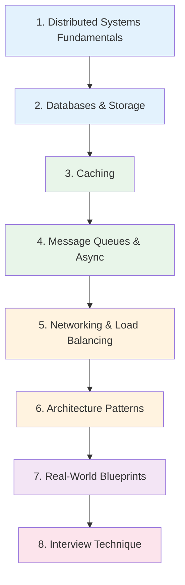

# System Design Interview Learning Path

A structured preparation path for system design interviews. This path builds your foundation in distributed systems, databases, caching, queues, and load balancing, then applies that knowledge to interview-style system design walkthroughs.

**Total estimated time**: ~25 hours across 8 sections

## Learning Progression

---

## Section 1: Distributed Systems Fundamentals

*Estimated reading time: 4 hours*

Every system design interview involves distributed systems. You must be fluent in CAP theorem, consistency models, consensus, and failure modes.

- [ ] **Required** — [Distributed Systems Overview](/system-design/distributed-systems/) *(15 min)*
- [ ] **Required** — [CAP Theorem](/system-design/distributed-systems/cap-theorem) *(25 min)*
- [ ] **Required** — [Consistency Models](/system-design/distributed-systems/consistency-models) *(30 min)*
- [ ] **Required** — [Consistent Hashing](/system-design/distributed-systems/consistent-hashing) *(25 min)*
- [ ] **Required** — [Distributed Transactions](/system-design/distributed-systems/distributed-transactions) *(30 min)*
- [ ] **Required** — [Vector Clocks & Lamport Timestamps](/system-design/distributed-systems/vector-clocks-lamport-timestamps) *(25 min)*
- [ ] **Required** — [Failure Detectors](/system-design/distributed-systems/failure-detectors) *(20 min)*
- [ ] **Optional** — [Gossip Protocols](/system-design/distributed-systems/gossip-protocols) *(20 min)*
- [ ] **Optional** — [CRDT Fundamentals](/system-design/distributed-systems/crdt-fundamentals) *(25 min)*
- [ ] **Optional** — [Byzantine Fault Tolerance](/system-design/distributed-systems/byzantine-fault-tolerance) *(20 min)*
- [ ] **Optional** — [Clock Synchronization](/system-design/distributed-systems/clock-synchronization) *(20 min)*
- [ ] **Optional** — [Distributed Snapshots](/system-design/distributed-systems/distributed-snapshots) *(20 min)*

**Consensus protocols** (know at least Raft):

- [ ] **Required** — [Consensus Overview](/system-design/consensus/) *(10 min)*
- [ ] **Required** — [Raft Full Walkthrough](/system-design/consensus/raft-full-walkthrough) *(30 min)*
- [ ] **Optional** — [Paxos Made Simple](/system-design/consensus/paxos-made-simple) *(25 min)*
- [ ] **Optional** — [ZAB Protocol](/system-design/consensus/zab-protocol) *(20 min)*

::: tip Interview Tip
When asked about consistency, do not just say "CAP theorem." Interviewers want nuance. Discuss the spectrum from strong consistency to eventual consistency, and explain the trade-offs you would make for the specific system being designed.
:::

---

## Section 2: Databases & Storage

*Estimated reading time: 3.5 hours*

Every system design involves data storage. You need to know when to use what, how databases scale, and the key internal mechanisms.

- [ ] **Required** — [Database Selection Guide](/system-design/databases/database-selection-guide) *(20 min)*
- [ ] **Required** — [Storage Engines](/system-design/databases/storage-engines) *(30 min)*
- [ ] **Required** — [Indexing Deep Dive](/system-design/databases/indexing-deep-dive) *(25 min)*
- [ ] **Required** — [Replication](/system-design/databases/replication) *(30 min)*
- [ ] **Required** — [Sharding](/system-design/databases/sharding) *(30 min)*
- [ ] **Required** — [PostgreSQL Internals](/system-design/databases/postgres-internals) *(30 min)*
- [ ] **Optional** — [Redis Internals](/system-design/databases/redis-internals) *(25 min)*
- [ ] **Optional** — [MongoDB Internals](/system-design/databases/mongodb-internals) *(20 min)*
- [ ] **Optional** — [Time-Series Databases](/system-design/databases/time-series-databases) *(15 min)*

::: tip Interview Tip
When discussing databases, always mention: read/write ratio of the workload, data model (relational vs document vs key-value), consistency requirements, and expected data volume. These drive the choice.
:::

---

## Section 3: Caching

*Estimated reading time: 2.5 hours*

Caching is the go-to answer for read-heavy workloads. Know the strategies, failure modes, and math.

- [ ] **Required** — [Caching Strategies](/system-design/caching/caching-strategies) *(25 min)*
- [ ] **Required** — [Cache Invalidation](/system-design/caching/cache-invalidation) *(25 min)*
- [ ] **Required** — [Redis Caching Patterns](/system-design/caching/redis-caching-patterns) *(25 min)*
- [ ] **Required** — [Multi-Layer Caching](/system-design/caching/multi-layer-caching) *(20 min)*
- [ ] **Required** — [CDN Deep Dive](/system-design/caching/cdn-deep-dive) *(25 min)*
- [ ] **Optional** — [Cache Sizing Math](/system-design/caching/cache-sizing-math) *(20 min)*
- [ ] **Optional** — [Thundering Herd](/system-design/caching/thundering-herd) *(15 min)*
- [ ] **Optional** — [Cache Warming](/system-design/caching/cache-warming) *(15 min)*

::: tip Interview Tip
Interviewers love asking "what happens when the cache goes down?" Be ready to discuss cache stampede prevention, graceful degradation, and whether your system can survive a full cache miss scenario.
:::

---

## Section 4: Message Queues & Async Processing

*Estimated reading time: 2.5 hours*

Asynchronous processing decouples components and handles traffic spikes. Essential for any system that cannot process everything synchronously.

- [ ] **Required** — [Message Queues Overview](/system-design/message-queues/) *(15 min)*
- [ ] **Required** — [Queue Selection Guide](/system-design/message-queues/queue-selection-guide) *(20 min)*
- [ ] **Required** — [Kafka Internals](/system-design/message-queues/kafka-internals) *(30 min)*
- [ ] **Required** — [Ordering Guarantees](/system-design/message-queues/ordering-guarantees) *(20 min)*
- [ ] **Required** — [Exactly-Once Semantics](/system-design/message-queues/exactly-once-semantics) *(25 min)*
- [ ] **Required** — [Dead Letter Queues](/system-design/message-queues/dead-letter-queues) *(15 min)*
- [ ] **Optional** — [Backpressure Patterns](/system-design/message-queues/backpressure-patterns) *(20 min)*
- [ ] **Optional** — [RabbitMQ Internals](/system-design/message-queues/rabbitmq-internals) *(20 min)*

::: tip Interview Tip
When you add a message queue to your design, always address: ordering requirements, delivery guarantees (at-least-once vs exactly-once), consumer scaling, and dead letter handling. These show depth.
:::

---

## Section 5: Networking & Load Balancing

*Estimated reading time: 3 hours*

You need to understand how traffic flows from user to server and how to distribute load effectively.

### Networking

- [ ] **Required** — [DNS Deep Dive](/system-design/networking/dns-deep-dive) *(25 min)*
- [ ] **Required** — [HTTP/2 & HTTP/3](/system-design/networking/http2-http3) *(25 min)*
- [ ] **Required** — [gRPC Internals](/system-design/networking/grpc-internals) *(20 min)*
- [ ] **Required** — [WebSockets](/system-design/networking/websockets) *(20 min)*
- [ ] **Optional** — [TLS Handshake](/system-design/networking/tls-handshake) *(15 min)*
- [ ] **Optional** — [TCP/IP Deep Dive](/system-design/networking/tcp-ip-deep-dive) *(25 min)*

### Load Balancing

- [ ] **Required** — [Load Balancing Overview](/system-design/load-balancing/) *(10 min)*
- [ ] **Required** — [L4 vs L7](/system-design/load-balancing/l4-vs-l7) *(20 min)*
- [ ] **Required** — [Algorithms](/system-design/load-balancing/algorithms) *(25 min)*
- [ ] **Required** — [Health Checks](/system-design/load-balancing/health-checks) *(15 min)*
- [ ] **Optional** — [Session Affinity](/system-design/load-balancing/session-affinity) *(15 min)*
- [ ] **Optional** — [Global Load Balancing](/system-design/load-balancing/global-load-balancing) *(20 min)*

::: tip Interview Tip
Explain load balancing at multiple layers: DNS-level (geographic routing), L4 (TCP/connection-level), and L7 (HTTP/application-level). This shows you understand the full network stack.
:::

---

## Section 6: Architecture Patterns

*Estimated reading time: 3 hours*

System design interviews often touch on microservices, event-driven architecture, and API design patterns.

### Microservices

- [ ] **Required** — [Microservices Overview](/architecture-patterns/microservices/) *(15 min)*
- [ ] **Required** — [Decomposition Strategies](/architecture-patterns/microservices/decomposition-strategies) *(20 min)*
- [ ] **Required** — [Communication Patterns](/architecture-patterns/microservices/communication-patterns) *(25 min)*
- [ ] **Required** — [API Gateway Pattern](/architecture-patterns/microservices/api-gateway-pattern) *(20 min)*
- [ ] **Optional** — [Data Management](/architecture-patterns/microservices/data-management) *(20 min)*

### Event-Driven Architecture

- [ ] **Required** — [Event-Driven Overview](/architecture-patterns/event-driven/) *(15 min)*
- [ ] **Required** — [Event Types](/architecture-patterns/event-driven/event-types) *(15 min)*
- [ ] **Required** — [Eventual Consistency](/architecture-patterns/event-driven/eventual-consistency) *(20 min)*
- [ ] **Optional** — [Event Choreography](/architecture-patterns/event-driven/event-choreography) *(20 min)*
- [ ] **Optional** — [Event Orchestration](/architecture-patterns/event-driven/event-orchestration) *(20 min)*

::: tip Interview Tip
Do not default to microservices for every design. Start with a simpler architecture and explain when/why you would evolve to microservices. This shows maturity.
:::

---

## Section 7: Real-World Blueprints

*Estimated reading time: 4 hours*

Study complete system designs. These blueprints show how all the pieces fit together in production systems.

- [ ] **Required** — [Auth Service Architecture](/production-blueprints/auth-service/architecture) *(25 min)*
- [ ] **Required** — [Rate Limiter Design](/production-blueprints/rate-limiter/) *(15 min)*
- [ ] **Required** — [Rate Limiter Algorithms](/production-blueprints/rate-limiter/algorithms) *(25 min)*
- [ ] **Required** — [Rate Limiter Redis Implementation](/production-blueprints/rate-limiter/redis-implementation) *(20 min)*
- [ ] **Required** — [Job Queue Architecture](/production-blueprints/job-queue/architecture) *(25 min)*
- [ ] **Required** — [Notification Service Architecture](/production-blueprints/notification-service/architecture) *(25 min)*
- [ ] **Required** — [Realtime Pipeline Architecture](/production-blueprints/realtime-pipeline/architecture) *(25 min)*
- [ ] **Optional** — [Billing Engine Architecture](/production-blueprints/billing-engine/architecture) *(25 min)*
- [ ] **Optional** — [Analytics Pipeline Architecture](/production-blueprints/analytics-pipeline/architecture) *(25 min)*
- [ ] **Optional** — [A/B Testing Architecture](/production-blueprints/ab-testing/architecture) *(20 min)*

::: tip Interview Tip
Use these blueprints as templates. In an interview, you will not reproduce them exactly, but the thinking process -- requirements, API design, data model, scaling considerations -- transfers directly.
:::

---

## Section 8: Interview Technique

*Estimated reading time: 2 hours*

Knowing the technical content is only half the battle. You need a structured approach to the interview itself.

### The 4-Step Framework

**Step 1: Requirements Clarification (5 minutes)**

- Ask about scale: users, requests/second, data volume
- Clarify functional requirements: what the system must do
- Clarify non-functional requirements: latency, availability, consistency
- Identify constraints: budget, team size, existing infrastructure

**Step 2: High-Level Design (10 minutes)**

- Draw the major components: clients, load balancer, services, databases, caches
- Show how data flows through the system
- Identify the API contracts between components

**Step 3: Deep Dive (15 minutes)**

- Pick 2-3 components to dive deep on
- Discuss data model and schema design
- Address scaling: sharding, replication, caching
- Handle failure modes: what happens when X goes down?

**Step 4: Wrap-Up (5 minutes)**

- Summarize trade-offs you made
- Discuss what you would do differently at 10x scale
- Mention monitoring, alerting, deployment strategy

### Back-of-the-Envelope Math

Memorize these numbers for quick estimation:

| Resource | Value |
|----------|-------|
| QPS a single web server handles | 1,000-10,000 |
| QPS a single database handles | 1,000-5,000 |
| Redis operations/second | 100,000+ |
| Kafka throughput | 1M+ messages/second |
| 1 KB per record, 1M records | ~1 GB |
| 1 KB per record, 1B records | ~1 TB |
| Read latency: memory | ~100 ns |
| Read latency: SSD | ~100 us |
| Read latency: HDD | ~10 ms |
| Round trip same datacenter | ~0.5 ms |
| Round trip cross-continent | ~150 ms |

### Common System Design Questions

Use this checklist to practice. For each, apply the 4-step framework:

- [ ] Design a URL shortener (TinyURL)
- [ ] Design a rate limiter (see [Rate Limiter Blueprint](/production-blueprints/rate-limiter/))
- [ ] Design a notification system (see [Notification Service Blueprint](/production-blueprints/notification-service/))
- [ ] Design a chat system (WebSockets + message queues)
- [ ] Design a news feed / timeline
- [ ] Design a search autocomplete
- [ ] Design a distributed cache
- [ ] Design a video streaming platform
- [ ] Design a ride-sharing service
- [ ] Design an e-commerce order system

### Red Flags to Avoid

| Do Not | Instead |
|--------|---------|
| Jump straight to the solution | Spend 5 minutes on requirements |
| Say "we can use X" without explaining why | Compare options and justify the choice |
| Ignore failure modes | Address "what if X goes down?" proactively |
| Design only for current scale | Discuss how the design evolves at 10x and 100x |
| Forget about data consistency | State your consistency model explicitly |
| Over-engineer from the start | Start simple, evolve when needed |

---

## What to Read Next

After completing this path, consider:

- **[Backend Engineer Path](/learning-paths/backend-engineer)** — Fill gaps in databases, DDD, and CQRS
- **[DevOps Engineer Path](/learning-paths/devops-engineer)** — Understand deployment and infrastructure better
- **[All Production Blueprints](/production-blueprints/)** — Study more real-world system designs
- **[System Design Interviews Section](/system-design-interviews/)** — Additional interview-specific content

---

::: info Total Progress
This path contains approximately 55 pages plus the interview technique section. At a pace of 5 pages per day, you can complete it in about 11 days. For interview prep, aim to complete it in 2-3 weeks with daily practice problems.
:::
