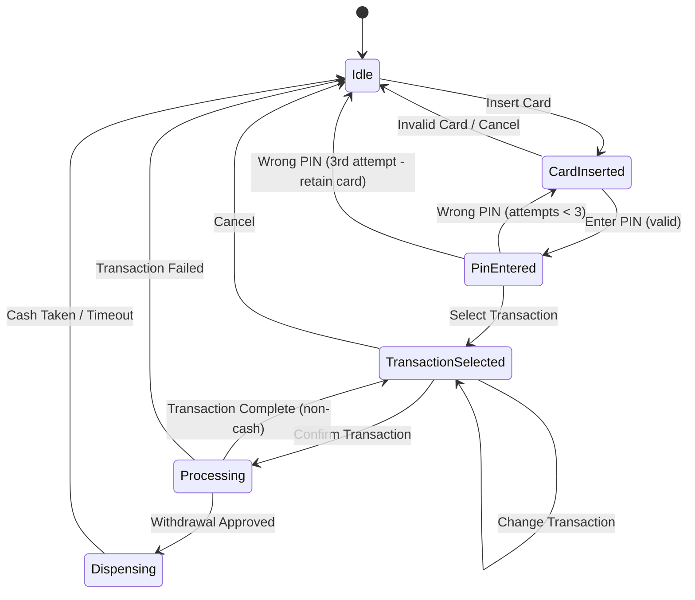
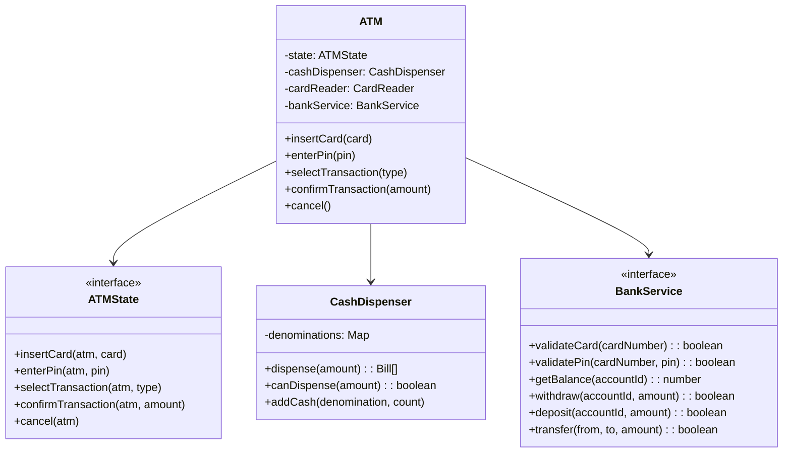

# Design ATM Machine

The ATM machine is a classic LLD interview problem that tests your ability to model a state machine cleanly. The ATM has a well-defined lifecycle: idle, card inserted, PIN validated, transaction selected, processing, dispensing, and back to idle. Each state has specific allowed transitions, and invalid transitions must be rejected gracefully.

## Requirements

### Functional Requirements

| # | Requirement | Details |
|---|-------------|---------|
| FR-1 | Card insertion | Accept and validate bank cards |
| FR-2 | PIN authentication | Validate PIN with max 3 attempts |
| FR-3 | Balance inquiry | Display current account balance |
| FR-4 | Cash withdrawal | Dispense cash if sufficient balance and ATM has funds |
| FR-5 | Cash deposit | Accept and credit cash deposits |
| FR-6 | Fund transfer | Transfer between accounts at the same bank |
| FR-7 | Receipt printing | Print transaction receipt |
| FR-8 | Card ejection | Return card on completion or timeout |

### Non-Functional Requirements

- Single ATM machine (not distributed)
- Thread-safe transaction processing
- Timeout handling (eject card after inactivity)
- Denomination-aware dispensing

## State Machine Design



The state machine is the backbone of this design. Every user interaction triggers a state transition, and the ATM only accepts inputs valid for its current state.

## Core Entities



## Implementation

### Enums and Types

**TypeScript:**

```typescript
enum TransactionType {
  BALANCE_INQUIRY = "BALANCE_INQUIRY",
  WITHDRAWAL = "WITHDRAWAL",
  DEPOSIT = "DEPOSIT",
  TRANSFER = "TRANSFER",
}

enum Denomination {
  HUNDRED = 100,
  FIVE_HUNDRED = 500,
  THOUSAND = 1000,
  TWO_THOUSAND = 2000,
}

interface Card {
  cardNumber: string;
  bankCode: string;
  expiryDate: Date;
}

interface TransactionResult {
  success: boolean;
  message: string;
  balance?: number;
  dispensedCash?: Map<Denomination, number>;
}
```

**Python:**

```python
from enum import Enum
from dataclasses import dataclass, field
from datetime import datetime
from abc import ABC, abstractmethod

class TransactionType(Enum):
    BALANCE_INQUIRY = "BALANCE_INQUIRY"
    WITHDRAWAL = "WITHDRAWAL"
    DEPOSIT = "DEPOSIT"
    TRANSFER = "TRANSFER"

class Denomination(Enum):
    HUNDRED = 100
    FIVE_HUNDRED = 500
    THOUSAND = 1000
    TWO_THOUSAND = 2000

@dataclass
class Card:
    card_number: str
    bank_code: str
    expiry_date: datetime

@dataclass
class TransactionResult:
    success: bool
    message: str
    balance: float | None = None
    dispensed_cash: dict[Denomination, int] | None = None
```

### Bank Service Interface

**TypeScript:**

```typescript
interface BankService {
  validateCard(cardNumber: string): boolean;
  validatePin(cardNumber: string, pin: string): boolean;
  getBalance(accountId: string): number;
  withdraw(accountId: string, amount: number): boolean;
  deposit(accountId: string, amount: number): boolean;
  transfer(fromAccount: string, toAccount: string, amount: number): boolean;
  getAccountId(cardNumber: string): string;
}

class MockBankService implements BankService {
  private accounts: Map<string, { pin: string; balance: number; accountId: string }>;

  constructor() {
    this.accounts = new Map([
      ["4111111111111111", { pin: "1234", balance: 50000, accountId: "ACC001" }],
      ["4222222222222222", { pin: "5678", balance: 30000, accountId: "ACC002" }],
    ]);
  }

  validateCard(cardNumber: string): boolean {
    return this.accounts.has(cardNumber);
  }

  validatePin(cardNumber: string, pin: string): boolean {
    const account = this.accounts.get(cardNumber);
    return account?.pin === pin;
  }

  getBalance(accountId: string): number {
    for (const [, acc] of this.accounts) {
      if (acc.accountId === accountId) return acc.balance;
    }
    return 0;
  }

  withdraw(accountId: string, amount: number): boolean {
    for (const [, acc] of this.accounts) {
      if (acc.accountId === accountId && acc.balance >= amount) {
        acc.balance -= amount;
        return true;
      }
    }
    return false;
  }

  deposit(accountId: string, amount: number): boolean {
    for (const [, acc] of this.accounts) {
      if (acc.accountId === accountId) {
        acc.balance += amount;
        return true;
      }
    }
    return false;
  }

  transfer(fromAccount: string, toAccount: string, amount: number): boolean {
    if (this.withdraw(fromAccount, amount)) {
      if (this.deposit(toAccount, amount)) return true;
      this.deposit(fromAccount, amount); // rollback
    }
    return false;
  }

  getAccountId(cardNumber: string): string {
    return this.accounts.get(cardNumber)?.accountId ?? "";
  }
}
```

**Python:**

```python
class BankService(ABC):
    @abstractmethod
    def validate_card(self, card_number: str) -> bool: ...

    @abstractmethod
    def validate_pin(self, card_number: str, pin: str) -> bool: ...

    @abstractmethod
    def get_balance(self, account_id: str) -> float: ...

    @abstractmethod
    def withdraw(self, account_id: str, amount: float) -> bool: ...

    @abstractmethod
    def deposit(self, account_id: str, amount: float) -> bool: ...

    @abstractmethod
    def transfer(self, from_acc: str, to_acc: str, amount: float) -> bool: ...

    @abstractmethod
    def get_account_id(self, card_number: str) -> str: ...

class MockBankService(BankService):
    def __init__(self):
        self.accounts = {
            "4111111111111111": {"pin": "1234", "balance": 50000, "account_id": "ACC001"},
            "4222222222222222": {"pin": "5678", "balance": 30000, "account_id": "ACC002"},
        }

    def validate_card(self, card_number: str) -> bool:
        return card_number in self.accounts

    def validate_pin(self, card_number: str, pin: str) -> bool:
        acc = self.accounts.get(card_number)
        return acc is not None and acc["pin"] == pin

    def get_balance(self, account_id: str) -> float:
        for acc in self.accounts.values():
            if acc["account_id"] == account_id:
                return acc["balance"]
        return 0

    def withdraw(self, account_id: str, amount: float) -> bool:
        for acc in self.accounts.values():
            if acc["account_id"] == account_id and acc["balance"] >= amount:
                acc["balance"] -= amount
                return True
        return False

    def deposit(self, account_id: str, amount: float) -> bool:
        for acc in self.accounts.values():
            if acc["account_id"] == account_id:
                acc["balance"] += amount
                return True
        return False

    def transfer(self, from_acc: str, to_acc: str, amount: float) -> bool:
        if self.withdraw(from_acc, amount):
            if self.deposit(to_acc, amount):
                return True
            self.deposit(from_acc, amount)  # rollback
        return False

    def get_account_id(self, card_number: str) -> str:
        acc = self.accounts.get(card_number)
        return acc["account_id"] if acc else ""
```

### Cash Dispenser

**TypeScript:**

```typescript
class CashDispenser {
  private cash: Map<Denomination, number> = new Map();

  constructor() {
    // Initialize with default cash
    this.cash.set(Denomination.TWO_THOUSAND, 100);
    this.cash.set(Denomination.THOUSAND, 200);
    this.cash.set(Denomination.FIVE_HUNDRED, 300);
    this.cash.set(Denomination.HUNDRED, 500);
  }

  canDispense(amount: number): boolean {
    let remaining = amount;
    const denominations = [
      Denomination.TWO_THOUSAND,
      Denomination.THOUSAND,
      Denomination.FIVE_HUNDRED,
      Denomination.HUNDRED,
    ];

    const tempCash = new Map(this.cash);

    for (const denom of denominations) {
      const available = tempCash.get(denom) ?? 0;
      const needed = Math.floor(remaining / denom);
      const used = Math.min(needed, available);
      remaining -= used * denom;
    }

    return remaining === 0;
  }

  dispense(amount: number): Map<Denomination, number> {
    const result = new Map<Denomination, number>();
    let remaining = amount;

    const denominations = [
      Denomination.TWO_THOUSAND,
      Denomination.THOUSAND,
      Denomination.FIVE_HUNDRED,
      Denomination.HUNDRED,
    ];

    for (const denom of denominations) {
      const available = this.cash.get(denom) ?? 0;
      const needed = Math.floor(remaining / denom);
      const used = Math.min(needed, available);

      if (used > 0) {
        result.set(denom, used);
        this.cash.set(denom, available - used);
        remaining -= used * denom;
      }
    }

    return result;
  }

  totalCash(): number {
    let total = 0;
    for (const [denom, count] of this.cash) {
      total += denom * count;
    }
    return total;
  }
}
```

**Python:**

```python
class CashDispenser:
    def __init__(self):
        self.cash: dict[Denomination, int] = {
            Denomination.TWO_THOUSAND: 100,
            Denomination.THOUSAND: 200,
            Denomination.FIVE_HUNDRED: 300,
            Denomination.HUNDRED: 500,
        }

    def can_dispense(self, amount: int) -> bool:
        remaining = amount
        for denom in sorted(self.cash.keys(), key=lambda d: d.value, reverse=True):
            available = self.cash[denom]
            needed = remaining // denom.value
            used = min(needed, available)
            remaining -= used * denom.value
        return remaining == 0

    def dispense(self, amount: int) -> dict[Denomination, int]:
        result: dict[Denomination, int] = {}
        remaining = amount

        for denom in sorted(self.cash.keys(), key=lambda d: d.value, reverse=True):
            available = self.cash[denom]
            needed = remaining // denom.value
            used = min(needed, available)

            if used > 0:
                result[denom] = used
                self.cash[denom] -= used
                remaining -= used * denom.value

        return result

    def total_cash(self) -> int:
        return sum(d.value * c for d, c in self.cash.items())
```

### State Pattern Implementation

**TypeScript:**

```typescript
interface ATMState {
  insertCard(atm: ATM, card: Card): void;
  enterPin(atm: ATM, pin: string): void;
  selectTransaction(atm: ATM, type: TransactionType): void;
  confirmTransaction(atm: ATM, amount: number, targetAccount?: string): TransactionResult;
  cancel(atm: ATM): void;
}

class IdleState implements ATMState {
  insertCard(atm: ATM, card: Card): void {
    if (atm.bankService.validateCard(card.cardNumber)) {
      atm.currentCard = card;
      atm.pinAttempts = 0;
      atm.setState(new CardInsertedState());
      console.log("Card accepted. Please enter your PIN.");
    } else {
      console.log("Invalid card. Please try another card.");
    }
  }

  enterPin(): void { console.log("Please insert a card first."); }
  selectTransaction(): void { console.log("Please insert a card first."); }
  confirmTransaction(): TransactionResult {
    return { success: false, message: "Please insert a card first." };
  }
  cancel(): void { console.log("No active session."); }
}

class CardInsertedState implements ATMState {
  insertCard(): void { console.log("Card already inserted."); }

  enterPin(atm: ATM, pin: string): void {
    if (atm.bankService.validatePin(atm.currentCard!.cardNumber, pin)) {
      atm.accountId = atm.bankService.getAccountId(atm.currentCard!.cardNumber);
      atm.setState(new PinEnteredState());
      console.log("PIN verified. Select a transaction.");
    } else {
      atm.pinAttempts++;
      if (atm.pinAttempts >= 3) {
        console.log("Too many failed attempts. Card retained.");
        atm.resetSession();
        atm.setState(new IdleState());
      } else {
        console.log(`Wrong PIN. ${3 - atm.pinAttempts} attempts remaining.`);
      }
    }
  }

  selectTransaction(): void { console.log("Please enter your PIN first."); }
  confirmTransaction(): TransactionResult {
    return { success: false, message: "Please enter your PIN first." };
  }
  cancel(atm: ATM): void {
    console.log("Session cancelled. Ejecting card.");
    atm.resetSession();
    atm.setState(new IdleState());
  }
}

class PinEnteredState implements ATMState {
  insertCard(): void { console.log("Card already inserted."); }
  enterPin(): void { console.log("PIN already verified."); }

  selectTransaction(atm: ATM, type: TransactionType): void {
    atm.currentTransaction = type;
    atm.setState(new TransactionSelectedState());
    console.log(`Transaction selected: ${type}`);
  }

  confirmTransaction(): TransactionResult {
    return { success: false, message: "Please select a transaction type." };
  }

  cancel(atm: ATM): void {
    console.log("Session cancelled. Ejecting card.");
    atm.resetSession();
    atm.setState(new IdleState());
  }
}

class TransactionSelectedState implements ATMState {
  insertCard(): void { console.log("Transaction in progress."); }
  enterPin(): void { console.log("Transaction in progress."); }
  selectTransaction(atm: ATM, type: TransactionType): void {
    atm.currentTransaction = type;
    console.log(`Transaction changed to: ${type}`);
  }

  confirmTransaction(atm: ATM, amount: number, targetAccount?: string): TransactionResult {
    const accountId = atm.accountId!;

    switch (atm.currentTransaction) {
      case TransactionType.BALANCE_INQUIRY: {
        const balance = atm.bankService.getBalance(accountId);
        atm.resetSession();
        atm.setState(new IdleState());
        return { success: true, message: `Balance: ${balance}`, balance };
      }

      case TransactionType.WITHDRAWAL: {
        if (!atm.cashDispenser.canDispense(amount)) {
          return { success: false, message: "ATM cannot dispense this amount." };
        }
        if (atm.bankService.withdraw(accountId, amount)) {
          const bills = atm.cashDispenser.dispense(amount);
          const balance = atm.bankService.getBalance(accountId);
          atm.resetSession();
          atm.setState(new IdleState());
          return { success: true, message: "Cash dispensed.", balance, dispensedCash: bills };
        }
        return { success: false, message: "Insufficient funds." };
      }

      case TransactionType.DEPOSIT: {
        if (atm.bankService.deposit(accountId, amount)) {
          const balance = atm.bankService.getBalance(accountId);
          atm.resetSession();
          atm.setState(new IdleState());
          return { success: true, message: `Deposited ${amount}.`, balance };
        }
        return { success: false, message: "Deposit failed." };
      }

      case TransactionType.TRANSFER: {
        if (!targetAccount) {
          return { success: false, message: "Target account required." };
        }
        if (atm.bankService.transfer(accountId, targetAccount, amount)) {
          const balance = atm.bankService.getBalance(accountId);
          atm.resetSession();
          atm.setState(new IdleState());
          return { success: true, message: `Transferred ${amount}.`, balance };
        }
        return { success: false, message: "Transfer failed." };
      }

      default:
        return { success: false, message: "Unknown transaction type." };
    }
  }

  cancel(atm: ATM): void {
    console.log("Transaction cancelled. Ejecting card.");
    atm.resetSession();
    atm.setState(new IdleState());
  }
}
```

**Python:**

```python
class ATMState(ABC):
    @abstractmethod
    def insert_card(self, atm: 'ATM', card: Card) -> None: ...

    @abstractmethod
    def enter_pin(self, atm: 'ATM', pin: str) -> None: ...

    @abstractmethod
    def select_transaction(self, atm: 'ATM', tx_type: TransactionType) -> None: ...

    @abstractmethod
    def confirm_transaction(self, atm: 'ATM', amount: float,
                            target_account: str | None = None) -> TransactionResult: ...

    @abstractmethod
    def cancel(self, atm: 'ATM') -> None: ...

class IdleState(ATMState):
    def insert_card(self, atm: 'ATM', card: Card) -> None:
        if atm.bank_service.validate_card(card.card_number):
            atm.current_card = card
            atm.pin_attempts = 0
            atm.set_state(CardInsertedState())
        else:
            print("Invalid card.")

    def enter_pin(self, atm: 'ATM', pin: str) -> None:
        print("Insert a card first.")

    def select_transaction(self, atm: 'ATM', tx_type: TransactionType) -> None:
        print("Insert a card first.")

    def confirm_transaction(self, atm: 'ATM', amount: float,
                            target_account: str | None = None) -> TransactionResult:
        return TransactionResult(success=False, message="Insert a card first.")

    def cancel(self, atm: 'ATM') -> None:
        print("No active session.")

class CardInsertedState(ATMState):
    def insert_card(self, atm: 'ATM', card: Card) -> None:
        print("Card already inserted.")

    def enter_pin(self, atm: 'ATM', pin: str) -> None:
        if atm.bank_service.validate_pin(atm.current_card.card_number, pin):
            atm.account_id = atm.bank_service.get_account_id(atm.current_card.card_number)
            atm.set_state(PinEnteredState())
        else:
            atm.pin_attempts += 1
            if atm.pin_attempts >= 3:
                print("Card retained.")
                atm.reset_session()
                atm.set_state(IdleState())
            else:
                print(f"Wrong PIN. {3 - atm.pin_attempts} attempts left.")

    def select_transaction(self, atm: 'ATM', tx_type: TransactionType) -> None:
        print("Enter PIN first.")

    def confirm_transaction(self, atm: 'ATM', amount: float,
                            target_account: str | None = None) -> TransactionResult:
        return TransactionResult(success=False, message="Enter PIN first.")

    def cancel(self, atm: 'ATM') -> None:
        atm.reset_session()
        atm.set_state(IdleState())

class PinEnteredState(ATMState):
    def insert_card(self, atm: 'ATM', card: Card) -> None:
        print("Card already inserted.")

    def enter_pin(self, atm: 'ATM', pin: str) -> None:
        print("PIN already verified.")

    def select_transaction(self, atm: 'ATM', tx_type: TransactionType) -> None:
        atm.current_transaction = tx_type
        atm.set_state(TransactionSelectedState())

    def confirm_transaction(self, atm: 'ATM', amount: float,
                            target_account: str | None = None) -> TransactionResult:
        return TransactionResult(success=False, message="Select a transaction first.")

    def cancel(self, atm: 'ATM') -> None:
        atm.reset_session()
        atm.set_state(IdleState())

class TransactionSelectedState(ATMState):
    def insert_card(self, atm: 'ATM', card: Card) -> None:
        print("Transaction in progress.")

    def enter_pin(self, atm: 'ATM', pin: str) -> None:
        print("Transaction in progress.")

    def select_transaction(self, atm: 'ATM', tx_type: TransactionType) -> None:
        atm.current_transaction = tx_type

    def confirm_transaction(self, atm: 'ATM', amount: float,
                            target_account: str | None = None) -> TransactionResult:
        account_id = atm.account_id

        if atm.current_transaction == TransactionType.BALANCE_INQUIRY:
            balance = atm.bank_service.get_balance(account_id)
            atm.reset_session()
            atm.set_state(IdleState())
            return TransactionResult(True, f"Balance: {balance}", balance)

        if atm.current_transaction == TransactionType.WITHDRAWAL:
            if not atm.cash_dispenser.can_dispense(int(amount)):
                return TransactionResult(False, "Cannot dispense this amount.")
            if atm.bank_service.withdraw(account_id, amount):
                bills = atm.cash_dispenser.dispense(int(amount))
                balance = atm.bank_service.get_balance(account_id)
                atm.reset_session()
                atm.set_state(IdleState())
                return TransactionResult(True, "Cash dispensed.", balance, bills)
            return TransactionResult(False, "Insufficient funds.")

        if atm.current_transaction == TransactionType.DEPOSIT:
            if atm.bank_service.deposit(account_id, amount):
                balance = atm.bank_service.get_balance(account_id)
                atm.reset_session()
                atm.set_state(IdleState())
                return TransactionResult(True, f"Deposited {amount}.", balance)
            return TransactionResult(False, "Deposit failed.")

        if atm.current_transaction == TransactionType.TRANSFER:
            if not target_account:
                return TransactionResult(False, "Target account required.")
            if atm.bank_service.transfer(account_id, target_account, amount):
                balance = atm.bank_service.get_balance(account_id)
                atm.reset_session()
                atm.set_state(IdleState())
                return TransactionResult(True, f"Transferred {amount}.", balance)
            return TransactionResult(False, "Transfer failed.")

        return TransactionResult(False, "Unknown transaction.")

    def cancel(self, atm: 'ATM') -> None:
        atm.reset_session()
        atm.set_state(IdleState())
```

### ATM Controller

**TypeScript:**

```typescript
class ATM {
  private state: ATMState = new IdleState();
  currentCard: Card | null = null;
  accountId: string | null = null;
  currentTransaction: TransactionType | null = null;
  pinAttempts = 0;
  cashDispenser = new CashDispenser();
  bankService: BankService;

  constructor(bankService: BankService) {
    this.bankService = bankService;
  }

  setState(state: ATMState): void {
    this.state = state;
  }

  resetSession(): void {
    this.currentCard = null;
    this.accountId = null;
    this.currentTransaction = null;
    this.pinAttempts = 0;
  }

  insertCard(card: Card): void {
    this.state.insertCard(this, card);
  }

  enterPin(pin: string): void {
    this.state.enterPin(this, pin);
  }

  selectTransaction(type: TransactionType): void {
    this.state.selectTransaction(this, type);
  }

  confirmTransaction(amount = 0, targetAccount?: string): TransactionResult {
    return this.state.confirmTransaction(this, amount, targetAccount);
  }

  cancel(): void {
    this.state.cancel(this);
  }
}
```

**Python:**

```python
class ATM:
    def __init__(self, bank_service: BankService):
        self._state: ATMState = IdleState()
        self.current_card: Card | None = None
        self.account_id: str | None = None
        self.current_transaction: TransactionType | None = None
        self.pin_attempts: int = 0
        self.cash_dispenser = CashDispenser()
        self.bank_service = bank_service

    def set_state(self, state: ATMState) -> None:
        self._state = state

    def reset_session(self) -> None:
        self.current_card = None
        self.account_id = None
        self.current_transaction = None
        self.pin_attempts = 0

    def insert_card(self, card: Card) -> None:
        self._state.insert_card(self, card)

    def enter_pin(self, pin: str) -> None:
        self._state.enter_pin(self, pin)

    def select_transaction(self, tx_type: TransactionType) -> None:
        self._state.select_transaction(self, tx_type)

    def confirm_transaction(self, amount: float = 0,
                            target_account: str | None = None) -> TransactionResult:
        return self._state.confirm_transaction(self, amount, target_account)

    def cancel(self) -> None:
        self._state.cancel(self)
```

## Usage Example

**TypeScript:**

```typescript
const bank = new MockBankService();
const atm = new ATM(bank);

const card: Card = {
  cardNumber: "4111111111111111",
  bankCode: "MOCK",
  expiryDate: new Date("2028-12-31"),
};

atm.insertCard(card);             // "Card accepted..."
atm.enterPin("1234");             // "PIN verified..."
atm.selectTransaction(TransactionType.WITHDRAWAL);
const result = atm.confirmTransaction(5000);
console.log(result);
// { success: true, message: "Cash dispensed.", balance: 45000, dispensedCash: ... }
```

## Design Patterns Used

| Pattern | Where Used | Why |
|---------|-----------|-----|
| **State** | ATM states (Idle, CardInserted, etc.) | Each state encapsulates valid operations and transitions |
| **Strategy** | Cash dispensing algorithm | Could swap denomination-selection strategies |
| **Dependency Injection** | BankService injected into ATM | Enables testing with mock bank service |
| **Template Method** | Transaction processing flow | Same flow for all transaction types with different steps |

## Complexity Analysis

| Operation | Time | Space |
|-----------|------|-------|
| Card validation | $O(1)$ | $O(1)$ |
| PIN check | $O(1)$ | $O(1)$ |
| Balance inquiry | $O(1)$ | $O(1)$ |
| Cash dispensing | $O(D)$ where $D$ = number of denominations | $O(D)$ |
| Transfer | $O(1)$ | $O(1)$ |

::: warning Common Interview Mistakes
1. **No state validation** — allowing PIN entry when no card is inserted
2. **No PIN attempt limit** — enabling brute-force attacks
3. **Ignoring denominations** — dispensing exact amounts without considering available bills
4. **No rollback** — failing midway through a transfer without reverting the withdrawal
:::

## Extensions to Discuss

- **Multi-language support** (Strategy pattern for UI text)
- **Transaction logging and audit trail** (Observer pattern)
- **ATM network management** (multiple ATMs, central monitoring)
- **Denomination optimization** (minimize number of bills dispensed)
- **Daily withdrawal limits** per card/account

## Further Reading

- [LLD Interviews Overview](/lld-interviews/) — SOLID principles and design patterns
- [Vending Machine](/lld-interviews/vending-machine) — another State pattern example
- [Design Patterns](/architecture-patterns/design-patterns/) — State, Strategy, Observer in depth
