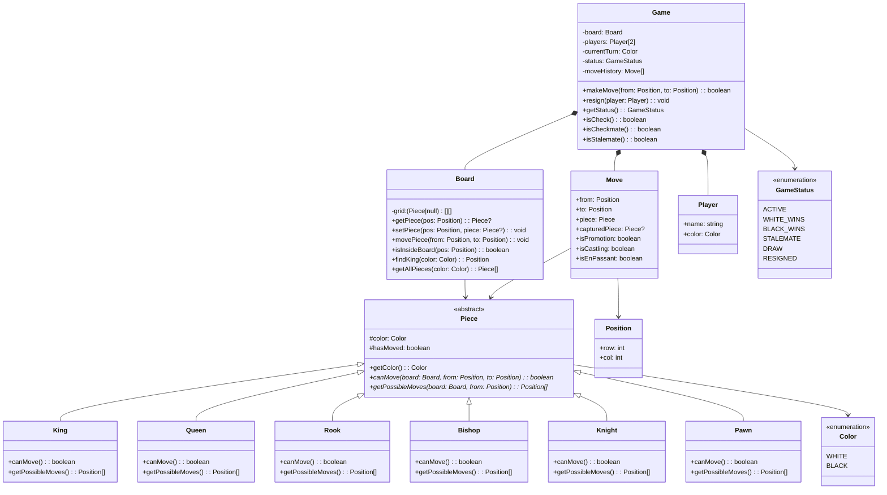

# Design a Chess Game

Chess is the gold standard for testing OOP polymorphism in LLD interviews. Every piece type has different movement rules, yet they share a common interface. The challenge is modeling move validation, check detection, and game state transitions cleanly.

## Requirements & Use Cases

### Functional Requirements

1. Standard 8x8 chess board with standard starting positions
2. Two players alternate turns (white moves first)
3. Six piece types: King, Queen, Rook, Bishop, Knight, Pawn
4. Each piece has unique movement rules
5. Move validation: can't move into check, can't move through pieces (except Knight)
6. Detect check, checkmate, and stalemate
7. Special moves: castling, en passant, pawn promotion
8. Game ends on checkmate, stalemate, resignation, or draw agreement

### Non-Functional Requirements

- Clear separation between game rules and UI
- Extensible for variants (Chess960, timed games)
- Undo/redo support via command pattern

### Use Cases

| Actor | Use Case |
|-------|---------|
| Player | Make a move (source square to destination square) |
| Player | Resign or offer draw |
| System | Validate move legality |
| System | Detect check, checkmate, stalemate |
| System | Handle special moves (castling, en passant, promotion) |
| System | Track move history |

## Class Diagram



## Core Classes & Interfaces

### TypeScript Implementation

```typescript
// ─── Enums & Value Objects ───────────────────────────────

enum Color {
  WHITE = 'WHITE',
  BLACK = 'BLACK',
}

enum GameStatus {
  ACTIVE = 'ACTIVE',
  WHITE_WINS = 'WHITE_WINS',
  BLACK_WINS = 'BLACK_WINS',
  STALEMATE = 'STALEMATE',
  DRAW = 'DRAW',
  RESIGNED = 'RESIGNED',
}

class Position {
  constructor(
    public readonly row: number,
    public readonly col: number
  ) {}

  equals(other: Position): boolean {
    return this.row === other.row && this.col === other.col;
  }

  isValid(): boolean {
    return this.row >= 0 && this.row < 8 && this.col >= 0 && this.col < 8;
  }
}

interface Move {
  from: Position;
  to: Position;
  piece: Piece;
  capturedPiece: Piece | null;
  isPromotion: boolean;
  isCastling: boolean;
  isEnPassant: boolean;
}

// ─── Piece Hierarchy ─────────────────────────────────────

abstract class Piece {
  public hasMoved: boolean = false;

  constructor(public readonly color: Color) {}

  abstract canMove(board: Board, from: Position, to: Position): boolean;
  abstract getPossibleMoves(board: Board, from: Position): Position[];
  abstract get symbol(): string;

  isOpponent(other: Piece | null): boolean {
    return other !== null && other.color !== this.color;
  }

  isFriendly(other: Piece | null): boolean {
    return other !== null && other.color === this.color;
  }

  /** Slide along a direction until blocked (for Rook, Bishop, Queen) */
  protected slideMoves(
    board: Board,
    from: Position,
    directions: [number, number][]
  ): Position[] {
    const moves: Position[] = [];
    for (const [dr, dc] of directions) {
      let r = from.row + dr;
      let c = from.col + dc;
      while (r >= 0 && r < 8 && c >= 0 && c < 8) {
        const pos = new Position(r, c);
        const target = board.getPiece(pos);
        if (target === null) {
          moves.push(pos);
        } else if (this.isOpponent(target)) {
          moves.push(pos);
          break; // can capture but not go further
        } else {
          break; // friendly piece blocks
        }
        r += dr;
        c += dc;
      }
    }
    return moves;
  }
}

class King extends Piece {
  get symbol(): string {
    return this.color === Color.WHITE ? 'K' : 'k';
  }

  canMove(board: Board, from: Position, to: Position): boolean {
    return this.getPossibleMoves(board, from).some((p) => p.equals(to));
  }

  getPossibleMoves(board: Board, from: Position): Position[] {
    const moves: Position[] = [];
    const directions = [
      [-1, -1], [-1, 0], [-1, 1],
      [0, -1],           [0, 1],
      [1, -1],  [1, 0],  [1, 1],
    ];

    for (const [dr, dc] of directions) {
      const pos = new Position(from.row + dr, from.col + dc);
      if (pos.isValid() && !this.isFriendly(board.getPiece(pos))) {
        moves.push(pos);
      }
    }

    // Castling (simplified — full check in Game class)
    if (!this.hasMoved) {
      // Kingside
      const ksRook = board.getPiece(new Position(from.row, 7));
      if (
        ksRook instanceof Rook &&
        !ksRook.hasMoved &&
        board.getPiece(new Position(from.row, 5)) === null &&
        board.getPiece(new Position(from.row, 6)) === null
      ) {
        moves.push(new Position(from.row, 6));
      }
      // Queenside
      const qsRook = board.getPiece(new Position(from.row, 0));
      if (
        qsRook instanceof Rook &&
        !qsRook.hasMoved &&
        board.getPiece(new Position(from.row, 1)) === null &&
        board.getPiece(new Position(from.row, 2)) === null &&
        board.getPiece(new Position(from.row, 3)) === null
      ) {
        moves.push(new Position(from.row, 2));
      }
    }

    return moves;
  }
}

class Queen extends Piece {
  get symbol(): string {
    return this.color === Color.WHITE ? 'Q' : 'q';
  }

  canMove(board: Board, from: Position, to: Position): boolean {
    return this.getPossibleMoves(board, from).some((p) => p.equals(to));
  }

  getPossibleMoves(board: Board, from: Position): Position[] {
    return this.slideMoves(board, from, [
      [-1, -1], [-1, 0], [-1, 1],
      [0, -1],           [0, 1],
      [1, -1],  [1, 0],  [1, 1],
    ]);
  }
}

class Rook extends Piece {
  get symbol(): string {
    return this.color === Color.WHITE ? 'R' : 'r';
  }

  canMove(board: Board, from: Position, to: Position): boolean {
    return this.getPossibleMoves(board, from).some((p) => p.equals(to));
  }

  getPossibleMoves(board: Board, from: Position): Position[] {
    return this.slideMoves(board, from, [
      [-1, 0], [1, 0], [0, -1], [0, 1],
    ]);
  }
}

class Bishop extends Piece {
  get symbol(): string {
    return this.color === Color.WHITE ? 'B' : 'b';
  }

  canMove(board: Board, from: Position, to: Position): boolean {
    return this.getPossibleMoves(board, from).some((p) => p.equals(to));
  }

  getPossibleMoves(board: Board, from: Position): Position[] {
    return this.slideMoves(board, from, [
      [-1, -1], [-1, 1], [1, -1], [1, 1],
    ]);
  }
}

class Knight extends Piece {
  get symbol(): string {
    return this.color === Color.WHITE ? 'N' : 'n';
  }

  canMove(board: Board, from: Position, to: Position): boolean {
    return this.getPossibleMoves(board, from).some((p) => p.equals(to));
  }

  getPossibleMoves(board: Board, from: Position): Position[] {
    const moves: Position[] = [];
    const jumps = [
      [-2, -1], [-2, 1], [-1, -2], [-1, 2],
      [1, -2],  [1, 2],  [2, -1],  [2, 1],
    ];

    for (const [dr, dc] of jumps) {
      const pos = new Position(from.row + dr, from.col + dc);
      if (pos.isValid() && !this.isFriendly(board.getPiece(pos))) {
        moves.push(pos);
      }
    }
    return moves;
  }
}

class Pawn extends Piece {
  get symbol(): string {
    return this.color === Color.WHITE ? 'P' : 'p';
  }

  canMove(board: Board, from: Position, to: Position): boolean {
    return this.getPossibleMoves(board, from).some((p) => p.equals(to));
  }

  getPossibleMoves(board: Board, from: Position): Position[] {
    const moves: Position[] = [];
    const dir = this.color === Color.WHITE ? -1 : 1;
    const startRow = this.color === Color.WHITE ? 6 : 1;

    // Forward one square
    const oneStep = new Position(from.row + dir, from.col);
    if (oneStep.isValid() && board.getPiece(oneStep) === null) {
      moves.push(oneStep);

      // Forward two squares from starting position
      if (from.row === startRow) {
        const twoStep = new Position(from.row + 2 * dir, from.col);
        if (twoStep.isValid() && board.getPiece(twoStep) === null) {
          moves.push(twoStep);
        }
      }
    }

    // Diagonal captures
    for (const dc of [-1, 1]) {
      const capture = new Position(from.row + dir, from.col + dc);
      if (capture.isValid() && this.isOpponent(board.getPiece(capture))) {
        moves.push(capture);
      }
    }

    return moves;
  }
}

// ─── Board ───────────────────────────────────────────────

class Board {
  private grid: (Piece | null)[][] = [];

  constructor() {
    this.grid = Array.from({ length: 8 }, () => Array(8).fill(null));
  }

  getPiece(pos: Position): Piece | null {
    if (!pos.isValid()) return null;
    return this.grid[pos.row][pos.col];
  }

  setPiece(pos: Position, piece: Piece | null): void {
    this.grid[pos.row][pos.col] = piece;
  }

  movePiece(from: Position, to: Position): Piece | null {
    const piece = this.getPiece(from);
    const captured = this.getPiece(to);
    this.setPiece(to, piece);
    this.setPiece(from, null);
    if (piece) piece.hasMoved = true;
    return captured;
  }

  /** Undo a move (for check detection) */
  undoMove(from: Position, to: Position, captured: Piece | null): void {
    const piece = this.getPiece(to);
    this.setPiece(from, piece);
    this.setPiece(to, captured);
  }

  findKing(color: Color): Position {
    for (let r = 0; r < 8; r++) {
      for (let c = 0; c < 8; c++) {
        const piece = this.grid[r][c];
        if (piece instanceof King && piece.color === color) {
          return new Position(r, c);
        }
      }
    }
    throw new Error(`King not found for ${color}`);
  }

  getAllPieces(color: Color): Array<{ piece: Piece; position: Position }> {
    const pieces: Array<{ piece: Piece; position: Position }> = [];
    for (let r = 0; r < 8; r++) {
      for (let c = 0; c < 8; c++) {
        const piece = this.grid[r][c];
        if (piece && piece.color === color) {
          pieces.push({ piece, position: new Position(r, c) });
        }
      }
    }
    return pieces;
  }

  /** Initialize standard starting position */
  setup(): void {
    const backRank = [Rook, Knight, Bishop, Queen, King, Bishop, Knight, Rook];

    for (let c = 0; c < 8; c++) {
      this.grid[0][c] = new backRank[c](Color.BLACK);
      this.grid[1][c] = new Pawn(Color.BLACK);
      this.grid[6][c] = new Pawn(Color.WHITE);
      this.grid[7][c] = new backRank[c](Color.WHITE);
    }
  }
}

// ─── Player ──────────────────────────────────────────────

class Player {
  constructor(
    public readonly name: string,
    public readonly color: Color
  ) {}
}

// ─── Game ────────────────────────────────────────────────

class Game {
  private board: Board;
  private players: [Player, Player];
  private currentTurn: Color = Color.WHITE;
  private status: GameStatus = GameStatus.ACTIVE;
  private moveHistory: Move[] = [];

  constructor(white: Player, black: Player) {
    this.players = [white, black];
    this.board = new Board();
    this.board.setup();
  }

  getStatus(): GameStatus {
    return this.status;
  }

  getCurrentTurn(): Color {
    return this.currentTurn;
  }

  makeMove(from: Position, to: Position): boolean {
    if (this.status !== GameStatus.ACTIVE) return false;

    const piece = this.board.getPiece(from);
    if (!piece || piece.color !== this.currentTurn) return false;
    if (!piece.canMove(this.board, from, to)) return false;

    // Execute move
    const captured = this.board.movePiece(from, to);

    // Check if move leaves own king in check — illegal
    if (this.isInCheck(this.currentTurn)) {
      this.board.undoMove(from, to, captured);
      if (piece) piece.hasMoved = false; // revert
      return false;
    }

    // Handle castling rook movement
    if (piece instanceof King && Math.abs(from.col - to.col) === 2) {
      this.handleCastlingRook(from, to);
    }

    // Handle pawn promotion (auto-promote to queen for simplicity)
    let isPromotion = false;
    if (piece instanceof Pawn) {
      const promotionRow = piece.color === Color.WHITE ? 0 : 7;
      if (to.row === promotionRow) {
        this.board.setPiece(to, new Queen(piece.color));
        isPromotion = true;
      }
    }

    // Record move
    this.moveHistory.push({
      from,
      to,
      piece,
      capturedPiece: captured,
      isPromotion,
      isCastling: piece instanceof King && Math.abs(from.col - to.col) === 2,
      isEnPassant: false,
    });

    // Switch turns
    this.currentTurn =
      this.currentTurn === Color.WHITE ? Color.BLACK : Color.WHITE;

    // Check game-ending conditions
    this.updateStatus();

    return true;
  }

  private handleCastlingRook(kingFrom: Position, kingTo: Position): void {
    if (kingTo.col === 6) {
      // Kingside
      this.board.movePiece(
        new Position(kingFrom.row, 7),
        new Position(kingFrom.row, 5)
      );
    } else if (kingTo.col === 2) {
      // Queenside
      this.board.movePiece(
        new Position(kingFrom.row, 0),
        new Position(kingFrom.row, 3)
      );
    }
  }

  isInCheck(color: Color): boolean {
    const kingPos = this.board.findKing(color);
    const opponentColor = color === Color.WHITE ? Color.BLACK : Color.WHITE;
    const opponents = this.board.getAllPieces(opponentColor);

    return opponents.some(({ piece, position }) =>
      piece.canMove(this.board, position, kingPos)
    );
  }

  /** Check if the given color has any legal moves */
  private hasLegalMoves(color: Color): boolean {
    const pieces = this.board.getAllPieces(color);

    for (const { piece, position } of pieces) {
      const moves = piece.getPossibleMoves(this.board, position);
      for (const move of moves) {
        // Try the move
        const captured = this.board.movePiece(position, move);
        const leavesInCheck = this.isInCheck(color);
        this.board.undoMove(position, move, captured);

        if (!leavesInCheck) return true; // at least one legal move exists
      }
    }
    return false;
  }

  private updateStatus(): void {
    const hasLegal = this.hasLegalMoves(this.currentTurn);
    const inCheck = this.isInCheck(this.currentTurn);

    if (!hasLegal && inCheck) {
      // Checkmate
      this.status =
        this.currentTurn === Color.WHITE
          ? GameStatus.BLACK_WINS
          : GameStatus.WHITE_WINS;
    } else if (!hasLegal && !inCheck) {
      this.status = GameStatus.STALEMATE;
    }
  }

  resign(player: Player): void {
    this.status =
      player.color === Color.WHITE
        ? GameStatus.BLACK_WINS
        : GameStatus.WHITE_WINS;
  }

  getMoveHistory(): Move[] {
    return [...this.moveHistory];
  }
}
```

### Python Implementation

```python
from abc import ABC, abstractmethod
from dataclasses import dataclass, field
from enum import Enum
from typing import Optional


# ─── Enums & Value Objects ──────────────────────────────

class Color(Enum):
    WHITE = "WHITE"
    BLACK = "BLACK"


class GameStatus(Enum):
    ACTIVE = "ACTIVE"
    WHITE_WINS = "WHITE_WINS"
    BLACK_WINS = "BLACK_WINS"
    STALEMATE = "STALEMATE"
    DRAW = "DRAW"
    RESIGNED = "RESIGNED"


@dataclass(frozen=True)
class Position:
    row: int
    col: int

    def is_valid(self) -> bool:
        return 0 <= self.row < 8 and 0 <= self.col < 8


@dataclass
class Move:
    from_pos: Position
    to_pos: Position
    piece: "Piece"
    captured_piece: Optional["Piece"] = None
    is_promotion: bool = False
    is_castling: bool = False
    is_en_passant: bool = False


# ─── Piece Hierarchy ───────────────────────────────────

class Piece(ABC):
    def __init__(self, color: Color):
        self.color = color
        self.has_moved = False

    @abstractmethod
    def can_move(self, board: "Board", from_pos: Position, to_pos: Position) -> bool:
        ...

    @abstractmethod
    def get_possible_moves(self, board: "Board", from_pos: Position) -> list[Position]:
        ...

    def is_opponent(self, other: Optional["Piece"]) -> bool:
        return other is not None and other.color != self.color

    def is_friendly(self, other: Optional["Piece"]) -> bool:
        return other is not None and other.color == self.color

    def _slide_moves(
        self,
        board: "Board",
        from_pos: Position,
        directions: list[tuple[int, int]],
    ) -> list[Position]:
        moves = []
        for dr, dc in directions:
            r, c = from_pos.row + dr, from_pos.col + dc
            while 0 <= r < 8 and 0 <= c < 8:
                pos = Position(r, c)
                target = board.get_piece(pos)
                if target is None:
                    moves.append(pos)
                elif self.is_opponent(target):
                    moves.append(pos)
                    break
                else:
                    break
                r += dr
                c += dc
        return moves


class King(Piece):
    def can_move(self, board: "Board", from_pos: Position, to_pos: Position) -> bool:
        return to_pos in self.get_possible_moves(board, from_pos)

    def get_possible_moves(self, board: "Board", from_pos: Position) -> list[Position]:
        moves = []
        for dr in [-1, 0, 1]:
            for dc in [-1, 0, 1]:
                if dr == 0 and dc == 0:
                    continue
                pos = Position(from_pos.row + dr, from_pos.col + dc)
                if pos.is_valid() and not self.is_friendly(board.get_piece(pos)):
                    moves.append(pos)

        # Castling
        if not self.has_moved:
            # Kingside
            ks_rook = board.get_piece(Position(from_pos.row, 7))
            if (
                isinstance(ks_rook, Rook)
                and not ks_rook.has_moved
                and board.get_piece(Position(from_pos.row, 5)) is None
                and board.get_piece(Position(from_pos.row, 6)) is None
            ):
                moves.append(Position(from_pos.row, 6))
            # Queenside
            qs_rook = board.get_piece(Position(from_pos.row, 0))
            if (
                isinstance(qs_rook, Rook)
                and not qs_rook.has_moved
                and board.get_piece(Position(from_pos.row, 1)) is None
                and board.get_piece(Position(from_pos.row, 2)) is None
                and board.get_piece(Position(from_pos.row, 3)) is None
            ):
                moves.append(Position(from_pos.row, 2))
        return moves


class Queen(Piece):
    def can_move(self, board: "Board", from_pos: Position, to_pos: Position) -> bool:
        return to_pos in self.get_possible_moves(board, from_pos)

    def get_possible_moves(self, board: "Board", from_pos: Position) -> list[Position]:
        return self._slide_moves(
            board, from_pos,
            [(-1, -1), (-1, 0), (-1, 1), (0, -1), (0, 1), (1, -1), (1, 0), (1, 1)],
        )


class Rook(Piece):
    def can_move(self, board: "Board", from_pos: Position, to_pos: Position) -> bool:
        return to_pos in self.get_possible_moves(board, from_pos)

    def get_possible_moves(self, board: "Board", from_pos: Position) -> list[Position]:
        return self._slide_moves(
            board, from_pos, [(-1, 0), (1, 0), (0, -1), (0, 1)]
        )


class Bishop(Piece):
    def can_move(self, board: "Board", from_pos: Position, to_pos: Position) -> bool:
        return to_pos in self.get_possible_moves(board, from_pos)

    def get_possible_moves(self, board: "Board", from_pos: Position) -> list[Position]:
        return self._slide_moves(
            board, from_pos, [(-1, -1), (-1, 1), (1, -1), (1, 1)]
        )


class Knight(Piece):
    def can_move(self, board: "Board", from_pos: Position, to_pos: Position) -> bool:
        return to_pos in self.get_possible_moves(board, from_pos)

    def get_possible_moves(self, board: "Board", from_pos: Position) -> list[Position]:
        moves = []
        jumps = [
            (-2, -1), (-2, 1), (-1, -2), (-1, 2),
            (1, -2), (1, 2), (2, -1), (2, 1),
        ]
        for dr, dc in jumps:
            pos = Position(from_pos.row + dr, from_pos.col + dc)
            if pos.is_valid() and not self.is_friendly(board.get_piece(pos)):
                moves.append(pos)
        return moves


class Pawn(Piece):
    def can_move(self, board: "Board", from_pos: Position, to_pos: Position) -> bool:
        return to_pos in self.get_possible_moves(board, from_pos)

    def get_possible_moves(self, board: "Board", from_pos: Position) -> list[Position]:
        moves = []
        direction = -1 if self.color == Color.WHITE else 1
        start_row = 6 if self.color == Color.WHITE else 1

        # Forward
        one_step = Position(from_pos.row + direction, from_pos.col)
        if one_step.is_valid() and board.get_piece(one_step) is None:
            moves.append(one_step)
            if from_pos.row == start_row:
                two_step = Position(from_pos.row + 2 * direction, from_pos.col)
                if two_step.is_valid() and board.get_piece(two_step) is None:
                    moves.append(two_step)

        # Diagonal captures
        for dc in [-1, 1]:
            cap = Position(from_pos.row + direction, from_pos.col + dc)
            if cap.is_valid() and self.is_opponent(board.get_piece(cap)):
                moves.append(cap)
        return moves


# ─── Board ──────────────────────────────────────────────

class Board:
    def __init__(self):
        self._grid: list[list[Optional[Piece]]] = [
            [None] * 8 for _ in range(8)
        ]

    def get_piece(self, pos: Position) -> Optional[Piece]:
        if not pos.is_valid():
            return None
        return self._grid[pos.row][pos.col]

    def set_piece(self, pos: Position, piece: Optional[Piece]) -> None:
        self._grid[pos.row][pos.col] = piece

    def move_piece(
        self, from_pos: Position, to_pos: Position
    ) -> Optional[Piece]:
        piece = self.get_piece(from_pos)
        captured = self.get_piece(to_pos)
        self.set_piece(to_pos, piece)
        self.set_piece(from_pos, None)
        if piece:
            piece.has_moved = True
        return captured

    def undo_move(
        self, from_pos: Position, to_pos: Position, captured: Optional[Piece]
    ) -> None:
        piece = self.get_piece(to_pos)
        self.set_piece(from_pos, piece)
        self.set_piece(to_pos, captured)

    def find_king(self, color: Color) -> Position:
        for r in range(8):
            for c in range(8):
                p = self._grid[r][c]
                if isinstance(p, King) and p.color == color:
                    return Position(r, c)
        raise ValueError(f"King not found for {color}")

    def get_all_pieces(
        self, color: Color
    ) -> list[tuple[Piece, Position]]:
        result = []
        for r in range(8):
            for c in range(8):
                p = self._grid[r][c]
                if p and p.color == color:
                    result.append((p, Position(r, c)))
        return result

    def setup(self) -> None:
        back_rank = [Rook, Knight, Bishop, Queen, King, Bishop, Knight, Rook]
        for c in range(8):
            self._grid[0][c] = back_rank[c](Color.BLACK)
            self._grid[1][c] = Pawn(Color.BLACK)
            self._grid[6][c] = Pawn(Color.WHITE)
            self._grid[7][c] = back_rank[c](Color.WHITE)


# ─── Game ───────────────────────────────────────────────

class Player:
    def __init__(self, name: str, color: Color):
        self.name = name
        self.color = color


class Game:
    def __init__(self, white: Player, black: Player):
        self._board = Board()
        self._board.setup()
        self._players = (white, black)
        self._current_turn = Color.WHITE
        self._status = GameStatus.ACTIVE
        self._move_history: list[Move] = []

    @property
    def status(self) -> GameStatus:
        return self._status

    def make_move(self, from_pos: Position, to_pos: Position) -> bool:
        if self._status != GameStatus.ACTIVE:
            return False

        piece = self._board.get_piece(from_pos)
        if not piece or piece.color != self._current_turn:
            return False
        if not piece.can_move(self._board, from_pos, to_pos):
            return False

        captured = self._board.move_piece(from_pos, to_pos)

        if self._is_in_check(self._current_turn):
            self._board.undo_move(from_pos, to_pos, captured)
            piece.has_moved = False
            return False

        # Castling rook movement
        is_castling = isinstance(piece, King) and abs(from_pos.col - to_pos.col) == 2
        if is_castling:
            self._handle_castling_rook(from_pos, to_pos)

        # Pawn promotion
        is_promotion = False
        if isinstance(piece, Pawn):
            promo_row = 0 if piece.color == Color.WHITE else 7
            if to_pos.row == promo_row:
                self._board.set_piece(to_pos, Queen(piece.color))
                is_promotion = True

        self._move_history.append(Move(
            from_pos=from_pos, to_pos=to_pos, piece=piece,
            captured_piece=captured, is_promotion=is_promotion,
            is_castling=is_castling,
        ))

        self._current_turn = (
            Color.BLACK if self._current_turn == Color.WHITE else Color.WHITE
        )
        self._update_status()
        return True

    def _handle_castling_rook(self, king_from: Position, king_to: Position) -> None:
        if king_to.col == 6:
            self._board.move_piece(
                Position(king_from.row, 7), Position(king_from.row, 5)
            )
        elif king_to.col == 2:
            self._board.move_piece(
                Position(king_from.row, 0), Position(king_from.row, 3)
            )

    def _is_in_check(self, color: Color) -> bool:
        king_pos = self._board.find_king(color)
        opp = Color.BLACK if color == Color.WHITE else Color.WHITE
        for piece, pos in self._board.get_all_pieces(opp):
            if piece.can_move(self._board, pos, king_pos):
                return True
        return False

    def _has_legal_moves(self, color: Color) -> bool:
        for piece, pos in self._board.get_all_pieces(color):
            for move in piece.get_possible_moves(self._board, pos):
                captured = self._board.move_piece(pos, move)
                in_check = self._is_in_check(color)
                self._board.undo_move(pos, move, captured)
                if not in_check:
                    return True
        return False

    def _update_status(self) -> None:
        has_legal = self._has_legal_moves(self._current_turn)
        in_check = self._is_in_check(self._current_turn)

        if not has_legal and in_check:
            self._status = (
                GameStatus.BLACK_WINS
                if self._current_turn == Color.WHITE
                else GameStatus.WHITE_WINS
            )
        elif not has_legal:
            self._status = GameStatus.STALEMATE

    def resign(self, player: Player) -> None:
        self._status = (
            GameStatus.BLACK_WINS
            if player.color == Color.WHITE
            else GameStatus.WHITE_WINS
        )
```

## Design Patterns Used

| Pattern | Where | Why |
|---------|-------|-----|
| **Polymorphism** | `Piece` hierarchy — each piece implements `canMove()` and `getPossibleMoves()` | Uniform interface, Board doesn't need to know piece types |
| **Template Method** | `slideMoves()` in base `Piece` class | Rook, Bishop, Queen share sliding logic, only differ in directions |
| **Command** *(extension)* | `Move` objects stored in history | Enable undo/redo by reversing recorded moves |
| **Composition** | `Game` owns `Board`, `Board` owns `Piece` grid | Clean ownership hierarchy |

## Concurrency Considerations

::: tip Chess Is Turn-Based
Chess is inherently sequential — only one player acts at a time. Concurrency is mainly relevant for:

- **Online multiplayer:** Lock the game state during move validation to prevent race conditions if both clients somehow submit simultaneously
- **AI computation:** Run the AI's move search on a background thread while the UI remains responsive
- **Move timer:** A separate timer thread counts down; if it expires, the current player loses
:::

## Testing Strategy

| Test Type | What to Test |
|-----------|-------------|
| **Unit** | Each piece's `getPossibleMoves()` from various board positions |
| **Unit** | Knight can jump over pieces; Rook/Bishop/Queen cannot |
| **Unit** | Pawn: forward move, capture, double move from start, promotion |
| **Integration** | Move leaves own king in check — should be rejected |
| **Integration** | Checkmate detection: Scholar's Mate (4-move checkmate) |
| **Integration** | Stalemate detection |
| **Integration** | Castling: kingside and queenside, blocked by pieces, blocked by check |
| **Edge case** | King cannot castle through check or out of check |
| **Edge case** | Pawn promotion auto-promotes to Queen |

## Extensions & Follow-ups

| Extension | Design Impact |
|-----------|--------------|
| **En passant** | Track last move's pawn double-step; Pawn checks adjacent column |
| **Undo/redo** | Command pattern: `Move` objects with `execute()` / `undo()` methods |
| **Move timer** | Add `Clock` class per player; decrement on turn, lose if zero |
| **Chess960** | Randomize back-rank setup; castling rules adapt to king/rook positions |
| **Algebraic notation** | `NotationService` converts `Move` to/from "e2e4", "Nf3", "O-O" |
| **AI opponent** | `AIPlayer` with `Minimax` + alpha-beta pruning using `Board.evaluate()` |
| **Move validation caching** | Cache legal moves per position; invalidate on board change |
