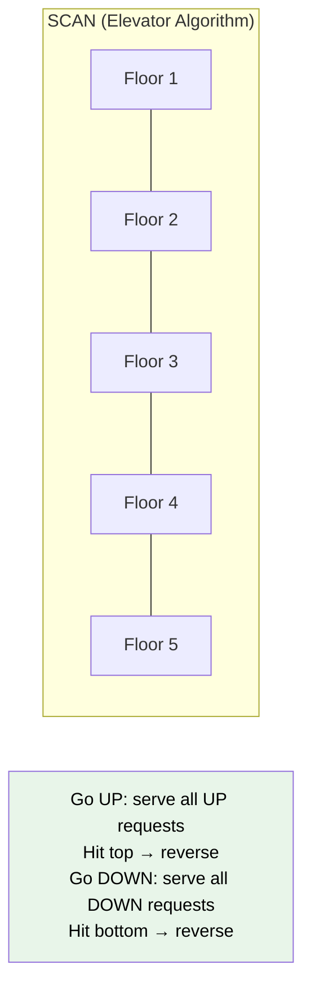
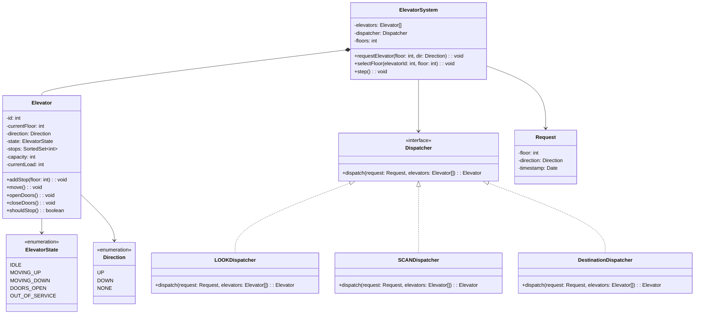

# Design an Elevator System

The elevator problem tests your ability to model concurrent state machines and implement scheduling algorithms. The core challenge is not the elevator itself — it is how multiple elevators coordinate to minimize wait time.

## Requirements & Use Cases

### Functional Requirements

1. Building has N floors and M elevators
2. Each floor has Up and Down request buttons (hall calls)
3. Inside each elevator, passengers select destination floors (cabin calls)
4. Elevators move up and down, opening doors at requested floors
5. Scheduling algorithm determines which elevator services which request
6. Display current floor and direction for each elevator
7. Support capacity limits per elevator

### Non-Functional Requirements

- Minimize average wait time across all passengers
- Elevators should not "starve" requests (no indefinite waiting)
- Thread-safe request handling (multiple buttons pressed concurrently)
- Extensible to add new scheduling algorithms

### Use Cases

| Actor | Use Case |
|-------|---------|
| Passenger | Press hall button (up/down) on a floor |
| Passenger | Select destination floor inside elevator |
| System | Dispatch optimal elevator to a hall call |
| System | Move elevator and open doors at stops |
| Admin | Configure number of elevators and floors |
| Admin | Take an elevator out of service |

## Scheduling Algorithms

| Algorithm | How It Works | Pros | Cons |
|-----------|-------------|------|------|
| **FCFS** | Serve requests in arrival order | Simple | Terrible performance — elevator bounces randomly |
| **SCAN** | Move in one direction serving all requests, then reverse | Fair | Goes to extremes even without requests |
| **LOOK** | Like SCAN but reverses when no more requests in current direction | Efficient | Slightly more complex |
| **Destination Dispatch** | Passengers enter destination before entering elevator; group by destination | Best throughput | Requires lobby kiosks |



## Class Diagram



## Core Classes & Interfaces

### TypeScript Implementation

```typescript
// ─── Enums ───────────────────────────────────────────────

enum Direction {
  UP = 'UP',
  DOWN = 'DOWN',
  NONE = 'NONE',
}

enum ElevatorState {
  IDLE = 'IDLE',
  MOVING_UP = 'MOVING_UP',
  MOVING_DOWN = 'MOVING_DOWN',
  DOORS_OPEN = 'DOORS_OPEN',
  OUT_OF_SERVICE = 'OUT_OF_SERVICE',
}

// ─── Request ─────────────────────────────────────────────

interface Request {
  floor: number;
  direction: Direction;
  timestamp: Date;
}

// ─── Elevator ────────────────────────────────────────────

class Elevator {
  private currentFloor: number = 1;
  private direction: Direction = Direction.NONE;
  private state: ElevatorState = ElevatorState.IDLE;
  private upStops: Set<number> = new Set();
  private downStops: Set<number> = new Set();
  private capacity: number;
  private currentLoad: number = 0;

  constructor(
    public readonly id: number,
    capacity: number = 10
  ) {
    this.capacity = capacity;
  }

  getCurrentFloor(): number {
    return this.currentFloor;
  }

  getDirection(): Direction {
    return this.direction;
  }

  getState(): ElevatorState {
    return this.state;
  }

  isIdle(): boolean {
    return this.state === ElevatorState.IDLE;
  }

  hasStops(): boolean {
    return this.upStops.size > 0 || this.downStops.size > 0;
  }

  addStop(floor: number): void {
    if (floor > this.currentFloor) {
      this.upStops.add(floor);
    } else if (floor < this.currentFloor) {
      this.downStops.add(floor);
    }
    // If floor === currentFloor, open doors immediately
    if (floor === this.currentFloor) {
      this.openDoors();
    }
  }

  /** Compute distance to a floor considering current direction */
  distanceTo(floor: number, requestDir: Direction): number {
    const diff = Math.abs(this.currentFloor - floor);

    if (this.isIdle()) return diff;

    // Elevator going in same direction as request and hasn't passed the floor
    if (
      this.direction === Direction.UP &&
      requestDir === Direction.UP &&
      floor >= this.currentFloor
    ) {
      return floor - this.currentFloor;
    }

    if (
      this.direction === Direction.DOWN &&
      requestDir === Direction.DOWN &&
      floor <= this.currentFloor
    ) {
      return this.currentFloor - floor;
    }

    // Elevator must reverse — penalize
    return diff + 2 * this.getRemainingDistance();
  }

  private getRemainingDistance(): number {
    if (this.direction === Direction.UP && this.upStops.size > 0) {
      return Math.max(...this.upStops) - this.currentFloor;
    }
    if (this.direction === Direction.DOWN && this.downStops.size > 0) {
      return this.currentFloor - Math.min(...this.downStops);
    }
    return 0;
  }

  /** Move one floor in current direction */
  move(): void {
    if (this.state === ElevatorState.OUT_OF_SERVICE) return;

    if (!this.hasStops()) {
      this.state = ElevatorState.IDLE;
      this.direction = Direction.NONE;
      return;
    }

    this.decideDirection();

    if (this.direction === Direction.UP) {
      this.currentFloor++;
      this.state = ElevatorState.MOVING_UP;
    } else if (this.direction === Direction.DOWN) {
      this.currentFloor--;
      this.state = ElevatorState.MOVING_DOWN;
    }

    if (this.shouldStop()) {
      this.openDoors();
    }
  }

  private decideDirection(): void {
    if (this.direction === Direction.UP || this.direction === Direction.NONE) {
      if (this.upStops.size > 0) {
        this.direction = Direction.UP;
      } else if (this.downStops.size > 0) {
        this.direction = Direction.DOWN;
      }
    } else {
      if (this.downStops.size > 0) {
        this.direction = Direction.DOWN;
      } else if (this.upStops.size > 0) {
        this.direction = Direction.UP;
      }
    }
  }

  private shouldStop(): boolean {
    if (this.direction === Direction.UP) {
      return this.upStops.has(this.currentFloor);
    }
    if (this.direction === Direction.DOWN) {
      return this.downStops.has(this.currentFloor);
    }
    return false;
  }

  openDoors(): void {
    this.state = ElevatorState.DOORS_OPEN;
    this.upStops.delete(this.currentFloor);
    this.downStops.delete(this.currentFloor);
    // In production: emit event for passengers to enter/exit
  }

  closeDoors(): void {
    if (!this.hasStops()) {
      this.state = ElevatorState.IDLE;
      this.direction = Direction.NONE;
    } else {
      this.state =
        this.direction === Direction.UP
          ? ElevatorState.MOVING_UP
          : ElevatorState.MOVING_DOWN;
    }
  }

  setOutOfService(): void {
    this.state = ElevatorState.OUT_OF_SERVICE;
  }

  setInService(): void {
    this.state = ElevatorState.IDLE;
    this.direction = Direction.NONE;
  }
}

// ─── Dispatcher (Strategy Pattern) ───────────────────────

interface Dispatcher {
  dispatch(request: Request, elevators: Elevator[]): Elevator | null;
}

/**
 * LOOK Algorithm:
 * Picks the elevator with the minimum "cost" to serve the request.
 * Cost = distance considering direction and remaining stops.
 */
class LOOKDispatcher implements Dispatcher {
  dispatch(request: Request, elevators: Elevator[]): Elevator | null {
    const available = elevators.filter(
      (e) => e.getState() !== ElevatorState.OUT_OF_SERVICE
    );

    if (available.length === 0) return null;

    let best: Elevator | null = null;
    let bestCost = Infinity;

    for (const elevator of available) {
      const cost = elevator.distanceTo(request.floor, request.direction);
      if (cost < bestCost) {
        bestCost = cost;
        best = elevator;
      }
    }

    return best;
  }
}

/**
 * SCAN Dispatcher:
 * Always assigns to the nearest elevator moving in
 * the same direction. If none, assigns the nearest idle.
 */
class SCANDispatcher implements Dispatcher {
  dispatch(request: Request, elevators: Elevator[]): Elevator | null {
    const available = elevators.filter(
      (e) => e.getState() !== ElevatorState.OUT_OF_SERVICE
    );

    // Prefer elevator going in same direction
    const sameDir = available.filter(
      (e) => e.getDirection() === request.direction
    );

    const candidates = sameDir.length > 0 ? sameDir : available;

    let best: Elevator | null = null;
    let bestDist = Infinity;

    for (const e of candidates) {
      const dist = Math.abs(e.getCurrentFloor() - request.floor);
      if (dist < bestDist) {
        bestDist = dist;
        best = e;
      }
    }

    return best;
  }
}

/**
 * Destination Dispatch:
 * Groups passengers going to similar destinations into the same elevator.
 * Minimizes total stops per trip.
 */
class DestinationDispatcher implements Dispatcher {
  dispatch(request: Request, elevators: Elevator[]): Elevator | null {
    const available = elevators.filter(
      (e) => e.getState() !== ElevatorState.OUT_OF_SERVICE
    );

    if (available.length === 0) return null;

    // Prefer idle elevators first, then closest
    const idle = available.filter((e) => e.isIdle());
    const candidates = idle.length > 0 ? idle : available;

    let best: Elevator | null = null;
    let bestDist = Infinity;

    for (const e of candidates) {
      const dist = Math.abs(e.getCurrentFloor() - request.floor);
      if (dist < bestDist) {
        bestDist = dist;
        best = e;
      }
    }

    return best;
  }
}

// ─── Elevator System (Facade) ────────────────────────────

class ElevatorSystem {
  private elevators: Elevator[] = [];
  private pendingRequests: Request[] = [];

  constructor(
    private numFloors: number,
    numElevators: number,
    private dispatcher: Dispatcher = new LOOKDispatcher()
  ) {
    for (let i = 1; i <= numElevators; i++) {
      this.elevators.push(new Elevator(i));
    }
  }

  setDispatcher(dispatcher: Dispatcher): void {
    this.dispatcher = dispatcher;
  }

  /** Hall call — passenger presses UP or DOWN on a floor */
  requestElevator(floor: number, direction: Direction): void {
    if (floor < 1 || floor > this.numFloors) {
      throw new Error(`Invalid floor: ${floor}`);
    }

    const request: Request = { floor, direction, timestamp: new Date() };
    const elevator = this.dispatcher.dispatch(request, this.elevators);

    if (elevator) {
      elevator.addStop(floor);
    } else {
      this.pendingRequests.push(request); // all elevators out of service
    }
  }

  /** Cabin call — passenger selects a destination inside the elevator */
  selectFloor(elevatorId: number, floor: number): void {
    if (floor < 1 || floor > this.numFloors) {
      throw new Error(`Invalid floor: ${floor}`);
    }

    const elevator = this.elevators.find((e) => e.id === elevatorId);
    if (!elevator) throw new Error(`Elevator ${elevatorId} not found`);

    elevator.addStop(floor);
  }

  /** Advance simulation by one time step */
  step(): void {
    for (const elevator of this.elevators) {
      if (elevator.getState() === ElevatorState.DOORS_OPEN) {
        elevator.closeDoors();
      } else {
        elevator.move();
      }
    }
    this.processPendingRequests();
  }

  private processPendingRequests(): void {
    const remaining: Request[] = [];
    for (const req of this.pendingRequests) {
      const elevator = this.dispatcher.dispatch(req, this.elevators);
      if (elevator) {
        elevator.addStop(req.floor);
      } else {
        remaining.push(req);
      }
    }
    this.pendingRequests = remaining;
  }

  getStatus(): Array<{
    id: number;
    floor: number;
    direction: Direction;
    state: ElevatorState;
  }> {
    return this.elevators.map((e) => ({
      id: e.id,
      floor: e.getCurrentFloor(),
      direction: e.getDirection(),
      state: e.getState(),
    }));
  }
}
```

### Python Implementation

```python
from abc import ABC, abstractmethod
from dataclasses import dataclass, field
from datetime import datetime
from enum import Enum
from typing import Optional


# ─── Enums ──────────────────────────────────────────────

class Direction(Enum):
    UP = "UP"
    DOWN = "DOWN"
    NONE = "NONE"


class ElevatorState(Enum):
    IDLE = "IDLE"
    MOVING_UP = "MOVING_UP"
    MOVING_DOWN = "MOVING_DOWN"
    DOORS_OPEN = "DOORS_OPEN"
    OUT_OF_SERVICE = "OUT_OF_SERVICE"


# ─── Request ────────────────────────────────────────────

@dataclass
class Request:
    floor: int
    direction: Direction
    timestamp: datetime = field(default_factory=datetime.now)


# ─── Elevator ───────────────────────────────────────────

class Elevator:
    def __init__(self, elevator_id: int, capacity: int = 10):
        self.id = elevator_id
        self._current_floor = 1
        self._direction = Direction.NONE
        self._state = ElevatorState.IDLE
        self._up_stops: set[int] = set()
        self._down_stops: set[int] = set()
        self._capacity = capacity
        self._current_load = 0

    @property
    def current_floor(self) -> int:
        return self._current_floor

    @property
    def direction(self) -> Direction:
        return self._direction

    @property
    def state(self) -> ElevatorState:
        return self._state

    @property
    def is_idle(self) -> bool:
        return self._state == ElevatorState.IDLE

    @property
    def has_stops(self) -> bool:
        return len(self._up_stops) > 0 or len(self._down_stops) > 0

    def add_stop(self, floor: int) -> None:
        if floor > self._current_floor:
            self._up_stops.add(floor)
        elif floor < self._current_floor:
            self._down_stops.add(floor)
        else:
            self.open_doors()

    def distance_to(self, floor: int, request_dir: Direction) -> int:
        diff = abs(self._current_floor - floor)

        if self.is_idle:
            return diff

        if (
            self._direction == Direction.UP
            and request_dir == Direction.UP
            and floor >= self._current_floor
        ):
            return floor - self._current_floor

        if (
            self._direction == Direction.DOWN
            and request_dir == Direction.DOWN
            and floor <= self._current_floor
        ):
            return self._current_floor - floor

        return diff + 2 * self._remaining_distance()

    def _remaining_distance(self) -> int:
        if self._direction == Direction.UP and self._up_stops:
            return max(self._up_stops) - self._current_floor
        if self._direction == Direction.DOWN and self._down_stops:
            return self._current_floor - min(self._down_stops)
        return 0

    def move(self) -> None:
        if self._state == ElevatorState.OUT_OF_SERVICE:
            return

        if not self.has_stops:
            self._state = ElevatorState.IDLE
            self._direction = Direction.NONE
            return

        self._decide_direction()

        if self._direction == Direction.UP:
            self._current_floor += 1
            self._state = ElevatorState.MOVING_UP
        elif self._direction == Direction.DOWN:
            self._current_floor -= 1
            self._state = ElevatorState.MOVING_DOWN

        if self._should_stop():
            self.open_doors()

    def _decide_direction(self) -> None:
        if self._direction in (Direction.UP, Direction.NONE):
            if self._up_stops:
                self._direction = Direction.UP
            elif self._down_stops:
                self._direction = Direction.DOWN
        else:
            if self._down_stops:
                self._direction = Direction.DOWN
            elif self._up_stops:
                self._direction = Direction.UP

    def _should_stop(self) -> bool:
        if self._direction == Direction.UP:
            return self._current_floor in self._up_stops
        if self._direction == Direction.DOWN:
            return self._current_floor in self._down_stops
        return False

    def open_doors(self) -> None:
        self._state = ElevatorState.DOORS_OPEN
        self._up_stops.discard(self._current_floor)
        self._down_stops.discard(self._current_floor)

    def close_doors(self) -> None:
        if not self.has_stops:
            self._state = ElevatorState.IDLE
            self._direction = Direction.NONE
        else:
            self._state = (
                ElevatorState.MOVING_UP
                if self._direction == Direction.UP
                else ElevatorState.MOVING_DOWN
            )

    def set_out_of_service(self) -> None:
        self._state = ElevatorState.OUT_OF_SERVICE

    def set_in_service(self) -> None:
        self._state = ElevatorState.IDLE
        self._direction = Direction.NONE


# ─── Dispatcher (Strategy Pattern) ──────────────────────

class Dispatcher(ABC):
    @abstractmethod
    def dispatch(
        self, request: Request, elevators: list[Elevator]
    ) -> Optional[Elevator]:
        ...


class LOOKDispatcher(Dispatcher):
    def dispatch(
        self, request: Request, elevators: list[Elevator]
    ) -> Optional[Elevator]:
        available = [
            e for e in elevators
            if e.state != ElevatorState.OUT_OF_SERVICE
        ]
        if not available:
            return None

        return min(
            available,
            key=lambda e: e.distance_to(request.floor, request.direction),
        )


class SCANDispatcher(Dispatcher):
    def dispatch(
        self, request: Request, elevators: list[Elevator]
    ) -> Optional[Elevator]:
        available = [
            e for e in elevators
            if e.state != ElevatorState.OUT_OF_SERVICE
        ]
        same_dir = [e for e in available if e.direction == request.direction]
        candidates = same_dir if same_dir else available
        if not candidates:
            return None

        return min(
            candidates,
            key=lambda e: abs(e.current_floor - request.floor),
        )


# ─── Elevator System ───────────────────────────────────

class ElevatorSystem:
    def __init__(
        self,
        num_floors: int,
        num_elevators: int,
        dispatcher: Optional[Dispatcher] = None,
    ):
        self._num_floors = num_floors
        self._dispatcher = dispatcher or LOOKDispatcher()
        self._elevators = [Elevator(i + 1) for i in range(num_elevators)]
        self._pending: list[Request] = []

    def set_dispatcher(self, dispatcher: Dispatcher) -> None:
        self._dispatcher = dispatcher

    def request_elevator(self, floor: int, direction: Direction) -> None:
        if not 1 <= floor <= self._num_floors:
            raise ValueError(f"Invalid floor: {floor}")

        request = Request(floor=floor, direction=direction)
        elevator = self._dispatcher.dispatch(request, self._elevators)

        if elevator:
            elevator.add_stop(floor)
        else:
            self._pending.append(request)

    def select_floor(self, elevator_id: int, floor: int) -> None:
        if not 1 <= floor <= self._num_floors:
            raise ValueError(f"Invalid floor: {floor}")

        elevator = next(
            (e for e in self._elevators if e.id == elevator_id), None
        )
        if not elevator:
            raise ValueError(f"Elevator {elevator_id} not found")
        elevator.add_stop(floor)

    def step(self) -> None:
        for elevator in self._elevators:
            if elevator.state == ElevatorState.DOORS_OPEN:
                elevator.close_doors()
            else:
                elevator.move()
        self._process_pending()

    def _process_pending(self) -> None:
        remaining = []
        for req in self._pending:
            elevator = self._dispatcher.dispatch(req, self._elevators)
            if elevator:
                elevator.add_stop(req.floor)
            else:
                remaining.append(req)
        self._pending = remaining

    def get_status(self) -> list[dict]:
        return [
            {
                "id": e.id,
                "floor": e.current_floor,
                "direction": e.direction.value,
                "state": e.state.value,
            }
            for e in self._elevators
        ]
```

## Design Patterns Used

| Pattern | Where | Why |
|---------|-------|-----|
| **Strategy** | `Dispatcher` interface with LOOK, SCAN, Destination variants | Swap scheduling algorithms at runtime without changing the system |
| **State** | `ElevatorState` enum driving `Elevator.move()` behavior | Elevator behavior changes based on current state (idle, moving, doors open) |
| **Facade** | `ElevatorSystem` | Hides dispatch logic, elevator management, pending queue from callers |
| **Observer** *(extension)* | Floor displays watching elevator positions | Decouple display updates from elevator movement logic |

## Concurrency Considerations

::: warning Race Condition: Simultaneous Hall Calls
Two passengers pressing buttons at the same time could cause the same elevator to be dispatched to both, or a request could be lost.
:::

**Solutions:**

1. **Request queue with single consumer** — All hall calls go into a thread-safe queue. A single dispatcher thread processes them sequentially.

2. **Lock per elevator** — When the dispatcher assigns a request, it locks the elevator's stop list. Other dispatches see the updated state.

3. **Event-driven architecture** — Use an event bus. `HallCallEvent` → dispatcher processes → `ElevatorAssignedEvent` → elevator processes.

```typescript
// Thread-safe request processing
class ElevatorSystem {
  private requestQueue = new AsyncQueue<Request>();

  async processRequests(): Promise<void> {
    while (true) {
      const request = await this.requestQueue.dequeue();
      // Single-threaded dispatch — no race conditions
      const elevator = this.dispatcher.dispatch(request, this.elevators);
      if (elevator) {
        elevator.addStop(request.floor);
      }
    }
  }
}
```

## Testing Strategy

| Test Type | What to Test |
|-----------|-------------|
| **Unit** | `Elevator.addStop()` — adds to correct direction set |
| **Unit** | `Elevator.move()` — increments/decrements floor, changes state |
| **Unit** | `LOOKDispatcher` — picks closest elevator going in right direction |
| **Unit** | `distanceTo()` — correct cost when same direction, opposite, idle |
| **Integration** | Full scenario: request on floor 5, elevator moves from 1, stops, opens doors |
| **Edge case** | All elevators out of service — request goes to pending queue |
| **Edge case** | Elevator at top floor reverses direction |
| **Performance** | 100-floor building, 8 elevators, 1000 random requests — measure average wait time |

## Extensions & Follow-ups

| Extension | Design Impact |
|-----------|--------------|
| **Express elevator** | Subclass `Elevator` with restricted floor list; dispatcher filters candidates |
| **Weight sensor** | Add `currentWeight` to `Elevator`; skip dispatch if near capacity |
| **Fire mode** | New state: all elevators go to ground floor, doors open, disable hall calls |
| **VIP priority** | `Request` gets priority field; dispatcher processes high-priority first |
| **Energy optimization** | Dispatcher factors in elevator proximity to reduce total movement |
| **Real-time display** | Observer pattern: `FloorDisplay` subscribes to `Elevator` position changes |
| **Group scheduling** | Assign floors to elevator zones (1-10 = Elevator A, 11-20 = Elevator B) |
