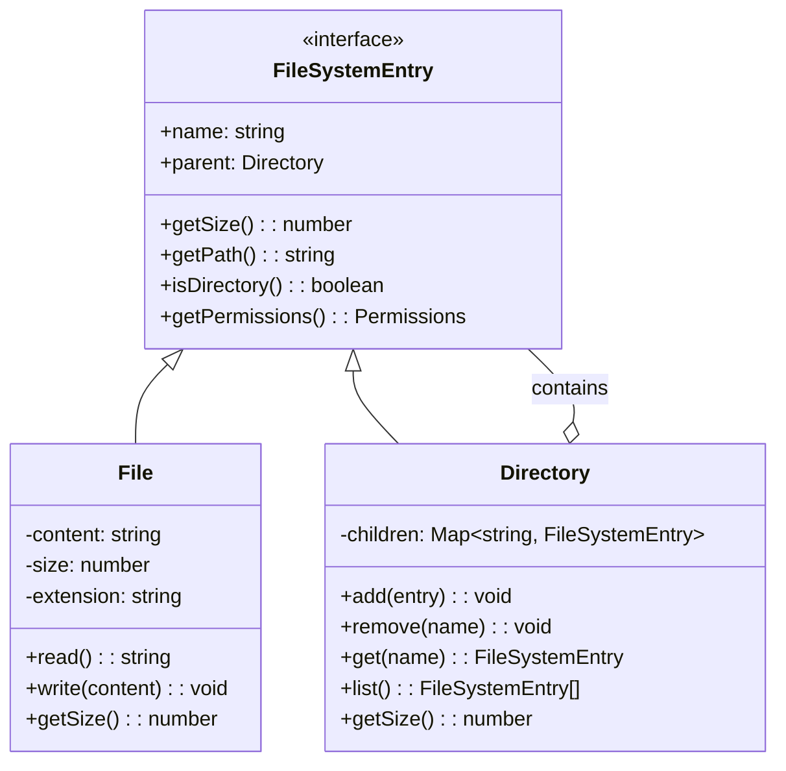

# Design File System (OOP)

The file system design problem is a classic LLD exercise that tests your understanding of the Composite pattern, tree traversal, and clean interface design. Files and directories form a tree structure where directories can contain both files and other directories. The Composite pattern lets you treat individual files and directory hierarchies through a uniform interface.

## Requirements

### Functional Requirements

| # | Requirement | Details |
|---|-------------|---------|
| FR-1 | Create files and directories | Create at any path in the tree |
| FR-2 | Delete files and directories | Recursive delete for directories |
| FR-3 | Move/rename | Move a file/directory to a new path |
| FR-4 | List contents | List immediate children or recursive tree |
| FR-5 | Path resolution | Navigate paths like `/home/user/docs/file.txt` |
| FR-6 | File content | Read and write file contents |
| FR-7 | Search | Find by name, extension, size, or modified date |
| FR-8 | Permissions | Read, write, execute permissions per entry |
| FR-9 | Size calculation | File size directly; directory size = sum of children |

## Composite Pattern

The key design insight is the Composite pattern. Both `File` and `Directory` implement a common `FileSystemEntry` interface. A `Directory` contains a list of `FileSystemEntry` objects — which can be files or other directories. This recursive composition creates the tree structure.



## Implementation

### Types and Permissions

**TypeScript:**

```typescript
enum Permission {
  READ = 1 << 0,    // 1
  WRITE = 1 << 1,   // 2
  EXECUTE = 1 << 2, // 4
}

interface Permissions {
  owner: number;  // bitmask of Permission
  group: number;
  others: number;
}

const DEFAULT_FILE_PERMISSIONS: Permissions = {
  owner: Permission.READ | Permission.WRITE,  // 6 (rw-)
  group: Permission.READ,                     // 4 (r--)
  others: Permission.READ,                    // 4 (r--)
};

const DEFAULT_DIR_PERMISSIONS: Permissions = {
  owner: Permission.READ | Permission.WRITE | Permission.EXECUTE,  // 7 (rwx)
  group: Permission.READ | Permission.EXECUTE,                     // 5 (r-x)
  others: Permission.READ | Permission.EXECUTE,                    // 5 (r-x)
};
```

**Python:**

```python
from enum import IntFlag
from abc import ABC, abstractmethod
from dataclasses import dataclass, field
from datetime import datetime
from typing import Callable
import fnmatch

class Permission(IntFlag):
    READ = 1 << 0     # 1
    WRITE = 1 << 1    # 2
    EXECUTE = 1 << 2  # 4

@dataclass
class Permissions:
    owner: int = Permission.READ | Permission.WRITE           # 6
    group: int = Permission.READ                              # 4
    others: int = Permission.READ                             # 4

DEFAULT_FILE_PERMS = Permissions(
    owner=Permission.READ | Permission.WRITE,
    group=Permission.READ,
    others=Permission.READ
)

DEFAULT_DIR_PERMS = Permissions(
    owner=Permission.READ | Permission.WRITE | Permission.EXECUTE,
    group=Permission.READ | Permission.EXECUTE,
    others=Permission.READ | Permission.EXECUTE
)
```

### FileSystemEntry (Base)

**TypeScript:**

```typescript
abstract class FileSystemEntry {
  public parent: Directory | null = null;
  public createdAt: Date = new Date();
  public modifiedAt: Date = new Date();
  protected permissions: Permissions;

  constructor(
    public name: string,
    permissions?: Permissions
  ) {
    this.permissions = permissions ?? { ...DEFAULT_FILE_PERMISSIONS };
  }

  abstract getSize(): number;
  abstract isDirectory(): boolean;

  getPath(): string {
    const parts: string[] = [];
    let current: FileSystemEntry | null = this;

    while (current !== null) {
      parts.unshift(current.name);
      current = current.parent;
    }

    const path = parts.join("/");
    return path.startsWith("/") ? path : "/" + path;
  }

  getPermissions(): Permissions {
    return { ...this.permissions };
  }

  setPermissions(perms: Permissions): void {
    this.permissions = { ...perms };
    this.modifiedAt = new Date();
  }

  hasPermission(perm: Permission, role: "owner" | "group" | "others" = "owner"): boolean {
    return (this.permissions[role] & perm) !== 0;
  }

  getExtension(): string {
    const lastDot = this.name.lastIndexOf(".");
    return lastDot > 0 ? this.name.substring(lastDot + 1) : "";
  }
}
```

**Python:**

```python
class FileSystemEntry(ABC):
    def __init__(self, name: str, permissions: Permissions | None = None):
        self.name = name
        self.parent: 'Directory | None' = None
        self.created_at = datetime.now()
        self.modified_at = datetime.now()
        self._permissions = permissions or Permissions()

    @abstractmethod
    def get_size(self) -> int: ...

    @abstractmethod
    def is_directory(self) -> bool: ...

    def get_path(self) -> str:
        parts: list[str] = []
        current: FileSystemEntry | None = self

        while current is not None:
            parts.append(current.name)
            current = current.parent

        parts.reverse()
        path = "/".join(parts)
        return path if path.startswith("/") else "/" + path

    def get_permissions(self) -> Permissions:
        return Permissions(
            self._permissions.owner,
            self._permissions.group,
            self._permissions.others
        )

    def set_permissions(self, perms: Permissions) -> None:
        self._permissions = perms
        self.modified_at = datetime.now()

    def has_permission(self, perm: Permission,
                       role: str = "owner") -> bool:
        return bool(getattr(self._permissions, role) & perm)

    def get_extension(self) -> str:
        last_dot = self.name.rfind(".")
        return self.name[last_dot + 1:] if last_dot > 0 else ""
```

### File Class

**TypeScript:**

```typescript
class File extends FileSystemEntry {
  private content: string = "";

  constructor(name: string, content = "", permissions?: Permissions) {
    super(name, permissions ?? { ...DEFAULT_FILE_PERMISSIONS });
    this.content = content;
  }

  isDirectory(): boolean {
    return false;
  }

  getSize(): number {
    return new TextEncoder().encode(this.content).length;
  }

  read(): string {
    if (!this.hasPermission(Permission.READ)) {
      throw new Error(`Permission denied: cannot read ${this.name}`);
    }
    return this.content;
  }

  write(content: string): void {
    if (!this.hasPermission(Permission.WRITE)) {
      throw new Error(`Permission denied: cannot write to ${this.name}`);
    }
    this.content = content;
    this.modifiedAt = new Date();
  }

  append(content: string): void {
    if (!this.hasPermission(Permission.WRITE)) {
      throw new Error(`Permission denied: cannot write to ${this.name}`);
    }
    this.content += content;
    this.modifiedAt = new Date();
  }
}
```

**Python:**

```python
class File(FileSystemEntry):
    def __init__(self, name: str, content: str = "",
                 permissions: Permissions | None = None):
        super().__init__(name, permissions or DEFAULT_FILE_PERMS)
        self._content = content

    def is_directory(self) -> bool:
        return False

    def get_size(self) -> int:
        return len(self._content.encode("utf-8"))

    def read(self) -> str:
        if not self.has_permission(Permission.READ):
            raise PermissionError(f"Cannot read {self.name}")
        return self._content

    def write(self, content: str) -> None:
        if not self.has_permission(Permission.WRITE):
            raise PermissionError(f"Cannot write to {self.name}")
        self._content = content
        self.modified_at = datetime.now()

    def append(self, content: str) -> None:
        if not self.has_permission(Permission.WRITE):
            raise PermissionError(f"Cannot write to {self.name}")
        self._content += content
        self.modified_at = datetime.now()
```

### Directory Class

**TypeScript:**

```typescript
class Directory extends FileSystemEntry {
  private children: Map<string, FileSystemEntry> = new Map();

  constructor(name: string, permissions?: Permissions) {
    super(name, permissions ?? { ...DEFAULT_DIR_PERMISSIONS });
  }

  isDirectory(): boolean {
    return true;
  }

  getSize(): number {
    let total = 0;
    for (const [, child] of this.children) {
      total += child.getSize();
    }
    return total;
  }

  add(entry: FileSystemEntry): void {
    if (!this.hasPermission(Permission.WRITE)) {
      throw new Error(`Permission denied: cannot write to ${this.name}`);
    }
    if (this.children.has(entry.name)) {
      throw new Error(`Entry '${entry.name}' already exists in ${this.getPath()}`);
    }
    entry.parent = this;
    this.children.set(entry.name, entry);
    this.modifiedAt = new Date();
  }

  remove(name: string): FileSystemEntry | null {
    if (!this.hasPermission(Permission.WRITE)) {
      throw new Error(`Permission denied: cannot modify ${this.name}`);
    }
    const entry = this.children.get(name);
    if (!entry) return null;

    entry.parent = null;
    this.children.delete(name);
    this.modifiedAt = new Date();
    return entry;
  }

  get(name: string): FileSystemEntry | null {
    return this.children.get(name) ?? null;
  }

  list(): FileSystemEntry[] {
    if (!this.hasPermission(Permission.READ)) {
      throw new Error(`Permission denied: cannot list ${this.name}`);
    }
    return [...this.children.values()];
  }

  listNames(): string[] {
    return [...this.children.keys()].sort();
  }

  has(name: string): boolean {
    return this.children.has(name);
  }

  get childCount(): number {
    return this.children.size;
  }
}
```

**Python:**

```python
class Directory(FileSystemEntry):
    def __init__(self, name: str, permissions: Permissions | None = None):
        super().__init__(name, permissions or DEFAULT_DIR_PERMS)
        self._children: dict[str, FileSystemEntry] = {}

    def is_directory(self) -> bool:
        return True

    def get_size(self) -> int:
        return sum(child.get_size() for child in self._children.values())

    def add(self, entry: FileSystemEntry) -> None:
        if not self.has_permission(Permission.WRITE):
            raise PermissionError(f"Cannot write to {self.name}")
        if entry.name in self._children:
            raise FileExistsError(f"'{entry.name}' already exists in {self.get_path()}")
        entry.parent = self
        self._children[entry.name] = entry
        self.modified_at = datetime.now()

    def remove(self, name: str) -> FileSystemEntry | None:
        if not self.has_permission(Permission.WRITE):
            raise PermissionError(f"Cannot modify {self.name}")
        entry = self._children.pop(name, None)
        if entry:
            entry.parent = None
            self.modified_at = datetime.now()
        return entry

    def get(self, name: str) -> FileSystemEntry | None:
        return self._children.get(name)

    def list_entries(self) -> list[FileSystemEntry]:
        if not self.has_permission(Permission.READ):
            raise PermissionError(f"Cannot list {self.name}")
        return list(self._children.values())

    def list_names(self) -> list[str]:
        return sorted(self._children.keys())

    def has(self, name: str) -> bool:
        return name in self._children

    @property
    def child_count(self) -> int:
        return len(self._children)
```

### File System (Path Resolution + Search)

**TypeScript:**

```typescript
class FileSystem {
  private root: Directory;

  constructor() {
    this.root = new Directory("/");
  }

  resolve(path: string): FileSystemEntry | null {
    if (path === "/") return this.root;

    const parts = path.split("/").filter((p) => p.length > 0);
    let current: FileSystemEntry = this.root;

    for (const part of parts) {
      if (!current.isDirectory()) return null;
      const dir = current as Directory;
      const next = dir.get(part);
      if (!next) return null;
      current = next;
    }

    return current;
  }

  createFile(path: string, content = ""): File {
    const parts = path.split("/").filter((p) => p.length > 0);
    const fileName = parts.pop()!;
    const parentPath = "/" + parts.join("/");

    const parent = this.ensureDirectory(parentPath);
    const file = new File(fileName, content);
    parent.add(file);
    return file;
  }

  createDirectory(path: string): Directory {
    return this.ensureDirectory(path);
  }

  private ensureDirectory(path: string): Directory {
    if (path === "/" || path === "") return this.root;

    const parts = path.split("/").filter((p) => p.length > 0);
    let current: Directory = this.root;

    for (const part of parts) {
      let next = current.get(part);
      if (!next) {
        const newDir = new Directory(part);
        current.add(newDir);
        next = newDir;
      }
      if (!next.isDirectory()) {
        throw new Error(`${part} is not a directory`);
      }
      current = next as Directory;
    }

    return current;
  }

  delete(path: string): boolean {
    const entry = this.resolve(path);
    if (!entry || entry === this.root) return false;

    const parent = entry.parent;
    if (!parent) return false;

    parent.remove(entry.name);
    return true;
  }

  move(sourcePath: string, destPath: string): boolean {
    const source = this.resolve(sourcePath);
    if (!source || source === this.root) return false;

    const destParent = this.resolve(destPath);
    if (!destParent || !destParent.isDirectory()) return false;

    const parent = source.parent;
    if (!parent) return false;

    parent.remove(source.name);
    (destParent as Directory).add(source);
    return true;
  }

  // Search functionality
  find(
    startPath: string,
    predicate: (entry: FileSystemEntry) => boolean
  ): FileSystemEntry[] {
    const start = this.resolve(startPath);
    if (!start) return [];

    const results: FileSystemEntry[] = [];
    this.findRecursive(start, predicate, results);
    return results;
  }

  private findRecursive(
    entry: FileSystemEntry,
    predicate: (entry: FileSystemEntry) => boolean,
    results: FileSystemEntry[]
  ): void {
    if (predicate(entry)) {
      results.push(entry);
    }

    if (entry.isDirectory()) {
      for (const child of (entry as Directory).list()) {
        this.findRecursive(child, predicate, results);
      }
    }
  }

  // Convenience search methods
  findByName(startPath: string, pattern: string): FileSystemEntry[] {
    return this.find(startPath, (e) => {
      // Simple glob matching: * matches any sequence
      const regex = new RegExp(
        "^" + pattern.replace(/\*/g, ".*").replace(/\?/g, ".") + "$"
      );
      return regex.test(e.name);
    });
  }

  findByExtension(startPath: string, ext: string): FileSystemEntry[] {
    return this.find(startPath, (e) => e.getExtension() === ext);
  }

  findBySize(
    startPath: string,
    minSize: number,
    maxSize: number = Infinity
  ): FileSystemEntry[] {
    return this.find(
      startPath,
      (e) => !e.isDirectory() && e.getSize() >= minSize && e.getSize() <= maxSize
    );
  }

  // Tree visualization
  printTree(path = "/", indent = ""): string {
    const entry = this.resolve(path);
    if (!entry) return "";

    let output = indent + entry.name + (entry.isDirectory() ? "/" : "") + "\n";

    if (entry.isDirectory()) {
      const children = (entry as Directory).list();
      children.sort((a, b) => a.name.localeCompare(b.name));

      for (let i = 0; i < children.length; i++) {
        const isLast = i === children.length - 1;
        const prefix = indent + (isLast ? "  " : "| ");
        const connector = isLast ? "└─ " : "├─ ";
        output += indent + connector;
        output += children[i].name;
        output += children[i].isDirectory() ? "/\n" : ` (${children[i].getSize()}B)\n`;

        if (children[i].isDirectory()) {
          const childPath = children[i].getPath();
          const subTree = this.printTree(childPath, prefix);
          // Only print sub-children
          const lines = subTree.split("\n").slice(1);
          output += lines.join("\n");
        }
      }
    }

    return output;
  }
}
```

**Python:**

```python
class FileSystem:
    def __init__(self):
        self.root = Directory("/")

    def resolve(self, path: str) -> FileSystemEntry | None:
        if path == "/":
            return self.root

        parts = [p for p in path.split("/") if p]
        current: FileSystemEntry = self.root

        for part in parts:
            if not current.is_directory():
                return None
            nxt = current.get(part)
            if not nxt:
                return None
            current = nxt

        return current

    def create_file(self, path: str, content: str = "") -> File:
        parts = [p for p in path.split("/") if p]
        file_name = parts.pop()
        parent_path = "/" + "/".join(parts)

        parent = self._ensure_directory(parent_path)
        f = File(file_name, content)
        parent.add(f)
        return f

    def create_directory(self, path: str) -> Directory:
        return self._ensure_directory(path)

    def _ensure_directory(self, path: str) -> Directory:
        if path in ("/", ""):
            return self.root

        parts = [p for p in path.split("/") if p]
        current = self.root

        for part in parts:
            nxt = current.get(part)
            if not nxt:
                new_dir = Directory(part)
                current.add(new_dir)
                nxt = new_dir
            if not nxt.is_directory():
                raise NotADirectoryError(f"{part} is not a directory")
            current = nxt

        return current

    def delete(self, path: str) -> bool:
        entry = self.resolve(path)
        if not entry or entry is self.root:
            return False
        parent = entry.parent
        if not parent:
            return False
        parent.remove(entry.name)
        return True

    def move(self, source_path: str, dest_path: str) -> bool:
        source = self.resolve(source_path)
        if not source or source is self.root:
            return False
        dest_parent = self.resolve(dest_path)
        if not dest_parent or not dest_parent.is_directory():
            return False
        parent = source.parent
        if not parent:
            return False
        parent.remove(source.name)
        dest_parent.add(source)
        return True

    def find(self, start_path: str,
             predicate: Callable[[FileSystemEntry], bool]) -> list[FileSystemEntry]:
        start = self.resolve(start_path)
        if not start:
            return []
        results: list[FileSystemEntry] = []
        self._find_recursive(start, predicate, results)
        return results

    def _find_recursive(self, entry: FileSystemEntry,
                        predicate: Callable[[FileSystemEntry], bool],
                        results: list[FileSystemEntry]) -> None:
        if predicate(entry):
            results.append(entry)
        if entry.is_directory():
            for child in entry.list_entries():
                self._find_recursive(child, predicate, results)

    def find_by_name(self, start_path: str, pattern: str) -> list[FileSystemEntry]:
        return self.find(start_path, lambda e: fnmatch.fnmatch(e.name, pattern))

    def find_by_extension(self, start_path: str, ext: str) -> list[FileSystemEntry]:
        return self.find(start_path, lambda e: e.get_extension() == ext)

    def find_by_size(self, start_path: str,
                     min_size: int, max_size: int = float('inf')) -> list[FileSystemEntry]:
        return self.find(
            start_path,
            lambda e: not e.is_directory() and min_size <= e.get_size() <= max_size
        )
```

## Usage Example

**TypeScript:**

```typescript
const fs = new FileSystem();

// Create directory structure
fs.createDirectory("/home/user/docs");
fs.createDirectory("/home/user/photos");
fs.createDirectory("/var/log");

// Create files
fs.createFile("/home/user/docs/resume.pdf", "PDF content here...");
fs.createFile("/home/user/docs/notes.txt", "Some notes");
fs.createFile("/home/user/photos/vacation.jpg", "JPEG binary data");
fs.createFile("/var/log/app.log", "2024-01-01 INFO: Started");

// Search
const txtFiles = fs.findByExtension("/home", "txt");
console.log(txtFiles.map((f) => f.getPath()));
// ["/home/user/docs/notes.txt"]

const largeFiles = fs.findBySize("/", 10);
console.log(largeFiles.map((f) => `${f.getPath()} (${f.getSize()}B)`));

// Directory size (recursive)
const homeDir = fs.resolve("/home/user") as Directory;
console.log(`Home size: ${homeDir.getSize()} bytes`);
```

## Tree Visualization

```
/
├─ home/
│  └─ user/
│     ├─ docs/
│     │  ├─ notes.txt (10B)
│     │  └─ resume.pdf (19B)
│     └─ photos/
│        └─ vacation.jpg (16B)
└─ var/
   └─ log/
      └─ app.log (27B)
```

## Design Patterns Used

| Pattern | Where Used | Why |
|---------|-----------|-----|
| **Composite** | File and Directory share FileSystemEntry interface | Uniform treatment of files and directories |
| **Iterator** | Directory.list() and search methods | Traverse tree without exposing internals |
| **Strategy** | Search predicates (find by name, size, extension) | Flexible search criteria without modifying FileSystem |
| **Template Method** | getPath(), getSize() in base vs subclasses | Common path logic, specialized size calculation |

## Complexity Analysis

| Operation | Time | Space |
|-----------|------|-------|
| Resolve path | $O(D)$ where $D$ = path depth | $O(1)$ |
| Create file/dir | $O(D)$ | $O(1)$ |
| Delete | $O(D)$ to find + $O(1)$ to remove | $O(1)$ |
| List directory | $O(C)$ where $C$ = children count | $O(C)$ |
| Get directory size | $O(N)$ where $N$ = total descendants | $O(D)$ recursion |
| Search (find) | $O(N)$ where $N$ = all entries below start | $O(D)$ recursion |

::: warning Common Interview Mistakes
1. **Forgetting the parent reference** — needed for getPath() and move operations
2. **Not handling edge cases** — root deletion, moving to non-directory, circular references
3. **Ignoring permissions** — real file systems enforce permissions at every level
4. **Name collisions** — must check for duplicate names when adding entries
:::

## Extensions to Discuss

- **Symbolic links** (Proxy pattern — link points to another entry)
- **File versioning** (Memento pattern — save and restore states)
- **Observers for file changes** (watch for modifications, like `fs.watch()`)
- **Quota management** (max size per directory or user)
- **Concurrent access** (read/write locks per entry)

## Further Reading

- [LLD Interviews Overview](/lld-interviews/) — SOLID principles and design patterns
- [Trees](/algorithms/trees) — tree traversal algorithms used in recursive search
- [Design Tic-Tac-Toe](/lld-interviews/tic-tac-toe) — another structured OOP design
