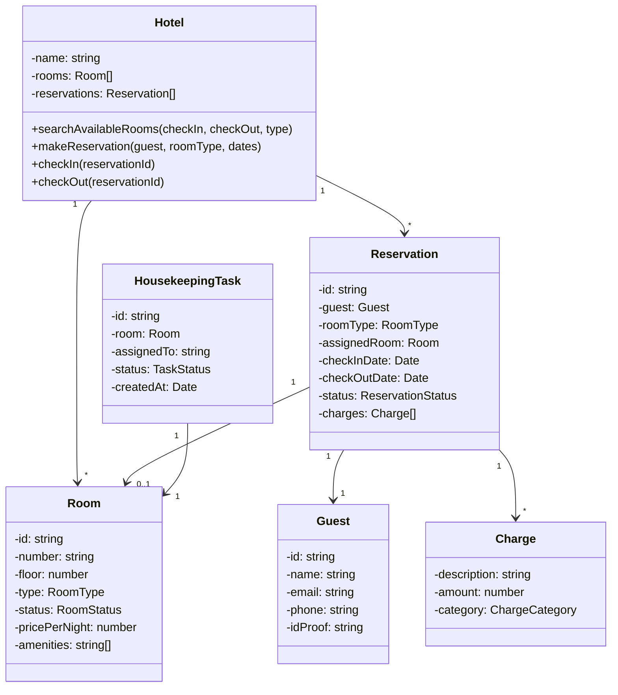
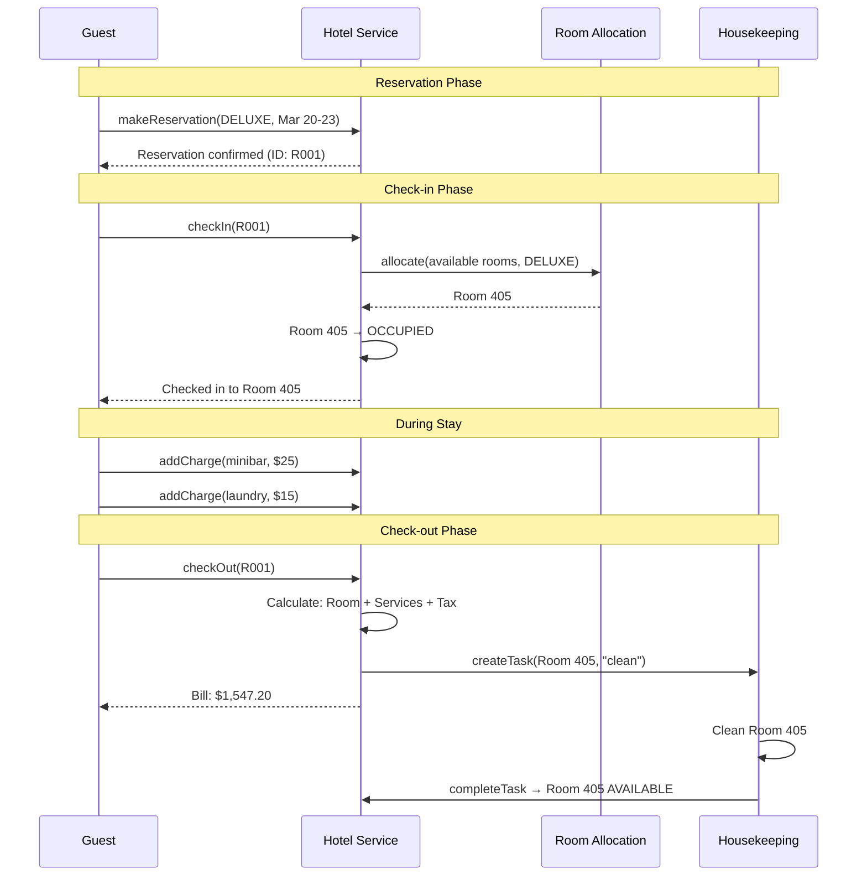

# Design Hotel Management System

A hotel management system orchestrates the full lifecycle of a guest's stay: searching for rooms, making reservations, checking in, room service, housekeeping, checking out, and billing. The interesting LLD challenge here is room allocation — when a guest checks in, which specific room should they get? The "best fit" strategy minimizes waste and keeps premium rooms available for guests who actually booked them.

## Requirements

### Functional Requirements

| # | Requirement | Details |
|---|-------------|---------|
| FR-1 | Room management | Add, remove, update rooms with types and amenities |
| FR-2 | Reservation | Create, modify, cancel reservations |
| FR-3 | Check-in | Assign a specific room from the reserved room type |
| FR-4 | Check-out | Generate bill, mark room for cleaning |
| FR-5 | Housekeeping | Track room cleaning status |
| FR-6 | Guest management | Store guest profiles and history |
| FR-7 | Billing | Calculate charges (room + services + taxes) |
| FR-8 | Search | Find available rooms by date range, type, floor |

### Non-Functional Requirements

- Single hotel (not a chain)
- No double-booking of rooms
- Rooms cannot be assigned until cleaned after previous checkout
- Support for concurrent reservation requests

## Class Diagram



## Implementation

### Enums

**TypeScript:**

```typescript
enum RoomType {
  SINGLE = "SINGLE",
  DOUBLE = "DOUBLE",
  DELUXE = "DELUXE",
  SUITE = "SUITE",
  PRESIDENTIAL = "PRESIDENTIAL",
}

enum RoomStatus {
  AVAILABLE = "AVAILABLE",
  OCCUPIED = "OCCUPIED",
  CLEANING = "CLEANING",
  MAINTENANCE = "MAINTENANCE",
  RESERVED = "RESERVED",
}

enum ReservationStatus {
  CONFIRMED = "CONFIRMED",
  CHECKED_IN = "CHECKED_IN",
  CHECKED_OUT = "CHECKED_OUT",
  CANCELLED = "CANCELLED",
  NO_SHOW = "NO_SHOW",
}

enum ChargeCategory {
  ROOM = "ROOM",
  FOOD = "FOOD",
  LAUNDRY = "LAUNDRY",
  MINIBAR = "MINIBAR",
  SPA = "SPA",
  DAMAGE = "DAMAGE",
  TAX = "TAX",
}

enum TaskStatus {
  PENDING = "PENDING",
  IN_PROGRESS = "IN_PROGRESS",
  COMPLETED = "COMPLETED",
}
```

**Python:**

```python
from enum import Enum
from dataclasses import dataclass, field
from datetime import date, datetime
from abc import ABC, abstractmethod
import uuid

class RoomType(Enum):
    SINGLE = "SINGLE"
    DOUBLE = "DOUBLE"
    DELUXE = "DELUXE"
    SUITE = "SUITE"
    PRESIDENTIAL = "PRESIDENTIAL"

class RoomStatus(Enum):
    AVAILABLE = "AVAILABLE"
    OCCUPIED = "OCCUPIED"
    CLEANING = "CLEANING"
    MAINTENANCE = "MAINTENANCE"
    RESERVED = "RESERVED"

class ReservationStatus(Enum):
    CONFIRMED = "CONFIRMED"
    CHECKED_IN = "CHECKED_IN"
    CHECKED_OUT = "CHECKED_OUT"
    CANCELLED = "CANCELLED"
    NO_SHOW = "NO_SHOW"

class ChargeCategory(Enum):
    ROOM = "ROOM"
    FOOD = "FOOD"
    LAUNDRY = "LAUNDRY"
    MINIBAR = "MINIBAR"
    SPA = "SPA"
    DAMAGE = "DAMAGE"
    TAX = "TAX"

class TaskStatus(Enum):
    PENDING = "PENDING"
    IN_PROGRESS = "IN_PROGRESS"
    COMPLETED = "COMPLETED"
```

### Entity Classes

**TypeScript:**

```typescript
class Room {
  public status: RoomStatus = RoomStatus.AVAILABLE;

  constructor(
    public readonly id: string,
    public readonly number: string,
    public readonly floor: number,
    public readonly type: RoomType,
    public readonly pricePerNight: number,
    public readonly amenities: string[] = []
  ) {}
}

class Guest {
  constructor(
    public readonly id: string,
    public readonly name: string,
    public readonly email: string,
    public readonly phone: string,
    public readonly idProof: string
  ) {}
}

class Charge {
  constructor(
    public readonly description: string,
    public readonly amount: number,
    public readonly category: ChargeCategory,
    public readonly timestamp: Date = new Date()
  ) {}
}

class Reservation {
  public assignedRoom: Room | null = null;
  public status: ReservationStatus = ReservationStatus.CONFIRMED;
  public charges: Charge[] = [];
  public readonly createdAt = new Date();

  constructor(
    public readonly id: string,
    public readonly guest: Guest,
    public readonly roomType: RoomType,
    public readonly checkInDate: Date,
    public readonly checkOutDate: Date
  ) {}

  get nights(): number {
    const diff = this.checkOutDate.getTime() - this.checkInDate.getTime();
    return Math.ceil(diff / (1000 * 60 * 60 * 24));
  }

  addCharge(charge: Charge): void {
    this.charges.push(charge);
  }

  getTotalCharges(): number {
    return this.charges.reduce((sum, c) => sum + c.amount, 0);
  }
}
```

**Python:**

```python
@dataclass
class Room:
    id: str
    number: str
    floor: int
    type: RoomType
    price_per_night: float
    amenities: list[str] = field(default_factory=list)
    status: RoomStatus = RoomStatus.AVAILABLE

@dataclass
class Guest:
    id: str
    name: str
    email: str
    phone: str
    id_proof: str

@dataclass
class Charge:
    description: str
    amount: float
    category: ChargeCategory
    timestamp: datetime = field(default_factory=datetime.now)

@dataclass
class Reservation:
    id: str
    guest: Guest
    room_type: RoomType
    check_in_date: date
    check_out_date: date
    assigned_room: Room | None = None
    status: ReservationStatus = ReservationStatus.CONFIRMED
    charges: list[Charge] = field(default_factory=list)

    @property
    def nights(self) -> int:
        return (self.check_out_date - self.check_in_date).days

    def add_charge(self, charge: Charge) -> None:
        self.charges.append(charge)

    def total_charges(self) -> float:
        return sum(c.amount for c in self.charges)
```

### Room Allocation Strategy

The Strategy pattern allows different room assignment algorithms. The "best fit" strategy assigns the cheapest available room of the requested type, preserving premium rooms for higher-paying guests.

**TypeScript:**

```typescript
interface RoomAllocationStrategy {
  allocate(
    availableRooms: Room[],
    roomType: RoomType
  ): Room | null;
}

class BestFitAllocation implements RoomAllocationStrategy {
  allocate(availableRooms: Room[], roomType: RoomType): Room | null {
    const candidates = availableRooms
      .filter((r) => r.type === roomType && r.status === RoomStatus.AVAILABLE)
      .sort((a, b) => a.pricePerNight - b.pricePerNight); // cheapest first

    return candidates[0] ?? null;
  }
}

class LowestFloorAllocation implements RoomAllocationStrategy {
  allocate(availableRooms: Room[], roomType: RoomType): Room | null {
    const candidates = availableRooms
      .filter((r) => r.type === roomType && r.status === RoomStatus.AVAILABLE)
      .sort((a, b) => a.floor - b.floor); // lowest floor first

    return candidates[0] ?? null;
  }
}

class HighestFloorAllocation implements RoomAllocationStrategy {
  allocate(availableRooms: Room[], roomType: RoomType): Room | null {
    const candidates = availableRooms
      .filter((r) => r.type === roomType && r.status === RoomStatus.AVAILABLE)
      .sort((a, b) => b.floor - a.floor); // highest floor first

    return candidates[0] ?? null;
  }
}
```

**Python:**

```python
class RoomAllocationStrategy(ABC):
    @abstractmethod
    def allocate(self, available_rooms: list[Room],
                 room_type: RoomType) -> Room | None: ...

class BestFitAllocation(RoomAllocationStrategy):
    def allocate(self, available_rooms: list[Room],
                 room_type: RoomType) -> Room | None:
        candidates = sorted(
            [r for r in available_rooms
             if r.type == room_type and r.status == RoomStatus.AVAILABLE],
            key=lambda r: r.price_per_night
        )
        return candidates[0] if candidates else None

class LowestFloorAllocation(RoomAllocationStrategy):
    def allocate(self, available_rooms: list[Room],
                 room_type: RoomType) -> Room | None:
        candidates = sorted(
            [r for r in available_rooms
             if r.type == room_type and r.status == RoomStatus.AVAILABLE],
            key=lambda r: r.floor
        )
        return candidates[0] if candidates else None

class HighestFloorAllocation(RoomAllocationStrategy):
    def allocate(self, available_rooms: list[Room],
                 room_type: RoomType) -> Room | None:
        candidates = sorted(
            [r for r in available_rooms
             if r.type == room_type and r.status == RoomStatus.AVAILABLE],
            key=lambda r: -r.floor
        )
        return candidates[0] if candidates else None
```

### Housekeeping Management

**TypeScript:**

```typescript
class HousekeepingTask {
  public status: TaskStatus = TaskStatus.PENDING;

  constructor(
    public readonly id: string,
    public readonly room: Room,
    public assignedTo: string,
    public readonly createdAt: Date = new Date()
  ) {}
}

class HousekeepingService {
  private tasks: Map<string, HousekeepingTask> = new Map();

  createTask(room: Room, assignedTo: string): HousekeepingTask {
    room.status = RoomStatus.CLEANING;
    const task = new HousekeepingTask(
      crypto.randomUUID(),
      room,
      assignedTo
    );
    this.tasks.set(task.id, task);
    return task;
  }

  completeTask(taskId: string): boolean {
    const task = this.tasks.get(taskId);
    if (!task || task.status === TaskStatus.COMPLETED) return false;

    task.status = TaskStatus.COMPLETED;
    task.room.status = RoomStatus.AVAILABLE;
    return true;
  }

  getPendingTasks(): HousekeepingTask[] {
    return [...this.tasks.values()].filter(
      (t) => t.status !== TaskStatus.COMPLETED
    );
  }
}
```

**Python:**

```python
@dataclass
class HousekeepingTask:
    id: str
    room: Room
    assigned_to: str
    status: TaskStatus = TaskStatus.PENDING
    created_at: datetime = field(default_factory=datetime.now)

class HousekeepingService:
    def __init__(self):
        self._tasks: dict[str, HousekeepingTask] = {}

    def create_task(self, room: Room, assigned_to: str) -> HousekeepingTask:
        room.status = RoomStatus.CLEANING
        task = HousekeepingTask(
            id=str(uuid.uuid4()),
            room=room,
            assigned_to=assigned_to
        )
        self._tasks[task.id] = task
        return task

    def complete_task(self, task_id: str) -> bool:
        task = self._tasks.get(task_id)
        if not task or task.status == TaskStatus.COMPLETED:
            return False

        task.status = TaskStatus.COMPLETED
        task.room.status = RoomStatus.AVAILABLE
        return True

    def get_pending_tasks(self) -> list[HousekeepingTask]:
        return [t for t in self._tasks.values() if t.status != TaskStatus.COMPLETED]
```

### Hotel Service (Orchestrator)

**TypeScript:**

```typescript
class HotelService {
  private rooms: Room[] = [];
  private reservations: Map<string, Reservation> = new Map();
  private allocationStrategy: RoomAllocationStrategy;
  private housekeeping: HousekeepingService;
  private taxRate: number;

  constructor(
    allocationStrategy: RoomAllocationStrategy = new BestFitAllocation(),
    taxRate = 0.18
  ) {
    this.allocationStrategy = allocationStrategy;
    this.housekeeping = new HousekeepingService();
    this.taxRate = taxRate;
  }

  addRoom(room: Room): void {
    this.rooms.push(room);
  }

  searchAvailableRooms(
    checkIn: Date,
    checkOut: Date,
    roomType?: RoomType
  ): Room[] {
    const occupiedRoomIds = new Set<string>();

    for (const [, res] of this.reservations) {
      if (
        res.status === ReservationStatus.CONFIRMED ||
        res.status === ReservationStatus.CHECKED_IN
      ) {
        if (res.checkInDate < checkOut && res.checkOutDate > checkIn) {
          if (res.assignedRoom) {
            occupiedRoomIds.add(res.assignedRoom.id);
          }
        }
      }
    }

    return this.rooms.filter((r) => {
      if (occupiedRoomIds.has(r.id)) return false;
      if (r.status === RoomStatus.MAINTENANCE) return false;
      if (roomType && r.type !== roomType) return false;
      return true;
    });
  }

  makeReservation(
    guest: Guest,
    roomType: RoomType,
    checkIn: Date,
    checkOut: Date
  ): Reservation | null {
    const available = this.searchAvailableRooms(checkIn, checkOut, roomType);

    if (available.length === 0) return null;

    const reservation = new Reservation(
      crypto.randomUUID(),
      guest,
      roomType,
      checkIn,
      checkOut
    );

    this.reservations.set(reservation.id, reservation);
    return reservation;
  }

  checkIn(reservationId: string): Room | null {
    const reservation = this.reservations.get(reservationId);
    if (!reservation || reservation.status !== ReservationStatus.CONFIRMED) {
      return null;
    }

    const room = this.allocationStrategy.allocate(
      this.rooms,
      reservation.roomType
    );

    if (!room) return null;

    room.status = RoomStatus.OCCUPIED;
    reservation.assignedRoom = room;
    reservation.status = ReservationStatus.CHECKED_IN;

    // Add room charges
    const roomCharge = new Charge(
      `Room ${room.number} (${reservation.nights} nights)`,
      room.pricePerNight * reservation.nights,
      ChargeCategory.ROOM
    );
    reservation.addCharge(roomCharge);

    return room;
  }

  checkOut(reservationId: string): { total: number; charges: Charge[] } | null {
    const reservation = this.reservations.get(reservationId);
    if (!reservation || reservation.status !== ReservationStatus.CHECKED_IN) {
      return null;
    }

    // Add tax
    const subtotal = reservation.getTotalCharges();
    const tax = new Charge(
      `Tax (${this.taxRate * 100}%)`,
      subtotal * this.taxRate,
      ChargeCategory.TAX
    );
    reservation.addCharge(tax);

    // Update statuses
    reservation.status = ReservationStatus.CHECKED_OUT;
    const room = reservation.assignedRoom!;

    // Create housekeeping task
    this.housekeeping.createTask(room, "auto-assigned");

    return {
      total: reservation.getTotalCharges(),
      charges: reservation.charges,
    };
  }

  cancelReservation(reservationId: string): boolean {
    const reservation = this.reservations.get(reservationId);
    if (!reservation || reservation.status !== ReservationStatus.CONFIRMED) {
      return false;
    }

    reservation.status = ReservationStatus.CANCELLED;
    if (reservation.assignedRoom) {
      reservation.assignedRoom.status = RoomStatus.AVAILABLE;
    }
    return true;
  }
}
```

**Python:**

```python
class HotelService:
    def __init__(self, allocation_strategy: RoomAllocationStrategy | None = None,
                 tax_rate: float = 0.18):
        self.rooms: list[Room] = []
        self._reservations: dict[str, Reservation] = {}
        self._strategy = allocation_strategy or BestFitAllocation()
        self._housekeeping = HousekeepingService()
        self._tax_rate = tax_rate

    def add_room(self, room: Room) -> None:
        self.rooms.append(room)

    def search_available_rooms(self, check_in: date, check_out: date,
                               room_type: RoomType | None = None) -> list[Room]:
        occupied_ids: set[str] = set()

        for res in self._reservations.values():
            if res.status in (ReservationStatus.CONFIRMED, ReservationStatus.CHECKED_IN):
                if res.check_in_date < check_out and res.check_out_date > check_in:
                    if res.assigned_room:
                        occupied_ids.add(res.assigned_room.id)

        return [
            r for r in self.rooms
            if r.id not in occupied_ids
            and r.status != RoomStatus.MAINTENANCE
            and (room_type is None or r.type == room_type)
        ]

    def make_reservation(self, guest: Guest, room_type: RoomType,
                         check_in: date, check_out: date) -> Reservation | None:
        available = self.search_available_rooms(check_in, check_out, room_type)
        if not available:
            return None

        reservation = Reservation(
            id=str(uuid.uuid4()), guest=guest, room_type=room_type,
            check_in_date=check_in, check_out_date=check_out
        )
        self._reservations[reservation.id] = reservation
        return reservation

    def check_in(self, reservation_id: str) -> Room | None:
        res = self._reservations.get(reservation_id)
        if not res or res.status != ReservationStatus.CONFIRMED:
            return None

        room = self._strategy.allocate(self.rooms, res.room_type)
        if not room:
            return None

        room.status = RoomStatus.OCCUPIED
        res.assigned_room = room
        res.status = ReservationStatus.CHECKED_IN

        res.add_charge(Charge(
            description=f"Room {room.number} ({res.nights} nights)",
            amount=room.price_per_night * res.nights,
            category=ChargeCategory.ROOM
        ))
        return room

    def check_out(self, reservation_id: str) -> dict | None:
        res = self._reservations.get(reservation_id)
        if not res or res.status != ReservationStatus.CHECKED_IN:
            return None

        subtotal = res.total_charges()
        res.add_charge(Charge(
            description=f"Tax ({self._tax_rate * 100}%)",
            amount=subtotal * self._tax_rate,
            category=ChargeCategory.TAX
        ))

        res.status = ReservationStatus.CHECKED_OUT
        self._housekeeping.create_task(res.assigned_room, "auto-assigned")

        return {"total": res.total_charges(), "charges": res.charges}

    def cancel_reservation(self, reservation_id: str) -> bool:
        res = self._reservations.get(reservation_id)
        if not res or res.status != ReservationStatus.CONFIRMED:
            return False

        res.status = ReservationStatus.CANCELLED
        if res.assigned_room:
            res.assigned_room.status = RoomStatus.AVAILABLE
        return True
```

## Check-in / Check-out Flow



## Billing Breakdown

$$
\text{Total} = \underbrace{P_r \times N}_{\text{Room}} + \underbrace{\sum C_i}_{\text{Services}} + \underbrace{(P_r \times N + \sum C_i) \times t}_{\text{Tax}}
$$

where $P_r$ = price per night, $N$ = number of nights, $C_i$ = additional charges, $t$ = tax rate.

**Example:**
- Deluxe room: $500/night \times 3$ nights = $1,500
- Minibar: $25
- Laundry: $15
- Subtotal: $1,540
- Tax (18%): $277.20
- **Total: $1,817.20**

## Design Patterns Used

| Pattern | Where Used | Why |
|---------|-----------|-----|
| **Strategy** | Room allocation (BestFit, LowestFloor, etc.) | Swap algorithms without modifying Hotel |
| **Observer** | Reservation status changes | Notify guest via email/SMS |
| **Repository** | Reservation storage | Abstract persistence |
| **Factory** | Room creation | Different room types with standard amenities |

::: tip
In interviews, discuss how the room allocation strategy could be swapped at runtime — for example, using LowestFloorAllocation for elderly guests and HighestFloorAllocation for guests requesting a view. This demonstrates understanding of the Strategy pattern and its practical value.
:::

## Further Reading

- [LLD Interviews Overview](/lld-interviews/) — SOLID principles and patterns
- [Design Movie Ticket Booking](/lld-interviews/movie-booking) — similar booking patterns with seat locking
- [Design ATM Machine](/lld-interviews/atm-machine) — state machine for sequential flows
