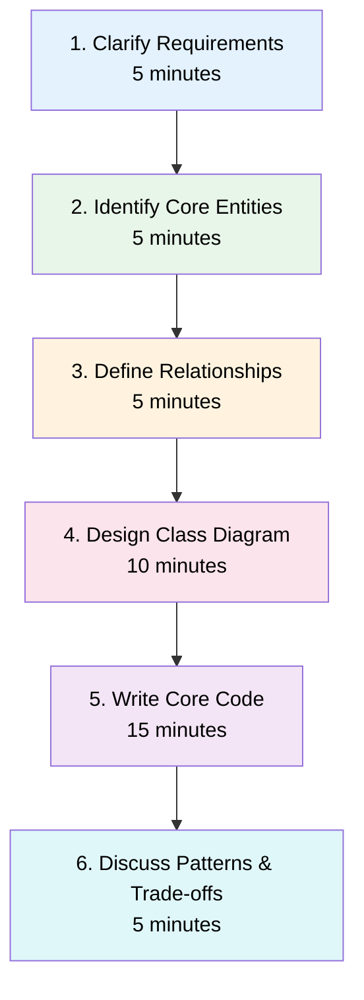

# Low-Level Design Interviews

Low-Level Design (LLD) interviews test your ability to design the internal structure of a system — classes, interfaces, relationships, and interactions. Unlike system design (HLD) which focuses on distributed architecture, LLD zooms into a single service or module and asks: **how would you actually code this?**

## What Interviewers Evaluate

| Dimension | What They Look For |
|-----------|-------------------|
| **OOP Modeling** | Correct identification of entities, attributes, and relationships |
| **SOLID Principles** | Clean separation of concerns, extensibility without modification |
| **Design Patterns** | Appropriate (not forced) use of patterns to solve real problems |
| **API Design** | Clean public interfaces that hide implementation details |
| **Edge Cases** | Concurrency, error handling, validation, boundary conditions |
| **Extensibility** | Can the design accommodate new requirements without rewrites? |
| **Trade-offs** | Awareness of alternatives and why you chose your approach |

## The SOLID Principles

### Single Responsibility Principle (SRP)

A class should have only one reason to change. If a class handles both user authentication and email sending, it has two reasons to change and should be split.

```typescript
// Bad: Two responsibilities
class UserService {
  authenticate(email: string, password: string): boolean { /* ... */ }
  sendWelcomeEmail(user: User): void { /* ... */ }
}

// Good: Separated
class AuthenticationService {
  authenticate(email: string, password: string): boolean { /* ... */ }
}

class EmailService {
  sendWelcomeEmail(user: User): void { /* ... */ }
}
```

### Open/Closed Principle (OCP)

Software entities should be open for extension but closed for modification. Use abstractions (interfaces, abstract classes) so new behavior can be added without changing existing code.

```typescript
// Bad: Must modify this function for every new shape
function calculateArea(shape: { type: string; width?: number; radius?: number }) {
  if (shape.type === 'circle') return Math.PI * shape.radius! ** 2;
  if (shape.type === 'square') return shape.width! ** 2;
  // Adding a triangle means modifying this function
}

// Good: Extend by adding new classes
interface Shape {
  area(): number;
}

class Circle implements Shape {
  constructor(private radius: number) {}
  area(): number { return Math.PI * this.radius ** 2; }
}

class Square implements Shape {
  constructor(private side: number) {}
  area(): number { return this.side ** 2; }
}

// Adding Triangle doesn't touch existing code
class Triangle implements Shape {
  constructor(private base: number, private height: number) {}
  area(): number { return 0.5 * this.base * this.height; }
}
```

### Liskov Substitution Principle (LSP)

Subtypes must be substitutable for their base types without altering the correctness of the program.

```typescript
// Bad: Square breaks Rectangle's contract
class Rectangle {
  constructor(protected width: number, protected height: number) {}
  setWidth(w: number) { this.width = w; }
  setHeight(h: number) { this.height = h; }
  area(): number { return this.width * this.height; }
}

class Square extends Rectangle {
  setWidth(w: number) { this.width = w; this.height = w; }  // violates LSP
  setHeight(h: number) { this.width = h; this.height = h; } // violates LSP
}

// Good: Use a common interface instead
interface Shape {
  area(): number;
}
```

### Interface Segregation Principle (ISP)

No client should be forced to depend on methods it does not use. Prefer small, focused interfaces over large monolithic ones.

```typescript
// Bad: Forces all workers to implement eat()
interface Worker {
  work(): void;
  eat(): void;
}

// Good: Split into focused interfaces
interface Workable {
  work(): void;
}

interface Feedable {
  eat(): void;
}

class HumanWorker implements Workable, Feedable {
  work(): void { /* ... */ }
  eat(): void { /* ... */ }
}

class RobotWorker implements Workable {
  work(): void { /* ... */ }
  // No need to implement eat()
}
```

### Dependency Inversion Principle (DIP)

High-level modules should not depend on low-level modules. Both should depend on abstractions.

```typescript
// Bad: High-level depends on low-level
class OrderService {
  private db = new MySQLDatabase(); // tightly coupled
  save(order: Order) { this.db.insert('orders', order); }
}

// Good: Depend on abstraction
interface OrderRepository {
  save(order: Order): void;
}

class OrderService {
  constructor(private repo: OrderRepository) {} // injected
  save(order: Order) { this.repo.save(order); }
}

class MySQLOrderRepository implements OrderRepository {
  save(order: Order): void { /* MySQL implementation */ }
}

class MongoOrderRepository implements OrderRepository {
  save(order: Order): void { /* Mongo implementation */ }
}
```

## Essential Design Patterns for LLD

### Creational Patterns

| Pattern | When to Use | LLD Problems |
|---------|-------------|-------------|
| **Factory Method** | Create objects without specifying exact class | Vehicle creation in Parking Lot |
| **Abstract Factory** | Families of related objects | UI theme components |
| **Singleton** | Exactly one instance globally | Game board, configuration |
| **Builder** | Complex objects with many optional parameters | Query builders, meal combos |

### Structural Patterns

| Pattern | When to Use | LLD Problems |
|---------|-------------|-------------|
| **Strategy** | Swap algorithms at runtime | Elevator scheduling, payment methods |
| **Observer** | Notify multiple objects of state changes | Auction bids, stock prices |
| **State** | Object behavior changes based on internal state | Vending machine, order lifecycle |
| **Decorator** | Add behavior dynamically without subclassing | Toppings on pizza, notification channels |
| **Composite** | Tree structures with uniform interface | File system, organization hierarchy |

### Behavioral Patterns

| Pattern | When to Use | LLD Problems |
|---------|-------------|-------------|
| **Command** | Encapsulate requests as objects | Undo/redo, task queues |
| **Iterator** | Sequential access without exposing internals | Collection traversal |
| **Chain of Responsibility** | Pass requests along a chain of handlers | Middleware, approval workflows |
| **Template Method** | Define algorithm skeleton, defer steps to subclasses | Game loops, document parsers |

## How to Approach an LLD Interview



### Step 1: Clarify Requirements (5 min)

Ask questions to narrow scope. Interviewers intentionally leave problems vague.

- What are the core use cases?
- What scale are we designing for? (usually single-machine for LLD)
- Any specific constraints? (concurrency, real-time updates)
- Should I handle persistence or just in-memory?

### Step 2: Identify Core Entities (5 min)

List the nouns in the problem statement. These become your classes.

::: tip
Write entities on the whiteboard/doc as you identify them. Group related ones together. This becomes the skeleton of your class diagram.
:::

### Step 3: Define Relationships (5 min)

For each pair of entities, determine:
- **Has-a** (composition): A `ParkingLot` *has* `Floor`s
- **Uses-a** (dependency): `PaymentService` *uses* `PaymentGateway`
- **Is-a** (inheritance): `Car` *is a* `Vehicle` (use sparingly)
- **Cardinality**: One-to-one, one-to-many, many-to-many

### Step 4: Design Class Diagram (10 min)

Draw a UML class diagram showing:
- Classes with key attributes and methods
- Interfaces and abstract classes
- Relationships with cardinality
- Design patterns you'll use

### Step 5: Write Core Code (15 min)

Implement the most critical classes. Focus on:
- Clean interfaces and method signatures
- Core business logic (not boilerplate)
- One design pattern demonstrated well

### Step 6: Discuss Patterns and Trade-offs (5 min)

Explain why you chose specific patterns and what alternatives exist.

## Common Mistakes

::: warning Mistakes That Fail Candidates
1. **Jumping to code** without clarifying requirements or drawing a diagram
2. **Over-engineering** with patterns that add complexity without value
3. **God classes** that do everything (violates SRP)
4. **Ignoring concurrency** when the problem clearly involves shared state
5. **No interfaces** — concrete classes everywhere make testing impossible
6. **Premature optimization** instead of clean, correct design first
:::

## LLD Problems in This Section

| Problem | Key Concepts | Difficulty |
|---------|-------------|-----------|
| [Parking Lot](/lld-interviews/parking-lot) | Factory, Strategy, composition | Intermediate |
| [Elevator System](/lld-interviews/elevator-system) | Strategy, State, scheduling algorithms | Intermediate |
| [Chess](/lld-interviews/chess) | State machine, polymorphism, validation | Intermediate |
| [Library Management](/lld-interviews/library-management) | CRUD, Observer, fine calculation | Intermediate |
| [Snake & Ladders](/lld-interviews/snake-ladders) | Game loop, state machine, randomness | Intermediate |
| [Vending Machine](/lld-interviews/vending-machine) | State pattern, transitions, inventory | Intermediate |
| [ATM Machine](/lld-interviews/atm-machine) | State machine, transactions, cash dispensing | Intermediate |
| [Movie Ticket Booking](/lld-interviews/movie-booking) | Seat locking, concurrency, pricing strategy | Intermediate |
| [Hotel Management](/lld-interviews/hotel-management) | Room allocation, booking lifecycle, housekeeping | Intermediate |
| [File System](/lld-interviews/file-system) | Composite pattern, tree traversal, permissions | Intermediate |
| [Tic-Tac-Toe](/lld-interviews/tic-tac-toe) | Game loop, O(1) win detection, minimax AI | Intermediate |

## Recommended Study Order

1. Start with **Vending Machine** — cleanest State pattern example
2. Then **Parking Lot** — most commonly asked, good OOP exercise
3. Then **ATM Machine** — State pattern with transaction flows
4. Then **Tic-Tac-Toe** — game loop, strategy pattern, minimax
5. Then **Library Management** — introduces Observer and fine calculation
6. Then **Movie Ticket Booking** — concurrency and seat locking
7. Then **Hotel Management** — booking lifecycle and allocation strategies
8. Then **File System** — Composite pattern and recursive structures
9. Then **Snake & Ladders** — game loop and multi-player state
10. Then **Chess** — complex validation, polymorphism
11. Finally **Elevator System** — scheduling algorithms, most complex

## Further Reading

- [Architecture Patterns](/architecture-patterns/) — DDD, hexagonal, CQRS
- [Design Patterns](/architecture-patterns/design-patterns/) — GoF patterns in depth
- [System Design Interviews](/system-design-interviews/) — HLD counterpart
