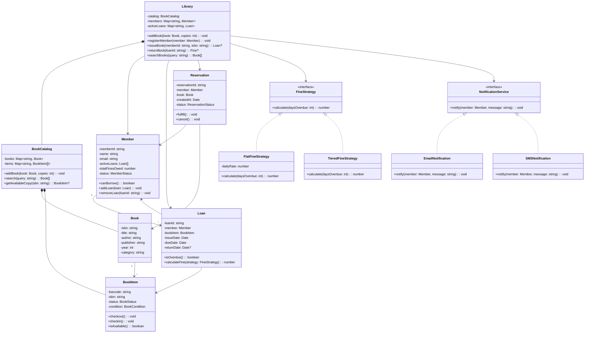

# Design a Library Management System

The library management problem tests CRUD modeling, state transitions (book lifecycle), and business rule enforcement (borrowing limits, fine calculation). It is a practical, relatable problem that interviewers use to assess clean domain modeling.

## Requirements & Use Cases

### Functional Requirements

1. Manage books: add, remove, search by title/author/ISBN
2. Manage members: register, update, deactivate
3. Lending: members borrow books, return books
4. Each book can have multiple copies (physical items)
5. Borrowing limits: max 5 books per member
6. Lending period: 14 days, with fines for late returns
7. Reservation: member can reserve a book if all copies are lent out
8. Notifications: notify member when reserved book becomes available

### Non-Functional Requirements

- Search should be fast (indexed by title, author, ISBN)
- Support concurrent checkouts (two librarians at two desks)
- Fine calculation must be deterministic and auditable

### Use Cases

| Actor | Use Case |
|-------|---------|
| Librarian | Add / remove books from catalog |
| Librarian | Issue a book to a member |
| Librarian | Process a book return |
| Member | Search for a book |
| Member | Reserve a book |
| Member | Pay fines |
| System | Calculate overdue fines |
| System | Notify member when reservation is ready |

## Class Diagram



## Core Classes & Interfaces

### TypeScript Implementation

```typescript
// ─── Enums ───────────────────────────────────────────────

enum BookStatus {
  AVAILABLE = 'AVAILABLE',
  CHECKED_OUT = 'CHECKED_OUT',
  RESERVED = 'RESERVED',
  LOST = 'LOST',
  DAMAGED = 'DAMAGED',
}

enum BookCondition {
  NEW = 'NEW',
  GOOD = 'GOOD',
  FAIR = 'FAIR',
  POOR = 'POOR',
}

enum MemberStatus {
  ACTIVE = 'ACTIVE',
  SUSPENDED = 'SUSPENDED',
  CLOSED = 'CLOSED',
}

enum ReservationStatus {
  PENDING = 'PENDING',
  READY = 'READY',
  FULFILLED = 'FULFILLED',
  CANCELLED = 'CANCELLED',
}

// ─── Constants ───────────────────────────────────────────

const MAX_BOOKS_PER_MEMBER = 5;
const LOAN_PERIOD_DAYS = 14;
const MAX_FINE_BEFORE_SUSPENSION = 50; // dollars

// ─── Book & BookItem ─────────────────────────────────────

class Book {
  constructor(
    public readonly isbn: string,
    public readonly title: string,
    public readonly author: string,
    public readonly publisher: string,
    public readonly year: number,
    public readonly category: string
  ) {}
}

class BookItem {
  private status: BookStatus = BookStatus.AVAILABLE;

  constructor(
    public readonly barcode: string,
    public readonly isbn: string,
    public readonly condition: BookCondition = BookCondition.NEW
  ) {}

  isAvailable(): boolean {
    return this.status === BookStatus.AVAILABLE;
  }

  getStatus(): BookStatus {
    return this.status;
  }

  checkout(): void {
    if (!this.isAvailable()) {
      throw new Error(`Book item ${this.barcode} is not available`);
    }
    this.status = BookStatus.CHECKED_OUT;
  }

  checkin(): void {
    this.status = BookStatus.AVAILABLE;
  }

  markLost(): void {
    this.status = BookStatus.LOST;
  }

  markDamaged(): void {
    this.status = BookStatus.DAMAGED;
  }
}

// ─── Member ──────────────────────────────────────────────

class Member {
  private activeLoans: Map<string, Loan> = new Map();
  private totalFinesOwed: number = 0;
  private status: MemberStatus = MemberStatus.ACTIVE;

  constructor(
    public readonly memberId: string,
    public name: string,
    public email: string
  ) {}

  canBorrow(): boolean {
    return (
      this.status === MemberStatus.ACTIVE &&
      this.activeLoans.size < MAX_BOOKS_PER_MEMBER &&
      this.totalFinesOwed < MAX_FINE_BEFORE_SUSPENSION
    );
  }

  addLoan(loan: Loan): void {
    this.activeLoans.set(loan.loanId, loan);
  }

  removeLoan(loanId: string): void {
    this.activeLoans.delete(loanId);
  }

  getActiveLoans(): Loan[] {
    return Array.from(this.activeLoans.values());
  }

  addFine(amount: number): void {
    this.totalFinesOwed += amount;
    if (this.totalFinesOwed >= MAX_FINE_BEFORE_SUSPENSION) {
      this.status = MemberStatus.SUSPENDED;
    }
  }

  payFine(amount: number): void {
    this.totalFinesOwed = Math.max(0, this.totalFinesOwed - amount);
    if (
      this.totalFinesOwed < MAX_FINE_BEFORE_SUSPENSION &&
      this.status === MemberStatus.SUSPENDED
    ) {
      this.status = MemberStatus.ACTIVE;
    }
  }

  getTotalFines(): number {
    return this.totalFinesOwed;
  }

  getStatus(): MemberStatus {
    return this.status;
  }
}

// ─── Loan ────────────────────────────────────────────────

class Loan {
  public returnDate: Date | null = null;

  constructor(
    public readonly loanId: string,
    public readonly member: Member,
    public readonly bookItem: BookItem,
    public readonly issueDate: Date = new Date(),
    public readonly dueDate: Date = new Date(
      Date.now() + LOAN_PERIOD_DAYS * 24 * 60 * 60 * 1000
    )
  ) {}

  isOverdue(): boolean {
    const compareDate = this.returnDate ?? new Date();
    return compareDate > this.dueDate;
  }

  getDaysOverdue(): number {
    if (!this.isOverdue()) return 0;
    const compareDate = this.returnDate ?? new Date();
    const diff = compareDate.getTime() - this.dueDate.getTime();
    return Math.ceil(diff / (1000 * 60 * 60 * 24));
  }

  calculateFine(strategy: FineStrategy): number {
    return strategy.calculate(this.getDaysOverdue());
  }
}

// ─── Fine Strategy (Strategy Pattern) ────────────────────

interface FineStrategy {
  calculate(daysOverdue: number): number;
}

class FlatFineStrategy implements FineStrategy {
  constructor(private dailyRate: number = 1.0) {}

  calculate(daysOverdue: number): number {
    return Math.max(0, daysOverdue * this.dailyRate);
  }
}

/**
 * Days 1-7:   $1/day
 * Days 8-14:  $2/day
 * Days 15+:   $5/day
 */
class TieredFineStrategy implements FineStrategy {
  calculate(daysOverdue: number): number {
    if (daysOverdue <= 0) return 0;

    let fine = 0;
    const tier1 = Math.min(daysOverdue, 7);
    fine += tier1 * 1;

    if (daysOverdue > 7) {
      const tier2 = Math.min(daysOverdue - 7, 7);
      fine += tier2 * 2;
    }

    if (daysOverdue > 14) {
      const tier3 = daysOverdue - 14;
      fine += tier3 * 5;
    }

    return fine;
  }
}

// ─── Reservation ─────────────────────────────────────────

class Reservation {
  private status: ReservationStatus = ReservationStatus.PENDING;

  constructor(
    public readonly reservationId: string,
    public readonly member: Member,
    public readonly book: Book,
    public readonly createdAt: Date = new Date()
  ) {}

  getStatus(): ReservationStatus {
    return this.status;
  }

  fulfill(): void {
    this.status = ReservationStatus.FULFILLED;
  }

  markReady(): void {
    this.status = ReservationStatus.READY;
  }

  cancel(): void {
    this.status = ReservationStatus.CANCELLED;
  }
}

// ─── Notification Service (Observer-like) ────────────────

interface NotificationService {
  notify(member: Member, message: string): void;
}

class EmailNotification implements NotificationService {
  notify(member: Member, message: string): void {
    console.log(`EMAIL to ${member.email}: ${message}`);
    // In production: integrate with email provider
  }
}

class SMSNotification implements NotificationService {
  notify(member: Member, message: string): void {
    console.log(`SMS to ${member.memberId}: ${message}`);
  }
}

// ─── Book Catalog ────────────────────────────────────────

class BookCatalog {
  private books: Map<string, Book> = new Map();
  private items: Map<string, BookItem[]> = new Map();
  private barcodeCounter: number = 0;

  addBook(book: Book, copies: number): void {
    this.books.set(book.isbn, book);

    if (!this.items.has(book.isbn)) {
      this.items.set(book.isbn, []);
    }

    const itemList = this.items.get(book.isbn)!;
    for (let i = 0; i < copies; i++) {
      const barcode = `BC-${++this.barcodeCounter}`;
      itemList.push(new BookItem(barcode, book.isbn));
    }
  }

  getBook(isbn: string): Book | undefined {
    return this.books.get(isbn);
  }

  search(query: string): Book[] {
    const q = query.toLowerCase();
    return Array.from(this.books.values()).filter(
      (b) =>
        b.title.toLowerCase().includes(q) ||
        b.author.toLowerCase().includes(q) ||
        b.isbn.includes(q)
    );
  }

  getAvailableCopy(isbn: string): BookItem | null {
    const items = this.items.get(isbn) ?? [];
    return items.find((item) => item.isAvailable()) ?? null;
  }

  getItems(isbn: string): BookItem[] {
    return this.items.get(isbn) ?? [];
  }
}

// ─── Library (Facade) ────────────────────────────────────

class Library {
  private catalog: BookCatalog = new BookCatalog();
  private members: Map<string, Member> = new Map();
  private activeLoans: Map<string, Loan> = new Map();
  private reservations: Map<string, Reservation[]> = new Map();
  private loanCounter: number = 0;
  private reservationCounter: number = 0;

  constructor(
    private fineStrategy: FineStrategy = new FlatFineStrategy(),
    private notificationService: NotificationService = new EmailNotification()
  ) {}

  // ── Book Management ──────────────────────────────────

  addBook(book: Book, copies: number): void {
    this.catalog.addBook(book, copies);
  }

  searchBooks(query: string): Book[] {
    return this.catalog.search(query);
  }

  // ── Member Management ────────────────────────────────

  registerMember(member: Member): void {
    this.members.set(member.memberId, member);
  }

  getMember(memberId: string): Member | undefined {
    return this.members.get(memberId);
  }

  // ── Lending ──────────────────────────────────────────

  issueBook(memberId: string, isbn: string): Loan | null {
    const member = this.members.get(memberId);
    if (!member || !member.canBorrow()) return null;

    const bookItem = this.catalog.getAvailableCopy(isbn);
    if (!bookItem) return null;

    bookItem.checkout();

    const loanId = `LN-${++this.loanCounter}`;
    const loan = new Loan(loanId, member, bookItem);
    member.addLoan(loan);
    this.activeLoans.set(loanId, loan);

    return loan;
  }

  returnBook(loanId: string): number {
    const loan = this.activeLoans.get(loanId);
    if (!loan) throw new Error(`Loan ${loanId} not found`);

    loan.returnDate = new Date();
    loan.bookItem.checkin();
    loan.member.removeLoan(loanId);
    this.activeLoans.delete(loanId);

    // Calculate and apply fine
    let fine = 0;
    if (loan.isOverdue()) {
      fine = loan.calculateFine(this.fineStrategy);
      loan.member.addFine(fine);
    }

    // Check pending reservations for this book
    this.processReservations(loan.bookItem.isbn);

    return fine;
  }

  // ── Reservations ─────────────────────────────────────

  reserveBook(memberId: string, isbn: string): Reservation | null {
    const member = this.members.get(memberId);
    const book = this.catalog.getBook(isbn);
    if (!member || !book) return null;

    // Only allow reservation if no copies are available
    if (this.catalog.getAvailableCopy(isbn)) return null;

    const resId = `RES-${++this.reservationCounter}`;
    const reservation = new Reservation(resId, member, book);

    if (!this.reservations.has(isbn)) {
      this.reservations.set(isbn, []);
    }
    this.reservations.get(isbn)!.push(reservation);

    return reservation;
  }

  private processReservations(isbn: string): void {
    const pending = this.reservations.get(isbn);
    if (!pending || pending.length === 0) return;

    // FIFO: first reservation gets notified
    const next = pending.find(
      (r) => r.getStatus() === ReservationStatus.PENDING
    );
    if (next) {
      next.markReady();
      this.notificationService.notify(
        next.member,
        `Your reserved book "${next.book.title}" is now available. ` +
          `Please pick it up within 3 days.`
      );
    }
  }

  // ── Fine Management ──────────────────────────────────

  payFine(memberId: string, amount: number): void {
    const member = this.members.get(memberId);
    if (!member) throw new Error(`Member ${memberId} not found`);
    member.payFine(amount);
  }

  setFineStrategy(strategy: FineStrategy): void {
    this.fineStrategy = strategy;
  }
}
```

### Python Implementation

```python
from abc import ABC, abstractmethod
from dataclasses import dataclass, field
from datetime import datetime, timedelta
from enum import Enum
from typing import Optional
import math


# ─── Enums ──────────────────────────────────────────────

class BookStatus(Enum):
    AVAILABLE = "AVAILABLE"
    CHECKED_OUT = "CHECKED_OUT"
    RESERVED = "RESERVED"
    LOST = "LOST"
    DAMAGED = "DAMAGED"


class MemberStatus(Enum):
    ACTIVE = "ACTIVE"
    SUSPENDED = "SUSPENDED"
    CLOSED = "CLOSED"


class ReservationStatus(Enum):
    PENDING = "PENDING"
    READY = "READY"
    FULFILLED = "FULFILLED"
    CANCELLED = "CANCELLED"


# ─── Constants ──────────────────────────────────────────

MAX_BOOKS_PER_MEMBER = 5
LOAN_PERIOD_DAYS = 14
MAX_FINE_BEFORE_SUSPENSION = 50.0


# ─── Book & BookItem ───────────────────────────────────

@dataclass(frozen=True)
class Book:
    isbn: str
    title: str
    author: str
    publisher: str
    year: int
    category: str


class BookItem:
    def __init__(self, barcode: str, isbn: str):
        self.barcode = barcode
        self.isbn = isbn
        self._status = BookStatus.AVAILABLE

    @property
    def is_available(self) -> bool:
        return self._status == BookStatus.AVAILABLE

    def checkout(self) -> None:
        if not self.is_available:
            raise ValueError(f"Book item {self.barcode} is not available")
        self._status = BookStatus.CHECKED_OUT

    def checkin(self) -> None:
        self._status = BookStatus.AVAILABLE

    def mark_lost(self) -> None:
        self._status = BookStatus.LOST


# ─── Member ────────────────────────────────────────────

class Member:
    def __init__(self, member_id: str, name: str, email: str):
        self.member_id = member_id
        self.name = name
        self.email = email
        self._active_loans: dict[str, "Loan"] = {}
        self._total_fines = 0.0
        self._status = MemberStatus.ACTIVE

    @property
    def can_borrow(self) -> bool:
        return (
            self._status == MemberStatus.ACTIVE
            and len(self._active_loans) < MAX_BOOKS_PER_MEMBER
            and self._total_fines < MAX_FINE_BEFORE_SUSPENSION
        )

    def add_loan(self, loan: "Loan") -> None:
        self._active_loans[loan.loan_id] = loan

    def remove_loan(self, loan_id: str) -> None:
        self._active_loans.pop(loan_id, None)

    def add_fine(self, amount: float) -> None:
        self._total_fines += amount
        if self._total_fines >= MAX_FINE_BEFORE_SUSPENSION:
            self._status = MemberStatus.SUSPENDED

    def pay_fine(self, amount: float) -> None:
        self._total_fines = max(0, self._total_fines - amount)
        if (
            self._total_fines < MAX_FINE_BEFORE_SUSPENSION
            and self._status == MemberStatus.SUSPENDED
        ):
            self._status = MemberStatus.ACTIVE

    @property
    def total_fines(self) -> float:
        return self._total_fines


# ─── Loan ───────────────────────────────────────────────

class Loan:
    def __init__(
        self,
        loan_id: str,
        member: Member,
        book_item: BookItem,
    ):
        self.loan_id = loan_id
        self.member = member
        self.book_item = book_item
        self.issue_date = datetime.now()
        self.due_date = datetime.now() + timedelta(days=LOAN_PERIOD_DAYS)
        self.return_date: Optional[datetime] = None

    @property
    def is_overdue(self) -> bool:
        compare = self.return_date or datetime.now()
        return compare > self.due_date

    @property
    def days_overdue(self) -> int:
        if not self.is_overdue:
            return 0
        compare = self.return_date or datetime.now()
        return math.ceil((compare - self.due_date).total_seconds() / 86400)

    def calculate_fine(self, strategy: "FineStrategy") -> float:
        return strategy.calculate(self.days_overdue)


# ─── Fine Strategy ──────────────────────────────────────

class FineStrategy(ABC):
    @abstractmethod
    def calculate(self, days_overdue: int) -> float:
        ...


class FlatFineStrategy(FineStrategy):
    def __init__(self, daily_rate: float = 1.0):
        self._daily_rate = daily_rate

    def calculate(self, days_overdue: int) -> float:
        return max(0, days_overdue * self._daily_rate)


class TieredFineStrategy(FineStrategy):
    """
    Days 1-7:   $1/day
    Days 8-14:  $2/day
    Days 15+:   $5/day
    """

    def calculate(self, days_overdue: int) -> float:
        if days_overdue <= 0:
            return 0
        fine = 0.0
        fine += min(days_overdue, 7) * 1
        if days_overdue > 7:
            fine += min(days_overdue - 7, 7) * 2
        if days_overdue > 14:
            fine += (days_overdue - 14) * 5
        return fine


# ─── Reservation ────────────────────────────────────────

class Reservation:
    def __init__(self, reservation_id: str, member: Member, book: Book):
        self.reservation_id = reservation_id
        self.member = member
        self.book = book
        self.created_at = datetime.now()
        self._status = ReservationStatus.PENDING

    @property
    def status(self) -> ReservationStatus:
        return self._status

    def mark_ready(self) -> None:
        self._status = ReservationStatus.READY

    def fulfill(self) -> None:
        self._status = ReservationStatus.FULFILLED

    def cancel(self) -> None:
        self._status = ReservationStatus.CANCELLED


# ─── Notification Service ──────────────────────────────

class NotificationService(ABC):
    @abstractmethod
    def notify(self, member: Member, message: str) -> None:
        ...


class EmailNotification(NotificationService):
    def notify(self, member: Member, message: str) -> None:
        print(f"EMAIL to {member.email}: {message}")


class SMSNotification(NotificationService):
    def notify(self, member: Member, message: str) -> None:
        print(f"SMS to {member.member_id}: {message}")


# ─── Book Catalog ───────────────────────────────────────

class BookCatalog:
    def __init__(self):
        self._books: dict[str, Book] = {}
        self._items: dict[str, list[BookItem]] = {}
        self._barcode_counter = 0

    def add_book(self, book: Book, copies: int) -> None:
        self._books[book.isbn] = book
        if book.isbn not in self._items:
            self._items[book.isbn] = []
        for _ in range(copies):
            self._barcode_counter += 1
            barcode = f"BC-{self._barcode_counter}"
            self._items[book.isbn].append(BookItem(barcode, book.isbn))

    def search(self, query: str) -> list[Book]:
        q = query.lower()
        return [
            b for b in self._books.values()
            if q in b.title.lower() or q in b.author.lower() or q in b.isbn
        ]

    def get_available_copy(self, isbn: str) -> Optional[BookItem]:
        items = self._items.get(isbn, [])
        return next((i for i in items if i.is_available), None)

    def get_book(self, isbn: str) -> Optional[Book]:
        return self._books.get(isbn)


# ─── Library (Facade) ──────────────────────────────────

class Library:
    def __init__(
        self,
        fine_strategy: Optional[FineStrategy] = None,
        notification_service: Optional[NotificationService] = None,
    ):
        self._catalog = BookCatalog()
        self._members: dict[str, Member] = {}
        self._active_loans: dict[str, Loan] = {}
        self._reservations: dict[str, list[Reservation]] = {}
        self._loan_counter = 0
        self._res_counter = 0
        self._fine_strategy = fine_strategy or FlatFineStrategy()
        self._notification = notification_service or EmailNotification()

    def add_book(self, book: Book, copies: int) -> None:
        self._catalog.add_book(book, copies)

    def search_books(self, query: str) -> list[Book]:
        return self._catalog.search(query)

    def register_member(self, member: Member) -> None:
        self._members[member.member_id] = member

    def issue_book(self, member_id: str, isbn: str) -> Optional[Loan]:
        member = self._members.get(member_id)
        if not member or not member.can_borrow:
            return None

        book_item = self._catalog.get_available_copy(isbn)
        if not book_item:
            return None

        book_item.checkout()
        self._loan_counter += 1
        loan = Loan(f"LN-{self._loan_counter}", member, book_item)
        member.add_loan(loan)
        self._active_loans[loan.loan_id] = loan
        return loan

    def return_book(self, loan_id: str) -> float:
        loan = self._active_loans.get(loan_id)
        if not loan:
            raise ValueError(f"Loan {loan_id} not found")

        loan.return_date = datetime.now()
        loan.book_item.checkin()
        loan.member.remove_loan(loan_id)
        del self._active_loans[loan_id]

        fine = 0.0
        if loan.is_overdue:
            fine = loan.calculate_fine(self._fine_strategy)
            loan.member.add_fine(fine)

        self._process_reservations(loan.book_item.isbn)
        return fine

    def reserve_book(
        self, member_id: str, isbn: str
    ) -> Optional[Reservation]:
        member = self._members.get(member_id)
        book = self._catalog.get_book(isbn)
        if not member or not book:
            return None
        if self._catalog.get_available_copy(isbn):
            return None

        self._res_counter += 1
        res = Reservation(f"RES-{self._res_counter}", member, book)
        self._reservations.setdefault(isbn, []).append(res)
        return res

    def _process_reservations(self, isbn: str) -> None:
        pending = self._reservations.get(isbn, [])
        for res in pending:
            if res.status == ReservationStatus.PENDING:
                res.mark_ready()
                self._notification.notify(
                    res.member,
                    f'Your reserved book "{res.book.title}" is now available.',
                )
                break

    def pay_fine(self, member_id: str, amount: float) -> None:
        member = self._members.get(member_id)
        if not member:
            raise ValueError(f"Member {member_id} not found")
        member.pay_fine(amount)
```

## Design Patterns Used

| Pattern | Where | Why |
|---------|-------|-----|
| **Strategy** | `FineStrategy` with Flat and Tiered implementations | Swap fine calculation logic without modifying `Loan` or `Library` |
| **Observer** | `NotificationService` notifies members on reservation readiness | Decouple notification delivery from reservation logic |
| **Facade** | `Library` class | Single entry point for all operations; hides catalog/loan/reservation internals |
| **Repository** | `BookCatalog` encapsulates book storage and search | Separation of storage concerns from business logic |

## Concurrency Considerations

::: warning Critical Section: Book Checkout
Two librarians could simultaneously issue the last copy of a book to two different members.
:::

**Solutions:**

1. **Pessimistic lock on BookItem** — Lock the specific `BookItem` during checkout. Only one thread can check availability and change status atomically.

```typescript
class BookItem {
  private lock = new Mutex();

  async checkout(): Promise<void> {
    return this.lock.runExclusive(() => {
      if (!this.isAvailable()) throw new Error('Not available');
      this.status = BookStatus.CHECKED_OUT;
    });
  }
}
```

2. **Database-level:** Use `SELECT ... FOR UPDATE` when fetching an available copy, ensuring the row is locked until the transaction commits.

3. **Optimistic concurrency:** Add a version column to `book_items`. The UPDATE includes `WHERE version = ?`. If affected rows = 0, retry.

## Testing Strategy

| Test Type | What to Test |
|-----------|-------------|
| **Unit** | `FlatFineStrategy`: 0 days = $0, 5 days = $5 |
| **Unit** | `TieredFineStrategy`: 3 days = $3, 10 days = $13, 20 days = $51 |
| **Unit** | `Member.canBorrow()`: active + under limit + no excessive fines |
| **Integration** | Issue book → return on time → no fine |
| **Integration** | Issue book → return late → correct fine applied |
| **Integration** | Issue 5 books → 6th attempt returns `null` |
| **Integration** | Reserve → return by another member → notification sent |
| **Edge case** | Fine exceeds threshold → member suspended → can't borrow |
| **Edge case** | Pay fine → drops below threshold → member reactivated |

## Extensions & Follow-ups

| Extension | Design Impact |
|-----------|--------------|
| **Renewal** | Add `renewLoan(loanId)` that extends `dueDate` by another 14 days (max 2 renewals) |
| **Waitlist priority** | Reservation queue with FIFO; add `position` to `Reservation` |
| **Digital books (e-books)** | `DigitalBookItem` with concurrent lending (no physical limit), download link |
| **Search indexing** | Replace linear search with inverted index or integrate Elasticsearch |
| **Audit trail** | Event sourcing: every issue/return/fine/payment is an immutable event |
| **Multi-branch** | Add `Branch` class; `Library` contains multiple branches, each with its own catalog |
| **Self-checkout kiosk** | Reuse `Library.issueBook()` via a kiosk controller; add barcode scanner interface |
