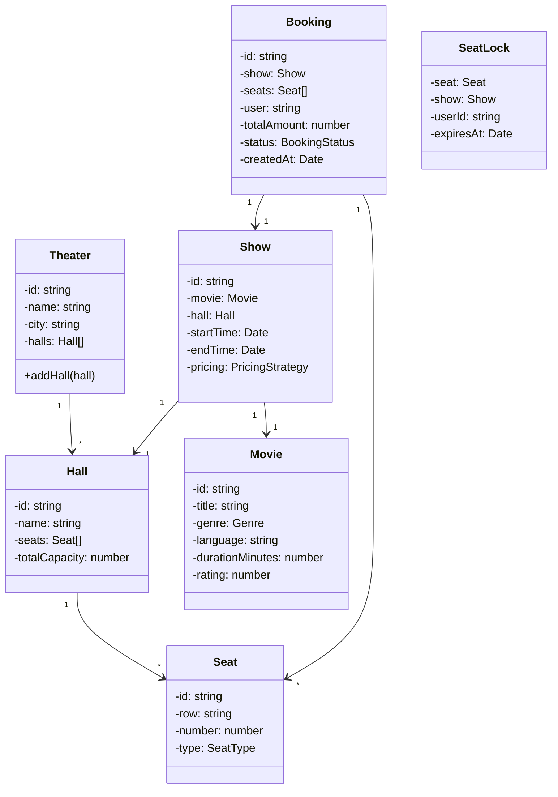
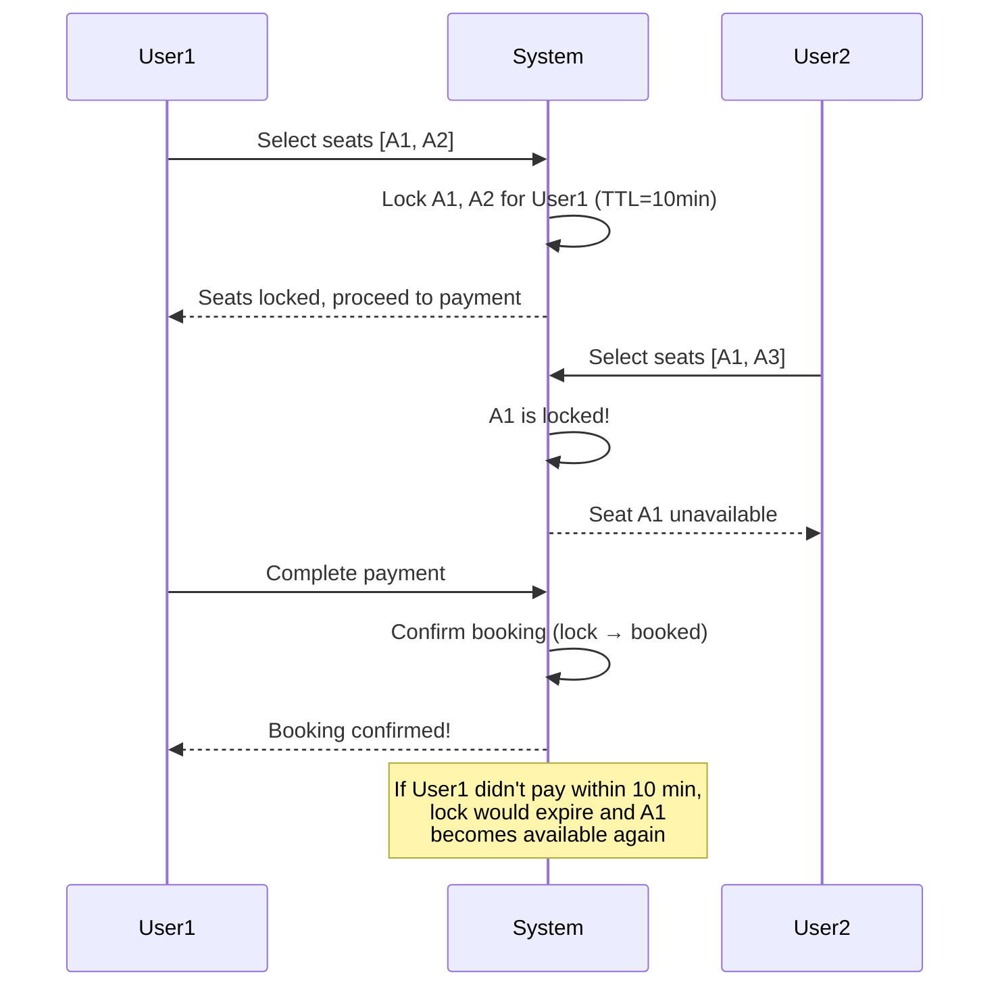

# Design Movie Ticket Booking (LLD)

Movie ticket booking is one of the most commonly asked LLD problems because it combines several challenging concepts: entity modeling, concurrency control (no double-booking), pricing logic, and temporal constraints (show times, seat locks). The core challenge is ensuring that two users cannot book the same seat simultaneously — a problem that maps directly to real-world production systems.

## Requirements

### Functional Requirements

| # | Requirement | Details |
|---|-------------|---------|
| FR-1 | Browse movies | Search by city, genre, language |
| FR-2 | View showtimes | List available shows for a movie at a theater |
| FR-3 | Select seats | Display seat map, allow seat selection |
| FR-4 | Seat locking | Temporarily lock seats during checkout (TTL-based) |
| FR-5 | Book tickets | Confirm booking after payment |
| FR-6 | Cancel booking | Cancel and release seats with refund policy |
| FR-7 | Pricing | Base price + premium surcharge + convenience fee |

### Non-Functional Requirements

- No double booking (strong consistency on seat allocation)
- Seat lock expires after timeout (e.g., 10 minutes)
- Support concurrent users selecting seats for the same show

## Class Diagram



## Core Implementation

### Enums and Types

**TypeScript:**

```typescript
enum SeatType {
  REGULAR = "REGULAR",
  PREMIUM = "PREMIUM",
  VIP = "VIP",
  RECLINER = "RECLINER",
}

enum BookingStatus {
  PENDING = "PENDING",
  CONFIRMED = "CONFIRMED",
  CANCELLED = "CANCELLED",
  EXPIRED = "EXPIRED",
}

enum Genre {
  ACTION = "ACTION",
  COMEDY = "COMEDY",
  DRAMA = "DRAMA",
  HORROR = "HORROR",
  SCIFI = "SCIFI",
  THRILLER = "THRILLER",
}
```

**Python:**

```python
from enum import Enum
from dataclasses import dataclass, field
from datetime import datetime, timedelta
import uuid
import threading

class SeatType(Enum):
    REGULAR = "REGULAR"
    PREMIUM = "PREMIUM"
    VIP = "VIP"
    RECLINER = "RECLINER"

class BookingStatus(Enum):
    PENDING = "PENDING"
    CONFIRMED = "CONFIRMED"
    CANCELLED = "CANCELLED"
    EXPIRED = "EXPIRED"

class Genre(Enum):
    ACTION = "ACTION"
    COMEDY = "COMEDY"
    DRAMA = "DRAMA"
    HORROR = "HORROR"
    SCIFI = "SCIFI"
    THRILLER = "THRILLER"
```

### Entity Classes

**TypeScript:**

```typescript
class Movie {
  constructor(
    public readonly id: string,
    public readonly title: string,
    public readonly genre: Genre,
    public readonly language: string,
    public readonly durationMinutes: number,
    public readonly rating: number = 0
  ) {}
}

class Seat {
  constructor(
    public readonly id: string,
    public readonly row: string,
    public readonly number: number,
    public readonly type: SeatType
  ) {}
}

class Hall {
  private seats: Seat[] = [];

  constructor(
    public readonly id: string,
    public readonly name: string
  ) {}

  addSeat(seat: Seat): void {
    this.seats.push(seat);
  }

  getSeats(): Seat[] {
    return [...this.seats];
  }

  get totalCapacity(): number {
    return this.seats.length;
  }
}

class Theater {
  private halls: Hall[] = [];

  constructor(
    public readonly id: string,
    public readonly name: string,
    public readonly city: string
  ) {}

  addHall(hall: Hall): void {
    this.halls.push(hall);
  }

  getHalls(): Hall[] {
    return [...this.halls];
  }
}
```

**Python:**

```python
@dataclass
class Movie:
    id: str
    title: str
    genre: Genre
    language: str
    duration_minutes: int
    rating: float = 0.0

@dataclass
class Seat:
    id: str
    row: str
    number: int
    type: SeatType

@dataclass
class Hall:
    id: str
    name: str
    seats: list[Seat] = field(default_factory=list)

    def add_seat(self, seat: Seat) -> None:
        self.seats.append(seat)

    @property
    def total_capacity(self) -> int:
        return len(self.seats)

@dataclass
class Theater:
    id: str
    name: str
    city: str
    halls: list[Hall] = field(default_factory=list)

    def add_hall(self, hall: Hall) -> None:
        self.halls.append(hall)
```

### Pricing Strategy

Pricing uses the Strategy pattern to allow different pricing models per show (weekday vs weekend, standard vs IMAX, etc.).

$$
\text{Total} = \sum_{i=1}^{n} \bigl(\text{basePrice} \times \text{seatMultiplier}(s_i)\bigr) + n \times \text{convenienceFee}
$$

**TypeScript:**

```typescript
interface PricingStrategy {
  calculatePrice(seats: Seat[]): number;
}

class StandardPricing implements PricingStrategy {
  private basePrice: number;
  private convenienceFee: number;
  private seatMultipliers: Map<SeatType, number>;

  constructor(basePrice: number, convenienceFee: number = 30) {
    this.basePrice = basePrice;
    this.convenienceFee = convenienceFee;
    this.seatMultipliers = new Map([
      [SeatType.REGULAR, 1.0],
      [SeatType.PREMIUM, 1.5],
      [SeatType.VIP, 2.0],
      [SeatType.RECLINER, 2.5],
    ]);
  }

  calculatePrice(seats: Seat[]): number {
    let total = 0;
    for (const seat of seats) {
      const multiplier = this.seatMultipliers.get(seat.type) ?? 1.0;
      total += this.basePrice * multiplier;
    }
    total += seats.length * this.convenienceFee;
    return Math.round(total * 100) / 100;
  }
}

class WeekendPricing implements PricingStrategy {
  private standardPricing: StandardPricing;
  private surchargePercent: number;

  constructor(basePrice: number, surchargePercent = 20) {
    this.standardPricing = new StandardPricing(basePrice);
    this.surchargePercent = surchargePercent;
  }

  calculatePrice(seats: Seat[]): number {
    const base = this.standardPricing.calculatePrice(seats);
    return Math.round(base * (1 + this.surchargePercent / 100) * 100) / 100;
  }
}
```

**Python:**

```python
class PricingStrategy(ABC):
    @abstractmethod
    def calculate_price(self, seats: list[Seat]) -> float: ...

class StandardPricing(PricingStrategy):
    SEAT_MULTIPLIERS = {
        SeatType.REGULAR: 1.0,
        SeatType.PREMIUM: 1.5,
        SeatType.VIP: 2.0,
        SeatType.RECLINER: 2.5,
    }

    def __init__(self, base_price: float, convenience_fee: float = 30.0):
        self.base_price = base_price
        self.convenience_fee = convenience_fee

    def calculate_price(self, seats: list[Seat]) -> float:
        total = sum(
            self.base_price * self.SEAT_MULTIPLIERS.get(s.type, 1.0)
            for s in seats
        )
        total += len(seats) * self.convenience_fee
        return round(total, 2)

class WeekendPricing(PricingStrategy):
    def __init__(self, base_price: float, surcharge_percent: float = 20.0):
        self._standard = StandardPricing(base_price)
        self._surcharge = surcharge_percent

    def calculate_price(self, seats: list[Seat]) -> float:
        base = self._standard.calculate_price(seats)
        return round(base * (1 + self._surcharge / 100), 2)
```

### Show and Seat Lock Management

The seat lock mechanism is the most critical part of this design. When a user selects seats, those seats are temporarily locked for a configurable TTL. If the user does not complete payment within the TTL, the locks expire and seats become available again.

**TypeScript:**

```typescript
class SeatLock {
  constructor(
    public readonly seat: Seat,
    public readonly showId: string,
    public readonly userId: string,
    public readonly expiresAt: Date
  ) {}

  isExpired(): boolean {
    return new Date() > this.expiresAt;
  }
}

class Show {
  private bookedSeats: Set<string> = new Set(); // seat IDs
  private seatLocks: Map<string, SeatLock> = new Map(); // seatId -> lock

  constructor(
    public readonly id: string,
    public readonly movie: Movie,
    public readonly hall: Hall,
    public readonly startTime: Date,
    public readonly endTime: Date,
    public readonly pricing: PricingStrategy
  ) {}

  getAvailableSeats(): Seat[] {
    this.cleanExpiredLocks();
    return this.hall.getSeats().filter(
      (seat) => !this.bookedSeats.has(seat.id) && !this.seatLocks.has(seat.id)
    );
  }

  lockSeats(seats: Seat[], userId: string, ttlMinutes = 10): boolean {
    this.cleanExpiredLocks();

    // Check all seats are available
    for (const seat of seats) {
      if (this.bookedSeats.has(seat.id) || this.seatLocks.has(seat.id)) {
        return false;
      }
    }

    // Lock all seats atomically
    const expiresAt = new Date(Date.now() + ttlMinutes * 60 * 1000);
    for (const seat of seats) {
      this.seatLocks.set(
        seat.id,
        new SeatLock(seat, this.id, userId, expiresAt)
      );
    }

    return true;
  }

  confirmBooking(seats: Seat[], userId: string): boolean {
    // Verify locks belong to this user
    for (const seat of seats) {
      const lock = this.seatLocks.get(seat.id);
      if (!lock || lock.userId !== userId || lock.isExpired()) {
        return false;
      }
    }

    // Confirm: move from locked to booked
    for (const seat of seats) {
      this.seatLocks.delete(seat.id);
      this.bookedSeats.add(seat.id);
    }

    return true;
  }

  releaseLocks(seats: Seat[], userId: string): void {
    for (const seat of seats) {
      const lock = this.seatLocks.get(seat.id);
      if (lock && lock.userId === userId) {
        this.seatLocks.delete(seat.id);
      }
    }
  }

  cancelSeats(seats: Seat[]): void {
    for (const seat of seats) {
      this.bookedSeats.delete(seat.id);
    }
  }

  private cleanExpiredLocks(): void {
    for (const [seatId, lock] of this.seatLocks) {
      if (lock.isExpired()) {
        this.seatLocks.delete(seatId);
      }
    }
  }
}
```

**Python:**

```python
@dataclass
class SeatLock:
    seat: Seat
    show_id: str
    user_id: str
    expires_at: datetime

    def is_expired(self) -> bool:
        return datetime.now() > self.expires_at

class Show:
    def __init__(self, id: str, movie: Movie, hall: Hall,
                 start_time: datetime, end_time: datetime,
                 pricing: PricingStrategy):
        self.id = id
        self.movie = movie
        self.hall = hall
        self.start_time = start_time
        self.end_time = end_time
        self.pricing = pricing
        self._booked_seats: set[str] = set()
        self._seat_locks: dict[str, SeatLock] = {}
        self._lock = threading.Lock()

    def get_available_seats(self) -> list[Seat]:
        self._clean_expired_locks()
        return [
            s for s in self.hall.seats
            if s.id not in self._booked_seats and s.id not in self._seat_locks
        ]

    def lock_seats(self, seats: list[Seat], user_id: str,
                   ttl_minutes: int = 10) -> bool:
        with self._lock:
            self._clean_expired_locks()

            for seat in seats:
                if seat.id in self._booked_seats or seat.id in self._seat_locks:
                    return False

            expires_at = datetime.now() + timedelta(minutes=ttl_minutes)
            for seat in seats:
                self._seat_locks[seat.id] = SeatLock(
                    seat=seat, show_id=self.id,
                    user_id=user_id, expires_at=expires_at
                )
            return True

    def confirm_booking(self, seats: list[Seat], user_id: str) -> bool:
        with self._lock:
            for seat in seats:
                lock = self._seat_locks.get(seat.id)
                if not lock or lock.user_id != user_id or lock.is_expired():
                    return False

            for seat in seats:
                del self._seat_locks[seat.id]
                self._booked_seats.add(seat.id)
            return True

    def release_locks(self, seats: list[Seat], user_id: str) -> None:
        with self._lock:
            for seat in seats:
                lock = self._seat_locks.get(seat.id)
                if lock and lock.user_id == user_id:
                    del self._seat_locks[seat.id]

    def cancel_seats(self, seats: list[Seat]) -> None:
        with self._lock:
            for seat in seats:
                self._booked_seats.discard(seat.id)

    def _clean_expired_locks(self) -> None:
        expired = [sid for sid, lock in self._seat_locks.items() if lock.is_expired()]
        for sid in expired:
            del self._seat_locks[sid]
```

### Booking Service

**TypeScript:**

```typescript
class Booking {
  public status: BookingStatus = BookingStatus.PENDING;
  public readonly createdAt = new Date();

  constructor(
    public readonly id: string,
    public readonly show: Show,
    public readonly seats: Seat[],
    public readonly userId: string,
    public readonly totalAmount: number
  ) {}
}

class BookingService {
  private bookings: Map<string, Booking> = new Map();

  initiateBooking(show: Show, seats: Seat[], userId: string): Booking | null {
    // Lock seats
    if (!show.lockSeats(seats, userId)) {
      return null; // seats unavailable
    }

    const totalAmount = show.pricing.calculatePrice(seats);
    const booking = new Booking(
      crypto.randomUUID(),
      show,
      seats,
      userId,
      totalAmount
    );

    this.bookings.set(booking.id, booking);
    return booking;
  }

  confirmBooking(bookingId: string): boolean {
    const booking = this.bookings.get(bookingId);
    if (!booking || booking.status !== BookingStatus.PENDING) {
      return false;
    }

    if (booking.show.confirmBooking(booking.seats, booking.userId)) {
      booking.status = BookingStatus.CONFIRMED;
      return true;
    }

    // Lock expired
    booking.status = BookingStatus.EXPIRED;
    return false;
  }

  cancelBooking(bookingId: string): boolean {
    const booking = this.bookings.get(bookingId);
    if (!booking || booking.status !== BookingStatus.CONFIRMED) {
      return false;
    }

    booking.show.cancelSeats(booking.seats);
    booking.status = BookingStatus.CANCELLED;
    return true;
  }
}
```

**Python:**

```python
@dataclass
class Booking:
    id: str
    show: Show
    seats: list[Seat]
    user_id: str
    total_amount: float
    status: BookingStatus = BookingStatus.PENDING
    created_at: datetime = field(default_factory=datetime.now)

class BookingService:
    def __init__(self):
        self._bookings: dict[str, Booking] = {}

    def initiate_booking(self, show: Show, seats: list[Seat],
                         user_id: str) -> Booking | None:
        if not show.lock_seats(seats, user_id):
            return None

        total = show.pricing.calculate_price(seats)
        booking = Booking(
            id=str(uuid.uuid4()),
            show=show,
            seats=seats,
            user_id=user_id,
            total_amount=total
        )
        self._bookings[booking.id] = booking
        return booking

    def confirm_booking(self, booking_id: str) -> bool:
        booking = self._bookings.get(booking_id)
        if not booking or booking.status != BookingStatus.PENDING:
            return False

        if booking.show.confirm_booking(booking.seats, booking.user_id):
            booking.status = BookingStatus.CONFIRMED
            return True

        booking.status = BookingStatus.EXPIRED
        return False

    def cancel_booking(self, booking_id: str) -> bool:
        booking = self._bookings.get(booking_id)
        if not booking or booking.status != BookingStatus.CONFIRMED:
            return False

        booking.show.cancel_seats(booking.seats)
        booking.status = BookingStatus.CANCELLED
        return True
```

## Concurrency: The Double-Booking Problem



::: warning
The seat locking mechanism must be **atomic**. If locking multiple seats, either all succeed or none do. A partial lock (where only some seats are locked) leads to inconsistencies and a poor user experience.
:::

## Design Patterns Used

| Pattern | Where Used | Why |
|---------|-----------|-----|
| **Strategy** | PricingStrategy | Different pricing for weekdays, weekends, IMAX, etc. |
| **Builder** | Constructing Hall with seats | Halls have many seats with different types |
| **Repository** | BookingService storage | Abstracts persistence layer |
| **Observer** | Booking status changes | Notify user via email/SMS on confirmation/cancellation |

## Complexity Analysis

| Operation | Time | Space |
|-----------|------|-------|
| Get available seats | $O(S)$ where $S$ = total seats | $O(S)$ |
| Lock seats | $O(K)$ where $K$ = selected seats | $O(K)$ |
| Confirm booking | $O(K)$ | $O(1)$ |
| Clean expired locks | $O(L)$ where $L$ = active locks | $O(1)$ |
| Calculate price | $O(K)$ | $O(1)$ |

## Extensions to Discuss

- **Seat map visualization** (2D grid rendering with status colors)
- **Waitlist** when show is sold out (Observer pattern for notifications)
- **Coupon/promo codes** (Decorator pattern on PricingStrategy)
- **Recurring bookings** (season passes)
- **Refund policy** (time-based: full refund > 24h, 50% > 4h, no refund < 4h)
- **Payment integration** (Strategy pattern for payment methods)

## Further Reading

- [LLD Interviews Overview](/lld-interviews/) — SOLID principles and LLD approach
- [Design Hotel Management](/lld-interviews/hotel-management) — similar booking and availability patterns
- [Design ATM Machine](/lld-interviews/atm-machine) — State pattern for sequential flows
