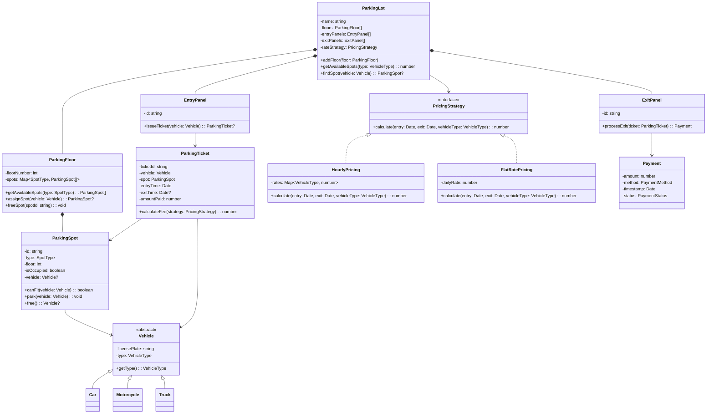

# Design a Parking Lot

The parking lot problem is the most frequently asked LLD interview question. It tests core OOP skills: inheritance, composition, encapsulation, and the ability to model real-world entities as classes.

## Requirements & Use Cases

### Functional Requirements

1. The parking lot has multiple floors, each with multiple parking spots
2. Three vehicle types: motorcycle, car, truck
3. Three spot sizes: small (motorcycle), medium (car), large (truck)
4. A vehicle can park in a spot of equal or larger size
5. Entry and exit points with ticket generation
6. Payment calculation based on time parked (hourly rate)
7. Display available spots per floor and per type
8. Support multiple entry/exit points concurrently

### Non-Functional Requirements

- Thread-safe spot allocation (no double-booking)
- O(1) spot lookup for the nearest available spot
- Extensible for new vehicle types or payment methods

### Use Cases

| Actor | Use Case |
|-------|---------|
| Driver | Enter lot and receive ticket |
| Driver | Find available spot on a floor |
| Driver | Park vehicle in assigned spot |
| Driver | Pay at exit and leave |
| Admin | View occupancy per floor |
| Admin | Configure hourly rates |
| System | Track entry/exit timestamps |

## Class Diagram



## Core Classes & Interfaces

### TypeScript Implementation

```typescript
// ─── Enums ───────────────────────────────────────────────

enum VehicleType {
  MOTORCYCLE = 'MOTORCYCLE',
  CAR = 'CAR',
  TRUCK = 'TRUCK',
}

enum SpotType {
  SMALL = 'SMALL',
  MEDIUM = 'MEDIUM',
  LARGE = 'LARGE',
}

enum PaymentMethod {
  CASH = 'CASH',
  CREDIT_CARD = 'CREDIT_CARD',
  UPI = 'UPI',
}

enum PaymentStatus {
  PENDING = 'PENDING',
  COMPLETED = 'COMPLETED',
  FAILED = 'FAILED',
}

// ─── Vehicle hierarchy ───────────────────────────────────

abstract class Vehicle {
  constructor(
    public readonly licensePlate: string,
    public readonly type: VehicleType
  ) {}
}

class Car extends Vehicle {
  constructor(licensePlate: string) {
    super(licensePlate, VehicleType.CAR);
  }
}

class Motorcycle extends Vehicle {
  constructor(licensePlate: string) {
    super(licensePlate, VehicleType.MOTORCYCLE);
  }
}

class Truck extends Vehicle {
  constructor(licensePlate: string) {
    super(licensePlate, VehicleType.TRUCK);
  }
}

// ─── Vehicle ↔ Spot compatibility ────────────────────────

const VEHICLE_TO_MIN_SPOT: Record<VehicleType, SpotType> = {
  [VehicleType.MOTORCYCLE]: SpotType.SMALL,
  [VehicleType.CAR]: SpotType.MEDIUM,
  [VehicleType.TRUCK]: SpotType.LARGE,
};

const SPOT_ORDER: SpotType[] = [SpotType.SMALL, SpotType.MEDIUM, SpotType.LARGE];

function canFit(spotType: SpotType, vehicleType: VehicleType): boolean {
  const minSpot = VEHICLE_TO_MIN_SPOT[vehicleType];
  return SPOT_ORDER.indexOf(spotType) >= SPOT_ORDER.indexOf(minSpot);
}

// ─── Parking Spot ────────────────────────────────────────

class ParkingSpot {
  private vehicle: Vehicle | null = null;

  constructor(
    public readonly id: string,
    public readonly type: SpotType,
    public readonly floor: number
  ) {}

  get isOccupied(): boolean {
    return this.vehicle !== null;
  }

  canFitVehicle(vehicle: Vehicle): boolean {
    return !this.isOccupied && canFit(this.type, vehicle.type);
  }

  park(vehicle: Vehicle): void {
    if (!this.canFitVehicle(vehicle)) {
      throw new Error(`Spot ${this.id} cannot fit ${vehicle.type}`);
    }
    this.vehicle = vehicle;
  }

  free(): Vehicle | null {
    const v = this.vehicle;
    this.vehicle = null;
    return v;
  }

  getVehicle(): Vehicle | null {
    return this.vehicle;
  }
}

// ─── Parking Floor ───────────────────────────────────────

class ParkingFloor {
  private spots: Map<SpotType, ParkingSpot[]> = new Map();

  constructor(public readonly floorNumber: number) {
    for (const type of SPOT_ORDER) {
      this.spots.set(type, []);
    }
  }

  addSpot(spot: ParkingSpot): void {
    this.spots.get(spot.type)!.push(spot);
  }

  getAvailableSpots(type: SpotType): ParkingSpot[] {
    return this.spots.get(type)?.filter((s) => !s.isOccupied) ?? [];
  }

  /** Find the first available spot that can fit the vehicle */
  assignSpot(vehicle: Vehicle): ParkingSpot | null {
    const minIndex = SPOT_ORDER.indexOf(VEHICLE_TO_MIN_SPOT[vehicle.type]);

    // Try smallest fitting spot first, then larger ones
    for (let i = minIndex; i < SPOT_ORDER.length; i++) {
      const spotType = SPOT_ORDER[i];
      const available = this.getAvailableSpots(spotType);
      if (available.length > 0) {
        const spot = available[0];
        spot.park(vehicle);
        return spot;
      }
    }
    return null;
  }

  freeSpot(spotId: string): void {
    for (const spotList of this.spots.values()) {
      const spot = spotList.find((s) => s.id === spotId);
      if (spot) {
        spot.free();
        return;
      }
    }
    throw new Error(`Spot ${spotId} not found on floor ${this.floorNumber}`);
  }

  getTotalAvailable(): number {
    let count = 0;
    for (const spotList of this.spots.values()) {
      count += spotList.filter((s) => !s.isOccupied).length;
    }
    return count;
  }
}

// ─── Pricing Strategy (Strategy Pattern) ─────────────────

interface PricingStrategy {
  calculate(entry: Date, exit: Date, vehicleType: VehicleType): number;
}

class HourlyPricing implements PricingStrategy {
  constructor(private rates: Map<VehicleType, number>) {}

  calculate(entry: Date, exit: Date, vehicleType: VehicleType): number {
    const hours = Math.ceil(
      (exit.getTime() - entry.getTime()) / (1000 * 60 * 60)
    );
    const rate = this.rates.get(vehicleType) ?? 0;
    return hours * rate;
  }
}

class FlatRatePricing implements PricingStrategy {
  constructor(private dailyRate: number) {}

  calculate(entry: Date, exit: Date, _vehicleType: VehicleType): number {
    const days = Math.ceil(
      (exit.getTime() - entry.getTime()) / (1000 * 60 * 60 * 24)
    );
    return Math.max(1, days) * this.dailyRate;
  }
}

// ─── Parking Ticket ──────────────────────────────────────

class ParkingTicket {
  public exitTime: Date | null = null;
  public amountPaid: number = 0;

  constructor(
    public readonly ticketId: string,
    public readonly vehicle: Vehicle,
    public readonly spot: ParkingSpot,
    public readonly entryTime: Date = new Date()
  ) {}

  calculateFee(strategy: PricingStrategy): number {
    const exit = this.exitTime ?? new Date();
    return strategy.calculate(this.entryTime, exit, this.vehicle.type);
  }
}

// ─── Payment ─────────────────────────────────────────────

class Payment {
  public status: PaymentStatus = PaymentStatus.PENDING;

  constructor(
    public readonly amount: number,
    public readonly method: PaymentMethod,
    public readonly timestamp: Date = new Date()
  ) {}

  complete(): void {
    this.status = PaymentStatus.COMPLETED;
  }

  fail(): void {
    this.status = PaymentStatus.FAILED;
  }
}

// ─── Entry & Exit Panels ─────────────────────────────────

class EntryPanel {
  constructor(
    public readonly id: string,
    private lot: ParkingLot
  ) {}

  issueTicket(vehicle: Vehicle): ParkingTicket | null {
    return this.lot.enter(vehicle);
  }
}

class ExitPanel {
  constructor(
    public readonly id: string,
    private lot: ParkingLot
  ) {}

  processExit(ticket: ParkingTicket, method: PaymentMethod): Payment | null {
    return this.lot.exit(ticket, method);
  }
}

// ─── Parking Lot (Facade) ────────────────────────────────

class ParkingLot {
  private floors: ParkingFloor[] = [];
  private activeTickets: Map<string, ParkingTicket> = new Map();
  private ticketCounter: number = 0;

  constructor(
    public readonly name: string,
    private pricingStrategy: PricingStrategy
  ) {}

  addFloor(floor: ParkingFloor): void {
    this.floors.push(floor);
  }

  setPricingStrategy(strategy: PricingStrategy): void {
    this.pricingStrategy = strategy;
  }

  /** Find a spot across all floors and issue a ticket */
  enter(vehicle: Vehicle): ParkingTicket | null {
    for (const floor of this.floors) {
      const spot = floor.assignSpot(vehicle);
      if (spot) {
        const ticketId = `TKT-${++this.ticketCounter}`;
        const ticket = new ParkingTicket(ticketId, vehicle, spot);
        this.activeTickets.set(ticketId, ticket);
        return ticket;
      }
    }
    return null; // lot is full for this vehicle type
  }

  /** Process payment and free the spot */
  exit(ticket: ParkingTicket, method: PaymentMethod): Payment | null {
    ticket.exitTime = new Date();
    const fee = ticket.calculateFee(this.pricingStrategy);
    const payment = new Payment(fee, method);

    // In production: integrate with payment gateway here
    payment.complete();
    ticket.amountPaid = fee;

    // Free the spot
    const floor = this.floors.find(
      (f) => f.floorNumber === ticket.spot.floor
    );
    floor?.freeSpot(ticket.spot.id);

    this.activeTickets.delete(ticket.ticketId);
    return payment;
  }

  getAvailableSpotsCount(): Map<number, number> {
    const result = new Map<number, number>();
    for (const floor of this.floors) {
      result.set(floor.floorNumber, floor.getTotalAvailable());
    }
    return result;
  }
}
```

### Python Implementation

```python
from abc import ABC, abstractmethod
from dataclasses import dataclass, field
from datetime import datetime
from enum import Enum
from math import ceil
from typing import Optional
import uuid


# ─── Enums ──────────────────────────────────────────────

class VehicleType(Enum):
    MOTORCYCLE = "MOTORCYCLE"
    CAR = "CAR"
    TRUCK = "TRUCK"


class SpotType(Enum):
    SMALL = 1
    MEDIUM = 2
    LARGE = 3


class PaymentMethod(Enum):
    CASH = "CASH"
    CREDIT_CARD = "CREDIT_CARD"
    UPI = "UPI"


class PaymentStatus(Enum):
    PENDING = "PENDING"
    COMPLETED = "COMPLETED"
    FAILED = "FAILED"


# ─── Vehicle hierarchy ──────────────────────────────────

class Vehicle(ABC):
    def __init__(self, license_plate: str, vehicle_type: VehicleType):
        self.license_plate = license_plate
        self.vehicle_type = vehicle_type


class Car(Vehicle):
    def __init__(self, license_plate: str):
        super().__init__(license_plate, VehicleType.CAR)


class Motorcycle(Vehicle):
    def __init__(self, license_plate: str):
        super().__init__(license_plate, VehicleType.MOTORCYCLE)


class Truck(Vehicle):
    def __init__(self, license_plate: str):
        super().__init__(license_plate, VehicleType.TRUCK)


# ─── Spot compatibility ─────────────────────────────────

VEHICLE_TO_MIN_SPOT: dict[VehicleType, SpotType] = {
    VehicleType.MOTORCYCLE: SpotType.SMALL,
    VehicleType.CAR: SpotType.MEDIUM,
    VehicleType.TRUCK: SpotType.LARGE,
}

SPOT_ORDER = [SpotType.SMALL, SpotType.MEDIUM, SpotType.LARGE]


def can_fit(spot_type: SpotType, vehicle_type: VehicleType) -> bool:
    return spot_type.value >= VEHICLE_TO_MIN_SPOT[vehicle_type].value


# ─── Parking Spot ────────────────────────────────────────

class ParkingSpot:
    def __init__(self, spot_id: str, spot_type: SpotType, floor: int):
        self.id = spot_id
        self.type = spot_type
        self.floor = floor
        self._vehicle: Optional[Vehicle] = None

    @property
    def is_occupied(self) -> bool:
        return self._vehicle is not None

    def can_fit_vehicle(self, vehicle: Vehicle) -> bool:
        return not self.is_occupied and can_fit(self.type, vehicle.vehicle_type)

    def park(self, vehicle: Vehicle) -> None:
        if not self.can_fit_vehicle(vehicle):
            raise ValueError(f"Spot {self.id} cannot fit {vehicle.vehicle_type}")
        self._vehicle = vehicle

    def free(self) -> Optional[Vehicle]:
        v = self._vehicle
        self._vehicle = None
        return v


# ─── Parking Floor ───────────────────────────────────────

class ParkingFloor:
    def __init__(self, floor_number: int):
        self.floor_number = floor_number
        self._spots: dict[SpotType, list[ParkingSpot]] = {
            t: [] for t in SpotType
        }

    def add_spot(self, spot: ParkingSpot) -> None:
        self._spots[spot.type].append(spot)

    def get_available_spots(self, spot_type: SpotType) -> list[ParkingSpot]:
        return [s for s in self._spots[spot_type] if not s.is_occupied]

    def assign_spot(self, vehicle: Vehicle) -> Optional[ParkingSpot]:
        min_index = SPOT_ORDER.index(VEHICLE_TO_MIN_SPOT[vehicle.vehicle_type])

        for i in range(min_index, len(SPOT_ORDER)):
            available = self.get_available_spots(SPOT_ORDER[i])
            if available:
                spot = available[0]
                spot.park(vehicle)
                return spot
        return None

    def free_spot(self, spot_id: str) -> None:
        for spot_list in self._spots.values():
            for spot in spot_list:
                if spot.id == spot_id:
                    spot.free()
                    return
        raise ValueError(f"Spot {spot_id} not found on floor {self.floor_number}")

    def total_available(self) -> int:
        return sum(
            len(self.get_available_spots(t)) for t in SpotType
        )


# ─── Pricing Strategy ───────────────────────────────────

class PricingStrategy(ABC):
    @abstractmethod
    def calculate(
        self, entry: datetime, exit_time: datetime, vehicle_type: VehicleType
    ) -> float:
        ...


class HourlyPricing(PricingStrategy):
    def __init__(self, rates: dict[VehicleType, float]):
        self._rates = rates

    def calculate(
        self, entry: datetime, exit_time: datetime, vehicle_type: VehicleType
    ) -> float:
        hours = ceil((exit_time - entry).total_seconds() / 3600)
        return hours * self._rates.get(vehicle_type, 0)


class FlatRatePricing(PricingStrategy):
    def __init__(self, daily_rate: float):
        self._daily_rate = daily_rate

    def calculate(
        self, entry: datetime, exit_time: datetime, vehicle_type: VehicleType
    ) -> float:
        days = max(1, ceil((exit_time - entry).total_seconds() / 86400))
        return days * self._daily_rate


# ─── Parking Ticket ──────────────────────────────────────

@dataclass
class ParkingTicket:
    ticket_id: str
    vehicle: Vehicle
    spot: ParkingSpot
    entry_time: datetime = field(default_factory=datetime.now)
    exit_time: Optional[datetime] = None
    amount_paid: float = 0.0

    def calculate_fee(self, strategy: PricingStrategy) -> float:
        exit_t = self.exit_time or datetime.now()
        return strategy.calculate(self.entry_time, exit_t, self.vehicle.vehicle_type)


# ─── Payment ────────────────────────────────────────────

@dataclass
class Payment:
    amount: float
    method: PaymentMethod
    timestamp: datetime = field(default_factory=datetime.now)
    status: PaymentStatus = PaymentStatus.PENDING

    def complete(self) -> None:
        self.status = PaymentStatus.COMPLETED

    def fail(self) -> None:
        self.status = PaymentStatus.FAILED


# ─── Parking Lot (Facade) ───────────────────────────────

class ParkingLot:
    def __init__(self, name: str, pricing_strategy: PricingStrategy):
        self.name = name
        self._pricing = pricing_strategy
        self._floors: list[ParkingFloor] = []
        self._active_tickets: dict[str, ParkingTicket] = {}
        self._ticket_counter = 0

    def add_floor(self, floor: ParkingFloor) -> None:
        self._floors.append(floor)

    def set_pricing_strategy(self, strategy: PricingStrategy) -> None:
        self._pricing = strategy

    def enter(self, vehicle: Vehicle) -> Optional[ParkingTicket]:
        for floor in self._floors:
            spot = floor.assign_spot(vehicle)
            if spot:
                self._ticket_counter += 1
                ticket_id = f"TKT-{self._ticket_counter}"
                ticket = ParkingTicket(
                    ticket_id=ticket_id, vehicle=vehicle, spot=spot
                )
                self._active_tickets[ticket_id] = ticket
                return ticket
        return None  # lot full

    def exit(self, ticket: ParkingTicket, method: PaymentMethod) -> Payment:
        ticket.exit_time = datetime.now()
        fee = ticket.calculate_fee(self._pricing)
        payment = Payment(amount=fee, method=method)
        payment.complete()
        ticket.amount_paid = fee

        for floor in self._floors:
            if floor.floor_number == ticket.spot.floor:
                floor.free_spot(ticket.spot.id)
                break

        self._active_tickets.pop(ticket.ticket_id, None)
        return payment

    def get_availability(self) -> dict[int, int]:
        return {f.floor_number: f.total_available() for f in self._floors}
```

## Design Patterns Used

| Pattern | Where | Why |
|---------|-------|-----|
| **Strategy** | `PricingStrategy` interface with `HourlyPricing`, `FlatRatePricing` | Swap pricing algorithms without changing `ParkingLot` code |
| **Factory Method** | Vehicle subclass constructors | Each vehicle type encapsulates its own `VehicleType` enum |
| **Facade** | `ParkingLot` class | Single entry point hides floor/spot/ticket complexity |
| **Composition** | `ParkingLot` -> `ParkingFloor` -> `ParkingSpot` | Natural ownership hierarchy; floors don't exist without lot |

## Concurrency Considerations

::: warning Critical Section: Spot Assignment
Two vehicles arriving simultaneously could be assigned the same spot. The `assignSpot` method is the critical section.
:::

**Solutions:**

1. **Mutex per floor** — Lock each floor independently during assignment. Vehicles on different floors don't block each other.

```typescript
class ParkingFloor {
  private mutex = new Mutex();

  async assignSpot(vehicle: Vehicle): Promise<ParkingSpot | null> {
    return this.mutex.runExclusive(() => {
      // existing logic — now atomic
    });
  }
}
```

2. **Optimistic locking** — Use a version field on each spot. `park()` checks the version hasn't changed since it was read.

3. **CAS (Compare-And-Swap)** — Atomically set `isOccupied` from `false` to `true`. If the CAS fails, try the next spot.

**Thread-safety checklist:**

- `activeTickets` map: Use `ConcurrentHashMap` or a read-write lock
- `ticketCounter`: Use `AtomicInteger`
- Spot assignment: Mutex per floor (not global — reduces contention)

## Testing Strategy

| Test Type | What to Test |
|-----------|-------------|
| **Unit** | `canFit()` — motorcycle fits all spots, car fits medium/large, truck only large |
| **Unit** | `HourlyPricing.calculate()` — 0 hours, 1 hour, partial hours round up |
| **Unit** | `ParkingSpot.park()` throws when occupied |
| **Integration** | Full enter → park → calculate fee → exit → spot freed |
| **Edge case** | Lot full returns `null` |
| **Edge case** | Same vehicle can't park twice |
| **Concurrency** | 100 threads entering simultaneously — no double-booked spots |

```typescript
// Example test
describe('ParkingLot', () => {
  it('should assign smallest fitting spot', () => {
    const floor = new ParkingFloor(1);
    floor.addSpot(new ParkingSpot('S1', SpotType.SMALL, 1));
    floor.addSpot(new ParkingSpot('M1', SpotType.MEDIUM, 1));
    floor.addSpot(new ParkingSpot('L1', SpotType.LARGE, 1));

    const car = new Car('ABC-123');
    const spot = floor.assignSpot(car);
    expect(spot?.type).toBe(SpotType.MEDIUM); // not LARGE
  });

  it('should return null when full', () => {
    const floor = new ParkingFloor(1);
    floor.addSpot(new ParkingSpot('S1', SpotType.SMALL, 1));

    const car = new Car('ABC-123');
    floor.assignSpot(car); // takes the only spot (won't fit — small)
    expect(floor.assignSpot(new Car('DEF-456'))).toBeNull();
  });
});
```

## Extensions & Follow-ups

| Extension | Design Impact |
|-----------|--------------|
| **Electric vehicle charging spots** | Add `EVSpot extends ParkingSpot` with `chargerType` field; add `ElectricVehicle` subclass |
| **Reservation system** | Add `Reservation` class with time window; `assignSpot` checks reservations first |
| **Dynamic pricing** | New `SurgePricing` strategy that adjusts rate based on occupancy percentage |
| **Handicap spots** | Add `HANDICAP` to `SpotType` enum; these spots are reserved and prioritized |
| **Multi-level priority** | VIP spots near entrance; use priority queue for spot assignment |
| **License plate recognition** | `EntryPanel` uses an `LPRScanner` interface; automated entry without manual ticket |
| **Monthly subscription** | Add `Subscription` class; `exit()` checks subscription before charging |
