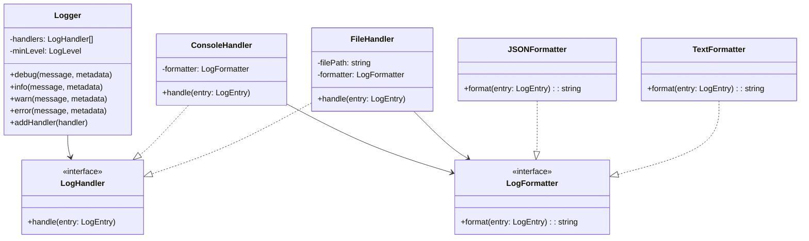
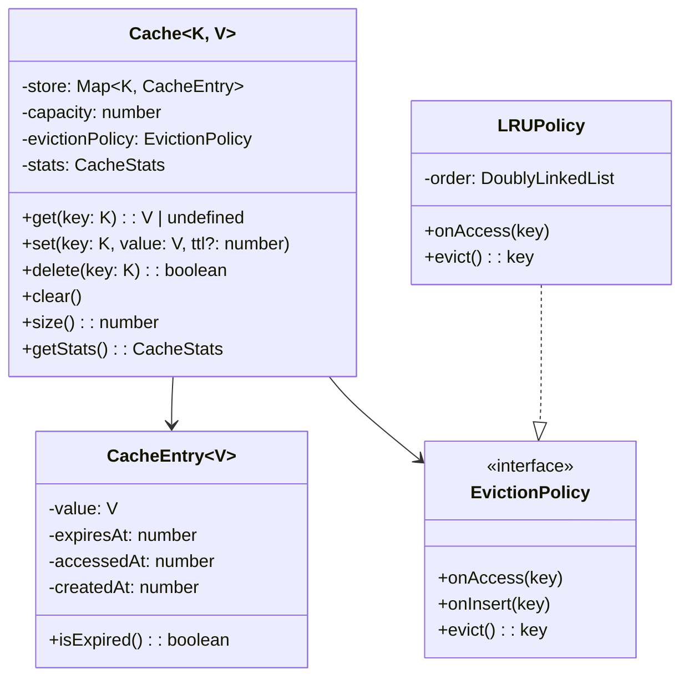
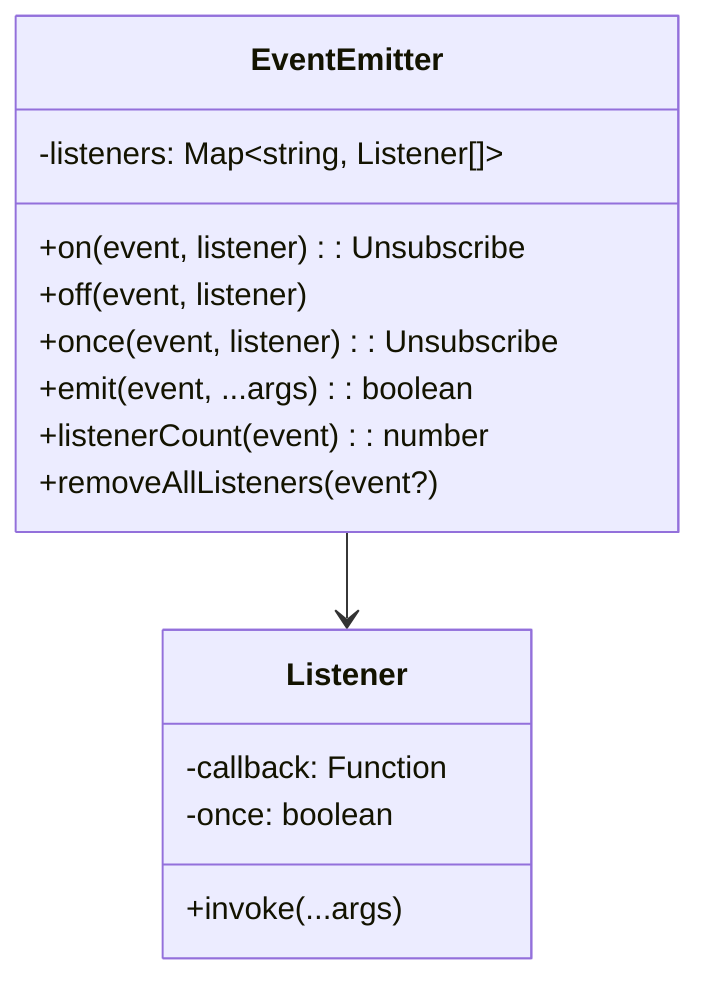
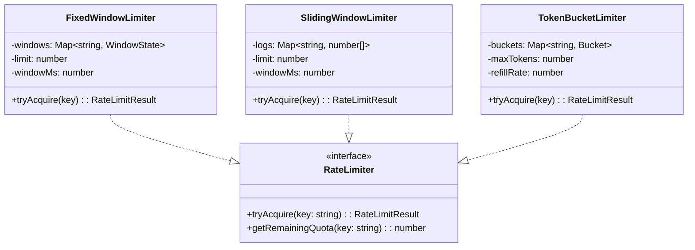
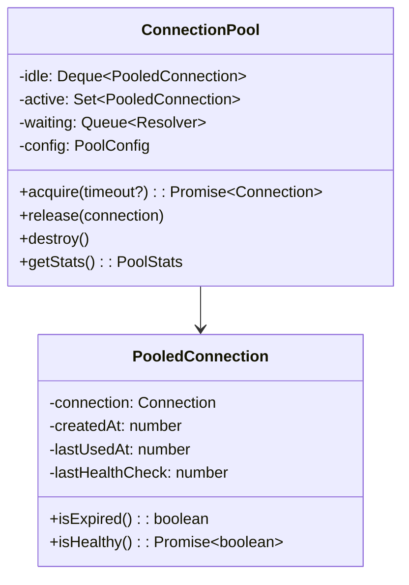
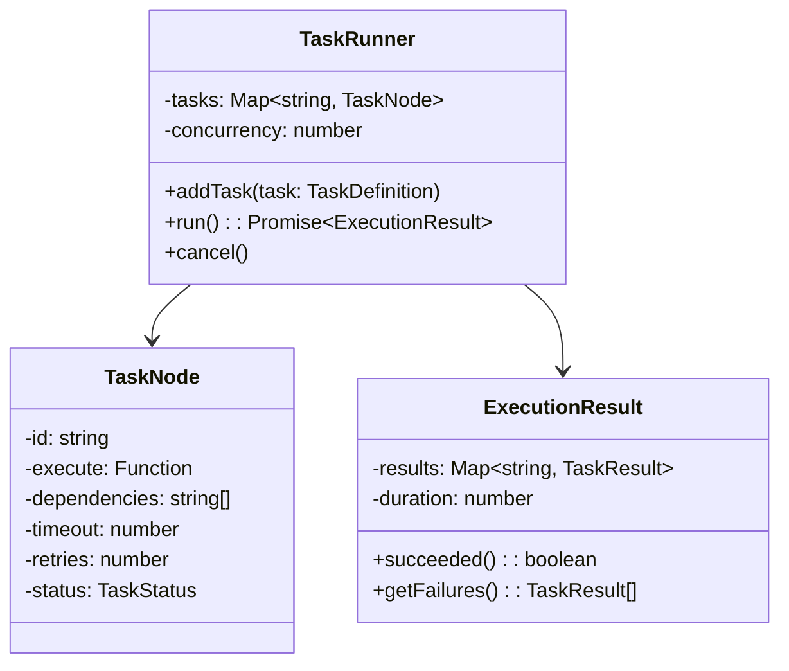

# LLD Practice: Easy

These 10 problems build your LLD muscle memory. Each problem is self-contained — you should be able to design and implement any of them in 30-45 minutes. For each problem, read the requirements, study the class diagram hint, then try to implement it yourself before looking at the key interfaces.

## Problem 1: Logger Framework

Build a configurable logging framework that supports multiple log levels, output destinations, and formatters.

### Requirements

- Support log levels: DEBUG, INFO, WARN, ERROR, FATAL
- Multiple output destinations: Console, File, HTTP endpoint
- Configurable log format (JSON, plain text)
- Filter by minimum log level
- Thread-safe logging
- Support for structured metadata (key-value pairs)

### Class Diagram Hint



### Key Interfaces

```typescript
enum LogLevel { DEBUG = 0, INFO = 1, WARN = 2, ERROR = 3, FATAL = 4 }

interface LogEntry {
  level: LogLevel;
  message: string;
  timestamp: Date;
  metadata?: Record<string, unknown>;
}

interface LogHandler {
  handle(entry: LogEntry): void;
}

interface LogFormatter {
  format(entry: LogEntry): string;
}
```

### Approach

- **Strategy Pattern** for formatters — swap formatting logic without changing handlers
- **Observer Pattern** for handlers — logger pushes entries to all registered handlers
- **Chain of Responsibility** (optional) — handlers can filter which entries they process
- Use a `LogLevel` enum with numeric values for easy comparison (`if (entry.level >= this.minLevel)`)

---

## Problem 2: In-Memory Cache with TTL

Build a cache that stores key-value pairs with time-to-live (TTL), eviction policies, and size limits.

### Requirements

- Get/Set/Delete operations with O(1) average time
- Per-key TTL (time-to-live) — expired entries are not returned
- Maximum capacity with LRU eviction when full
- Cache statistics: hits, misses, evictions
- Optional: support for cache-aside pattern (loader function on miss)

### Class Diagram Hint



### Key Interfaces

```typescript
interface CacheOptions<K, V> {
  capacity: number;
  defaultTtl?: number;  // milliseconds
  evictionPolicy?: 'lru' | 'lfu' | 'fifo';
  onEvict?: (key: K, value: V) => void;
  loader?: (key: K) => Promise<V>;  // Cache-aside loader
}

interface CacheStats {
  hits: number;
  misses: number;
  evictions: number;
  size: number;
  hitRate: number;
}
```

### Approach

- Use a `Map` for O(1) lookups combined with a doubly linked list for LRU ordering
- Lazy expiration: check TTL on `get()`, do not run a background cleanup timer
- Optional: periodic cleanup via `setInterval` to prevent memory leaks from never-accessed expired entries
- The LRU eviction uses the classic `Map + DoublyLinkedList` pattern (same as LeetCode #146)

---

## Problem 3: Iterator Pattern

Design a generic iterator that supports iteration over different data structures (arrays, linked lists, trees) with a unified interface.

### Requirements

- Unified `Iterator` interface: `hasNext()`, `next()`, `reset()`
- Support iterating arrays, linked lists, binary trees (in-order)
- Composable: `FilterIterator`, `MapIterator`, `TakeIterator`
- Lazy evaluation — don't traverse until `next()` is called
- Support for `for...of` protocol

### Key Interfaces

```typescript
interface Iterator<T> {
  hasNext(): boolean;
  next(): T;
  reset(): void;
  [Symbol.iterator](): Iterator<T>;
}

// Composable iterators
class FilterIterator<T> implements Iterator<T> {
  constructor(private source: Iterator<T>, private predicate: (item: T) => boolean) {}

  hasNext(): boolean { /* find next matching element */ }
  next(): T { /* return next matching element */ }
}

class MapIterator<T, U> implements Iterator<U> {
  constructor(private source: Iterator<T>, private transform: (item: T) => U) {}
}

class TakeIterator<T> implements Iterator<T> {
  constructor(private source: Iterator<T>, private count: number) {}
}
```

### Approach

- **Iterator Pattern** — classic GoF pattern providing uniform traversal
- Lazy evaluation means `FilterIterator` only advances the source iterator when `next()` is called
- Composition: `new TakeIterator(new FilterIterator(new ArrayIterator(data), fn), 10)` takes 10 filtered items
- Tree iterators use an explicit stack (not recursion) to maintain state between `next()` calls

---

## Problem 4: Event Emitter

Build an event emitter (pub-sub within a single process) that supports typed events, once listeners, and error handling.

### Requirements

- `on(event, listener)` — register a listener
- `off(event, listener)` — remove a listener
- `emit(event, ...args)` — trigger all listeners for an event
- `once(event, listener)` — listener fires once then auto-removes
- Support wildcard listeners (`*` matches all events)
- Error handling: if a listener throws, other listeners still execute

### Class Diagram Hint



### Key Interfaces

```typescript
type EventListener<T = any> = (...args: T[]) => void;
type Unsubscribe = () => void;

interface IEventEmitter {
  on(event: string, listener: EventListener): Unsubscribe;
  off(event: string, listener: EventListener): void;
  once(event: string, listener: EventListener): Unsubscribe;
  emit(event: string, ...args: any[]): boolean;
  listenerCount(event: string): number;
  removeAllListeners(event?: string): void;
}
```

### Approach

- Store listeners in a `Map<string, Array<{ callback, once }>>` for O(1) event lookup
- `once()` wraps the callback: on first invocation, it calls the real callback then removes itself
- `on()` returns an unsubscribe function (closure that calls `off()`)
- Error isolation: wrap each listener invocation in try/catch so one failing listener does not prevent others from executing
- Wildcard: maintain a separate `*` listener array; `emit()` always invokes these

---

## Problem 5: Rate Limiter

Design a rate limiter that supports fixed window, sliding window, and token bucket algorithms.

### Requirements

- Multiple algorithms: Fixed Window, Sliding Window Log, Token Bucket
- Configurable: requests per window, window size, burst capacity
- Thread-safe (or concurrent-safe in single-threaded async)
- Return remaining quota and reset time in responses
- Support per-key rate limiting (by user, IP, API key)

### Class Diagram Hint



### Key Interfaces

```typescript
interface RateLimitResult {
  allowed: boolean;
  remaining: number;
  retryAfterMs?: number;
  limit: number;
  resetAt: Date;
}

interface RateLimiterConfig {
  algorithm: 'fixed-window' | 'sliding-window' | 'token-bucket';
  limit: number;
  windowMs?: number;         // For window-based
  refillRate?: number;       // For token bucket: tokens per second
  burstCapacity?: number;    // For token bucket: max tokens
}
```

### Approach

- **Fixed Window**: divide time into fixed intervals, count requests per interval, reset at window boundary
- **Sliding Window Log**: store timestamp of each request, count requests in the trailing window
- **Token Bucket**: bucket refills at fixed rate, each request consumes a token, burst up to max capacity
- Use `Map<string, State>` for per-key tracking. Clean up stale entries periodically.

---

## Problem 6: Retry Mechanism

Design a retry framework with exponential backoff, jitter, circuit breaker integration, and configurable retry conditions.

### Requirements

- Configurable max retries, base delay, max delay
- Exponential backoff with jitter (full, equal, decorrelated)
- Retry only on specific errors (configurable predicate)
- Abort retry on specific errors (non-retryable errors)
- Optional circuit breaker integration
- Callbacks: `onRetry`, `onSuccess`, `onFailure`

### Key Interfaces

```typescript
interface RetryConfig {
  maxRetries: number;
  baseDelay: number;         // ms
  maxDelay: number;          // ms
  backoffMultiplier: number; // typically 2
  jitter: 'none' | 'full' | 'equal' | 'decorrelated';
  retryOn?: (error: Error) => boolean;
  abortOn?: (error: Error) => boolean;
  onRetry?: (error: Error, attempt: number, delay: number) => void;
}

class RetryExecutor {
  constructor(private config: RetryConfig) {}

  async execute<T>(fn: () => Promise<T>): Promise<T> {
    // Implement retry loop with backoff
  }

  private calculateDelay(attempt: number): number {
    const exponentialDelay = this.config.baseDelay * Math.pow(this.config.backoffMultiplier, attempt);
    const clampedDelay = Math.min(exponentialDelay, this.config.maxDelay);

    switch (this.config.jitter) {
      case 'none': return clampedDelay;
      case 'full': return Math.random() * clampedDelay;
      case 'equal': return clampedDelay / 2 + Math.random() * (clampedDelay / 2);
      case 'decorrelated': return Math.min(this.config.maxDelay,
        this.config.baseDelay + Math.random() * (clampedDelay * 3 - this.config.baseDelay));
    }
  }
}
```

### Approach

- Jitter prevents the **thundering herd** — without it, all retries happen at the same time
- Decorrelated jitter (AWS recommendation) gives the best distribution
- `retryOn` predicate lets you skip retries on non-transient errors (e.g., 400 Bad Request)
- The retry executor is a decorator — it wraps any async function transparently

---

## Problem 7: Config Manager

Design a configuration manager that supports multiple sources, environment overrides, type validation, and hot reloading.

### Requirements

- Load config from: JSON file, environment variables, command-line args
- Priority order: CLI args > env vars > config file > defaults
- Type-safe access with validation
- Hot reload: detect config file changes and update without restart
- Support nested config keys (e.g., `database.host`)
- Singleton access pattern

### Key Interfaces

```typescript
interface ConfigSource {
  name: string;
  priority: number;  // Higher overrides lower
  load(): Promise<Record<string, unknown>>;
  watch?(onChange: () => void): void;
}

interface ConfigSchema {
  [key: string]: {
    type: 'string' | 'number' | 'boolean' | 'object';
    required?: boolean;
    default?: unknown;
    validate?: (value: unknown) => boolean;
    env?: string;  // MAP to environment variable
  };
}

class ConfigManager {
  private static instance: ConfigManager;
  private sources: ConfigSource[] = [];
  private resolved: Map<string, unknown> = new Map();

  static getInstance(): ConfigManager { /* Singleton */ }

  addSource(source: ConfigSource): void;
  get<T>(key: string): T;
  getOrDefault<T>(key: string, defaultValue: T): T;
  reload(): Promise<void>;
  onChange(key: string, callback: (oldValue, newValue) => void): void;
}
```

### Approach

- **Template Method Pattern** for config sources — each source implements `load()` differently
- **Observer Pattern** for change notifications — services subscribe to config key changes
- Merge configs by priority: iterate sources from lowest to highest, deep-merge objects
- Validate against schema on load — fail fast with clear error messages for missing/invalid config

---

## Problem 8: Connection Pool

Design a database connection pool with configurable min/max connections, health checking, and connection recycling.

### Requirements

- Configurable min/max pool size
- Acquire/release connection with timeout
- Health checking: periodic ping to detect stale connections
- Connection recycling: close connections older than max lifetime
- Wait queue: if pool is exhausted, requests wait (with timeout)
- Pool statistics: active, idle, waiting, total

### Class Diagram Hint



### Key Interfaces

```typescript
interface PoolConfig {
  min: number;           // Minimum idle connections
  max: number;           // Maximum total connections
  acquireTimeout: number; // ms to wait for a connection
  idleTimeout: number;    // ms before idle connection is closed
  maxLifetime: number;    // ms before connection is recycled
  healthCheckInterval: number; // ms between health checks
  createConnection: () => Promise<Connection>;
  destroyConnection: (conn: Connection) => Promise<void>;
  validateConnection: (conn: Connection) => Promise<boolean>;
}

interface PoolStats {
  total: number;
  active: number;
  idle: number;
  waiting: number;
  created: number;   // lifetime total
  destroyed: number; // lifetime total
}
```

### Approach

- **Object Pool Pattern** — reuse expensive-to-create connections
- Idle connections stored in a deque: LIFO for better cache locality (most recently used connection likely has warm TCP state)
- Background task: health check idle connections, close expired ones, maintain minimum pool size
- Wait queue: when pool is full, `acquire()` returns a Promise that resolves when a connection is released

---

## Problem 9: In-Process Pub-Sub

Design an in-process publish-subscribe system with topics, subscriptions, and message ordering.

### Requirements

- Create/delete topics
- Subscribe/unsubscribe to topics
- Publish messages to a topic — delivered to all subscribers
- Message ordering guaranteed within a topic
- Support for message filtering (subscribers specify filter criteria)
- Dead letter handling for failed message processing
- At-least-once delivery semantics

### Key Interfaces

```typescript
interface Message<T = unknown> {
  id: string;
  topic: string;
  payload: T;
  timestamp: Date;
  headers: Record<string, string>;
}

interface Subscription {
  id: string;
  topic: string;
  handler: (message: Message) => Promise<void>;
  filter?: (message: Message) => boolean;
  maxRetries?: number;
}

interface PubSub {
  createTopic(name: string): void;
  deleteTopic(name: string): void;
  publish<T>(topic: string, payload: T, headers?: Record<string, string>): string;
  subscribe(topic: string, handler: MessageHandler, options?: SubscriptionOptions): string;
  unsubscribe(subscriptionId: string): void;
}
```

### Approach

- Topics stored in a `Map<string, Topic>` where each Topic has a list of subscriptions
- Message ordering: process subscribers sequentially for each message (or use per-subscriber queue)
- Dead letter: after `maxRetries` failures, move message to a DLQ topic
- Message IDs enable idempotent processing (subscribers can track processed IDs)

---

## Problem 10: Task Runner

Design a task runner that executes tasks with dependencies, parallelism, timeouts, and retry logic.

### Requirements

- Define tasks with dependencies (DAG)
- Detect circular dependencies before execution
- Execute independent tasks in parallel
- Configurable concurrency limit
- Per-task timeout and retry configuration
- Task status tracking: pending, running, completed, failed, skipped
- Cancel running execution

### Class Diagram Hint



### Key Interfaces

```typescript
interface TaskDefinition {
  id: string;
  execute: (context: TaskContext) => Promise<unknown>;
  dependencies?: string[];
  timeout?: number;
  retries?: number;
  retryDelay?: number;
}

type TaskStatus = 'pending' | 'running' | 'completed' | 'failed' | 'skipped' | 'cancelled';

interface TaskContext {
  taskId: string;
  attempt: number;
  results: Map<string, unknown>;  // Results from dependency tasks
  signal: AbortSignal;            // For cancellation
}
```

### Approach

- Build a DAG from task definitions. Detect cycles using DFS with `visited` + `inStack` sets.
- Use topological sort to determine execution order. Tasks with no unfinished dependencies can run in parallel.
- Concurrency limiter: use a semaphore (counter + queue) to limit parallel tasks.
- When a task fails after all retries, mark all dependent tasks as `skipped`.
- Cancellation: set an `AbortController`, check `signal.aborted` in task execution.

## Practice Strategy

| Phase | Time | Focus |
|-------|------|-------|
| **Read** | 5 min | Understand requirements, identify patterns |
| **Design** | 10 min | Draw class diagram, define interfaces |
| **Implement** | 20 min | Core logic, happy path |
| **Edge cases** | 10 min | Error handling, concurrency, cleanup |

Start with problems 1, 4, and 5 (Logger, Event Emitter, Rate Limiter) — they appear most frequently in interviews and teach patterns used in every other problem.

## Related Pages

- [LLD Interview Guide](/lld-interviews/) — structured approach to LLD interviews
- [Parking Lot](/lld-interviews/parking-lot) — classic LLD problem walkthrough
- [LLD Practice: Medium](/lld-interviews/practice-medium) — next difficulty level
- [LLD Practice: Hard](/lld-interviews/practice-hard) — advanced problems
