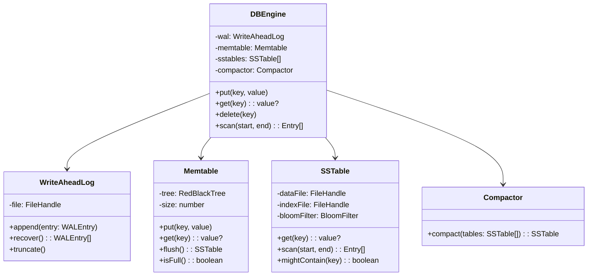
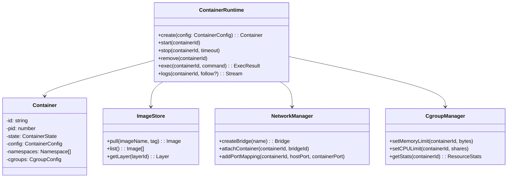
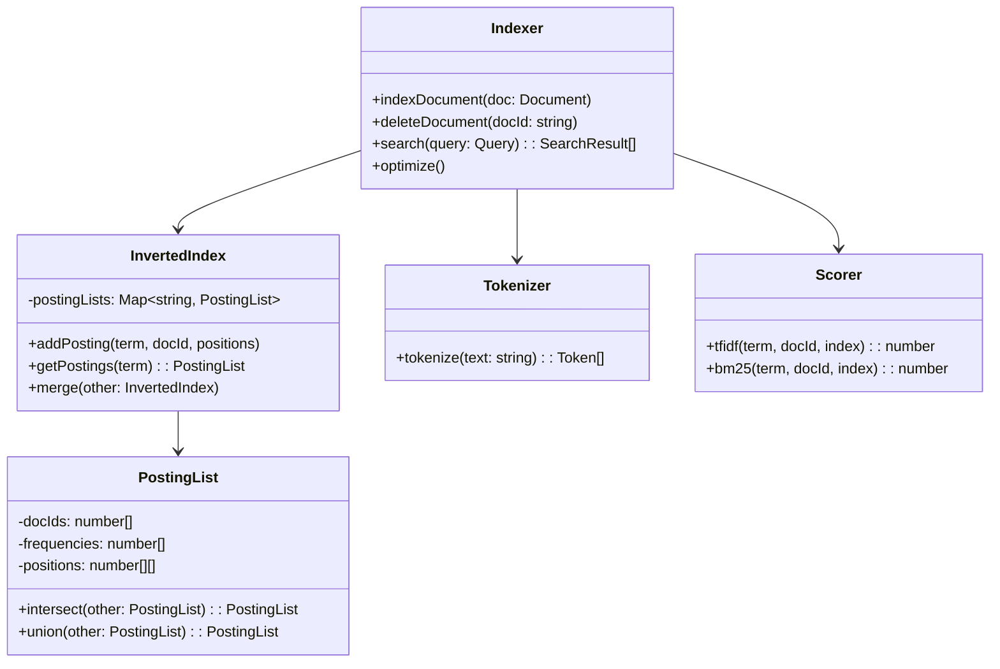
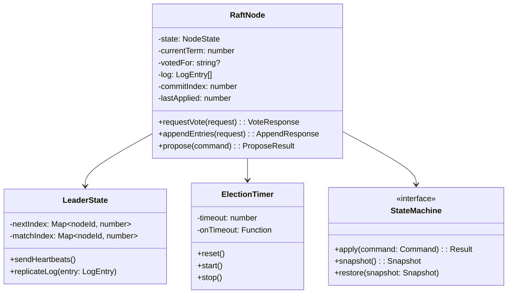

# LLD Practice: Hard

These 10 problems represent infrastructure-level components that software engineers build internally at companies like Google, Cloudflare, and Stripe. Each problem requires understanding of concurrency, I/O, networking, or storage internals. Target 60-90 minutes per problem. The focus shifts from "correct OOP" to "correct under concurrency and failure."

## Problem 1: Simple Database Engine

Design a key-value database engine with a write-ahead log, memtable, and SSTable-based storage (simplified LSM tree).

### Requirements

- `put(key, value)`, `get(key)`, `delete(key)` operations
- Write-ahead log (WAL) for crash recovery
- In-memory memtable (sorted) for recent writes
- Flush memtable to immutable SSTable files on disk
- Compaction: merge multiple SSTables to remove duplicates
- Bloom filter per SSTable to skip unnecessary reads
- Range queries: `scan(startKey, endKey)`

### Key Classes



### Complexity Analysis

| Operation | Memtable | SSTable Lookup | Overall |
|-----------|:--------:|:--------------:|:-------:|
| `put()` | O(log n) | N/A | O(log n) + WAL append |
| `get()` | O(log n) | O(log n) per level | O(log n * L) where L = levels |
| `delete()` | O(log n) | N/A (tombstone) | O(log n) + WAL append |
| `scan()` | O(log n + k) | Merge-sort across levels | O(L * log n + k) |
| Compaction | N/A | Merge L files | O(N) where N = total entries |

### Concurrency Considerations

- **WAL**: append-only, single writer (lock or lock-free append)
- **Memtable**: concurrent reads are safe during writes if using a concurrent skip list (like LevelDB)
- **SSTable**: immutable after creation — reads are always safe, no locks needed
- **Flush**: swap active memtable atomically — new writes go to fresh memtable while old one flushes to disk
- **Compaction**: runs in background thread, atomically swaps old SSTables for new merged one

See our [Storage Engines](/system-design/databases/storage-engines) and [Write-Ahead Logging](/system-design/databases/write-ahead-logging) pages.

---

## Problem 2: Minimal Web Framework

Design a web framework (like a simplified Express.js) with routing, middleware pipeline, request/response abstraction, and error handling.

### Requirements

- HTTP method-based routing: GET, POST, PUT, DELETE
- Route parameters: `/users/:id`
- Middleware pipeline: each middleware can modify request/response or short-circuit
- Error handling middleware
- Request body parsing (JSON, form data)
- Response helpers: `json()`, `send()`, `status()`, `redirect()`
- Static file serving

### Key Classes

```typescript
interface Framework {
  get(path: string, ...handlers: Handler[]): void;
  post(path: string, ...handlers: Handler[]): void;
  use(middleware: Middleware): void;
  use(path: string, middleware: Middleware): void;
  listen(port: number): void;
}

type Handler = (req: Request, res: Response, next: NextFunction) => void | Promise<void>;
type Middleware = Handler;
type NextFunction = (error?: Error) => void;

interface Router {
  addRoute(method: string, path: string, handlers: Handler[]): void;
  match(method: string, url: string): RouteMatch | null;
}

interface RouteMatch {
  handlers: Handler[];
  params: Record<string, string>;  // { id: "123" }
}
```

### Complexity Analysis

| Operation | Approach | Complexity |
|-----------|---------|:----------:|
| Route matching | Radix tree (trie) | O(path length) |
| Route matching | Linear scan | O(number of routes) |
| Middleware execution | Pipeline (array iteration) | O(number of middleware) |
| Parameter extraction | Regex groups | O(path length) |

### Concurrency Considerations

- Each request runs in its own context — no shared mutable state between requests
- Middleware must call `next()` or respond — framework should detect stuck middleware (timeout)
- Async handlers: wrap in try/catch, pass errors to error-handling middleware
- Static file serving: use streaming (not loading entire file into memory)

---

## Problem 3: Container Runtime (Simplified)

Design a simplified container runtime that manages container lifecycle, resource isolation, and networking.

### Requirements

- Create, start, stop, remove containers
- Image management: pull, list, layer-based storage
- Resource limits: CPU, memory
- Container networking: bridge mode, port mapping
- Volume mounting: host path → container path
- Container logs: stdout/stderr capture
- Health checks with configurable intervals

### Key Classes



### Complexity Analysis

- Container creation: O(number of layers) for overlay filesystem setup
- Start/stop: O(1) — send signal to process
- Image pull: O(total layer size) — network-bound
- Layer deduplication: O(1) lookup by content hash (content-addressable storage)

### Concurrency Considerations

- **State machine** for container lifecycle: `CREATED -> RUNNING -> STOPPED -> REMOVED`
- Container state transitions must be atomic — use locking per container ID
- Multiple containers share the same network bridge — bridge management needs synchronization
- Health check runner: single goroutine/thread per container, or shared pool with scheduling
- Log streaming: ring buffer per container, readers can attach/detach without affecting the container

See our [Docker Internals](/infrastructure/docker/internals) and [Containers from Scratch](/infrastructure/linux-internals/containers-from-scratch) pages.

---

## Problem 4: Distributed Lock Manager

Design a distributed lock service that provides mutual exclusion across multiple processes/machines.

### Requirements

- Acquire lock with timeout (blocks until acquired or timeout)
- Try-acquire (non-blocking, returns immediately)
- Release lock
- Lock expiry: auto-release if holder crashes
- Reentrant locks: same owner can acquire multiple times
- Fencing tokens: monotonically increasing token to prevent stale holders
- Watch mechanism: notify when lock becomes available

### Key Classes

```typescript
interface DistributedLockManager {
  acquire(lockId: string, options?: LockOptions): Promise<LockHandle>;
  tryAcquire(lockId: string): Promise<LockHandle | null>;
  release(handle: LockHandle): Promise<void>;
  isLocked(lockId: string): Promise<boolean>;
  watch(lockId: string, callback: () => void): Unsubscribe;
}

interface LockHandle {
  lockId: string;
  owner: string;       // Process/node identifier
  fencingToken: number; // Monotonically increasing
  expiresAt: number;
  renewalInterval: NodeJS.Timeout;
}

interface LockOptions {
  ttl: number;          // Lock expiry in ms
  timeout?: number;     // Wait timeout in ms
  retryInterval?: number;
  reentrant?: boolean;
}

// Redis-based implementation sketch
class RedisLockManager implements DistributedLockManager {
  // Uses SET NX EX for atomic acquire
  // Uses Lua script for atomic release (check owner then delete)
  // Uses WATCH + MULTI for fencing token generation
}
```

### Complexity Analysis

| Operation | Redis | ZooKeeper |
|-----------|:-----:|:---------:|
| Acquire | O(1) | O(log n) sequential nodes |
| Release | O(1) | O(1) delete ephemeral node |
| Watch | O(1) pub/sub | O(1) watch notification |
| Renewal | O(1) PEXPIRE | N/A (session-based) |

### Concurrency Considerations

- **Fencing tokens** prevent the critical bug: Process A acquires lock, gets paused by GC, lock expires, Process B acquires lock, Process A resumes and thinks it still holds the lock. With fencing tokens, the resource rejects operations with stale tokens.
- Lock renewal: background thread extends TTL periodically while lock is held
- Redlock controversy: single Redis instance is simpler and sufficient for most use cases. Redlock (multi-node) is debated — see Martin Kleppmann's analysis.
- **Split-brain**: if network partitions the lock service, two holders might exist simultaneously. Accept this limitation or use consensus-based locks (ZooKeeper, etcd).

See our [Distributed Locking](/system-design/distributed-systems/distributed-locking) page.

---

## Problem 5: Search Engine Indexer

Design the indexing component of a search engine that builds and queries an inverted index.

### Requirements

- Index documents: extract tokens, build inverted index
- Query types: single term, AND, OR, phrase queries
- TF-IDF scoring for relevance ranking
- Incremental indexing: add/update/delete documents without rebuilding
- Index segments: write-once segments, merge in background
- Tokenization: lowercase, stemming, stop word removal

### Key Classes



### Complexity Analysis

| Operation | Complexity | Notes |
|-----------|:----------:|-------|
| Index 1 document | O(tokens in doc) | Tokenize + insert into posting lists |
| Single term query | O(posting list length) | Iterate posting list, score each |
| AND query (2 terms) | O(min(list1, list2)) | Intersect sorted posting lists |
| OR query (2 terms) | O(list1 + list2) | Union sorted posting lists |
| Phrase query | O(min(lists) * avg positions) | Intersect + check adjacent positions |
| TF-IDF scoring | O(1) per doc | Precomputed term frequency + IDF |

### Concurrency Considerations

- Index segments are immutable after creation — reads need no locks
- Write buffer (in-memory index) handles new documents, periodically flushed to new segment
- Segment merge runs in background — atomically swap old segments for new merged one
- Search queries fan out across all segments, merge results by score
- Delete: mark document as deleted in a bitset, filter during search, physically remove during merge

See our [Elasticsearch Internals](/system-design/databases/elasticsearch-internals) page.

---

## Problem 6: In-Memory Message Broker

Design a message broker (simplified Kafka) with topics, partitions, consumer groups, and offset management.

### Requirements

- Topics with configurable number of partitions
- Producers append messages to partitions (by key hash or round-robin)
- Consumer groups: each message consumed by exactly one consumer in the group
- Offset tracking: consumers commit offsets, can replay from any offset
- Retention: time-based or size-based message expiry
- At-least-once delivery semantics
- Rebalancing when consumers join/leave a group

### Key Classes

```typescript
interface Broker {
  createTopic(name: string, partitions: number): void;
  produce(topic: string, key: string | null, value: Buffer): ProduceResult;
  subscribe(topic: string, groupId: string, handler: MessageHandler): Consumer;
  commitOffset(groupId: string, topic: string, partition: number, offset: number): void;
  seekToOffset(groupId: string, topic: string, partition: number, offset: number): void;
}

interface Partition {
  id: number;
  log: Message[];           // Append-only log
  highWatermark: number;    // Last committed offset
  retentionMs: number;
}

interface ConsumerGroup {
  id: string;
  members: Consumer[];
  assignments: Map<number, Consumer>;  // partition -> consumer
  offsets: Map<number, number>;        // partition -> committed offset
  rebalance(): void;
}
```

### Complexity Analysis

| Operation | Complexity |
|-----------|:----------:|
| Produce (append to partition) | O(1) amortized |
| Consume (read at offset) | O(1) random access |
| Rebalance (N consumers, P partitions) | O(P) reassignment |
| Offset commit | O(1) |
| Retention cleanup | O(expired messages) |

### Concurrency Considerations

- Each partition is single-writer: producer writes are serialized per partition
- Multiple consumers read different partitions concurrently — no contention
- Rebalancing: stop consumption, reassign partitions, resume — use a coordinator lock
- Offset commits: per-consumer-group, per-partition — no cross-partition coordination needed
- Message retention: background cleaner thread trims old messages per partition

See our [Kafka Internals](/system-design/message-queues/kafka-internals) page.

---

## Problem 7: API Gateway

Design an API gateway that routes requests, handles authentication, rate limiting, and circuit breaking.

### Requirements

- Route requests to backend services based on path, method, headers
- Authentication: JWT validation, API key lookup
- Rate limiting per client, per route
- Circuit breaker per backend service
- Request/response transformation
- Load balancing across backend instances
- Request logging and metrics

### Key Classes

```typescript
interface APIGateway {
  registerRoute(route: RouteConfig): void;
  handleRequest(req: IncomingRequest): Promise<GatewayResponse>;
}

interface RouteConfig {
  path: string;           // "/api/v1/orders/*"
  methods: string[];
  backend: BackendConfig;
  middleware: MiddlewareConfig[];
  rateLimit?: RateLimitConfig;
  auth?: AuthConfig;
  circuitBreaker?: CircuitBreakerConfig;
  transform?: TransformConfig;
}

// Middleware pipeline: Auth -> RateLimit -> Transform -> CircuitBreaker -> Proxy -> Transform Response
type MiddlewarePipeline = (req: GatewayRequest) => Promise<GatewayResponse>;
```

### Concurrency Considerations

- Request handling must be fully concurrent — thousands of simultaneous requests
- Rate limiter state must be thread-safe (atomic counters or Redis)
- Circuit breaker state transitions must be atomic (compare-and-swap)
- Route table updates (hot reload) must be atomic — swap entire routing table, no mid-request inconsistency
- Connection pooling to backends — reuse TCP connections per backend

See our [API Gateway vs Service Mesh](/system-design/advanced/api-gateway-vs-mesh) page.

---

## Problem 8: Load Balancer

Design an L7 load balancer with multiple algorithms, health checking, session affinity, and graceful draining.

### Requirements

- Algorithms: round-robin, weighted round-robin, least connections, consistent hashing
- Health checking: active (periodic HTTP checks) and passive (track failure rates)
- Session affinity: sticky sessions by cookie or IP
- Connection draining: stop sending new requests to a backend, wait for existing to complete
- Dynamic backend registration/deregistration
- Request queuing when all backends are busy

### Key Classes

```typescript
interface LoadBalancer {
  addBackend(backend: Backend): void;
  removeBackend(backendId: string): void;
  selectBackend(request: Request): Backend;
  drain(backendId: string, timeout: number): Promise<void>;
}

interface LoadBalancingAlgorithm {
  select(backends: Backend[], request: Request): Backend;
}

interface HealthChecker {
  start(backends: Backend[]): void;
  isHealthy(backendId: string): boolean;
  onHealthChange(callback: (backendId: string, healthy: boolean) => void): void;
}

interface Backend {
  id: string;
  address: string;
  port: number;
  weight: number;
  activeConnections: number;
  healthy: boolean;
  draining: boolean;
}
```

### Complexity Analysis

| Algorithm | Select | Add/Remove Backend |
|-----------|:------:|:-----------------:|
| Round-Robin | O(1) | O(1) |
| Weighted Round-Robin | O(1) amortized | O(N) rebuild weights |
| Least Connections | O(N) scan or O(log N) heap | O(log N) |
| Consistent Hashing | O(log V) binary search virtual nodes | O(V log V) rebuild ring |

### Concurrency Considerations

- Backend selection must handle concurrent requests — atomic counter for round-robin
- Active connection tracking: atomic increment/decrement per backend
- Health check results: eventually consistent is fine — a few requests to an unhealthy backend is acceptable
- Connection draining: mark backend as draining, track in-flight requests, complete when all finish or timeout

See our [Load Balancing Algorithms](/system-design/load-balancing/algorithms) and [Health Checks](/system-design/load-balancing/health-checks) pages.

---

## Problem 9: Cron Scheduler

Design a cron scheduler that manages scheduled jobs with cron expressions, persistence, and distributed execution.

### Requirements

- Parse cron expressions (minute, hour, day, month, day-of-week)
- Register/unregister jobs
- Execute jobs at scheduled times with second-level precision
- Missed job detection: if scheduler was down, run missed jobs on startup
- Distributed: multiple scheduler instances, each job runs on exactly one instance
- Job history: track execution results, duration, failures
- Retry failed jobs with configurable policy

### Key Classes

```typescript
interface CronScheduler {
  schedule(jobId: string, cronExpr: string, handler: JobHandler): void;
  unschedule(jobId: string): void;
  getNextRunTime(jobId: string): Date;
  getJobHistory(jobId: string, limit?: number): JobExecution[];
  pause(jobId: string): void;
  resume(jobId: string): void;
}

interface CronExpression {
  minutes: Set<number>;  // 0-59
  hours: Set<number>;    // 0-23
  daysOfMonth: Set<number>; // 1-31
  months: Set<number>;   // 1-12
  daysOfWeek: Set<number>; // 0-6
  nextAfter(date: Date): Date;
  matches(date: Date): boolean;
}

interface JobExecution {
  jobId: string;
  scheduledAt: Date;
  startedAt: Date;
  completedAt?: Date;
  status: 'running' | 'completed' | 'failed';
  result?: unknown;
  error?: string;
  executorId: string;  // Which scheduler instance ran it
}
```

### Complexity Analysis

- Cron expression parsing: O(1) — fixed 5-field format
- Next run time calculation: O(days in search range) worst case, O(1) average
- Job selection: O(N) scan all jobs, or O(log N) with priority queue ordered by next run time
- Distributed lock acquisition: O(1) with Redis

### Concurrency Considerations

- **Distributed execution**: use a distributed lock per job — only one instance executes each job
- **Leader election** alternative: elect one scheduler as leader, it assigns jobs to workers
- **Missed jobs**: on startup, check for jobs whose `nextRunTime < now` and `lastExecution < nextRunTime`
- **Clock skew**: in distributed mode, use a shared time source or accept small windows of overlap
- **Idempotent jobs**: since distributed locks can fail, jobs should be safe to run twice

---

## Problem 10: Consensus Module

Design a simplified Raft consensus module that achieves agreement across a cluster of nodes.

### Requirements

- Leader election with randomized timeouts
- Log replication from leader to followers
- Commit entries when majority acknowledges
- Handle leader failure and re-election
- Handle network partitions
- Snapshot and log compaction
- Membership changes (add/remove nodes)

### Key Classes



### Key Data Structures

```typescript
interface LogEntry {
  term: number;
  index: number;
  command: Command;
}

interface RequestVoteRPC {
  term: number;
  candidateId: string;
  lastLogIndex: number;
  lastLogTerm: number;
}

interface AppendEntriesRPC {
  term: number;
  leaderId: string;
  prevLogIndex: number;
  prevLogTerm: number;
  entries: LogEntry[];
  leaderCommit: number;
}

type NodeState = 'FOLLOWER' | 'CANDIDATE' | 'LEADER';
```

### Concurrency Considerations

- **Single-threaded event loop** per node: process one RPC at a time to avoid concurrency bugs in state transitions
- **Election timeout**: randomized (150-300ms) to avoid split votes
- **Log persistence**: entries must be fsynced to disk before acknowledging — crash recovery depends on it
- **Committed entries**: once committed (majority acknowledged), they are never lost — this is the core safety guarantee
- **Membership changes**: use joint consensus (Raft Section 6) — never have two independent majorities

See our [Raft Full Walkthrough](/system-design/consensus/raft-full-walkthrough) page.

## Difficulty Progression

| Problem | Core Challenge | Key Skill |
|---------|---------------|-----------|
| Database Engine | Storage I/O, immutable data structures | Systems programming |
| Web Framework | Middleware composition, routing | API design |
| Container Runtime | OS abstractions, resource management | Linux internals |
| Distributed Lock | Correctness under failure | Distributed systems |
| Search Indexer | Inverted index, relevance scoring | Information retrieval |
| Message Broker | Partitioned log, consumer groups | Streaming systems |
| API Gateway | Plugin pipeline, resilience | Networking |
| Load Balancer | Selection algorithms, health tracking | Networking |
| Cron Scheduler | Time handling, distributed coordination | Reliability |
| Consensus Module | Safety and liveness guarantees | Distributed consensus |

## Related Pages

- [LLD Practice: Easy](/lld-interviews/practice-easy) — foundational patterns
- [LLD Practice: Medium](/lld-interviews/practice-medium) — domain-level problems
- [LLD Interview Guide](/lld-interviews/) — methodology and approach
- [Storage Engines](/system-design/databases/storage-engines) — LSM trees and B-trees in detail
- [Kafka Internals](/system-design/message-queues/kafka-internals) — real-world message broker
- [Raft Full Walkthrough](/system-design/consensus/raft-full-walkthrough) — consensus in depth
- [Docker Internals](/infrastructure/docker/internals) — real container runtime
