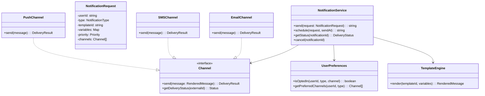
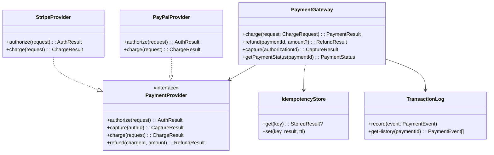
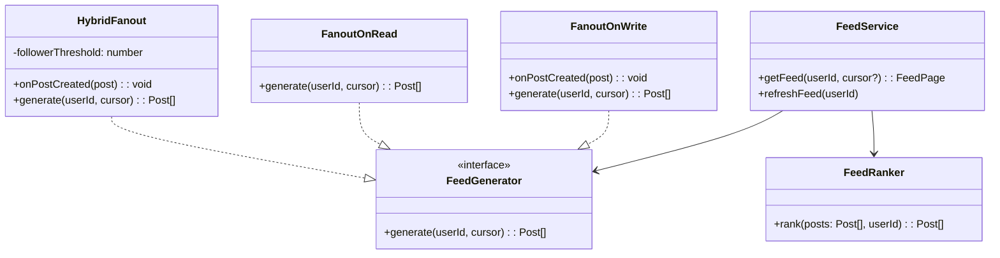
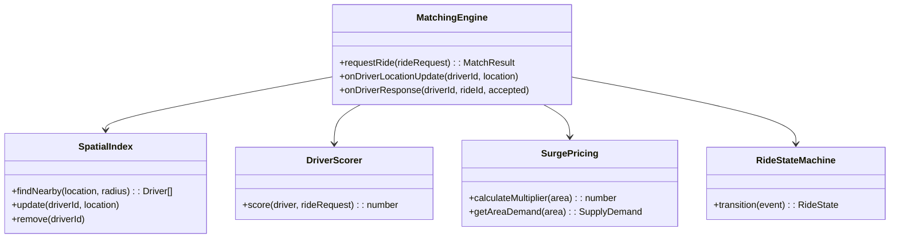
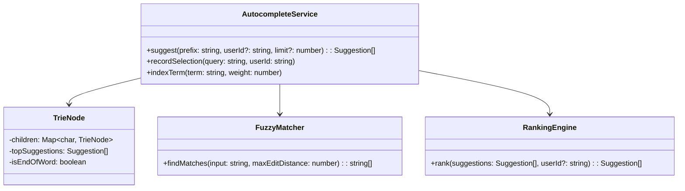
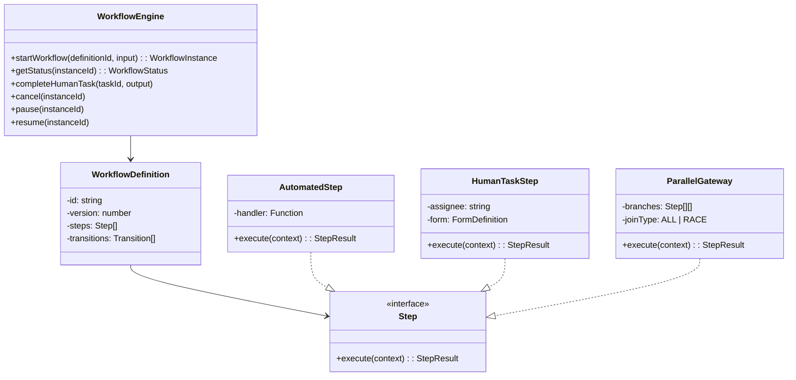

# LLD Practice: Medium

These 10 problems introduce real-world complexity: multiple stakeholders, concurrent access, state machines, and integration with external systems. Each problem should take 45-60 minutes. Focus on the core domain model first, then layer in cross-cutting concerns like concurrency and error handling.

## Problem 1: Notification System

Design a notification system that sends messages across multiple channels (email, SMS, push, in-app) with templates, scheduling, user preferences, and delivery tracking.

### Requirements

- Multiple channels: Email, SMS, Push Notification, In-App
- Template engine with variable substitution
- User notification preferences (opt-in/opt-out per channel per notification type)
- Priority levels: LOW, MEDIUM, HIGH, CRITICAL
- Scheduling: send now or schedule for later
- Delivery tracking: sent, delivered, failed, read
- Rate limiting per user per channel
- Retry failed deliveries with backoff

### Key Classes



### Design Hints

- **Strategy Pattern** for channels — each channel implements `send()` differently
- **Template Method** for the notification pipeline: validate → check preferences → render template → rate check → send → track
- **Observer Pattern** for delivery status updates — webhook callbacks from providers
- Priority queue for send ordering: CRITICAL notifications skip the queue
- State machine for delivery status: `PENDING -> SENT -> DELIVERED -> READ` or `PENDING -> SENT -> FAILED -> RETRY -> ...`

---

## Problem 2: Payment Gateway Abstraction

Design an abstraction layer over multiple payment providers (Stripe, PayPal, Razorpay) with unified interface, automatic failover, and transaction management.

### Requirements

- Unified API for charge, refund, capture, cancel
- Multiple payment methods: card, bank transfer, wallet
- Provider selection: primary + fallback
- Idempotency: same payment request must not charge twice
- Webhook handling for async payment updates
- Transaction log with audit trail
- PCI compliance: never store full card numbers

### Key Classes



### Design Hints

- **Adapter Pattern** for payment providers — normalize different APIs to a common interface
- **State Machine** for payment lifecycle: `CREATED -> AUTHORIZED -> CAPTURED -> SETTLED` or `CREATED -> AUTHORIZED -> VOIDED`
- Idempotency key stored in a map: before processing, check if this key was already processed and return cached result
- Failover: if primary provider returns a network error (not a business error like "card declined"), retry with the fallback provider
- Never store raw card details — use tokenized references from the provider

---

## Problem 3: Social Media Feed

Design the feed generation system for a social media platform that supports posts, follows, likes, and algorithmic ranking.

### Requirements

- Users can create posts (text, image, video)
- Follow/unfollow users
- Generate personalized feed from followed users' posts
- Feed strategies: chronological and ranked (by engagement)
- Pagination with cursor-based pagination
- Feed pre-generation (fanout-on-write) vs on-demand (fanout-on-read)
- Support for celebrities (millions of followers)

### Key Classes



### Design Hints

- **Hybrid fanout**: regular users use fanout-on-write (pre-compute feeds), celebrities use fanout-on-read (too expensive to write to millions of follower feeds)
- The threshold is typically around 10K-50K followers
- **Strategy Pattern** for feed generation — switch between chronological and ranked
- Cursor-based pagination: use `(timestamp, postId)` as cursor for stable pagination
- Feed cache: pre-computed feeds stored in Redis sorted sets (`ZRANGEBYSCORE` for cursor queries)
- Ranking signals: recency, engagement (likes/comments), author affinity, content type preference

---

## Problem 4: Ride Matching Engine

Design the matching engine that pairs riders with nearby drivers in a ride-hailing application.

### Requirements

- Riders request rides with pickup and destination locations
- Drivers broadcast location every few seconds
- Match rider to best available driver based on: distance, ETA, rating, acceptance rate
- Driver can accept or decline (timeout: 15 seconds)
- If declined, offer to next best driver
- Surge pricing based on supply/demand ratio in an area
- Support for ride types: economy, premium, shared

### Key Classes



### Design Hints

- **Geospatial index** for driver locations — use a grid/quadtree or H3 hex cells for O(1) nearby lookups
- **Scoring function**: `score = w1 * (1/distance) + w2 * rating + w3 * acceptanceRate + w4 * (1/eta)`
- **State Machine** for ride lifecycle: `REQUESTED -> MATCHING -> DRIVER_ASSIGNED -> PICKUP -> IN_RIDE -> COMPLETED`
- Driver offer chain: sort drivers by score, offer to top driver, if timeout/decline, offer to next
- Surge: grid the city into zones, track request rate vs available drivers per zone, adjust multiplier

---

## Problem 5: Order Management System

Design an order management system that handles order creation, payment, fulfillment, and refunds with proper state management.

### Requirements

- Order lifecycle: create, pay, fulfill, ship, deliver, return, refund
- Multiple items per order from different sellers
- Order splitting: if items ship from different warehouses, create sub-orders
- Inventory reservation during checkout
- Cancellation rules: can cancel before shipping, partial cancel after
- Refund calculation: item price, shipping, discounts, taxes

### Key Classes

```typescript
interface OrderService {
  createOrder(cart: Cart, userId: string): Promise<Order>;
  processPayment(orderId: string, paymentMethod: PaymentMethod): Promise<PaymentResult>;
  cancelOrder(orderId: string, reason: string): Promise<CancellationResult>;
  requestRefund(orderId: string, items: RefundItem[]): Promise<RefundResult>;
}

// State machine with allowed transitions
type OrderState = 'CREATED' | 'PAYMENT_PENDING' | 'PAID' | 'PROCESSING' |
                  'PARTIALLY_SHIPPED' | 'SHIPPED' | 'DELIVERED' |
                  'RETURN_REQUESTED' | 'RETURNED' | 'REFUNDED' | 'CANCELLED';

// Order splitting
interface SubOrder {
  id: string;
  parentOrderId: string;
  sellerId: string;
  warehouseId: string;
  items: OrderItem[];
  status: OrderState;
  shippingInfo?: ShippingInfo;
}
```

### Design Hints

- **State Machine Pattern** — define valid transitions and guards (cannot ship a cancelled order)
- **Strategy Pattern** for refund calculation — different rules for full refund, partial, restocking fee
- Order splitting: group items by warehouse/seller, create sub-orders with independent lifecycles
- Inventory reservation: reserve on order creation, release on cancellation, deduct on shipment
- Use the **Saga Pattern** for the checkout flow: create order -> reserve inventory -> process payment -> confirm

---

## Problem 6: Inventory Management System

Design an inventory system that tracks stock levels across multiple warehouses with reservation, allocation, and low-stock alerts.

### Requirements

- Multi-warehouse inventory tracking
- Stock operations: add, remove, reserve, release, transfer
- Reservation system: hold stock for N minutes during checkout
- Automatic allocation: choose warehouse closest to customer
- Low stock alerts with configurable thresholds
- Batch import/export of inventory data
- Audit trail for all stock movements

### Key Classes

```typescript
interface InventoryService {
  getStock(productId: string, warehouseId?: string): StockLevel;
  reserve(productId: string, quantity: number, warehouseId?: string): Reservation;
  releaseReservation(reservationId: string): void;
  commitReservation(reservationId: string): void;
  transfer(productId: string, quantity: number, fromWarehouse: string, toWarehouse: string): Transfer;
}

interface StockLevel {
  productId: string;
  warehouseId: string;
  available: number;    // physical - reserved
  reserved: number;     // held for pending orders
  physical: number;     // actual count in warehouse
  incoming: number;     // in-transit from supplier
}
```

### Design Hints

- `available = physical - reserved` — never let available go below zero
- Reservation expiry: background job releases expired reservations
- Warehouse selection: **Strategy Pattern** — closest distance, lowest cost, balanced load
- Optimistic locking for concurrent stock updates: `UPDATE inventory SET stock = stock - 1 WHERE product_id = $1 AND stock >= 1`
- Event-driven alerts: publish `stock.low` event when available drops below threshold

---

## Problem 7: Booking Calendar

Design a calendar system for a service business (salon, clinic, consultancy) that handles slot-based bookings, availability, and conflicts.

### Requirements

- Service providers define availability (weekly schedule + exceptions)
- Clients book time slots for specific services
- Services have different durations (30 min, 60 min, etc.)
- Prevent double-booking (concurrent booking safety)
- Buffer time between appointments
- Recurring availability with holiday overrides
- Cancellation and rescheduling with configurable policies

### Key Classes

```typescript
interface BookingService {
  getAvailableSlots(providerId: string, date: Date, serviceId: string): TimeSlot[];
  book(slot: TimeSlot, clientId: string, serviceId: string): Booking;
  cancel(bookingId: string): CancelResult;
  reschedule(bookingId: string, newSlot: TimeSlot): Booking;
}

interface AvailabilityRule {
  providerId: string;
  dayOfWeek: number;       // 0-6
  startTime: string;       // "09:00"
  endTime: string;         // "17:00"
  bufferMinutes: number;   // 15 min between appointments
}

interface TimeSlot {
  start: Date;
  end: Date;
  providerId: string;
  available: boolean;
}
```

### Design Hints

- Slot generation: generate all possible slots from availability rules, subtract booked slots
- Conflict detection: `new_start < existing_end AND new_end > existing_start` means overlap
- Pessimistic locking: `SELECT ... FOR UPDATE` when creating a booking to prevent double-booking
- Buffer time: extend each booking by buffer minutes when checking for conflicts
- Recurring rules: generate slots from weekly schedule, then apply exception overrides (holidays, time-off)

---

## Problem 8: Search Autocomplete

Design a search autocomplete system that suggests completions as the user types, with ranking, personalization, and typo tolerance.

### Requirements

- Return top 5-10 suggestions as user types each character
- Ranking: popularity, recency, personalization
- Typo tolerance (fuzzy matching)
- Response time: < 50ms
- Support for phrase suggestions (multi-word)
- Filter inappropriate suggestions
- Learning from user selections (boost selected suggestions)

### Key Classes



### Design Hints

- **Trie data structure** for prefix matching — store pre-computed top-K suggestions at each node
- When a new search becomes popular, update top-K at affected trie nodes
- Fuzzy matching: Levenshtein distance for edit distance 1-2, or BK-tree for efficient fuzzy search
- Ranking score: `score = popularity * recency_decay * (1 + personalization_boost)`
- Content filtering: maintain a blocklist trie, reject suggestions that match
- Optimization: pre-compute suggestions at each trie node, so lookup is O(prefix_length), not O(prefix_length + sorting)

---

## Problem 9: File Storage Service

Design a file storage service (like a simplified S3) with upload, download, metadata, versioning, and access control.

### Requirements

- Upload files of any size (up to 5GB)
- Multipart upload for large files
- Download with range requests (resume interrupted downloads)
- File metadata: name, size, content type, tags, custom metadata
- Versioning: keep previous versions, restore to any version
- Access control: public, private, shared with specific users
- Deduplication: don't store duplicate files twice

### Key Classes

```typescript
interface FileStorageService {
  upload(file: FileUploadRequest): Promise<FileObject>;
  initiateMultipartUpload(metadata: FileMetadata): Promise<UploadSession>;
  uploadPart(sessionId: string, partNumber: number, data: Buffer): Promise<PartResult>;
  completeMultipartUpload(sessionId: string, parts: PartResult[]): Promise<FileObject>;
  download(fileId: string, range?: ByteRange): Promise<ReadableStream>;
  getMetadata(fileId: string): Promise<FileMetadata>;
  listVersions(fileId: string): Promise<FileVersion[]>;
  restoreVersion(fileId: string, versionId: string): Promise<FileObject>;
  share(fileId: string, userId: string, permission: Permission): Promise<ShareLink>;
}

interface FileObject {
  id: string;
  name: string;
  size: number;
  contentType: string;
  checksum: string;     // SHA-256 for dedup
  versionId: string;
  createdAt: Date;
  owner: string;
  storageLocation: string; // Internal path
}
```

### Design Hints

- Content-addressable storage for dedup: `storageKey = SHA-256(fileContent)`, if key exists, just add a reference
- Multipart upload: split file into chunks (5-100MB each), upload independently, reassemble on complete
- Versioning: each upload creates a new version; previous versions remain until explicitly deleted
- Access control: **RBAC** at the file/folder level — owner, editor, viewer roles
- Range requests: respond with HTTP 206 Partial Content, read specific byte range from storage

---

## Problem 10: Workflow Engine

Design a workflow engine that executes multi-step business processes with branching, parallel execution, human tasks, and error handling.

### Requirements

- Define workflows as DAGs with steps, conditions, and parallel branches
- Step types: automated (code), human task (approval), timer (wait), sub-workflow
- Conditional branching: if/else, switch based on step output
- Parallel execution with join (wait for all) or race (wait for first)
- Timeout and retry per step
- Workflow versioning: running workflows continue with old version
- Pause, resume, and cancel running workflows

### Key Classes



### Design Hints

- **State Machine** for workflow instance status: `CREATED -> RUNNING -> PAUSED -> COMPLETED | FAILED | CANCELLED`
- **Command Pattern** for steps — each step encapsulates an operation that can be executed, retried, or compensated
- Workflow execution: iterate through steps following transitions, evaluate conditions at gateways
- Persistence: save workflow state after each step completion — enables resume after crash
- Human tasks: create a "task inbox" for the assignee, workflow pauses until task is completed
- Parallel gateway: fork creates N concurrent step chains, join waits for all (or first) to complete

## Progression Guide

| Problem | Key Pattern | Real-World System |
|---------|-----------|-------------------|
| Notification System | Strategy + Pipeline | SendGrid, Twilio |
| Payment Gateway | Adapter + State Machine | Stripe, Adyen |
| Social Media Feed | Fanout + Caching | Twitter, Instagram |
| Ride Matching | Spatial Index + Scoring | Uber, Lyft |
| Order Management | State Machine + Saga | Shopify, Amazon |
| Inventory System | Locking + Events | Warehouse systems |
| Booking Calendar | Conflict Detection | Calendly, Doctolib |
| Search Autocomplete | Trie + Ranking | Google Search, Algolia |
| File Storage | Content-Addressable Storage | S3, GCS |
| Workflow Engine | DAG + State Machine | Temporal, Airflow |

## Related Pages

- [LLD Practice: Easy](/lld-interviews/practice-easy) — foundational building blocks
- [LLD Practice: Hard](/lld-interviews/practice-hard) — infrastructure-level problems
- [LLD Interview Guide](/lld-interviews/) — approach and methodology
- [Parking Lot](/lld-interviews/parking-lot) — detailed walkthrough example
- [Movie Booking](/lld-interviews/movie-booking) — another medium problem with walkthrough
