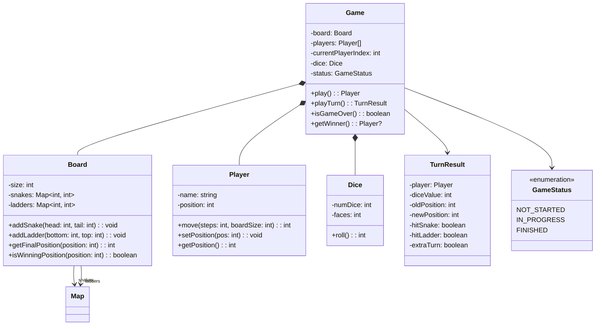

# Design Snake & Ladders

Snake & Ladders is a classic LLD interview problem that tests your ability to model a turn-based game with state transitions, randomness (dice), and simple rules. The key design challenges are separating the game engine from the board configuration and handling edge cases like exact-finish rules.

## Requirements & Use Cases

### Functional Requirements

1. Board of configurable size (default: 10x10 = 100 cells)
2. Configurable snakes (head → tail, moves player down) and ladders (bottom → top, moves player up)
3. 2-4 players take turns
4. Single standard die (1-6) per roll; optionally support two dice
5. Player starts at position 0 (off the board), must reach exactly position 100 to win
6. If roll would exceed 100, player stays in place
7. Rolling a 6 grants an extra turn
8. First player to reach position 100 wins

### Non-Functional Requirements

- Deterministic game logic (given same dice rolls, same outcome)
- Extensible for custom rules (special cells, power-ups)
- Board configuration validated (no cyclic snakes/ladders)

### Use Cases

| Actor | Use Case |
|-------|---------|
| Player | Roll the dice |
| Player | Move token to new position |
| System | Apply snake (move down) or ladder (move up) |
| System | Grant extra turn on rolling 6 |
| System | Detect winner |
| System | Prevent invalid board configurations |

## Class Diagram



## Core Classes & Interfaces

### TypeScript Implementation

```typescript
// ─── Enums ───────────────────────────────────────────────

enum GameStatus {
  NOT_STARTED = 'NOT_STARTED',
  IN_PROGRESS = 'IN_PROGRESS',
  FINISHED = 'FINISHED',
}

// ─── Turn Result ─────────────────────────────────────────

interface TurnResult {
  player: string;
  diceValue: number;
  oldPosition: number;
  intermediatePosition: number; // before snake/ladder
  newPosition: number;         // after snake/ladder
  hitSnake: boolean;
  hitLadder: boolean;
  extraTurn: boolean;
  won: boolean;
}

// ─── Dice ────────────────────────────────────────────────

class Dice {
  constructor(
    private numDice: number = 1,
    private faces: number = 6
  ) {}

  roll(): number {
    let total = 0;
    for (let i = 0; i < this.numDice; i++) {
      total += Math.floor(Math.random() * this.faces) + 1;
    }
    return total;
  }
}

// Deterministic dice for testing
class FixedDice extends Dice {
  private rolls: number[];
  private index: number = 0;

  constructor(rolls: number[]) {
    super(1, 6);
    this.rolls = rolls;
  }

  roll(): number {
    if (this.index >= this.rolls.length) {
      throw new Error('No more pre-configured rolls');
    }
    return this.rolls[this.index++];
  }
}

// ─── Player ──────────────────────────────────────────────

class Player {
  private position: number = 0;

  constructor(public readonly name: string) {}

  getPosition(): number {
    return this.position;
  }

  setPosition(pos: number): void {
    this.position = pos;
  }

  /**
   * Calculate new position after rolling.
   * If the new position exceeds boardSize, stay in place.
   */
  move(steps: number, boardSize: number): number {
    const newPos = this.position + steps;
    if (newPos > boardSize) {
      return this.position; // can't exceed board
    }
    this.position = newPos;
    return this.position;
  }
}

// ─── Board ───────────────────────────────────────────────

class Board {
  private snakes: Map<number, number> = new Map();
  private ladders: Map<number, number> = new Map();

  constructor(public readonly size: number = 100) {}

  addSnake(head: number, tail: number): void {
    if (head <= tail) {
      throw new Error(`Snake head (${head}) must be above tail (${tail})`);
    }
    if (head > this.size || tail < 1) {
      throw new Error('Snake positions must be within the board');
    }
    if (this.ladders.has(head) || this.snakes.has(head)) {
      throw new Error(`Position ${head} already has a snake or ladder`);
    }
    this.snakes.set(head, tail);
  }

  addLadder(bottom: number, top: number): void {
    if (bottom >= top) {
      throw new Error(`Ladder bottom (${bottom}) must be below top (${top})`);
    }
    if (top > this.size || bottom < 1) {
      throw new Error('Ladder positions must be within the board');
    }
    if (this.snakes.has(bottom) || this.ladders.has(bottom)) {
      throw new Error(`Position ${bottom} already has a snake or ladder`);
    }
    this.ladders.set(bottom, top);
  }

  /**
   * Apply snakes and ladders to get the final resting position.
   * Returns { position, hitSnake, hitLadder }.
   */
  getFinalPosition(position: number): {
    position: number;
    hitSnake: boolean;
    hitLadder: boolean;
  } {
    if (this.snakes.has(position)) {
      return {
        position: this.snakes.get(position)!,
        hitSnake: true,
        hitLadder: false,
      };
    }
    if (this.ladders.has(position)) {
      return {
        position: this.ladders.get(position)!,
        hitSnake: false,
        hitLadder: true,
      };
    }
    return { position, hitSnake: false, hitLadder: false };
  }

  isWinningPosition(position: number): boolean {
    return position === this.size;
  }

  getSnakes(): Map<number, number> {
    return new Map(this.snakes);
  }

  getLadders(): Map<number, number> {
    return new Map(this.ladders);
  }
}

// ─── Game ────────────────────────────────────────────────

class Game {
  private board: Board;
  private players: Player[];
  private currentPlayerIndex: number = 0;
  private dice: Dice;
  private status: GameStatus = GameStatus.NOT_STARTED;
  private winner: Player | null = null;
  private turnHistory: TurnResult[] = [];

  constructor(
    playerNames: string[],
    board: Board = new Board(),
    dice: Dice = new Dice()
  ) {
    if (playerNames.length < 2 || playerNames.length > 4) {
      throw new Error('Game requires 2-4 players');
    }
    this.players = playerNames.map((name) => new Player(name));
    this.board = board;
    this.dice = dice;
  }

  getStatus(): GameStatus {
    return this.status;
  }

  getWinner(): Player | null {
    return this.winner;
  }

  getCurrentPlayer(): Player {
    return this.players[this.currentPlayerIndex];
  }

  /** Play a single turn for the current player */
  playTurn(): TurnResult {
    if (this.status === GameStatus.FINISHED) {
      throw new Error('Game is already finished');
    }
    this.status = GameStatus.IN_PROGRESS;

    const player = this.getCurrentPlayer();
    const diceValue = this.dice.roll();
    const oldPosition = player.getPosition();

    // Move player
    const intermediatePosition = player.move(diceValue, this.board.size);

    // Apply snakes/ladders
    let hitSnake = false;
    let hitLadder = false;
    let newPosition = intermediatePosition;

    if (intermediatePosition !== oldPosition) {
      // Only apply if player actually moved (didn't exceed board)
      const result = this.board.getFinalPosition(intermediatePosition);
      newPosition = result.position;
      hitSnake = result.hitSnake;
      hitLadder = result.hitLadder;
      player.setPosition(newPosition);
    }

    // Check win condition
    const won = this.board.isWinningPosition(newPosition);
    if (won) {
      this.status = GameStatus.FINISHED;
      this.winner = player;
    }

    // Extra turn on rolling 6 (single die only)
    const extraTurn = diceValue === 6 && !won;

    const turnResult: TurnResult = {
      player: player.name,
      diceValue,
      oldPosition,
      intermediatePosition,
      newPosition,
      hitSnake,
      hitLadder,
      extraTurn,
      won,
    };

    this.turnHistory.push(turnResult);

    // Advance to next player (unless extra turn)
    if (!extraTurn) {
      this.currentPlayerIndex =
        (this.currentPlayerIndex + 1) % this.players.length;
    }

    return turnResult;
  }

  /** Play the entire game until someone wins */
  play(): Player {
    while (this.status !== GameStatus.FINISHED) {
      this.playTurn();
    }
    return this.winner!;
  }

  getTurnHistory(): TurnResult[] {
    return [...this.turnHistory];
  }

  getPlayerPositions(): Array<{ name: string; position: number }> {
    return this.players.map((p) => ({
      name: p.name,
      position: p.getPosition(),
    }));
  }
}

// ─── Usage Example ───────────────────────────────────────

function createStandardGame(playerNames: string[]): Game {
  const board = new Board(100);

  // Snakes
  board.addSnake(99, 9);
  board.addSnake(95, 56);
  board.addSnake(62, 18);
  board.addSnake(48, 11);
  board.addSnake(36, 6);

  // Ladders
  board.addLadder(2, 38);
  board.addLadder(7, 14);
  board.addLadder(15, 31);
  board.addLadder(28, 84);
  board.addLadder(51, 67);
  board.addLadder(71, 91);

  return new Game(playerNames, board);
}
```

### Python Implementation

```python
from abc import ABC, abstractmethod
from dataclasses import dataclass, field
from enum import Enum
from typing import Optional
import random


# ─── Enums ──────────────────────────────────────────────

class GameStatus(Enum):
    NOT_STARTED = "NOT_STARTED"
    IN_PROGRESS = "IN_PROGRESS"
    FINISHED = "FINISHED"


# ─── Turn Result ────────────────────────────────────────

@dataclass
class TurnResult:
    player: str
    dice_value: int
    old_position: int
    intermediate_position: int
    new_position: int
    hit_snake: bool
    hit_ladder: bool
    extra_turn: bool
    won: bool


# ─── Dice ───────────────────────────────────────────────

class Dice:
    def __init__(self, num_dice: int = 1, faces: int = 6):
        self._num_dice = num_dice
        self._faces = faces

    def roll(self) -> int:
        return sum(
            random.randint(1, self._faces) for _ in range(self._num_dice)
        )


class FixedDice(Dice):
    """Deterministic dice for testing."""

    def __init__(self, rolls: list[int]):
        super().__init__()
        self._rolls = rolls
        self._index = 0

    def roll(self) -> int:
        if self._index >= len(self._rolls):
            raise ValueError("No more pre-configured rolls")
        value = self._rolls[self._index]
        self._index += 1
        return value


# ─── Player ─────────────────────────────────────────────

class Player:
    def __init__(self, name: str):
        self.name = name
        self._position = 0

    @property
    def position(self) -> int:
        return self._position

    @position.setter
    def position(self, value: int) -> None:
        self._position = value

    def move(self, steps: int, board_size: int) -> int:
        new_pos = self._position + steps
        if new_pos > board_size:
            return self._position  # stay in place
        self._position = new_pos
        return self._position


# ─── Board ──────────────────────────────────────────────

class Board:
    def __init__(self, size: int = 100):
        self.size = size
        self._snakes: dict[int, int] = {}
        self._ladders: dict[int, int] = {}

    def add_snake(self, head: int, tail: int) -> None:
        if head <= tail:
            raise ValueError(f"Snake head ({head}) must be above tail ({tail})")
        if head > self.size or tail < 1:
            raise ValueError("Snake positions must be within the board")
        if head in self._ladders or head in self._snakes:
            raise ValueError(f"Position {head} already occupied")
        self._snakes[head] = tail

    def add_ladder(self, bottom: int, top: int) -> None:
        if bottom >= top:
            raise ValueError(f"Ladder bottom ({bottom}) must be below top ({top})")
        if top > self.size or bottom < 1:
            raise ValueError("Ladder positions must be within the board")
        if bottom in self._snakes or bottom in self._ladders:
            raise ValueError(f"Position {bottom} already occupied")
        self._ladders[bottom] = top

    def get_final_position(
        self, position: int
    ) -> tuple[int, bool, bool]:
        """Returns (final_position, hit_snake, hit_ladder)."""
        if position in self._snakes:
            return self._snakes[position], True, False
        if position in self._ladders:
            return self._ladders[position], False, True
        return position, False, False

    def is_winning_position(self, position: int) -> bool:
        return position == self.size


# ─── Game ───────────────────────────────────────────────

class Game:
    def __init__(
        self,
        player_names: list[str],
        board: Optional[Board] = None,
        dice: Optional[Dice] = None,
    ):
        if not 2 <= len(player_names) <= 4:
            raise ValueError("Game requires 2-4 players")

        self._board = board or Board()
        self._dice = dice or Dice()
        self._players = [Player(name) for name in player_names]
        self._current_index = 0
        self._status = GameStatus.NOT_STARTED
        self._winner: Optional[Player] = None
        self._turn_history: list[TurnResult] = []

    @property
    def status(self) -> GameStatus:
        return self._status

    @property
    def winner(self) -> Optional[Player]:
        return self._winner

    @property
    def current_player(self) -> Player:
        return self._players[self._current_index]

    def play_turn(self) -> TurnResult:
        if self._status == GameStatus.FINISHED:
            raise RuntimeError("Game is already finished")

        self._status = GameStatus.IN_PROGRESS
        player = self.current_player
        dice_value = self._dice.roll()
        old_position = player.position

        # Move
        intermediate = player.move(dice_value, self._board.size)

        # Apply snakes/ladders
        hit_snake = False
        hit_ladder = False
        new_position = intermediate

        if intermediate != old_position:
            new_position, hit_snake, hit_ladder = (
                self._board.get_final_position(intermediate)
            )
            player.position = new_position

        # Win check
        won = self._board.is_winning_position(new_position)
        if won:
            self._status = GameStatus.FINISHED
            self._winner = player

        extra_turn = dice_value == 6 and not won

        result = TurnResult(
            player=player.name,
            dice_value=dice_value,
            old_position=old_position,
            intermediate_position=intermediate,
            new_position=new_position,
            hit_snake=hit_snake,
            hit_ladder=hit_ladder,
            extra_turn=extra_turn,
            won=won,
        )
        self._turn_history.append(result)

        if not extra_turn:
            self._current_index = (
                (self._current_index + 1) % len(self._players)
            )

        return result

    def play(self) -> Player:
        while self._status != GameStatus.FINISHED:
            self.play_turn()
        return self._winner  # type: ignore

    def get_player_positions(self) -> list[dict]:
        return [
            {"name": p.name, "position": p.position}
            for p in self._players
        ]


# ─── Factory ───────────────────────────────────────────

def create_standard_game(player_names: list[str]) -> Game:
    board = Board(100)

    snakes = [(99, 9), (95, 56), (62, 18), (48, 11), (36, 6)]
    for head, tail in snakes:
        board.add_snake(head, tail)

    ladders = [(2, 38), (7, 14), (15, 31), (28, 84), (51, 67), (71, 91)]
    for bottom, top in ladders:
        board.add_ladder(bottom, top)

    return Game(player_names, board)
```

## Design Patterns Used

| Pattern | Where | Why |
|---------|-------|-----|
| **Strategy** | `Dice` base class with `FixedDice` for testing | Swap random dice for deterministic dice in tests |
| **Factory Method** | `createStandardGame()` function | Encapsulate standard board setup; callers don't need to know snake/ladder positions |
| **State** | `GameStatus` enum controlling `playTurn()` behavior | Game rejects moves after FINISHED state |
| **Template Method** | `play()` calls `playTurn()` in a loop | Defines the game-loop skeleton; subclasses can override turn behavior |

## Concurrency Considerations

::: tip Snake & Ladders is Turn-Based
Concurrency is not a primary concern because only one player acts at a time. However, in an online multiplayer version:

- **Turn lock:** Only the current player's `playTurn()` call is accepted. Others receive an error.
- **Timeout:** If a player doesn't roll within 30 seconds, auto-roll or skip.
- **State sync:** After each turn, broadcast the `TurnResult` to all clients so their local state stays consistent.
:::

## Testing Strategy

| Test Type | What to Test |
|-----------|-------------|
| **Unit** | `Board.addSnake()` rejects head <= tail |
| **Unit** | `Board.addLadder()` rejects bottom >= top |
| **Unit** | `Board.getFinalPosition()` returns snake tail, ladder top, or same position |
| **Unit** | `Player.move()` stays in place if roll exceeds board size |
| **Integration** | Player lands on snake → position decreases |
| **Integration** | Player lands on ladder → position increases |
| **Integration** | Player rolls 6 → gets extra turn |
| **Integration** | Player reaches exactly 100 → game finishes |
| **Deterministic** | Use `FixedDice` to replay exact scenarios |

```typescript
describe('Game', () => {
  it('should move player down on snake', () => {
    const board = new Board(100);
    board.addSnake(50, 10);

    // Roll 50 on first turn (unrealistic with 1d6, but tests logic)
    const dice = new FixedDice([50]);
    const game = new Game(['Alice', 'Bob'], board, dice);

    const result = game.playTurn();
    expect(result.hitSnake).toBe(true);
    expect(result.newPosition).toBe(10);
  });

  it('should detect winner at position 100', () => {
    const board = new Board(10); // small board for testing
    const dice = new FixedDice([5, 1, 5]); // Alice: 5, Bob: 1, Alice: 5+5=10
    const game = new Game(['Alice', 'Bob'], board, dice);

    game.playTurn(); // Alice → 5
    game.playTurn(); // Bob → 1
    game.playTurn(); // Alice → 10 (wins)

    expect(game.getStatus()).toBe(GameStatus.FINISHED);
    expect(game.getWinner()?.name).toBe('Alice');
  });
});
```

## Extensions & Follow-ups

| Extension | Design Impact |
|-----------|--------------|
| **Custom board size** | Already supported — `Board` constructor takes `size` parameter |
| **Two dice** | Pass `new Dice(2, 6)` — player must roll doubles to start |
| **Power-up cells** | Add `SpecialCell` map on `Board`; effects like "roll again", "move back 3" |
| **Undo last move** | Store previous state in `TurnResult`; add `undoTurn()` method |
| **Multiplayer online** | WebSocket-based: server runs `Game`, broadcasts `TurnResult` to clients |
| **Animated board** | Separate `BoardRenderer` class that takes `TurnResult` and animates token movement |
| **Tournament mode** | `Tournament` class manages multiple `Game` instances, tracks wins, advances winners |
