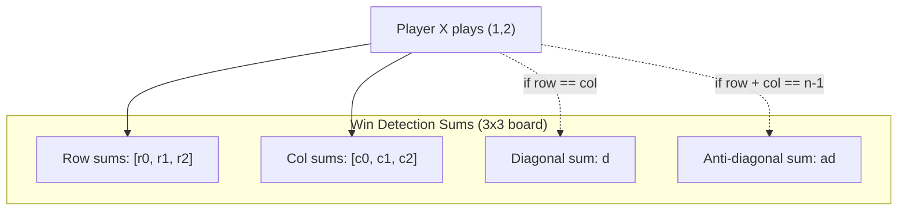
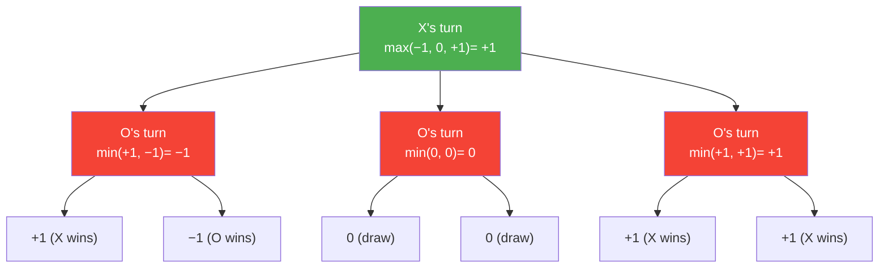
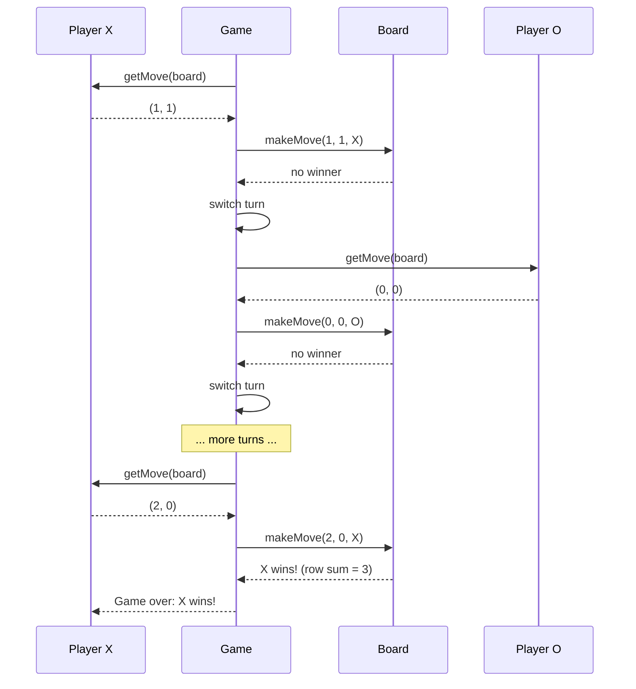

# Design Tic-Tac-Toe

Tic-Tac-Toe is deceptively simple as a game but surprisingly rich as an LLD problem. It tests your ability to model a clean game loop, implement efficient win detection ($O(1)$ per move instead of $O(n^2)$), design for extensibility (arbitrary board sizes), and implement an AI opponent using the minimax algorithm. The problem also naturally leads to discussions about the Strategy pattern for player types and the Observer pattern for game events.

## Requirements

### Functional Requirements

| # | Requirement | Details |
|---|-------------|---------|
| FR-1 | Board setup | Create an $N \times N$ board (default 3x3) |
| FR-2 | Two players | Human vs Human, Human vs AI, AI vs AI |
| FR-3 | Turn management | Alternate turns between players |
| FR-4 | Move validation | Reject moves to occupied cells or out of bounds |
| FR-5 | Win detection | Detect row, column, or diagonal completion |
| FR-6 | Draw detection | Detect when all cells filled with no winner |
| FR-7 | Game reset | Reset board for a new game |
| FR-8 | AI player | Computer opponent using minimax |

## O(1) Win Detection

The naive approach to checking for a win scans all rows, columns, and diagonals after each move: $O(n)$ per move, or $O(n^2)$ if you scan the entire board. The elegant approach maintains running sums.

### The Trick

Assign Player X a value of $+1$ and Player O a value of $-1$. Maintain:
- A sum for each row
- A sum for each column
- A sum for the main diagonal
- A sum for the anti-diagonal

When a player places a mark, add their value to the relevant row, column, and (if applicable) diagonal sums. If any sum reaches $+n$ or $-n$, that player has won.

$$
|\text{sum}| = n \implies \text{winner detected}
$$



## Implementation

### Enums and Types

**TypeScript:**

```typescript
enum CellState {
  EMPTY = 0,
  X = 1,
  O = -1,
}

enum GameStatus {
  IN_PROGRESS = "IN_PROGRESS",
  X_WINS = "X_WINS",
  O_WINS = "O_WINS",
  DRAW = "DRAW",
}

interface Position {
  row: number;
  col: number;
}

interface MoveResult {
  valid: boolean;
  status: GameStatus;
  message: string;
}
```

**Python:**

```python
from enum import Enum, IntEnum
from dataclasses import dataclass
from abc import ABC, abstractmethod
import math

class CellState(IntEnum):
    EMPTY = 0
    X = 1
    O = -1

class GameStatus(Enum):
    IN_PROGRESS = "IN_PROGRESS"
    X_WINS = "X_WINS"
    O_WINS = "O_WINS"
    DRAW = "DRAW"

@dataclass
class Position:
    row: int
    col: int

@dataclass
class MoveResult:
    valid: bool
    status: GameStatus
    message: str
```

### Board Class

**TypeScript:**

```typescript
class Board {
  private grid: CellState[][];
  private rowSums: number[];
  private colSums: number[];
  private diagSum: number = 0;
  private antiDiagSum: number = 0;
  private moveCount: number = 0;
  public readonly size: number;

  constructor(size: number = 3) {
    this.size = size;
    this.grid = Array.from({ length: size }, () =>
      new Array(size).fill(CellState.EMPTY)
    );
    this.rowSums = new Array(size).fill(0);
    this.colSums = new Array(size).fill(0);
  }

  getCell(row: number, col: number): CellState {
    return this.grid[row][col];
  }

  isValidMove(row: number, col: number): boolean {
    return (
      row >= 0 && row < this.size &&
      col >= 0 && col < this.size &&
      this.grid[row][col] === CellState.EMPTY
    );
  }

  /**
   * Place a mark and check for win in O(1).
   * Returns the winner's CellState if someone won, else CellState.EMPTY.
   */
  makeMove(row: number, col: number, player: CellState): CellState {
    this.grid[row][col] = player;
    this.moveCount++;

    this.rowSums[row] += player;
    this.colSums[col] += player;

    if (row === col) {
      this.diagSum += player;
    }
    if (row + col === this.size - 1) {
      this.antiDiagSum += player;
    }

    // Check if this move wins
    if (
      Math.abs(this.rowSums[row]) === this.size ||
      Math.abs(this.colSums[col]) === this.size ||
      Math.abs(this.diagSum) === this.size ||
      Math.abs(this.antiDiagSum) === this.size
    ) {
      return player;
    }

    return CellState.EMPTY;
  }

  undoMove(row: number, col: number, player: CellState): void {
    this.grid[row][col] = CellState.EMPTY;
    this.moveCount--;

    this.rowSums[row] -= player;
    this.colSums[col] -= player;

    if (row === col) {
      this.diagSum -= player;
    }
    if (row + col === this.size - 1) {
      this.antiDiagSum -= player;
    }
  }

  isFull(): boolean {
    return this.moveCount === this.size * this.size;
  }

  getEmptyCells(): Position[] {
    const cells: Position[] = [];
    for (let r = 0; r < this.size; r++) {
      for (let c = 0; c < this.size; c++) {
        if (this.grid[r][c] === CellState.EMPTY) {
          cells.push({ row: r, col: c });
        }
      }
    }
    return cells;
  }

  reset(): void {
    for (let r = 0; r < this.size; r++) {
      for (let c = 0; c < this.size; c++) {
        this.grid[r][c] = CellState.EMPTY;
      }
    }
    this.rowSums.fill(0);
    this.colSums.fill(0);
    this.diagSum = 0;
    this.antiDiagSum = 0;
    this.moveCount = 0;
  }

  display(): string {
    const symbolMap = {
      [CellState.EMPTY]: ".",
      [CellState.X]: "X",
      [CellState.O]: "O",
    };

    let output = "";
    for (let r = 0; r < this.size; r++) {
      output += this.grid[r].map((c) => symbolMap[c]).join(" | ") + "\n";
      if (r < this.size - 1) {
        output += "-".repeat(this.size * 4 - 3) + "\n";
      }
    }
    return output;
  }
}
```

**Python:**

```python
class Board:
    def __init__(self, size: int = 3):
        self.size = size
        self.grid = [[CellState.EMPTY] * size for _ in range(size)]
        self.row_sums = [0] * size
        self.col_sums = [0] * size
        self.diag_sum = 0
        self.anti_diag_sum = 0
        self.move_count = 0

    def get_cell(self, row: int, col: int) -> CellState:
        return self.grid[row][col]

    def is_valid_move(self, row: int, col: int) -> bool:
        return (0 <= row < self.size and
                0 <= col < self.size and
                self.grid[row][col] == CellState.EMPTY)

    def make_move(self, row: int, col: int, player: CellState) -> CellState:
        """Place mark, return winner's CellState or EMPTY."""
        self.grid[row][col] = player
        self.move_count += 1

        self.row_sums[row] += player
        self.col_sums[col] += player

        if row == col:
            self.diag_sum += player
        if row + col == self.size - 1:
            self.anti_diag_sum += player

        if (abs(self.row_sums[row]) == self.size or
            abs(self.col_sums[col]) == self.size or
            abs(self.diag_sum) == self.size or
            abs(self.anti_diag_sum) == self.size):
            return player

        return CellState.EMPTY

    def undo_move(self, row: int, col: int, player: CellState) -> None:
        self.grid[row][col] = CellState.EMPTY
        self.move_count -= 1

        self.row_sums[row] -= player
        self.col_sums[col] -= player

        if row == col:
            self.diag_sum -= player
        if row + col == self.size - 1:
            self.anti_diag_sum -= player

    def is_full(self) -> bool:
        return self.move_count == self.size * self.size

    def get_empty_cells(self) -> list[Position]:
        return [
            Position(r, c)
            for r in range(self.size)
            for c in range(self.size)
            if self.grid[r][c] == CellState.EMPTY
        ]

    def reset(self) -> None:
        self.grid = [[CellState.EMPTY] * self.size for _ in range(self.size)]
        self.row_sums = [0] * self.size
        self.col_sums = [0] * self.size
        self.diag_sum = 0
        self.anti_diag_sum = 0
        self.move_count = 0

    def display(self) -> str:
        symbols = {CellState.EMPTY: ".", CellState.X: "X", CellState.O: "O"}
        lines = []
        for r in range(self.size):
            lines.append(" | ".join(symbols[c] for c in self.grid[r]))
            if r < self.size - 1:
                lines.append("-" * (self.size * 4 - 3))
        return "\n".join(lines)
```

### Player Interface (Strategy Pattern)

**TypeScript:**

```typescript
interface Player {
  name: string;
  symbol: CellState;
  getMove(board: Board): Position;
}

class HumanPlayer implements Player {
  constructor(
    public readonly name: string,
    public readonly symbol: CellState,
    private inputFn: () => Position
  ) {}

  getMove(board: Board): Position {
    while (true) {
      const pos = this.inputFn();
      if (board.isValidMove(pos.row, pos.col)) {
        return pos;
      }
    }
  }
}
```

**Python:**

```python
class Player(ABC):
    def __init__(self, name: str, symbol: CellState):
        self.name = name
        self.symbol = symbol

    @abstractmethod
    def get_move(self, board: Board) -> Position: ...

class HumanPlayer(Player):
    def get_move(self, board: Board) -> Position:
        while True:
            try:
                row = int(input(f"{self.name}, enter row (0-{board.size-1}): "))
                col = int(input(f"{self.name}, enter col (0-{board.size-1}): "))
                if board.is_valid_move(row, col):
                    return Position(row, col)
                print("Invalid move. Try again.")
            except ValueError:
                print("Enter valid numbers.")
```

### AI Player (Minimax Algorithm)

The minimax algorithm plays optimally by exploring all possible future game states. The maximizing player (X) picks the move with the highest score. The minimizing player (O) picks the move with the lowest score.

$$
\text{minimax}(s) = \begin{cases}
+10 - \text{depth} & \text{if maximizer wins} \\
-10 + \text{depth} & \text{if minimizer wins} \\
0 & \text{if draw} \\
\max_{m \in \text{moves}} \text{minimax}(\text{apply}(s, m)) & \text{if maximizer's turn} \\
\min_{m \in \text{moves}} \text{minimax}(\text{apply}(s, m)) & \text{if minimizer's turn}
\end{cases}
$$

The depth adjustment ensures the AI prefers faster wins and slower losses.



**TypeScript:**

```typescript
class AIPlayer implements Player {
  constructor(
    public readonly name: string,
    public readonly symbol: CellState
  ) {}

  getMove(board: Board): Position {
    const result = this.minimax(board, this.symbol, 0);
    return result.position!;
  }

  private minimax(
    board: Board,
    currentPlayer: CellState,
    depth: number
  ): { score: number; position: Position | null } {
    const emptyCells = board.getEmptyCells();

    // Terminal states
    if (emptyCells.length === 0) {
      return { score: 0, position: null }; // draw
    }

    const isMaximizing = currentPlayer === this.symbol;
    let bestScore = isMaximizing ? -Infinity : Infinity;
    let bestPosition: Position | null = null;

    for (const cell of emptyCells) {
      // Make move
      const winner = board.makeMove(cell.row, cell.col, currentPlayer);

      let score: number;

      if (winner !== CellState.EMPTY) {
        // Someone won
        score = winner === this.symbol ? 10 - depth : -10 + depth;
      } else {
        // Recurse with opponent
        const opponent = currentPlayer === CellState.X ? CellState.O : CellState.X;
        score = this.minimax(board, opponent, depth + 1).score;
      }

      // Undo move
      board.undoMove(cell.row, cell.col, currentPlayer);

      if (isMaximizing) {
        if (score > bestScore) {
          bestScore = score;
          bestPosition = cell;
        }
      } else {
        if (score < bestScore) {
          bestScore = score;
          bestPosition = cell;
        }
      }
    }

    return { score: bestScore, position: bestPosition };
  }
}
```

**Python:**

```python
class AIPlayer(Player):
    def get_move(self, board: Board) -> Position:
        _, position = self._minimax(board, self.symbol, 0)
        return position

    def _minimax(self, board: Board, current_player: CellState,
                 depth: int) -> tuple[int, Position | None]:
        empty_cells = board.get_empty_cells()

        if not empty_cells:
            return 0, None  # draw

        is_maximizing = current_player == self.symbol
        best_score = -math.inf if is_maximizing else math.inf
        best_position: Position | None = None

        for cell in empty_cells:
            winner = board.make_move(cell.row, cell.col, current_player)

            if winner != CellState.EMPTY:
                score = (10 - depth) if winner == self.symbol else (-10 + depth)
            else:
                opponent = CellState.O if current_player == CellState.X else CellState.X
                score, _ = self._minimax(board, opponent, depth + 1)

            board.undo_move(cell.row, cell.col, current_player)

            if is_maximizing:
                if score > best_score:
                    best_score = score
                    best_position = cell
            else:
                if score < best_score:
                    best_score = score
                    best_position = cell

        return best_score, best_position
```

::: warning Minimax Complexity
For a $3 \times 3$ board, minimax explores up to $9! = 362,880$ states — fast enough. For larger boards ($N \times N$), add **alpha-beta pruning** to cut the search space dramatically. Without it, the game tree grows as $O((N^2)!)$, which is intractable for $N > 4$.
:::

### Alpha-Beta Pruning Enhancement

Alpha-beta pruning reduces the minimax search space by maintaining a window $[\alpha, \beta]$. If a branch cannot possibly affect the final decision, it is pruned.

$$
\text{Pruning condition:} \quad \alpha \geq \beta \implies \text{cut off search}
$$

**TypeScript:**

```typescript
class AIPlayerAlphaBeta implements Player {
  constructor(
    public readonly name: string,
    public readonly symbol: CellState
  ) {}

  getMove(board: Board): Position {
    const result = this.alphabeta(board, this.symbol, 0, -Infinity, Infinity);
    return result.position!;
  }

  private alphabeta(
    board: Board,
    currentPlayer: CellState,
    depth: number,
    alpha: number,
    beta: number
  ): { score: number; position: Position | null } {
    const emptyCells = board.getEmptyCells();
    if (emptyCells.length === 0) return { score: 0, position: null };

    const isMaximizing = currentPlayer === this.symbol;
    let bestPosition: Position | null = null;

    for (const cell of emptyCells) {
      const winner = board.makeMove(cell.row, cell.col, currentPlayer);
      let score: number;

      if (winner !== CellState.EMPTY) {
        score = winner === this.symbol ? 10 - depth : -10 + depth;
      } else {
        const opponent = currentPlayer === CellState.X ? CellState.O : CellState.X;
        score = this.alphabeta(board, opponent, depth + 1, alpha, beta).score;
      }

      board.undoMove(cell.row, cell.col, currentPlayer);

      if (isMaximizing) {
        if (score > alpha) {
          alpha = score;
          bestPosition = cell;
        }
      } else {
        if (score < beta) {
          beta = score;
          bestPosition = cell;
        }
      }

      if (alpha >= beta) break; // prune
    }

    return {
      score: isMaximizing ? alpha : beta,
      position: bestPosition,
    };
  }
}
```

**Python:**

```python
class AIPlayerAlphaBeta(Player):
    def get_move(self, board: Board) -> Position:
        _, position = self._alphabeta(
            board, self.symbol, 0, -math.inf, math.inf
        )
        return position

    def _alphabeta(self, board: Board, current_player: CellState,
                   depth: int, alpha: float, beta: float
                   ) -> tuple[float, Position | None]:
        empty_cells = board.get_empty_cells()
        if not empty_cells:
            return 0, None

        is_maximizing = current_player == self.symbol
        best_position: Position | None = None

        for cell in empty_cells:
            winner = board.make_move(cell.row, cell.col, current_player)

            if winner != CellState.EMPTY:
                score = (10 - depth) if winner == self.symbol else (-10 + depth)
            else:
                opponent = CellState.O if current_player == CellState.X else CellState.X
                score, _ = self._alphabeta(board, opponent, depth + 1, alpha, beta)

            board.undo_move(cell.row, cell.col, current_player)

            if is_maximizing:
                if score > alpha:
                    alpha = score
                    best_position = cell
            else:
                if score < beta:
                    beta = score
                    best_position = cell

            if alpha >= beta:
                break  # prune

        return (alpha if is_maximizing else beta), best_position
```

### Game Controller

**TypeScript:**

```typescript
class TicTacToeGame {
  private board: Board;
  private players: [Player, Player];
  private currentPlayerIndex: number = 0;
  private status: GameStatus = GameStatus.IN_PROGRESS;

  constructor(player1: Player, player2: Player, boardSize = 3) {
    this.board = new Board(boardSize);
    this.players = [player1, player2];
  }

  get currentPlayer(): Player {
    return this.players[this.currentPlayerIndex];
  }

  get gameStatus(): GameStatus {
    return this.status;
  }

  playTurn(): MoveResult {
    if (this.status !== GameStatus.IN_PROGRESS) {
      return {
        valid: false,
        status: this.status,
        message: "Game is already over.",
      };
    }

    const player = this.currentPlayer;
    const move = player.getMove(this.board);

    if (!this.board.isValidMove(move.row, move.col)) {
      return {
        valid: false,
        status: GameStatus.IN_PROGRESS,
        message: `Invalid move at (${move.row}, ${move.col})`,
      };
    }

    const winner = this.board.makeMove(move.row, move.col, player.symbol);

    if (winner !== CellState.EMPTY) {
      this.status =
        winner === CellState.X ? GameStatus.X_WINS : GameStatus.O_WINS;
      return {
        valid: true,
        status: this.status,
        message: `${player.name} wins!`,
      };
    }

    if (this.board.isFull()) {
      this.status = GameStatus.DRAW;
      return {
        valid: true,
        status: GameStatus.DRAW,
        message: "It's a draw!",
      };
    }

    // Switch turns
    this.currentPlayerIndex = 1 - this.currentPlayerIndex;
    return {
      valid: true,
      status: GameStatus.IN_PROGRESS,
      message: `${this.currentPlayer.name}'s turn.`,
    };
  }

  playFullGame(): GameStatus {
    while (this.status === GameStatus.IN_PROGRESS) {
      this.playTurn();
    }
    return this.status;
  }

  displayBoard(): string {
    return this.board.display();
  }

  reset(): void {
    this.board.reset();
    this.currentPlayerIndex = 0;
    this.status = GameStatus.IN_PROGRESS;
  }
}
```

**Python:**

```python
class TicTacToeGame:
    def __init__(self, player1: Player, player2: Player, board_size: int = 3):
        self.board = Board(board_size)
        self.players = (player1, player2)
        self._current_idx = 0
        self.status = GameStatus.IN_PROGRESS

    @property
    def current_player(self) -> Player:
        return self.players[self._current_idx]

    def play_turn(self) -> MoveResult:
        if self.status != GameStatus.IN_PROGRESS:
            return MoveResult(False, self.status, "Game is already over.")

        player = self.current_player
        move = player.get_move(self.board)

        if not self.board.is_valid_move(move.row, move.col):
            return MoveResult(False, GameStatus.IN_PROGRESS,
                              f"Invalid move at ({move.row}, {move.col})")

        winner = self.board.make_move(move.row, move.col, player.symbol)

        if winner != CellState.EMPTY:
            self.status = (GameStatus.X_WINS if winner == CellState.X
                           else GameStatus.O_WINS)
            return MoveResult(True, self.status, f"{player.name} wins!")

        if self.board.is_full():
            self.status = GameStatus.DRAW
            return MoveResult(True, GameStatus.DRAW, "It's a draw!")

        self._current_idx = 1 - self._current_idx
        return MoveResult(True, GameStatus.IN_PROGRESS,
                          f"{self.current_player.name}'s turn.")

    def play_full_game(self) -> GameStatus:
        while self.status == GameStatus.IN_PROGRESS:
            self.play_turn()
        return self.status

    def reset(self) -> None:
        self.board.reset()
        self._current_idx = 0
        self.status = GameStatus.IN_PROGRESS
```

## Usage Example

**TypeScript:**

```typescript
// AI vs AI game
const aiX = new AIPlayer("Bot-X", CellState.X);
const aiO = new AIPlayer("Bot-O", CellState.O);
const game = new TicTacToeGame(aiX, aiO);

const result = game.playFullGame();
console.log(game.displayBoard());
console.log(`Result: ${result}`);
// With perfect play on both sides: always a draw
```

## Game Flow



## Complexity Analysis

| Operation | Time | Space |
|-----------|------|-------|
| Make move (with win check) | $O(1)$ | $O(1)$ |
| Win detection (sum check) | $O(1)$ | $O(n)$ for sums |
| Board display | $O(n^2)$ | $O(n^2)$ |
| Minimax (3x3) | $O(9!)$ worst | $O(9)$ recursion |
| Minimax with alpha-beta (3x3) | $O(9!/\alpha)$ | $O(9)$ recursion |
| Minimax (NxN) | $O((n^2)!)$ | $O(n^2)$ recursion |

## Design Patterns Used

| Pattern | Where Used | Why |
|---------|-----------|-----|
| **Strategy** | Player interface (Human, AI, AIAlphaBeta) | Swap player types without changing game logic |
| **Observer** | Game events (could notify UI on state changes) | Decouple game logic from presentation |
| **Template Method** | Game loop structure | Same turn flow, different move sources |
| **State** | GameStatus transitions | Clear game lifecycle states |

## Extension: N x N Board

The entire design scales to arbitrary $N \times N$ boards with $K$-in-a-row win condition. The $O(1)$ win detection still works if $K = N$. For $K < N$ (e.g., 5-in-a-row on a 15x15 Gomoku board), you need a different approach:

::: tip Gomoku Extension
For $K$-in-a-row on an $N \times N$ board where $K < N$, maintain cumulative sums along all possible winning lines. This requires $O(N^2)$ total sums but still allows $O(1)$ win detection per move by checking only the 4 directions (horizontal, vertical, two diagonals) from the placed position.
:::

## Further Reading

- [LLD Interviews Overview](/lld-interviews/) — SOLID principles and design patterns
- [Backtracking & Recursion](/algorithms/backtracking-recursion) — minimax is a backtracking algorithm
- [Dynamic Programming](/algorithms/dynamic-programming) — game theory connections
- [Design File System](/lld-interviews/file-system) — another composite-pattern LLD problem
