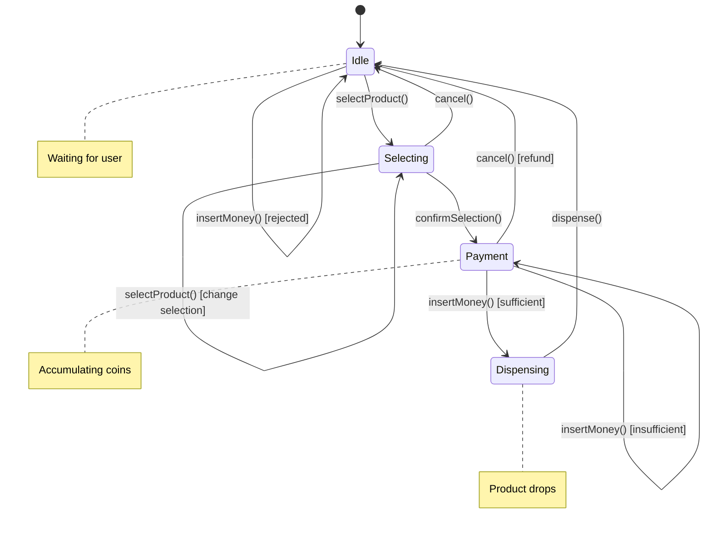
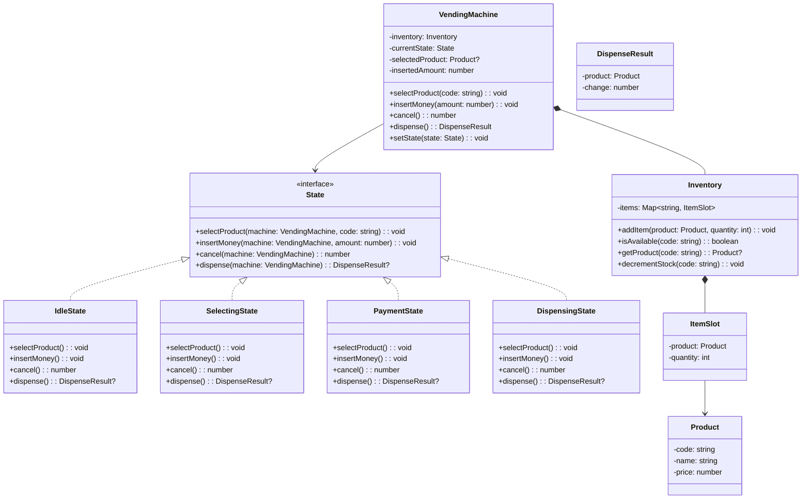

# Design a Vending Machine

The vending machine is the textbook State pattern problem. The machine transitions between well-defined states (idle, selecting, payment, dispensing), and behavior changes entirely depending on the current state. This problem tests your ability to model state machines cleanly.

## Requirements & Use Cases

### Functional Requirements

1. Machine holds an inventory of products with prices and quantities
2. User selects a product
3. User inserts coins/bills (supports multiple denominations)
4. Machine validates sufficient payment
5. Machine dispenses product and returns change
6. Machine tracks inventory; out-of-stock products cannot be selected
7. User can cancel at any point and get a refund

### Non-Functional Requirements

- State transitions must be deterministic and well-defined
- Change calculation should return fewest coins possible (greedy)
- Thread-safe for concurrent button presses (hardware interrupts)

### State Machine



### Use Cases

| Actor | Use Case |
|-------|---------|
| Customer | Select a product |
| Customer | Insert money |
| Customer | Cancel and get refund |
| System | Dispense product |
| System | Return change |
| Admin | Restock products |
| Admin | Collect cash |

## Class Diagram



## Core Classes & Interfaces

### TypeScript Implementation

```typescript
// ─── Product & Inventory ─────────────────────────────────

class Product {
  constructor(
    public readonly code: string,
    public readonly name: string,
    public readonly price: number
  ) {}
}

class ItemSlot {
  constructor(
    public readonly product: Product,
    private quantity: number
  ) {}

  isAvailable(): boolean {
    return this.quantity > 0;
  }

  getQuantity(): number {
    return this.quantity;
  }

  decrement(): void {
    if (this.quantity <= 0) {
      throw new Error(`${this.product.name} is out of stock`);
    }
    this.quantity--;
  }

  restock(amount: number): void {
    this.quantity += amount;
  }
}

class Inventory {
  private items: Map<string, ItemSlot> = new Map();

  addItem(product: Product, quantity: number): void {
    const existing = this.items.get(product.code);
    if (existing) {
      existing.restock(quantity);
    } else {
      this.items.set(product.code, new ItemSlot(product, quantity));
    }
  }

  isAvailable(code: string): boolean {
    const slot = this.items.get(code);
    return slot !== undefined && slot.isAvailable();
  }

  getProduct(code: string): Product | null {
    return this.items.get(code)?.product ?? null;
  }

  decrementStock(code: string): void {
    const slot = this.items.get(code);
    if (!slot) throw new Error(`Product ${code} not found`);
    slot.decrement();
  }

  getAllProducts(): Array<{
    product: Product;
    quantity: number;
    available: boolean;
  }> {
    return Array.from(this.items.values()).map((slot) => ({
      product: slot.product,
      quantity: slot.getQuantity(),
      available: slot.isAvailable(),
    }));
  }
}

// ─── Dispense Result ─────────────────────────────────────

interface DispenseResult {
  product: Product;
  change: number;
}

// ─── State Interface ─────────────────────────────────────

interface State {
  selectProduct(machine: VendingMachine, code: string): void;
  insertMoney(machine: VendingMachine, amount: number): void;
  cancel(machine: VendingMachine): number;
  dispense(machine: VendingMachine): DispenseResult | null;
}

// ─── Concrete States ─────────────────────────────────────

class IdleState implements State {
  selectProduct(machine: VendingMachine, code: string): void {
    if (!machine.getInventory().isAvailable(code)) {
      throw new Error(`Product ${code} is out of stock`);
    }
    const product = machine.getInventory().getProduct(code)!;
    machine.setSelectedProduct(product);
    machine.setState(new SelectingState());
  }

  insertMoney(_machine: VendingMachine, _amount: number): void {
    throw new Error('Please select a product first');
  }

  cancel(_machine: VendingMachine): number {
    return 0; // nothing to refund
  }

  dispense(_machine: VendingMachine): DispenseResult | null {
    throw new Error('Please select a product and insert money');
  }
}

class SelectingState implements State {
  selectProduct(machine: VendingMachine, code: string): void {
    // Allow changing selection
    if (!machine.getInventory().isAvailable(code)) {
      throw new Error(`Product ${code} is out of stock`);
    }
    const product = machine.getInventory().getProduct(code)!;
    machine.setSelectedProduct(product);
  }

  insertMoney(machine: VendingMachine, amount: number): void {
    machine.addInsertedAmount(amount);
    const product = machine.getSelectedProduct()!;

    if (machine.getInsertedAmount() >= product.price) {
      machine.setState(new DispensingState());
    } else {
      machine.setState(new PaymentState());
    }
  }

  cancel(machine: VendingMachine): number {
    const refund = machine.getInsertedAmount();
    machine.reset();
    return refund;
  }

  dispense(_machine: VendingMachine): DispenseResult | null {
    throw new Error('Please insert money first');
  }
}

class PaymentState implements State {
  selectProduct(_machine: VendingMachine, _code: string): void {
    throw new Error('Cannot change product during payment. Cancel first.');
  }

  insertMoney(machine: VendingMachine, amount: number): void {
    machine.addInsertedAmount(amount);
    const product = machine.getSelectedProduct()!;

    if (machine.getInsertedAmount() >= product.price) {
      machine.setState(new DispensingState());
    }
    // else stay in PaymentState — need more money
  }

  cancel(machine: VendingMachine): number {
    const refund = machine.getInsertedAmount();
    machine.reset();
    return refund;
  }

  dispense(_machine: VendingMachine): DispenseResult | null {
    const product = _machine.getSelectedProduct()!;
    const remaining = product.price - _machine.getInsertedAmount();
    throw new Error(`Insufficient funds. Insert $${remaining.toFixed(2)} more.`);
  }
}

class DispensingState implements State {
  selectProduct(_machine: VendingMachine, _code: string): void {
    throw new Error('Currently dispensing. Please wait.');
  }

  insertMoney(_machine: VendingMachine, _amount: number): void {
    throw new Error('Currently dispensing. Please wait.');
  }

  cancel(_machine: VendingMachine): number {
    throw new Error('Cannot cancel during dispensing');
  }

  dispense(machine: VendingMachine): DispenseResult {
    const product = machine.getSelectedProduct()!;
    const change = machine.getInsertedAmount() - product.price;

    // Dispense product
    machine.getInventory().decrementStock(product.code);

    const result: DispenseResult = { product, change };

    // Reset machine
    machine.reset();

    return result;
  }
}

// ─── Vending Machine ─────────────────────────────────────

class VendingMachine {
  private inventory: Inventory = new Inventory();
  private currentState: State = new IdleState();
  private selectedProduct: Product | null = null;
  private insertedAmount: number = 0;

  // ── Public API (delegates to current state) ──────────

  selectProduct(code: string): void {
    this.currentState.selectProduct(this, code);
  }

  insertMoney(amount: number): void {
    if (amount <= 0) throw new Error('Amount must be positive');
    this.currentState.insertMoney(this, amount);
  }

  cancel(): number {
    return this.currentState.cancel(this);
  }

  dispense(): DispenseResult | null {
    return this.currentState.dispense(this);
  }

  // ── State management (used by State objects) ─────────

  setState(state: State): void {
    this.currentState = state;
  }

  getInventory(): Inventory {
    return this.inventory;
  }

  getSelectedProduct(): Product | null {
    return this.selectedProduct;
  }

  setSelectedProduct(product: Product): void {
    this.selectedProduct = product;
  }

  getInsertedAmount(): number {
    return this.insertedAmount;
  }

  addInsertedAmount(amount: number): void {
    this.insertedAmount += amount;
  }

  reset(): void {
    this.selectedProduct = null;
    this.insertedAmount = 0;
    this.currentState = new IdleState();
  }

  // ── Admin operations ─────────────────────────────────

  addProduct(product: Product, quantity: number): void {
    this.inventory.addItem(product, quantity);
  }

  getProductList(): Array<{
    product: Product;
    quantity: number;
    available: boolean;
  }> {
    return this.inventory.getAllProducts();
  }
}
```

### Python Implementation

```python
from abc import ABC, abstractmethod
from dataclasses import dataclass
from typing import Optional


# ─── Product & Inventory ───────────────────────────────

@dataclass(frozen=True)
class Product:
    code: str
    name: str
    price: float


class ItemSlot:
    def __init__(self, product: Product, quantity: int):
        self.product = product
        self._quantity = quantity

    @property
    def is_available(self) -> bool:
        return self._quantity > 0

    @property
    def quantity(self) -> int:
        return self._quantity

    def decrement(self) -> None:
        if self._quantity <= 0:
            raise ValueError(f"{self.product.name} is out of stock")
        self._quantity -= 1

    def restock(self, amount: int) -> None:
        self._quantity += amount


class Inventory:
    def __init__(self):
        self._items: dict[str, ItemSlot] = {}

    def add_item(self, product: Product, quantity: int) -> None:
        if product.code in self._items:
            self._items[product.code].restock(quantity)
        else:
            self._items[product.code] = ItemSlot(product, quantity)

    def is_available(self, code: str) -> bool:
        slot = self._items.get(code)
        return slot is not None and slot.is_available

    def get_product(self, code: str) -> Optional[Product]:
        slot = self._items.get(code)
        return slot.product if slot else None

    def decrement_stock(self, code: str) -> None:
        slot = self._items.get(code)
        if not slot:
            raise ValueError(f"Product {code} not found")
        slot.decrement()


# ─── Dispense Result ───────────────────────────────────

@dataclass
class DispenseResult:
    product: Product
    change: float


# ─── State Interface ──────────────────────────────────

class State(ABC):
    @abstractmethod
    def select_product(self, machine: "VendingMachine", code: str) -> None:
        ...

    @abstractmethod
    def insert_money(self, machine: "VendingMachine", amount: float) -> None:
        ...

    @abstractmethod
    def cancel(self, machine: "VendingMachine") -> float:
        ...

    @abstractmethod
    def dispense(self, machine: "VendingMachine") -> Optional[DispenseResult]:
        ...


# ─── Concrete States ──────────────────────────────────

class IdleState(State):
    def select_product(self, machine: "VendingMachine", code: str) -> None:
        if not machine.inventory.is_available(code):
            raise ValueError(f"Product {code} is out of stock")
        product = machine.inventory.get_product(code)
        machine.selected_product = product
        machine.set_state(SelectingState())

    def insert_money(self, machine: "VendingMachine", amount: float) -> None:
        raise RuntimeError("Please select a product first")

    def cancel(self, machine: "VendingMachine") -> float:
        return 0.0

    def dispense(self, machine: "VendingMachine") -> Optional[DispenseResult]:
        raise RuntimeError("Please select a product and insert money")


class SelectingState(State):
    def select_product(self, machine: "VendingMachine", code: str) -> None:
        if not machine.inventory.is_available(code):
            raise ValueError(f"Product {code} is out of stock")
        machine.selected_product = machine.inventory.get_product(code)

    def insert_money(self, machine: "VendingMachine", amount: float) -> None:
        machine.inserted_amount += amount
        product = machine.selected_product
        assert product is not None

        if machine.inserted_amount >= product.price:
            machine.set_state(DispensingState())
        else:
            machine.set_state(PaymentState())

    def cancel(self, machine: "VendingMachine") -> float:
        refund = machine.inserted_amount
        machine.reset()
        return refund

    def dispense(self, machine: "VendingMachine") -> Optional[DispenseResult]:
        raise RuntimeError("Please insert money first")


class PaymentState(State):
    def select_product(self, machine: "VendingMachine", code: str) -> None:
        raise RuntimeError("Cannot change product during payment. Cancel first.")

    def insert_money(self, machine: "VendingMachine", amount: float) -> None:
        machine.inserted_amount += amount
        product = machine.selected_product
        assert product is not None

        if machine.inserted_amount >= product.price:
            machine.set_state(DispensingState())

    def cancel(self, machine: "VendingMachine") -> float:
        refund = machine.inserted_amount
        machine.reset()
        return refund

    def dispense(self, machine: "VendingMachine") -> Optional[DispenseResult]:
        product = machine.selected_product
        assert product is not None
        remaining = product.price - machine.inserted_amount
        raise RuntimeError(f"Insufficient funds. Insert ${remaining:.2f} more.")


class DispensingState(State):
    def select_product(self, machine: "VendingMachine", code: str) -> None:
        raise RuntimeError("Currently dispensing. Please wait.")

    def insert_money(self, machine: "VendingMachine", amount: float) -> None:
        raise RuntimeError("Currently dispensing. Please wait.")

    def cancel(self, machine: "VendingMachine") -> float:
        raise RuntimeError("Cannot cancel during dispensing")

    def dispense(self, machine: "VendingMachine") -> DispenseResult:
        product = machine.selected_product
        assert product is not None
        change = machine.inserted_amount - product.price

        machine.inventory.decrement_stock(product.code)
        result = DispenseResult(product=product, change=change)
        machine.reset()
        return result


# ─── Vending Machine ──────────────────────────────────

class VendingMachine:
    def __init__(self):
        self.inventory = Inventory()
        self._state: State = IdleState()
        self.selected_product: Optional[Product] = None
        self.inserted_amount: float = 0.0

    # Public API
    def select_product(self, code: str) -> None:
        self._state.select_product(self, code)

    def insert_money(self, amount: float) -> None:
        if amount <= 0:
            raise ValueError("Amount must be positive")
        self._state.insert_money(self, amount)

    def cancel(self) -> float:
        return self._state.cancel(self)

    def dispense(self) -> Optional[DispenseResult]:
        return self._state.dispense(self)

    # State management
    def set_state(self, state: State) -> None:
        self._state = state

    def reset(self) -> None:
        self.selected_product = None
        self.inserted_amount = 0.0
        self._state = IdleState()

    # Admin
    def add_product(self, product: Product, quantity: int) -> None:
        self.inventory.add_item(product, quantity)
```

## Design Patterns Used

| Pattern | Where | Why |
|---------|-------|-----|
| **State** | `State` interface with Idle, Selecting, Payment, Dispensing implementations | Each state defines different behavior for the same actions; eliminates complex if/else chains |
| **Composition** | `VendingMachine` owns `Inventory`, delegates to `State` | Clean separation between machine logic and state behavior |
| **Repository** | `Inventory` manages product storage | Encapsulates product lookup and stock management |

::: tip Why State Pattern Over If/Else
Without the State pattern, the vending machine would have a massive `switch` statement in every method:

```typescript
// Without State pattern — messy and hard to extend
insertMoney(amount: number): void {
  if (this.state === 'IDLE') throw new Error('Select product first');
  else if (this.state === 'SELECTING') { /* ... */ }
  else if (this.state === 'PAYMENT') { /* ... */ }
  else if (this.state === 'DISPENSING') throw new Error('Wait');
}
```

With the State pattern, each state is a self-contained class. Adding a new state (e.g., "maintenance mode") means adding one new class without touching existing states.
:::

## Concurrency Considerations

::: warning Hardware Interrupts
A physical vending machine has button presses as hardware interrupts. Two buttons pressed simultaneously could corrupt state.
:::

**Solutions:**

1. **Single event queue** — All button presses and coin insertions go into a thread-safe queue. A single event loop processes them sequentially.

2. **Synchronized state transitions** — Wrap `setState()` and all state method calls in a mutex.

```typescript
class VendingMachine {
  private mutex = new Mutex();

  async selectProduct(code: string): Promise<void> {
    return this.mutex.runExclusive(() => {
      this.currentState.selectProduct(this, code);
    });
  }

  async insertMoney(amount: number): Promise<void> {
    return this.mutex.runExclusive(() => {
      this.currentState.insertMoney(this, amount);
    });
  }
}
```

3. **Idempotent operations** — If `dispense()` is called twice, the second call should be a no-op (machine already reset to idle).

## Testing Strategy

| Test Type | What to Test |
|-----------|-------------|
| **Unit** | `IdleState.selectProduct()` transitions to Selecting |
| **Unit** | `PaymentState.insertMoney()` — insufficient stays in Payment, sufficient transitions to Dispensing |
| **Unit** | `DispensingState.dispense()` — returns product and correct change |
| **Unit** | `Inventory.decrementStock()` — quantity decreases, throws when zero |
| **Integration** | Full flow: select → insert exact amount → dispense → machine back to idle |
| **Integration** | Select → insert partial → insert remaining → dispense |
| **Integration** | Select → cancel → refund equals inserted amount |
| **Edge case** | Select out-of-stock product → error |
| **Edge case** | Insert money in idle state → error |
| **Edge case** | Cancel in idle state → $0 refund |

```typescript
describe('VendingMachine', () => {
  let machine: VendingMachine;

  beforeEach(() => {
    machine = new VendingMachine();
    machine.addProduct(new Product('A1', 'Cola', 1.50), 5);
    machine.addProduct(new Product('A2', 'Chips', 2.00), 3);
  });

  it('should complete a purchase with exact change', () => {
    machine.selectProduct('A1');
    machine.insertMoney(1.50);
    const result = machine.dispense()!;

    expect(result.product.name).toBe('Cola');
    expect(result.change).toBe(0);
  });

  it('should return change on overpayment', () => {
    machine.selectProduct('A1');
    machine.insertMoney(2.00);
    const result = machine.dispense()!;

    expect(result.change).toBeCloseTo(0.50);
  });

  it('should refund on cancel', () => {
    machine.selectProduct('A1');
    machine.insertMoney(0.75);
    const refund = machine.cancel();

    expect(refund).toBeCloseTo(0.75);
  });
});
```

## Extensions & Follow-ups

| Extension | Design Impact |
|-----------|--------------|
| **Coin denomination tracking** | Track inserted coins individually (not just sum); change-making algorithm uses available denominations |
| **Exact change mode** | If machine can't make change, enter "exact change only" mode — new `ExactChangeState` |
| **Multiple item purchase** | Add `Cart` between Selecting and Payment; accumulate products before paying |
| **Discount codes** | Add `DiscountService` that modifies price before payment check |
| **Admin maintenance mode** | New `MaintenanceState` — all user actions rejected; admin can restock and reset |
| **Touchscreen UI** | Separate `Display` interface; states return display messages; UI renders them |
| **Cash collection** | `CashBox` class tracks total cash; admin can `collectCash()` which empties it |
