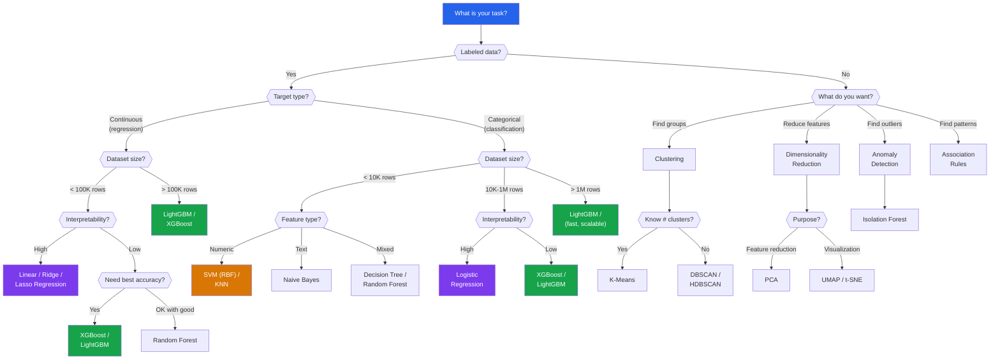
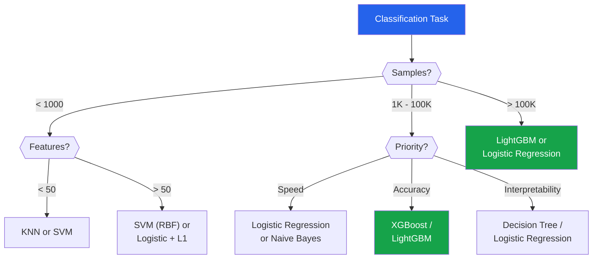
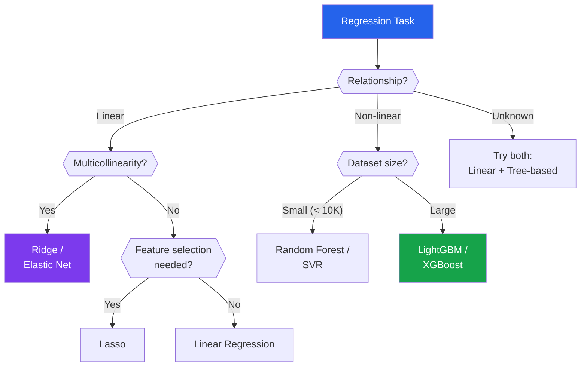
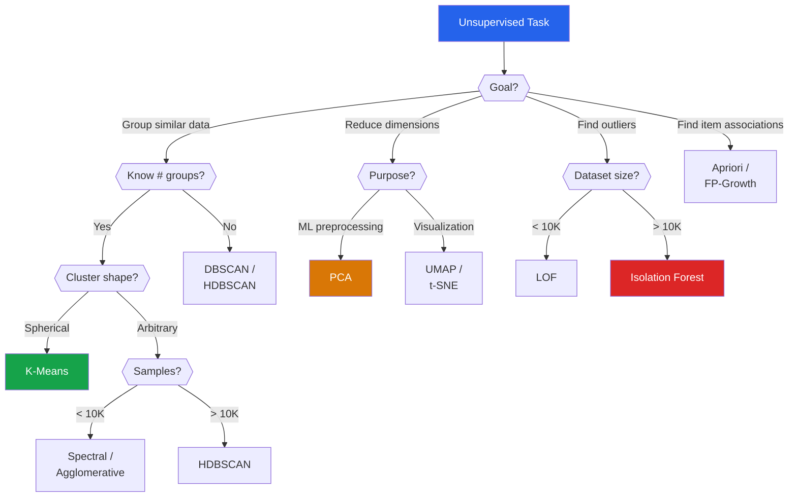

# Algorithm Selection Guide

Choosing the right algorithm is one of the most common questions in machine learning. This guide provides decision flowcharts, comparison tables, and practical recommendations for every major ML algorithm. The goal: given your data and constraints, pick the best starting point in under 60 seconds.

---

## The Master Decision Flowchart



---

## Quick Selection Rules

::: tip The Five-Second Rule
1. **Tabular data, care about accuracy** -> XGBoost / LightGBM
2. **Need to explain every prediction** -> Logistic Regression / Decision Tree
3. **Text classification** -> Naive Bayes (baseline) or fine-tuned transformer
4. **Image/audio/video** -> Deep Learning (CNN, ViT)
5. **Very small dataset (< 1K)** -> SVM or KNN
6. **Time series** -> ARIMA (univariate) or LightGBM with lag features (multivariate)
:::

---

## Supervised Learning: Complete Comparison Table

### Classification Algorithms

| Algorithm | Best Dataset Size | Interpretability | Training Speed | Prediction Speed | Handles Non-Linear | Handles Missing | Needs Scaling | Hyperparameters |
|-----------|------------------|-----------------|---------------|-----------------|-------------------|----------------|--------------|----------------|
| **Logistic Regression** | Any | High | Very Fast | Very Fast | No (without features) | No | Yes | Few (C, penalty) |
| **Decision Tree** | < 100K | Very High | Fast | Very Fast | Yes | No | No | Moderate |
| **Random Forest** | < 1M | Medium | Medium | Fast | Yes | No | No | Few |
| **XGBoost** | < 10M | Low | Medium | Fast | Yes | Yes | No | Many |
| **LightGBM** | Any | Low | Fast | Very Fast | Yes | Yes | No | Many |
| **CatBoost** | Any | Low | Medium | Fast | Yes | Yes | No | Many |
| **SVM (RBF)** | < 100K | Low | Slow | Medium | Yes | No | Yes | Few (C, gamma) |
| **KNN** | < 50K | Medium | None | Slow | Yes | No | Yes | Few (K, metric) |
| **Naive Bayes** | Any | High | Very Fast | Very Fast | Depends | No | No | Very few |
| **AdaBoost** | < 1M | Low | Medium | Fast | Yes | No | No | Few |
| **Extra Trees** | < 1M | Medium | Fast | Fast | Yes | No | No | Few |

### Regression Algorithms

| Algorithm | Best Dataset Size | Interpretability | Handles Non-Linear | Key Hyperparameters |
|-----------|------------------|-----------------|-------------------|-------------------|
| **Linear Regression** | Any | Very High | No | None (or regularization) |
| **Ridge Regression** | Any | High | No | alpha |
| **Lasso Regression** | Any | High (sparse) | No | alpha |
| **Elastic Net** | Any | High | No | alpha, l1_ratio |
| **Decision Tree** | < 100K | Very High | Yes | max_depth, min_samples |
| **Random Forest** | < 1M | Medium | Yes | n_estimators, max_depth |
| **XGBoost/LightGBM** | Any | Low | Yes | Many |
| **SVR** | < 100K | Low | Yes | C, epsilon, kernel |
| **KNN Regressor** | < 50K | Medium | Yes | K, metric |

---

## Unsupervised Learning: Comparison

### Clustering

| Algorithm | Cluster Shape | Scalability | Needs K? | Handles Noise | Best For |
|-----------|--------------|-------------|----------|--------------|----------|
| **K-Means** | Spherical | Very Fast | Yes | No | Even-sized, spherical clusters |
| **K-Means++** | Spherical | Very Fast | Yes | No | Better initialization than K-Means |
| **Mini-Batch K-Means** | Spherical | Fastest | Yes | No | Very large datasets |
| **DBSCAN** | Arbitrary | Medium | No | Yes | Irregularly shaped clusters |
| **HDBSCAN** | Arbitrary | Medium | No | Yes | Varying density clusters |
| **Agglomerative** | Arbitrary | Slow | Yes | No | Hierarchical analysis |
| **GMM** | Ellipsoidal | Medium | Yes | No | Soft assignments needed |
| **Spectral** | Arbitrary | Slow | Yes | No | Graph-based data |
| **BIRCH** | Spherical | Fast | Yes | No | Very large datasets |
| **Mean Shift** | Arbitrary | Slow | No | Yes | Unknown number of clusters |

### Dimensionality Reduction

| Algorithm | Linear? | Preserves | Speed | Use For |
|-----------|---------|-----------|-------|---------|
| **PCA** | Yes | Global variance | Very Fast | Feature reduction, denoising |
| **Kernel PCA** | No | Nonlinear manifold | Slow | Nonlinear feature reduction |
| **t-SNE** | No | Local neighbors | Slow | 2D visualization (< 10K) |
| **UMAP** | No | Local + global | Fast | Visualization + features (any size) |
| **LDA** | Yes | Class separation | Fast | Supervised reduction |
| **TruncatedSVD** | Yes | Variance (sparse) | Fast | NLP / sparse data |

### Anomaly Detection

| Algorithm | Type | Speed | Best For |
|-----------|------|-------|----------|
| **Isolation Forest** | Isolation | Fast | General purpose |
| **LOF** | Density | Medium | Varying density |
| **One-Class SVM** | Boundary | Slow | Small datasets |
| **DBSCAN** | Density | Medium | When clustering too |
| **Autoencoder** | Reconstruction | Slow | High-dimensional |
| **Mahalanobis** | Statistical | Fast | Multivariate normal |

---

## Decision Flowchart: Classification



---

## Decision Flowchart: Regression



---

## Decision Flowchart: Unsupervised



---

## Algorithm-Specific Notes

### When to Use Linear/Logistic Regression

- Baseline for every project (always start here)
- When interpretability is critical (regulatory requirements)
- When features are already well-engineered
- When fast training and prediction are needed
- When you need confidence intervals on predictions

### When to Use Decision Trees

- When you need human-readable rules
- When you need to explain individual predictions
- When data has non-linear relationships but few features
- **Never** for production accuracy — always use ensembles

### When to Use Random Forest

- When you want good accuracy with little tuning
- When overfitting is a concern (RF rarely overfits)
- When you need feature importance
- When training can be parallelized

### When to Use XGBoost/LightGBM

- Default choice for tabular data competitions
- When you need the best possible accuracy
- When data has missing values (native handling)
- When data has mixed feature types
- LightGBM is faster for large datasets
- XGBoost has better documentation and community

### When to Use CatBoost

- When data has many categorical features
- When you want good performance with no preprocessing
- Native handling of categories without encoding

### When to Use SVM

- Small to medium datasets with many features
- When kernel trick captures the right structure
- Text classification with TF-IDF features
- **Avoid** for large datasets (scales $O(n^2)$ to $O(n^3)$)

### When to Use KNN

- Very small datasets
- When decision boundary is very irregular
- When you need instance-based reasoning
- **Avoid** in high dimensions (curse of dimensionality)

### When to Use Naive Bayes

- Text classification (spam, sentiment)
- Baseline with very fast training
- When features are approximately independent
- Small training data (works well with few examples)

---

## Data Type Matching

| Data Type | Recommended Algorithms |
|-----------|----------------------|
| **Tabular (numeric)** | LightGBM, XGBoost, Random Forest |
| **Tabular (mixed)** | CatBoost, LightGBM, Random Forest |
| **Text** | Naive Bayes (baseline), fine-tuned transformers |
| **Images** | CNN (ResNet, EfficientNet), Vision Transformer |
| **Time series** | ARIMA, Prophet, LightGBM with lags |
| **Graph** | GNN, Node2Vec, random walk |
| **Sparse/high-dim** | SVM, Logistic + L1, TruncatedSVD |
| **Very small (< 100)** | KNN, SVM, Logistic Regression |

---

## Performance-Complexity Tradeoff

```
                     Accuracy
                        ↑
    Deep Learning    ···○
                    ·
    XGBoost/LGBM ···○
                  ·
    Random Forest ○
                 ·
    SVM/KNN     ○
               ·
    Logistic   ○
              ·
    Baseline  ○
              ·
    ───────────────────────→ Complexity / Training Time
```

| Complexity Level | Algorithms | Typical Improvement |
|-----------------|-----------|-------------------|
| **Trivial** | Majority class, mean | 0% (baseline) |
| **Simple** | Logistic/Linear, Naive Bayes | +10-20% |
| **Moderate** | Random Forest, SVM, KNN | +5-15% |
| **Complex** | XGBoost, LightGBM, CatBoost | +2-10% |
| **Very Complex** | Stacking, Deep Learning | +1-5% |

::: tip Diminishing Returns
Each complexity level brings smaller improvements. Going from logistic regression to XGBoost might add 8% accuracy. Going from XGBoost to a 5-model stack might add 0.5%. Is that worth the deployment complexity?
:::

---

## Practical Recipe: Start Here

For **any** new ML project, follow this order:

1. **Baseline**: Majority class / mean predictor
2. **Simple**: Logistic Regression (classification) or Ridge (regression)
3. **Medium**: Random Forest with default hyperparameters
4. **Strong**: LightGBM with basic tuning
5. **Best**: Optuna-tuned LightGBM or stacking ensemble

Stop when you meet your performance target. Most projects stop at step 3 or 4.

---

## Key Takeaways

| Concept | Remember |
|---------|----------|
| No single algorithm is always best | No Free Lunch theorem |
| Gradient boosting wins most tabular tasks | XGBoost / LightGBM is the default |
| Start simple, add complexity only if needed | Logistic Regression is always the first model |
| Deep learning for unstructured data | Images, text, audio — not tabular |
| Feature engineering > algorithm selection | Better features beat better algorithms |
| Interpretability has real business value | Logistic Regression is still widely used in production |
| Consider the full pipeline cost | A 1% accuracy gain is not worth 10x deployment complexity |
| Always compare to baselines | Cannot evaluate a model without context |
