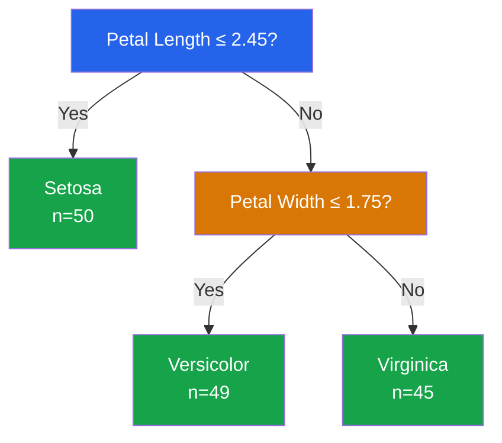

# Decision Trees

Decision trees are the most interpretable machine learning algorithm. They learn a hierarchy of if-then rules that partition the feature space into regions, each assigned a prediction. They are the building blocks of random forests and gradient boosting — understanding them deeply is essential.

---

## How Decision Trees Work

A decision tree recursively splits the data on the feature and threshold that best separates the classes (classification) or reduces variance (regression).



### Terminology

| Term | Definition |
|------|-----------|
| **Root node** | The top node — first split |
| **Internal node** | A node with children — contains a split condition |
| **Leaf node** | A terminal node — contains a prediction |
| **Depth** | Length of the longest path from root to leaf |
| **Split** | A condition like `feature_j <= threshold` |
| **Impurity** | How mixed the classes are in a node |

---

## Impurity Measures

### Gini Impurity

Gini impurity measures the probability that a randomly chosen sample would be misclassified if labeled according to the class distribution in the node:

$$G = 1 - \sum_{k=1}^{K} p_k^2$$

where $p_k$ is the proportion of class $k$ in the node.

::: details Worked Example — Gini Impurity

**Mini Dataset (node with 10 passengers):**
| Passenger | Survived |
|-----------|----------|
| 1-6       | No (0)   |
| 7-10      | Yes (1)  |

So we have 6 "No" and 4 "Yes" in this node.

**Step 1:** Compute class proportions
  p_No = 6/10 = 0.6
  p_Yes = 4/10 = 0.4

**Step 2:** Compute Gini impurity
  G = 1 - (0.6^2 + 0.4^2) = 1 - (0.36 + 0.16) = 1 - 0.52 = 0.48

**Step 3:** Compare with pure and maximally impure nodes
  Pure node (all "No"):   G = 1 - (1.0^2) = 0
  Maximally impure (50/50): G = 1 - (0.5^2 + 0.5^2) = 1 - 0.5 = 0.5
  Our node: G = 0.48 (close to maximum impurity)

**Interpret:**
  "A Gini of 0.48 means the node is very mixed. If we randomly picked a sample and randomly labeled it according to the node's distribution, we'd have a 48% chance of misclassifying it."

:::

**Derivation:** If we randomly pick a sample (probability $p_k$ of being class $k$) and randomly label it (probability $p_k$ of labeling it class $k$), the probability of correct classification is $\sum p_k^2$. So the probability of misclassification is $1 - \sum p_k^2$.

Properties:
- $G = 0$ when the node is pure (all one class)
- $G$ is maximum when classes are equally distributed
- For binary: $G_{\max} = 0.5$ (at $p = 0.5$)

### Entropy

Entropy measures the information content (uncertainty) of the class distribution:

$$H = -\sum_{k=1}^{K} p_k \log_2 p_k$$

::: details Worked Example — Entropy

**Same node: 6 "No", 4 "Yes" (p_No=0.6, p_Yes=0.4):**

**Step 1:** Compute each term
  -p_No * log2(p_No) = -0.6 * log2(0.6) = -0.6 * (-0.737) = 0.442
  -p_Yes * log2(p_Yes) = -0.4 * log2(0.4) = -0.4 * (-1.322) = 0.529

**Step 2:** Sum
  H = 0.442 + 0.529 = 0.971 bits

**Step 3:** Compare
  Pure node: H = 0 bits (no uncertainty)
  50/50 split: H = -0.5*log2(0.5) - 0.5*log2(0.5) = 0.5 + 0.5 = 1.0 bit
  Our node: H = 0.971 bits (close to maximum)

**Interpret:**
  "An entropy of 0.971 means we need almost 1 bit of information to determine a sample's class. This is close to the maximum of 1.0 bit, confirming the node is very mixed."

:::

Properties:
- $H = 0$ when the node is pure
- $H$ is maximum when classes are equally distributed
- For binary: $H_{\max} = 1.0$ (at $p = 0.5$)

```python
# impurity.py — Gini vs Entropy comparison
import numpy as np
import matplotlib.pyplot as plt

def gini(p):
    """Gini impurity for binary classification."""
    return 1 - p**2 - (1-p)**2

def entropy(p):
    """Entropy for binary classification."""
    if p == 0 or p == 1:
        return 0
    return -p * np.log2(p) - (1-p) * np.log2(1-p)

def misclassification(p):
    """Misclassification error."""
    return 1 - max(p, 1-p)

p_range = np.linspace(0.001, 0.999, 200)

plt.figure(figsize=(10, 6))
plt.plot(p_range, [gini(p) for p in p_range], 'b-', linewidth=2, label='Gini')
plt.plot(p_range, [entropy(p) for p in p_range], 'r-', linewidth=2, label='Entropy')
plt.plot(p_range, [misclassification(p) for p in p_range], 'g--', linewidth=2,
         label='Misclassification')
plt.xlabel('P(class 1)')
plt.ylabel('Impurity')
plt.title('Impurity Measures for Binary Classification')
plt.legend()
plt.grid(True, alpha=0.3)
plt.tight_layout()
plt.savefig('impurity_measures.png', dpi=150)
plt.show()

# Numeric examples
print("Examples:")
for p in [0.0, 0.1, 0.3, 0.5, 0.7, 0.9, 1.0]:
    g = gini(p)
    h = entropy(p)
    print(f"  p={p:.1f}: Gini={g:.4f}, Entropy={h:.4f}")
```

### Information Gain

The best split maximizes **information gain** — the reduction in impurity:

$$\text{IG} = H(\text{parent}) - \sum_{c \in \{L, R\}} \frac{n_c}{n} H(\text{child}_c)$$

::: details Worked Example — Information Gain

**Parent node: 6 "No", 4 "Yes" (H_parent = 0.971). Split on Age <= 30:**

Left child (Age <= 30): 1 "No", 4 "Yes" (5 samples)
Right child (Age > 30): 5 "No", 0 "Yes" (5 samples)

**Step 1:** Compute H(left)
  p_No = 1/5 = 0.2, p_Yes = 4/5 = 0.8
  H_left = -0.2*log2(0.2) - 0.8*log2(0.8)
         = -0.2*(-2.322) - 0.8*(-0.322)
         = 0.464 + 0.258 = 0.722

**Step 2:** Compute H(right)
  p_No = 5/5 = 1.0 (pure!)
  H_right = -1.0*log2(1.0) = 0.0

**Step 3:** Compute weighted child entropy
  H_children = (5/10)(0.722) + (5/10)(0.0) = 0.361 + 0 = 0.361

**Step 4:** Compute information gain
  IG = 0.971 - 0.361 = 0.610

**Interpret:**
  "Splitting on Age <= 30 gives an information gain of 0.610 bits. This is a very good split — it perfectly separates all 5 older passengers (all died) and leaves the younger group with mostly survivors."

:::

```python
# information_gain.py — Computing information gain for a split
import numpy as np

def entropy_array(y):
    """Entropy of a label array."""
    if len(y) == 0:
        return 0
    probs = np.bincount(y) / len(y)
    probs = probs[probs > 0]
    return -np.sum(probs * np.log2(probs))

def gini_array(y):
    """Gini impurity of a label array."""
    if len(y) == 0:
        return 0
    probs = np.bincount(y) / len(y)
    return 1 - np.sum(probs**2)

def information_gain(y, left_mask, criterion='entropy'):
    """Information gain from a binary split."""
    impurity_fn = entropy_array if criterion == 'entropy' else gini_array

    parent = impurity_fn(y)
    left = y[left_mask]
    right = y[~left_mask]

    n = len(y)
    child = (len(left)/n) * impurity_fn(left) + (len(right)/n) * impurity_fn(right)

    return parent - child

# Example: Titanic-like data
# 10 passengers: survived (1) or not (0)
y = np.array([0, 0, 0, 0, 0, 1, 1, 1, 1, 1])
ages = np.array([45, 50, 55, 60, 65, 20, 25, 30, 35, 40])

# Try splitting at age=42
threshold = 42
mask = ages <= threshold

print(f"Split at age <= {threshold}:")
print(f"  Left (young):  {y[mask]}  → {y[mask].sum()} survived / {len(y[mask])}")
print(f"  Right (old):   {y[~mask]} → {y[~mask].sum()} survived / {len(y[~mask])}")
print(f"  Information Gain (entropy): {information_gain(y, mask, 'entropy'):.4f}")
print(f"  Information Gain (gini):    {information_gain(y, mask, 'gini'):.4f}")

# Try all possible thresholds
print(f"\nAll thresholds:")
for t in sorted(set(ages)):
    m = ages <= t
    if m.sum() > 0 and (~m).sum() > 0:
        ig = information_gain(y, m, 'entropy')
        print(f"  age <= {t:2d}: IG = {ig:.4f}")
```

---

## The CART Algorithm

CART (Classification and Regression Trees) builds binary trees by greedily finding the best split at each node.

### Algorithm

1. For each feature $j$ and threshold $t$:
   - Split data into left ($x_j \leq t$) and right ($x_j > t$)
   - Compute information gain
2. Choose the split $(j^*, t^*)$ with maximum information gain
3. Recursively split left and right children
4. Stop when a stopping criterion is met

### From-Scratch Implementation

```python
# decision_tree_scratch.py — CART decision tree from scratch
import numpy as np
from collections import Counter

class Node:
    """A node in the decision tree."""
    def __init__(self, feature=None, threshold=None, left=None, right=None,
                 value=None):
        self.feature = feature
        self.threshold = threshold
        self.left = left
        self.right = right
        self.value = value  # class label for leaf nodes

    def is_leaf(self):
        return self.value is not None


class DecisionTreeScratch:
    """CART decision tree classifier from scratch."""

    def __init__(self, max_depth=10, min_samples_split=2,
                 min_samples_leaf=1, criterion='gini'):
        self.max_depth = max_depth
        self.min_samples_split = min_samples_split
        self.min_samples_leaf = min_samples_leaf
        self.criterion = criterion
        self.root = None
        self.n_classes = None

    def _impurity(self, y):
        probs = np.bincount(y, minlength=self.n_classes) / len(y)
        if self.criterion == 'gini':
            return 1 - np.sum(probs**2)
        else:  # entropy
            probs = probs[probs > 0]
            return -np.sum(probs * np.log2(probs))

    def _information_gain(self, y, left_mask):
        parent = self._impurity(y)
        left, right = y[left_mask], y[~left_mask]
        n = len(y)
        child = (len(left)/n)*self._impurity(left) + (len(right)/n)*self._impurity(right)
        return parent - child

    def _best_split(self, X, y):
        best_gain = -1
        best_feature, best_threshold = None, None

        n_features = X.shape[1]
        for feature in range(n_features):
            thresholds = np.unique(X[:, feature])

            for threshold in thresholds:
                left_mask = X[:, feature] <= threshold

                # Check minimum samples
                if left_mask.sum() < self.min_samples_leaf:
                    continue
                if (~left_mask).sum() < self.min_samples_leaf:
                    continue

                gain = self._information_gain(y, left_mask)
                if gain > best_gain:
                    best_gain = gain
                    best_feature = feature
                    best_threshold = threshold

        return best_feature, best_threshold, best_gain

    def _build_tree(self, X, y, depth=0):
        # Stopping criteria
        if (depth >= self.max_depth or
            len(y) < self.min_samples_split or
            len(np.unique(y)) == 1):
            return Node(value=Counter(y).most_common(1)[0][0])

        feature, threshold, gain = self._best_split(X, y)

        if gain <= 0:
            return Node(value=Counter(y).most_common(1)[0][0])

        left_mask = X[:, feature] <= threshold
        left = self._build_tree(X[left_mask], y[left_mask], depth + 1)
        right = self._build_tree(X[~left_mask], y[~left_mask], depth + 1)

        return Node(feature=feature, threshold=threshold, left=left, right=right)

    def fit(self, X, y):
        self.n_classes = len(np.unique(y))
        self.root = self._build_tree(X, y)
        return self

    def _predict_single(self, x, node):
        if node.is_leaf():
            return node.value
        if x[node.feature] <= node.threshold:
            return self._predict_single(x, node.left)
        return self._predict_single(x, node.right)

    def predict(self, X):
        return np.array([self._predict_single(x, self.root) for x in X])

    def score(self, X, y):
        return np.mean(self.predict(X) == y)


# Test on Iris dataset
from sklearn.datasets import load_iris
from sklearn.model_selection import train_test_split

iris = load_iris()
X, y = iris.data, iris.target
X_train, X_test, y_train, y_test = train_test_split(
    X, y, test_size=0.2, random_state=42
)

tree = DecisionTreeScratch(max_depth=5, criterion='gini')
tree.fit(X_train, y_train)
accuracy = tree.score(X_test, y_test)
print(f"From-scratch accuracy: {accuracy:.4f}")

# Compare with scikit-learn
from sklearn.tree import DecisionTreeClassifier
sk_tree = DecisionTreeClassifier(max_depth=5, criterion='gini', random_state=42)
sk_tree.fit(X_train, y_train)
print(f"sklearn accuracy:      {sk_tree.score(X_test, y_test):.4f}")
```

---

## Pruning

Unpruned trees overfit. Pruning removes branches that do not improve generalization.

### Pre-Pruning (Early Stopping)

Stop growing the tree when:
- `max_depth` is reached
- `min_samples_split` — node has too few samples to split
- `min_samples_leaf` — split would create a leaf with too few samples
- `max_leaf_nodes` — total leaf count limit
- `min_impurity_decrease` — gain is too small

### Post-Pruning (Cost-Complexity Pruning)

Cost-complexity pruning minimizes:

$$R_\alpha(T) = R(T) + \alpha |T|$$

where $R(T)$ is the training error, $|T|$ is the number of leaves, and $\alpha$ is the complexity parameter.

::: details Worked Example — Cost-Complexity Pruning

**Compare two trees on a 100-sample dataset:**

Tree A: 20 leaves, training error (misclassification rate) = 0.02
Tree B: 5 leaves, training error = 0.08

**Step 1:** With alpha = 0 (no pruning)
  R_alpha(A) = 0.02 + 0(20) = 0.02
  R_alpha(B) = 0.08 + 0(5) = 0.08
  -> Tree A wins (lower cost)

**Step 2:** With alpha = 0.005
  R_alpha(A) = 0.02 + 0.005(20) = 0.02 + 0.10 = 0.12
  R_alpha(B) = 0.08 + 0.005(5) = 0.08 + 0.025 = 0.105
  -> Tree B wins (lower cost)

**Step 3:** Find the break-even alpha
  0.02 + alpha*20 = 0.08 + alpha*5
  15*alpha = 0.06
  alpha = 0.004

**Interpret:**
  "For alpha < 0.004, the complex tree (20 leaves) is preferred. For alpha > 0.004, the simpler tree (5 leaves) is preferred. Cross-validation is used to find the best alpha."

:::

```python
# pruning.py — Cost-complexity pruning
from sklearn.datasets import load_breast_cancer
from sklearn.tree import DecisionTreeClassifier
from sklearn.model_selection import cross_val_score
import numpy as np
import matplotlib.pyplot as plt

data = load_breast_cancer()
X, y = data.data, data.target

# Get the effective alphas
tree = DecisionTreeClassifier(random_state=42)
path = tree.cost_complexity_pruning_path(X, y)
ccp_alphas = path.ccp_alphas
impurities = path.impurities

print(f"Number of alpha values: {len(ccp_alphas)}")
print(f"Alpha range: [{ccp_alphas.min():.6f}, {ccp_alphas.max():.6f}]")

# Evaluate each alpha with cross-validation
cv_scores = []
for alpha in ccp_alphas:
    tree = DecisionTreeClassifier(ccp_alpha=alpha, random_state=42)
    scores = cross_val_score(tree, X, y, cv=5, scoring='accuracy')
    cv_scores.append(scores.mean())

cv_scores = np.array(cv_scores)
best_idx = np.argmax(cv_scores)
best_alpha = ccp_alphas[best_idx]

print(f"\nBest alpha: {best_alpha:.6f}")
print(f"Best CV accuracy: {cv_scores[best_idx]:.4f}")

# Compare unpruned vs pruned
tree_unpruned = DecisionTreeClassifier(random_state=42)
tree_pruned = DecisionTreeClassifier(ccp_alpha=best_alpha, random_state=42)

for name, model in [('Unpruned', tree_unpruned), ('Pruned', tree_pruned)]:
    scores = cross_val_score(model, X, y, cv=5, scoring='accuracy')
    model.fit(X, y)
    n_leaves = model.get_n_leaves()
    depth = model.get_depth()
    print(f"{name}: CV Acc={scores.mean():.4f}, Leaves={n_leaves}, Depth={depth}")

# Plot
fig, axes = plt.subplots(1, 2, figsize=(14, 5))

axes[0].plot(ccp_alphas, impurities, 'b-o', markersize=3)
axes[0].set_xlabel('Alpha')
axes[0].set_ylabel('Total Impurity')
axes[0].set_title('Impurity vs Alpha')

axes[1].plot(ccp_alphas, cv_scores, 'r-o', markersize=3)
axes[1].axvline(x=best_alpha, color='k', linestyle='--', label=f'Best α={best_alpha:.4f}')
axes[1].set_xlabel('Alpha')
axes[1].set_ylabel('CV Accuracy')
axes[1].set_title('Cross-Validated Accuracy vs Alpha')
axes[1].legend()

plt.tight_layout()
plt.savefig('pruning.png', dpi=150)
plt.show()
```

---

## Tree Visualization

```python
# visualize.py — Decision tree visualization
from sklearn.datasets import load_iris
from sklearn.tree import DecisionTreeClassifier, export_text, plot_tree
from sklearn.model_selection import train_test_split
import matplotlib.pyplot as plt

iris = load_iris()
X, y = iris.data, iris.target
X_train, X_test, y_train, y_test = train_test_split(
    X, y, test_size=0.2, random_state=42
)

tree = DecisionTreeClassifier(max_depth=3, random_state=42)
tree.fit(X_train, y_train)

# Text representation
print(export_text(tree, feature_names=iris.feature_names))

# Visual plot
plt.figure(figsize=(20, 10))
plot_tree(tree,
          feature_names=iris.feature_names,
          class_names=iris.target_names,
          filled=True,
          rounded=True,
          fontsize=10)
plt.title('Decision Tree — Iris Dataset')
plt.tight_layout()
plt.savefig('decision_tree_iris.png', dpi=150)
plt.show()

print(f"Accuracy: {tree.score(X_test, y_test):.4f}")
print(f"Depth: {tree.get_depth()}")
print(f"Leaves: {tree.get_n_leaves()}")
```

---

## End-to-End: Titanic Dataset

```python
# titanic.py — Decision tree on Titanic survival prediction
import pandas as pd
import numpy as np
from sklearn.tree import DecisionTreeClassifier, export_text
from sklearn.model_selection import train_test_split, cross_val_score, GridSearchCV
from sklearn.preprocessing import LabelEncoder
from sklearn.metrics import classification_report
import matplotlib.pyplot as plt

# Create a Titanic-like dataset
np.random.seed(42)
n = 891
df = pd.DataFrame({
    'Pclass': np.random.choice([1, 2, 3], n, p=[0.24, 0.21, 0.55]),
    'Sex': np.random.choice(['male', 'female'], n, p=[0.65, 0.35]),
    'Age': np.random.normal(30, 14, n).clip(0.5, 80),
    'SibSp': np.random.choice(range(6), n, p=[0.68, 0.23, 0.05, 0.02, 0.01, 0.01]),
    'Parch': np.random.choice(range(5), n, p=[0.76, 0.13, 0.08, 0.02, 0.01]),
    'Fare': np.random.lognormal(3, 1, n).clip(0, 512),
    'Embarked': np.random.choice(['S', 'C', 'Q'], n, p=[0.72, 0.19, 0.09]),
})

# Simulate survival (correlated with class, sex, age)
survival_prob = (
    0.3 * (df['Pclass'] == 1).astype(float) +
    0.3 * (df['Sex'] == 'female').astype(float) +
    0.1 * (df['Age'] < 16).astype(float) -
    0.1 * (df['Pclass'] == 3).astype(float) +
    np.random.normal(0, 0.15, n)
)
df['Survived'] = (survival_prob > np.percentile(survival_prob, 60)).astype(int)

# Inject missing values
df.loc[np.random.choice(n, 177, replace=False), 'Age'] = np.nan

print(f"Shape: {df.shape}")
print(f"Survival rate: {df['Survived'].mean():.2%}")
print(f"Missing Age: {df['Age'].isnull().sum()}")

# Feature engineering
df['Age'] = df['Age'].fillna(df['Age'].median())
df['FamilySize'] = df['SibSp'] + df['Parch'] + 1
df['IsAlone'] = (df['FamilySize'] == 1).astype(int)
df['FarePerPerson'] = df['Fare'] / df['FamilySize']

# Encode categoricals
df['Sex'] = LabelEncoder().fit_transform(df['Sex'])
df['Embarked'] = LabelEncoder().fit_transform(df['Embarked'])

# Features and target
features = ['Pclass', 'Sex', 'Age', 'SibSp', 'Parch', 'Fare',
            'Embarked', 'FamilySize', 'IsAlone', 'FarePerPerson']
X = df[features].values
y = df['Survived'].values

X_train, X_test, y_train, y_test = train_test_split(
    X, y, test_size=0.2, random_state=42, stratify=y
)

# Grid search for best hyperparameters
param_grid = {
    'max_depth': [3, 5, 7, 10, None],
    'min_samples_split': [2, 5, 10, 20],
    'min_samples_leaf': [1, 2, 5, 10],
    'criterion': ['gini', 'entropy'],
}

grid = GridSearchCV(
    DecisionTreeClassifier(random_state=42),
    param_grid, cv=5, scoring='f1', n_jobs=-1
)
grid.fit(X_train, y_train)

print(f"\nBest params: {grid.best_params_}")
print(f"Best CV F1: {grid.best_score_:.4f}")

# Final evaluation
best_tree = grid.best_estimator_
y_pred = best_tree.predict(X_test)
print(f"\n{classification_report(y_test, y_pred, target_names=['Died', 'Survived'])}")

# Feature importance
importances = best_tree.feature_importances_
idx = np.argsort(importances)[::-1]
print("Feature Importances:")
for i in idx:
    if importances[i] > 0.01:
        print(f"  {features[i]}: {importances[i]:.4f}")
```

---

## Regression Trees

Decision trees also work for regression. Instead of Gini/entropy, they minimize variance:

$$\text{Impurity} = \frac{1}{n} \sum_{i=1}^n (y_i - \bar{y})^2$$

::: details Worked Example — Regression Tree Variance Impurity

**A node with 5 house prices: y = [200, 220, 210, 400, 380]**

**Step 1:** Compute mean
  y_bar = (200+220+210+400+380)/5 = 1410/5 = 282

**Step 2:** Compute variance (impurity)
  = [(200-282)^2 + (220-282)^2 + (210-282)^2 + (400-282)^2 + (380-282)^2] / 5
  = [6724 + 3844 + 5184 + 13924 + 9604] / 5
  = 39280 / 5 = 7856

**Step 3:** Split into left {200, 220, 210} and right {400, 380}
  Left mean = 210, variance = [(200-210)^2+(220-210)^2+(210-210)^2]/3 = [100+100+0]/3 = 66.7
  Right mean = 390, variance = [(400-390)^2+(380-390)^2]/2 = [100+100]/2 = 100

**Step 4:** Weighted child variance
  = (3/5)(66.7) + (2/5)(100) = 40.0 + 40.0 = 80.0

**Step 5:** Variance reduction
  = 7856 - 80.0 = 7776

**Interpret:**
  "The split reduced variance from 7856 to 80 — a massive improvement. The left leaf predicts $210k and the right predicts $390k. The tree found a natural split between cheap and expensive houses."

:::

The prediction in each leaf is the mean of the target values in that leaf.

```python
# regression_tree.py — Decision tree for regression
from sklearn.datasets import fetch_california_housing
from sklearn.tree import DecisionTreeRegressor
from sklearn.model_selection import train_test_split, cross_val_score
from sklearn.metrics import mean_squared_error, r2_score
import numpy as np

housing = fetch_california_housing()
X, y = housing.data, housing.target

X_train, X_test, y_train, y_test = train_test_split(
    X, y, test_size=0.2, random_state=42
)

for depth in [3, 5, 10, None]:
    tree = DecisionTreeRegressor(max_depth=depth, random_state=42)
    tree.fit(X_train, y_train)
    y_pred = tree.predict(X_test)
    rmse = np.sqrt(mean_squared_error(y_test, y_pred))
    r2 = r2_score(y_test, y_pred)
    train_r2 = tree.score(X_train, y_train)
    n_leaves = tree.get_n_leaves()
    print(f"Depth={str(depth):>4s}: RMSE={rmse:.4f}, R²={r2:.4f}, "
          f"Train R²={train_r2:.4f}, Leaves={n_leaves}")
```

---

## Gini vs Entropy: Does It Matter?

In practice, Gini and entropy produce very similar trees. Gini is slightly faster to compute (no logarithm). Use entropy when you want to connect to information theory concepts.

| Criterion | Formula | Range (binary) | Computation |
|-----------|---------|----------------|-------------|
| Gini | $1 - \sum p_k^2$ | $[0, 0.5]$ | Faster (no log) |
| Entropy | $-\sum p_k \log_2 p_k$ | $[0, 1.0]$ | Slightly slower |
| Effect on tree | Nearly identical | — | Negligible difference |

---

## Further Reading

- **[Random Forests](/machine-learning/random-forests)** — Ensemble of decision trees
- **[Gradient Boosting](/machine-learning/gradient-boosting)** — Sequentially adding trees
- **[Evaluation Metrics](/machine-learning/evaluation-metrics)** — Metrics for classification
- **[Data Preparation](/machine-learning/data-preparation)** — Trees do not need scaling
