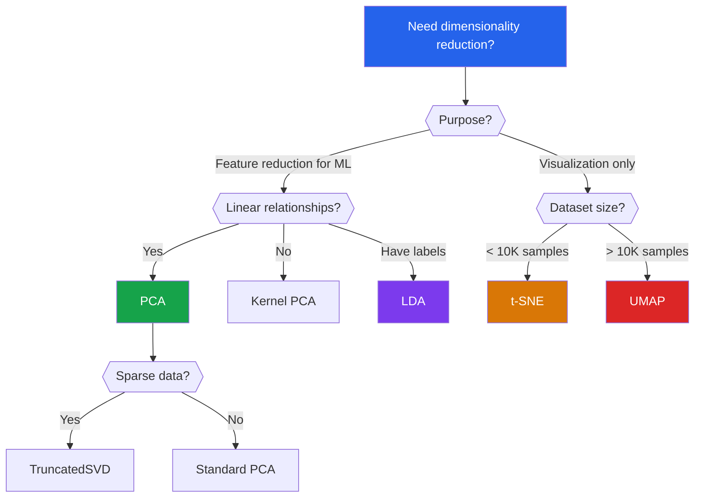

# Dimensionality Reduction

Real-world datasets routinely have hundreds or thousands of features. A single image in Fashion-MNIST has 784 pixels. Gene expression arrays carry 20,000+ dimensions. High-dimensional spaces introduce the **curse of dimensionality** — distances become meaningless, models overfit, and visualization is impossible. Dimensionality reduction compresses data into fewer dimensions while preserving the structure that matters.

## Why Reduce Dimensions?

| Problem | What Happens | How Reduction Helps |
|---------|-------------|-------------------|
| **Curse of dimensionality** | Distances converge — all points look equidistant | Fewer dimensions restore meaningful distances |
| **Overfitting** | More features than samples $\Rightarrow$ model memorizes noise | Reduce $d$ to below $n$ |
| **Computational cost** | Training scales with $O(nd^2)$ or worse | Smaller $d$ means faster everything |
| **Visualization** | Cannot plot 784 dimensions | Project to 2D/3D |
| **Multicollinearity** | Correlated features break linear models | Orthogonal components eliminate correlation |

---

## Principal Component Analysis (PCA)

PCA finds the directions of maximum variance in the data and projects onto them. It is the most fundamental linear dimensionality reduction technique.

### Mathematical Derivation

Given centered data matrix $X \in \mathbb{R}^{n \times d}$ (each row is a sample, mean-subtracted), PCA seeks a unit vector $w \in \mathbb{R}^d$ that maximizes the variance of the projection:

$$\max_{w} \text{Var}(Xw) = \max_{w} \frac{1}{n} w^T X^T X w = \max_{w} w^T \Sigma w$$

subject to $\|w\| = 1$, where $\Sigma = \frac{1}{n} X^T X$ is the covariance matrix.

### Lagrangian Solution

Introduce Lagrange multiplier $\lambda$:

$$\mathcal{L}(w, \lambda) = w^T \Sigma w - \lambda(w^T w - 1)$$

Take the derivative and set to zero:

$$\frac{\partial \mathcal{L}}{\partial w} = 2\Sigma w - 2\lambda w = 0$$

$$\Sigma w = \lambda w$$

This is an **eigenvalue equation**. The optimal $w$ is an eigenvector of $\Sigma$, and the variance along that direction equals the eigenvalue $\lambda$.

### Why the Largest Eigenvalue?

Substituting back:

$$w^T \Sigma w = w^T \lambda w = \lambda \|w\|^2 = \lambda$$

The variance of the projection equals $\lambda$. To maximize variance, choose the eigenvector with the **largest eigenvalue**. The second principal component is the eigenvector with the second-largest eigenvalue, and so on — all mutually orthogonal.

### Explained Variance Ratio

The proportion of variance explained by the first $k$ components:

$$\text{EVR}(k) = \frac{\sum_{i=1}^{k} \lambda_i}{\sum_{i=1}^{d} \lambda_i}$$

::: details Worked Example — PCA Explained Variance Ratio

**Eigenvalues from a 4-feature dataset: lambda = [5.0, 2.5, 1.0, 0.5]**

**Step 1:** Total variance
  total = 5.0 + 2.5 + 1.0 + 0.5 = 9.0

**Step 2:** Individual explained variance ratios
  EVR_1 = 5.0 / 9.0 = 0.556 (55.6%)
  EVR_2 = 2.5 / 9.0 = 0.278 (27.8%)
  EVR_3 = 1.0 / 9.0 = 0.111 (11.1%)
  EVR_4 = 0.5 / 9.0 = 0.056 (5.6%)

**Step 3:** Cumulative explained variance
  k=1: 55.6%
  k=2: 55.6% + 27.8% = 83.3%
  k=3: 83.3% + 11.1% = 94.4%
  k=4: 94.4% + 5.6% = 100.0%

**Step 4:** Choose k for 95% threshold
  We need k=4 for >= 95% (94.4% at k=3 is just under). In practice, k=3 retaining 94.4% is often acceptable.

**Interpret:**
  "The first 2 components capture 83.3% of variance — reducing 4 dimensions to 2 with only 16.7% information loss. The first component alone captures over half the total variance."

:::

A common rule: keep enough components to explain 95% of the variance.

### PCA via SVD

In practice, PCA is computed via the Singular Value Decomposition rather than eigendecomposition of $\Sigma$, because SVD is numerically more stable:

$$X = U S V^T$$

where $U \in \mathbb{R}^{n \times n}$, $S \in \mathbb{R}^{n \times d}$ (diagonal), $V \in \mathbb{R}^{d \times d}$.

The columns of $V$ are the principal components. The singular values $s_i$ relate to eigenvalues by $\lambda_i = s_i^2 / n$.

### From-Scratch PCA Implementation

```python
import numpy as np

class PCAFromScratch:
    """PCA via eigendecomposition with full derivation."""

    def __init__(self, n_components=2):
        self.n_components = n_components

    def fit(self, X):
        n_samples, n_features = X.shape

        # Step 1: Center the data (subtract mean)
        self.mean_ = X.mean(axis=0)
        X_centered = X - self.mean_

        # Step 2: Compute covariance matrix
        # Use (n-1) for unbiased estimate (matches sklearn)
        self.covariance_ = np.dot(X_centered.T, X_centered) / (n_samples - 1)

        # Step 3: Eigendecomposition
        eigenvalues, eigenvectors = np.linalg.eigh(self.covariance_)

        # Step 4: Sort by eigenvalue descending
        sorted_idx = np.argsort(eigenvalues)[::-1]
        eigenvalues = eigenvalues[sorted_idx]
        eigenvectors = eigenvectors[:, sorted_idx]

        # Step 5: Keep top k components
        self.components_ = eigenvectors[:, :self.n_components].T  # (k, d)
        self.explained_variance_ = eigenvalues[:self.n_components]
        self.explained_variance_ratio_ = (
            eigenvalues[:self.n_components] / eigenvalues.sum()
        )
        self.all_eigenvalues_ = eigenvalues
        return self

    def transform(self, X):
        X_centered = X - self.mean_
        return np.dot(X_centered, self.components_.T)

    def fit_transform(self, X):
        self.fit(X)
        return self.transform(X)

    def inverse_transform(self, X_reduced):
        return np.dot(X_reduced, self.components_) + self.mean_


# ---- Verify against sklearn ----
from sklearn.decomposition import PCA as SklearnPCA
from sklearn.datasets import load_iris

iris = load_iris()
X = iris.data

# Our implementation
pca_scratch = PCAFromScratch(n_components=2)
X_scratch = pca_scratch.fit_transform(X)

# Sklearn
pca_sklearn = SklearnPCA(n_components=2)
X_sklearn = pca_sklearn.fit_transform(X)

# Compare (signs may differ — eigenvectors are unique up to sign)
print("Explained variance ratios (scratch):", pca_scratch.explained_variance_ratio_)
print("Explained variance ratios (sklearn):", pca_sklearn.explained_variance_ratio_)
# scratch: [0.7296, 0.2285]
# sklearn: [0.7296, 0.2285]
```

### PCA via SVD (More Stable)

```python
class PCA_SVD:
    """PCA via Singular Value Decomposition — numerically stable."""

    def __init__(self, n_components=2):
        self.n_components = n_components

    def fit(self, X):
        n = X.shape[0]
        self.mean_ = X.mean(axis=0)
        X_centered = X - self.mean_

        # Economy SVD
        U, S, Vt = np.linalg.svd(X_centered, full_matrices=False)

        self.components_ = Vt[:self.n_components]        # (k, d)
        self.singular_values_ = S[:self.n_components]
        self.explained_variance_ = (S[:self.n_components] ** 2) / (n - 1)
        total_var = (S ** 2).sum() / (n - 1)
        self.explained_variance_ratio_ = self.explained_variance_ / total_var
        return self

    def transform(self, X):
        return (X - self.mean_) @ self.components_.T

    def fit_transform(self, X):
        self.fit(X)
        return self.transform(X)
```

### Choosing the Number of Components

```python
import matplotlib.pyplot as plt
from sklearn.datasets import fetch_openml

# Fashion-MNIST (subset)
fmnist = fetch_openml('Fashion-MNIST', version=1, as_frame=False, parser='auto')
X_full, y_full = fmnist.data[:10000].astype(np.float32), fmnist.target[:10000]

pca_full = SklearnPCA(n_components=100, random_state=42)
pca_full.fit(X_full)

cumulative_var = np.cumsum(pca_full.explained_variance_ratio_)

fig, axes = plt.subplots(1, 2, figsize=(14, 5))

# Scree plot
axes[0].bar(range(1, 51), pca_full.explained_variance_ratio_[:50], alpha=0.7)
axes[0].set_xlabel('Principal Component')
axes[0].set_ylabel('Explained Variance Ratio')
axes[0].set_title('Scree Plot (First 50 Components)')

# Cumulative explained variance
axes[1].plot(range(1, 101), cumulative_var, 'b-o', markersize=3)
axes[1].axhline(y=0.95, color='r', linestyle='--', label='95% threshold')
n_95 = np.argmax(cumulative_var >= 0.95) + 1
axes[1].axvline(x=n_95, color='g', linestyle='--', label=f'{n_95} components')
axes[1].set_xlabel('Number of Components')
axes[1].set_ylabel('Cumulative Explained Variance')
axes[1].set_title(f'95% variance at {n_95} components (of 784)')
axes[1].legend()

plt.tight_layout()
plt.savefig('pca_variance_explained.png', dpi=150, bbox_inches='tight')
plt.show()
```

---

## t-SNE: t-Distributed Stochastic Neighbor Embedding

PCA preserves global variance. t-SNE preserves **local neighborhood structure** — making it ideal for visualization of clusters in 2D.

### The Math Behind t-SNE

#### Step 1: Pairwise Similarities in High-D (Gaussian)

For each pair $(x_i, x_j)$, define the conditional probability that $x_i$ would pick $x_j$ as its neighbor under a Gaussian centered at $x_i$:

$$p_{j|i} = \frac{\exp\left(-\|x_i - x_j\|^2 / 2\sigma_i^2\right)}{\sum_{k \neq i} \exp\left(-\|x_i - x_k\|^2 / 2\sigma_i^2\right)}$$

Symmetrize: $p_{ij} = \frac{p_{j|i} + p_{i|j}}{2n}$

#### Step 2: Pairwise Similarities in Low-D (Student-t)

In the low-dimensional embedding $Y = \{y_1, \ldots, y_n\}$, use a **Student-t distribution** with 1 degree of freedom (Cauchy):

$$q_{ij} = \frac{(1 + \|y_i - y_j\|^2)^{-1}}{\sum_{k \neq l} (1 + \|y_k - y_l\|^2)^{-1}}$$

The heavy tails of the t-distribution allow moderate distances in high-D to become larger distances in low-D, alleviating the **crowding problem**.

#### Step 3: Minimize KL Divergence

Find embedding $Y$ that minimizes:

$$C = KL(P \| Q) = \sum_{i \neq j} p_{ij} \log \frac{p_{ij}}{q_{ij}}$$

via gradient descent. The gradient is:

$$\frac{\partial C}{\partial y_i} = 4 \sum_{j} (p_{ij} - q_{ij})(y_i - y_j)(1 + \|y_i - y_j\|^2)^{-1}$$

### Perplexity: The Key Hyperparameter

Perplexity controls the effective number of neighbors. It is related to $\sigma_i$ via:

$$\text{Perp}(P_i) = 2^{H(P_i)}$$

where $H(P_i) = -\sum_j p_{j|i} \log_2 p_{j|i}$ is the Shannon entropy.

For each point $x_i$, $\sigma_i$ is found by binary search so that $\text{Perp}(P_i)$ matches the user-specified perplexity (typically 5-50).

| Perplexity | Effect |
|-----------|--------|
| **5-10** | Focus on very local structure — tight clusters but may fragment |
| **30** | Good default — balances local and global |
| **50-100** | More global structure — clusters spread out |
| **> n/3** | Meaningless — too many "neighbors" |

### t-SNE on Fashion-MNIST

```python
from sklearn.manifold import TSNE
import matplotlib.pyplot as plt
import numpy as np

# Use PCA first to reduce to 50D (speeds up t-SNE dramatically)
from sklearn.decomposition import PCA

pca_50 = PCA(n_components=50, random_state=42)
X_pca50 = pca_50.fit_transform(X_full)

# Labels for Fashion-MNIST
label_names = ['T-shirt', 'Trouser', 'Pullover', 'Dress', 'Coat',
               'Sandal', 'Shirt', 'Sneaker', 'Bag', 'Ankle boot']
y_int = y_full.astype(int)

fig, axes = plt.subplots(1, 3, figsize=(21, 6))

for idx, perp in enumerate([5, 30, 100]):
    tsne = TSNE(n_components=2, perplexity=perp, random_state=42,
                n_iter=1000, learning_rate='auto', init='pca')
    X_tsne = tsne.fit_transform(X_pca50)

    scatter = axes[idx].scatter(X_tsne[:, 0], X_tsne[:, 1],
                                c=y_int, cmap='tab10', s=5, alpha=0.6)
    axes[idx].set_title(f't-SNE (perplexity={perp})')
    axes[idx].set_xticks([])
    axes[idx].set_yticks([])

plt.colorbar(scatter, ax=axes, label='Class', ticks=range(10))
plt.suptitle('t-SNE Perplexity Comparison — Fashion-MNIST', fontsize=14)
plt.tight_layout()
plt.savefig('tsne_perplexity_comparison.png', dpi=150, bbox_inches='tight')
plt.show()
```

### t-SNE Pitfalls

::: warning Common Mistakes
1. **Cluster sizes are meaningless** — t-SNE can expand dense clusters and compress sparse ones
2. **Distances between clusters are meaningless** — only within-cluster structure is reliable
3. **Must run multiple times** — different random seeds give different layouts
4. **Hyperparameters matter** — always try multiple perplexities
5. **Not for downstream ML** — use PCA for feature reduction, t-SNE only for visualization
:::

---

## UMAP: Uniform Manifold Approximation and Projection

UMAP (2018) is faster than t-SNE, preserves more global structure, and has a rigorous mathematical foundation based on Riemannian geometry and algebraic topology.

### UMAP Theory (Simplified)

1. **Construct a fuzzy simplicial set** in high-D: For each point, find $k$ nearest neighbors and assign edge weights using a smooth decay:

$$w(x_i, x_j) = \exp\left(-\frac{d(x_i, x_j) - \rho_i}{\sigma_i}\right)$$

where $\rho_i$ is the distance to the nearest neighbor (ensures local connectivity) and $\sigma_i$ is calibrated to achieve the desired number of effective neighbors.

2. **Symmetrize** using the probabilistic t-conorm: $w_{ij} = w_{i \to j} + w_{j \to i} - w_{i \to j} \cdot w_{j \to i}$

3. **Construct low-D graph** with edge weights:

$$v(y_i, y_j) = \left(1 + a \|y_i - y_j\|^{2b}\right)^{-1}$$

where $a$ and $b$ are fit to match the desired `min_dist` parameter.

4. **Optimize** by minimizing the fuzzy set cross-entropy:

$$C = \sum_{ij} \left[ w_{ij} \log \frac{w_{ij}}{v_{ij}} + (1 - w_{ij}) \log \frac{1 - w_{ij}}{1 - v_{ij}} \right]$$

### Key UMAP Parameters

| Parameter | Default | Effect |
|-----------|---------|--------|
| `n_neighbors` | 15 | Like perplexity — larger = more global |
| `min_dist` | 0.1 | How tightly points clump — 0.0 = very tight clusters |
| `n_components` | 2 | Output dimensions — can use > 2 for downstream ML |
| `metric` | 'euclidean' | Distance metric — cosine, manhattan, etc. |

### UMAP vs t-SNE vs PCA on Fashion-MNIST

```python
import umap
from sklearn.manifold import TSNE
from sklearn.decomposition import PCA
import matplotlib.pyplot as plt

fig, axes = plt.subplots(1, 3, figsize=(21, 6))

# PCA
pca_2d = PCA(n_components=2, random_state=42)
X_pca = pca_2d.fit_transform(X_full)
axes[0].scatter(X_pca[:, 0], X_pca[:, 1], c=y_int, cmap='tab10', s=5, alpha=0.5)
axes[0].set_title(f'PCA (EVR: {pca_2d.explained_variance_ratio_.sum():.1%})')

# t-SNE
tsne = TSNE(n_components=2, perplexity=30, random_state=42, init='pca')
X_tsne = tsne.fit_transform(X_pca50)
axes[1].scatter(X_tsne[:, 0], X_tsne[:, 1], c=y_int, cmap='tab10', s=5, alpha=0.5)
axes[1].set_title('t-SNE (perplexity=30)')

# UMAP
reducer = umap.UMAP(n_neighbors=15, min_dist=0.1, random_state=42)
X_umap = reducer.fit_transform(X_pca50)
axes[2].scatter(X_umap[:, 0], X_umap[:, 1], c=y_int, cmap='tab10', s=5, alpha=0.5)
axes[2].set_title('UMAP (n_neighbors=15, min_dist=0.1)')

for ax in axes:
    ax.set_xticks([])
    ax.set_yticks([])

plt.suptitle('Dimensionality Reduction Comparison — Fashion-MNIST (10K samples)', fontsize=14)
plt.tight_layout()
plt.savefig('dim_reduction_comparison.png', dpi=150, bbox_inches='tight')
plt.show()
```

---

## Linear Discriminant Analysis (LDA)

Unlike PCA (unsupervised), LDA is **supervised** — it uses class labels to find projections that maximize class separation.

### Mathematical Formulation

Given $C$ classes, LDA maximizes the **Fisher criterion**:

$$J(w) = \frac{w^T S_B w}{w^T S_W w}$$

::: details Worked Example — LDA Fisher Criterion

**2-class, 1-feature problem:**
- Class 0: samples = [1, 2, 3], mean mu0 = 2
- Class 1: samples = [7, 8, 9], mean mu1 = 8
- Overall mean: mu = (2+8)/2 = 5

**Step 1:** Between-class scatter S_B
  S_B = n0*(mu0 - mu)^2 + n1*(mu1 - mu)^2
      = 3*(2-5)^2 + 3*(8-5)^2
      = 3*9 + 3*9 = 27 + 27 = 54

**Step 2:** Within-class scatter S_W
  S_W = sum of squared deviations within each class
  Class 0: (1-2)^2 + (2-2)^2 + (3-2)^2 = 1 + 0 + 1 = 2
  Class 1: (7-8)^2 + (8-8)^2 + (9-8)^2 = 1 + 0 + 1 = 2
  S_W = 2 + 2 = 4

**Step 3:** Fisher criterion
  J = S_B / S_W = 54 / 4 = 13.5

**Interpret:**
  "J = 13.5 is high, meaning the classes are well-separated relative to their internal spread. LDA would project onto this direction since it maximally separates the class means (distance of 6) relative to the within-class spread (std dev ~0.82 each)."

:::

where:

- **Between-class scatter matrix**: $S_B = \sum_{c=1}^{C} n_c (\mu_c - \mu)(\mu_c - \mu)^T$
- **Within-class scatter matrix**: $S_W = \sum_{c=1}^{C} \sum_{x_i \in C_c} (x_i - \mu_c)(x_i - \mu_c)^T$

$\mu_c$ is the mean of class $c$, $\mu$ is the overall mean, $n_c$ is the number of samples in class $c$.

### Solution

Maximizing $J(w)$ leads to the generalized eigenvalue problem:

$$S_B w = \lambda S_W w$$

or equivalently $S_W^{-1} S_B w = \lambda w$.

The maximum number of discriminant components is $\min(d, C-1)$.

### LDA From Scratch

```python
class LDAFromScratch:
    """Linear Discriminant Analysis for dimensionality reduction."""

    def __init__(self, n_components=2):
        self.n_components = n_components

    def fit(self, X, y):
        n_samples, n_features = X.shape
        classes = np.unique(y)
        n_classes = len(classes)

        # Overall mean
        mean_overall = X.mean(axis=0)

        # Within-class and between-class scatter matrices
        S_W = np.zeros((n_features, n_features))
        S_B = np.zeros((n_features, n_features))

        for c in classes:
            X_c = X[y == c]
            mean_c = X_c.mean(axis=0)
            n_c = X_c.shape[0]

            # Within-class scatter
            diff = X_c - mean_c
            S_W += diff.T @ diff

            # Between-class scatter
            mean_diff = (mean_c - mean_overall).reshape(-1, 1)
            S_B += n_c * (mean_diff @ mean_diff.T)

        # Solve generalized eigenvalue problem
        eigenvalues, eigenvectors = np.linalg.eigh(
            np.linalg.pinv(S_W) @ S_B
        )

        # Sort descending
        sorted_idx = np.argsort(eigenvalues)[::-1]
        self.eigenvalues_ = eigenvalues[sorted_idx]
        self.components_ = eigenvectors[:, sorted_idx[:self.n_components]].T

        self.explained_variance_ratio_ = (
            self.eigenvalues_[:self.n_components] /
            max(self.eigenvalues_.sum(), 1e-10)
        )
        return self

    def transform(self, X):
        return X @ self.components_.T

    def fit_transform(self, X, y):
        self.fit(X, y)
        return self.transform(X)


# Compare PCA vs LDA on Fashion-MNIST
from sklearn.discriminant_analysis import LinearDiscriminantAnalysis

fig, axes = plt.subplots(1, 2, figsize=(14, 6))

# PCA (unsupervised)
pca = PCA(n_components=2)
X_pca = pca.fit_transform(X_full)
axes[0].scatter(X_pca[:, 0], X_pca[:, 1], c=y_int, cmap='tab10', s=5, alpha=0.4)
axes[0].set_title('PCA (unsupervised) — ignores labels')

# LDA (supervised)
lda = LinearDiscriminantAnalysis(n_components=2)
X_lda = lda.fit_transform(X_full, y_int)
axes[1].scatter(X_lda[:, 0], X_lda[:, 1], c=y_int, cmap='tab10', s=5, alpha=0.4)
axes[1].set_title('LDA (supervised) — maximizes class separation')

plt.suptitle('PCA vs LDA on Fashion-MNIST', fontsize=14)
plt.tight_layout()
plt.savefig('pca_vs_lda.png', dpi=150, bbox_inches='tight')
plt.show()
```

---

## Kernel PCA

Standard PCA only captures linear relationships. **Kernel PCA** applies the kernel trick to perform PCA in a high-dimensional feature space, capturing nonlinear structure.

### The Kernel Trick

Instead of computing $\phi(x_i)^T \phi(x_j)$ in the (possibly infinite-dimensional) feature space, use a kernel function:

$$K(x_i, x_j) = \phi(x_i)^T \phi(x_j)$$

Common kernels:

| Kernel | Formula | Good For |
|--------|---------|----------|
| Linear | $x_i^T x_j$ | Standard PCA |
| RBF | $\exp(-\gamma \|x_i - x_j\|^2)$ | Nonlinear manifolds |
| Polynomial | $(x_i^T x_j + c)^d$ | Polynomial relationships |
| Cosine | $\frac{x_i^T x_j}{\|x_i\| \|x_j\|}$ | Text data |

```python
from sklearn.decomposition import KernelPCA
from sklearn.datasets import make_moons

# Generate nonlinear data
X_moons, y_moons = make_moons(n_samples=500, noise=0.1, random_state=42)

fig, axes = plt.subplots(1, 3, figsize=(18, 5))

# Standard PCA
pca = PCA(n_components=1)
X_pca_1d = pca.fit_transform(X_moons)
axes[0].scatter(X_pca_1d[:, 0], np.zeros_like(X_pca_1d[:, 0]),
                c=y_moons, cmap='coolwarm', s=20, alpha=0.7)
axes[0].set_title('Linear PCA → 1D (fails to separate)')

# RBF Kernel PCA
kpca = KernelPCA(n_components=1, kernel='rbf', gamma=15)
X_kpca_1d = kpca.fit_transform(X_moons)
axes[1].scatter(X_kpca_1d[:, 0], np.zeros_like(X_kpca_1d[:, 0]),
                c=y_moons, cmap='coolwarm', s=20, alpha=0.7)
axes[1].set_title('Kernel PCA (RBF) → 1D (separates!)')

# Original data
axes[2].scatter(X_moons[:, 0], X_moons[:, 1], c=y_moons, cmap='coolwarm', s=20)
axes[2].set_title('Original 2D Moon Data')

plt.tight_layout()
plt.savefig('kernel_pca_moons.png', dpi=150, bbox_inches='tight')
plt.show()
```

---

## Truncated SVD (for Sparse Data)

PCA requires centering, which destroys sparsity. **TruncatedSVD** works directly on sparse matrices — essential for TF-IDF text data.

```python
from sklearn.decomposition import TruncatedSVD
from sklearn.feature_extraction.text import TfidfVectorizer
from sklearn.datasets import fetch_20newsgroups

# Load text data
categories = ['sci.space', 'rec.sport.baseball', 'comp.graphics', 'talk.politics.guns']
news = fetch_20newsgroups(subset='train', categories=categories, random_state=42)

# TF-IDF (sparse matrix)
tfidf = TfidfVectorizer(max_features=10000, stop_words='english')
X_tfidf = tfidf.fit_transform(news.data)
print(f"TF-IDF matrix: {X_tfidf.shape}, sparsity: {1 - X_tfidf.nnz / np.prod(X_tfidf.shape):.4%}")

# TruncatedSVD (works on sparse — PCA would fail or be slow)
svd = TruncatedSVD(n_components=2, random_state=42)
X_svd = svd.fit_transform(X_tfidf)

plt.figure(figsize=(10, 7))
for i, cat in enumerate(categories):
    mask = np.array(news.target) == i
    plt.scatter(X_svd[mask, 0], X_svd[mask, 1], label=cat.split('.')[-1],
                s=15, alpha=0.6)
plt.legend()
plt.title('TruncatedSVD on TF-IDF (20 Newsgroups)')
plt.savefig('truncated_svd_text.png', dpi=150, bbox_inches='tight')
plt.show()
```

---

## Complete Fashion-MNIST Pipeline

```python
import numpy as np
import matplotlib.pyplot as plt
from sklearn.datasets import fetch_openml
from sklearn.decomposition import PCA
from sklearn.manifold import TSNE
from sklearn.discriminant_analysis import LinearDiscriminantAnalysis
import umap

# ---- Load data ----
fmnist = fetch_openml('Fashion-MNIST', version=1, as_frame=False, parser='auto')
X = fmnist.data[:10000].astype(np.float32) / 255.0  # normalize
y = fmnist.target[:10000].astype(int)

label_map = {0: 'T-shirt', 1: 'Trouser', 2: 'Pullover', 3: 'Dress',
             4: 'Coat', 5: 'Sandal', 6: 'Shirt', 7: 'Sneaker',
             8: 'Bag', 9: 'Ankle boot'}

# ---- Preprocessing: PCA to 50D ----
pca_50 = PCA(n_components=50, random_state=42)
X_50 = pca_50.fit_transform(X)
print(f"PCA 784D → 50D retains {pca_50.explained_variance_ratio_.sum():.1%} variance")

# ---- Four methods ----
methods = {
    'PCA (2D)': PCA(n_components=2).fit_transform(X),
    'LDA (2D)': LinearDiscriminantAnalysis(n_components=2).fit_transform(X, y),
    't-SNE': TSNE(n_components=2, perplexity=30, random_state=42, init='pca').fit_transform(X_50),
    'UMAP': umap.UMAP(n_neighbors=15, min_dist=0.1, random_state=42).fit_transform(X_50),
}

fig, axes = plt.subplots(2, 2, figsize=(16, 14))
for ax, (name, X_2d) in zip(axes.ravel(), methods.items()):
    for cls_id in range(10):
        mask = y == cls_id
        ax.scatter(X_2d[mask, 0], X_2d[mask, 1], s=5, alpha=0.5,
                   label=label_map[cls_id])
    ax.set_title(name, fontsize=13)
    ax.set_xticks([])
    ax.set_yticks([])

axes[0, 1].legend(loc='upper right', fontsize=7, markerscale=3)
plt.suptitle('Fashion-MNIST: Four Dimensionality Reduction Methods Compared', fontsize=15)
plt.tight_layout()
plt.savefig('fmnist_all_methods.png', dpi=150, bbox_inches='tight')
plt.show()
```

---

## Method Selection Guide



### Comparison Table

| Method | Type | Preserves | Speed | Use For | Limitation |
|--------|------|-----------|-------|---------|-----------|
| **PCA** | Linear | Global variance | Very fast | Feature reduction, denoising | Cannot capture nonlinear structure |
| **Kernel PCA** | Nonlinear | Nonlinear manifold | Slow ($O(n^3)$) | Nonlinear feature reduction | Kernel selection, scalability |
| **t-SNE** | Nonlinear | Local neighbors | Slow ($O(n^2)$) | 2D visualization | No transform for new data |
| **UMAP** | Nonlinear | Local + global | Fast | Visualization + features | Hyperparameter-sensitive |
| **LDA** | Linear, supervised | Class separation | Fast | Classification preprocessing | Max $C-1$ components |
| **TruncatedSVD** | Linear | Variance (sparse) | Fast | Sparse/text data | No centering |

---

## Reconstruction Error and Denoising

PCA can **denoise** data by projecting to a lower dimension and reconstructing:

```python
# Add noise to Fashion-MNIST images
noise_factor = 0.5
X_noisy = X + noise_factor * np.random.normal(0, 1, X.shape)
X_noisy = np.clip(X_noisy, 0, 1)

# Denoise using PCA (keep 50 components out of 784)
pca_denoise = PCA(n_components=50, random_state=42)
X_denoised = pca_denoise.inverse_transform(pca_denoise.fit_transform(X_noisy))

# Visualize
fig, axes = plt.subplots(3, 10, figsize=(15, 5))
for i in range(10):
    axes[0, i].imshow(X[i].reshape(28, 28), cmap='gray')
    axes[1, i].imshow(X_noisy[i].reshape(28, 28), cmap='gray')
    axes[2, i].imshow(X_denoised[i].reshape(28, 28), cmap='gray')
    for ax_row in axes:
        ax_row[i].axis('off')

axes[0, 0].set_ylabel('Original', fontsize=10)
axes[1, 0].set_ylabel('Noisy', fontsize=10)
axes[2, 0].set_ylabel('Denoised', fontsize=10)
plt.suptitle('PCA Denoising (50 components)', fontsize=13)
plt.tight_layout()
plt.savefig('pca_denoising.png', dpi=150, bbox_inches='tight')
plt.show()

# Reconstruction error as function of components
errors = []
components_range = [5, 10, 20, 50, 100, 200, 400]
for k in components_range:
    pca_k = PCA(n_components=k)
    X_reconstructed = pca_k.inverse_transform(pca_k.fit_transform(X))
    mse = np.mean((X - X_reconstructed) ** 2)
    errors.append(mse)
    print(f"k={k:3d}: MSE={mse:.6f}, EVR={pca_k.explained_variance_ratio_.sum():.4f}")

plt.figure(figsize=(8, 5))
plt.plot(components_range, errors, 'bo-')
plt.xlabel('Number of Components')
plt.ylabel('Mean Squared Reconstruction Error')
plt.title('PCA Reconstruction Error vs. Components')
plt.grid(True, alpha=0.3)
plt.savefig('reconstruction_error.png', dpi=150, bbox_inches='tight')
plt.show()
```

---

## Common Pitfalls and Best Practices

### Pitfall 1: Not Scaling Before PCA

PCA is sensitive to feature scales. A feature in the range $[0, 10000]$ will dominate components over a feature in $[0, 1]$.

```python
from sklearn.preprocessing import StandardScaler

# Always scale before PCA (unless all features are on the same scale)
scaler = StandardScaler()
X_scaled = scaler.fit_transform(X)
pca = PCA(n_components=2)
X_pca = pca.fit_transform(X_scaled)
```

### Pitfall 2: Using t-SNE for Feature Reduction

t-SNE is **only for visualization**. It does not preserve distances, cannot transform new data, and gives different results each run. Never feed t-SNE output into a classifier.

### Pitfall 3: Ignoring the Explained Variance

Always check how much variance your chosen number of components explains. If 2 PCA components explain only 20% of variance, your 2D plot is misleading.

### Pitfall 4: UMAP Reproducibility

UMAP uses random initialization. Always set `random_state` for reproducibility. Results can change significantly between runs without it.

::: tip When to Use What
- **Preprocessing for ML**: PCA (linear), UMAP with `n_components > 2` (nonlinear)
- **Visualization**: UMAP (fast, good clusters) or t-SNE (established, well-understood)
- **Supervised feature reduction**: LDA
- **Sparse data (NLP)**: TruncatedSVD
- **Denoising**: PCA (inverse_transform reconstructs without noise)
:::

---

## Key Takeaways

| Concept | Remember |
|---------|----------|
| PCA finds eigenvectors of the covariance matrix | Eigenvalues = variance explained per component |
| PCA via SVD is numerically stable | Always preferred in practice |
| t-SNE preserves local structure only | Cluster sizes and inter-cluster distances are meaningless |
| Perplexity controls neighborhood size | Always try 5, 30, 50 and compare |
| UMAP is faster and preserves more global structure | Preferred over t-SNE for large datasets |
| LDA is supervised | Maximum $C-1$ components; maximizes Fisher criterion |
| Always scale before PCA | Unless features are already on the same scale |
| PCA for ML, t-SNE/UMAP for visualization | Never feed t-SNE into a classifier |
