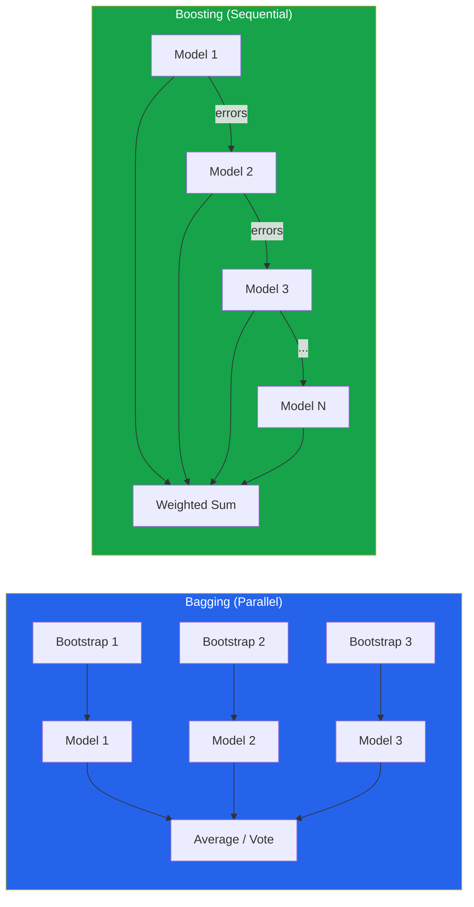

# Ensemble Methods

An ensemble combines multiple models to produce better predictions than any individual model. The idea is old — the "wisdom of crowds" principle — but the mathematics behind why it works is rigorous and powerful. Ensemble methods have dominated machine learning competitions for a decade and remain the go-to approach for production tabular data models.

## Why Ensembles Work

### The Diversity Theorem

For regression with $M$ models, the ensemble's squared error can be decomposed as:

$$\text{MSE}_{\text{ensemble}} = \overline{\text{MSE}} - \overline{\text{diversity}}$$

where $\overline{\text{MSE}}$ is the average individual error and $\overline{\text{diversity}}$ measures how differently the models err. More diversity = lower ensemble error.

### Mathematical Proof for Averaging

Consider $M$ independent models, each with error $\epsilon_m$ where $E[\epsilon_m] = 0$ and $\text{Var}(\epsilon_m) = \sigma^2$.

The ensemble prediction is $\hat{f}_{\text{ens}} = \frac{1}{M}\sum_{m=1}^{M} \hat{f}_m$, so the ensemble error is:

$$\epsilon_{\text{ens}} = \frac{1}{M}\sum_{m=1}^{M} \epsilon_m$$

$$\text{Var}(\epsilon_{\text{ens}}) = \frac{1}{M^2}\sum_{m=1}^{M}\text{Var}(\epsilon_m) = \frac{\sigma^2}{M}$$

::: details Worked Example — Ensemble Variance Reduction

**5 independent models, each with error variance sigma^2 = 0.20:**

**Step 1:** Single model variance
  Var(epsilon_1) = 0.20

**Step 2:** Ensemble of M=5 (average prediction)
  Var(epsilon_ens) = sigma^2 / M = 0.20 / 5 = 0.04

**Step 3:** Ensemble of M=20
  Var(epsilon_ens) = 0.20 / 20 = 0.01

**Step 4:** With correlated models (rho=0.5, M=5)
  Var = rho*sigma^2 + (1-rho)/M * sigma^2
     = 0.5*0.20 + (0.5/5)*0.20
     = 0.10 + 0.02 = 0.12

**Interpret:**
  "With 5 independent models, variance drops from 0.20 to 0.04 (5x reduction). But if models are correlated (rho=0.5), variance only drops to 0.12 (1.7x). As M goes to infinity, the variance floor is rho*sigma^2 = 0.10 — you can never get below this with correlated models. Diversity is critical."

:::

The variance drops by a factor of $M$. But this assumes **independence** — which is never perfectly true.

### With Correlated Models

If each pair of errors has correlation $\rho$:

$$\text{Var}(\epsilon_{\text{ens}}) = \frac{1}{M^2}\left(M\sigma^2 + M(M-1)\rho\sigma^2\right) = \rho\sigma^2 + \frac{1-\rho}{M}\sigma^2$$

As $M \to \infty$: $\text{Var} \to \rho\sigma^2$.

**Conclusion**: The ensemble variance is bounded by the correlation between models. **Diversity is crucial** — uncorrelated errors cancel; correlated errors do not.

---

## Bagging (Bootstrap Aggregating)

### Algorithm

1. Create $M$ bootstrap samples from the training data (sample $n$ points with replacement)
2. Train one model on each bootstrap sample
3. **Aggregate**: Average (regression) or majority vote (classification)

### Why Bootstrap Introduces Diversity

Each bootstrap sample contains approximately 63.2% of unique training points (the rest are duplicates). The remaining 36.8% are "out-of-bag" (OOB) samples:

$$P(\text{point not in bootstrap}) = \left(1 - \frac{1}{n}\right)^n \approx e^{-1} \approx 0.368$$

::: details Worked Example — Bootstrap OOB Probability

**Dataset with n=5 samples. What fraction is OOB for each tree?**

**Step 1:** Probability a specific point is NOT picked in one draw
  P(miss) = 1 - 1/5 = 4/5 = 0.8

**Step 2:** Probability NOT picked in any of n=5 draws (with replacement)
  P(OOB) = (4/5)^5 = 0.8^5 = 0.32768

**Step 3:** For larger n
  n=10:   P(OOB) = (9/10)^10 = 0.349
  n=100:  P(OOB) = (99/100)^100 = 0.366
  n=1000: P(OOB) = (999/1000)^1000 = 0.368

**Step 4:** Unique samples in bootstrap
  Expected unique = n * (1 - P(OOB))
  For n=1000: 1000 * (1 - 0.368) = 632 unique samples

**Interpret:**
  "About 36.8% of data is left out of each bootstrap sample (OOB). These OOB samples serve as free validation data. For n=1000, each tree trains on ~632 unique samples and is validated on ~368."

:::

Different models see different subsets, creating diversity.

### Bagging From Scratch

```python
import numpy as np
from sklearn.tree import DecisionTreeClassifier
from sklearn.datasets import load_breast_cancer
from sklearn.model_selection import cross_val_score

class BaggingFromScratch:
    """Bagging classifier from scratch."""

    def __init__(self, base_estimator=None, n_estimators=50, random_state=42):
        self.base_estimator = base_estimator or DecisionTreeClassifier()
        self.n_estimators = n_estimators
        self.random_state = random_state

    def fit(self, X, y):
        self.models_ = []
        self.oob_predictions_ = np.zeros((len(X), len(np.unique(y))))
        self.oob_counts_ = np.zeros(len(X))
        rng = np.random.RandomState(self.random_state)

        for i in range(self.n_estimators):
            # Bootstrap sample
            idx = rng.choice(len(X), size=len(X), replace=True)
            oob_idx = np.setdiff1d(np.arange(len(X)), np.unique(idx))

            X_boot, y_boot = X[idx], y[idx]

            # Train model
            from sklearn.base import clone
            model = clone(self.base_estimator)
            model.set_params(random_state=self.random_state + i)
            model.fit(X_boot, y_boot)
            self.models_.append(model)

            # OOB predictions
            if len(oob_idx) > 0:
                oob_proba = model.predict_proba(X[oob_idx])
                self.oob_predictions_[oob_idx] += oob_proba
                self.oob_counts_[oob_idx] += 1

        # OOB score
        valid = self.oob_counts_ > 0
        oob_pred = np.argmax(self.oob_predictions_[valid] /
                              self.oob_counts_[valid, np.newaxis], axis=1)
        self.oob_score_ = np.mean(oob_pred == y[valid])

        return self

    def predict(self, X):
        """Majority vote."""
        predictions = np.array([m.predict(X) for m in self.models_])
        from scipy.stats import mode
        return mode(predictions, axis=0, keepdims=False).mode

    def predict_proba(self, X):
        """Average probabilities."""
        probas = np.array([m.predict_proba(X) for m in self.models_])
        return probas.mean(axis=0)


# Compare single tree vs bagging
cancer = load_breast_cancer()
X, y = cancer.data, cancer.target

tree = DecisionTreeClassifier(random_state=42)
scores_tree = cross_val_score(tree, X, y, cv=5, scoring='accuracy')
print(f"Single Decision Tree: {scores_tree.mean():.4f} +/- {scores_tree.std():.4f}")

bagging = BaggingFromScratch(n_estimators=100, random_state=42)
bagging.fit(X, y)
print(f"Bagging (100 trees) OOB: {bagging.oob_score_:.4f}")
```

### Random Forest = Bagging + Feature Subsampling

Random Forest adds another source of diversity: at each split, only a random subset of features is considered:

$$m_{\text{try}} = \sqrt{d} \text{ (classification)} \quad \text{or} \quad m_{\text{try}} = d/3 \text{ (regression)}$$

This **decorrelates** the trees (reduces $\rho$), which further reduces ensemble variance.

---

## Boosting

### Core Idea

Instead of training models independently (bagging), boosting trains them **sequentially**. Each new model focuses on the mistakes of the previous ensemble.

### AdaBoost Algorithm

Given data $(x_1, y_1), \ldots, (x_n, y_n)$ where $y_i \in \{-1, +1\}$:

1. Initialize weights: $w_i^{(1)} = \frac{1}{n}$
2. For $t = 1, \ldots, T$:
   a. Train weak learner $h_t$ on weighted data
   b. Compute weighted error: $\epsilon_t = \sum_{i: h_t(x_i) \neq y_i} w_i^{(t)}$
   c. Compute model weight: $\alpha_t = \frac{1}{2}\ln\frac{1 - \epsilon_t}{\epsilon_t}$
   d. Update sample weights: $w_i^{(t+1)} = w_i^{(t)} \exp(-\alpha_t y_i h_t(x_i))$
   e. Normalize weights: $w_i^{(t+1)} = \frac{w_i^{(t+1)}}{\sum_j w_j^{(t+1)}}$

3. Final prediction: $H(x) = \text{sign}\left(\sum_{t=1}^{T} \alpha_t h_t(x)\right)$

**Key insight**: Misclassified samples get higher weights, so the next learner focuses on them.

### Gradient Boosting

Generalizes boosting to any differentiable loss function. Instead of reweighting samples, fit each new model to the **negative gradient** (pseudo-residuals) of the loss:

For loss function $L(y, F(x))$ and current ensemble $F_m(x)$:

1. Compute pseudo-residuals: $r_{im} = -\frac{\partial L(y_i, F(x_i))}{\partial F(x_i)}\bigg|_{F = F_m}$
2. Fit a weak learner $h_m$ to the pseudo-residuals
3. Update: $F_{m+1}(x) = F_m(x) + \eta \cdot h_m(x)$ where $\eta$ is the learning rate

For MSE loss: $L = \frac{1}{2}(y - F)^2$, the pseudo-residual is $r_i = y_i - F_m(x_i)$ — the actual residual. Hence the name "gradient boosting on residuals."

### Gradient Boosting From Scratch

```python
import numpy as np
from sklearn.tree import DecisionTreeRegressor

class GradientBoostingFromScratch:
    """Gradient boosting for regression (MSE loss)."""

    def __init__(self, n_estimators=100, learning_rate=0.1, max_depth=3,
                 random_state=42):
        self.n_estimators = n_estimators
        self.learning_rate = learning_rate
        self.max_depth = max_depth
        self.random_state = random_state

    def fit(self, X, y):
        # Initialize with mean
        self.init_prediction_ = y.mean()
        self.trees_ = []

        F = np.full(len(y), self.init_prediction_)
        self.train_losses_ = []

        for i in range(self.n_estimators):
            # Pseudo-residuals (negative gradient of MSE)
            residuals = y - F

            # Fit tree to residuals
            tree = DecisionTreeRegressor(max_depth=self.max_depth,
                                         random_state=self.random_state + i)
            tree.fit(X, residuals)
            self.trees_.append(tree)

            # Update predictions
            update = self.learning_rate * tree.predict(X)
            F += update

            # Track loss
            mse = np.mean((y - F) ** 2)
            self.train_losses_.append(mse)

        return self

    def predict(self, X):
        F = np.full(X.shape[0], self.init_prediction_)
        for tree in self.trees_:
            F += self.learning_rate * tree.predict(X)
        return F


# Demo
from sklearn.datasets import load_diabetes
from sklearn.model_selection import train_test_split

diabetes = load_diabetes()
X_train, X_test, y_train, y_test = train_test_split(
    diabetes.data, diabetes.target, test_size=0.2, random_state=42
)

gb = GradientBoostingFromScratch(n_estimators=200, learning_rate=0.1, max_depth=3)
gb.fit(X_train, y_train)

y_pred = gb.predict(X_test)
mse = np.mean((y_test - y_pred) ** 2)
print(f"Gradient Boosting (scratch) MSE: {mse:.2f}")

import matplotlib.pyplot as plt
plt.figure(figsize=(10, 5))
plt.plot(gb.train_losses_, 'b-')
plt.xlabel('Number of Trees')
plt.ylabel('Training MSE')
plt.title('Gradient Boosting Training Loss')
plt.grid(True, alpha=0.3)
plt.savefig('gb_training_loss.png', dpi=150, bbox_inches='tight')
plt.show()
```

---

## Bagging vs Boosting

| Aspect | Bagging | Boosting |
|--------|---------|----------|
| **Training** | Parallel (independent models) | Sequential (dependent models) |
| **What it reduces** | **Variance** | **Bias** (and variance) |
| **Overfitting risk** | Low (more trees rarely hurts) | Higher (more trees can overfit) |
| **Best base learner** | High-variance (deep trees) | High-bias (shallow stumps) |
| **Speed** | Parallelizable | Sequential |
| **Robustness to noise** | More robust | Sensitive (upweights noisy samples) |
| **Typical algorithms** | Random Forest, Extra Trees | AdaBoost, XGBoost, LightGBM, CatBoost |



---

## Stacking (Stacked Generalization)

### Architecture

**Level 0 (Base Models)**: Train diverse models on the training data
**Level 1 (Meta-Learner)**: Train a model on the base models' out-of-fold predictions

The key insight: base models make different kinds of errors. The meta-learner learns **when to trust which model**.

### Stacking From Scratch

```python
from sklearn.model_selection import StratifiedKFold
from sklearn.base import clone
import numpy as np

class StackingFromScratch:
    """Two-level stacking classifier."""

    def __init__(self, base_models, meta_model, cv=5):
        self.base_models = base_models
        self.meta_model = meta_model
        self.cv = cv

    def fit(self, X, y):
        n_samples = len(y)
        n_models = len(self.base_models)
        self.fitted_base_models_ = []

        # Generate out-of-fold predictions for meta-features
        meta_features = np.zeros((n_samples, n_models))
        kf = StratifiedKFold(n_splits=self.cv, shuffle=True, random_state=42)

        for model_idx, (name, model) in enumerate(self.base_models):
            fold_models = []
            for train_idx, val_idx in kf.split(X, y):
                m = clone(model)
                m.fit(X[train_idx], y[train_idx])
                meta_features[val_idx, model_idx] = m.predict_proba(X[val_idx])[:, 1]
                fold_models.append(m)
            self.fitted_base_models_.append(fold_models)

        # Refit base models on full data for test-time predictions
        self.full_base_models_ = []
        for name, model in self.base_models:
            m = clone(model)
            m.fit(X, y)
            self.full_base_models_.append(m)

        # Train meta-learner on out-of-fold predictions
        self.meta_model_ = clone(self.meta_model)
        self.meta_model_.fit(meta_features, y)

        return self

    def predict(self, X):
        meta_features = np.column_stack([
            m.predict_proba(X)[:, 1] for m in self.full_base_models_
        ])
        return self.meta_model_.predict(meta_features)

    def predict_proba(self, X):
        meta_features = np.column_stack([
            m.predict_proba(X)[:, 1] for m in self.full_base_models_
        ])
        return self.meta_model_.predict_proba(meta_features)


# ---- Demo ----
from sklearn.linear_model import LogisticRegression
from sklearn.ensemble import RandomForestClassifier, GradientBoostingClassifier
from sklearn.svm import SVC
from sklearn.preprocessing import StandardScaler
from sklearn.pipeline import make_pipeline

base_models = [
    ('lr', make_pipeline(StandardScaler(), LogisticRegression(max_iter=1000))),
    ('rf', RandomForestClassifier(n_estimators=100, random_state=42)),
    ('gb', GradientBoostingClassifier(n_estimators=100, random_state=42)),
    ('svm', make_pipeline(StandardScaler(), SVC(probability=True, random_state=42))),
]

meta = LogisticRegression(max_iter=1000)

stacker = StackingFromScratch(base_models, meta, cv=5)
stacker.fit(X, y)

# Evaluate with fresh CV
from sklearn.model_selection import cross_val_score
from sklearn.ensemble import StackingClassifier

stack_sklearn = StackingClassifier(
    estimators=base_models,
    final_estimator=LogisticRegression(max_iter=1000),
    cv=5,
    passthrough=False
)

scores_stack = cross_val_score(stack_sklearn, X, y, cv=5, scoring='accuracy')
print(f"Stacking: {scores_stack.mean():.4f} +/- {scores_stack.std():.4f}")

# Compare with individual models
for name, model in base_models:
    scores = cross_val_score(model, X, y, cv=5, scoring='accuracy')
    print(f"{name:>5}: {scores.mean():.4f} +/- {scores.std():.4f}")
```

---

## Diversity Analysis

Diversity between models is critical for ensemble success. Measure it:

```python
from sklearn.metrics import cohen_kappa_score
import itertools

def ensemble_diversity(X, y, models):
    """Analyze diversity between ensemble members."""
    predictions = {}
    for name, model in models:
        m = clone(model)
        m.fit(X, y)
        predictions[name] = m.predict(X)

    # Pairwise disagreement rate
    print("Pairwise Disagreement Rate:")
    for (n1, p1), (n2, p2) in itertools.combinations(predictions.items(), 2):
        disagreement = np.mean(p1 != p2)
        kappa = cohen_kappa_score(p1, p2)
        print(f"  {n1} vs {n2}: disagreement={disagreement:.3f}, kappa={kappa:.3f}")

    # Error correlation
    errors = {name: (pred != y).astype(float) for name, pred in predictions.items()}
    print("\nError Correlation Matrix:")
    names = list(errors.keys())
    for n1 in names:
        corrs = [np.corrcoef(errors[n1], errors[n2])[0, 1] for n2 in names]
        print(f"  {n1:>5}: {[f'{c:.3f}' for c in corrs]}")

ensemble_diversity(X, y, base_models)
```

---

## Kaggle Competition Strategies

### 1. The Stacking Recipe

```
Level 0 (diverse base models):
  - LightGBM (3-5 different configs)
  - XGBoost (3-5 different configs)
  - CatBoost (2-3 configs)
  - Neural Network (1-2)
  - ExtraTrees / Random Forest (1-2)

Level 1 (meta-learner):
  - Logistic Regression (simple, less overfitting)
  - OR LightGBM with few trees and heavy regularization

Level 2 (optional):
  - Simple average of Level 1 predictions
```

### 2. Feature-Based Diversity

```python
# Train different models on different feature subsets
features_v1 = X[:, :15]   # First half of features
features_v2 = X[:, 15:]   # Second half
features_v3 = X            # All features

# Each model sees different information -> different errors
```

### 3. Seed Averaging

The cheapest ensemble — same model, different random seeds:

```python
from sklearn.ensemble import GradientBoostingClassifier

predictions = []
for seed in range(10):
    gb = GradientBoostingClassifier(n_estimators=100, random_state=seed)
    gb.fit(X, y)
    predictions.append(gb.predict_proba(X)[:, 1])

ensemble_pred = np.mean(predictions, axis=0)
# Reduces variance with zero effort
```

### 4. The Power of Simple Averaging

```python
# Often, a simple average of good models beats complex stacking
def weighted_average_ensemble(predictions, weights=None):
    """Weighted average of model predictions."""
    if weights is None:
        weights = np.ones(len(predictions)) / len(predictions)
    return np.average(predictions, axis=0, weights=weights)
```

---

## Comparison Summary

| Method | Reduces | Training | Diversity Source | Risk |
|--------|---------|----------|-----------------|------|
| **Bagging** | Variance | Parallel | Bootstrap sampling | Low overfitting |
| **Random Forest** | Variance | Parallel | Bootstrap + feature subsampling | Low overfitting |
| **AdaBoost** | Bias | Sequential | Reweighting samples | Can overfit noisy data |
| **Gradient Boosting** | Bias + Variance | Sequential | Fitting residuals | Can overfit |
| **Stacking** | Both | Two-stage | Different algorithm families | Meta-learner overfitting |
| **Voting** | Variance | Parallel | Different algorithms | Weakest model may hurt |
| **Seed averaging** | Variance | Parallel | Random initialization | Minimal benefit |

---

## Key Takeaways

| Concept | Remember |
|---------|----------|
| Ensemble error = avg error - diversity | Diversity is as important as individual accuracy |
| Bagging reduces variance, boosting reduces bias | Choose based on your error diagnosis |
| Random Forest decorrelates trees via feature subsampling | $m_{\text{try}} = \sqrt{d}$ for classification |
| Gradient boosting fits residuals sequentially | Learning rate controls the contribution of each tree |
| Stacking uses meta-learner on base predictions | Out-of-fold predictions prevent leakage |
| Correlation between models limits ensemble gain | $\text{Var}_{\text{ens}} \to \rho\sigma^2$ as $M \to \infty$ |
| Simple averaging often beats complex stacking | Start simple, add complexity only if it helps |
| Kaggle winners stack 10+ diverse models | But production systems favor single models for simplicity |
