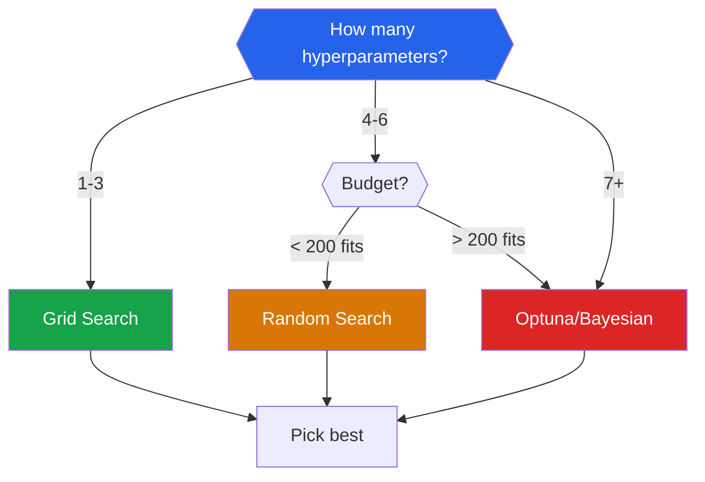

# Hyperparameter Tuning

A model's **parameters** are learned during training (weights, splits). Its **hyperparameters** are set before training and control the learning process itself — the learning rate, number of trees, regularization strength, kernel type. Choosing them well can mean the difference between a mediocre model and a competition-winning one.

## Parameters vs Hyperparameters

| | Parameters | Hyperparameters |
|---|-----------|----------------|
| **Set by** | Training algorithm (gradient descent, etc.) | Human / search algorithm |
| **When** | During `fit()` | Before `fit()` |
| **Examples** | Weights, biases, tree splits | Learning rate, max_depth, C, alpha |
| **Tuned via** | Loss minimization | Cross-validation score |

---

## Grid Search

### How It Works

Exhaustively try every combination of hyperparameter values.

For 3 hyperparameters with 5, 4, and 3 values respectively: $5 \times 4 \times 3 = 60$ combinations. With 5-fold CV: $60 \times 5 = 300$ model fits.

$$\text{Total fits} = \prod_{i=1}^{H} |V_i| \times K$$

where $H$ is the number of hyperparameters, $|V_i|$ is the number of values for hyperparameter $i$, and $K$ is the number of CV folds.

### GridSearchCV

```python
from sklearn.model_selection import GridSearchCV
from sklearn.ensemble import RandomForestClassifier
from sklearn.datasets import load_breast_cancer
import numpy as np

cancer = load_breast_cancer()
X, y = cancer.data, cancer.target

param_grid = {
    'n_estimators': [50, 100, 200, 300],
    'max_depth': [3, 5, 10, 20, None],
    'min_samples_split': [2, 5, 10],
    'min_samples_leaf': [1, 2, 4],
    'max_features': ['sqrt', 'log2', None],
}

total_combos = 1
for values in param_grid.values():
    total_combos *= len(values)
print(f"Total combinations: {total_combos}")
print(f"With 5-fold CV: {total_combos * 5} fits")

grid = GridSearchCV(
    RandomForestClassifier(random_state=42),
    param_grid,
    cv=5,
    scoring='accuracy',
    n_jobs=-1,
    verbose=1,
    return_train_score=True
)
grid.fit(X, y)

print(f"\nBest score: {grid.best_score_:.4f}")
print(f"Best params: {grid.best_params_}")

# Access full results
import pandas as pd
results = pd.DataFrame(grid.cv_results_)
print(f"\nTop 5 configurations:")
top5 = results.nsmallest(5, 'rank_test_score')[
    ['params', 'mean_test_score', 'std_test_score', 'rank_test_score']
]
print(top5.to_string())
```

### When Grid Search Fails

Grid search suffers from the **curse of dimensionality** — the number of combinations grows exponentially. With 10 hyperparameters and 5 values each: $5^{10} = 9,765,625$ combinations. Infeasible.

---

## Random Search

### Why Random Is Better Than Grid

Bergstra & Bengio (2012) showed that **random search is more efficient than grid search** because:

1. Not all hyperparameters are equally important
2. Grid search wastes evaluations on unimportant dimensions
3. Random search covers the important dimensions better

With the same budget of 60 evaluations, random search explores 60 unique values per hyperparameter, while grid search explores only $60^{1/H}$ per hyperparameter.

```python
from sklearn.model_selection import RandomizedSearchCV
from scipy.stats import randint, uniform, loguniform

param_distributions = {
    'n_estimators': randint(50, 500),
    'max_depth': randint(3, 30),
    'min_samples_split': randint(2, 20),
    'min_samples_leaf': randint(1, 10),
    'max_features': uniform(0.1, 0.9),  # fraction of features
    'bootstrap': [True, False],
}

random_search = RandomizedSearchCV(
    RandomForestClassifier(random_state=42),
    param_distributions,
    n_iter=100,           # number of random samples
    cv=5,
    scoring='accuracy',
    random_state=42,
    n_jobs=-1,
    return_train_score=True
)
random_search.fit(X, y)

print(f"Best score: {random_search.best_score_:.4f}")
print(f"Best params: {random_search.best_params_}")
```

### Choosing Distributions

| Hyperparameter Type | Distribution | Example |
|---------------------|-------------|---------|
| **Integer range** | `randint(low, high)` | n_estimators, max_depth |
| **Continuous range** | `uniform(loc, scale)` | max_features fraction |
| **Log-scale** | `loguniform(low, high)` | Learning rate, regularization C |
| **Categorical** | List | kernel, solver |

::: tip Log-Scale for Learning Rates
Learning rate, regularization strength, and other multiplicative hyperparameters should be sampled on a log scale. The difference between 0.001 and 0.002 matters more than between 0.901 and 0.902.

```python
from scipy.stats import loguniform
# Samples uniformly in log space between 1e-4 and 1e-1
learning_rate_dist = loguniform(1e-4, 1e-1)
```
:::

---

## Bayesian Optimization with Optuna

### Why Bayesian Optimization?

Grid and random search treat each evaluation independently — they do not learn from previous evaluations. **Bayesian optimization** builds a probabilistic model of the objective function and uses it to choose the next hyperparameters to evaluate.

### Tree-Structured Parzen Estimator (TPE)

Optuna uses TPE by default:

1. Split evaluated hyperparameters into "good" (top quantile by score) and "bad" (the rest)
2. Model the distributions $l(\theta)$ (good) and $g(\theta)$ (bad) using kernel density estimation
3. Choose next $\theta$ that maximizes $l(\theta) / g(\theta)$ — the **Expected Improvement**

$$\text{EI}(\theta) \propto \frac{l(\theta)}{g(\theta)}$$

This focuses sampling on promising regions of the search space.

### Optuna in Practice

```python
import optuna
from sklearn.model_selection import cross_val_score
from sklearn.ensemble import GradientBoostingClassifier
from sklearn.datasets import load_breast_cancer
import numpy as np

cancer = load_breast_cancer()
X, y = cancer.data, cancer.target

def objective(trial):
    """Optuna objective function for GBM tuning."""
    params = {
        'n_estimators': trial.suggest_int('n_estimators', 50, 500),
        'max_depth': trial.suggest_int('max_depth', 2, 10),
        'learning_rate': trial.suggest_float('learning_rate', 1e-3, 0.3, log=True),
        'min_samples_split': trial.suggest_int('min_samples_split', 2, 20),
        'min_samples_leaf': trial.suggest_int('min_samples_leaf', 1, 10),
        'subsample': trial.suggest_float('subsample', 0.5, 1.0),
        'max_features': trial.suggest_float('max_features', 0.3, 1.0),
    }

    model = GradientBoostingClassifier(random_state=42, **params)
    scores = cross_val_score(model, X, y, cv=5, scoring='accuracy', n_jobs=-1)
    return scores.mean()

# Create study
study = optuna.create_study(
    direction='maximize',
    sampler=optuna.samplers.TPESampler(seed=42)
)

# Optimize
study.optimize(objective, n_trials=100, show_progress_bar=True)

print(f"\nBest score: {study.best_value:.4f}")
print(f"Best params: {study.best_params}")
print(f"Number of trials: len(study.trials)")

# ---- Visualization ----
fig_history = optuna.visualization.plot_optimization_history(study)
fig_history.show()

fig_importance = optuna.visualization.plot_param_importances(study)
fig_importance.show()

fig_contour = optuna.visualization.plot_contour(study,
    params=['learning_rate', 'max_depth'])
fig_contour.show()
```

### Optuna with XGBoost

```python
import xgboost as xgb
import optuna

def objective_xgb(trial):
    params = {
        'n_estimators': trial.suggest_int('n_estimators', 100, 1000),
        'max_depth': trial.suggest_int('max_depth', 3, 12),
        'learning_rate': trial.suggest_float('learning_rate', 1e-3, 0.3, log=True),
        'subsample': trial.suggest_float('subsample', 0.5, 1.0),
        'colsample_bytree': trial.suggest_float('colsample_bytree', 0.3, 1.0),
        'reg_alpha': trial.suggest_float('reg_alpha', 1e-8, 10.0, log=True),
        'reg_lambda': trial.suggest_float('reg_lambda', 1e-8, 10.0, log=True),
        'min_child_weight': trial.suggest_int('min_child_weight', 1, 10),
        'gamma': trial.suggest_float('gamma', 1e-8, 1.0, log=True),
    }

    model = xgb.XGBClassifier(
        **params,
        use_label_encoder=False,
        eval_metric='logloss',
        random_state=42,
        n_jobs=-1
    )

    scores = cross_val_score(model, X, y, cv=5, scoring='accuracy')
    return scores.mean()

study_xgb = optuna.create_study(direction='maximize',
                                 sampler=optuna.samplers.TPESampler(seed=42))
study_xgb.optimize(objective_xgb, n_trials=100, show_progress_bar=True)
print(f"Best XGBoost accuracy: {study_xgb.best_value:.4f}")
```

### Optuna with Pruning (Early Stopping)

```python
def objective_with_pruning(trial):
    """Optuna with intermediate reporting and pruning."""
    params = {
        'max_depth': trial.suggest_int('max_depth', 2, 10),
        'learning_rate': trial.suggest_float('learning_rate', 1e-3, 0.3, log=True),
        'n_estimators': 500,  # fixed, use staged_predict for pruning
        'subsample': trial.suggest_float('subsample', 0.5, 1.0),
    }

    model = GradientBoostingClassifier(random_state=42, **params)
    model.fit(X, y)

    # Report intermediate scores (sklearn GBM supports staged_predict)
    from sklearn.metrics import accuracy_score

    for step, y_pred in enumerate(model.staged_predict(X)):
        score = accuracy_score(y, y_pred)
        trial.report(score, step)

        if trial.should_prune():
            raise optuna.TrialPruned()

    return accuracy_score(y, model.predict(X))

study_prune = optuna.create_study(
    direction='maximize',
    pruner=optuna.pruners.MedianPruner(n_warmup_steps=50)
)
study_prune.optimize(objective_with_pruning, n_trials=30)
```

---

## Learning Curves

Learning curves show how performance changes as training set size increases. They diagnose **underfitting** (high bias) and **overfitting** (high variance).

```python
from sklearn.model_selection import learning_curve
import matplotlib.pyplot as plt
import numpy as np

fig, axes = plt.subplots(1, 3, figsize=(18, 5))

models = {
    'Underfitting (Linear SVC)': SVC(kernel='linear', C=0.001),
    'Good Fit (RBF SVC C=1)': SVC(kernel='rbf', C=1.0, gamma='scale'),
    'Overfitting (RBF SVC C=1000)': SVC(kernel='rbf', C=1000, gamma=0.1),
}

from sklearn.svm import SVC

for ax, (name, model) in zip(axes, models.items()):
    train_sizes, train_scores, test_scores = learning_curve(
        model, X, y, cv=5,
        train_sizes=np.linspace(0.1, 1.0, 10),
        scoring='accuracy', n_jobs=-1
    )

    train_mean = train_scores.mean(axis=1)
    train_std = train_scores.std(axis=1)
    test_mean = test_scores.mean(axis=1)
    test_std = test_scores.std(axis=1)

    ax.fill_between(train_sizes, train_mean - train_std, train_mean + train_std,
                     alpha=0.1, color='blue')
    ax.fill_between(train_sizes, test_mean - test_std, test_mean + test_std,
                     alpha=0.1, color='red')
    ax.plot(train_sizes, train_mean, 'o-', color='blue', label='Training')
    ax.plot(train_sizes, test_mean, 'o-', color='red', label='Validation')
    ax.set_xlabel('Training Set Size')
    ax.set_ylabel('Accuracy')
    ax.set_title(name)
    ax.legend(loc='lower right')
    ax.set_ylim(0.5, 1.05)
    ax.grid(True, alpha=0.3)

plt.tight_layout()
plt.savefig('learning_curves.png', dpi=150, bbox_inches='tight')
plt.show()
```

### Interpreting Learning Curves

| Pattern | Diagnosis | Solution |
|---------|-----------|----------|
| Both curves low and converging | **Underfitting** (high bias) | More complex model, more features |
| Train high, test low, big gap | **Overfitting** (high variance) | More data, regularization, simpler model |
| Both curves high, small gap | **Good fit** | Model is well-tuned |
| Test curve still rising | **Need more data** | Collect more samples |

---

## Validation Curves

Validation curves show how performance changes as a single hyperparameter varies.

```python
from sklearn.model_selection import validation_curve

# Validation curve for Random Forest max_depth
param_range = np.arange(1, 30)
train_scores, test_scores = validation_curve(
    RandomForestClassifier(n_estimators=100, random_state=42),
    X, y, param_name='max_depth', param_range=param_range,
    cv=5, scoring='accuracy', n_jobs=-1
)

plt.figure(figsize=(10, 6))
train_mean = train_scores.mean(axis=1)
test_mean = test_scores.mean(axis=1)
train_std = train_scores.std(axis=1)
test_std = test_scores.std(axis=1)

plt.fill_between(param_range, train_mean - train_std, train_mean + train_std,
                  alpha=0.1, color='blue')
plt.fill_between(param_range, test_mean - test_std, test_mean + test_std,
                  alpha=0.1, color='red')
plt.plot(param_range, train_mean, 'o-', color='blue', label='Training')
plt.plot(param_range, test_mean, 'o-', color='red', label='Validation')
plt.xlabel('max_depth')
plt.ylabel('Accuracy')
plt.title('Validation Curve: Random Forest max_depth')
plt.legend()
plt.grid(True, alpha=0.3)

best_depth = param_range[np.argmax(test_mean)]
plt.axvline(x=best_depth, color='green', linestyle='--',
            label=f'Optimal: {best_depth}')
plt.legend()
plt.savefig('validation_curve.png', dpi=150, bbox_inches='tight')
plt.show()
```

---

## Tuning Recipes by Model

### Random Forest

```python
param_grid_rf = {
    'n_estimators': [100, 200, 500],        # More is usually better
    'max_depth': [5, 10, 20, None],          # None = unlimited
    'min_samples_split': [2, 5, 10],         # Regularization
    'min_samples_leaf': [1, 2, 4],           # Regularization
    'max_features': ['sqrt', 'log2', 0.5],   # Feature subsampling
}
# Priority: n_estimators > max_depth > min_samples_leaf > max_features
```

### Gradient Boosting (XGBoost/LightGBM)

```python
param_grid_gb = {
    'n_estimators': [100, 300, 500, 1000],   # With early stopping
    'learning_rate': [0.01, 0.05, 0.1, 0.3], # Lower = more trees needed
    'max_depth': [3, 5, 7, 9],               # Typically 3-8
    'subsample': [0.7, 0.8, 0.9, 1.0],       # Row subsampling
    'colsample_bytree': [0.5, 0.7, 0.9],     # Column subsampling
    'reg_alpha': [0, 0.1, 1, 10],            # L1 regularization
    'reg_lambda': [0, 0.1, 1, 10],           # L2 regularization
}
# Priority: learning_rate > max_depth > n_estimators > subsample
# Always use early stopping with n_estimators=1000+
```

### SVM

```python
param_grid_svm = {
    'C': [0.001, 0.01, 0.1, 1, 10, 100, 1000],  # Log scale!
    'kernel': ['rbf', 'poly', 'sigmoid'],
    'gamma': ['scale', 'auto', 0.001, 0.01, 0.1, 1],
    'degree': [2, 3, 4],  # Only for poly kernel
}
# Always scale features before SVM
```

### Logistic Regression

```python
param_grid_lr = {
    'C': [0.001, 0.01, 0.1, 1, 10, 100],   # Inverse regularization
    'penalty': ['l1', 'l2', 'elasticnet'],
    'solver': ['saga'],  # supports all penalties
    'l1_ratio': [0.1, 0.3, 0.5, 0.7, 0.9],  # Only for elasticnet
}
```

### KNN

```python
param_grid_knn = {
    'n_neighbors': list(range(1, 31)),
    'weights': ['uniform', 'distance'],
    'metric': ['euclidean', 'manhattan', 'minkowski'],
    'p': [1, 2, 3],  # For minkowski
}
# Always scale features before KNN
```

---

## Successive Halving

For large search spaces, **successive halving** evaluates all candidates with a small budget first, then gives more budget (data/iterations) to the best performers.

```python
from sklearn.experimental import enable_halving_search_cv
from sklearn.model_selection import HalvingRandomSearchCV
from scipy.stats import randint

param_distributions = {
    'n_estimators': randint(50, 500),
    'max_depth': randint(2, 20),
    'min_samples_split': randint(2, 20),
    'min_samples_leaf': randint(1, 10),
}

halving = HalvingRandomSearchCV(
    RandomForestClassifier(random_state=42),
    param_distributions,
    n_candidates=100,
    factor=3,         # Keep top 1/3 each round
    cv=5,
    scoring='accuracy',
    random_state=42,
    n_jobs=-1
)
halving.fit(X, y)

print(f"Best score: {halving.best_score_:.4f}")
print(f"Best params: {halving.best_params_}")
print(f"Total fits: {len(halving.cv_results_['mean_test_score'])}")
```

---

## Search Strategy Comparison

| Strategy | Pros | Cons | Budget |
|----------|------|------|--------|
| **Grid Search** | Exhaustive, reproducible | Exponential growth, wasted evals | Small (< 100 combos) |
| **Random Search** | Better coverage per dimension | No learning from results | Medium (50-200 evals) |
| **Bayesian (Optuna)** | Learns from results, efficient | Sequential (harder to parallelize) | Large (100-1000 evals) |
| **Successive Halving** | Fast for many candidates | Approximate, needs large initial pool | Very large spaces |

### Practical Decision Guide



---

## Key Takeaways

| Concept | Remember |
|---------|----------|
| Grid search is exhaustive but exponential | Only practical for 1-3 hyperparameters |
| Random search covers more ground per eval | Better than grid for 4+ hyperparameters |
| Optuna builds a probabilistic model | Most efficient for expensive evaluations |
| Use log-scale for learning rate, C, alpha | Multiplicative parameters need log sampling |
| Learning curves diagnose bias vs variance | Both curves matter, not just test |
| Validation curves show one param's effect | Fix all others, vary one |
| Always use nested CV for unbiased scores | Inner loop tunes, outer loop evaluates |
| Early stopping replaces n_estimators tuning | Set n_estimators high, let early stopping decide |
