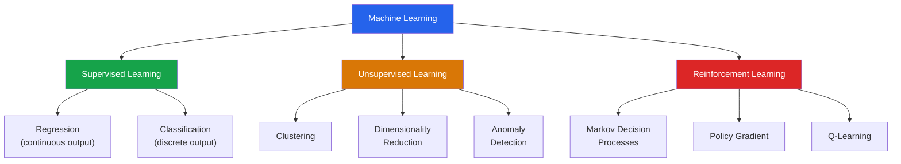
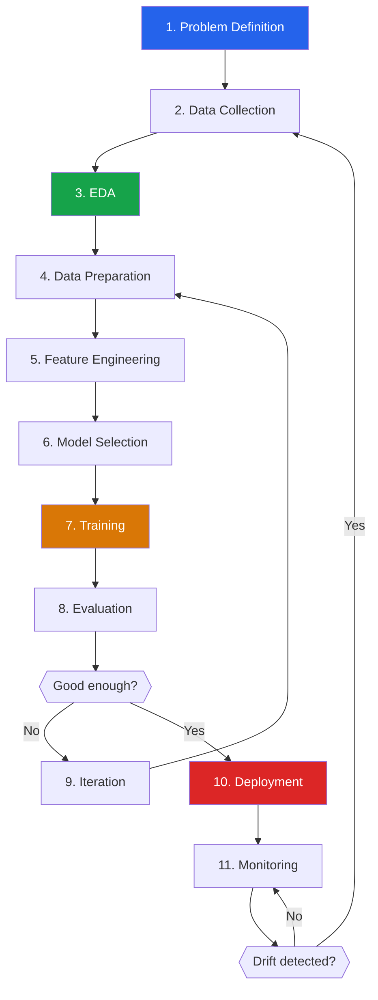
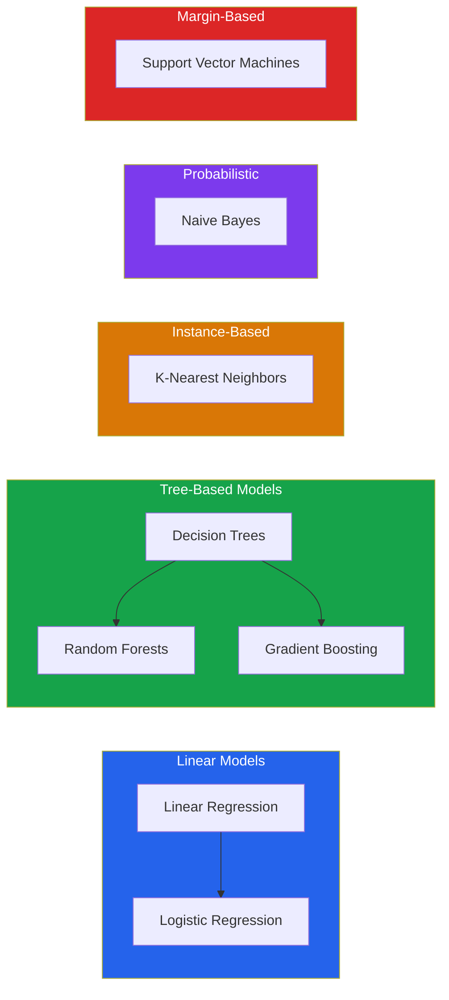
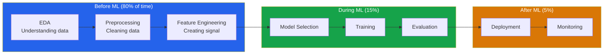
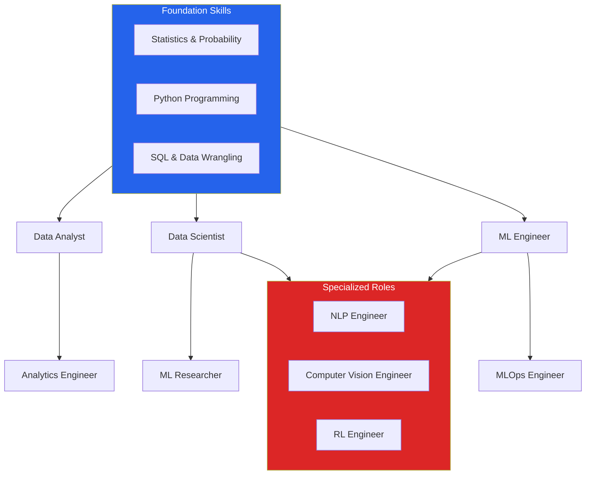

# Machine Learning — Overview

Every time Netflix recommends a movie you actually enjoy, every time your bank blocks a fraudulent transaction before you notice it, every time Google Translate converts a paragraph from Japanese to English in real time — machine learning is doing the work. Not a programmer writing `if fraud == True: block()`, but a system that **learned patterns from data** and applies those patterns to situations it has never seen before.

Machine learning is the field of computer science that gives computers the ability to learn without being explicitly programmed. That sentence — attributed to Arthur Samuel in 1959 — remains the best one-line definition. But understanding what it really means requires peeling back layers: what "learning" means mathematically, why it works, when it fails, and how to build systems that do it reliably.

This page is the entry point to Archon's Machine Learning section. It covers the landscape, the lifecycle, and the career paths — everything you need to orient yourself before diving into specific algorithms.

---

## Why Machine Learning Exists

### The Limits of Rule-Based Systems

Traditional software encodes human knowledge as rules:

```python
# rule_based_spam.py — Traditional approach to spam detection
def is_spam(email: str) -> bool:
    spam_words = ["free", "winner", "click here", "act now", "limited time"]
    word_count = sum(1 for w in spam_words if w in email.lower())
    has_all_caps = sum(1 for c in email if c.isupper()) / max(len(email), 1) > 0.3
    has_many_links = email.count("http") > 3

    if word_count >= 2 and (has_all_caps or has_many_links):
        return True
    return False

# Works for simple cases
print(is_spam("FREE WINNER click here now!!!"))  # True

# Fails for sophisticated spam
print(is_spam("Hey, I saw your profile and thought you might be interested "
              "in this amazing opportunity..."))  # False (missed)

# Fails for legitimate emails
print(is_spam("Congratulations! You are the winner of our company's "
              "Employee of the Month award. Click here to see details."))  # True (false positive)
```

This approach breaks down when:

| Problem | Why Rules Fail | ML Solution |
|---------|---------------|-------------|
| **Too many patterns** | Cannot enumerate every spam trick | Learn from millions of examples |
| **Patterns evolve** | Spammers adapt faster than rule writers | Retrain on new data |
| **Subtle signals** | Human cannot articulate what makes a face "happy" | Learn features automatically |
| **Scale** | Cannot write rules for 10,000 product categories | One model handles all |
| **Personalization** | Different rules for each user is impossible | Per-user model adaptation |

### What "Learning" Actually Means

In mathematical terms, machine learning is function approximation. Given input data $X$ and output data $y$, find a function $f$ such that:

$$f(X) \approx y$$

The "learning" is the process of finding $f$ from a family of candidate functions $\mathcal{F}$ by minimizing some loss function $\mathcal{L}$:

$$f^* = \arg\min_{f \in \mathcal{F}} \mathcal{L}(f(X), y)$$

That is the entire field in two equations. Everything else — gradient descent, neural networks, random forests, regularization — is about choosing $\mathcal{F}$, defining $\mathcal{L}$, and solving the optimization efficiently.

---

## The Three Paradigms of Machine Learning



### Supervised Learning

**Analogy:** A teacher shows you 1,000 pictures of cats and dogs, telling you which is which. After studying, you can label new pictures on your own.

**Formal definition:** Given a training set $\{(x_1, y_1), (x_2, y_2), \ldots, (x_n, y_n)\}$ where $x_i \in \mathbb{R}^d$ are features and $y_i$ are labels, learn a mapping $f: \mathbb{R}^d \to \mathcal{Y}$.

**Two subtypes:**

| Type | Output $\mathcal{Y}$ | Examples | Loss Function |
|------|----------------------|----------|---------------|
| **Regression** | $\mathbb{R}$ (continuous) | House price, temperature, stock price | MSE: $\frac{1}{n}\sum(y_i - \hat{y}_i)^2$ |
| **Classification** | $\{0, 1, \ldots, K\}$ (discrete) | Spam/not spam, disease diagnosis | Cross-entropy: $-\sum y_i \log \hat{y}_i$ |

```python
# supervised_learning_demo.py — Both subtypes with scikit-learn
from sklearn.datasets import load_diabetes, load_iris
from sklearn.model_selection import train_test_split
from sklearn.linear_model import LinearRegression, LogisticRegression
from sklearn.metrics import mean_squared_error, accuracy_score
import numpy as np

# --- Regression: Predict diabetes progression ---
diabetes = load_diabetes()
X_train, X_test, y_train, y_test = train_test_split(
    diabetes.data, diabetes.target, test_size=0.2, random_state=42
)

reg = LinearRegression()
reg.fit(X_train, y_train)
y_pred = reg.predict(X_test)
print(f"Regression MSE: {mean_squared_error(y_test, y_pred):.1f}")
print(f"Regression R²:  {reg.score(X_test, y_test):.3f}")

# --- Classification: Predict iris species ---
iris = load_iris()
X_train, X_test, y_train, y_test = train_test_split(
    iris.data, iris.target, test_size=0.2, random_state=42
)

clf = LogisticRegression(max_iter=200)
clf.fit(X_train, y_train)
y_pred = clf.predict(X_test)
print(f"\nClassification Accuracy: {accuracy_score(y_test, y_pred):.3f}")
```

### Unsupervised Learning

**Analogy:** You dump 1,000 photos on a table with no labels. You start grouping them by visual similarity — you discover clusters of "outdoor scenes," "portraits," "food" without anyone telling you the categories.

**Formal definition:** Given only $\{x_1, x_2, \ldots, x_n\}$ (no labels), discover structure in the data.

**Key tasks:**

```python
# unsupervised_demo.py — Clustering and dimensionality reduction
from sklearn.datasets import make_blobs, load_digits
from sklearn.cluster import KMeans
from sklearn.decomposition import PCA
import matplotlib.pyplot as plt
import numpy as np

# --- Clustering: Discover groups ---
X, y_true = make_blobs(n_samples=300, centers=4, cluster_std=0.6, random_state=42)
kmeans = KMeans(n_clusters=4, random_state=42, n_init=10)
y_pred = kmeans.fit_predict(X)

fig, axes = plt.subplots(1, 2, figsize=(12, 5))
axes[0].scatter(X[:, 0], X[:, 1], c=y_true, cmap='viridis', s=30)
axes[0].set_title("True Labels (unknown in real unsupervised)")
axes[1].scatter(X[:, 0], X[:, 1], c=y_pred, cmap='viridis', s=30)
axes[1].set_title("KMeans Discovered Clusters")
plt.tight_layout()
plt.savefig("clustering_demo.png", dpi=150)
plt.show()

# --- Dimensionality Reduction: 64D → 2D ---
digits = load_digits()
pca = PCA(n_components=2)
X_2d = pca.fit_transform(digits.data)

plt.figure(figsize=(10, 8))
scatter = plt.scatter(X_2d[:, 0], X_2d[:, 1], c=digits.target, cmap='tab10', s=10, alpha=0.7)
plt.colorbar(scatter, label='Digit')
plt.title(f"64D → 2D via PCA (variance explained: {pca.explained_variance_ratio_.sum():.1%})")
plt.savefig("pca_digits.png", dpi=150)
plt.show()
```

### Reinforcement Learning

**Analogy:** A puppy learns to sit. You do not show it a dataset of "sitting" vs "not sitting." Instead, it tries actions and gets treats (rewards) or scolding (penalties). Over time, it learns which actions maximize treats.

**Formal definition:** An agent interacts with an environment, taking actions $a_t$ in states $s_t$, receiving rewards $r_t$, and learning a policy $\pi(a|s)$ that maximizes cumulative reward:

$$\max_\pi \mathbb{E}\left[\sum_{t=0}^{\infty} \gamma^t r_t\right]$$

where $\gamma \in [0, 1)$ is the discount factor.

| Component | Description | Example (Game Playing) |
|-----------|-------------|----------------------|
| **State** $s$ | Current situation | Board position |
| **Action** $a$ | What agent can do | Move a piece |
| **Reward** $r$ | Feedback signal | +1 win, -1 loss, 0 otherwise |
| **Policy** $\pi$ | Strategy | Which move to make given board |
| **Value** $V(s)$ | Expected future reward | How good is this position? |

---

## Semi-Supervised and Self-Supervised Learning

Beyond the big three, two increasingly important paradigms exist:

### Semi-Supervised Learning

You have 100 labeled examples and 10,000 unlabeled ones. Semi-supervised learning uses the unlabeled data to improve the model trained on labeled data.

**When to use:** Labeling is expensive (medical images require radiologists), but unlabeled data is abundant.

### Self-Supervised Learning

The model creates its own labels from the data structure:

- **Language:** Mask a word, predict it from context (BERT)
- **Vision:** Predict rotation angle of an image (RotNet)
- **Audio:** Predict the next audio frame from previous ones

This is how GPT, BERT, and most modern foundation models are trained. It has become arguably the most important paradigm since 2018.

---

## The ML Lifecycle

Every ML project — whether a weekend Kaggle competition or a multi-year production system — follows the same lifecycle:



### Phase Details

| Phase | Key Activities | Archon Resources |
|-------|---------------|-----------------|
| **Problem Definition** | Define success metric, establish baseline | [ML Workflow](/machine-learning/ml-workflow) |
| **Data Collection** | APIs, databases, scraping, surveys | [Data Collection](/eda/data-collection) |
| **EDA** | Distributions, correlations, anomalies | [EDA Overview](/eda/) |
| **Data Preparation** | Clean, split, validate | [Data Preparation](/machine-learning/data-preparation) |
| **Feature Engineering** | Create, transform, select features | [Feature Creation](/eda/feature-creation) |
| **Model Selection** | Choose algorithm family | [ML Workflow](/machine-learning/ml-workflow) |
| **Training** | Fit model, tune hyperparameters | Algorithm-specific pages |
| **Evaluation** | Metrics, validation, error analysis | [Data Preparation](/machine-learning/data-preparation) |
| **Deployment** | API, batch, edge | Production guides |
| **Monitoring** | Drift detection, performance tracking | [Data Drift](/eda/data-drift) |

---

## Supervised Learning Algorithms Map

This section covers the algorithms you will find in Archon's Machine Learning pages:



### Algorithm Selection Quick Guide

| Algorithm | Best For | Interpretable? | Handles Non-Linear? | Training Speed |
|-----------|---------|---------------|---------------------|---------------|
| [Linear Regression](/machine-learning/linear-regression) | Continuous target, linear relationships | High | No (without features) | Very fast |
| [Logistic Regression](/machine-learning/logistic-regression) | Binary/multi-class, baseline | High | No (without features) | Very fast |
| [Decision Trees](/machine-learning/decision-trees) | Interpretable rules, mixed data | Very high | Yes | Fast |
| [Random Forests](/machine-learning/random-forests) | General-purpose, robust | Medium | Yes | Medium |
| [Gradient Boosting](/machine-learning/gradient-boosting) | Competitions, tabular data SOTA | Low | Yes | Medium-slow |
| [KNN](/machine-learning/knn) | Small data, few features | Medium | Yes | Fast train, slow predict |
| [Naive Bayes](/machine-learning/naive-bayes) | Text classification, baseline | High | Depends | Very fast |
| [SVM](/machine-learning/svm) | Small-medium data, high-dim | Low | Yes (kernel) | Slow for large data |

---

## How ML Connects to EDA and Preprocessing

Machine learning does not exist in isolation. The quality of your model is determined far more by what happens *before* training than by the algorithm you choose.



### The EDA-to-ML Pipeline

Every EDA finding maps to an ML decision:

| EDA Finding | ML Action | Archon Page |
|-------------|-----------|-------------|
| Skewed distributions | Log transform or use tree-based models | [Transformations](/eda/transformations) |
| High cardinality categories | Target encoding or embeddings | [Encoding Strategies](/eda/encoding-strategies) |
| Missing data patterns | Imputation strategy or missingness features | [Missing Data](/eda/missing-data) |
| Multicollinearity | Remove correlated features or use regularization | [Multicollinearity](/eda/multicollinearity) |
| Outliers | Robust scaling or winsorization | [Outlier Analysis](/eda/outlier-analysis) |
| Class imbalance | SMOTE, class weights, or threshold tuning | [Imbalanced Data](/eda/imbalanced-data) |
| Feature interactions | Create interaction terms or use trees | [Feature Creation](/eda/feature-creation) |
| Time patterns | Time-based splits, lag features | [DateTime Features](/eda/datetime-features) |

```python
# eda_to_ml_pipeline.py — From raw data to model with EDA-informed decisions
import pandas as pd
import numpy as np
from sklearn.model_selection import train_test_split, cross_val_score
from sklearn.pipeline import Pipeline
from sklearn.compose import ColumnTransformer
from sklearn.preprocessing import StandardScaler, OneHotEncoder
from sklearn.impute import SimpleImputer
from sklearn.ensemble import RandomForestClassifier
from sklearn.metrics import classification_report

# Simulated customer churn dataset
np.random.seed(42)
n = 2000
data = pd.DataFrame({
    'tenure_months': np.random.exponential(24, n).clip(1, 72),
    'monthly_charge': np.random.normal(65, 30, n).clip(20, 120),
    'total_charges': np.nan,  # will compute
    'contract_type': np.random.choice(['Month-to-month', 'One year', 'Two year'], n, p=[0.5, 0.3, 0.2]),
    'internet_service': np.random.choice(['DSL', 'Fiber', 'None'], n, p=[0.35, 0.45, 0.2]),
    'num_support_tickets': np.random.poisson(2, n),
})
data['total_charges'] = data['tenure_months'] * data['monthly_charge']

# Inject missing values (EDA would reveal this)
missing_idx = np.random.choice(n, 100, replace=False)
data.loc[missing_idx, 'total_charges'] = np.nan

# Create target
churn_prob = (
    0.3 * (data['contract_type'] == 'Month-to-month').astype(float)
    + 0.2 * (data['internet_service'] == 'Fiber').astype(float)
    + 0.2 * (data['num_support_tickets'] > 3).astype(float)
    - 0.1 * (data['tenure_months'] > 24).astype(float)
    + np.random.normal(0, 0.15, n)
)
data['churned'] = (churn_prob > np.percentile(churn_prob, 70)).astype(int)

# EDA-informed preprocessing pipeline
numeric_features = ['tenure_months', 'monthly_charge', 'total_charges', 'num_support_tickets']
categorical_features = ['contract_type', 'internet_service']

numeric_pipeline = Pipeline([
    ('imputer', SimpleImputer(strategy='median')),  # EDA: missing data exists
    ('scaler', StandardScaler()),                   # EDA: different scales
])

categorical_pipeline = Pipeline([
    ('imputer', SimpleImputer(strategy='most_frequent')),
    ('encoder', OneHotEncoder(handle_unknown='ignore')),
])

preprocessor = ColumnTransformer([
    ('num', numeric_pipeline, numeric_features),
    ('cat', categorical_pipeline, categorical_features),
])

pipeline = Pipeline([
    ('preprocess', preprocessor),
    ('model', RandomForestClassifier(n_estimators=100, random_state=42)),
])

# Train and evaluate
X = data.drop('churned', axis=1)
y = data['churned']
X_train, X_test, y_train, y_test = train_test_split(X, y, test_size=0.2, random_state=42)

pipeline.fit(X_train, y_train)
y_pred = pipeline.predict(X_test)

print(classification_report(y_test, y_pred))

# Cross-validation
cv_scores = cross_val_score(pipeline, X, y, cv=5, scoring='f1')
print(f"Cross-validated F1: {cv_scores.mean():.3f} +/- {cv_scores.std():.3f}")
```

---

## ML Career Paths

Machine learning spans multiple career paths. Understanding the landscape helps you focus your learning.



### Role Comparison

| Role | Primary Focus | Key Skills | Typical Tools |
|------|--------------|------------|--------------|
| **Data Analyst** | Business insights from data | SQL, visualization, statistics | Tableau, Power BI, pandas |
| **Data Scientist** | Build models to solve business problems | ML algorithms, statistics, communication | scikit-learn, Jupyter, SQL |
| **ML Engineer** | Put models into production | Software engineering, MLOps, distributed systems | Docker, Kubernetes, TensorFlow Serving |
| **MLOps Engineer** | ML infrastructure and pipelines | CI/CD, cloud, monitoring | MLflow, Kubeflow, Airflow |
| **ML Researcher** | Push the state of the art | Deep theory, math, paper writing | PyTorch, LaTeX, experiment tracking |
| **NLP/CV/RL Engineer** | Domain-specific ML | Domain expertise + ML depth | Hugging Face, OpenCV, Gymnasium |

### Learning Path Through Archon

```
Start Here
├── EDA Section (understand data first)
│   ├── EDA Overview → Workflow → Pandas → Visualization
│   └── Missing Data → Outliers → Distributions → Scaling
├── ML Foundations (this section)
│   ├── Math Foundations → ML Workflow → Python Ecosystem
│   ├── Data Preparation → Linear Regression → Logistic Regression
│   └── Trees → Forests → Boosting → SVM → KNN → Naive Bayes
└── Advanced Topics (coming soon)
    ├── Deep Learning → NLP → Computer Vision
    └── MLOps → Deployment → Monitoring
```

---

## Common Misconceptions

### 1. "More data always helps"

Not necessarily. More data of the same quality helps. More data with systematic bias entrenches that bias.

### 2. "Deep learning beats everything"

For tabular data in 2026, gradient boosting (XGBoost, LightGBM, CatBoost) still outperforms deep learning in most benchmarks. Deep learning excels at unstructured data (images, text, audio).

### 3. "The algorithm is the most important choice"

The data preparation and feature engineering usually matter far more. A simple model on well-engineered features beats a complex model on raw features.

### 4. "High accuracy means a good model"

If 99% of emails are not spam, a model that predicts "not spam" for everything has 99% accuracy but is useless. Always consider the right metric for your problem.

### 5. "Train once, deploy forever"

Models degrade over time as data distributions shift. Production ML requires continuous monitoring and retraining.

---

## Mathematics You Need

Not all of ML requires deep math, but some foundations are non-negotiable. Here is what you need and where to learn it:

| Math Area | Why ML Needs It | Minimum Level | Archon Page |
|-----------|----------------|---------------|-------------|
| **Linear Algebra** | Data is matrices, models are transformations | Matrix multiply, eigenvalues | [Math Foundations](/machine-learning/math-foundations) |
| **Calculus** | Optimization requires gradients | Partial derivatives, chain rule | [Math Foundations](/machine-learning/math-foundations) |
| **Probability** | Uncertainty is fundamental | Bayes theorem, distributions | [Math Foundations](/machine-learning/math-foundations) |
| **Statistics** | Evaluating models requires statistical thinking | Hypothesis testing, confidence intervals | [SciPy Stats](/eda/scipy-stats) |
| **Optimization** | Training IS optimization | Gradient descent, convexity | [Linear Regression](/machine-learning/linear-regression) |

---

## The ML Section in Archon

### Foundations

| Page | What You Will Learn |
|------|-------------------|
| [Math Foundations](/machine-learning/math-foundations) | Linear algebra, calculus, probability — all with Python code |
| [ML Workflow](/machine-learning/ml-workflow) | Problem definition to deployment — the complete methodology |
| [Python ML Ecosystem](/machine-learning/python-ml-ecosystem) | scikit-learn, XGBoost, LightGBM — tools and setup |
| [Data Preparation](/machine-learning/data-preparation) | Splits, cross-validation, leakage prevention, scaling |

### Supervised Learning — Regression

| Page | What You Will Learn |
|------|-------------------|
| [Linear Regression](/machine-learning/linear-regression) | OLS, gradient descent, Ridge/Lasso, normal equation |

### Supervised Learning — Classification

| Page | What You Will Learn |
|------|-------------------|
| [Logistic Regression](/machine-learning/logistic-regression) | Sigmoid, MLE, decision boundaries, ROC curves |
| [Decision Trees](/machine-learning/decision-trees) | CART, Gini, entropy, pruning, visualization |
| [Random Forests](/machine-learning/random-forests) | Bagging, OOB error, feature importance |
| [Gradient Boosting](/machine-learning/gradient-boosting) | AdaBoost, GBM, XGBoost, LightGBM, CatBoost |
| [SVM](/machine-learning/svm) | Maximum margin, kernels, Lagrangian dual |
| [KNN](/machine-learning/knn) | Distance metrics, curse of dimensionality, KD-trees |
| [Naive Bayes](/machine-learning/naive-bayes) | Bayes theorem, Gaussian/Multinomial/Bernoulli variants |

---

## Key Terminology

| Term | Definition |
|------|-----------|
| **Feature** | An input variable (column) used for prediction |
| **Label / Target** | The output variable we want to predict |
| **Training set** | Data used to fit the model |
| **Test set** | Data held out to evaluate generalization |
| **Overfitting** | Model memorizes training data, fails on new data |
| **Underfitting** | Model is too simple to capture patterns |
| **Hyperparameter** | Setting chosen before training (e.g., learning rate) |
| **Parameter** | Value learned during training (e.g., weights) |
| **Loss function** | Measures how wrong predictions are |
| **Gradient descent** | Algorithm to minimize the loss function |
| **Cross-validation** | Evaluate model on multiple train/test splits |
| **Regularization** | Penalty to prevent overfitting |
| **Bias** | Error from overly simple assumptions |
| **Variance** | Error from sensitivity to training data fluctuations |
| **Epoch** | One complete pass through the training data |
| **Batch** | Subset of training data used in one gradient update |

---

## What Comes Next

If you are new to ML, follow this reading order:

1. **[Math Foundations](/machine-learning/math-foundations)** — Build the mathematical intuition
2. **[ML Workflow](/machine-learning/ml-workflow)** — Understand the end-to-end process
3. **[Python ML Ecosystem](/machine-learning/python-ml-ecosystem)** — Set up your tools
4. **[Data Preparation](/machine-learning/data-preparation)** — Learn to prepare data correctly
5. **[Linear Regression](/machine-learning/linear-regression)** — Your first algorithm, deeply understood
6. **[Logistic Regression](/machine-learning/logistic-regression)** — From regression to classification
7. **Continue with tree-based models, then the rest**

Each page follows the same structure: real-world motivation, intuition, full math, from-scratch implementation, library code, real dataset example, and pitfalls. By the end, you will not just know how to call `model.fit()` — you will understand what happens inside.
