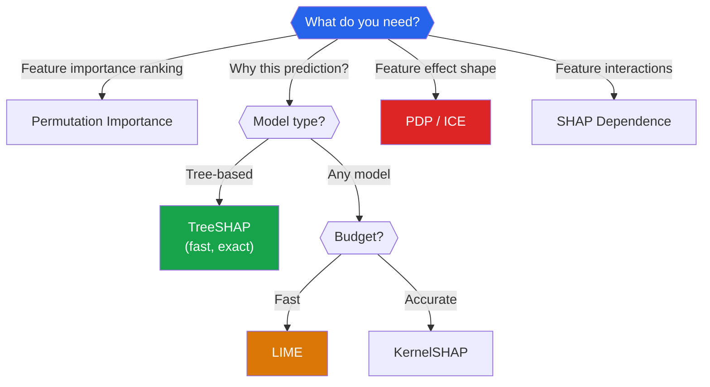

# ML Interpretability

A model that predicts a patient will die but cannot explain why is dangerous. A loan denial model that cannot justify its decision may violate regulations. Interpretability is not a luxury — it is a requirement for trust, debugging, regulatory compliance, and scientific discovery. This page covers the mathematics and practice of explaining any ML model's predictions.

## Why Interpretability Matters

| Stakeholder | Need | Example |
|-------------|------|---------|
| **Data scientist** | Debug model, find data issues | "Why does the model predict 0 for this obvious positive?" |
| **Business** | Trust, actionable insights | "What drives customer churn?" |
| **Regulators** | Right to explanation (GDPR Article 22) | "Why was this loan denied?" |
| **End users** | Understanding and trust | "Why was this email marked as spam?" |
| **Researchers** | Scientific discovery | "What genes are associated with this disease?" |

### Taxonomy

| | Local (per prediction) | Global (entire model) |
|---|---|---|
| **Model-specific** | Decision tree path, linear coefficients | Feature importances (tree-based) |
| **Model-agnostic** | LIME, SHAP values | SHAP summary, PDP, permutation importance |

---

## SHAP: SHapley Additive exPlanations

### The Shapley Value (Game Theory)

From cooperative game theory: given a game with $N$ players, the **Shapley value** is the unique way to fairly distribute the total payout among players that satisfies four axioms (efficiency, symmetry, dummy, additivity).

For player $i$:

$$\phi_i = \sum_{S \subseteq N \setminus \{i\}} \frac{|S|!(|N|-|S|-1)!}{|N|!} \left[v(S \cup \{i\}) - v(S)\right]$$

::: details Worked Example — Shapley Value for 3 Features

**Model predicts house price. 3 features: Size, Bedrooms, Location.**
**E[f(X)] = $300k (base value), f(x) = $450k (prediction for this house).**
**Need to attribute the $150k difference among 3 features.**

Value function v(S) for all coalitions (from model):
  v({}) = 300k (base)
  v({Size}) = 380k
  v({Bed}) = 320k
  v({Loc}) = 340k
  v({Size,Bed}) = 400k
  v({Size,Loc}) = 420k
  v({Bed,Loc}) = 360k
  v({Size,Bed,Loc}) = 450k

**Compute phi_Size (Shapley value for Size):**
  S={}: weight = 0!*2!/3! = 1*2/6 = 1/3. Marginal = v({Size})-v({}) = 380-300 = 80
  S={Bed}: weight = 1!*1!/3! = 1/6. Marginal = v({Size,Bed})-v({Bed}) = 400-320 = 80
  S={Loc}: weight = 1!*1!/3! = 1/6. Marginal = v({Size,Loc})-v({Loc}) = 420-340 = 80
  S={Bed,Loc}: weight = 2!*0!/3! = 2/6 = 1/3. Marginal = v({all})-v({Bed,Loc}) = 450-360 = 90

  phi_Size = (1/3)(80) + (1/6)(80) + (1/6)(80) + (1/3)(90)
           = 26.67 + 13.33 + 13.33 + 30.0 = 83.33k

**Similarly: phi_Bed = 26.67k, phi_Loc = 40.0k**

**Verify efficiency:** 83.33 + 26.67 + 40.0 = 150.0k = f(x) - E[f(X)]

**Interpret:**
  "Size contributes $83.33k to this house being above average, Location adds $40k, and Bedrooms add $26.67k. The contributions sum exactly to the $150k difference from the base prediction — this is the efficiency property of Shapley values."

:::

where:
- $N$ = set of all players
- $S$ = any subset not containing $i$
- $v(S)$ = value of coalition $S$
- $v(S \cup \{i\}) - v(S)$ = marginal contribution of $i$ to coalition $S$

The sum is over all $2^{|N|-1}$ subsets — exponential cost.

### SHAP for ML

In ML, "players" are features and the "game value" is the model prediction. For a single prediction $f(x)$:

$$f(x) = \phi_0 + \sum_{j=1}^{M} \phi_j$$

where $\phi_0 = E[f(X)]$ (base value) and $\phi_j$ is feature $j$'s contribution.

The value function uses conditional expectations:

$$v(S) = E[f(X) | X_S = x_S]$$

### Properties (Why Shapley Is Unique)

| Property | Meaning |
|----------|---------|
| **Efficiency** | $\sum \phi_i = f(x) - E[f(X)]$ — contributions sum to prediction |
| **Symmetry** | Equal contributors get equal attribution |
| **Dummy** | Irrelevant features get $\phi = 0$ |
| **Additivity** | For ensemble: $\phi_i^{f+g} = \phi_i^f + \phi_i^g$ |

### Naive SHAP Computation

```python
import numpy as np
from itertools import combinations

def shapley_values_exact(model, x, X_background, feature_names=None):
    """Compute exact Shapley values (exponential — for illustration only)."""
    n_features = len(x)
    shapley_vals = np.zeros(n_features)
    n = len(X_background)

    for i in range(n_features):
        # Sum over all subsets S not containing i
        other_features = [j for j in range(n_features) if j != i]
        total = 0.0
        count = 0

        for size in range(len(other_features) + 1):
            for S in combinations(other_features, size):
                S = list(S)
                weight = (np.math.factorial(len(S)) *
                          np.math.factorial(n_features - len(S) - 1) /
                          np.math.factorial(n_features))

                # v(S ∪ {i}): features in S ∪ {i} take values from x,
                # others are marginalized (averaged over background)
                features_in = S + [i]
                features_out = [j for j in range(n_features)
                               if j not in features_in]

                # v(S ∪ {i})
                X_eval_with = X_background.copy()
                for j in features_in:
                    X_eval_with[:, j] = x[j]
                v_with = model.predict(X_eval_with).mean()

                # v(S)
                X_eval_without = X_background.copy()
                for j in S:
                    X_eval_without[:, j] = x[j]
                v_without = model.predict(X_eval_without).mean()

                shapley_vals[i] += weight * (v_with - v_without)

    return shapley_vals


# Demo on small example (exact computation — slow)
from sklearn.ensemble import RandomForestRegressor
from sklearn.datasets import load_iris

iris = load_iris()
X_small = iris.data[:50, :3]  # 3 features only
y_small = iris.target[:50].astype(float)

rf_small = RandomForestRegressor(n_estimators=10, random_state=42)
rf_small.fit(X_small, y_small)

# Compute Shapley values for first sample
x_explain = X_small[0]
background = X_small[10:30]  # 20 background samples

shap_vals = shapley_values_exact(rf_small, x_explain, background)
print("Exact Shapley values:", shap_vals)
print(f"Base value (E[f]): {rf_small.predict(background).mean():.4f}")
print(f"Prediction f(x):   {rf_small.predict(x_explain.reshape(1, -1))[0]:.4f}")
print(f"Sum check: {rf_small.predict(background).mean() + shap_vals.sum():.4f}")
```

---

## TreeSHAP (Fast, Exact for Trees)

TreeSHAP (Lundberg et al., 2020) computes exact Shapley values in $O(TLD^2)$ time (polynomial) by exploiting the tree structure. It traces all possible feature subsets through the tree simultaneously.

```python
import shap
from sklearn.ensemble import GradientBoostingRegressor
from sklearn.datasets import fetch_california_housing
import matplotlib.pyplot as plt

# ---- Load California Housing ----
housing = fetch_california_housing()
X, y = housing.data, housing.target
feature_names = housing.feature_names

from sklearn.model_selection import train_test_split
X_train, X_test, y_train, y_test = train_test_split(
    X, y, test_size=0.2, random_state=42
)

# Train model
gbm = GradientBoostingRegressor(
    n_estimators=200, max_depth=5, learning_rate=0.1, random_state=42
)
gbm.fit(X_train, y_train)
print(f"Test R²: {gbm.score(X_test, y_test):.4f}")

# ---- TreeSHAP ----
explainer = shap.TreeExplainer(gbm)
shap_values = explainer.shap_values(X_test)

print(f"\nSHAP values shape: {shap_values.shape}")
print(f"Base value: {explainer.expected_value:.4f}")

# Verify efficiency property
sample_idx = 0
pred = gbm.predict(X_test[sample_idx:sample_idx+1])[0]
shap_sum = explainer.expected_value + shap_values[sample_idx].sum()
print(f"\nEfficiency check (sample 0):")
print(f"  Prediction:            {pred:.4f}")
print(f"  Base + sum(SHAP):      {shap_sum:.4f}")
print(f"  Match:                 {np.isclose(pred, shap_sum)}")
```

### SHAP Visualizations

```python
# 1. Summary plot (global importance + direction)
plt.figure(figsize=(10, 6))
shap.summary_plot(shap_values, X_test, feature_names=feature_names,
                   show=False)
plt.tight_layout()
plt.savefig('shap_summary.png', dpi=150, bbox_inches='tight')
plt.show()

# 2. Bar plot (mean absolute SHAP = global importance)
plt.figure(figsize=(10, 5))
shap.summary_plot(shap_values, X_test, feature_names=feature_names,
                   plot_type='bar', show=False)
plt.tight_layout()
plt.savefig('shap_bar.png', dpi=150, bbox_inches='tight')
plt.show()

# 3. Waterfall plot (single prediction explanation)
shap.plots.waterfall(shap.Explanation(
    values=shap_values[0],
    base_values=explainer.expected_value,
    data=X_test[0],
    feature_names=feature_names
), show=False)
plt.tight_layout()
plt.savefig('shap_waterfall.png', dpi=150, bbox_inches='tight')
plt.show()

# 4. Dependence plot (feature effect + interaction)
shap.dependence_plot('MedInc', shap_values, X_test,
                      feature_names=feature_names, show=False)
plt.savefig('shap_dependence.png', dpi=150, bbox_inches='tight')
plt.show()

# 5. Force plot (single prediction)
shap.force_plot(
    explainer.expected_value, shap_values[0],
    X_test[0], feature_names=feature_names,
    matplotlib=True, show=False
)
plt.tight_layout()
plt.savefig('shap_force.png', dpi=150, bbox_inches='tight')
plt.show()
```

---

## KernelSHAP (Model-Agnostic)

For non-tree models, KernelSHAP approximates Shapley values using a weighted linear regression:

$$\min_{\phi} \sum_{z' \in Z} \pi_x(z') \left[f(h_x(z')) - \phi_0 - \sum_{j=1}^{M} \phi_j z'_j\right]^2$$

where $z' \in \{0,1\}^M$ indicates which features are "present" and the kernel weight is:

$$\pi_x(z') = \frac{M - 1}{\binom{M}{|z'|} |z'| (M - |z'|)}$$

```python
# KernelSHAP for a neural network or any model
from sklearn.neural_network import MLPRegressor
from sklearn.preprocessing import StandardScaler
from sklearn.pipeline import make_pipeline

# Train a neural network
nn = make_pipeline(
    StandardScaler(),
    MLPRegressor(hidden_layer_sizes=(64, 32), max_iter=500, random_state=42)
)
nn.fit(X_train, y_train)
print(f"NN Test R²: {nn.score(X_test, y_test):.4f}")

# KernelSHAP (slower than TreeSHAP)
background = shap.sample(X_train, 100)  # subsample for speed
kernel_explainer = shap.KernelExplainer(nn.predict, background)
kernel_shap_values = kernel_explainer.shap_values(X_test[:50])

plt.figure(figsize=(10, 6))
shap.summary_plot(kernel_shap_values, X_test[:50],
                   feature_names=feature_names, show=False)
plt.title('KernelSHAP — Neural Network')
plt.tight_layout()
plt.savefig('kernel_shap.png', dpi=150, bbox_inches='tight')
plt.show()
```

---

## LIME: Local Interpretable Model-Agnostic Explanations

### How LIME Works

1. **Perturb** the instance: generate neighbors by randomly modifying features
2. **Predict** on perturbed instances using the black-box model
3. **Weight** perturbed instances by proximity to original (using a kernel)
4. **Fit** a simple interpretable model (linear regression, decision tree) on weighted instances
5. **Read** the interpretable model's coefficients as explanations

$$\xi(x) = \arg\min_{g \in G} \mathcal{L}(f, g, \pi_x) + \Omega(g)$$

where $\mathcal{L}$ is fidelity loss, $\pi_x$ is the locality kernel, and $\Omega(g)$ penalizes complexity.

```python
import lime
import lime.lime_tabular

# Create LIME explainer
lime_explainer = lime.lime_tabular.LimeTabularExplainer(
    X_train,
    feature_names=feature_names,
    mode='regression',
    random_state=42
)

# Explain a single prediction
idx = 0
exp = lime_explainer.explain_instance(
    X_test[idx],
    gbm.predict,
    num_features=8,
    num_samples=5000
)

print(f"Prediction: {gbm.predict(X_test[idx:idx+1])[0]:.4f}")
print(f"\nLIME Explanation (feature contributions):")
for feature, weight in exp.as_list():
    print(f"  {feature}: {weight:+.4f}")

# Save visualization
fig = exp.as_pyplot_figure()
fig.set_size_inches(10, 6)
plt.tight_layout()
plt.savefig('lime_explanation.png', dpi=150, bbox_inches='tight')
plt.show()
```

### LIME vs SHAP

| Aspect | LIME | SHAP |
|--------|------|------|
| **Theory** | Local surrogate model | Cooperative game theory |
| **Consistency** | Can give different results each run | Deterministic (TreeSHAP) |
| **Additivity** | Explanations may not sum to prediction | Always sums to prediction |
| **Speed** | Fast per instance | TreeSHAP fast; KernelSHAP slow |
| **Global insights** | Not directly (aggregate local) | Summary plots, dependence |

---

## Partial Dependence Plots (PDP)

PDP shows the **marginal effect** of a feature on predictions, averaging out all other features:

$$\hat{f}_S(x_S) = E_{X_C}[\hat{f}(x_S, X_C)] = \frac{1}{n}\sum_{i=1}^{n}\hat{f}(x_S, x_C^{(i)})$$

where $S$ is the feature set of interest and $C$ is the complement.

```python
from sklearn.inspection import PartialDependenceDisplay

fig, axes = plt.subplots(2, 4, figsize=(20, 10))

features_to_plot = list(range(8))
PartialDependenceDisplay.from_estimator(
    gbm, X_test, features_to_plot,
    feature_names=feature_names,
    ax=axes, grid_resolution=50
)

plt.suptitle('Partial Dependence Plots — California Housing', fontsize=14)
plt.tight_layout()
plt.savefig('pdp_all_features.png', dpi=150, bbox_inches='tight')
plt.show()
```

### 2D Partial Dependence

```python
fig, ax = plt.subplots(figsize=(10, 8))
PartialDependenceDisplay.from_estimator(
    gbm, X_test, [(0, 5)],  # MedInc vs AveOccup
    feature_names=feature_names,
    ax=ax, kind='average'
)
plt.title('2D PDP: Median Income vs Average Occupancy')
plt.tight_layout()
plt.savefig('pdp_2d.png', dpi=150, bbox_inches='tight')
plt.show()
```

---

## Individual Conditional Expectation (ICE)

ICE shows the effect of a feature for **each individual sample**, revealing heterogeneous effects that PDP (the average) hides.

$$\hat{f}^{(i)}(x_S) = \hat{f}(x_S, x_C^{(i)})$$

```python
fig, axes = plt.subplots(1, 2, figsize=(16, 6))

# PDP only
PartialDependenceDisplay.from_estimator(
    gbm, X_test[:200], [0],
    feature_names=feature_names,
    ax=axes[0], kind='average'
)
axes[0].set_title('PDP Only — MedInc')

# ICE + PDP
PartialDependenceDisplay.from_estimator(
    gbm, X_test[:200], [0],
    feature_names=feature_names,
    ax=axes[1], kind='both',
    ice_lines_kw={'color': 'blue', 'alpha': 0.05},
    pd_line_kw={'color': 'red', 'linewidth': 3}
)
axes[1].set_title('ICE + PDP — MedInc')

plt.tight_layout()
plt.savefig('ice_vs_pdp.png', dpi=150, bbox_inches='tight')
plt.show()
```

::: warning PDP Limitations
PDP assumes features are **independent**. If features are correlated (e.g., rooms and square footage), PDP may show predictions for impossible feature combinations. In such cases, prefer SHAP dependence plots or use Accumulated Local Effects (ALE) plots.
:::

---

## Putting It All Together: California Housing

```python
# ---- Comprehensive interpretability report ----
print("=" * 60)
print("CALIFORNIA HOUSING — INTERPRETABILITY REPORT")
print("=" * 60)

# 1. Global feature importance (permutation)
from sklearn.inspection import permutation_importance

perm_imp = permutation_importance(gbm, X_test, y_test,
                                    n_repeats=30, random_state=42)
print("\n1. PERMUTATION IMPORTANCE (global):")
for idx in np.argsort(perm_imp.importances_mean)[::-1]:
    print(f"  {feature_names[idx]:>12}: "
          f"{perm_imp.importances_mean[idx]:.4f} +/- "
          f"{perm_imp.importances_std[idx]:.4f}")

# 2. SHAP global importance
print("\n2. MEAN |SHAP| (global):")
mean_shap = np.abs(shap_values).mean(axis=0)
for idx in np.argsort(mean_shap)[::-1]:
    print(f"  {feature_names[idx]:>12}: {mean_shap[idx]:.4f}")

# 3. Individual prediction explanation
print("\n3. INDIVIDUAL PREDICTION (sample 0):")
print(f"  Prediction: ${gbm.predict(X_test[0:1])[0] * 100000:.0f}")
print(f"  Base value:  ${explainer.expected_value * 100000:.0f}")
print(f"  Feature contributions:")
for idx in np.argsort(np.abs(shap_values[0]))[::-1]:
    val = shap_values[0][idx]
    sign = "+" if val > 0 else ""
    print(f"    {feature_names[idx]:>12} = {X_test[0][idx]:>8.2f} "
          f"→ {sign}{val * 100000:.0f}")
```

---

## Method Selection Guide



---

## Key Takeaways

| Concept | Remember |
|---------|----------|
| Shapley values are the unique fair attribution | Efficiency: contributions sum to prediction |
| TreeSHAP is fast and exact for trees | Polynomial time via tree structure exploitation |
| KernelSHAP works for any model | Approximation via weighted linear regression |
| LIME fits a local interpretable surrogate | Fast but can be inconsistent across runs |
| PDP shows marginal feature effects | Assumes feature independence (can be misleading) |
| ICE reveals heterogeneous effects | Individual curves that PDP averages over |
| Always use multiple methods | No single method tells the complete story |
| SHAP summary plot = best global overview | Shows importance AND direction AND distribution |
