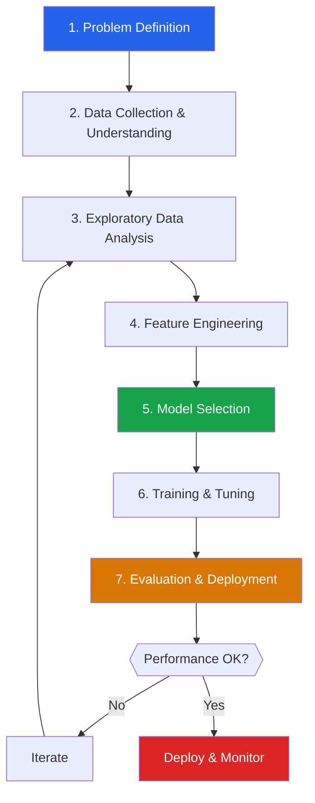
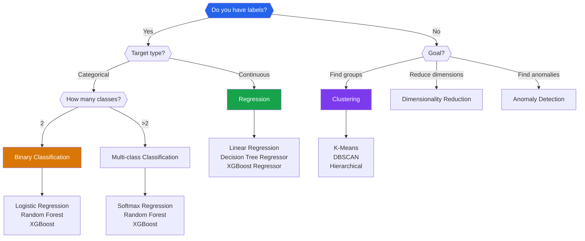
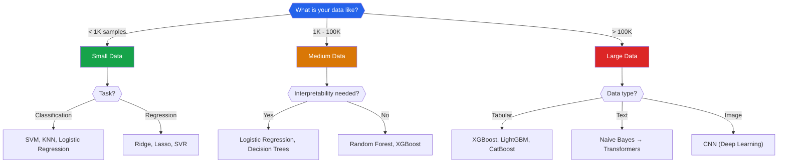

# ML Workflow — Problem to Production

Machine learning is not just calling `model.fit()`. It is a multi-stage engineering process where every stage affects the final result. The algorithm you choose matters far less than the data you prepare, the features you engineer, and the evaluation you perform.

This page walks through every stage of the ML lifecycle with concrete decisions, checklists, and code.

---

## The Seven Stages



---

## Stage 1: Problem Definition

Before writing any code, answer these questions:

### The Five Questions

| Question | Why It Matters | Example |
|----------|---------------|---------|
| **What decision does this model support?** | Models exist to improve decisions | "Which customers will churn in 30 days?" |
| **What is the target variable?** | Defines supervised vs unsupervised | `churned` (binary: 0/1) |
| **What is the success metric?** | Determines how you evaluate | Recall > 80% (catch most churners) |
| **What is the current baseline?** | Need something to beat | Rule-based: 55% recall |
| **What are the constraints?** | Latency, interpretability, fairness | Must explain decisions to customers |

### Choosing the Right ML Task



```python
# problem_definition.py — Document your ML problem formally
problem = {
    "name": "Customer Churn Prediction",
    "type": "binary_classification",
    "target": "churned",
    "positive_class": 1,  # churned = positive event
    "success_metric": "recall",
    "threshold": 0.80,  # must catch 80% of churners
    "secondary_metrics": ["precision", "f1"],
    "baseline": {
        "method": "rule-based (tenure < 3 months)",
        "recall": 0.55,
        "precision": 0.40
    },
    "constraints": {
        "latency_ms": 100,
        "interpretability": "high",  # must explain to customer
        "retraining_frequency": "weekly",
    },
    "stakeholders": ["product team", "customer success"],
    "data_sources": ["CRM", "usage_logs", "billing"],
}
```

---

## Stage 2: Data Collection & Understanding

### Data Quality Checklist

```python
# data_quality.py — Systematic data quality assessment
import pandas as pd
import numpy as np

def data_quality_report(df: pd.DataFrame, target: str = None) -> None:
    """Comprehensive data quality report."""
    print("=" * 60)
    print("DATA QUALITY REPORT")
    print("=" * 60)

    # Shape
    print(f"\nRows: {df.shape[0]:,}")
    print(f"Columns: {df.shape[1]}")

    # Missing values
    missing = df.isnull().sum()
    missing_pct = (missing / len(df) * 100).round(2)
    if missing.any():
        print("\n--- Missing Values ---")
        for col in missing[missing > 0].index:
            print(f"  {col}: {missing[col]:,} ({missing_pct[col]}%)")

    # Duplicates
    n_dups = df.duplicated().sum()
    print(f"\nDuplicate rows: {n_dups:,} ({n_dups/len(df)*100:.2f}%)")

    # Data types
    print("\n--- Data Types ---")
    for dtype, count in df.dtypes.value_counts().items():
        print(f"  {dtype}: {count} columns")

    # Numeric stats
    numeric_cols = df.select_dtypes(include=[np.number]).columns
    if len(numeric_cols) > 0:
        print("\n--- Numeric Summary ---")
        print(df[numeric_cols].describe().round(2).to_string())

    # Categorical cardinality
    cat_cols = df.select_dtypes(include=['object', 'category']).columns
    if len(cat_cols) > 0:
        print("\n--- Categorical Cardinality ---")
        for col in cat_cols:
            n_unique = df[col].nunique()
            print(f"  {col}: {n_unique} unique values")
            if n_unique <= 10:
                print(f"    Values: {df[col].value_counts().to_dict()}")

    # Target distribution
    if target and target in df.columns:
        print(f"\n--- Target: {target} ---")
        dist = df[target].value_counts(normalize=True)
        for val, pct in dist.items():
            print(f"  {val}: {pct:.2%}")
        if len(dist) == 2:
            ratio = dist.min() / dist.max()
            if ratio < 0.2:
                print(f"  WARNING: Imbalanced! Ratio = {ratio:.2f}")

# Example usage
np.random.seed(42)
df = pd.DataFrame({
    'age': np.random.randint(18, 70, 1000),
    'income': np.random.lognormal(10.5, 0.8, 1000),
    'tenure_months': np.random.exponential(20, 1000).clip(1, 72),
    'contract': np.random.choice(['Monthly', 'Annual', 'Two-Year'], 1000),
    'churned': np.random.choice([0, 1], 1000, p=[0.73, 0.27])
})
df.loc[np.random.choice(1000, 50), 'income'] = np.nan

data_quality_report(df, target='churned')
```

---

## Stage 3: Exploratory Data Analysis

EDA is not optional — it is where you discover the signals, the noise, and the landmines.

### EDA Checklist

| Check | What To Look For | Action |
|-------|-----------------|--------|
| **Distributions** | Skewness, outliers, multi-modal | Log transform, clip, separate models |
| **Missing patterns** | MCAR, MAR, MNAR | Imputation strategy |
| **Correlations** | Feature-target, feature-feature | Remove multicollinearity |
| **Class balance** | Target distribution | SMOTE, class weights, threshold tuning |
| **Leakage** | Features that encode the target | Remove before modeling |
| **Temporal patterns** | Trends, seasonality | Time-based splits |

```python
# eda_quick.py — Essential EDA in 20 lines
import pandas as pd
import numpy as np
import matplotlib.pyplot as plt
import seaborn as sns
from sklearn.datasets import fetch_california_housing

# Load real dataset
housing = fetch_california_housing(as_frame=True)
df = housing.frame

# 1. Target distribution
fig, axes = plt.subplots(2, 3, figsize=(15, 10))
df['MedHouseVal'].hist(bins=50, ax=axes[0, 0])
axes[0, 0].set_title('Target Distribution')

# 2. Feature correlations with target
corr = df.corr()['MedHouseVal'].drop('MedHouseVal').sort_values()
corr.plot.barh(ax=axes[0, 1])
axes[0, 1].set_title('Feature-Target Correlations')

# 3. Top feature vs target
df.plot.scatter(x='MedInc', y='MedHouseVal', alpha=0.1, ax=axes[0, 2])
axes[0, 2].set_title('Income vs Price')

# 4. Missing values (none in this dataset, but show the check)
axes[1, 0].barh(df.columns, df.isnull().sum())
axes[1, 0].set_title('Missing Values')

# 5. Correlation heatmap
sns.heatmap(df.corr(), annot=True, fmt='.2f', cmap='coolwarm',
            ax=axes[1, 1], cbar_kws={'shrink': 0.8})
axes[1, 1].set_title('Correlation Matrix')

# 6. Box plots for outlier detection
df[['MedInc', 'HouseAge', 'AveRooms']].boxplot(ax=axes[1, 2])
axes[1, 2].set_title('Outlier Check')

plt.tight_layout()
plt.savefig('eda_overview.png', dpi=150)
plt.show()

print(f"Shape: {df.shape}")
print(f"Missing: {df.isnull().sum().sum()}")
print(f"Target range: [{df['MedHouseVal'].min():.2f}, {df['MedHouseVal'].max():.2f}]")
```

---

## Stage 4: Feature Engineering

Feature engineering transforms raw data into inputs that make the algorithm's job easier. A good feature can be worth more than a better algorithm.

### Feature Engineering Strategies

| Strategy | Example | When |
|----------|---------|------|
| **Polynomial** | `x`, `x²`, `x·y` | Capture non-linear relationships |
| **Binning** | Age → age group | When relationship is stepwise |
| **Log transform** | `log(income)` | Right-skewed distributions |
| **Date extraction** | Date → day_of_week, month, is_holiday | Time-based features |
| **Aggregation** | Customer → avg_purchase, total_visits | Entity-level features |
| **Target encoding** | Category → mean(target) per category | High-cardinality categoricals |
| **Interaction** | `is_premium × tenure` | Combined effects |

```python
# feature_engineering.py — Common feature engineering patterns
import pandas as pd
import numpy as np

# Simulated raw data
np.random.seed(42)
df = pd.DataFrame({
    'signup_date': pd.date_range('2023-01-01', periods=500, freq='D'),
    'last_login': pd.date_range('2023-06-01', periods=500, freq='D'),
    'purchase_amount': np.random.lognormal(3, 1, 500),
    'num_sessions': np.random.poisson(10, 500),
    'city': np.random.choice(['New York', 'London', 'Tokyo', 'Paris', 'Berlin'], 500),
})

# Date features
df['account_age_days'] = (df['last_login'] - df['signup_date']).dt.days
df['signup_month'] = df['signup_date'].dt.month
df['signup_dayofweek'] = df['signup_date'].dt.dayofweek
df['is_weekend_signup'] = df['signup_dayofweek'].isin([5, 6]).astype(int)

# Log transform for skewed distributions
df['log_purchase'] = np.log1p(df['purchase_amount'])

# Interaction features
df['sessions_per_day'] = df['num_sessions'] / df['account_age_days'].clip(1)

# Binning
df['purchase_tier'] = pd.cut(df['purchase_amount'],
    bins=[0, 10, 50, 200, float('inf')],
    labels=['low', 'medium', 'high', 'premium']
)

print(df[['account_age_days', 'log_purchase', 'sessions_per_day',
          'is_weekend_signup', 'purchase_tier']].head(10))
```

---

## Stage 5: Model Selection Decision Tree

### Which Algorithm Should You Try First?



### Algorithm Comparison Table

| Algorithm | Training Speed | Prediction Speed | Handles Missing | Feature Scaling | Interpretable |
|-----------|---------------|-----------------|----------------|----------------|--------------|
| Logistic Regression | Fast | Very fast | No | Required | High |
| Decision Tree | Fast | Very fast | Yes (some) | Not needed | Very high |
| Random Forest | Medium | Medium | Yes (some) | Not needed | Medium |
| XGBoost | Medium | Fast | Yes | Not needed | Low |
| LightGBM | Fast | Fast | Yes | Not needed | Low |
| SVM | Slow (large n) | Fast | No | Required | Low |
| KNN | None (lazy) | Slow | No | Required | Medium |
| Naive Bayes | Very fast | Very fast | Depends | Not needed | High |

### The Practical Strategy

```python
# model_selection.py — Structured model comparison
from sklearn.datasets import load_breast_cancer
from sklearn.model_selection import cross_val_score, StratifiedKFold
from sklearn.preprocessing import StandardScaler
from sklearn.pipeline import make_pipeline
from sklearn.linear_model import LogisticRegression
from sklearn.tree import DecisionTreeClassifier
from sklearn.ensemble import RandomForestClassifier, GradientBoostingClassifier
from sklearn.svm import SVC
from sklearn.neighbors import KNeighborsClassifier
from sklearn.naive_bayes import GaussianNB
import numpy as np
import time

# Load dataset
data = load_breast_cancer()
X, y = data.data, data.target

# Define candidates
models = {
    'Logistic Regression': make_pipeline(StandardScaler(), LogisticRegression(max_iter=1000)),
    'Decision Tree': DecisionTreeClassifier(max_depth=5, random_state=42),
    'Random Forest': RandomForestClassifier(n_estimators=100, random_state=42),
    'Gradient Boosting': GradientBoostingClassifier(n_estimators=100, random_state=42),
    'SVM (RBF)': make_pipeline(StandardScaler(), SVC(kernel='rbf')),
    'KNN (k=5)': make_pipeline(StandardScaler(), KNeighborsClassifier(n_neighbors=5)),
    'Naive Bayes': GaussianNB(),
}

# Evaluate all models
cv = StratifiedKFold(n_splits=5, shuffle=True, random_state=42)
print(f"{'Model':<25} {'Accuracy':>10} {'Std':>8} {'Time (s)':>10}")
print("-" * 55)

results = {}
for name, model in models.items():
    start = time.time()
    scores = cross_val_score(model, X, y, cv=cv, scoring='accuracy')
    elapsed = time.time() - start
    results[name] = scores
    print(f"{name:<25} {scores.mean():>10.4f} {scores.std():>8.4f} {elapsed:>10.3f}")

# Best model
best = max(results, key=lambda k: results[k].mean())
print(f"\nBest model: {best} ({results[best].mean():.4f})")
```

---

## Stage 6: Training & Hyperparameter Tuning

### The Tuning Workflow

```python
# tuning.py — Hyperparameter tuning with cross-validation
from sklearn.datasets import load_breast_cancer
from sklearn.ensemble import RandomForestClassifier
from sklearn.model_selection import (
    GridSearchCV, RandomizedSearchCV, cross_val_score
)
from sklearn.metrics import make_scorer, f1_score
from scipy.stats import randint, uniform
import numpy as np

data = load_breast_cancer()
X, y = data.data, data.target

# Step 1: Quick grid search for key parameters
param_grid = {
    'n_estimators': [50, 100, 200],
    'max_depth': [3, 5, 10, None],
    'min_samples_split': [2, 5, 10],
    'min_samples_leaf': [1, 2, 4],
}

# Grid search — exhaustive but slow for large grids
grid_search = GridSearchCV(
    RandomForestClassifier(random_state=42),
    param_grid,
    cv=5,
    scoring='f1',
    n_jobs=-1,
    verbose=0
)
grid_search.fit(X, y)
print(f"Grid Search Best F1: {grid_search.best_score_:.4f}")
print(f"Best params: {grid_search.best_params_}")

# Step 2: Randomized search — faster for large search spaces
param_distributions = {
    'n_estimators': randint(50, 500),
    'max_depth': [3, 5, 10, 20, None],
    'min_samples_split': randint(2, 20),
    'min_samples_leaf': randint(1, 10),
    'max_features': uniform(0.1, 0.9),
}

random_search = RandomizedSearchCV(
    RandomForestClassifier(random_state=42),
    param_distributions,
    n_iter=100,
    cv=5,
    scoring='f1',
    random_state=42,
    n_jobs=-1,
)
random_search.fit(X, y)
print(f"\nRandom Search Best F1: {random_search.best_score_:.4f}")
print(f"Best params: {random_search.best_params_}")
```

### Learning Curves

```python
# learning_curves.py — Diagnose underfitting vs overfitting
from sklearn.model_selection import learning_curve
from sklearn.ensemble import RandomForestClassifier
from sklearn.datasets import load_breast_cancer
import numpy as np
import matplotlib.pyplot as plt

data = load_breast_cancer()
X, y = data.data, data.target

train_sizes, train_scores, val_scores = learning_curve(
    RandomForestClassifier(n_estimators=100, random_state=42),
    X, y,
    train_sizes=np.linspace(0.1, 1.0, 10),
    cv=5,
    scoring='accuracy',
    n_jobs=-1
)

plt.figure(figsize=(10, 6))
plt.plot(train_sizes, train_scores.mean(axis=1), 'o-', label='Training')
plt.plot(train_sizes, val_scores.mean(axis=1), 'o-', label='Validation')
plt.fill_between(train_sizes,
    train_scores.mean(axis=1) - train_scores.std(axis=1),
    train_scores.mean(axis=1) + train_scores.std(axis=1), alpha=0.1)
plt.fill_between(train_sizes,
    val_scores.mean(axis=1) - val_scores.std(axis=1),
    val_scores.mean(axis=1) + val_scores.std(axis=1), alpha=0.1)
plt.xlabel('Training Set Size')
plt.ylabel('Accuracy')
plt.title('Learning Curves')
plt.legend()
plt.grid(True)
plt.tight_layout()
plt.savefig('learning_curves.png', dpi=150)
plt.show()
```

### How to Read Learning Curves

| Pattern | Diagnosis | Fix |
|---------|-----------|-----|
| Train high, Val low, large gap | **Overfitting** | More data, regularization, simpler model |
| Both low, small gap | **Underfitting** | More features, complex model, less regularization |
| Both high, small gap | **Good fit** | Deploy |
| Val plateaus early | **Not enough features** | Feature engineering |

---

## Stage 7: Evaluation & Deployment

### Evaluation Checklist

```python
# evaluation.py — Comprehensive model evaluation
from sklearn.datasets import load_breast_cancer
from sklearn.model_selection import train_test_split, cross_val_score
from sklearn.ensemble import RandomForestClassifier
from sklearn.metrics import (
    classification_report, confusion_matrix,
    roc_auc_score, average_precision_score
)
import numpy as np

data = load_breast_cancer()
X, y = data.data, data.target
X_train, X_test, y_train, y_test = train_test_split(
    X, y, test_size=0.2, random_state=42, stratify=y
)

model = RandomForestClassifier(n_estimators=100, random_state=42)
model.fit(X_train, y_train)

# 1. Classification report
y_pred = model.predict(X_test)
print(classification_report(y_test, y_pred, target_names=data.target_names))

# 2. Confusion matrix
cm = confusion_matrix(y_test, y_pred)
print(f"Confusion Matrix:\n{cm}")
print(f"True Negatives: {cm[0,0]}, False Positives: {cm[0,1]}")
print(f"False Negatives: {cm[1,0]}, True Positives: {cm[1,1]}")

# 3. Probability-based metrics
y_proba = model.predict_proba(X_test)[:, 1]
roc_auc = roc_auc_score(y_test, y_proba)
pr_auc = average_precision_score(y_test, y_proba)
print(f"\nROC-AUC: {roc_auc:.4f}")
print(f"PR-AUC:  {pr_auc:.4f}")

# 4. Cross-validation (more robust than single split)
cv_scores = cross_val_score(model, X, y, cv=10, scoring='f1')
print(f"\n10-Fold CV F1: {cv_scores.mean():.4f} +/- {cv_scores.std():.4f}")
```

### Deployment Considerations

| Consideration | Options | Trade-off |
|--------------|---------|-----------|
| **Serving mode** | Real-time API, batch, edge | Latency vs throughput |
| **Model format** | pickle, ONNX, PMML | Portability vs performance |
| **Monitoring** | Data drift, concept drift, performance decay | Complexity vs reliability |
| **Retraining** | Scheduled, triggered, continuous | Freshness vs cost |
| **A/B testing** | Shadow mode, canary, full rollout | Safety vs speed |

---

## End-to-End Example: California Housing

```python
# end_to_end.py — Complete ML workflow on California Housing
import numpy as np
import pandas as pd
from sklearn.datasets import fetch_california_housing
from sklearn.model_selection import train_test_split, cross_val_score
from sklearn.pipeline import Pipeline
from sklearn.compose import ColumnTransformer
from sklearn.preprocessing import StandardScaler
from sklearn.impute import SimpleImputer
from sklearn.ensemble import (
    RandomForestRegressor, GradientBoostingRegressor
)
from sklearn.linear_model import Ridge
from sklearn.metrics import mean_squared_error, r2_score, mean_absolute_error

# Stage 1: Problem definition
# Goal: Predict median house value
# Metric: RMSE (root mean squared error)
# Baseline: Predict the mean

# Stage 2: Data collection
housing = fetch_california_housing(as_frame=True)
df = housing.frame
print(f"Dataset shape: {df.shape}")
print(f"Features: {housing.feature_names}")

# Stage 3: Quick EDA
print(f"\nTarget stats:")
print(df['MedHouseVal'].describe())
print(f"\nCorrelations with target:")
print(df.corr()['MedHouseVal'].drop('MedHouseVal').sort_values(ascending=False))

# Stage 4: Feature engineering
X = df.drop('MedHouseVal', axis=1).copy()
y = df['MedHouseVal'].copy()

# Add engineered features
X['rooms_per_household'] = X['AveRooms'] / X['AveOccup'].clip(0.1)
X['bedrooms_ratio'] = X['AveBedrms'] / X['AveRooms'].clip(0.1)
X['population_per_household'] = X['Population'] / X['AveOccup'].clip(0.1)

# Stage 5: Train/test split
X_train, X_test, y_train, y_test = train_test_split(
    X, y, test_size=0.2, random_state=42
)

# Stage 6: Model selection & training
pipeline = Pipeline([
    ('imputer', SimpleImputer(strategy='median')),
    ('scaler', StandardScaler()),
    ('model', None)  # placeholder
])

# Compare models
models = {
    'Ridge': Ridge(alpha=1.0),
    'Random Forest': RandomForestRegressor(n_estimators=100, random_state=42),
    'Gradient Boosting': GradientBoostingRegressor(n_estimators=200, random_state=42),
}

print(f"\n{'Model':<25} {'RMSE':>10} {'MAE':>10} {'R²':>10}")
print("-" * 57)

for name, model in models.items():
    pipeline.set_params(model=model)
    pipeline.fit(X_train, y_train)
    y_pred = pipeline.predict(X_test)
    rmse = np.sqrt(mean_squared_error(y_test, y_pred))
    mae = mean_absolute_error(y_test, y_pred)
    r2 = r2_score(y_test, y_pred)
    print(f"{name:<25} {rmse:>10.4f} {mae:>10.4f} {r2:>10.4f}")

# Stage 7: Final evaluation with best model
pipeline.set_params(model=GradientBoostingRegressor(n_estimators=200, random_state=42))
cv_scores = cross_val_score(pipeline, X, y, cv=5,
                            scoring='neg_root_mean_squared_error')
print(f"\n5-Fold CV RMSE: {-cv_scores.mean():.4f} +/- {cv_scores.std():.4f}")

# Baseline comparison
baseline_rmse = np.sqrt(mean_squared_error(y_test, np.full_like(y_test, y_train.mean())))
print(f"Baseline RMSE (predict mean): {baseline_rmse:.4f}")
print(f"Model improves over baseline by {(1 - (-cv_scores.mean()) / baseline_rmse) * 100:.1f}%")
```

---

## Common Mistakes

### 1. Data Leakage

```python
# WRONG: Fitting scaler on all data before splitting
from sklearn.preprocessing import StandardScaler
scaler = StandardScaler()
X_scaled = scaler.fit_transform(X)  # leaks test statistics
X_train, X_test = train_test_split(X_scaled)

# CORRECT: Use a pipeline that fits only on training data
from sklearn.pipeline import make_pipeline
pipeline = make_pipeline(StandardScaler(), Ridge())
pipeline.fit(X_train, y_train)  # scaler sees only training data
```

### 2. Evaluating on Training Data

```python
# WRONG: "My model is 99.9% accurate!" (on training data)
model.fit(X_train, y_train)
print(model.score(X_train, y_train))  # meaningless

# CORRECT: Evaluate on held-out test data
print(model.score(X_test, y_test))  # honest evaluation
```

### 3. Ignoring Class Imbalance

```python
# WRONG: Using accuracy on imbalanced data
# If 95% negative, predicting all negative = 95% accuracy

# CORRECT: Use appropriate metrics
from sklearn.metrics import f1_score, recall_score
print(f"F1: {f1_score(y_test, y_pred)}")
print(f"Recall: {recall_score(y_test, y_pred)}")
```

### 4. Not Setting Random Seeds

```python
# WRONG: Different results every run
model = RandomForestClassifier()

# CORRECT: Reproducible results
model = RandomForestClassifier(n_estimators=100, random_state=42)
```

---

## Workflow Cheat Sheet

| Stage | Time Spent | Key Output |
|-------|-----------|------------|
| Problem Definition | 5% | Success metric, baseline |
| Data Collection | 10% | Clean dataset |
| EDA | 20% | Understanding of distributions, relationships |
| Feature Engineering | 25% | Transformed feature matrix |
| Model Selection | 10% | Short list of candidates |
| Training & Tuning | 20% | Tuned model |
| Evaluation & Deploy | 10% | Performance report, deployed model |

The most impactful stages are EDA and feature engineering — they determine the ceiling of what any model can achieve.

---

## Further Reading

- **[Data Preparation](/machine-learning/data-preparation)** — Deep dive into splits, validation, and preprocessing
- **[Python ML Ecosystem](/machine-learning/python-ml-ecosystem)** — Tools and libraries
- **[Evaluation Metrics](/machine-learning/evaluation-metrics)** — Comprehensive metric reference
- **[Linear Regression](/machine-learning/linear-regression)** — Your first algorithm, deeply understood
