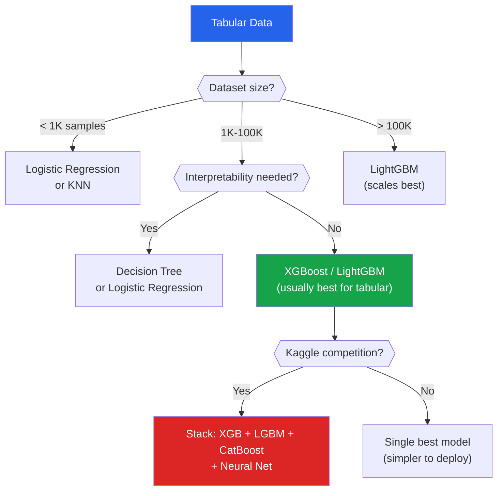

# Model Selection

Model selection answers the fundamental question: **which model should I use?** It is not just about picking an algorithm — it is about understanding the tradeoff between simplicity and complexity, between fitting the training data and generalizing to unseen data. Every model selection decision is, at its core, a bias-variance tradeoff decision.

## The Bias-Variance Decomposition

### Mathematical Derivation

For a regression problem with true function $f(x)$ and noise $\epsilon \sim \mathcal{N}(0, \sigma^2)$, the data-generating process is:

$$y = f(x) + \epsilon$$

A model trained on a dataset $\mathcal{D}$ produces predictions $\hat{f}_{\mathcal{D}}(x)$. The expected prediction error (MSE) at a point $x_0$ over all possible training sets is:

$$\text{EPE}(x_0) = E_{\mathcal{D}}[(y - \hat{f}_{\mathcal{D}}(x_0))^2]$$

Expand by adding and subtracting $f(x_0)$ and $E[\hat{f}(x_0)]$:

$$= E[(f(x_0) + \epsilon - \hat{f}(x_0))^2]$$

$$= E[(f(x_0) - \hat{f}(x_0))^2] + E[\epsilon^2] + 2E[\epsilon(f(x_0) - \hat{f}(x_0))]$$

Since $\epsilon$ is independent of $\hat{f}$ and $E[\epsilon] = 0$, the cross term vanishes:

$$= E[(f(x_0) - \hat{f}(x_0))^2] + \sigma^2$$

Now decompose the first term by adding and subtracting $E[\hat{f}(x_0)]$:

$$E[(f(x_0) - \hat{f}(x_0))^2] = E[(\hat{f}(x_0) - E[\hat{f}(x_0)])^2] + (f(x_0) - E[\hat{f}(x_0)])^2$$

Therefore:

$$\boxed{\text{EPE}(x_0) = \underbrace{(f(x_0) - E[\hat{f}(x_0)])^2}_{\text{Bias}^2} + \underbrace{E[(\hat{f}(x_0) - E[\hat{f}(x_0)])^2]}_{\text{Variance}} + \underbrace{\sigma^2}_{\text{Irreducible noise}}}$$

::: details Worked Example — Bias-Variance Decomposition

**True function: f(x) = 3x. Noise sigma = 1.0. Training on 5 different datasets, evaluating at x0 = 2 (true value = 6).**

Predictions from 5 datasets (each trained on different random samples):
  f_hat_1(2) = 5.2
  f_hat_2(2) = 6.8
  f_hat_3(2) = 5.5
  f_hat_4(2) = 7.1
  f_hat_5(2) = 5.4

**Step 1:** Compute E[f_hat(2)]
  E[f_hat] = (5.2 + 6.8 + 5.5 + 7.1 + 5.4) / 5 = 30.0/5 = 6.0

**Step 2:** Compute Bias^2
  Bias = f(2) - E[f_hat(2)] = 6.0 - 6.0 = 0.0
  Bias^2 = 0.0 (unbiased model!)

**Step 3:** Compute Variance
  Var = mean of (f_hat - E[f_hat])^2
      = [(5.2-6)^2 + (6.8-6)^2 + (5.5-6)^2 + (7.1-6)^2 + (5.4-6)^2] / 5
      = [0.64 + 0.64 + 0.25 + 1.21 + 0.36] / 5
      = 3.10 / 5 = 0.62

**Step 4:** Total expected error
  EPE = Bias^2 + Variance + sigma^2
      = 0.0 + 0.62 + 1.0 = 1.62

**Interpret:**
  "The model is unbiased (correct on average) but has variance 0.62 — it gives different predictions depending on which training data it saw. The total error of 1.62 includes irreducible noise (1.0) that no model can eliminate. A simpler model might have higher bias but lower variance."

:::

### Intuition

| Component | What It Measures | Caused By |
|-----------|-----------------|-----------|
| **Bias$^2$** | How far the average prediction is from the truth | Model too simple to capture the pattern |
| **Variance** | How much predictions change across different training sets | Model too complex, fits noise |
| **Noise** ($\sigma^2$) | Inherent randomness in the data | Cannot be reduced by any model |

### Visualization

```python
import numpy as np
import matplotlib.pyplot as plt

# True function
np.random.seed(42)
def f_true(x):
    return np.sin(2 * np.pi * x)

# Generate multiple datasets and fit models of different complexity
n_datasets = 50
n_samples = 30
x_plot = np.linspace(0, 1, 200)

fig, axes = plt.subplots(1, 3, figsize=(18, 5))
titles = ['Underfitting (degree=1)\nHigh Bias, Low Variance',
          'Good Fit (degree=4)\nBalanced',
          'Overfitting (degree=15)\nLow Bias, High Variance']
degrees = [1, 4, 15]

for ax, degree, title in zip(axes, degrees, titles):
    predictions = []
    for _ in range(n_datasets):
        x = np.random.uniform(0, 1, n_samples)
        y = f_true(x) + np.random.normal(0, 0.3, n_samples)

        coeffs = np.polyfit(x, y, degree)
        y_pred = np.polyval(coeffs, x_plot)
        predictions.append(y_pred)
        ax.plot(x_plot, y_pred, alpha=0.1, color='blue')

    predictions = np.array(predictions)
    mean_pred = predictions.mean(axis=0)
    ax.plot(x_plot, f_true(x_plot), 'r-', linewidth=2, label='True f(x)')
    ax.plot(x_plot, mean_pred, 'g--', linewidth=2, label='E[f_hat(x)]')

    bias_sq = ((f_true(x_plot) - mean_pred) ** 2).mean()
    variance = predictions.var(axis=0).mean()
    ax.set_title(f'{title}\nBias²={bias_sq:.3f}, Var={variance:.3f}')
    ax.set_ylim(-2, 2)
    ax.legend(fontsize=8)
    ax.grid(True, alpha=0.3)

plt.tight_layout()
plt.savefig('bias_variance_visual.png', dpi=150, bbox_inches='tight')
plt.show()
```

### Bias-Variance as Function of Complexity

```python
from sklearn.pipeline import Pipeline
from sklearn.preprocessing import PolynomialFeatures
from sklearn.linear_model import LinearRegression
from sklearn.model_selection import cross_val_score, ShuffleSplit
from sklearn.datasets import load_diabetes

diabetes = load_diabetes()
X_d, y_d = diabetes.data[:, :1], diabetes.target  # Use 1 feature for visualization

degrees = range(1, 20)
train_errors = []
test_errors = []

for d in degrees:
    pipe = Pipeline([
        ('poly', PolynomialFeatures(degree=d)),
        ('reg', LinearRegression())
    ])

    # Training error
    pipe.fit(X_d, y_d)
    train_mse = np.mean((pipe.predict(X_d) - y_d) ** 2)
    train_errors.append(train_mse)

    # Test error via CV
    cv = ShuffleSplit(n_splits=10, test_size=0.2, random_state=42)
    scores = cross_val_score(pipe, X_d, y_d, cv=cv,
                              scoring='neg_mean_squared_error')
    test_errors.append(-scores.mean())

plt.figure(figsize=(10, 6))
plt.plot(list(degrees), train_errors, 'b-o', label='Training Error', markersize=4)
plt.plot(list(degrees), test_errors, 'r-o', label='Test Error (CV)', markersize=4)
plt.xlabel('Polynomial Degree (Model Complexity)')
plt.ylabel('Mean Squared Error')
plt.title('Bias-Variance Tradeoff: Training vs Test Error')
plt.legend()
plt.yscale('log')
plt.grid(True, alpha=0.3)

# Annotate
best_degree = list(degrees)[np.argmin(test_errors)]
plt.axvline(x=best_degree, color='green', linestyle='--',
            label=f'Optimal complexity: degree {best_degree}')
plt.legend()
plt.savefig('bias_variance_tradeoff.png', dpi=150, bbox_inches='tight')
plt.show()
```

---

## Underfitting vs Overfitting

### Diagnostic Table

| Symptom | Diagnosis | Solution |
|---------|-----------|----------|
| Train error high, test error high | **Underfitting** | More complex model, more features, less regularization |
| Train error low, test error high | **Overfitting** | More data, regularization, simpler model, dropout |
| Train error low, test error low | **Good fit** | Deploy! |
| Test error decreasing with more data | **Needs more data** | Collect more samples |
| Test error flat with more data | **Model capacity issue** | More complex model |

### Regularization Controls Complexity

| Model | Regularization Knob | More Regularization = |
|-------|---------------------|----------------------|
| Linear/Logistic | `C` (inverse), `alpha` | Smaller coefficients (simpler) |
| Decision Tree | `max_depth`, `min_samples_leaf` | Shallower trees (simpler) |
| Random Forest | `max_features`, `min_samples_leaf` | Less diverse trees |
| Neural Network | Dropout rate, weight decay | Fewer effective parameters |
| SVM | `C` (inverse), kernel choice | Larger margin (simpler boundary) |

---

## Model Comparison Framework

### Step 1: Baseline Models

Always start with simple baselines:

```python
from sklearn.dummy import DummyClassifier, DummyRegressor
from sklearn.model_selection import cross_val_score
from sklearn.datasets import load_breast_cancer

cancer = load_breast_cancer()
X, y = cancer.data, cancer.target

# Classification baselines
for strategy in ['most_frequent', 'stratified', 'uniform']:
    dummy = DummyClassifier(strategy=strategy, random_state=42)
    scores = cross_val_score(dummy, X, y, cv=5, scoring='accuracy')
    print(f"Dummy ({strategy}): {scores.mean():.4f}")
```

### Step 2: Quick Comparison

```python
from sklearn.linear_model import LogisticRegression
from sklearn.tree import DecisionTreeClassifier
from sklearn.ensemble import (RandomForestClassifier,
                               GradientBoostingClassifier)
from sklearn.svm import SVC
from sklearn.neighbors import KNeighborsClassifier
from sklearn.naive_bayes import GaussianNB
from sklearn.preprocessing import StandardScaler
from sklearn.pipeline import make_pipeline
from sklearn.model_selection import StratifiedKFold
import time

models = {
    'Logistic Regression': make_pipeline(StandardScaler(), LogisticRegression(max_iter=1000)),
    'Decision Tree': DecisionTreeClassifier(random_state=42),
    'Random Forest': RandomForestClassifier(n_estimators=100, random_state=42),
    'Gradient Boosting': GradientBoostingClassifier(n_estimators=100, random_state=42),
    'SVM (RBF)': make_pipeline(StandardScaler(), SVC(kernel='rbf', random_state=42)),
    'KNN': make_pipeline(StandardScaler(), KNeighborsClassifier(n_neighbors=5)),
    'Naive Bayes': GaussianNB(),
}

cv = StratifiedKFold(n_splits=5, shuffle=True, random_state=42)
results = {}

print(f"{'Model':<25} {'Accuracy':>10} {'Std':>8} {'Time(s)':>8}")
print("-" * 55)

for name, model in models.items():
    start = time.time()
    scores = cross_val_score(model, X, y, cv=cv, scoring='accuracy')
    elapsed = time.time() - start
    results[name] = scores
    print(f"{name:<25} {scores.mean():10.4f} {scores.std():8.4f} {elapsed:8.3f}")

# Boxplot comparison
fig, ax = plt.subplots(figsize=(12, 6))
ax.boxplot(results.values(), labels=results.keys(), vert=True)
ax.set_ylabel('Accuracy')
ax.set_title('Model Comparison (5-Fold CV)')
plt.xticks(rotation=45, ha='right')
plt.grid(True, alpha=0.3, axis='y')
plt.tight_layout()
plt.savefig('model_comparison.png', dpi=150, bbox_inches='tight')
plt.show()
```

### Step 3: Statistical Significance

```python
from scipy.stats import wilcoxon, friedmanchisquare

# Friedman test: are there significant differences among models?
all_scores = list(results.values())
stat, p_value = friedmanchisquare(*all_scores)
print(f"\nFriedman test: statistic={stat:.4f}, p={p_value:.4f}")
if p_value < 0.05:
    print("Significant differences exist among models")

# Pairwise Wilcoxon between top 2 models
names = list(results.keys())
scores_sorted = sorted(results.items(), key=lambda x: -x[1].mean())
top1_name, top1_scores = scores_sorted[0]
top2_name, top2_scores = scores_sorted[1]

stat, p = wilcoxon(top1_scores, top2_scores)
print(f"\nWilcoxon {top1_name} vs {top2_name}: p={p:.4f}")
```

---

## Ensemble Methods for Model Selection

When you cannot pick a single best model, combine them.

### Hard Voting

Each model casts a vote. Majority wins.

```python
from sklearn.ensemble import VotingClassifier

voting_hard = VotingClassifier(
    estimators=[
        ('lr', make_pipeline(StandardScaler(), LogisticRegression(max_iter=1000))),
        ('rf', RandomForestClassifier(n_estimators=100, random_state=42)),
        ('gb', GradientBoostingClassifier(n_estimators=100, random_state=42)),
    ],
    voting='hard'
)

scores = cross_val_score(voting_hard, X, y, cv=5, scoring='accuracy')
print(f"Hard Voting: {scores.mean():.4f} +/- {scores.std():.4f}")
```

### Soft Voting

Average predicted probabilities. Often better than hard voting because it uses confidence.

$$\hat{y} = \arg\max_c \frac{1}{M}\sum_{m=1}^{M} p_m(c | x)$$

```python
voting_soft = VotingClassifier(
    estimators=[
        ('lr', make_pipeline(StandardScaler(), LogisticRegression(max_iter=1000))),
        ('rf', RandomForestClassifier(n_estimators=100, random_state=42)),
        ('gb', GradientBoostingClassifier(n_estimators=100, random_state=42)),
    ],
    voting='soft'
)

scores = cross_val_score(voting_soft, X, y, cv=5, scoring='accuracy')
print(f"Soft Voting: {scores.mean():.4f} +/- {scores.std():.4f}")
```

### Stacking

Train a **meta-learner** on the predictions of base models:

```python
from sklearn.ensemble import StackingClassifier

stacking = StackingClassifier(
    estimators=[
        ('lr', make_pipeline(StandardScaler(), LogisticRegression(max_iter=1000))),
        ('rf', RandomForestClassifier(n_estimators=100, random_state=42)),
        ('gb', GradientBoostingClassifier(n_estimators=100, random_state=42)),
        ('svm', make_pipeline(StandardScaler(), SVC(probability=True, random_state=42))),
    ],
    final_estimator=LogisticRegression(max_iter=1000),
    cv=5,
    passthrough=False  # True to also pass original features to meta-learner
)

scores = cross_val_score(stacking, X, y, cv=5, scoring='accuracy')
print(f"Stacking: {scores.mean():.4f} +/- {scores.std():.4f}")
```

### Blending

Like stacking but uses a single hold-out set instead of CV for generating meta-features. Simpler but wastes data.

```python
from sklearn.model_selection import train_test_split

def blend_models(X, y, base_models, meta_model, test_size=0.2):
    """Blending: train base models on train, generate meta-features on blend set."""
    X_train, X_blend, y_train, y_blend = train_test_split(
        X, y, test_size=test_size, random_state=42, stratify=y
    )
    X_blend2, X_test, y_blend2, y_test = train_test_split(
        X_blend, y_blend, test_size=0.5, random_state=42, stratify=y_blend
    )

    # Train base models and generate meta-features
    blend_preds = np.zeros((len(X_blend2), len(base_models)))
    test_preds = np.zeros((len(X_test), len(base_models)))

    for i, (name, model) in enumerate(base_models):
        model.fit(X_train, y_train)
        blend_preds[:, i] = model.predict_proba(X_blend2)[:, 1]
        test_preds[:, i] = model.predict_proba(X_test)[:, 1]

    # Train meta-model on blend predictions
    meta_model.fit(blend_preds, y_blend2)
    score = meta_model.score(test_preds, y_test)
    return score

base_models = [
    ('lr', make_pipeline(StandardScaler(), LogisticRegression(max_iter=1000))),
    ('rf', RandomForestClassifier(n_estimators=100, random_state=42)),
    ('gb', GradientBoostingClassifier(n_estimators=100, random_state=42)),
]

score = blend_models(X, y, base_models, LogisticRegression())
print(f"Blending: {score:.4f}")
```

---

## The No Free Lunch Theorem

### Statement

Averaged over all possible problems (all possible data-generating distributions), no algorithm performs better than any other — including random guessing. Formally:

$$\sum_f \text{Performance}(A_1, f) = \sum_f \text{Performance}(A_2, f)$$

for any two algorithms $A_1$ and $A_2$, where the sum is over all possible target functions $f$.

### What It Actually Means

1. **There is no universally best algorithm** — anyone claiming "X is always best" is wrong
2. **Domain knowledge matters** — the right algorithm depends on the problem structure
3. **Assumptions are necessary** — every algorithm works well under some assumptions and poorly under others
4. **Try multiple algorithms** — you cannot know in advance which will work

### What It Does NOT Mean

- It does not mean all algorithms are equal on YOUR problem
- For specific problem structures (e.g., tabular data), some algorithms do consistently better
- In practice, gradient boosting wins most tabular competitions, and that is fine — real data is not "all possible data"

---

## Practical Model Selection Heuristics

### For Tabular Data



### Rule of Thumb Ranking (Tabular Data, 2026)

| Rank | Algorithm | When It Wins |
|------|-----------|-------------|
| 1 | **LightGBM / XGBoost** | Default choice for tabular data |
| 2 | **CatBoost** | Many categorical features |
| 3 | **Random Forest** | When interpretability + robustness needed |
| 4 | **Logistic/Linear Regression** | When interpretability is paramount |
| 5 | **SVM** | Small dataset, high-dimensional |
| 6 | **KNN** | Very small dataset, few features |
| 7 | **Neural Network** | Tabular: rarely best; Unstructured: always best |

---

## Information Criteria

For comparing models without cross-validation (especially linear models):

### AIC (Akaike Information Criterion)

$$\text{AIC} = 2k - 2\ln(\hat{L})$$

where $k$ is the number of parameters and $\hat{L}$ is the maximum likelihood. Lower = better. Penalizes complexity less than BIC.

### BIC (Bayesian Information Criterion)

$$\text{BIC} = k \ln(n) - 2\ln(\hat{L})$$

Penalizes complexity more strongly for large $n$. Tends to select simpler models.

```python
from sklearn.linear_model import LinearRegression
from sklearn.metrics import mean_squared_error

def compute_aic_bic(y_true, y_pred, n_params, n_samples):
    """Compute AIC and BIC for a regression model."""
    mse = mean_squared_error(y_true, y_pred)
    # Log-likelihood assuming Gaussian errors
    log_likelihood = -n_samples / 2 * (np.log(2 * np.pi * mse) + 1)

    aic = 2 * n_params - 2 * log_likelihood
    bic = n_params * np.log(n_samples) - 2 * log_likelihood
    return aic, bic

# Compare polynomial degrees
from sklearn.preprocessing import PolynomialFeatures

X_1d = diabetes.data[:, :1]
y_target = diabetes.target

print(f"{'Degree':<10} {'AIC':>10} {'BIC':>10} {'MSE':>10}")
print("-" * 45)

for degree in range(1, 10):
    poly = PolynomialFeatures(degree=degree)
    X_poly = poly.fit_transform(X_1d)
    n_params = X_poly.shape[1]

    reg = LinearRegression().fit(X_poly, y_target)
    y_pred = reg.predict(X_poly)

    aic, bic = compute_aic_bic(y_target, y_pred, n_params, len(y_target))
    mse = mean_squared_error(y_target, y_pred)
    print(f"{degree:<10} {aic:10.1f} {bic:10.1f} {mse:10.1f}")
```

---

## Key Takeaways

| Concept | Remember |
|---------|----------|
| EPE = Bias$^2$ + Variance + Noise | The fundamental decomposition of prediction error |
| High bias = underfitting | Model too simple — increase complexity |
| High variance = overfitting | Model too complex — regularize or get more data |
| Noise is irreducible | No model can beat it — it is the Bayes error |
| No Free Lunch | No algorithm is universally best — try multiple |
| Gradient boosting wins tabular | XGBoost/LightGBM is the default choice for structured data |
| Stacking > Voting > Single model | But added complexity may not be worth it in production |
| AIC/BIC compare nested models | BIC penalizes complexity more for large samples |
| Always start with simple baselines | Cannot evaluate a model without a baseline |
