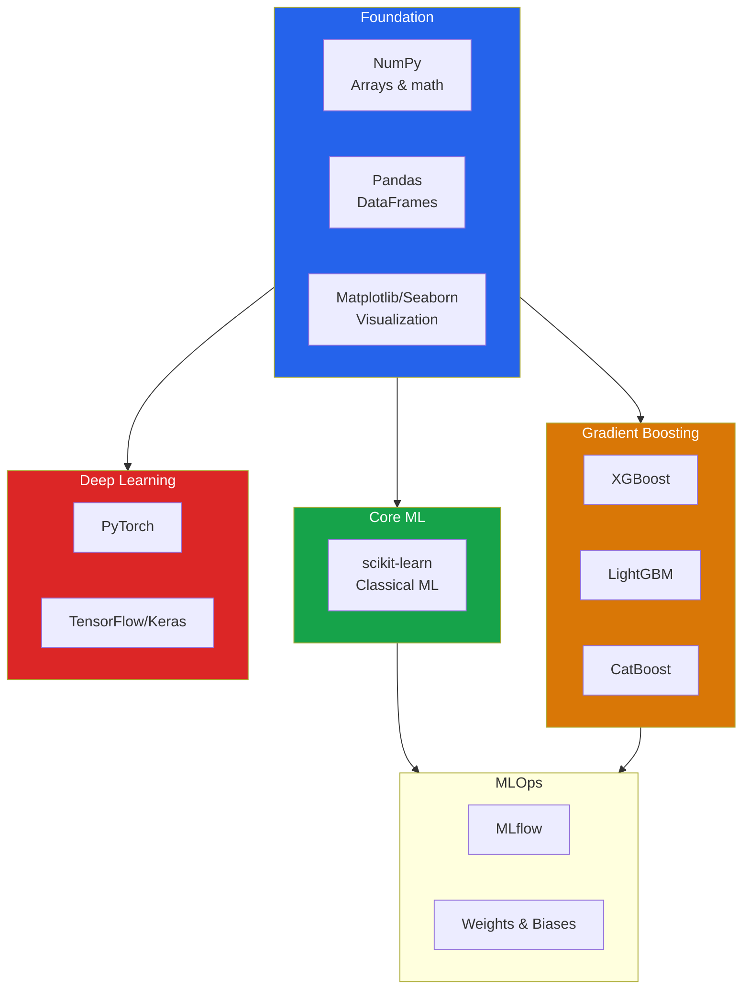

# Python ML Ecosystem

Python dominates machine learning because of its ecosystem. This page covers the core libraries you need, how they fit together, and when to use which.

---

## The Stack at a Glance



---

## scikit-learn: The Universal API

scikit-learn is the most important ML library. Even if you end up using XGBoost or PyTorch, you will use scikit-learn for preprocessing, evaluation, and pipelines.

### The Estimator API

Every scikit-learn object follows the same interface:

```python
# sklearn_api.py — The consistent API pattern
from sklearn.linear_model import LogisticRegression
from sklearn.ensemble import RandomForestClassifier
from sklearn.svm import SVC
from sklearn.neighbors import KNeighborsClassifier

# ALL models follow the same pattern:
# 1. Instantiate with hyperparameters
model = LogisticRegression(C=1.0, max_iter=200)

# 2. Fit on training data
# model.fit(X_train, y_train)

# 3. Predict
# y_pred = model.predict(X_test)
# y_proba = model.predict_proba(X_test)

# 4. Evaluate
# score = model.score(X_test, y_test)

# This is true for EVERY algorithm — swap one line to try another:
models = [
    LogisticRegression(max_iter=200),
    RandomForestClassifier(n_estimators=100),
    SVC(kernel='rbf', probability=True),
    KNeighborsClassifier(n_neighbors=5),
]

# Same .fit() / .predict() for all of them
```

### Transformers

Transformers follow the `fit` / `transform` pattern:

```python
# transformers.py — Preprocessing with scikit-learn
from sklearn.preprocessing import (
    StandardScaler, MinMaxScaler, RobustScaler,
    OneHotEncoder, LabelEncoder, OrdinalEncoder,
    PolynomialFeatures
)
from sklearn.impute import SimpleImputer
import numpy as np

X = np.array([[1, 100], [2, 200], [3, 150], [4, 300]])

# StandardScaler: z = (x - mean) / std
scaler = StandardScaler()
X_scaled = scaler.fit_transform(X)
print(f"StandardScaler:\n{X_scaled.round(3)}")
print(f"Mean: {X_scaled.mean(axis=0).round(10)}")  # [0, 0]
print(f"Std:  {X_scaled.std(axis=0).round(4)}")     # [1, 1]

# MinMaxScaler: x' = (x - min) / (max - min)
mm = MinMaxScaler()
X_mm = mm.fit_transform(X)
print(f"\nMinMaxScaler:\n{X_mm.round(3)}")

# RobustScaler: uses median and IQR, resistant to outliers
rs = RobustScaler()
X_rs = rs.fit_transform(X)
print(f"\nRobustScaler:\n{X_rs.round(3)}")

# Imputer: fill missing values
X_missing = np.array([[1, np.nan], [2, 200], [np.nan, 150], [4, 300]])
imputer = SimpleImputer(strategy='median')
X_filled = imputer.fit_transform(X_missing)
print(f"\nImputed:\n{X_filled}")
```

### Pipelines

Pipelines chain transformers and estimators. They prevent data leakage and make code clean:

```python
# pipelines.py — End-to-end pipelines
from sklearn.pipeline import Pipeline, make_pipeline
from sklearn.compose import ColumnTransformer
from sklearn.preprocessing import StandardScaler, OneHotEncoder
from sklearn.impute import SimpleImputer
from sklearn.ensemble import RandomForestClassifier
from sklearn.model_selection import cross_val_score
import pandas as pd
import numpy as np

# Create sample data
np.random.seed(42)
df = pd.DataFrame({
    'age': [25, 30, np.nan, 45, 50, 35, 28, np.nan, 40, 33],
    'income': [30000, 50000, 45000, 70000, 80000, 55000, 35000, 60000, 65000, 48000],
    'city': ['NYC', 'LA', 'NYC', 'LA', 'CHI', 'NYC', 'LA', 'CHI', 'NYC', 'LA'],
    'purchased': [0, 1, 0, 1, 1, 1, 0, 1, 1, 0]
})

X = df.drop('purchased', axis=1)
y = df['purchased']

# Define column groups
numeric_features = ['age', 'income']
categorical_features = ['city']

# Build preprocessing for each column type
numeric_pipeline = Pipeline([
    ('imputer', SimpleImputer(strategy='median')),
    ('scaler', StandardScaler()),
])

categorical_pipeline = Pipeline([
    ('imputer', SimpleImputer(strategy='most_frequent')),
    ('encoder', OneHotEncoder(handle_unknown='ignore', sparse_output=False)),
])

# Combine into a ColumnTransformer
preprocessor = ColumnTransformer([
    ('num', numeric_pipeline, numeric_features),
    ('cat', categorical_pipeline, categorical_features),
])

# Full pipeline: preprocessing + model
full_pipeline = Pipeline([
    ('preprocess', preprocessor),
    ('model', RandomForestClassifier(n_estimators=100, random_state=42)),
])

# Cross-validate — no leakage because pipeline handles everything
scores = cross_val_score(full_pipeline, X, y, cv=3, scoring='accuracy')
print(f"CV Accuracy: {scores.mean():.4f} +/- {scores.std():.4f}")

# The pipeline is a single object you can save/load
full_pipeline.fit(X, y)
prediction = full_pipeline.predict(X.iloc[:1])
print(f"Prediction for first sample: {prediction}")
```

### Key scikit-learn Modules

| Module | Purpose | Key Classes |
|--------|---------|-------------|
| `sklearn.linear_model` | Linear models | `LinearRegression`, `LogisticRegression`, `Ridge`, `Lasso` |
| `sklearn.tree` | Decision trees | `DecisionTreeClassifier`, `DecisionTreeRegressor` |
| `sklearn.ensemble` | Ensemble methods | `RandomForestClassifier`, `GradientBoostingClassifier` |
| `sklearn.svm` | Support vector machines | `SVC`, `SVR`, `LinearSVC` |
| `sklearn.neighbors` | Nearest neighbors | `KNeighborsClassifier`, `KNeighborsRegressor` |
| `sklearn.naive_bayes` | Naive Bayes | `GaussianNB`, `MultinomialNB`, `BernoulliNB` |
| `sklearn.cluster` | Clustering | `KMeans`, `DBSCAN`, `AgglomerativeClustering` |
| `sklearn.decomposition` | Dimensionality reduction | `PCA`, `NMF`, `TruncatedSVD` |
| `sklearn.preprocessing` | Feature preprocessing | `StandardScaler`, `OneHotEncoder`, `LabelEncoder` |
| `sklearn.model_selection` | Validation & tuning | `cross_val_score`, `GridSearchCV`, `train_test_split` |
| `sklearn.metrics` | Evaluation | `accuracy_score`, `f1_score`, `roc_auc_score` |
| `sklearn.pipeline` | Chaining | `Pipeline`, `make_pipeline` |
| `sklearn.compose` | Column transformers | `ColumnTransformer` |

---

## XGBoost

XGBoost (eXtreme Gradient Boosting) is the workhorse for tabular data competitions and production systems. It implements gradient boosting with regularization, histogram-based splitting, and built-in cross-validation.

### Basic Usage

```python
# xgboost_basics.py — XGBoost with scikit-learn API
import xgboost as xgb
from sklearn.datasets import load_breast_cancer
from sklearn.model_selection import train_test_split, cross_val_score
from sklearn.metrics import accuracy_score, classification_report
import numpy as np

data = load_breast_cancer()
X_train, X_test, y_train, y_test = train_test_split(
    data.data, data.target, test_size=0.2, random_state=42
)

# scikit-learn API — familiar interface
model = xgb.XGBClassifier(
    n_estimators=200,
    max_depth=5,
    learning_rate=0.1,
    subsample=0.8,
    colsample_bytree=0.8,
    reg_alpha=0.1,      # L1 regularization
    reg_lambda=1.0,      # L2 regularization
    random_state=42,
    eval_metric='logloss',
)

# Train with early stopping
model.fit(
    X_train, y_train,
    eval_set=[(X_test, y_test)],
    verbose=False
)

y_pred = model.predict(X_test)
print(f"Accuracy: {accuracy_score(y_test, y_pred):.4f}")
print(classification_report(y_test, y_pred, target_names=data.target_names))

# Feature importance
importances = model.feature_importances_
top_idx = np.argsort(importances)[-5:]
for i in top_idx:
    print(f"  {data.feature_names[i]}: {importances[i]:.4f}")
```

### XGBoost Native API

```python
# xgboost_native.py — DMatrix API for more control
import xgboost as xgb
from sklearn.datasets import load_breast_cancer
from sklearn.model_selection import train_test_split

data = load_breast_cancer()
X_train, X_test, y_train, y_test = train_test_split(
    data.data, data.target, test_size=0.2, random_state=42
)

# Convert to DMatrix — XGBoost's optimized data structure
dtrain = xgb.DMatrix(X_train, label=y_train)
dtest = xgb.DMatrix(X_test, label=y_test)

params = {
    'max_depth': 5,
    'eta': 0.1,           # learning rate
    'objective': 'binary:logistic',
    'eval_metric': 'logloss',
    'subsample': 0.8,
    'colsample_bytree': 0.8,
    'seed': 42,
}

# Train with watchlist for early stopping
evals = [(dtrain, 'train'), (dtest, 'test')]
model = xgb.train(
    params, dtrain,
    num_boost_round=500,
    evals=evals,
    early_stopping_rounds=20,
    verbose_eval=50
)

print(f"\nBest iteration: {model.best_iteration}")
print(f"Best score: {model.best_score:.6f}")

# Built-in cross-validation
cv_results = xgb.cv(
    params, dtrain,
    num_boost_round=500,
    nfold=5,
    early_stopping_rounds=20,
    verbose_eval=50,
    as_pandas=True,
)
print(f"\nCV best logloss: {cv_results['test-logloss-mean'].min():.6f}")
```

### XGBoost Key Parameters

| Parameter | Description | Default | Typical Range |
|-----------|-------------|---------|--------------|
| `n_estimators` | Number of trees | 100 | 100-1000 |
| `max_depth` | Tree depth | 6 | 3-10 |
| `learning_rate` | Step size shrinkage | 0.3 | 0.01-0.3 |
| `subsample` | Row sampling ratio | 1.0 | 0.5-1.0 |
| `colsample_bytree` | Column sampling ratio | 1.0 | 0.5-1.0 |
| `reg_alpha` | L1 regularization | 0 | 0-10 |
| `reg_lambda` | L2 regularization | 1 | 0-10 |
| `min_child_weight` | Minimum sum of hessian in a leaf | 1 | 1-10 |
| `gamma` | Minimum loss reduction for split | 0 | 0-5 |

---

## LightGBM

LightGBM is Microsoft's gradient boosting framework. It uses **histogram-based** splitting, **leaf-wise** tree growth, and two key innovations: **GOSS** (Gradient-based One-Side Sampling) and **EFB** (Exclusive Feature Bundling).

### Why LightGBM Is Fast

| Feature | XGBoost (default) | LightGBM |
|---------|-------------------|----------|
| Tree growth | Level-wise | **Leaf-wise** (deeper, more accurate) |
| Splitting | Exact or histogram | **Histogram only** (faster) |
| Large gradients | Use all data | **GOSS** — keep large gradients, sample small ones |
| Sparse features | Handle individually | **EFB** — bundle exclusive features |

### Basic Usage

```python
# lightgbm_basics.py — LightGBM with scikit-learn API
import lightgbm as lgb
from sklearn.datasets import load_breast_cancer
from sklearn.model_selection import train_test_split, cross_val_score
from sklearn.metrics import accuracy_score
import numpy as np

data = load_breast_cancer()
X_train, X_test, y_train, y_test = train_test_split(
    data.data, data.target, test_size=0.2, random_state=42
)

model = lgb.LGBMClassifier(
    n_estimators=200,
    num_leaves=31,          # key param — controls complexity
    max_depth=-1,           # no limit
    learning_rate=0.1,
    subsample=0.8,
    colsample_bytree=0.8,
    reg_alpha=0.1,
    reg_lambda=1.0,
    random_state=42,
    verbose=-1,
)

model.fit(
    X_train, y_train,
    eval_set=[(X_test, y_test)],
    callbacks=[lgb.early_stopping(20), lgb.log_evaluation(0)],
)

y_pred = model.predict(X_test)
print(f"Accuracy: {accuracy_score(y_test, y_pred):.4f}")

# Feature importance — two methods
importance_split = model.booster_.feature_importance(importance_type='split')
importance_gain = model.booster_.feature_importance(importance_type='gain')

print("\nTop 5 features by gain:")
top_idx = np.argsort(importance_gain)[-5:]
for i in top_idx[::-1]:
    print(f"  Feature {i}: split={importance_split[i]}, gain={importance_gain[i]:.1f}")
```

### LightGBM Key Parameters

| Parameter | Description | Default | Notes |
|-----------|-------------|---------|-------|
| `num_leaves` | Max leaves per tree | 31 | Main complexity control |
| `max_depth` | Tree depth limit | -1 | Use with num_leaves |
| `learning_rate` | Step size | 0.1 | Lower = more trees needed |
| `n_estimators` | Number of trees | 100 | Use early stopping |
| `min_child_samples` | Min data in a leaf | 20 | Prevent overfitting |
| `subsample` | Row sampling | 1.0 | Regularization |
| `colsample_bytree` | Column sampling | 1.0 | Regularization |
| `reg_alpha` | L1 regularization | 0.0 | Sparse solutions |
| `reg_lambda` | L2 regularization | 0.0 | Smooth weights |

---

## CatBoost

CatBoost (Yandex) handles **categorical features natively** — no need for one-hot encoding. It uses **ordered boosting** to reduce prediction shift, and **symmetric trees** for fast prediction.

### Basic Usage

```python
# catboost_basics.py — CatBoost with native categorical support
from catboost import CatBoostClassifier, Pool
from sklearn.model_selection import train_test_split
from sklearn.metrics import accuracy_score
import pandas as pd
import numpy as np

# Create dataset with categorical features
np.random.seed(42)
n = 1000
df = pd.DataFrame({
    'age': np.random.randint(18, 65, n),
    'income': np.random.lognormal(10.5, 0.8, n),
    'city': np.random.choice(['NYC', 'LA', 'Chicago', 'Houston', 'Phoenix'], n),
    'education': np.random.choice(['HS', 'Bachelor', 'Master', 'PhD'], n),
    'employment': np.random.choice(['Full-time', 'Part-time', 'Freelance'], n),
})
df['target'] = (
    (df['income'] > 40000).astype(int) +
    (df['education'].isin(['Master', 'PhD'])).astype(int) +
    np.random.randint(0, 2, n)
) > 1
df['target'] = df['target'].astype(int)

X = df.drop('target', axis=1)
y = df['target']

# Identify categorical columns
cat_features = ['city', 'education', 'employment']
cat_indices = [X.columns.get_loc(c) for c in cat_features]

X_train, X_test, y_train, y_test = train_test_split(
    X, y, test_size=0.2, random_state=42
)

# CatBoost handles categoricals natively — no encoding needed
model = CatBoostClassifier(
    iterations=200,
    depth=6,
    learning_rate=0.1,
    cat_features=cat_indices,
    random_seed=42,
    verbose=0,
)

model.fit(X_train, y_train, eval_set=(X_test, y_test))

y_pred = model.predict(X_test)
print(f"Accuracy: {accuracy_score(y_test, y_pred):.4f}")

# Feature importance
importance = model.get_feature_importance()
for name, imp in sorted(zip(X.columns, importance), key=lambda x: -x[1]):
    print(f"  {name}: {imp:.2f}")
```

---

## When to Use Which

### Decision Guide

| Scenario | Recommended | Why |
|----------|------------|-----|
| **First model / baseline** | scikit-learn (Logistic Regression, RF) | Simple, fast, interpretable |
| **Tabular data, best accuracy** | XGBoost or LightGBM | SOTA for tabular |
| **Many categorical features** | CatBoost | Native categorical handling |
| **Very large dataset (>1M rows)** | LightGBM | Fastest training |
| **Need interpretability** | scikit-learn (Linear, Tree) | Clear coefficients/rules |
| **Kaggle competition** | LightGBM + XGBoost ensemble | Proven top performers |
| **Quick prototyping** | scikit-learn | Simplest API |
| **Production deployment** | Any + ONNX export | Standardized serving |

### Speed Benchmark

```python
# benchmark.py — Training speed comparison
from sklearn.datasets import make_classification
from sklearn.ensemble import (
    RandomForestClassifier, GradientBoostingClassifier
)
import xgboost as xgb
import lightgbm as lgb
from catboost import CatBoostClassifier
import time
import numpy as np

# Generate dataset
X, y = make_classification(
    n_samples=50000, n_features=50,
    n_informative=25, random_state=42
)

models = {
    'sklearn RF (100 trees)': RandomForestClassifier(n_estimators=100, random_state=42),
    'sklearn GBM (100 trees)': GradientBoostingClassifier(n_estimators=100, random_state=42),
    'XGBoost (100 trees)': xgb.XGBClassifier(n_estimators=100, random_state=42, eval_metric='logloss'),
    'LightGBM (100 trees)': lgb.LGBMClassifier(n_estimators=100, random_state=42, verbose=-1),
    'CatBoost (100 trees)': CatBoostClassifier(iterations=100, random_seed=42, verbose=0),
}

print(f"Dataset: {X.shape[0]:,} samples, {X.shape[1]} features\n")
print(f"{'Model':<30} {'Training Time (s)':>18}")
print("-" * 50)

for name, model in models.items():
    start = time.time()
    model.fit(X, y)
    elapsed = time.time() - start
    print(f"{name:<30} {elapsed:>18.3f}")

# Typical results on modern hardware:
# sklearn RF:    ~2-3s
# sklearn GBM:   ~15-20s (slow — no parallelism in boosting)
# XGBoost:       ~1-2s
# LightGBM:      ~0.5-1s (fastest)
# CatBoost:      ~3-5s
```

---

## Installation

```bash
# Core stack
pip install numpy pandas matplotlib seaborn scikit-learn

# Gradient boosting libraries
pip install xgboost lightgbm catboost

# Optional but recommended
pip install jupyter notebook  # interactive development
pip install shap              # model interpretability
pip install optuna            # hyperparameter optimization
pip install mlflow            # experiment tracking
```

### Version Compatibility

```python
# check_versions.py — Verify installation
import numpy as np
import pandas as pd
import sklearn
import xgboost
import lightgbm
import catboost

print(f"NumPy:        {np.__version__}")
print(f"Pandas:       {pd.__version__}")
print(f"scikit-learn: {sklearn.__version__}")
print(f"XGBoost:      {xgboost.__version__}")
print(f"LightGBM:     {lightgbm.__version__}")
print(f"CatBoost:     {catboost.__version__}")
```

---

## Advanced: Optuna for Hyperparameter Optimization

```python
# optuna_tuning.py — Bayesian hyperparameter optimization
import optuna
from sklearn.datasets import load_breast_cancer
from sklearn.model_selection import cross_val_score
import lightgbm as lgb
import warnings
warnings.filterwarnings('ignore')

data = load_breast_cancer()
X, y = data.data, data.target

def objective(trial):
    params = {
        'n_estimators': trial.suggest_int('n_estimators', 50, 500),
        'num_leaves': trial.suggest_int('num_leaves', 10, 200),
        'max_depth': trial.suggest_int('max_depth', 3, 15),
        'learning_rate': trial.suggest_float('learning_rate', 0.01, 0.3, log=True),
        'subsample': trial.suggest_float('subsample', 0.5, 1.0),
        'colsample_bytree': trial.suggest_float('colsample_bytree', 0.5, 1.0),
        'reg_alpha': trial.suggest_float('reg_alpha', 1e-8, 10.0, log=True),
        'reg_lambda': trial.suggest_float('reg_lambda', 1e-8, 10.0, log=True),
        'random_state': 42,
        'verbose': -1,
    }

    model = lgb.LGBMClassifier(**params)
    scores = cross_val_score(model, X, y, cv=5, scoring='f1')
    return scores.mean()

study = optuna.create_study(direction='maximize')
study.optimize(objective, n_trials=50, show_progress_bar=True)

print(f"\nBest F1: {study.best_value:.4f}")
print(f"Best params: {study.best_params}")
```

---

## Library Interoperability

All boosting libraries work with scikit-learn's ecosystem:

```python
# interop.py — Mixing libraries seamlessly
from sklearn.pipeline import Pipeline
from sklearn.preprocessing import StandardScaler
from sklearn.model_selection import cross_val_score
from sklearn.datasets import load_breast_cancer
import xgboost as xgb
import lightgbm as lgb

data = load_breast_cancer()
X, y = data.data, data.target

# XGBoost in a scikit-learn pipeline
pipeline_xgb = Pipeline([
    ('scaler', StandardScaler()),
    ('model', xgb.XGBClassifier(n_estimators=100, random_state=42, eval_metric='logloss')),
])

# LightGBM in a scikit-learn pipeline
pipeline_lgb = Pipeline([
    ('scaler', StandardScaler()),
    ('model', lgb.LGBMClassifier(n_estimators=100, random_state=42, verbose=-1)),
])

for name, pipe in [('XGBoost', pipeline_xgb), ('LightGBM', pipeline_lgb)]:
    scores = cross_val_score(pipe, X, y, cv=5, scoring='f1')
    print(f"{name} CV F1: {scores.mean():.4f} +/- {scores.std():.4f}")
```

---

## Further Reading

- **[ML Workflow](/machine-learning/ml-workflow)** — How these tools fit into the full workflow
- **[Gradient Boosting](/machine-learning/gradient-boosting)** — Deep dive into how XGBoost/LightGBM/CatBoost work
- **[Random Forests](/machine-learning/random-forests)** — scikit-learn's most popular ensemble
- **[Data Preparation](/machine-learning/data-preparation)** — Preprocessing pipelines in detail
