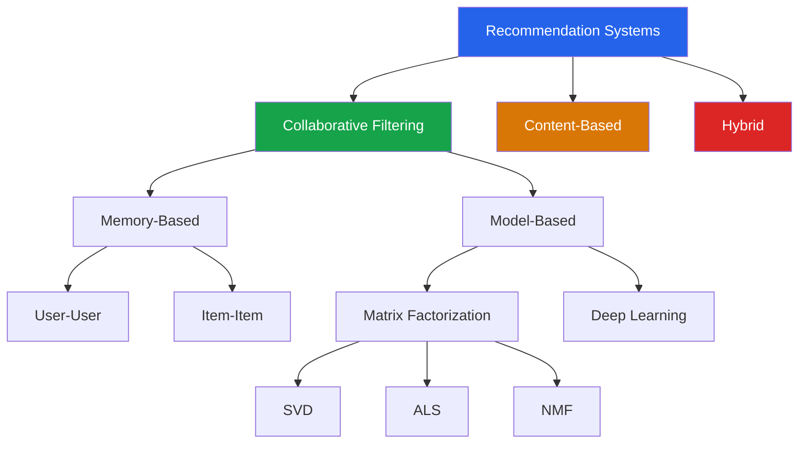

# Recommendation Systems

Recommendation systems power 35% of Amazon's revenue, 80% of Netflix views, and 60% of YouTube watch time. They predict what a user will like based on past behavior, item attributes, or a combination. This page covers the mathematics and implementation of every major approach — from memory-based collaborative filtering to modern matrix factorization.

## Taxonomy



| Approach | Uses | Strengths | Weaknesses |
|----------|------|-----------|------------|
| **Collaborative** | User-item interactions only | No domain knowledge needed | Cold start, sparsity |
| **Content-based** | Item features (genre, text, etc.) | No cold start for items | Limited discovery |
| **Hybrid** | Both | Best of both worlds | Complexity |

---

## The Rating Matrix

The foundation of recommendation is the **user-item rating matrix** $R \in \mathbb{R}^{m \times n}$ where $R_{ui}$ is user $u$'s rating of item $i$. This matrix is extremely sparse — Netflix had ~99% missing entries.

```python
import numpy as np
import pandas as pd

# ---- Load MovieLens 100K ----
# Download from: https://grouplens.org/datasets/movielens/100k/
ratings = pd.read_csv(
    'ml-100k/u.data', sep='\t',
    names=['user_id', 'item_id', 'rating', 'timestamp']
)

movies = pd.read_csv(
    'ml-100k/u.item', sep='|', encoding='latin-1',
    names=['item_id', 'title', 'release_date', 'video_release', 'url',
           'unknown', 'Action', 'Adventure', 'Animation', 'Children',
           'Comedy', 'Crime', 'Documentary', 'Drama', 'Fantasy',
           'FilmNoir', 'Horror', 'Musical', 'Mystery', 'Romance',
           'SciFi', 'Thriller', 'War', 'Western'],
    usecols=range(24)
)

print(f"Ratings: {len(ratings)}")
print(f"Users: {ratings['user_id'].nunique()}")
print(f"Movies: {ratings['item_id'].nunique()}")
print(f"Sparsity: {1 - len(ratings) / (ratings['user_id'].nunique() * ratings['item_id'].nunique()):.4%}")
print(f"\nRating distribution:")
print(ratings['rating'].value_counts().sort_index())

# Create user-item matrix
user_item = ratings.pivot(index='user_id', columns='item_id', values='rating')
print(f"\nUser-item matrix: {user_item.shape}")
print(f"Missing entries: {user_item.isna().sum().sum()} / {user_item.size} "
      f"({user_item.isna().sum().sum() / user_item.size:.1%})")
```

---

## User-User Collaborative Filtering

### Intuition

"Users who agreed in the past will agree in the future." If Alice and Bob both liked Inception and The Matrix, and Alice liked Interstellar, recommend Interstellar to Bob.

### Cosine Similarity

$$\text{sim}(u, v) = \frac{\sum_{i \in I_{uv}} r_{ui} \cdot r_{vi}}{\sqrt{\sum_{i \in I_{uv}} r_{ui}^2} \cdot \sqrt{\sum_{i \in I_{uv}} r_{vi}^2}}$$

where $I_{uv}$ is the set of items rated by both $u$ and $v$.

### Adjusted Cosine (Mean-Centered)

Remove user bias (some users rate everything high):

$$\text{sim}(u, v) = \frac{\sum_{i \in I_{uv}} (r_{ui} - \bar{r}_u)(r_{vi} - \bar{r}_v)}{\sqrt{\sum_{i \in I_{uv}} (r_{ui} - \bar{r}_u)^2} \cdot \sqrt{\sum_{i \in I_{uv}} (r_{vi} - \bar{r}_v)^2}}$$

### Prediction

Predict user $u$'s rating for item $i$ using the $K$ most similar users who rated $i$:

$$\hat{r}_{ui} = \bar{r}_u + \frac{\sum_{v \in N_K(u)} \text{sim}(u, v) \cdot (r_{vi} - \bar{r}_v)}{\sum_{v \in N_K(u)} |\text{sim}(u, v)|}$$

::: details Worked Example — User-User CF Prediction

**Rating matrix (1-5 stars, ? = unknown):**
|       | Movie A | Movie B | Movie C | Movie D |
|-------|---------|---------|---------|---------|
| Alice | 5       | 4       | ?       | 2       |
| Bob   | 3       | 5       | 4       | 1       |
| Carol | 4       | 3       | 5       | 3       |

**Predict Alice's rating for Movie C. K=2 neighbors.**

**Step 1:** Compute user means (on rated items only)
  Alice: (5+4+2)/3 = 3.67
  Bob:   (3+5+4+1)/4 = 3.25
  Carol: (4+3+5+3)/4 = 3.75

**Step 2:** Compute sim(Alice, Bob) using Pearson on common items {A, B, D}
  Alice centered: [5-3.67, 4-3.67, 2-3.67] = [1.33, 0.33, -1.67]
  Bob centered:   [3-3.25, 5-3.25, 1-3.25] = [-0.25, 1.75, -2.25]
  num = 1.33(-0.25) + 0.33(1.75) + (-1.67)(-2.25) = -0.33 + 0.58 + 3.76 = 4.01
  denom = sqrt(1.33^2+0.33^2+1.67^2) * sqrt(0.25^2+1.75^2+2.25^2)
        = sqrt(1.77+0.11+2.79) * sqrt(0.06+3.06+5.06)
        = sqrt(4.67) * sqrt(8.19) = 2.16 * 2.86 = 6.18
  sim(Alice, Bob) = 4.01/6.18 = 0.649

**Step 3:** Compute sim(Alice, Carol) on common items {A, B, D}
  Carol centered: [4-3.75, 3-3.75, 3-3.75] = [0.25, -0.75, -0.75]
  num = 1.33(0.25) + 0.33(-0.75) + (-1.67)(-0.75) = 0.33 - 0.25 + 1.25 = 1.33
  denom = 2.16 * sqrt(0.06+0.56+0.56) = 2.16 * sqrt(1.19) = 2.16*1.09 = 2.35
  sim(Alice, Carol) = 1.33/2.35 = 0.566

**Step 4:** Predict (both neighbors rated Movie C)
  r_hat = 3.67 + [0.649*(4-3.25) + 0.566*(5-3.75)] / (0.649+0.566)
        = 3.67 + [0.649*0.75 + 0.566*1.25] / 1.215
        = 3.67 + [0.487 + 0.708] / 1.215
        = 3.67 + 1.195/1.215 = 3.67 + 0.98 = 4.65

**Interpret:**
  "Alice is predicted to rate Movie C as 4.65 stars. Both similar users rated it above their mean, and the prediction is above Alice's mean (3.67). Bob and Carol both liked Movie C, and since they have similar tastes to Alice, she probably will too."

:::

### From-Scratch Implementation

```python
class UserUserCF:
    """User-User collaborative filtering from scratch."""

    def __init__(self, k_neighbors=30, min_common=3):
        self.k = k_neighbors
        self.min_common = min_common

    def fit(self, ratings_df):
        self.ratings = ratings_df.copy()
        self.user_item = ratings_df.pivot(
            index='user_id', columns='item_id', values='rating'
        )
        self.user_means = self.user_item.mean(axis=1)
        # Mean-center ratings
        self.centered = self.user_item.sub(self.user_means, axis=0)
        self.users = self.user_item.index.tolist()
        self.items = self.user_item.columns.tolist()
        return self

    def _similarity(self, u, v):
        """Pearson correlation between users u and v."""
        common = self.centered.loc[u].notna() & self.centered.loc[v].notna()
        if common.sum() < self.min_common:
            return 0.0

        u_centered = self.centered.loc[u, common]
        v_centered = self.centered.loc[v, common]

        num = (u_centered * v_centered).sum()
        denom = np.sqrt((u_centered ** 2).sum()) * np.sqrt((v_centered ** 2).sum())

        if denom == 0:
            return 0.0
        return num / denom

    def predict(self, user_id, item_id):
        """Predict rating for user_id on item_id."""
        if user_id not in self.users or item_id not in self.items:
            return self.user_means.mean()  # global mean fallback

        # Check if already rated
        if not np.isnan(self.user_item.loc[user_id, item_id]):
            return self.user_item.loc[user_id, item_id]

        # Find users who rated this item
        raters = self.user_item[item_id].dropna().index.tolist()
        if not raters:
            return self.user_means[user_id]

        # Compute similarities
        sims = [(v, self._similarity(user_id, v)) for v in raters if v != user_id]
        sims = [(v, s) for v, s in sims if s > 0]  # positive similarity only
        sims.sort(key=lambda x: -x[1])
        sims = sims[:self.k]  # top K neighbors

        if not sims:
            return self.user_means[user_id]

        # Weighted prediction
        num = sum(s * self.centered.loc[v, item_id] for v, s in sims)
        denom = sum(abs(s) for _, s in sims)

        return self.user_means[user_id] + num / denom

    def recommend(self, user_id, n=10):
        """Recommend top-n items for a user."""
        rated_items = self.user_item.loc[user_id].dropna().index.tolist()
        unrated_items = [i for i in self.items if i not in rated_items]

        predictions = []
        for item_id in unrated_items[:200]:  # limit for speed
            pred = self.predict(user_id, item_id)
            predictions.append((item_id, pred))

        predictions.sort(key=lambda x: -x[1])
        return predictions[:n]


# ---- Evaluate ----
from sklearn.model_selection import train_test_split

train_df, test_df = train_test_split(ratings, test_size=0.2, random_state=42)

cf = UserUserCF(k_neighbors=30, min_common=3)
cf.fit(train_df)

# Predict on test set (sample for speed)
test_sample = test_df.sample(500, random_state=42)
predictions = []
actuals = []

for _, row in test_sample.iterrows():
    pred = cf.predict(row['user_id'], row['item_id'])
    predictions.append(pred)
    actuals.append(row['rating'])

predictions = np.array(predictions)
actuals = np.array(actuals)

rmse = np.sqrt(np.mean((predictions - actuals) ** 2))
mae = np.mean(np.abs(predictions - actuals))
print(f"User-User CF — RMSE: {rmse:.4f}, MAE: {mae:.4f}")

# Show recommendations for user 1
recs = cf.recommend(user_id=1, n=10)
print("\nTop 10 recommendations for User 1:")
for item_id, pred_rating in recs:
    title = movies[movies['item_id'] == item_id]['title'].values[0]
    print(f"  {title}: predicted {pred_rating:.2f}")
```

---

## Item-Item Collaborative Filtering

### Why Item-Item?

Amazon popularized item-item CF because item similarities are more **stable** than user similarities (items do not change, but user preferences evolve).

$$\text{sim}(i, j) = \frac{\sum_{u \in U_{ij}} (r_{ui} - \bar{r}_i)(r_{uj} - \bar{r}_j)}{\sqrt{\sum_{u \in U_{ij}} (r_{ui} - \bar{r}_i)^2} \cdot \sqrt{\sum_{u \in U_{ij}} (r_{uj} - \bar{r}_j)^2}}$$

Note: for item-item, we center by **item mean** (adjusted cosine).

$$\hat{r}_{ui} = \frac{\sum_{j \in N_K(i)} \text{sim}(i, j) \cdot r_{uj}}{\sum_{j \in N_K(i)} |\text{sim}(i, j)|}$$

```python
class ItemItemCF:
    """Item-Item collaborative filtering."""

    def __init__(self, k_neighbors=20, min_common=5):
        self.k = k_neighbors
        self.min_common = min_common

    def fit(self, ratings_df):
        self.user_item = ratings_df.pivot(
            index='user_id', columns='item_id', values='rating'
        )
        # Center by user mean (adjusted cosine for item similarity)
        self.user_means = self.user_item.mean(axis=1)
        self.centered = self.user_item.sub(self.user_means, axis=0)

        # Precompute item similarity matrix (for common items)
        self.item_ids = self.user_item.columns.tolist()
        return self

    def _item_similarity(self, i, j):
        """Adjusted cosine similarity between items."""
        common = self.centered[i].notna() & self.centered[j].notna()
        if common.sum() < self.min_common:
            return 0.0

        i_vals = self.centered.loc[common, i]
        j_vals = self.centered.loc[common, j]

        num = (i_vals * j_vals).sum()
        denom = np.sqrt((i_vals ** 2).sum()) * np.sqrt((j_vals ** 2).sum())

        return num / denom if denom > 0 else 0.0

    def predict(self, user_id, item_id):
        if user_id not in self.user_item.index:
            return 3.5

        # Items rated by this user
        rated = self.user_item.loc[user_id].dropna()
        if len(rated) == 0:
            return 3.5

        # Compute similarities between target item and rated items
        sims = []
        for rated_item in rated.index:
            if rated_item != item_id:
                sim = self._item_similarity(item_id, rated_item)
                if sim > 0:
                    sims.append((rated_item, sim))

        sims.sort(key=lambda x: -x[1])
        sims = sims[:self.k]

        if not sims:
            return self.user_means.get(user_id, 3.5)

        num = sum(s * rated[j] for j, s in sims)
        denom = sum(abs(s) for _, s in sims)
        return num / denom


ii_cf = ItemItemCF(k_neighbors=20, min_common=5)
ii_cf.fit(train_df)

# Evaluate
predictions_ii = []
for _, row in test_sample.iterrows():
    pred = ii_cf.predict(row['user_id'], row['item_id'])
    predictions_ii.append(pred)

rmse_ii = np.sqrt(np.mean((np.array(predictions_ii) - actuals) ** 2))
print(f"Item-Item CF — RMSE: {rmse_ii:.4f}")
```

---

## Matrix Factorization (SVD)

### Intuition

Decompose the rating matrix into latent factors:

$$\hat{R} = P \cdot Q^T$$

where $P \in \mathbb{R}^{m \times k}$ (user factors) and $Q \in \mathbb{R}^{n \times k}$ (item factors). Each user and item is represented by a $k$-dimensional vector in latent space.

### With Biases (Koren, 2009)

$$\hat{r}_{ui} = \mu + b_u + b_i + p_u^T q_i$$

::: details Worked Example — SVD Matrix Factorization Prediction

**Suppose k=2 latent factors. Trained parameters:**
- mu (global mean) = 3.5
- b_Alice = +0.3 (Alice rates slightly above average)
- b_MovieC = +0.5 (Movie C is generally well-liked)
- p_Alice = [0.8, -0.2] (Alice's latent preferences)
- q_MovieC = [0.6, 0.4] (Movie C's latent attributes)

**Step 1:** Compute interaction term
  p_Alice^T * q_MovieC = 0.8(0.6) + (-0.2)(0.4) = 0.48 - 0.08 = 0.40

**Step 2:** Compute predicted rating
  r_hat = 3.5 + 0.3 + 0.5 + 0.40 = 4.70

**Step 3:** Decompose the prediction
  Global mean:     3.50 (average movie gets this)
  User bias:      +0.30 (Alice tends to rate higher)
  Item bias:      +0.50 (Movie C is generally liked)
  Interaction:    +0.40 (Alice's taste matches this movie's profile)
  Total:           4.70

**Interpret:**
  "The predicted rating of 4.70 comes from four sources. Even without the interaction term, Movie C would get 4.30 from Alice (3.5+0.3+0.5). The latent factor interaction adds another 0.40, suggesting Alice's taste aligns well with what Movie C offers."

:::

where:
- $\mu$ = global mean
- $b_u$ = user bias (does this user rate high/low?)
- $b_i$ = item bias (is this item generally liked/disliked?)
- $p_u^T q_i$ = interaction in latent space

### Optimization via SGD

Minimize regularized squared error on observed ratings:

$$\min_{p, q, b} \sum_{(u,i) \in \mathcal{K}} \left(r_{ui} - \mu - b_u - b_i - p_u^T q_i\right)^2 + \lambda\left(\|p_u\|^2 + \|q_i\|^2 + b_u^2 + b_i^2\right)$$

SGD updates:

$$e_{ui} = r_{ui} - \hat{r}_{ui}$$

$$b_u \leftarrow b_u + \eta(e_{ui} - \lambda b_u)$$

$$b_i \leftarrow b_i + \eta(e_{ui} - \lambda b_i)$$

$$p_u \leftarrow p_u + \eta(e_{ui} q_i - \lambda p_u)$$

$$q_i \leftarrow q_i + \eta(e_{ui} p_u - \lambda q_i)$$

### From Scratch SVD

```python
class SVDFromScratch:
    """Matrix factorization with biases via SGD."""

    def __init__(self, n_factors=50, n_epochs=20, lr=0.005,
                 reg=0.02, random_state=42):
        self.n_factors = n_factors
        self.n_epochs = n_epochs
        self.lr = lr
        self.reg = reg
        self.rng = np.random.RandomState(random_state)

    def fit(self, ratings_df):
        users = ratings_df['user_id'].unique()
        items = ratings_df['item_id'].unique()

        self.user_map = {u: i for i, u in enumerate(users)}
        self.item_map = {i: j for j, i in enumerate(items)}

        n_users = len(users)
        n_items = len(items)

        # Global mean
        self.mu = ratings_df['rating'].mean()

        # Initialize
        self.bu = np.zeros(n_users)
        self.bi = np.zeros(n_items)
        self.P = self.rng.normal(0, 0.1, (n_users, self.n_factors))
        self.Q = self.rng.normal(0, 0.1, (n_items, self.n_factors))

        # SGD
        self.train_losses = []
        for epoch in range(self.n_epochs):
            # Shuffle
            shuffled = ratings_df.sample(frac=1, random_state=epoch)
            total_loss = 0

            for _, row in shuffled.iterrows():
                u = self.user_map[row['user_id']]
                i = self.item_map[row['item_id']]
                r = row['rating']

                # Prediction
                pred = self.mu + self.bu[u] + self.bi[i] + self.P[u] @ self.Q[i]
                err = r - pred

                # Update biases
                self.bu[u] += self.lr * (err - self.reg * self.bu[u])
                self.bi[i] += self.lr * (err - self.reg * self.bi[i])

                # Update factors
                P_old = self.P[u].copy()
                self.P[u] += self.lr * (err * self.Q[i] - self.reg * self.P[u])
                self.Q[i] += self.lr * (err * P_old - self.reg * self.Q[i])

                total_loss += err ** 2

            rmse = np.sqrt(total_loss / len(shuffled))
            self.train_losses.append(rmse)
            if epoch % 5 == 0:
                print(f"Epoch {epoch}: RMSE = {rmse:.4f}")

        return self

    def predict(self, user_id, item_id):
        if user_id not in self.user_map or item_id not in self.item_map:
            return self.mu

        u = self.user_map[user_id]
        i = self.item_map[item_id]
        pred = self.mu + self.bu[u] + self.bi[i] + self.P[u] @ self.Q[i]
        return np.clip(pred, 1, 5)

    def recommend(self, user_id, n=10, exclude_rated=True):
        if user_id not in self.user_map:
            return []

        u = self.user_map[user_id]
        scores = self.mu + self.bu[u] + self.bi + self.P[u] @ self.Q.T
        scores = np.clip(scores, 1, 5)

        ranked = np.argsort(scores)[::-1]
        inv_item_map = {v: k for k, v in self.item_map.items()}

        recs = []
        for idx in ranked:
            item_id = inv_item_map[idx]
            recs.append((item_id, scores[idx]))
            if len(recs) == n:
                break

        return recs


# ---- Train and Evaluate ----
svd = SVDFromScratch(n_factors=50, n_epochs=25, lr=0.005, reg=0.02)
svd.fit(train_df)

# Evaluate
predictions_svd = []
for _, row in test_sample.iterrows():
    pred = svd.predict(row['user_id'], row['item_id'])
    predictions_svd.append(pred)

rmse_svd = np.sqrt(np.mean((np.array(predictions_svd) - actuals) ** 2))
print(f"\nSVD (from scratch) — RMSE: {rmse_svd:.4f}")
```

### Surprise Library

```python
from surprise import SVD, Dataset, Reader, accuracy
from surprise.model_selection import cross_validate

reader = Reader(rating_scale=(1, 5))
data = Dataset.load_from_df(ratings[['user_id', 'item_id', 'rating']], reader)

algo = SVD(n_factors=50, n_epochs=20, lr_all=0.005, reg_all=0.02, random_state=42)
results = cross_validate(algo, data, measures=['RMSE', 'MAE'], cv=5, verbose=True)

print(f"\nSurprise SVD — RMSE: {results['test_rmse'].mean():.4f}, "
      f"MAE: {results['test_mae'].mean():.4f}")
```

---

## Content-Based Filtering

Uses item features (genre, description, actors) to recommend similar items:

```python
from sklearn.feature_extraction.text import TfidfVectorizer
from sklearn.metrics.pairwise import cosine_similarity

# Movie genre vectors
genre_cols = ['Action', 'Adventure', 'Animation', 'Children', 'Comedy',
              'Crime', 'Documentary', 'Drama', 'Fantasy', 'FilmNoir',
              'Horror', 'Musical', 'Mystery', 'Romance', 'SciFi',
              'Thriller', 'War', 'Western']

genre_matrix = movies[genre_cols].values

# Compute item similarity based on genres
item_sim = cosine_similarity(genre_matrix)
print(f"Item similarity matrix: {item_sim.shape}")

def content_recommend(movie_title, n=10):
    """Recommend movies similar to a given movie based on genre."""
    idx = movies[movies['title'].str.contains(movie_title, case=False)].index
    if len(idx) == 0:
        return []

    idx = idx[0]
    sim_scores = list(enumerate(item_sim[idx]))
    sim_scores.sort(key=lambda x: -x[1])
    sim_scores = sim_scores[1:n+1]  # exclude itself

    results = []
    for i, score in sim_scores:
        results.append((movies.iloc[i]['title'], score))
    return results

print("Movies similar to 'Toy Story':")
for title, sim in content_recommend('Toy Story'):
    print(f"  {title}: similarity = {sim:.3f}")
```

---

## The Cold Start Problem

| Problem | Description | Solutions |
|---------|-------------|----------|
| **New user** | No interaction history | Ask for preferences, demographics, popularity-based |
| **New item** | No ratings received | Content-based, metadata features |
| **New system** | No data at all | Import external data, use content-based |

```python
def hybrid_predict(user_id, item_id, cf_model, content_sim, ratings_df,
                   alpha=0.7):
    """Hybrid: blend collaborative and content-based predictions."""
    # Collaborative prediction
    cf_pred = cf_model.predict(user_id, item_id)

    # Content-based: average rating of similar items rated by user
    user_ratings = ratings_df[ratings_df['user_id'] == user_id]
    if len(user_ratings) == 0:
        return cf_pred

    item_idx = item_id - 1  # 0-indexed
    cb_scores = []
    for _, row in user_ratings.iterrows():
        rated_idx = int(row['item_id']) - 1
        if rated_idx < content_sim.shape[0] and item_idx < content_sim.shape[0]:
            sim = content_sim[item_idx, rated_idx]
            if sim > 0.3:
                cb_scores.append(row['rating'] * sim)

    if cb_scores:
        cb_pred = np.mean(cb_scores)
        return alpha * cf_pred + (1 - alpha) * cb_pred
    else:
        return cf_pred
```

---

## Evaluation Metrics

### Rating Prediction

| Metric | Formula | Interpretation |
|--------|---------|---------------|
| **RMSE** | $\sqrt{\frac{1}{n}\sum(r_{ui} - \hat{r}_{ui})^2}$ | Penalizes large errors more |
| **MAE** | $\frac{1}{n}\sum\|r_{ui} - \hat{r}_{ui}\|$ | Average absolute error |

### Ranking Quality

| Metric | Formula | Interpretation |
|--------|---------|---------------|
| **Precision@K** | $\frac{\text{relevant in top-K}}{K}$ | How many recs are relevant? |
| **Recall@K** | $\frac{\text{relevant in top-K}}{\text{total relevant}}$ | How many relevant items found? |
| **MAP** | Mean of AP across users | Overall ranking quality |
| **NDCG@K** | $\frac{DCG@K}{IDCG@K}$ | Accounts for position of relevant items |

```python
def precision_at_k(recommended, relevant, k):
    """Precision@K: fraction of top-K that are relevant."""
    rec_at_k = set(recommended[:k])
    return len(rec_at_k & set(relevant)) / k

def ndcg_at_k(recommended, relevant, k):
    """Normalized Discounted Cumulative Gain."""
    dcg = sum(
        1 / np.log2(i + 2) for i, item in enumerate(recommended[:k])
        if item in relevant
    )
    idcg = sum(1 / np.log2(i + 2) for i in range(min(len(relevant), k)))
    return dcg / idcg if idcg > 0 else 0
```

::: details Worked Example — Precision@K and NDCG@5

**Recommended list of 5 movies: [A, B, C, D, E]. Relevant movies: {A, C, D, F}.**

**Precision@5:**
  Relevant in top-5: {A, C, D} = 3 items
  Precision@5 = 3/5 = 0.60

**NDCG@5:**

**Step 1:** DCG (Discounted Cumulative Gain)
  Position 1 (A): relevant -> 1/log2(2) = 1/1.0 = 1.000
  Position 2 (B): not relevant -> 0
  Position 3 (C): relevant -> 1/log2(4) = 1/2.0 = 0.500
  Position 4 (D): relevant -> 1/log2(5) = 1/2.322 = 0.431
  Position 5 (E): not relevant -> 0
  DCG = 1.000 + 0 + 0.500 + 0.431 + 0 = 1.931

**Step 2:** IDCG (Ideal DCG — if all relevant items were at the top)
  Ideal ranking: 3 relevant items in positions 1, 2, 3
  IDCG = 1/log2(2) + 1/log2(3) + 1/log2(4)
       = 1.000 + 0.631 + 0.500 = 2.131

**Step 3:** NDCG@5 = DCG/IDCG = 1.931/2.131 = 0.906

**Interpret:**
  "NDCG = 0.906 is high because the relevant movies are mostly near the top (positions 1, 3, 4). If movie C and D were at positions 4 and 5 instead, DCG would drop. NDCG penalizes relevant items appearing lower in the list."

:::

---

## Key Takeaways

| Concept | Remember |
|---------|----------|
| Collaborative filtering uses user behavior only | No feature engineering needed |
| User-user: find similar users | Similarity based on rating overlap |
| Item-item: find similar items | More stable, used by Amazon |
| Matrix factorization decomposes $R \approx PQ^T$ | Latent factors capture preferences |
| SVD with biases captures user/item tendencies | $\hat{r} = \mu + b_u + b_i + p_u^T q_i$ |
| Content-based uses item features | Solves item cold start |
| Hybrid combines CF and content | Best practical approach |
| Always evaluate with ranking metrics | RMSE alone is insufficient |
| Cold start requires fallback strategies | Popularity, content, or explicit preferences |
