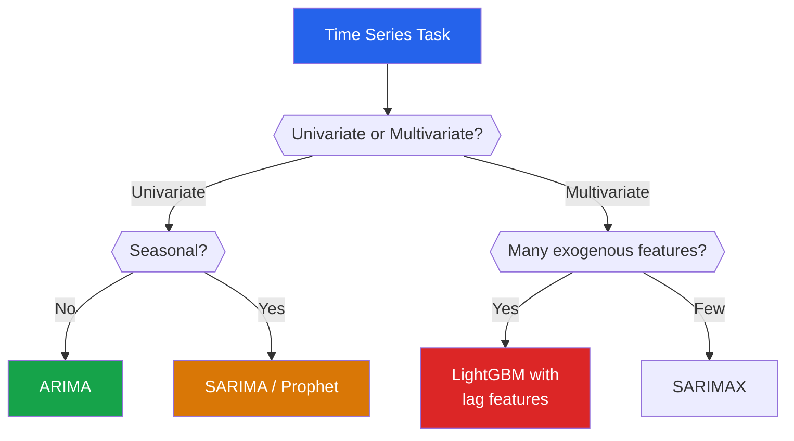

# Time Series Machine Learning

Time series data has a natural ordering — today depends on yesterday. This temporal dependency violates the i.i.d. assumption of most ML algorithms and requires specialized techniques for feature engineering, model selection, and evaluation. From forecasting stock prices to predicting server load, time series ML is one of the most practically important areas of machine learning.

## Why Time Series Is Different

| Standard ML | Time Series ML |
|------------|---------------|
| Samples are independent | Samples are temporally dependent |
| Random train/test split | Must split chronologically |
| Features are given | Must engineer lag/window features |
| One prediction per sample | Multi-step forecasting |
| Cross-validation with random folds | Walk-forward or expanding window |

---

## Key Concepts

### Stationarity

A time series is **stationary** if its statistical properties (mean, variance, autocorrelation) do not change over time. Most models require stationarity.

**Augmented Dickey-Fuller test**: Tests the null hypothesis that a unit root is present (non-stationary).

$$\Delta y_t = \alpha + \beta t + \gamma y_{t-1} + \sum_{i=1}^{p} \delta_i \Delta y_{t-i} + \epsilon_t$$

$H_0: \gamma = 0$ (unit root, non-stationary). Reject if $p < 0.05$.

### Differencing

Make a series stationary by subtracting the previous value:

$$y'_t = y_t - y_{t-1} \quad \text{(first difference)}$$

$$y''_t = y'_t - y'_{t-1} \quad \text{(second difference)}$$

### Autocorrelation

**ACF (Autocorrelation Function)**: Correlation between $y_t$ and $y_{t-k}$ at lag $k$:

$$\rho_k = \frac{\text{Cov}(y_t, y_{t-k})}{\text{Var}(y_t)} = \frac{\sum_{t=k+1}^{n}(y_t - \bar{y})(y_{t-k} - \bar{y})}{\sum_{t=1}^{n}(y_t - \bar{y})^2}$$

::: details Worked Example — Autocorrelation at Lag 1

**Time series: y = [2, 4, 6, 3, 5, 7]**

**Step 1:** Compute mean
  y_bar = (2+4+6+3+5+7)/6 = 27/6 = 4.5

**Step 2:** Compute Var(y) (denominator)
  = (2-4.5)^2 + (4-4.5)^2 + (6-4.5)^2 + (3-4.5)^2 + (5-4.5)^2 + (7-4.5)^2
  = 6.25 + 0.25 + 2.25 + 2.25 + 0.25 + 6.25 = 17.5

**Step 3:** Compute Cov(y_t, y_{t-1}) for lag k=1 (numerator)
  t=2: (4-4.5)(2-4.5) = (-0.5)(-2.5) = 1.25
  t=3: (6-4.5)(4-4.5) = (1.5)(-0.5) = -0.75
  t=4: (3-4.5)(6-4.5) = (-1.5)(1.5) = -2.25
  t=5: (5-4.5)(3-4.5) = (0.5)(-1.5) = -0.75
  t=6: (7-4.5)(5-4.5) = (2.5)(0.5) = 1.25
  Sum = 1.25 - 0.75 - 2.25 - 0.75 + 1.25 = -1.25

**Step 4:** Compute autocorrelation
  rho_1 = -1.25 / 17.5 = -0.071

**Interpret:**
  "The lag-1 autocorrelation is -0.071, very close to zero. This suggests consecutive values have almost no linear relationship — the series alternates somewhat randomly. A strong positive rho_1 (near 1) would indicate a smooth trend."

:::

**PACF (Partial ACF)**: Correlation between $y_t$ and $y_{t-k}$ after removing the effect of intermediate lags.

```python
import numpy as np
import pandas as pd
import matplotlib.pyplot as plt
from statsmodels.tsa.stattools import adfuller, acf, pacf
from statsmodels.graphics.tsaplots import plot_acf, plot_pacf

# ---- Air Passengers dataset ----
url = 'https://raw.githubusercontent.com/jbrownlee/Datasets/master/airline-passengers.csv'
df = pd.read_csv(url, parse_dates=['Month'], index_col='Month')
df.columns = ['passengers']

print(f"Shape: {df.shape}")
print(f"Date range: {df.index.min()} to {df.index.max()}")

# Stationarity test
result = adfuller(df['passengers'])
print(f"\nADF Statistic: {result[0]:.4f}")
print(f"p-value: {result[1]:.4f}")
print("Stationary" if result[1] < 0.05 else "Non-stationary")

# Differencing to achieve stationarity
df['diff1'] = df['passengers'].diff()
df['diff1_log'] = np.log(df['passengers']).diff()

result_diff = adfuller(df['diff1_log'].dropna())
print(f"\nAfter log + diff: ADF p-value = {result_diff[1]:.4f}")

# ACF and PACF plots
fig, axes = plt.subplots(2, 2, figsize=(14, 10))
axes[0, 0].plot(df['passengers'])
axes[0, 0].set_title('Original Series')

axes[0, 1].plot(df['diff1_log'].dropna())
axes[0, 1].set_title('Log-Differenced (Stationary)')

plot_acf(df['diff1_log'].dropna(), ax=axes[1, 0], lags=24)
axes[1, 0].set_title('ACF')

plot_pacf(df['diff1_log'].dropna(), ax=axes[1, 1], lags=24)
axes[1, 1].set_title('PACF')

plt.tight_layout()
plt.savefig('time_series_stationarity.png', dpi=150, bbox_inches='tight')
plt.show()
```

---

## ARIMA: AutoRegressive Integrated Moving Average

### Components

**AR(p)**: Autoregressive — prediction depends on $p$ previous values:

$$y_t = c + \phi_1 y_{t-1} + \phi_2 y_{t-2} + \cdots + \phi_p y_{t-p} + \epsilon_t$$

::: details Worked Example — AR(2) Prediction

**AR(2) model: y_t = 10 + 0.6*y_{t-1} + 0.2*y_{t-2} + epsilon**

**Given: y_5 = 50, y_4 = 45**

**Step 1:** Predict y_6 (ignoring noise epsilon)
  y_6 = 10 + 0.6(50) + 0.2(45) = 10 + 30 + 9 = 49

**Step 2:** Predict y_7 (using y_6=49 and y_5=50)
  y_7 = 10 + 0.6(49) + 0.2(50) = 10 + 29.4 + 10 = 49.4

**Step 3:** Long-run mean (stationary mean)
  E[y] = c / (1 - phi1 - phi2) = 10 / (1 - 0.6 - 0.2) = 10/0.2 = 50

**Interpret:**
  "The AR(2) model predicts values near 49-50, which is close to the long-run mean of 50. The coefficients phi1=0.6 and phi2=0.2 sum to 0.8 (< 1), confirming stationarity."

:::

**I(d)**: Integrated — number of differences needed for stationarity

**MA(q)**: Moving Average — prediction depends on $q$ previous error terms:

$$y_t = c + \epsilon_t + \theta_1 \epsilon_{t-1} + \theta_2 \epsilon_{t-2} + \cdots + \theta_q \epsilon_{t-q}$$

### ARIMA(p,d,q) Full Model

$$\Delta^d y_t = c + \sum_{i=1}^{p}\phi_i \Delta^d y_{t-i} + \epsilon_t + \sum_{j=1}^{q}\theta_j \epsilon_{t-j}$$

Using the backshift operator $B$ where $By_t = y_{t-1}$:

$$\phi(B)(1-B)^d y_t = c + \theta(B)\epsilon_t$$

where $\phi(B) = 1 - \phi_1 B - \cdots - \phi_p B^p$ and $\theta(B) = 1 + \theta_1 B + \cdots + \theta_q B^q$.

### Selecting (p, d, q)

| Parameter | How to Choose | From |
|-----------|--------------|------|
| $d$ | Number of differences until stationary | ADF test |
| $p$ | Last significant lag in PACF | PACF plot |
| $q$ | Last significant lag in ACF | ACF plot |

Or use **auto_arima** which minimizes AIC:

```python
from statsmodels.tsa.arima.model import ARIMA
import pmdarima as pm

# Automatic ARIMA selection
auto_model = pm.auto_arima(
    df['passengers'],
    seasonal=False,
    stepwise=True,
    suppress_warnings=True,
    trace=True
)
print(f"\nBest ARIMA: {auto_model.order}")
print(f"AIC: {auto_model.aic():.2f}")

# Manual ARIMA
model = ARIMA(df['passengers'], order=(2, 1, 1))
results = model.fit()
print(results.summary())

# Forecast
forecast = results.get_forecast(steps=24)
forecast_mean = forecast.predicted_mean
forecast_ci = forecast.conf_int()

plt.figure(figsize=(12, 6))
plt.plot(df.index, df['passengers'], label='Observed')
plt.plot(forecast_mean.index, forecast_mean, 'r-', label='Forecast')
plt.fill_between(forecast_ci.index,
                  forecast_ci.iloc[:, 0],
                  forecast_ci.iloc[:, 1],
                  alpha=0.2, color='red')
plt.legend()
plt.title('ARIMA Forecast — Air Passengers')
plt.savefig('arima_forecast.png', dpi=150, bbox_inches='tight')
plt.show()
```

---

## SARIMA: Seasonal ARIMA

### Model

SARIMA$(p,d,q)(P,D,Q)_m$ adds seasonal components with period $m$:

$$\phi(B)\Phi(B^m)(1-B)^d(1-B^m)^D y_t = c + \theta(B)\Theta(B^m)\epsilon_t$$

| Symbol | Meaning | Air Passengers Example |
|--------|---------|----------------------|
| $(p,d,q)$ | Non-seasonal ARIMA | (1,1,1) |
| $(P,D,Q)_m$ | Seasonal ARIMA | (1,1,1)$_{12}$ |
| $m$ | Seasonal period | 12 (monthly data) |

```python
from statsmodels.tsa.statespace.sarimax import SARIMAX

# Auto SARIMA
auto_seasonal = pm.auto_arima(
    df['passengers'],
    seasonal=True,
    m=12,          # monthly seasonality
    stepwise=True,
    suppress_warnings=True,
    trace=True
)
print(f"\nBest SARIMA: {auto_seasonal.order} x {auto_seasonal.seasonal_order}")

# Fit SARIMA
sarima = SARIMAX(df['passengers'],
                  order=(1, 1, 1),
                  seasonal_order=(1, 1, 1, 12))
sarima_results = sarima.fit(disp=False)
print(sarima_results.summary())

# Forecast with seasonal patterns
forecast_s = sarima_results.get_forecast(steps=36)
forecast_s_mean = forecast_s.predicted_mean
forecast_s_ci = forecast_s.conf_int()

plt.figure(figsize=(14, 6))
plt.plot(df.index, df['passengers'], label='Observed')
plt.plot(forecast_s_mean.index, forecast_s_mean, 'r-', label='SARIMA Forecast')
plt.fill_between(forecast_s_ci.index,
                  forecast_s_ci.iloc[:, 0],
                  forecast_s_ci.iloc[:, 1],
                  alpha=0.2, color='red')
plt.legend()
plt.title('SARIMA(1,1,1)(1,1,1)₁₂ Forecast — Air Passengers')
plt.savefig('sarima_forecast.png', dpi=150, bbox_inches='tight')
plt.show()
```

---

## Feature Engineering for Time Series

### Lag Features

Transform a time series into a supervised learning problem:

```python
def create_lag_features(df, target_col, lags, window_sizes=None):
    """Create lag features and rolling statistics."""
    result = df.copy()

    # Lag features: y_{t-1}, y_{t-2}, ...
    for lag in lags:
        result[f'{target_col}_lag_{lag}'] = result[target_col].shift(lag)

    # Rolling window statistics
    if window_sizes:
        for window in window_sizes:
            result[f'{target_col}_rolling_mean_{window}'] = (
                result[target_col].shift(1).rolling(window=window).mean()
            )
            result[f'{target_col}_rolling_std_{window}'] = (
                result[target_col].shift(1).rolling(window=window).std()
            )
            result[f'{target_col}_rolling_min_{window}'] = (
                result[target_col].shift(1).rolling(window=window).min()
            )
            result[f'{target_col}_rolling_max_{window}'] = (
                result[target_col].shift(1).rolling(window=window).max()
            )

    # Expanding features
    result[f'{target_col}_expanding_mean'] = (
        result[target_col].shift(1).expanding().mean()
    )

    # Difference features
    result[f'{target_col}_diff_1'] = result[target_col].diff(1)
    result[f'{target_col}_diff_12'] = result[target_col].diff(12)  # seasonal

    # Percentage change
    result[f'{target_col}_pct_change'] = result[target_col].pct_change()

    return result

# Apply to Air Passengers
df_feat = create_lag_features(
    df[['passengers']],
    target_col='passengers',
    lags=[1, 2, 3, 6, 12],
    window_sizes=[3, 6, 12]
)

# Calendar features
df_feat['month'] = df_feat.index.month
df_feat['quarter'] = df_feat.index.quarter
df_feat['year'] = df_feat.index.year

# Cyclical encoding for month
df_feat['month_sin'] = np.sin(2 * np.pi * df_feat['month'] / 12)
df_feat['month_cos'] = np.cos(2 * np.pi * df_feat['month'] / 12)

# Drop rows with NaN from lagging
df_feat = df_feat.dropna()
print(f"Features created: {df_feat.shape[1]}")
print(list(df_feat.columns))
```

---

## Tree-Based Time Series Forecasting

### Advantages Over ARIMA

| Aspect | ARIMA | Tree-Based |
|--------|-------|-----------|
| **Exogenous features** | Limited (SARIMAX) | Handles any number naturally |
| **Non-linear patterns** | Linear model | Captures non-linearity |
| **Multiple seasonalities** | One seasonal period | Multiple via feature engineering |
| **Missing data** | Requires complete series | Handles missing values |
| **Interpretability** | Parameters are abstract | Feature importance available |

```python
from sklearn.ensemble import GradientBoostingRegressor
from sklearn.model_selection import TimeSeriesSplit
from sklearn.metrics import mean_absolute_error, mean_squared_error
import numpy as np

# Prepare data
target = 'passengers'
feature_cols = [c for c in df_feat.columns if c != target]
X = df_feat[feature_cols].values
y = df_feat[target].values

# Temporal train/test split
split_point = int(len(X) * 0.8)
X_train, X_test = X[:split_point], X[split_point:]
y_train, y_test = y[:split_point], y[split_point:]

# Train Gradient Boosting
gb = GradientBoostingRegressor(
    n_estimators=200,
    max_depth=4,
    learning_rate=0.1,
    random_state=42
)
gb.fit(X_train, y_train)

y_pred = gb.predict(X_test)
mae = mean_absolute_error(y_test, y_pred)
rmse = np.sqrt(mean_squared_error(y_test, y_pred))
print(f"GBM - MAE: {mae:.2f}, RMSE: {rmse:.2f}")

# Feature importance
importance = pd.Series(gb.feature_importances_, index=feature_cols)
importance.nlargest(10).plot(kind='barh', figsize=(10, 5))
plt.title('Top 10 Feature Importances')
plt.tight_layout()
plt.savefig('ts_feature_importance.png', dpi=150, bbox_inches='tight')
plt.show()
```

### Temporal Cross-Validation

```python
from sklearn.model_selection import TimeSeriesSplit

tscv = TimeSeriesSplit(n_splits=5)
scores = []

for fold, (train_idx, test_idx) in enumerate(tscv.split(X)):
    gb_cv = GradientBoostingRegressor(
        n_estimators=200, max_depth=4, learning_rate=0.1, random_state=42
    )
    gb_cv.fit(X[train_idx], y[train_idx])
    y_pred_cv = gb_cv.predict(X[test_idx])

    mae = mean_absolute_error(y[test_idx], y_pred_cv)
    scores.append(mae)
    print(f"Fold {fold+1}: MAE = {mae:.2f} "
          f"(train: {len(train_idx)}, test: {len(test_idx)})")

print(f"\nMean MAE: {np.mean(scores):.2f} +/- {np.std(scores):.2f}")
```

---

## Prophet

Facebook's Prophet (2017) is designed for business time series with:
- Strong seasonal effects
- Holiday effects
- Missing data and outliers
- Trend changes

### Model

$$y(t) = g(t) + s(t) + h(t) + \epsilon_t$$

where:
- $g(t)$ = **trend** (piecewise linear or logistic growth)
- $s(t)$ = **seasonality** (Fourier series)
- $h(t)$ = **holiday** effects
- $\epsilon_t$ = noise

Seasonality via Fourier series with period $P$:

$$s(t) = \sum_{n=1}^{N}\left(a_n \cos\frac{2\pi nt}{P} + b_n \sin\frac{2\pi nt}{P}\right)$$

```python
from prophet import Prophet

# Prepare data for Prophet (requires 'ds' and 'y' columns)
df_prophet = df.reset_index()
df_prophet.columns = ['ds', 'y']

# Fit Prophet
model = Prophet(
    yearly_seasonality=True,
    weekly_seasonality=False,     # monthly data, no weekly
    daily_seasonality=False,
    changepoint_prior_scale=0.05, # flexibility of trend changes
    seasonality_prior_scale=10,   # flexibility of seasonality
)
model.fit(df_prophet)

# Forecast
future = model.make_future_dataframe(periods=36, freq='MS')
forecast = model.predict(future)

# Plot
fig1 = model.plot(forecast)
plt.title('Prophet Forecast — Air Passengers')
plt.savefig('prophet_forecast.png', dpi=150, bbox_inches='tight')
plt.show()

fig2 = model.plot_components(forecast)
plt.savefig('prophet_components.png', dpi=150, bbox_inches='tight')
plt.show()

# Cross-validation
from prophet.diagnostics import cross_validation, performance_metrics

df_cv = cross_validation(model, initial='730 days', period='180 days',
                          horizon='365 days')
metrics = performance_metrics(df_cv)
print("\nProphet CV Metrics:")
print(metrics[['horizon', 'mape', 'rmse', 'mae']].tail())
```

---

## Multi-Step Forecasting Strategies

### Direct Strategy

Train a separate model for each horizon:

```python
# Model 1: predict y_{t+1}
# Model 2: predict y_{t+2}
# Model 3: predict y_{t+3}

def direct_forecast(X_train, y_series, horizons, model_class, **kwargs):
    """Train separate models for each forecast horizon."""
    models = {}
    for h in horizons:
        y_h = y_series.shift(-h).dropna()
        X_h = X_train[:len(y_h)]
        y_h = y_h.values

        model = model_class(**kwargs)
        model.fit(X_h, y_h)
        models[h] = model

    return models
```

### Recursive Strategy

Use the model's own predictions as input for the next step:

```python
def recursive_forecast(model, X_last, n_steps, lag_positions):
    """Recursively forecast n_steps ahead."""
    predictions = []
    current_features = X_last.copy()

    for step in range(n_steps):
        pred = model.predict(current_features.reshape(1, -1))[0]
        predictions.append(pred)

        # Shift lag features
        current_features = np.roll(current_features, 1)
        current_features[0] = pred  # newest prediction becomes lag_1

    return np.array(predictions)
```

| Strategy | Pros | Cons |
|----------|------|------|
| **Direct** | No error accumulation | Inconsistent across horizons, more models |
| **Recursive** | Single model, consistent | Error accumulates over steps |
| **DirRec** | Combines both | Complex, many models |

---

## Stock Price Example

```python
import yfinance as yf

# Download stock data
ticker = 'AAPL'
stock = yf.download(ticker, start='2020-01-01', end='2024-12-31')
stock = stock[['Close']].copy()
stock.columns = ['close']

print(f"Stock data: {stock.shape}")
print(stock.head())

# Feature engineering
stock['return_1d'] = stock['close'].pct_change()
stock['return_5d'] = stock['close'].pct_change(5)
stock['return_20d'] = stock['close'].pct_change(20)

for lag in [1, 2, 3, 5, 10, 20]:
    stock[f'close_lag_{lag}'] = stock['close'].shift(lag)

for window in [5, 10, 20, 50]:
    stock[f'sma_{window}'] = stock['close'].rolling(window).mean().shift(1)
    stock[f'std_{window}'] = stock['close'].rolling(window).std().shift(1)

# RSI (Relative Strength Index)
delta = stock['close'].diff()
gain = delta.where(delta > 0, 0).rolling(14).mean()
loss = (-delta.where(delta < 0, 0)).rolling(14).mean()
rs = gain / loss
stock['rsi_14'] = 100 - (100 / (1 + rs))

# Bollinger Bands
stock['bb_upper'] = stock['sma_20'] + 2 * stock['std_20']
stock['bb_lower'] = stock['sma_20'] - 2 * stock['std_20']
stock['bb_position'] = (
    (stock['close'] - stock['bb_lower']) /
    (stock['bb_upper'] - stock['bb_lower'])
)

# Volume features (if available)
# stock['volume_sma_20'] = stock['Volume'].rolling(20).mean()

stock = stock.dropna()

# Target: next day's return (classification: up or down)
stock['target'] = (stock['close'].shift(-1) > stock['close']).astype(int)
stock = stock.dropna()

# Temporal split
features = [c for c in stock.columns if c not in ['close', 'target']]
split = int(len(stock) * 0.8)

X_train = stock[features].iloc[:split].values
X_test = stock[features].iloc[split:].values
y_train = stock['target'].iloc[:split].values
y_test = stock['target'].iloc[split:].values

# Train
from sklearn.ensemble import GradientBoostingClassifier
from sklearn.metrics import accuracy_score, classification_report

gb_stock = GradientBoostingClassifier(
    n_estimators=100, max_depth=3, learning_rate=0.05, random_state=42
)
gb_stock.fit(X_train, y_train)

y_pred = gb_stock.predict(X_test)
print(f"\nStock direction prediction accuracy: {accuracy_score(y_test, y_pred):.4f}")
print(classification_report(y_test, y_pred, target_names=['Down', 'Up']))
```

::: warning Stock Prediction Caveats
Predicting stock prices is extremely difficult. Markets are approximately efficient — historical prices contain little predictive information. Any model achieving > 55% accuracy on direction prediction with low transaction costs is noteworthy. Be wary of:
- **Look-ahead bias**: Using future information in features
- **Survivorship bias**: Only testing on stocks that still exist
- **Overfitting to past regimes**: Markets change
- **Transaction costs**: Even a slightly profitable model may lose money after costs
:::

---

## Method Selection Guide



---

## Key Takeaways

| Concept | Remember |
|---------|----------|
| Stationarity is required for most models | Use ADF test, achieve via differencing |
| ARIMA(p,d,q) = AR + Integration + MA | Choose p from PACF, q from ACF, d from ADF |
| SARIMA adds seasonal terms | Period $m$ must be known (12 for monthly, etc.) |
| Tree-based models need lag features | Transform time series into supervised learning |
| Always use temporal cross-validation | Never let future data leak into training |
| Prophet handles holidays and trend changes | Best for business metrics with seasonality |
| Multi-step forecasting accumulates error | Consider direct strategy for longer horizons |
| Stock prediction is extremely hard | >55% directional accuracy is noteworthy |
