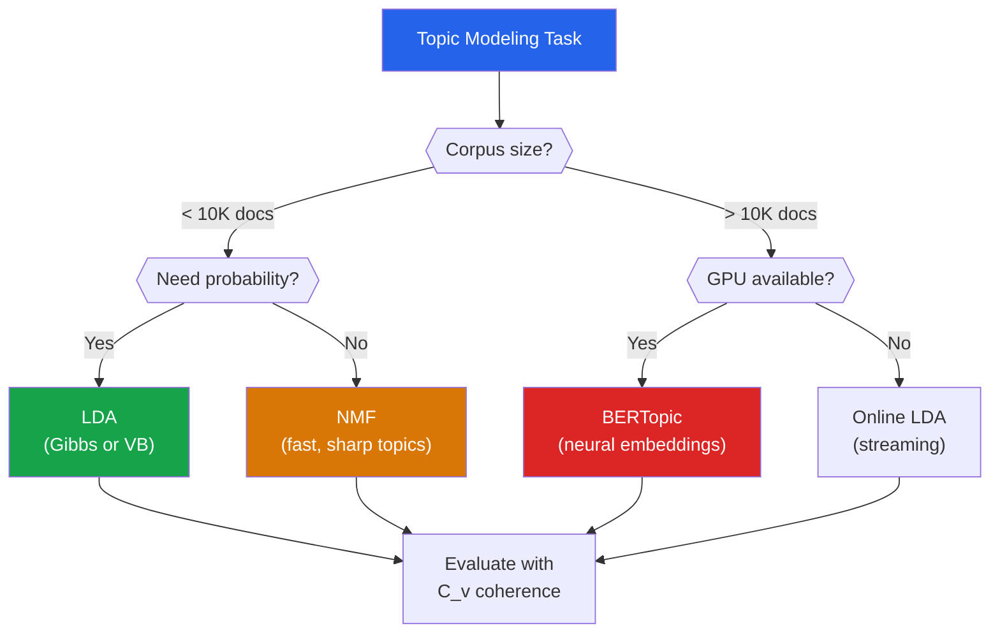

# Topic Modeling

Topic modeling automatically discovers the abstract "topics" that occur in a collection of documents. Given thousands of news articles, a topic model might discover clusters around politics, sports, technology, and finance — without any labels. It is the unsupervised counterpart to text classification and is used in document organization, content recommendation, trend analysis, and exploratory text mining.

## Why Topic Modeling?

| Problem | Traditional Approach | Topic Modeling |
|---------|---------------------|---------------|
| Organize 100K documents | Manual tagging by humans | Automatic topic discovery |
| Find themes in surveys | Read every response | Extract top themes automatically |
| Track news trends | Keyword search | Discover emerging topics |
| Content recommendation | Category-based filtering | Topic-based similarity |

---

## Latent Dirichlet Allocation (LDA)

### The Generative Process

LDA is a **generative probabilistic model** — it imagines a process by which documents were created. To understand the model, think of how an author writes a document:

1. **Choose a topic mixture** for the document (e.g., 70% politics, 20% economics, 10% sports)
2. **For each word** in the document:
   a. Pick a topic from the document's mixture
   b. Pick a word from that topic's vocabulary distribution

Formally, for a corpus of $M$ documents, each with $N_d$ words, $K$ topics:

**For each topic $k \in \{1, \ldots, K\}$:**
- Draw word distribution $\phi_k \sim \text{Dirichlet}(\beta)$

**For each document $d \in \{1, \ldots, M\}$:**
- Draw topic distribution $\theta_d \sim \text{Dirichlet}(\alpha)$
- For each word position $n \in \{1, \ldots, N_d\}$:
  - Draw topic assignment $z_{dn} \sim \text{Categorical}(\theta_d)$
  - Draw word $w_{dn} \sim \text{Categorical}(\phi_{z_{dn}})$

### The Dirichlet Distribution

The Dirichlet distribution $\text{Dir}(\alpha)$ is a distribution over probability distributions. With $K$ topics:

$$p(\theta | \alpha) = \frac{\Gamma(\sum_{k=1}^{K} \alpha_k)}{\prod_{k=1}^{K} \Gamma(\alpha_k)} \prod_{k=1}^{K} \theta_k^{\alpha_k - 1}$$

| $\alpha$ Value | Effect |
|---------------|--------|
| $\alpha < 1$ | Sparse — documents focus on few topics |
| $\alpha = 1$ | Uniform over all topic mixtures |
| $\alpha > 1$ | Dense — documents mix many topics |
| Symmetric $\alpha$ | All topics equally likely a priori |

### Joint Probability

The joint distribution of all observed and latent variables:

$$p(w, z, \theta, \phi | \alpha, \beta) = \prod_{k=1}^{K} p(\phi_k | \beta) \prod_{d=1}^{M} p(\theta_d | \alpha) \prod_{n=1}^{N_d} p(z_{dn} | \theta_d) \cdot p(w_{dn} | \phi_{z_{dn}})$$

The goal: infer the posterior $p(z, \theta, \phi | w, \alpha, \beta)$ — which topics generated which words.

### Why Exact Inference Is Intractable

The posterior requires marginalizing over all possible topic assignments:

$$p(\theta, \phi | w, \alpha, \beta) = \frac{p(w, \theta, \phi | \alpha, \beta)}{p(w | \alpha, \beta)}$$

The denominator $p(w | \alpha, \beta) = \int \int \sum_z p(w, z, \theta, \phi | \alpha, \beta) \, d\theta \, d\phi$ involves summing over $K^N$ possible topic assignments — exponential and intractable. We need approximate inference.

---

## Collapsed Gibbs Sampling for LDA

### Derivation

Integrate out $\theta$ and $\phi$ (collapse them), then sample topic assignments $z$ directly.

The conditional distribution for assigning topic $k$ to word $w_{dn}$ (the $n$-th word in document $d$) given all other assignments $z_{-dn}$:

$$p(z_{dn} = k | z_{-dn}, w, \alpha, \beta) \propto \underbrace{(n_{dk}^{-dn} + \alpha_k)}_{\text{topic prevalence in doc}} \cdot \underbrace{\frac{n_{kv}^{-dn} + \beta_v}{\sum_{v'} (n_{kv'}^{-dn} + \beta_{v'})}}_{\text{word likelihood in topic}}$$

where:
- $n_{dk}^{-dn}$ = number of words in document $d$ assigned to topic $k$ (excluding position $dn$)
- $n_{kv}^{-dn}$ = number of times word $v$ is assigned to topic $k$ across all documents (excluding position $dn$)

### Gibbs Sampling From Scratch

```python
import numpy as np
from collections import Counter

class LDAGibbsSampling:
    """LDA via collapsed Gibbs sampling — from scratch."""

    def __init__(self, n_topics=10, alpha=0.1, beta=0.01,
                 n_iterations=500, random_state=42):
        self.n_topics = n_topics
        self.alpha = alpha
        self.beta = beta
        self.n_iterations = n_iterations
        self.rng = np.random.RandomState(random_state)

    def fit(self, documents):
        """
        Fit LDA to a list of documents.
        Each document is a list of word indices.
        """
        self.K = self.n_topics
        self.M = len(documents)  # number of documents
        self.documents = documents

        # Vocabulary size (max word index + 1)
        self.V = max(max(doc) for doc in documents if doc) + 1

        # Initialize topic assignments randomly
        self.z = []  # z[d][n] = topic of n-th word in doc d
        self.n_dk = np.zeros((self.M, self.K))  # doc-topic counts
        self.n_kv = np.zeros((self.K, self.V))  # topic-word counts
        self.n_k = np.zeros(self.K)             # topic total counts

        for d, doc in enumerate(documents):
            topics = []
            for word in doc:
                k = self.rng.randint(self.K)
                topics.append(k)
                self.n_dk[d, k] += 1
                self.n_kv[k, word] += 1
                self.n_k[k] += 1
            self.z.append(topics)

        # Run Gibbs sampling
        self.log_likelihoods_ = []
        for iteration in range(self.n_iterations):
            self._gibbs_step()

            if iteration % 50 == 0:
                ll = self._log_likelihood()
                self.log_likelihoods_.append(ll)
                print(f"Iteration {iteration}: log-likelihood = {ll:.0f}")

        # Compute final distributions
        self.theta_ = (self.n_dk + self.alpha) / \
                       (self.n_dk.sum(axis=1, keepdims=True) + self.K * self.alpha)
        self.phi_ = (self.n_kv + self.beta) / \
                     (self.n_kv.sum(axis=1, keepdims=True) + self.V * self.beta)

        return self

    def _gibbs_step(self):
        """One full pass of Gibbs sampling."""
        for d, doc in enumerate(self.documents):
            for n, word in enumerate(doc):
                # Remove current assignment
                k_old = self.z[d][n]
                self.n_dk[d, k_old] -= 1
                self.n_kv[k_old, word] -= 1
                self.n_k[k_old] -= 1

                # Compute conditional distribution
                p = np.zeros(self.K)
                for k in range(self.K):
                    p[k] = (self.n_dk[d, k] + self.alpha) * \
                           (self.n_kv[k, word] + self.beta) / \
                           (self.n_k[k] + self.V * self.beta)

                # Normalize
                p /= p.sum()

                # Sample new topic
                k_new = self.rng.choice(self.K, p=p)

                # Update counts
                self.z[d][n] = k_new
                self.n_dk[d, k_new] += 1
                self.n_kv[k_new, word] += 1
                self.n_k[k_new] += 1

    def _log_likelihood(self):
        """Compute log-likelihood of the current state."""
        ll = 0.0
        for d, doc in enumerate(self.documents):
            for n, word in enumerate(doc):
                k = self.z[d][n]
                ll += np.log(
                    (self.n_kv[k, word] + self.beta) /
                    (self.n_k[k] + self.V * self.beta)
                )
        return ll

    def top_words(self, vocab, n_words=10):
        """Return top words for each topic."""
        topics = []
        for k in range(self.K):
            top_idx = np.argsort(self.phi_[k])[::-1][:n_words]
            top_words = [(vocab[i], self.phi_[k, i]) for i in top_idx]
            topics.append(top_words)
        return topics
```

---

## Scikit-learn LDA

```python
from sklearn.datasets import fetch_20newsgroups
from sklearn.feature_extraction.text import CountVectorizer
from sklearn.decomposition import LatentDirichletAllocation
import numpy as np
import matplotlib.pyplot as plt

# ---- Load 20 Newsgroups ----
categories = ['sci.space', 'rec.sport.baseball', 'comp.graphics',
              'talk.politics.guns', 'soc.religion.christian',
              'sci.med', 'rec.autos', 'comp.sys.mac.hardware']

newsgroups = fetch_20newsgroups(
    subset='all',
    categories=categories,
    remove=('headers', 'footers', 'quotes'),
    random_state=42
)

print(f"Documents: {len(newsgroups.data)}")
print(f"Categories: {newsgroups.target_names}")

# ---- Vectorize ----
vectorizer = CountVectorizer(
    max_df=0.9,         # ignore terms in >90% of docs
    min_df=5,           # ignore terms in <5 docs
    max_features=5000,
    stop_words='english'
)
X_counts = vectorizer.fit_transform(newsgroups.data)
vocab = vectorizer.get_feature_names_out()

print(f"Vocabulary size: {len(vocab)}")
print(f"Document-term matrix: {X_counts.shape}")

# ---- Fit LDA ----
n_topics = 8

lda = LatentDirichletAllocation(
    n_components=n_topics,
    max_iter=20,
    learning_method='online',  # faster for large data
    random_state=42,
    n_jobs=-1
)
lda.fit(X_counts)

print(f"\nPerplexity: {lda.perplexity(X_counts):.1f}")
print(f"Log-likelihood: {lda.score(X_counts):.1f}")

# ---- Display topics ----
def display_topics(model, feature_names, n_words=15):
    for topic_idx, topic in enumerate(model.components_):
        top_words_idx = topic.argsort()[::-1][:n_words]
        top_words = [feature_names[i] for i in top_words_idx]
        print(f"\nTopic {topic_idx}: {', '.join(top_words)}")

display_topics(lda, vocab, n_words=12)
```

### Visualizing Topic-Word Distributions

```python
fig, axes = plt.subplots(2, 4, figsize=(20, 10))

for topic_idx, ax in enumerate(axes.ravel()):
    top_n = 15
    top_idx = lda.components_[topic_idx].argsort()[::-1][:top_n]
    top_weights = lda.components_[topic_idx][top_idx]
    top_weights = top_weights / top_weights.sum()  # normalize
    top_words = [vocab[i] for i in top_idx]

    ax.barh(range(top_n), top_weights[::-1], color=f'C{topic_idx}')
    ax.set_yticks(range(top_n))
    ax.set_yticklabels(top_words[::-1], fontsize=8)
    ax.set_title(f'Topic {topic_idx}', fontsize=11)
    ax.set_xlabel('Weight')

plt.suptitle('LDA Topics — 20 Newsgroups (8 categories)', fontsize=14)
plt.tight_layout()
plt.savefig('lda_topics.png', dpi=150, bbox_inches='tight')
plt.show()
```

---

## Non-Negative Matrix Factorization (NMF)

### Mathematical Formulation

Given a document-term matrix $V \in \mathbb{R}_{\geq 0}^{m \times n}$, NMF finds:

$$V \approx W H$$

where $W \in \mathbb{R}_{\geq 0}^{m \times k}$ (document-topic) and $H \in \mathbb{R}_{\geq 0}^{k \times n}$ (topic-word), both non-negative.

**Objective** (Frobenius norm):

$$\min_{W, H \geq 0} \|V - WH\|_F^2 = \sum_{ij} (V_{ij} - (WH)_{ij})^2$$

Or using **KL divergence** (often better for text):

$$\min_{W, H \geq 0} D_{KL}(V \| WH) = \sum_{ij} \left[ V_{ij} \log \frac{V_{ij}}{(WH)_{ij}} - V_{ij} + (WH)_{ij} \right]$$

### NMF vs LDA

| Aspect | LDA | NMF |
|--------|-----|-----|
| **Model** | Probabilistic generative | Matrix factorization |
| **Input** | Counts (CountVectorizer) | TF-IDF works well |
| **Topics** | Probability distributions | Non-negative components |
| **Inference** | Variational Bayes / Gibbs | Coordinate descent |
| **Interpretability** | Good | Often sharper topics |
| **Speed** | Slower | Faster |

```python
from sklearn.decomposition import NMF
from sklearn.feature_extraction.text import TfidfVectorizer

# TF-IDF for NMF (often better than raw counts)
tfidf_vectorizer = TfidfVectorizer(
    max_df=0.9, min_df=5, max_features=5000, stop_words='english'
)
X_tfidf = tfidf_vectorizer.fit_transform(newsgroups.data)
tfidf_vocab = tfidf_vectorizer.get_feature_names_out()

nmf = NMF(n_components=n_topics, random_state=42, max_iter=300,
          init='nndsvd')
W = nmf.fit_transform(X_tfidf)  # document-topic matrix
H = nmf.components_              # topic-word matrix

print(f"Reconstruction error: {nmf.reconstruction_err_:.2f}")
print("\nNMF Topics:")
display_topics(nmf, tfidf_vocab, n_words=12)
```

---

## BERTopic: Modern Neural Topic Modeling

BERTopic (2022) uses pre-trained sentence transformers to create document embeddings, then clusters them with HDBSCAN, and extracts topic representations using c-TF-IDF.

### Pipeline

1. **Embed** documents with a sentence transformer (all-MiniLM-L6-v2)
2. **Reduce** dimensionality with UMAP
3. **Cluster** with HDBSCAN
4. **Extract** topic words with class-based TF-IDF (c-TF-IDF)

$$\text{c-TF-IDF}_{t,c} = \frac{tf_{t,c}}{A_c} \cdot \log \frac{A}{tf_t}$$

where $tf_{t,c}$ is the frequency of term $t$ in class (topic) $c$, $A_c$ is the average frequency in class $c$, $A$ is the average frequency across all classes, and $tf_t$ is the total frequency of term $t$.

```python
from bertopic import BERTopic
from sentence_transformers import SentenceTransformer
from sklearn.datasets import fetch_20newsgroups
import matplotlib.pyplot as plt

# Load data
newsgroups = fetch_20newsgroups(
    subset='all',
    categories=categories,
    remove=('headers', 'footers', 'quotes'),
    random_state=42
)
docs = newsgroups.data

# ---- BERTopic ----
topic_model = BERTopic(
    embedding_model='all-MiniLM-L6-v2',
    nr_topics=10,           # reduce to ~10 topics
    top_n_words=10,
    min_topic_size=30,
    verbose=True
)

topics, probs = topic_model.fit_transform(docs)

# Display topics
topic_info = topic_model.get_topic_info()
print(topic_info.head(12))

# Top words per topic
for topic_id in range(min(8, len(topic_model.get_topics()))):
    words = topic_model.get_topic(topic_id)
    if words:
        word_str = ', '.join([w for w, _ in words[:10]])
        print(f"Topic {topic_id}: {word_str}")

# ---- Built-in visualizations ----
fig_topics = topic_model.visualize_topics()
fig_topics.write_html('bertopic_topics.html')

fig_barchart = topic_model.visualize_barchart(top_n_topics=8)
fig_barchart.write_html('bertopic_barchart.html')

fig_heatmap = topic_model.visualize_heatmap()
fig_heatmap.write_html('bertopic_heatmap.html')
```

---

## Topic Coherence Metrics

How do we evaluate topic quality without labels? **Coherence** measures how semantically consistent the top words in a topic are.

### Types of Coherence

**$C_v$ Coherence** (recommended):

Combines normalized pointwise mutual information (NPMI), cosine similarity, and a sliding window. Higher = better. Typical range: 0.3-0.7.

$$\text{NPMI}(w_i, w_j) = \frac{\log \frac{P(w_i, w_j) + \epsilon}{P(w_i) \cdot P(w_j)}}{-\log(P(w_i, w_j) + \epsilon)}$$

**UMass Coherence** ($C_{UMass}$):

Based on document co-occurrence:

$$C_{UMass} = \frac{2}{K(K-1)} \sum_{i=2}^{K} \sum_{j=1}^{i-1} \log \frac{D(w_i, w_j) + 1}{D(w_j)}$$

More negative = worse. Closer to 0 = better.

```python
from gensim.models.coherencemodel import CoherenceModel
from gensim.corpora import Dictionary
from gensim.models import LdaModel
import gensim
import nltk
from nltk.corpus import stopwords

# Preprocess for gensim
nltk.download('stopwords', quiet=True)
stop_words = set(stopwords.words('english'))

def preprocess(text):
    tokens = gensim.utils.simple_preprocess(text, deacc=True, min_len=3)
    return [t for t in tokens if t not in stop_words]

texts = [preprocess(doc) for doc in newsgroups.data]
texts = [t for t in texts if len(t) > 5]  # remove very short docs

dictionary = Dictionary(texts)
dictionary.filter_extremes(no_below=5, no_above=0.9)
corpus = [dictionary.doc2bow(text) for text in texts]

print(f"Dictionary: {len(dictionary)} terms")
print(f"Corpus: {len(corpus)} documents")

# ---- Find optimal number of topics ----
coherence_scores = {}
for n_topics in [5, 8, 10, 15, 20, 25, 30]:
    lda_gensim = LdaModel(
        corpus=corpus,
        id2word=dictionary,
        num_topics=n_topics,
        random_state=42,
        passes=10,
        alpha='auto',
        per_word_topics=True
    )

    coherence_model = CoherenceModel(
        model=lda_gensim,
        texts=texts,
        dictionary=dictionary,
        coherence='c_v'
    )
    score = coherence_model.get_coherence()
    coherence_scores[n_topics] = score
    print(f"Topics={n_topics:2d}: C_v = {score:.4f}")

# Plot
plt.figure(figsize=(10, 5))
plt.plot(list(coherence_scores.keys()), list(coherence_scores.values()),
         'bo-', markersize=8)
plt.xlabel('Number of Topics')
plt.ylabel('Coherence Score (C_v)')
plt.title('Topic Coherence vs Number of Topics')
plt.grid(True, alpha=0.3)

best_k = max(coherence_scores, key=coherence_scores.get)
plt.axvline(x=best_k, color='red', linestyle='--',
            label=f'Best: {best_k} topics (C_v={coherence_scores[best_k]:.4f})')
plt.legend()
plt.tight_layout()
plt.savefig('coherence_vs_topics.png', dpi=150, bbox_inches='tight')
plt.show()
```

---

## Choosing the Right Method



| Method | Strengths | Weaknesses | Best For |
|--------|-----------|-----------|----------|
| **LDA** | Probabilistic, well-studied, per-document topic distributions | Slow, bag-of-words only, hyperparameter-sensitive | When you need topic proportions per document |
| **NMF** | Fast, sharp topics, deterministic | Not probabilistic, sensitive to TF-IDF preprocessing | Quick exploration, well-separated topics |
| **BERTopic** | Semantic understanding, handles short text | Needs GPU, less interpretable embeddings | Modern NLP, short documents, multilingual |
| **LSA/LSI** | Fast, simple (TruncatedSVD on TF-IDF) | Negative values, weaker topics | Very large corpora, baseline |

---

## Dynamic Topic Modeling

Track how topics evolve over time:

```python
# Time-sliced LDA with gensim
from gensim.models import LdaSeqModel

# Organize documents by time period
# time_slices = [n_docs_period1, n_docs_period2, ...]
# ldaseq = LdaSeqModel(corpus=corpus, id2word=dictionary,
#                       time_slice=time_slices, num_topics=10)

# BERTopic supports dynamic topics natively
# topics_over_time = topic_model.topics_over_time(docs, timestamps)
# topic_model.visualize_topics_over_time(topics_over_time)
```

---

## Production Tips

### Preprocessing Checklist for Topic Modeling

1. **Remove stopwords** — they dominate topic distributions
2. **Lemmatize/stem** — "running", "runs", "ran" should be one token
3. **Remove short documents** — fewer than 10 words add noise
4. **Remove rare terms** — appearing in <5 documents
5. **Remove very frequent terms** — appearing in >90% of documents
6. **Consider bigrams/trigrams** — "machine learning" should be one token

### Labeling Topics Automatically

```python
# Use the top words to generate a label
def auto_label_topic(top_words, n=3):
    """Create a topic label from top-n words."""
    return ' / '.join([w for w, _ in top_words[:n]])

# Or use an LLM for better labels
# prompt = f"Given these words: {words}, suggest a 2-3 word topic label."
```

::: tip Evaluation Without Labels
When you have ground truth categories (like 20 Newsgroups), use **Normalized Mutual Information (NMI)** between assigned topics and true categories. When you do not have labels, rely on **C_v coherence** (aim for > 0.4) and **human evaluation** of the top 10 words per topic.
:::

---

## Key Takeaways

| Concept | Remember |
|---------|----------|
| LDA is a generative model | Documents = mixtures of topics, topics = distributions over words |
| Dirichlet prior $\alpha$ controls sparsity | Small $\alpha$ = few topics per doc; large $\alpha$ = many topics per doc |
| Gibbs sampling draws from conditional | $p(z_{dn} = k) \propto (\text{topic in doc}) \times (\text{word in topic})$ |
| NMF factorizes $V \approx WH$ non-negatively | Often produces sharper topics than LDA |
| BERTopic uses sentence embeddings | Best for short text and semantic understanding |
| Coherence $C_v$ is the best automatic metric | NPMI-based, correlates with human judgment |
| Number of topics requires experimentation | Plot coherence vs $K$, pick the elbow or peak |
| Preprocessing matters enormously | Stopwords, min/max df, lemmatization all affect quality |
