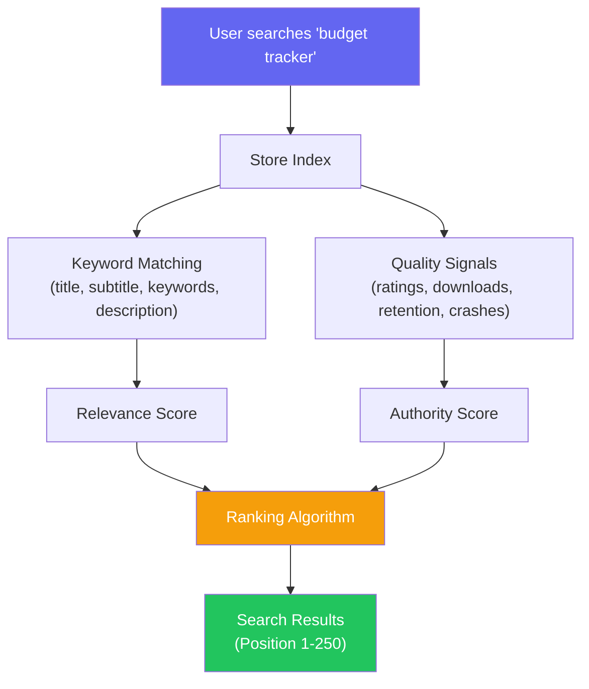

# App Store Optimization (ASO)

::: tip Key Takeaway
- ASO is the mobile equivalent of SEO — 65% of all app downloads come from App Store and Google Play search, making keyword optimization the single highest-leverage activity for organic growth
- Screenshots are your storefront — they are the first thing users see and the last thing before they decide to install; invest in professional screenshots that show real value (not just UI) and A/B test them relentlessly
- Ratings below 4.0 tank conversion rates — implement smart in-app review prompts that target satisfied users (after a positive event like completing a purchase or achieving a milestone), not random users at random times
:::

App Store Optimization is the process of improving your app's visibility in the App Store and Google Play to drive more organic (free) installs. It is the most cost-effective growth channel for mobile apps because it compounds — a well-optimized listing continues to drive installs for months, unlike paid ads that stop the moment you stop paying.

ASO is also widely neglected. Most teams ship their app with a developer-written title, placeholder screenshots, and no keyword research. Then they wonder why their beautiful app has 50 downloads while a mediocre competitor has 50,000. The difference is usually ASO.

**Related**: [Mobile Analytics](/mobile-engineering/mobile-analytics) | [Mobile Deployment](/mobile-engineering/mobile-deployment) | [Mobile Engineering Overview](/mobile-engineering/)

---

## How App Store Search Works



### Ranking Factors Comparison

| Factor | App Store (iOS) | Google Play |
|--------|----------------|-------------|
| **App title** | 30 chars, heavy weight | 30 chars, heavy weight |
| **Subtitle** | 30 chars, heavy weight | N/A |
| **Short description** | N/A | 80 chars, heavy weight |
| **Keyword field** | 100 chars (hidden from users) | N/A |
| **Long description** | Indexed but low weight | Indexed and weighted (like SEO) |
| **Downloads velocity** | High impact | High impact |
| **Rating (stars)** | High impact on conversion | High impact on conversion |
| **Rating count** | Moderate impact | Moderate impact |
| **Retention rate** | Likely a signal | Confirmed signal |
| **Crash rate** | Likely a signal | Confirmed signal |
| **Update frequency** | Minor signal | Minor signal |

---

## Keyword Research and Optimization

### Finding Keywords

```
Step 1: Brainstorm seed keywords
  → What does your app do? "expense tracker", "budget planner", "money manager"
  → What problem does it solve? "save money", "track spending", "reduce debt"
  → What category terms? "personal finance", "budgeting app"

Step 2: Expand with autocomplete
  → Type each seed keyword in the App Store/Play Store search
  → Note the autocomplete suggestions — these are real user queries
  → "budget" → "budget tracker", "budget planner", "budget app free"

Step 3: Analyze competition
  → For each keyword, check the top 5 results
  → High competition: apps with millions of downloads in top spots
  → Low competition: apps with <10K downloads in top spots
  → Target: medium competition keywords where you can realistically rank

Step 4: Estimate search volume
  → Use tools: AppTweak, Sensor Tower, App Annie (data.ai)
  → Score keywords: Volume × Relevance × (1 / Competition)

Step 5: Prioritize and place
  → Highest value keywords → Title
  → Second tier → Subtitle (iOS) / Short Description (Android)
  → Long tail → Keyword field (iOS) / Long Description (Android)
```

### iOS Keyword Optimization

```
Title (30 chars):
"PennyWise - Budget Tracker"
 ↑ Brand      ↑ Primary keyword

Subtitle (30 chars):
"Expense Manager & Money Saver"
 ↑ Secondary keywords

Keyword Field (100 chars — comma-separated, no spaces after commas):
"personal finance,spending tracker,bill reminder,savings goal,
debt payoff,money management,income tracker,financial planner"

Rules:
- No need to repeat words from title/subtitle in keywords
- Singular forms match plural searches (and vice versa)
- No competitor brand names (will get rejected)
- Use every character — space is precious
```

### Google Play Optimization

```
Title (30 chars):
"PennyWise: Budget Tracker"

Short Description (80 chars):
"Track expenses, manage budgets & save money with the #1 personal finance app"

Long Description (4000 chars) — Google indexes this like web content:
- Use primary keywords in the first paragraph
- Use secondary keywords naturally throughout
- Include feature bullets with keyword-rich descriptions
- Do NOT keyword stuff — Google penalizes it
- Write for humans first, search second
```

---

## Screenshots

Screenshots are the most impactful visual element of your listing. They are displayed before users read any text, and they drive the install decision more than any other factor.

### Screenshot Best Practices

| Guideline | Why | Example |
|-----------|-----|---------|
| **Show benefits, not features** | Users care about outcomes | "Save $500/month" > "Budget categories" |
| **First 2 screenshots are critical** | Only 2-3 are visible without scrolling | Put your strongest value prop first |
| **Use text overlays** | Users skim, don't read | Short headline + supporting visual |
| **Show real data** | Empty states look like a demo | Pre-fill with realistic (but fake) data |
| **Consistent design language** | Professionalism builds trust | Same color scheme, typography, layout |
| **Localize screenshots** | Users trust content in their language | Translate text overlays and in-app content |

### Screenshot Automation with Fastlane

```ruby
# fastlane/Fastfile
desc "Generate localized screenshots"
lane :screenshots do
  # iOS screenshots using snapshot
  capture_screenshots(
    workspace: "MyApp.xcworkspace",
    scheme: "MyAppUITests",
    devices: [
      "iPhone 15 Pro Max",
      "iPhone 15 Pro",
      "iPhone SE (3rd generation)",
      "iPad Pro (12.9-inch) (6th generation)"
    ],
    languages: ["en-US", "de-DE", "ja", "es-ES", "fr-FR"],
    output_directory: "./screenshots",
    clear_previous_screenshots: true
  )

  # Frame the screenshots with device bezels
  frame_screenshots(
    silver: false,
    path: "./screenshots"
  )

  # Upload to App Store Connect
  upload_to_app_store(
    skip_binary_upload: true,
    skip_metadata: true,
    screenshots_path: "./screenshots"
  )
end
```

```swift
// UITest that generates screenshots
import XCTest

class ScreenshotTests: XCTestCase {
    let app = XCUIApplication()

    override func setUp() {
        continueAfterFailure = false
        setupSnapshot(app)
        app.launch()
    }

    func testScreenshots() {
        // Screenshot 1: Home screen with budget overview
        snapshot("01_HomeScreen")

        // Screenshot 2: Transaction list
        app.tabBars.buttons["Transactions"].tap()
        snapshot("02_TransactionList")

        // Screenshot 3: Add expense
        app.buttons["addExpense"].tap()
        app.textFields["amount"].tap()
        app.textFields["amount"].typeText("34.99")
        snapshot("03_AddExpense")

        // Screenshot 4: Budget categories
        app.tabBars.buttons["Budgets"].tap()
        snapshot("04_BudgetCategories")

        // Screenshot 5: Insights and charts
        app.tabBars.buttons["Insights"].tap()
        snapshot("05_Insights")
    }
}
```

---

## Ratings and Reviews Strategy

### The Rating-Conversion Relationship

| Rating | Conversion Impact | Installs (relative) |
|--------|------------------|-------------------|
| **4.5 - 5.0** | Baseline | 100% |
| **4.0 - 4.4** | ~5-10% lower | 90-95% |
| **3.5 - 3.9** | ~15-25% lower | 75-85% |
| **3.0 - 3.4** | ~30-40% lower | 60-70% |
| **Below 3.0** | ~50-70% lower | 30-50% |

### Smart Review Prompts

```typescript
// src/services/ReviewPrompt.ts
import * as StoreReview from 'expo-store-review';
import AsyncStorage from '@react-native-async-storage/async-storage';

interface ReviewState {
  lastPromptDate: number | null;
  positiveActionCount: number;
  hasRated: boolean;
  installDate: number;
}

class ReviewPromptService {
  private state: ReviewState = {
    lastPromptDate: null,
    positiveActionCount: 0,
    hasRated: false,
    installDate: Date.now(),
  };

  async initialize() {
    const stored = await AsyncStorage.getItem('review_state');
    if (stored) this.state = JSON.parse(stored);
  }

  // Call this after positive user events
  async recordPositiveAction() {
    this.state.positiveActionCount++;
    await this.save();
    await this.maybePrompt();
  }

  private async maybePrompt() {
    if (this.state.hasRated) return;

    // Rule 1: Don't prompt in the first 3 days
    const daysSinceInstall = (Date.now() - this.state.installDate) / (1000 * 60 * 60 * 24);
    if (daysSinceInstall < 3) return;

    // Rule 2: At least 5 positive actions
    if (this.state.positiveActionCount < 5) return;

    // Rule 3: Don't prompt more than once per 90 days
    if (this.state.lastPromptDate) {
      const daysSinceLastPrompt =
        (Date.now() - this.state.lastPromptDate) / (1000 * 60 * 60 * 24);
      if (daysSinceLastPrompt < 90) return;
    }

    // Rule 4: Don't prompt during critical flows (checkout, etc.)
    // This should be checked by the caller

    // Show the native review prompt
    if (await StoreReview.isAvailableAsync()) {
      await StoreReview.requestReview();
      this.state.lastPromptDate = Date.now();
      this.state.hasRated = true; // Assume they rated (we can't know for sure)
      await this.save();
    }
  }

  private async save() {
    await AsyncStorage.setItem('review_state', JSON.stringify(this.state));
  }
}

export const reviewPrompt = new ReviewPromptService();

// Usage — trigger after positive events
async function onPurchaseComplete(orderId: string) {
  // ... handle order success
  await reviewPrompt.recordPositiveAction();
}

async function onMilestoneReached(milestone: string) {
  // "You've saved $500 this month!"
  await reviewPrompt.recordPositiveAction();
}

async function onStreakMaintained(days: number) {
  if (days >= 7) {
    await reviewPrompt.recordPositiveAction();
  }
}
```

::: warning Common Misconceptions
**"Ask every user to rate the app."** Apple limits the native review prompt to 3 times per 365 days per user. Showing it at the wrong time (during an error, right after install, mid-checkout) trains users to dismiss it or leave negative reviews. Target satisfied users after positive events.

**"Reply to every review."** Reply to negative reviews (especially 1-2 star) with empathy and actionable responses — this can prompt users to update their rating. For positive reviews, a thank-you is nice but has diminishing returns. Focus your time on the negative ones.

**"Incentivized reviews are fine."** Both Apple and Google prohibit incentivizing reviews (offering in-app currency, features, or discounts in exchange for ratings). Apps caught doing this get removed. The native review dialog ensures you cannot gate content behind a review.
:::

---

## A/B Testing Listings

### Google Play Store Experiments

Google Play Console has built-in A/B testing for store listings. Apple does not (yet).

| Element | Can A/B Test (Google Play) | Can A/B Test (App Store) |
|---------|--------------------------|-------------------------|
| **App icon** | Yes | No (use pre-launch focus groups) |
| **Screenshots** | Yes | No |
| **Short description** | Yes | No |
| **Feature graphic** | Yes | No |
| **Long description** | Yes | No |
| **Title** | No | No |

```
Google Play Experiment Setup:
1. Play Console → Store Listing → Store Listing Experiments
2. Choose element to test (e.g., screenshots)
3. Upload variant B screenshots
4. Set traffic split (recommend 50/50)
5. Set duration (7-14 days minimum)
6. Primary metric: Install rate (first-time installers / listing visitors)
7. Wait for statistical significance (95% confidence)
```

### Custom Page Experiments (App Store)

While Apple lacks built-in A/B testing, you can create Custom Product Pages — up to 35 different versions of your listing that you link to from specific ad campaigns, deep links, or channels.

```
Custom Product Page Strategy:
1. App Store Connect → Custom Product Pages → Create
2. Each page can have different:
   - Screenshots
   - Promotional text
   - App preview videos
3. Use different pages for different audiences:
   - Page A: Screenshots showing budget features → link from "budget app" Google Ad
   - Page B: Screenshots showing investment features → link from finance blog
   - Page C: Screenshots showing savings goals → link from social media campaign
4. Track conversion rate per page to learn what resonates with each audience
```

---

## Localization

Localizing your app listing increases downloads by 30-70% in non-English markets. You do not need to localize the entire app — start with just the listing.

| Market | Language | Opportunity | Notes |
|--------|----------|-------------|-------|
| **Japan** | Japanese | Very high downloads/capita | Highly competitive, localization expected |
| **South Korea** | Korean | High downloads/capita | |
| **Germany** | German | Largest European market | Strong preference for German UI |
| **Brazil** | Portuguese (BR) | Massive Android market | Price sensitivity, focus on free |
| **France** | French | Large market | Strong preference for French |
| **Spain + LATAM** | Spanish | Huge combined market | Use neutral Spanish for both |

```ruby
# Automated metadata localization with Fastlane
# fastlane/metadata/en-US/title.txt
PennyWise - Budget Tracker

# fastlane/metadata/de-DE/title.txt
PennyWise - Haushaltsbuch

# fastlane/metadata/ja/title.txt
PennyWise - 家計簿アプリ

# fastlane/metadata/es-ES/title.txt
PennyWise - Control de Gastos

# Upload all localized metadata
lane :upload_metadata do
  deliver(
    skip_binary_upload: true,
    skip_screenshots: false,
    force: true,
    metadata_path: "./fastlane/metadata"
  )
end
```

---

## ASO Metrics and Tracking

| Metric | What It Measures | Target | Source |
|--------|-----------------|--------|--------|
| **Impression to install rate** | Conversion from seeing listing to installing | 25-40% (category) | App Store Connect / Play Console |
| **Keyword ranking** | Position for target keywords | Top 10 for primary keywords | AppTweak, Sensor Tower |
| **Organic vs paid installs** | Ratio of free to paid acquisition | > 60% organic | Attribution tool |
| **Page view to install rate** | Conversion from detail page view to install | 30-50% | Store analytics |
| **Rating trend** | Weekly average rating | > 4.3 stars | Store analytics |
| **Review response time** | Time to reply to negative reviews | < 24 hours | Manual tracking |

---

## When NOT to Focus on ASO

- **Pre-product-market fit.** If your retention is below benchmarks, ASO will bring you more users who churn. Fix the product first, then optimize distribution.
- **B2B enterprise apps.** If your app is distributed through MDM or direct links, not app store search, ASO provides minimal value. Focus on the landing page and sales materials instead.
- **Apps in niche categories with < 1,000 monthly searches.** If nobody is searching for your category, ASO cannot create demand. Focus on content marketing, social, and partnerships instead.
- **Immediately after launch.** New apps with no reviews or download history will not rank for competitive keywords regardless of optimization. Focus on getting initial traction through other channels first (Product Hunt, social media, PR), then optimize for search.

---

## Real-World Example: Headspace

Headspace, the meditation app with 70+ million downloads, is a masterclass in ASO:

1. **Title**: "Headspace: Mindful Meditation" — brand + primary keyword
2. **Screenshots**: Show outcomes, not features — "Reduce stress by 14%" instead of "500+ guided meditations"
3. **Localization**: Fully localized in 10 languages with culturally adapted screenshots (different imagery for Japan vs US)
4. **Ratings**: Maintains 4.9 stars with 500K+ ratings by prompting after users complete their first 7-day streak (peak satisfaction moment)
5. **Seasonal updates**: Updates screenshots and descriptions for seasonal keywords ("New Year meditation", "sleep better in winter")
6. **Video preview**: Short, calming video showing the actual meditation experience — matches the brand voice

Calm, their primary competitor, uses similar ASO strategies but differentiates with "sleep stories" as a keyword focus, capturing a different search intent.

---

::: details Quiz

**1. What is the most impactful difference between App Store and Google Play keyword optimization?**

The App Store has a hidden 100-character keyword field where you place keywords that are not visible to users. Google Play does not have this field — instead, it indexes the long description (4000 characters) like web content, making it similar to SEO. This means Google Play descriptions should be keyword-rich and well-written, while iOS descriptions carry less keyword weight.

**2. Why are the first two screenshots more important than the rest?**

In the App Store, only the first 2-3 screenshots are visible in search results without tapping into the listing. On Google Play, the first screenshot (or video if present) is visible in search results. Most users make their install decision from the search results page without viewing the full listing. If the first 2 screenshots do not communicate value, the user will scroll past.

**3. How often can you show the iOS native review dialog per user?**

Apple limits the `SKStoreReviewController.requestReview()` prompt to 3 times per 365-day period per user. Additionally, the system may choose not to show the dialog at all based on undisclosed criteria. You cannot programmatically detect whether the dialog was shown or whether the user left a review. This is why you must use your limited prompts strategically on satisfied users.

**4. Why should you localize your listing even if the app itself is English-only?**

Users in non-English markets search in their native language. If your listing is only in English, you will not appear in German/Japanese/Spanish searches. Localizing just the title, subtitle, description, and screenshots can increase downloads in that market by 30-70% without any code changes. The app UI can still be English — many users in non-English markets are comfortable using English-language apps.

:::

---

::: details Exercise

**Optimize an app listing for a hypothetical "FitTrack" fitness app. Create:**

1. Optimized titles for both App Store and Google Play
2. iOS subtitle and keyword field
3. Google Play short description
4. First 5 screenshot concepts (describe what each shows)
5. A review prompt strategy (when to trigger)

**Solution:**

```
1. TITLES
App Store: "FitTrack - Workout Tracker" (26 chars)
Google Play: "FitTrack: Workout Planner" (25 chars)
(Different because different keywords rank differently per store)

2. iOS SUBTITLE + KEYWORDS
Subtitle: "Gym Log & Exercise Planner" (26 chars)

Keyword field (100 chars):
"fitness tracker,gym workout,exercise log,weight training,strength,
home workout,muscle building,health"

Note: "workout", "tracker", and "planner" are already in title/subtitle
so they are NOT repeated in the keyword field.

3. GOOGLE PLAY SHORT DESCRIPTION (80 chars):
"Track workouts, build muscle & reach your fitness goals with
personalized plans"

4. SCREENSHOT CONCEPTS
Screenshot 1: "Your Personal Trainer"
  → Hero shot of the workout-in-progress screen with a timer,
  exercise name, and rep counter. Text overlay: "Never miss a rep."

Screenshot 2: "Track Your Progress"
  → Charts showing strength gains over 3 months.
  Text overlay: "See your gains — bench press up 25 lbs in 12 weeks"

Screenshot 3: "200+ Guided Workouts"
  → Grid of workout cards (Push/Pull/Legs, 5x5, HIIT).
  Text overlay: "Expert programs for every goal"

Screenshot 4: "Works Offline"
  → Workout screen with airplane mode indicator visible.
  Text overlay: "No WiFi? No problem. Full offline support."

Screenshot 5: "Join 2M+ Athletes"
  → Social proof screen showing community stats, testimonials.
  Text overlay: "Rated #1 workout tracker on the App Store"

5. REVIEW PROMPT STRATEGY
Trigger after these positive events (in order of priority):
- User completes their 10th workout (strong engagement signal)
- User hits a personal record (peak satisfaction)
- User completes a 4-week program (high commitment)

Do NOT trigger:
- During a workout (disruptive)
- After a failed sync or error
- In the first 7 days (too early)
- More than once per 90 days
```

:::

---

> *"ASO is not a one-time optimization. It is a continuous process of keyword monitoring, competitive analysis, screenshot testing, and review management. Treat your app listing like a living product page, not a static brochure."*
