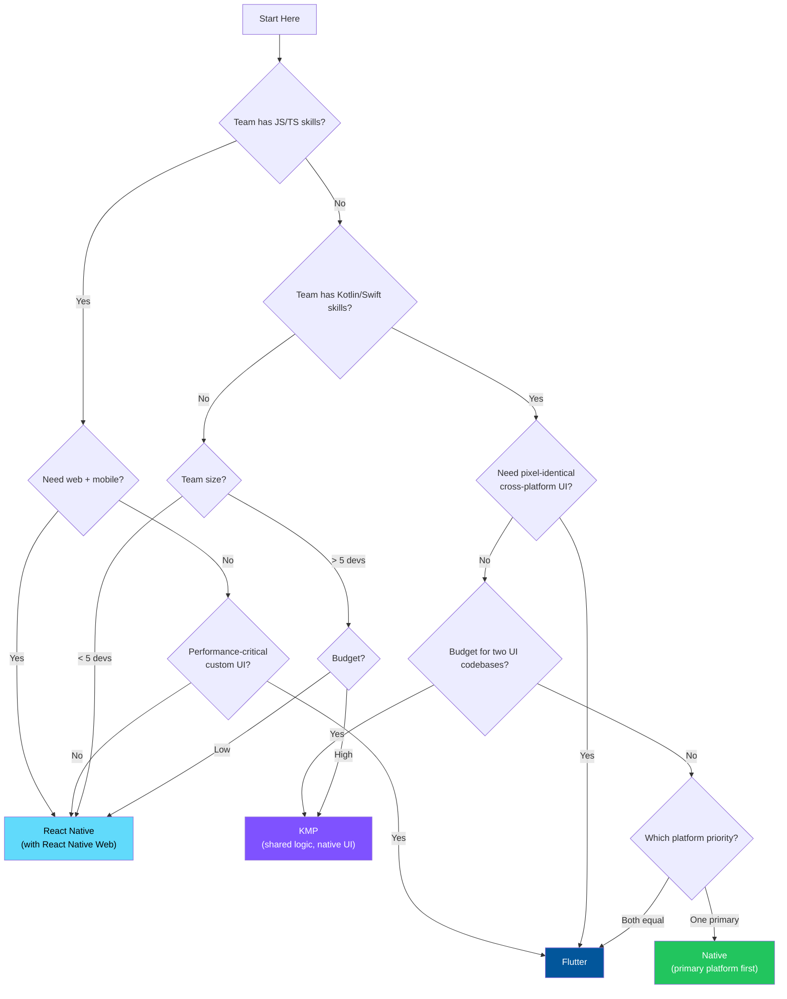

# Cross-Platform Framework Comparison

::: tip Key Takeaway
- There is no universally "best" framework — the right choice depends on your team's existing skills, your app's performance requirements, your hiring market, and whether you need to share code with web
- React Native is the pragmatic choice for teams with JavaScript/TypeScript expertise building business apps — its new architecture (Fabric + TurboModules) eliminated the bridge bottleneck that caused performance concerns
- Flutter produces the most polished cross-platform UI but requires learning Dart, which limits your hiring pool; Kotlin Multiplatform shares only business logic (not UI), making it the safest choice for apps that need platform-native UI
:::

Choosing a cross-platform framework is a 2-5 year commitment. Switching frameworks mid-project means rewriting your entire app. Choosing wrong costs months of development time, introduces hiring challenges, and can result in a subpar user experience. This is not a decision to make based on a blog post or a conference talk — it requires understanding the technical tradeoffs, your team's strengths, and your product's specific needs.

This guide compares the four major approaches: React Native, Flutter, Kotlin Multiplatform (KMP), and native development (Swift + Kotlin). Each has clear strengths, clear weaknesses, and a sweet spot where it excels.

**Related**: [React Native](/mobile-engineering/react-native) | [Flutter](/mobile-engineering/flutter) | [Mobile Architecture](/mobile-engineering/mobile-architecture) | [Mobile Engineering Overview](/mobile-engineering/)

---

## Architecture Comparison

```mermaid
graph TD
    subgraph "React Native (New Architecture)"
        RN_TS["TypeScript"] --> RN_JSI["JSI (JavaScript Interface)"]
        RN_JSI --> RN_FABRIC["Fabric Renderer"]
        RN_JSI --> RN_TURBO["TurboModules"]
        RN_FABRIC --> RN_NATIVE["Native UI Components"]
        RN_TURBO --> RN_PLATFORM["Platform APIs"]
    end

    subgraph "Flutter"
        FL_DART["Dart"] --> FL_FW["Flutter Framework"]
        FL_FW --> FL_ENGINE["Impeller / Skia Engine"]
        FL_ENGINE --> FL_CANVAS["GPU Canvas Rendering"]
        FL_FW --> FL_CHAN["Platform Channels"]
        FL_CHAN --> FL_PLATFORM["Platform APIs"]
    end

    subgraph "Kotlin Multiplatform"
        KMP_SHARED["Shared Kotlin"] --> KMP_LOGIC["Business Logic"]
        KMP_LOGIC --> KMP_EXPECT["expect/actual"]
        KMP_EXPECT --> KMP_IOS["Swift / SwiftUI"]
        KMP_EXPECT --> KMP_AND["Kotlin / Compose"]
    end

    subgraph "Native"
        NAT_IOS["Swift + SwiftUI"] --> NAT_IOS_SDK["iOS SDK"]
        NAT_AND["Kotlin + Compose"] --> NAT_AND_SDK["Android SDK"]
    end

    style RN_JSI fill:#61dafb,color:#000
    style FL_ENGINE fill:#02569B,color:#fff
    style KMP_SHARED fill:#7F52FF,color:#fff
```



### How Each Framework Renders UI

| Framework | Rendering Approach | Result |
|-----------|-------------------|--------|
| **React Native** | Maps JS components to real native views (UIView, Android View) via Fabric renderer | UI looks and feels native because it IS native components |
| **Flutter** | Renders every pixel using its own engine (Impeller/Skia) on a GPU canvas | Pixel-identical on both platforms, but does NOT use native components |
| **KMP** | Does not render UI — each platform uses its own native UI framework | UI is 100% native (SwiftUI / Compose) |
| **Native** | Direct access to platform rendering | The gold standard |

---

## Detailed Comparison Matrix

| Criteria | React Native | Flutter | KMP | Native |
|----------|-------------|---------|-----|--------|
| **Language** | TypeScript | Dart | Kotlin | Swift + Kotlin |
| **UI approach** | Native components | Custom rendering | Native per platform | Native |
| **Code sharing** | 85-95% | 95-99% | 50-80% (logic only) | 0% |
| **Hot reload** | Fast Refresh (~200ms) | Hot Reload (~300ms) | Partial | Xcode Previews / Live Edit |
| **Startup time** | 300-800ms (Hermes) | 200-500ms | Native speed | Fastest |
| **Runtime memory** | +20-40 MB baseline | +15-30 MB baseline | +5-10 MB | Baseline |
| **App size (empty)** | ~18-25 MB | ~12-18 MB | ~10-14 MB | ~8-12 MB |
| **OTA updates** | Yes (CodePush) | Limited (Shorebird) | No | No |
| **Accessibility** | Good (maps to native) | Good (custom tree) | Native | Best |
| **Animation perf** | Excellent (Reanimated 3) | Excellent (native) | Native | Best |
| **Platform API access** | Via TurboModules / Expo | Via platform channels | Direct (expect/actual) | Direct |
| **Web support** | React Native Web | Flutter Web | Kotlin/JS | N/A |
| **Desktop support** | Limited (Windows, macOS) | Good (Windows, macOS, Linux) | Via Compose Multiplatform | N/A |
| **Ecosystem size** | Large (npm) | Growing (pub.dev) | Growing | Largest |
| **Job market** | Large | Growing rapidly | Niche but growing | Largest |

---

## Performance Benchmarks

Real-world benchmarks from production apps and industry testing (2024-2025):

### Startup Time (Cold Start)

| App Type | React Native (Hermes) | Flutter | KMP + Native UI | Native |
|----------|----------------------|---------|-----------------|--------|
| **Simple (5 screens)** | 400ms | 350ms | 250ms | 200ms |
| **Medium (20 screens)** | 600ms | 450ms | 300ms | 280ms |
| **Complex (50+ screens)** | 800ms | 600ms | 350ms | 300ms |

### Scroll Performance (Complex List, 1000 Items)

| Metric | React Native | Flutter | Native |
|--------|-------------|---------|--------|
| **Average FPS** | 58-60 | 59-60 | 60 |
| **1% low FPS** | 45-55 | 50-58 | 55-60 |
| **Jank frames** | 2-5% | 1-3% | < 1% |
| **Memory usage** | 180 MB | 150 MB | 120 MB |

### Animation (60fps Budget)

| Animation Type | React Native (Reanimated) | Flutter | Native |
|---------------|--------------------------|---------|--------|
| **Shared element transition** | Smooth (UI thread) | Smooth (native) | Smooth |
| **Gesture-driven (bottom sheet)** | Smooth (UI thread) | Smooth (native) | Smooth |
| **Complex particle system** | May drop frames | Smooth | Smooth |
| **Lottie playback** | Smooth | Smooth | Smooth |

---

## Developer Experience

### React Native

```typescript
// The RN development loop is fast:
// 1. Write TypeScript in VS Code
// 2. Fast Refresh updates in ~200ms
// 3. Debug with Chrome DevTools or Flipper
// 4. Use Expo for zero-config dev experience

// Expo makes it frictionless:
npx create-expo-app MyApp
cd MyApp
npx expo start

// Access native APIs through Expo SDK:
import * as Camera from 'expo-camera';
import * as Location from 'expo-location';
import * as Notifications from 'expo-notifications';
```

**Strengths**: Huge npm ecosystem, TypeScript, Fast Refresh, Expo for rapid development, web developers onboard quickly, OTA updates with CodePush.

**Pain points**: Native module linking (improving with Expo), debugging across JS/native boundary, large node_modules, Hermes-specific quirks.

### Flutter

```dart
// Flutter's DX is polished:
// 1. Write Dart in VS Code or Android Studio
// 2. Hot Reload updates in ~300ms (preserves state!)
// 3. DevTools with widget inspector and performance overlay
// 4. Rich widget catalog out of the box

flutter create my_app
cd my_app
flutter run

// Everything is a widget:
class MyApp extends StatelessWidget {
  @override
  Widget build(BuildContext context) {
    return MaterialApp(
      home: Scaffold(
        appBar: AppBar(title: Text('My App')),
        body: Center(child: Text('Hello, Flutter!')),
      ),
    );
  }
}
```

**Strengths**: Excellent DX, hot reload preserves state, rich widget library, single codebase for mobile + web + desktop, Dart is easy to learn.

**Pain points**: Dart hiring pool is limited, platform channels for native access can be verbose, custom rendering means non-native feel (Material on iOS looks wrong), text rendering can differ from native.

### Kotlin Multiplatform

```kotlin
// KMP shares business logic, each platform has native UI:
// shared/src/commonMain/kotlin/
class ProductRepository(
    private val api: ProductApi,
    private val cache: ProductCache
) {
    suspend fun getProducts(): List<Product> {
        return try {
            val products = api.fetchProducts()
            cache.saveProducts(products)
            products
        } catch (e: Exception) {
            cache.getProducts() // Fallback to cache
        }
    }
}

// iOS consumes shared code via Swift:
let repo = ProductRepository(api: iosApi, cache: iosCache)
let products = try await repo.getProducts()

// Android consumes shared code directly (it's Kotlin):
val repo = ProductRepository(api = androidApi, cache = androidCache)
val products = repo.getProducts()
```

**Strengths**: Native UI on both platforms, Kotlin is excellent, share business logic without UI compromise, gradual adoption (add to existing native apps), strong typing across platforms.

**Pain points**: Two UI codebases to maintain, Kotlin/Native memory model learning curve, smaller ecosystem, iOS interop requires understanding of Kotlin/Native.

---

## Decision Framework



### Choose React Native When

- Your team has JavaScript/TypeScript expertise
- You need to share code with a web app (React Native Web)
- OTA updates are valuable (bypass app store review for bug fixes)
- You are building a data-driven business app (feeds, forms, e-commerce)
- You want access to the npm ecosystem
- You are using Expo (massively reduces native complexity)

**Companies using RN**: Meta (Instagram, Facebook), Shopify, Microsoft (Teams, Outlook), Discord, Bloomberg

### Choose Flutter When

- You need pixel-perfect custom UI that looks identical on both platforms
- Desktop and web support from the same codebase is important
- Your app has complex, custom animations or rendering
- Your team is willing to learn Dart (or already knows it)
- You want the best hot reload experience

**Companies using Flutter**: Google (Pay, Ads, Stadia), BMW, Toyota, Alibaba, eBay Motors, Nubank

### Choose KMP When

- Platform-native UI quality is non-negotiable
- Your team has Kotlin/Swift expertise
- You want to gradually adopt cross-platform (start with shared networking, add more over time)
- Your app has complex business logic that must be consistent across platforms
- You are building for more than just mobile (backend, desktop)

**Companies using KMP**: Netflix, Cash App (Square/Block), VMware, Philips, Touchlab

### Choose Native When

- Your app's core value depends on deep platform integration (ARKit, HealthKit, Widgets, WatchOS)
- Performance is an absolute priority (high-frequency trading, real-time audio/video processing)
- You have the budget for two dedicated teams
- Your app is platform-specific (only iOS or only Android)
- You are building a game (use Unity, Unreal, or platform game frameworks instead)

**Always-native apps**: Apple Music, Google Maps, banking apps (Chase, Goldman Sachs), Uber (partially)

---

## Migration Paths

| From | To | Effort | Strategy |
|------|-----|--------|----------|
| **Native** → **React Native** | High (rewrite) | New shell + RN screens, migrate incrementally |
| **Native** → **Flutter** | High (rewrite) | Usually full rewrite, platform channels for native features |
| **Native** → **KMP** | Low-Medium | Start with shared networking layer, expand gradually |
| **React Native** → **Flutter** | High (rewrite) | Full rewrite, different language and paradigm |
| **React Native** → **Native** | Medium-High | Brownfield: native shell + RN screens running in reverse |
| **Flutter** → **Native** | High (rewrite) | No incremental path, full rewrite |

Airbnb's 2018 move from React Native to native is the most well-documented migration. Key lessons:
1. They had 60% shared code but the 40% native code was where all the pain lived
2. Debugging across the JS-native bridge was their biggest productivity drain
3. They estimated the move saved them 20% engineering time long-term despite the rewrite cost

However, React Native has changed significantly since 2018 (New Architecture, Fabric, TurboModules, Hermes, Expo). Airbnb's specific pain points have been substantially addressed.

---

## When NOT to Use Cross-Platform

- **Building for a single platform.** If you only need iOS or only need Android, cross-platform adds complexity with zero benefit. Go native.
- **Heavily platform-integrated apps.** Widgets, Watch apps, CarPlay, Android Auto, accessibility services, system extensions — these require native code anyway, and the cross-platform layer adds a maintenance burden.
- **Games.** Use Unity, Unreal, or Godot. Cross-platform mobile frameworks are not designed for game rendering.
- **Your team already has native expertise and no time pressure.** If you have experienced iOS and Android developers and a reasonable timeline, native gives the best result with the least abstraction risk.

::: warning Common Misconceptions
**"Flutter is faster than React Native."** In synthetic benchmarks, Flutter has a slight edge in rendering because it bypasses the native view system. In real-world production apps, the difference is negligible for business apps. Both frameworks can achieve 60fps for standard UI. The performance difference only matters for apps with extremely complex custom rendering (which are rare).

**"React Native apps look like web apps."** React Native renders actual native platform components (UITextField, RecyclerView), not web views. A well-built React Native app is indistinguishable from a native app in terms of UI. The "web app feel" criticism is usually about poorly built apps, not the framework.

**"KMP is only for Android developers."** KMP's shared code is consumed by iOS through Swift-compatible bindings. iOS developers do not need to write Kotlin — they call the shared APIs from Swift. The shared module is a library, not a framework that takes over the app.

**"You should always go cross-platform to save money."** Cross-platform saves money on code sharing but adds cost in abstraction complexity, native module development, and framework-specific expertise. For simple apps, the savings are real. For complex apps, the cost of working around framework limitations can exceed the cost of maintaining two native codebases.
:::

---

## Real-World Example: Discord

Discord's mobile stack is one of the most interesting case studies in cross-platform development:

1. **Started with React Native** (2015) for both iOS and Android
2. **Maintained RN for most of the app** through 2023, building features like voice chat, video, screen sharing, and rich embeds
3. **Used native modules extensively** for performance-critical features (voice engine is native C++, video rendering is native)
4. **Migrated parts to native** for specific features where RN was a bottleneck (complex list rendering in chat)
5. **Still uses RN** for the majority of the app in 2025 — they found that RN's productivity benefits outweigh the performance costs for most features

Their approach is pragmatic: use RN for the 80% of features where it works well, drop to native for the 20% where performance matters. This hybrid approach is increasingly common among large apps.

---

::: details Quiz

**1. What is the fundamental architectural difference between React Native and Flutter?**

React Native maps JavaScript components to real native platform views — a `<Text>` component becomes a `UILabel` on iOS and a `TextView` on Android. Flutter renders every pixel itself using the Impeller/Skia engine on a GPU canvas, bypassing the platform's native view system entirely. This means React Native apps use real native components (which inherit platform behavior), while Flutter apps use custom-rendered widgets that look like native components but are not.

**2. Why does Kotlin Multiplatform share less code than React Native or Flutter?**

KMP only shares business logic (networking, data processing, domain logic) — typically 50-80% of the codebase. The UI is written separately for each platform using SwiftUI/UIKit (iOS) and Jetpack Compose (Android). React Native and Flutter share 85-99% of code because they share the UI layer as well. KMP's lower code sharing percentage is intentional — it trades sharing for native UI quality.

**3. Can you do OTA (over-the-air) updates with Flutter?**

Limited. Shorebird provides OTA updates for Flutter, but it works by shipping updated Dart code, not by replacing native binaries. It has limitations compared to React Native's CodePush: it does not work for changes that require native code modifications, and Apple has historically been stricter about non-JavaScript code updates. React Native OTA updates are well-established because Apple's App Store Review Guidelines explicitly allow updating JavaScript bundles.

**4. Why did Airbnb leave React Native, and are their reasons still valid?**

Airbnb's 2018 concerns were: (1) debugging across the JS-native bridge was painful, (2) infrastructure investment to support RN was high, (3) native engineers did not want to write JavaScript, (4) performance on the bridge was a bottleneck for animations. In 2025, the New Architecture (JSI + Fabric + TurboModules) eliminated the bridge entirely, Reanimated 3 runs animations on the UI thread, and Expo drastically reduced infrastructure needs. Points (1), (2), and (4) are substantially addressed. Point (3) is a team culture issue, not a technical one.

:::

---

::: details Exercise

**Your company is building a new mobile app with these requirements. Choose a framework and justify your decision:**

Requirements:
- E-commerce app (product catalog, cart, checkout, order history)
- Team of 6 engineers: 3 React/TypeScript, 1 iOS native, 2 full-stack
- Must launch on both iOS and Android within 4 months
- Needs offline browsing of product catalog
- Will eventually need a web version
- Payment processing with Apple Pay and Google Pay
- Push notifications

**Solution:**

**Recommended: React Native with Expo**

Justification:

1. **Team fit**: 3 of 6 engineers already know React/TypeScript. The 2 full-stack devs likely know JS/TS. Only the iOS native engineer needs to ramp up, and they can own native module work. With Flutter, 5 of 6 engineers would need to learn Dart. With KMP, you'd need the iOS dev to build the entire iOS UI alone.

2. **Timeline**: 4 months is tight for two platforms. React Native gives you a single codebase. Expo provides pre-built modules for push notifications (expo-notifications), payments (Stripe SDK), and camera — saving weeks of native integration work.

3. **Web version**: React Native Web allows sharing 60-70% of your mobile code with the web app. Flutter Web exists but has worse SEO, larger bundle sizes, and less mature tooling. KMP and native offer no web code sharing.

4. **Offline support**: WatermelonDB (SQLite-based, runs on native thread) handles offline product catalog browsing efficiently. Combined with TanStack Query for server state management, you get a solid offline-first architecture.

5. **Payments**: Expo has Stripe integration (expo-stripe). For Apple Pay and Google Pay, the Stripe SDK handles both through a single API. No custom native modules needed.

6. **Push notifications**: expo-notifications handles FCM (Android) and APNs (iOS) with a unified API.

7. **OTA updates**: CodePush or EAS Update allows fixing critical bugs without waiting for app store review — valuable for an e-commerce app where checkout bugs cost revenue.

Risks and mitigations:
- Performance concern for large product catalogs → WatermelonDB handles 100K+ records efficiently
- Apple Pay requires native code → Stripe SDK abstracts this, or the iOS engineer can build a TurboModule
- Checkout flow must be smooth → Use Reanimated for animations, measure with Flipper performance tools

What I would NOT choose:
- **Flutter**: Team would need to learn Dart, delaying the timeline. Web support is less mature.
- **KMP**: Would need separate iOS and Android UI, effectively doubling UI work. 4-month timeline is unrealistic.
- **Native**: Two separate codebases with a 6-person team and 4-month deadline is not feasible.

:::

---

> *"The framework does not build the product. The team does. Choose the framework that makes your specific team most productive, not the one that won the latest benchmark war."*
