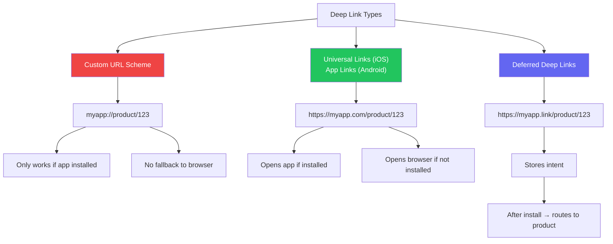
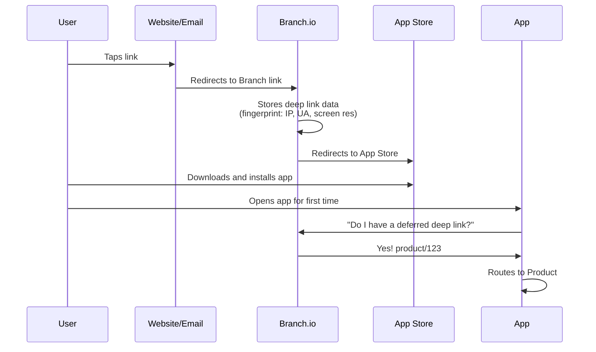

# Deep Linking & Universal Links

::: tip Key Takeaway
- Universal Links (iOS) and App Links (Android) are the modern standard — they use HTTPS URLs that open your app when installed and fall back to the browser when not, eliminating the broken experience of custom URL schemes
- Deferred deep linking (routing users to specific content after install) requires a third-party service like Branch or AppsFlyer because neither iOS nor Android provides this natively
- Deep linking is a navigation problem, not just a URL problem — you need a centralized router that handles links from push notifications, emails, QR codes, web, and other apps consistently
:::

Deep linking is the ability to link directly to a specific screen or piece of content inside your mobile app. It sounds simple, but the implementation is one of the most frustrating parts of mobile development. You are dealing with two platforms that handle links differently, an install gate that breaks the flow for new users, attribution requirements from marketing, and a navigation stack that needs to be constructed correctly regardless of how the user arrived.

A broken deep link is worse than no deep link at all. If a user taps a link expecting to see a specific product and lands on the app's home screen instead, you have created confusion and lost trust. Getting deep linking right is critical for user acquisition, retention, and re-engagement.

**Related**: [Mobile Analytics](/mobile-engineering/mobile-analytics) | [Push Notifications](/mobile-engineering/push-notifications) | [Mobile Architecture](/mobile-engineering/mobile-architecture)

---

## Types of Deep Links



| Type | Protocol | Requires Install | Fallback | Attribution | Use Case |
|------|----------|-----------------|----------|-------------|----------|
| **Custom URL Scheme** | `myapp://` | Yes | None (error) | No | App-to-app communication |
| **Universal Links** (iOS) | `https://` | No | Browser | Limited | Primary deep linking |
| **App Links** (Android) | `https://` | No | Browser | Limited | Primary deep linking |
| **Deferred Deep Link** | `https://` | No | Install → content | Yes | Marketing campaigns |

---

## iOS Universal Links

Universal Links use your regular HTTPS domain. When the user taps `https://myapp.com/product/123`, iOS checks if an app is registered for that domain and opens the app directly if installed. No redirect, no browser, no popup asking "open in app?" — it just works.

### Step 1: Apple App Site Association (AASA)

Host this file at `https://myapp.com/.well-known/apple-app-site-association` (no file extension, content type `application/json`).

```json
{
  "applinks": {
    "details": [
      {
        "appIDs": [
          "TEAMID.com.company.myapp"
        ],
        "components": [
          {
            "/": "/product/*",
            "comment": "Product detail pages"
          },
          {
            "/": "/order/*",
            "comment": "Order tracking"
          },
          {
            "/": "/invite/*",
            "comment": "Referral invitations"
          },
          {
            "/": "/u/*",
            "comment": "User profiles"
          },
          {
            "/": "/promo",
            "?": { "code": "?*" },
            "comment": "Promo codes via query parameter"
          },
          {
            "/": "/api/*",
            "exclude": true,
            "comment": "Never open API calls in app"
          },
          {
            "/": "/auth/*",
            "exclude": true,
            "comment": "Auth callbacks stay in browser"
          }
        ]
      }
    ]
  },
  "webcredentials": {
    "apps": [
      "TEAMID.com.company.myapp"
    ]
  }
}
```

### Step 2: Xcode Configuration

```swift
// In your project's Signing & Capabilities, add "Associated Domains":
// applinks:myapp.com
// applinks:www.myapp.com

// AppDelegate.swift or SceneDelegate.swift
class SceneDelegate: UIResponder, UIWindowSceneDelegate {

    func scene(
        _ scene: UIScene,
        continue userActivity: NSUserActivity
    ) {
        guard userActivity.activityType == NSUserActivityTypeBrowsingWeb,
              let url = userActivity.webpageURL else {
            return
        }

        // Route the deep link
        DeepLinkRouter.shared.handle(url: url)
    }

    // Also handle cold launch from universal link
    func scene(
        _ scene: UIScene,
        willConnectTo session: UISceneSession,
        options connectionOptions: UIScene.ConnectionOptions
    ) {
        if let userActivity = connectionOptions.userActivities.first,
           userActivity.activityType == NSUserActivityTypeBrowsingWeb,
           let url = userActivity.webpageURL {
            DeepLinkRouter.shared.handle(url: url)
        }
    }
}
```

### Step 3: Deep Link Router (iOS)

```swift
import UIKit

enum DeepLink {
    case product(id: String)
    case order(id: String)
    case profile(username: String)
    case invite(code: String)
    case promo(code: String)
    case unknown
}

class DeepLinkRouter {
    static let shared = DeepLinkRouter()

    private var pendingDeepLink: DeepLink?
    private weak var navigationController: UINavigationController?

    func configure(with nav: UINavigationController) {
        self.navigationController = nav
        // Process any pending deep link from cold start
        if let pending = pendingDeepLink {
            navigate(to: pending)
            pendingDeepLink = nil
        }
    }

    func handle(url: URL) {
        let deepLink = parse(url: url)

        guard let nav = navigationController else {
            // App not fully initialized yet — store for later
            pendingDeepLink = deepLink
            return
        }

        navigate(to: deepLink)
    }

    private func parse(url: URL) -> DeepLink {
        let pathComponents = url.pathComponents.filter { $0 != "/" }

        switch (pathComponents.first, pathComponents.dropFirst().first) {
        case ("product", let id?):
            return .product(id: id)
        case ("order", let id?):
            return .order(id: id)
        case ("u", let username?):
            return .profile(username: username)
        case ("invite", let code?):
            return .invite(code: code)
        case ("promo", _):
            if let code = URLComponents(url: url, resolvingAgainstBaseURL: false)?
                .queryItems?.first(where: { $0.name == "code" })?.value {
                return .promo(code: code)
            }
            return .unknown
        default:
            return .unknown
        }
    }

    private func navigate(to deepLink: DeepLink) {
        guard let nav = navigationController else { return }

        switch deepLink {
        case .product(let id):
            let vc = ProductDetailViewController(productId: id)
            nav.pushViewController(vc, animated: true)

        case .order(let id):
            let vc = OrderTrackingViewController(orderId: id)
            nav.pushViewController(vc, animated: true)

        case .profile(let username):
            let vc = ProfileViewController(username: username)
            nav.pushViewController(vc, animated: true)

        case .invite(let code):
            // Handle invite codes — might need auth first
            if AuthManager.shared.isLoggedIn {
                InviteService.shared.redeem(code: code)
            } else {
                pendingDeepLink = deepLink  // Store for after login
            }

        case .promo(let code):
            PromoService.shared.apply(code: code)

        case .unknown:
            break  // Silently ignore unknown links
        }
    }
}
```

---

## Android App Links

### Step 1: Digital Asset Links

Host at `https://myapp.com/.well-known/assetlinks.json`:

```json
[
  {
    "relation": ["delegate_permission/common.handle_all_urls"],
    "target": {
      "namespace": "android_app",
      "package_name": "com.company.myapp",
      "sha256_cert_fingerprints": [
        "14:6D:E9:83:C5:73:06:50:D8:EE:B9:95:2F:34:FC:64:16:A0:83:42:E6:1D:BE:A8:8A:04:96:B2:3F:CF:44:E5"
      ]
    }
  }
]
```

### Step 2: AndroidManifest Configuration

```xml
<activity
    android:name=".MainActivity"
    android:exported="true"
    android:launchMode="singleTask">

    <!-- App Links (verified HTTPS) -->
    <intent-filter android:autoVerify="true">
        <action android:name="android.intent.action.VIEW" />
        <category android:name="android.intent.category.DEFAULT" />
        <category android:name="android.intent.category.BROWSABLE" />
        <data android:scheme="https"
              android:host="myapp.com"
              android:pathPrefix="/product" />
        <data android:scheme="https"
              android:host="myapp.com"
              android:pathPrefix="/order" />
        <data android:scheme="https"
              android:host="myapp.com"
              android:pathPrefix="/u" />
        <data android:scheme="https"
              android:host="myapp.com"
              android:pathPrefix="/invite" />
    </intent-filter>

    <!-- Fallback custom URL scheme -->
    <intent-filter>
        <action android:name="android.intent.action.VIEW" />
        <category android:name="android.intent.category.DEFAULT" />
        <category android:name="android.intent.category.BROWSABLE" />
        <data android:scheme="myapp"
              android:host="open" />
    </intent-filter>
</activity>
```

### Step 3: Handling the Intent

```kotlin
class MainActivity : ComponentActivity() {

    override fun onCreate(savedInstanceState: Bundle?) {
        super.onCreate(savedInstanceState)
        handleDeepLink(intent)
    }

    override fun onNewIntent(intent: Intent) {
        super.onNewIntent(intent)
        handleDeepLink(intent)
    }

    private fun handleDeepLink(intent: Intent?) {
        val uri = intent?.data ?: return
        val deepLink = DeepLinkParser.parse(uri)
        deepLink?.let { viewModel.navigateTo(it) }
    }
}

sealed class DeepLink {
    data class Product(val id: String) : DeepLink()
    data class Order(val id: String) : DeepLink()
    data class Profile(val username: String) : DeepLink()
    data class Invite(val code: String) : DeepLink()
}

object DeepLinkParser {
    fun parse(uri: Uri): DeepLink? {
        val pathSegments = uri.pathSegments

        return when (pathSegments.firstOrNull()) {
            "product" -> pathSegments.getOrNull(1)?.let { DeepLink.Product(it) }
            "order" -> pathSegments.getOrNull(1)?.let { DeepLink.Order(it) }
            "u" -> pathSegments.getOrNull(1)?.let { DeepLink.Profile(it) }
            "invite" -> pathSegments.getOrNull(1)?.let { DeepLink.Invite(it) }
            else -> null
        }
    }
}
```

---

## React Native Deep Linking

```typescript
// src/navigation/DeepLinkConfig.ts
import { LinkingOptions } from '@react-navigation/native';
import { Linking, Platform } from 'react-native';

type RootStackParamList = {
  Home: undefined;
  ProductDetail: { productId: string };
  OrderTracking: { orderId: string };
  Profile: { username: string };
  Invite: { code: string };
};

export const linking: LinkingOptions<RootStackParamList> = {
  prefixes: [
    'https://myapp.com',
    'https://www.myapp.com',
    'myapp://',
  ],

  config: {
    screens: {
      ProductDetail: {
        path: 'product/:productId',
        parse: {
          productId: (id: string) => id,
        },
      },
      OrderTracking: {
        path: 'order/:orderId',
      },
      Profile: {
        path: 'u/:username',
      },
      Invite: {
        path: 'invite/:code',
      },
      Home: {
        path: '',  // Fallback
      },
    },
  },

  // Custom URL handler for deferred deep links
  async getInitialURL() {
    // Check if app was opened from a deep link
    const url = await Linking.getInitialURL();
    if (url) return url;

    // Check for deferred deep link (e.g., from Branch)
    const branchParams = await getBranchParams();
    if (branchParams?.deepLink) {
      return branchParams.deepLink;
    }

    return null;
  },

  // Listen for incoming links while app is open
  subscribe(listener) {
    const linkingSubscription = Linking.addEventListener('url', ({ url }) => {
      listener(url);
    });

    // Also subscribe to Branch link events
    const branchUnsubscribe = subscribeToBranchLinks((url) => {
      listener(url);
    });

    return () => {
      linkingSubscription.remove();
      branchUnsubscribe();
    };
  },
};

// App.tsx
import { NavigationContainer } from '@react-navigation/native';
import { linking } from './navigation/DeepLinkConfig';

function App() {
  return (
    <NavigationContainer
      linking={linking}
      fallback={<LoadingScreen />}
    >
      <RootStack />
    </NavigationContainer>
  );
}
```

### Authentication-Gated Deep Links

```typescript
// src/navigation/AuthGatedDeepLink.tsx
import { useEffect, useRef } from 'react';
import { useAuth } from '../hooks/useAuth';
import { useNavigation } from '@react-navigation/native';
import AsyncStorage from '@react-native-async-storage/async-storage';

const PENDING_DEEP_LINK_KEY = 'pending_deep_link';

export function useAuthGatedDeepLink() {
  const { isAuthenticated } = useAuth();
  const navigation = useNavigation();
  const processedRef = useRef(false);

  useEffect(() => {
    if (isAuthenticated && !processedRef.current) {
      processedRef.current = true;
      processPendingDeepLink();
    }
  }, [isAuthenticated]);

  async function processPendingDeepLink() {
    const pending = await AsyncStorage.getItem(PENDING_DEEP_LINK_KEY);
    if (!pending) return;

    await AsyncStorage.removeItem(PENDING_DEEP_LINK_KEY);

    const { screen, params } = JSON.parse(pending);
    navigation.navigate(screen, params);
  }
}

// In your deep link handler, check auth before navigating
export async function handleDeepLink(url: string, isAuthenticated: boolean) {
  const route = parseDeepLink(url);
  if (!route) return;

  const requiresAuth = ['OrderTracking', 'Profile', 'Invite'].includes(route.screen);

  if (requiresAuth && !isAuthenticated) {
    // Store for after login
    await AsyncStorage.setItem(
      PENDING_DEEP_LINK_KEY,
      JSON.stringify(route)
    );
    // Navigate to login
    return { screen: 'Login' };
  }

  return route;
}
```

---

## Deferred Deep Linking

Deferred deep linking handles the scenario where a user taps a link but does not have the app installed. The link stores the intent, sends the user to the App Store, and after install, the app retrieves the stored intent and routes the user to the correct screen.



### Branch.io Integration

Branch is used by Airbnb, Reddit, Tinder, and Pinterest for deep linking and attribution.

```typescript
// React Native with Branch
import branch from 'react-native-branch';

// Initialize in App.tsx
function App() {
  useEffect(() => {
    // Subscribe to Branch deep link events
    const unsubscribe = branch.subscribe({
      onOpenStart: ({ uri }) => {
        console.log('Deep link opening:', uri);
      },
      onOpenComplete: ({ error, params }) => {
        if (error) {
          console.error('Branch error:', error);
          return;
        }

        if (params['+non_branch_link']) {
          // Not a Branch link — handle normally
          return;
        }

        if (params['+clicked_branch_link']) {
          // User came from a Branch link
          const productId = params.product_id;
          const screen = params.screen;
          const promoCode = params.promo_code;

          if (productId) {
            navigation.navigate('ProductDetail', { productId });
          } else if (promoCode) {
            applyPromoCode(promoCode);
          }
        }

        // Check if this is a first install (deferred deep link)
        if (params['+is_first_session']) {
          analytics.track('install_attribution', {
            campaign: params['~campaign'],
            channel: params['~channel'],
            feature: params['~feature'],
            source: params['+referrer'],
          });
        }
      },
    });

    return () => unsubscribe();
  }, []);

  return <NavigationContainer>...</NavigationContainer>;
}

// Creating a Branch link
async function createShareLink(product: Product): Promise<string> {
  const branchObject = await branch.createBranchUniversalObject(
    `product/${product.id}`,
    {
      title: product.name,
      contentDescription: product.description,
      contentImageUrl: product.imageUrl,
      contentMetadata: {
        customMetadata: {
          product_id: product.id,
          screen: 'ProductDetail',
          price: String(product.price),
        },
      },
    }
  );

  const { url } = await branchObject.generateShortUrl({
    feature: 'sharing',
    channel: 'app',
    campaign: 'product_share',
  }, {
    $desktop_url: `https://myapp.com/product/${product.id}`,
    $ios_url: `https://myapp.com/product/${product.id}`,
    $android_url: `https://myapp.com/product/${product.id}`,
    $og_title: product.name,
    $og_description: product.description,
    $og_image_url: product.imageUrl,
  });

  return url;  // e.g., https://myapp.app.link/AbCdEfGhIj
}
```

---

## Deep Link Testing

### iOS Testing

```bash
# Test Universal Links from terminal
xcrun simctl openurl booted "https://myapp.com/product/123"

# Test custom URL scheme
xcrun simctl openurl booted "myapp://product/123"

# Validate AASA file
curl -v https://myapp.com/.well-known/apple-app-site-association

# Apple's CDN caches AASA — check Apple's CDN directly
curl "https://app-site-association.cdn-apple.com/a/v1/myapp.com"
```

### Android Testing

```bash
# Test App Links
adb shell am start -a android.intent.action.VIEW \
  -d "https://myapp.com/product/123" \
  com.company.myapp

# Verify App Links status
adb shell pm get-app-links com.company.myapp

# Check Digital Asset Links validation
adb shell am compat enable 175408749 com.company.myapp

# Validate assetlinks.json
curl https://myapp.com/.well-known/assetlinks.json | python -m json.tool
```

### Automated Testing

```typescript
// Deep link parser unit tests
describe('DeepLinkParser', () => {
  it('parses product links', () => {
    expect(parseDeepLink('https://myapp.com/product/abc123')).toEqual({
      screen: 'ProductDetail',
      params: { productId: 'abc123' },
    });
  });

  it('parses order links', () => {
    expect(parseDeepLink('https://myapp.com/order/ORD-456')).toEqual({
      screen: 'OrderTracking',
      params: { orderId: 'ORD-456' },
    });
  });

  it('handles query parameters', () => {
    expect(parseDeepLink('https://myapp.com/promo?code=SUMMER20')).toEqual({
      screen: 'Promo',
      params: { code: 'SUMMER20' },
    });
  });

  it('returns null for unknown paths', () => {
    expect(parseDeepLink('https://myapp.com/unknown/path')).toBeNull();
  });

  it('handles custom URL scheme', () => {
    expect(parseDeepLink('myapp://product/abc123')).toEqual({
      screen: 'ProductDetail',
      params: { productId: 'abc123' },
    });
  });

  it('handles missing path segments gracefully', () => {
    expect(parseDeepLink('https://myapp.com/product/')).toBeNull();
    expect(parseDeepLink('https://myapp.com/product')).toBeNull();
  });
});
```

---

## Attribution and Analytics

Deep links are critical for marketing attribution — knowing which campaign, ad, or referral drove an app install or re-engagement.

| Attribution Platform | Strengths | Used By |
|---------------------|-----------|---------|
| **Branch** | Best deep linking, good attribution | Airbnb, Reddit, Tinder |
| **AppsFlyer** | Best attribution, good deep linking | Walmart, Nike, HBO |
| **Adjust** | Strong fraud prevention | Spotify, Booking.com |
| **Singular** | Unified analytics + attribution | Lyft, Twitter |
| **Firebase Dynamic Links** | Free, Google-integrated | Deprecated (May 2025) |

```typescript
// Attribution data from a deep link
interface AttributionData {
  // Campaign identifiers
  campaign: string | null;       // "summer_sale_2024"
  channel: string | null;        // "email", "facebook", "organic"
  feature: string | null;        // "sharing", "referral", "ad"
  source: string | null;         // "instagram_story"

  // User journey
  isFirstSession: boolean;       // Deferred deep link (new install)
  clickTimestamp: number | null;  // When the link was clicked
  installTimestamp: number | null;

  // Ad-specific
  adId: string | null;
  adSetId: string | null;
  creativeId: string | null;
}

function trackAttribution(data: AttributionData) {
  if (data.isFirstSession) {
    analytics.track('install', {
      campaign: data.campaign,
      channel: data.channel,
      source: data.source,
      time_to_install: data.installTimestamp && data.clickTimestamp
        ? data.installTimestamp - data.clickTimestamp
        : null,
    });
  } else {
    analytics.track('re_engagement', {
      campaign: data.campaign,
      channel: data.channel,
    });
  }
}
```

::: warning Common Misconceptions
**"Firebase Dynamic Links is fine for deep linking."** Firebase Dynamic Links was deprecated in August 2023 and shut down completely in August 2025. If you are still using it, migrate to Branch, AppsFlyer, or a custom solution immediately.

**"Universal Links always work."** Universal Links can fail silently. If the AASA file is malformed, served with wrong content-type, or behind a redirect, iOS will not open the app. Apple caches the AASA file aggressively (it checks at install time and periodically), so fixes can take hours to propagate. Long-pressing a Universal Link shows "Open in Safari" which trains iOS to stop opening the app for that domain — this is user-specific and cannot be overridden by the developer.

**"Custom URL schemes are deprecated."** Custom URL schemes (`myapp://`) are not deprecated, but they should not be your primary deep linking mechanism. They are still useful for app-to-app communication (e.g., OAuth callbacks, opening specific apps). Universal Links / App Links should be the default for user-facing links.
:::

---

## When NOT to Use Deep Linking

- **Single-screen utility apps** (flashlight, calculator). There is nothing to deep link to.
- **Apps where every session starts from the same screen.** If your app has no meaningful "content" screens (e.g., a meditation timer), deep linking adds complexity with no benefit.
- **Internal tools with no external sharing.** If no one outside your company will ever generate a link to your app, skip the server-side configuration overhead. Use custom URL schemes for internal app-to-app navigation if needed.

---

## Real-World Example: Spotify

Spotify handles billions of deep links across their ecosystem. Their approach:

1. **URI scheme**: `spotify:track:4iV5W9uYEdYUVa79Axb7Rh` — used internally between Spotify apps and by the desktop app
2. **Universal Links**: `https://open.spotify.com/track/4iV5W9uYEdYUVa79Axb7Rh` — used for sharing, embeds, and web fallback
3. **Deferred deep linking**: When you share a Spotify link with a friend who doesn't have the app, the web page shows a preview with a "Listen on Spotify" button that routes through their attribution pipeline
4. **Content type routing**: The same link format works for tracks, albums, playlists, artists, podcasts, and user profiles — the path prefix determines the content type
5. **Cross-platform consistency**: The same `open.spotify.com` link works on iOS, Android, desktop, and web — the routing logic determines which client to use

---

::: details Quiz

**1. What is the difference between Universal Links and custom URL schemes?**

Universal Links use standard HTTPS URLs (`https://myapp.com/product/123`) that fall back to the browser when the app is not installed. Custom URL schemes use a proprietary protocol (`myapp://product/123`) that shows an error if the app is not installed. Universal Links are verified through the AASA file, preventing other apps from claiming your URLs, while any app can register any custom URL scheme (no verification).

**2. Where must the AASA file be hosted, and what are the requirements?**

The AASA file must be hosted at `https://yourdomain.com/.well-known/apple-app-site-association`. It must be served over HTTPS (no redirects), with content type `application/json`, no file extension, and must not exceed 128 KB. It must be accessible without authentication. Apple caches this file and checks it periodically, not on every app launch.

**3. Why can't iOS or Android provide deferred deep linking natively?**

When the user taps a link and the app is not installed, the user goes to the App Store. After installing and opening the app, there is no standard OS mechanism to tell the app which link the user originally tapped. The App Store / Play Store do not pass referral data to the app on first launch (Android has limited support via Play Install Referrer API). Third-party services like Branch work around this using device fingerprinting (IP address, user agent, screen resolution) to probabilistically match the click to the install.

**4. What happens when a user long-presses a Universal Link and chooses "Open in Safari"?**

iOS remembers this per-domain preference for that user. Future taps on Universal Links for that domain will open in Safari instead of the app. The user must long-press the link in Safari and choose "Open in [App Name]" to reverse this. Developers cannot override this behavior. This is a common source of "Universal Links stopped working" bug reports.

:::

---

::: details Exercise

**Build a deep link testing utility for a React Native e-commerce app that:**

1. Validates that all defined deep link patterns resolve to the correct screens
2. Tests auth-gated links redirect to login with the original destination preserved
3. Tests that malformed URLs are handled gracefully (no crashes)

**Solution:**

```typescript
// __tests__/deeplinks.test.ts
import { parseDeepLink, resolveRoute, handleAuthGatedLink } from '../src/navigation/deeplinks';

describe('Deep Link Routing', () => {
  const validLinks = [
    {
      url: 'https://myapp.com/product/SKU-123',
      expectedScreen: 'ProductDetail',
      expectedParams: { productId: 'SKU-123' },
      requiresAuth: false,
    },
    {
      url: 'https://myapp.com/order/ORD-789',
      expectedScreen: 'OrderTracking',
      expectedParams: { orderId: 'ORD-789' },
      requiresAuth: true,
    },
    {
      url: 'https://myapp.com/u/johndoe',
      expectedScreen: 'Profile',
      expectedParams: { username: 'johndoe' },
      requiresAuth: false,
    },
    {
      url: 'https://myapp.com/invite/REF-ABC',
      expectedScreen: 'Invite',
      expectedParams: { code: 'REF-ABC' },
      requiresAuth: true,
    },
    {
      url: 'myapp://product/SKU-456',
      expectedScreen: 'ProductDetail',
      expectedParams: { productId: 'SKU-456' },
      requiresAuth: false,
    },
  ];

  // 1. Test all valid deep link patterns
  describe('Valid links', () => {
    validLinks.forEach(({ url, expectedScreen, expectedParams }) => {
      it(`routes ${url} to ${expectedScreen}`, () => {
        const result = parseDeepLink(url);
        expect(result).not.toBeNull();
        expect(result!.screen).toBe(expectedScreen);
        expect(result!.params).toEqual(expectedParams);
      });
    });
  });

  // 2. Test auth-gated links
  describe('Auth-gated links', () => {
    const authRequired = validLinks.filter(l => l.requiresAuth);

    authRequired.forEach(({ url, expectedScreen, expectedParams }) => {
      it(`stores pending link for ${url} when not authenticated`, async () => {
        const result = await handleAuthGatedLink(url, false);
        expect(result.redirect).toBe('Login');
        expect(result.pendingDeepLink).toEqual({
          screen: expectedScreen,
          params: expectedParams,
        });
      });

      it(`navigates directly to ${expectedScreen} when authenticated`, async () => {
        const result = await handleAuthGatedLink(url, true);
        expect(result.redirect).toBeNull();
        expect(result.navigate).toEqual({
          screen: expectedScreen,
          params: expectedParams,
        });
      });
    });
  });

  // 3. Test malformed URLs
  describe('Malformed URLs', () => {
    const malformedUrls = [
      '',
      'not-a-url',
      'https://myapp.com/',
      'https://myapp.com/product/',
      'https://myapp.com/product',
      'https://wrongdomain.com/product/123',
      'myapp://',
      'myapp://product',
      'https://myapp.com/unknown/path/here',
      'https://myapp.com/product/../../etc/passwd',
      'javascript:alert(1)',
      'https://myapp.com/product/<script>alert(1)</script>',
    ];

    malformedUrls.forEach((url) => {
      it(`handles "${url}" gracefully`, () => {
        expect(() => parseDeepLink(url)).not.toThrow();
        const result = parseDeepLink(url);
        expect(result).toBeNull();
      });
    });
  });
});
```

Key testing decisions:
- Tests cover both HTTPS universal links and custom URL scheme links
- Auth-gated tests verify both the redirect-to-login flow and the direct navigation flow
- Malformed URL tests include empty strings, path traversal attempts, XSS attempts, and missing path segments
- No test depends on navigation state or React rendering — these are pure function tests

:::

---

> *"A deep link that works 95% of the time is worse than no deep link at all. The 5% failure creates confusion that erodes user trust more than never having the feature."*
