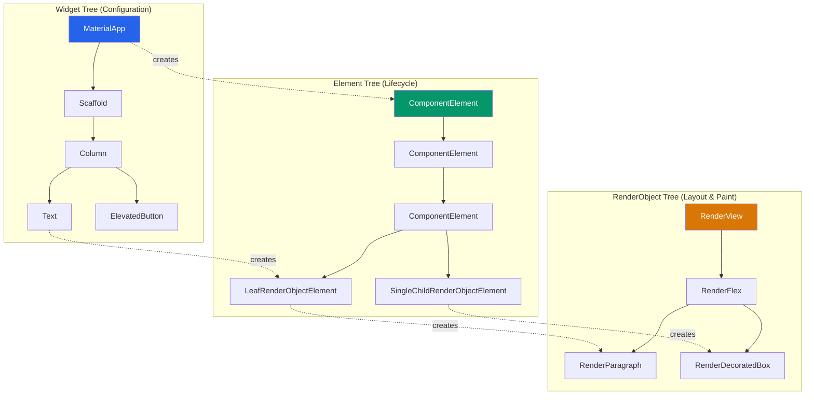
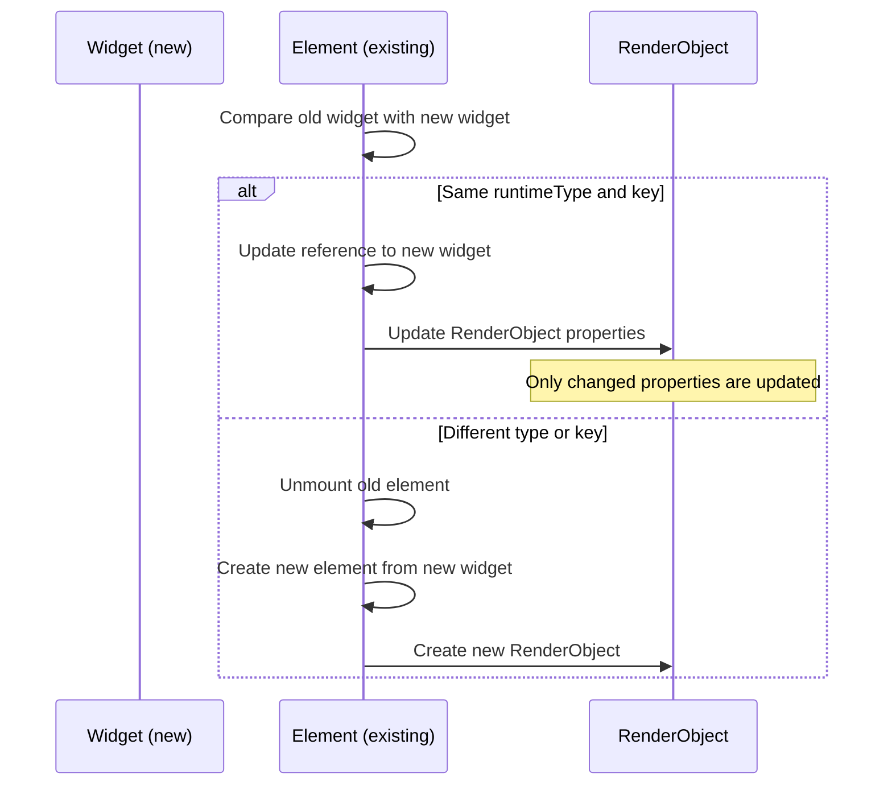
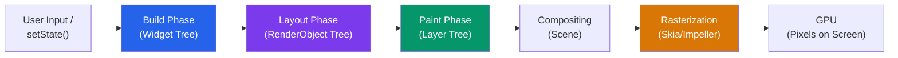
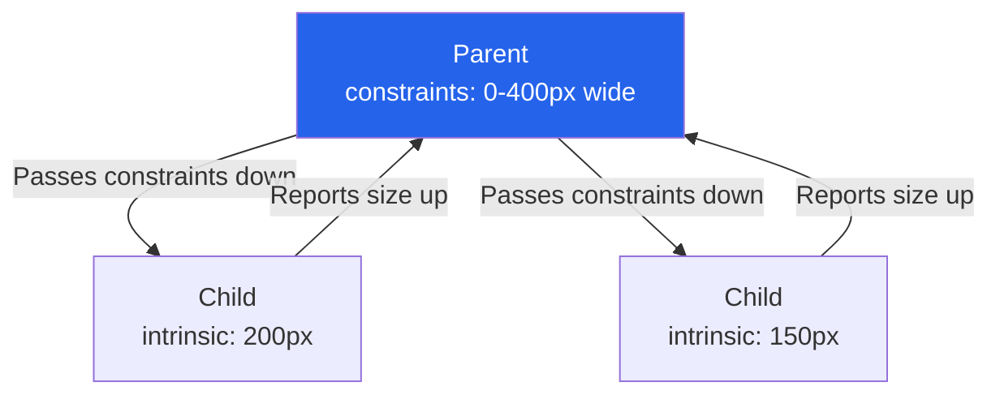
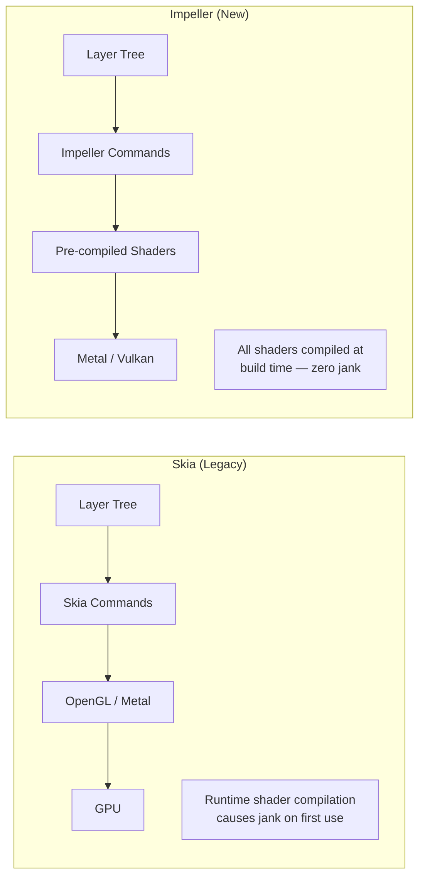
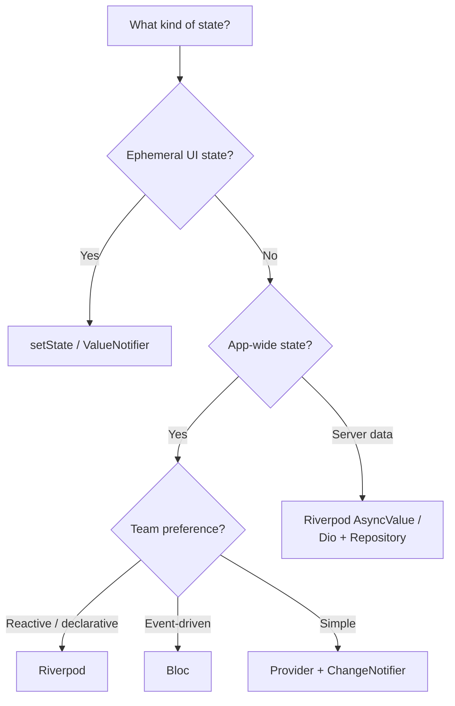
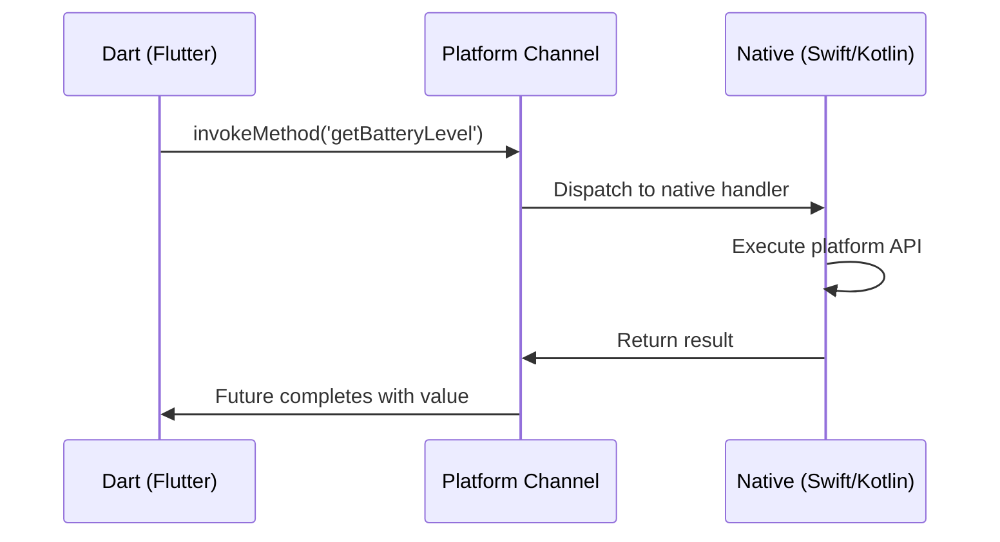

# Flutter Architecture

Flutter takes a radically different approach from every other cross-platform framework. Instead of wrapping native UI components (like React Native) or rendering in a WebView (like Cordova), Flutter ships its own rendering engine and draws every pixel itself. Your app does not use UIKit buttons or Android TextViews — Flutter paints them from scratch using Skia (or its successor, Impeller) directly on a canvas provided by the OS.

This "own the pixels" approach gives Flutter complete control over rendering, which means identical appearance across platforms, smooth 60/120fps animations, and freedom from platform UI inconsistencies. But it also means Flutter must solve problems that native frameworks get for free: text rendering, accessibility, platform conventions, and the entire rendering pipeline.

**Related**: [Mobile Engineering Overview](/mobile-engineering/) | [React Native Deep Dive](/mobile-engineering/react-native) | [Mobile Performance](/mobile-engineering/mobile-performance)

---

## Dart Language

Flutter uses Dart, a language designed at Google that compiles to both native ARM code (for mobile) and JavaScript (for web). Understanding Dart's unique properties explains many of Flutter's architectural decisions.

### Why Dart?

| Property | Why It Matters for Flutter |
|----------|--------------------------|
| **AOT compilation** | Compiles to native ARM — no interpreter overhead on mobile |
| **JIT compilation** | Enables hot reload during development (sub-second iteration) |
| **Sound null safety** | Eliminates null reference crashes at compile time |
| **Single-threaded event loop** | Predictable execution model, no shared-state concurrency bugs |
| **Isolates** | True parallel execution without shared memory (no locks needed) |
| **Tree shaking** | Dead code elimination produces smaller binaries |
| **Garbage collection** | Generational GC optimized for UI workloads (short-lived widget allocations) |

### Dart Fundamentals for Flutter

```dart
// Null safety — types are non-nullable by default
String name = 'Flutter';     // Cannot be null
String? nickname;             // Can be null
String display = nickname ?? 'No nickname';  // Null coalescing

// Records — lightweight data structures (Dart 3.0+)
typedef ProductInfo = ({String name, double price, int stock});

ProductInfo getProduct() => (
  name: 'Widget Pro',
  price: 29.99,
  stock: 142,
);

// Pattern matching (Dart 3.0+)
String describeProduct(ProductInfo product) => switch (product) {
  (name: _, price: var p, stock: 0) => 'Out of stock',
  (name: _, price: var p, stock: _) when p > 100 => 'Premium item',
  (name: var n, price: _, stock: _) => '$n available',
};

// Sealed classes — exhaustive pattern matching
sealed class AuthState {}
class Authenticated extends AuthState {
  final User user;
  Authenticated(this.user);
}
class Unauthenticated extends AuthState {}
class Loading extends AuthState {}

Widget buildAuthUI(AuthState state) => switch (state) {
  Authenticated(user: var u) => Text('Welcome, ${u.name}'),
  Unauthenticated()         => LoginScreen(),
  Loading()                  => CircularProgressIndicator(),
  // No default needed — compiler ensures exhaustiveness
};

// Extension types — zero-cost type wrappers (Dart 3.3+)
extension type UserId(String value) implements String {
  // Compile-time type safety, zero runtime overhead
  // UserId and String are not interchangeable
}

void fetchUser(UserId id) { /* ... */ }
// fetchUser('raw-string');       // Compile error!
// fetchUser(UserId('abc-123'));  // OK
```

::: tip Dart's GC Is Designed for Flutter
Dart's garbage collector uses a generational strategy optimized for the UI workload pattern: widgets are created and destroyed rapidly (every frame in animations), producing many short-lived objects. The young generation is collected quickly without stopping the world, which is why Flutter can allocate thousands of widget objects per frame without jank.
:::

---

## The Three Trees

Flutter's architecture revolves around three trees that work together to produce pixels on screen:



### Widget Tree

Widgets are **immutable configuration objects**. They describe what the UI should look like but do not hold any mutable state and are not the actual rendered objects. Widgets are cheap to create and are rebuilt on every frame during animations.

```dart
// A widget is just a configuration — it describes intent
class ProductCard extends StatelessWidget {
  final String name;
  final double price;
  final String imageUrl;

  const ProductCard({
    super.key,
    required this.name,
    required this.price,
    required this.imageUrl,
  });

  @override
  Widget build(BuildContext context) {
    return Card(
      child: Column(
        crossAxisAlignment: CrossAxisAlignment.start,
        children: [
          Image.network(imageUrl, height: 200, fit: BoxFit.cover),
          Padding(
            padding: const EdgeInsets.all(16),
            child: Column(
              crossAxisAlignment: CrossAxisAlignment.start,
              children: [
                Text(name, style: Theme.of(context).textTheme.titleMedium),
                const SizedBox(height: 4),
                Text('\$$price', style: Theme.of(context).textTheme.bodySmall),
              ],
            ),
          ),
        ],
      ),
    );
  }
}
```

### Element Tree

Elements are the **instantiated, mutable** bridge between widgets and render objects. When you call `setState`, Flutter does not rebuild the entire tree. It walks the element tree, compares old and new widgets, and updates only what changed.



### RenderObject Tree

RenderObjects perform the actual **layout and painting**. They are expensive to create (unlike widgets) and are reused across rebuilds whenever possible.

| Tree | Purpose | Mutability | Cost to Create | Rebuilt Per Frame? |
|------|---------|-----------|----------------|-------------------|
| **Widget** | Declare UI configuration | Immutable | Cheap | Yes (during animations) |
| **Element** | Manage lifecycle, hold state | Mutable | Moderate | No (reused) |
| **RenderObject** | Layout + paint | Mutable | Expensive | No (updated in place) |

::: warning const Constructors Matter
Marking widget constructors as `const` allows Flutter to short-circuit the rebuild process entirely. A `const Text('Hello')` is a compile-time constant — Flutter knows it has not changed and skips diffing its subtree. Always use `const` where possible.
:::

---

## Rendering Pipeline

Flutter's rendering pipeline takes your widget tree and produces pixels at 60fps (or 120fps on supported devices).



### Build Phase

The framework calls `build()` on dirty widgets to produce new widget subtrees. This is where your code runs.

### Layout Phase

RenderObjects calculate size and position. Layout uses a single-pass **constraints-go-down, sizes-go-up** protocol:



```dart
// Custom RenderObject layout example
@override
void performLayout() {
  // Receive constraints from parent
  final maxWidth = constraints.maxWidth;

  // Layout each child with modified constraints
  if (child != null) {
    child!.layout(
      BoxConstraints(maxWidth: maxWidth - padding.horizontal),
      parentUsesSize: true,  // We need the child's size
    );

    // Position child
    final childParentData = child!.parentData as BoxParentData;
    childParentData.offset = Offset(padding.left, padding.top);

    // Report our own size to parent
    size = Size(
      maxWidth,
      child!.size.height + padding.vertical,
    );
  }
}
```

### Paint Phase

RenderObjects paint themselves into a layer tree. Layers are composited and sent to the GPU.

### Rasterization (Skia vs Impeller)



---

## Impeller Renderer

Impeller is Flutter's next-generation rendering engine, designed to eliminate shader compilation jank — the single most common performance complaint with Flutter apps.

| Property | Skia | Impeller |
|----------|------|---------|
| **Shader compilation** | Runtime (causes jank) | Build-time (pre-compiled) |
| **Graphics API** | OpenGL ES, Metal | Metal (iOS), Vulkan (Android) |
| **Tessellation** | CPU-based | GPU-based |
| **Architecture** | General-purpose 2D library | Purpose-built for Flutter |
| **First-frame performance** | Jank possible | Consistent |
| **iOS status** | Deprecated | Default since Flutter 3.16 |
| **Android status** | Default fallback | Default since Flutter 3.22 |

::: tip Impeller Eliminates the Biggest Flutter Pain Point
With Skia, the first time Flutter encountered a new type of visual effect, it compiled a shader on the GPU — causing a visible frame drop. This "shader compilation jank" was noticeable and unpredictable. Impeller pre-compiles all shaders at build time, guaranteeing smooth first-frame rendering for every visual effect.
:::

---

## State Management

Flutter's state management ecosystem is mature with several battle-tested solutions. The right choice depends on your app's complexity and your team's preferences.



### Riverpod (Recommended)

Riverpod is the successor to Provider, designed to be compile-safe, testable, and flexible.

```dart
import 'package:flutter_riverpod/flutter_riverpod.dart';

// Define a provider for a repository
final productRepositoryProvider = Provider<ProductRepository>((ref) {
  return ProductRepository(ref.read(apiClientProvider));
});

// Async provider — fetches data and handles loading/error states
final productsProvider = FutureProvider.autoDispose
    .family<List<Product>, ProductFilters>((ref, filters) async {
  final repo = ref.read(productRepositoryProvider);
  final products = await repo.getProducts(filters);

  // Automatically refetch when filters change
  // autoDispose cleans up when no longer listened to
  return products;
});

// Notifier for mutable state (cart)
final cartProvider =
    NotifierProvider<CartNotifier, CartState>(CartNotifier.new);

class CartNotifier extends Notifier<CartState> {
  @override
  CartState build() => const CartState(items: [], totalPrice: 0);

  void addItem(Product product, int quantity) {
    final newItem = CartItem(product: product, quantity: quantity);
    state = state.copyWith(
      items: [...state.items, newItem],
      totalPrice: state.totalPrice + (product.price * quantity),
    );
  }

  void removeItem(String productId) {
    final item = state.items.firstWhere((i) => i.product.id == productId);
    state = state.copyWith(
      items: state.items.where((i) => i.product.id != productId).toList(),
      totalPrice: state.totalPrice - (item.product.price * item.quantity),
    );
  }

  void clear() => state = const CartState(items: [], totalPrice: 0);
}

// Usage in a widget
class ProductListScreen extends ConsumerWidget {
  final ProductFilters filters;

  const ProductListScreen({super.key, required this.filters});

  @override
  Widget build(BuildContext context, WidgetRef ref) {
    final productsAsync = ref.watch(productsProvider(filters));

    return productsAsync.when(
      loading: () => const Center(child: CircularProgressIndicator()),
      error: (err, stack) => Center(child: Text('Error: $err')),
      data: (products) => ListView.builder(
        itemCount: products.length,
        itemBuilder: (context, index) => ProductCard(
          product: products[index],
          onAddToCart: () => ref
              .read(cartProvider.notifier)
              .addItem(products[index], 1),
        ),
      ),
    );
  }
}
```

### Bloc (Event-Driven)

```dart
import 'package:flutter_bloc/flutter_bloc.dart';

// Events
sealed class ProductEvent {}
class LoadProducts extends ProductEvent {
  final ProductFilters? filters;
  LoadProducts({this.filters});
}
class RefreshProducts extends ProductEvent {}

// States
sealed class ProductState {}
class ProductInitial extends ProductState {}
class ProductLoading extends ProductState {}
class ProductLoaded extends ProductState {
  final List<Product> products;
  ProductLoaded(this.products);
}
class ProductError extends ProductState {
  final String message;
  ProductError(this.message);
}

// Bloc
class ProductBloc extends Bloc<ProductEvent, ProductState> {
  final ProductRepository repository;

  ProductBloc({required this.repository}) : super(ProductInitial()) {
    on<LoadProducts>(_onLoad);
    on<RefreshProducts>(_onRefresh);
  }

  Future<void> _onLoad(
    LoadProducts event,
    Emitter<ProductState> emit,
  ) async {
    emit(ProductLoading());
    try {
      final products = await repository.getProducts(event.filters);
      emit(ProductLoaded(products));
    } catch (e) {
      emit(ProductError(e.toString()));
    }
  }

  Future<void> _onRefresh(
    RefreshProducts event,
    Emitter<ProductState> emit,
  ) async {
    try {
      final products = await repository.getProducts(null);
      emit(ProductLoaded(products));
    } catch (e) {
      emit(ProductError(e.toString()));
    }
  }
}

// Usage
class ProductListScreen extends StatelessWidget {
  const ProductListScreen({super.key});

  @override
  Widget build(BuildContext context) {
    return BlocBuilder<ProductBloc, ProductState>(
      builder: (context, state) => switch (state) {
        ProductInitial()    => const SizedBox.shrink(),
        ProductLoading()    => const Center(child: CircularProgressIndicator()),
        ProductError(:final message) => Center(child: Text(message)),
        ProductLoaded(:final products) => ListView.builder(
          itemCount: products.length,
          itemBuilder: (context, i) => ProductCard(product: products[i]),
        ),
      },
    );
  }
}
```

| Criteria | Riverpod | Bloc | Provider |
|----------|----------|------|----------|
| **Learning curve** | Moderate | Steep | Low |
| **Boilerplate** | Low | High (events + states + bloc) | Low |
| **Testability** | Excellent | Excellent | Good |
| **Compile safety** | Yes (no runtime type errors) | Partial | No (runtime `ProviderNotFoundException`) |
| **Async support** | First-class (`AsyncValue`) | Via events | Manual |
| **Code generation** | Optional (Riverpod Generator) | Optional (freezed) | None |
| **Best for** | Most apps | Large teams, strict patterns | Simple apps |

---

## Platform Channels

When Flutter needs to call platform-specific APIs (camera, Bluetooth, biometrics), it uses platform channels — a message-passing system between Dart and native code.



::: code-group

```dart
// Dart side
import 'dart:io';
import 'package:flutter/services.dart';

class BatteryService {
  static const _channel = MethodChannel('com.myapp/battery');

  Future<int> getBatteryLevel() async {
    try {
      final int level = await _channel.invokeMethod('getBatteryLevel');
      return level;
    } on PlatformException catch (e) {
      throw BatteryException('Failed to get battery level: ${e.message}');
    }
  }

  Stream<BatteryState> get batteryStateChanges {
    const eventChannel = EventChannel('com.myapp/battery_state');
    return eventChannel.receiveBroadcastStream().map((event) {
      return BatteryState.values.byName(event as String);
    });
  }
}
```

```swift
// iOS side (Swift)
import Flutter
import UIKit

class BatteryPlugin: NSObject, FlutterPlugin {
    static func register(with registrar: FlutterPluginRegistrar) {
        let channel = FlutterMethodChannel(
            name: "com.myapp/battery",
            binaryMessenger: registrar.messenger()
        )
        let instance = BatteryPlugin()
        registrar.addMethodCallDelegate(instance, channel: channel)
    }

    func handle(_ call: FlutterMethodCall, result: @escaping FlutterResult) {
        switch call.method {
        case "getBatteryLevel":
            let device = UIDevice.current
            device.isBatteryMonitoringEnabled = true
            let level = Int(device.batteryLevel * 100)
            result(level)
        default:
            result(FlutterMethodNotImplemented)
        }
    }
}
```

```kotlin
// Android side (Kotlin)
import io.flutter.embedding.engine.plugins.FlutterPlugin
import io.flutter.plugin.common.MethodCall
import io.flutter.plugin.common.MethodChannel
import android.content.Context
import android.os.BatteryManager

class BatteryPlugin : FlutterPlugin, MethodChannel.MethodCallHandler {
    private lateinit var channel: MethodChannel
    private lateinit var context: Context

    override fun onAttachedToEngine(binding: FlutterPlugin.FlutterPluginBinding) {
        context = binding.applicationContext
        channel = MethodChannel(binding.binaryMessenger, "com.myapp/battery")
        channel.setMethodCallHandler(this)
    }

    override fun onMethodCall(call: MethodCall, result: MethodChannel.Result) {
        when (call.method) {
            "getBatteryLevel" -> {
                val manager = context.getSystemService(
                    Context.BATTERY_SERVICE
                ) as BatteryManager
                val level = manager.getIntProperty(
                    BatteryManager.BATTERY_PROPERTY_CAPACITY
                )
                result.success(level)
            }
            else -> result.notImplemented()
        }
    }

    override fun onDetachedFromEngine(binding: FlutterPlugin.FlutterPluginBinding) {
        channel.setMethodCallHandler(null)
    }
}
```

:::

::: warning Platform Channel Performance
Platform channels use asynchronous message passing with binary serialization. For high-frequency calls (60+ times per second), the overhead is noticeable. For performance-critical native interop, use Dart FFI (`dart:ffi`) to call C/C++ code directly, bypassing the message channel entirely.
:::

---

## Isolates for Concurrency

Dart is single-threaded, but Flutter apps need to do heavy work (JSON parsing, image processing, database queries) without blocking the UI. Isolates are Dart's answer — they are independent execution contexts with their own memory heap and event loop.

```dart
import 'dart:isolate';
import 'package:flutter/foundation.dart';

// Simple: use compute() for one-off heavy work
Future<List<Product>> parseProductsInBackground(String jsonString) async {
  return compute(_parseProducts, jsonString);
}

List<Product> _parseProducts(String json) {
  // This runs in a separate isolate — will not block UI
  final data = jsonDecode(json) as List;
  return data.map((item) => Product.fromJson(item)).toList();
}

// Advanced: long-running isolate with bidirectional communication
class ImageProcessingService {
  late final Isolate _isolate;
  late final SendPort _sendPort;
  final _receivePort = ReceivePort();

  Future<void> initialize() async {
    _isolate = await Isolate.spawn(
      _isolateEntry,
      _receivePort.sendPort,
    );
    _sendPort = await _receivePort.first as SendPort;
  }

  static void _isolateEntry(SendPort mainSendPort) {
    final receivePort = ReceivePort();
    mainSendPort.send(receivePort.sendPort);

    receivePort.listen((message) {
      if (message is ImageProcessingRequest) {
        final result = _processImage(message);
        message.replyPort.send(result);
      }
    });
  }

  Future<ProcessedImage> processImage(Uint8List imageData) async {
    final responsePort = ReceivePort();
    _sendPort.send(ImageProcessingRequest(
      imageData: imageData,
      replyPort: responsePort.sendPort,
    ));
    return await responsePort.first as ProcessedImage;
  }

  void dispose() {
    _isolate.kill();
    _receivePort.close();
  }
}
```

::: danger Isolate Memory Model
Isolates do not share memory. You cannot pass a reference to a mutable object between isolates — data is copied (or transferred for `TransferableTypedData`). This means large data transfers between isolates have a cost. Design your isolate communication to minimize data crossing the boundary.
:::

---

## Testing in Flutter

```dart
// Widget test
import 'package:flutter_test/flutter_test.dart';
import 'package:flutter_riverpod/flutter_riverpod.dart';

void main() {
  testWidgets('ProductCard displays name and price', (tester) async {
    final product = Product(
      id: '1',
      name: 'Widget Pro',
      price: 29.99,
      imageUrl: 'https://example.com/image.png',
    );

    await tester.pumpWidget(
      ProviderScope(
        child: MaterialApp(
          home: Scaffold(body: ProductCard(product: product)),
        ),
      ),
    );

    expect(find.text('Widget Pro'), findsOneWidget);
    expect(find.text('\$29.99'), findsOneWidget);
  });

  testWidgets('Add to cart button triggers notifier', (tester) async {
    final container = ProviderContainer();

    await tester.pumpWidget(
      UncontrolledProviderScope(
        container: container,
        child: const MaterialApp(home: ProductListScreen()),
      ),
    );

    await tester.tap(find.byIcon(Icons.add_shopping_cart).first);
    await tester.pump();

    final cart = container.read(cartProvider);
    expect(cart.items.length, 1);
  });
}
```

## Cross-References

- **[Mobile Engineering Overview](/mobile-engineering/)** — Platform comparison and architecture patterns
- **[React Native Deep Dive](/mobile-engineering/react-native)** — Compare Flutter's rendering approach with React Native's native components
- **[Mobile Performance](/mobile-engineering/mobile-performance)** — Profiling Flutter apps with DevTools, understanding frame budgets
- **[Offline-First & Local-First](/mobile-engineering/offline-first)** — Persistence strategies using `drift` (SQLite) or `hive` with Flutter
- **[Push Notifications](/mobile-engineering/push-notifications)** — Firebase Cloud Messaging integration with Flutter

---

> *"Flutter does not bridge to native — it replaces native rendering entirely. That is both its greatest strength and its most important trade-off."*
