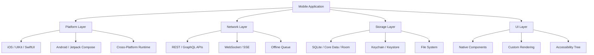
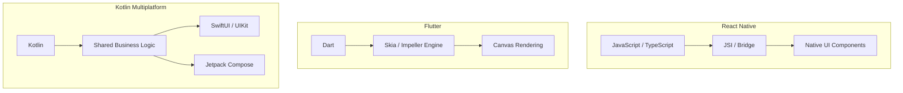
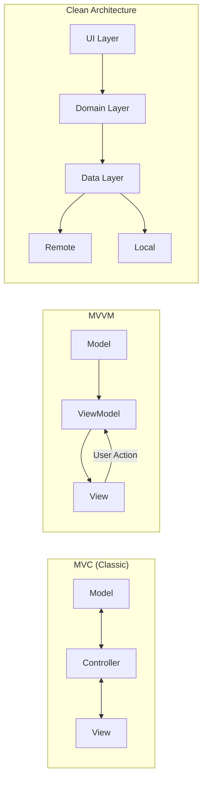
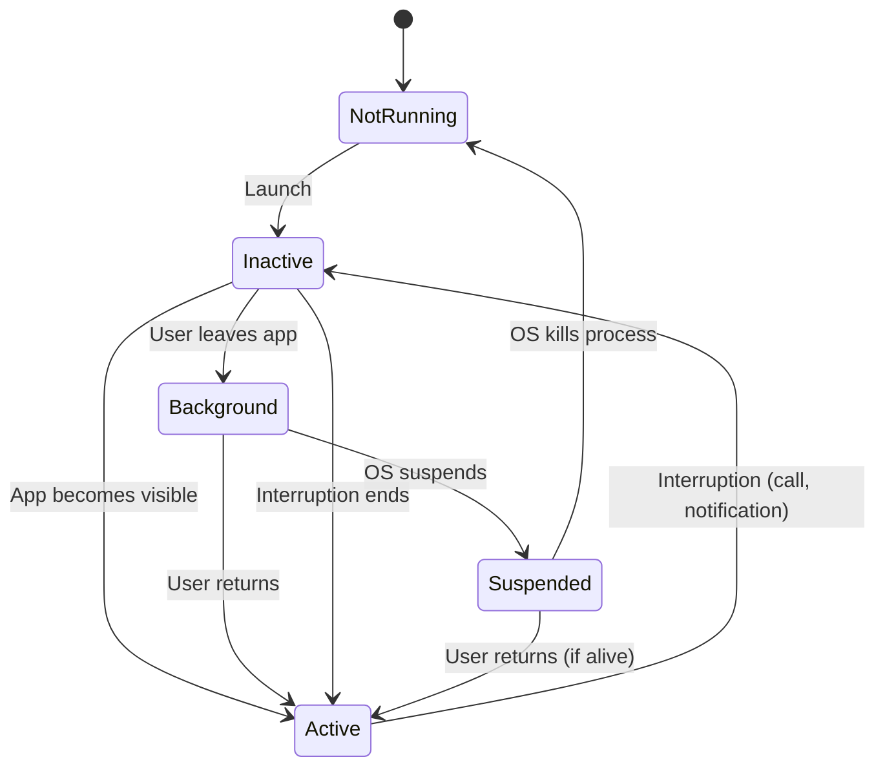
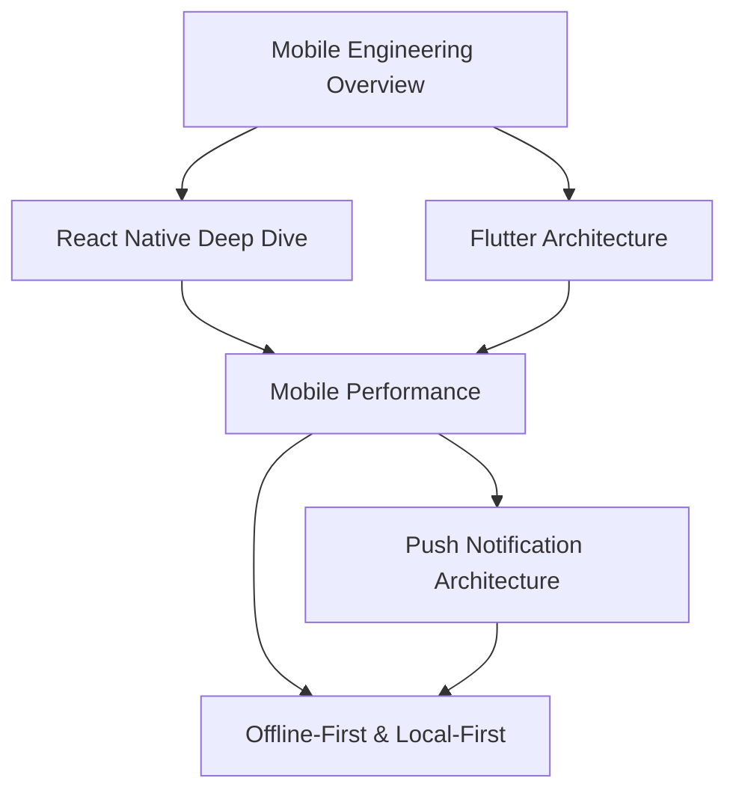
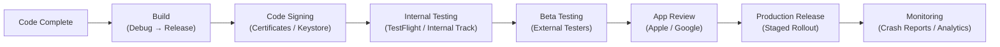

# Mobile Engineering

Mobile engineering is not frontend engineering with a smaller screen. It is a fundamentally different discipline with its own constraints, performance characteristics, distribution mechanisms, and user expectations. The device your code runs on has a battery you are draining, a cellular radio you are taxing, memory you cannot page to disk, and an operating system that will kill your process without warning if it misbehaves.

This section covers the full spectrum of mobile development — from understanding the platform constraints that make mobile hard, through the architectural decisions that determine whether you build native or cross-platform, to the deep technical topics (performance, offline sync, push notifications) that separate production-quality mobile apps from prototypes.

## Why Mobile Engineering Is Hard

Mobile development shares some challenges with web development but introduces entirely new categories of difficulty:

1. **You cannot update instantly.** Web deployments go live in seconds. Mobile updates go through app store review, users must download them, and you will always have users running versions from months or years ago. You must design for version coexistence from day one.

2. **Resources are brutally constrained.** Even flagship phones have less RAM than a budget laptop. Background apps get killed. CPU throttling is aggressive to preserve battery. Your code must be efficient not because of scale, but because of physics.

3. **The OS is adversarial to background work.** iOS and Android have progressively restricted what apps can do in the background. Background fetch, silent push, and background task APIs all have strict time limits and can be denied by the OS based on user behavior patterns.

4. **Testing is exponentially harder.** Screen sizes, OS versions, device manufacturers (Android fragmentation), accessibility settings, network conditions, locale/language combinations — the test matrix is enormous and cannot be fully covered with emulators alone.

5. **Platform APIs diverge.** Camera, Bluetooth, NFC, biometrics, file system, notifications — every capability has different APIs on iOS and Android, often with different permission models and behavioral guarantees.



## Native vs Cross-Platform: The Core Decision

The most consequential technical decision in mobile engineering is whether to build native or cross-platform. This decision affects hiring, velocity, performance, user experience, and long-term maintenance cost. There is no universally correct answer — only trade-offs.

### Native Development

Native development means building separate apps for iOS and Android using each platform's official language and SDK.

| Platform | Language | UI Framework | IDE |
|----------|----------|-------------|-----|
| **iOS** | Swift | SwiftUI / UIKit | Xcode |
| **Android** | Kotlin | Jetpack Compose / Views | Android Studio |

**Advantages:**

- Full access to every platform API on day one — no waiting for bridge/plugin support
- Best possible performance — no abstraction layer between your code and the OS
- Platform-idiomatic UX — navigation patterns, animations, and gestures feel native because they are
- First-class debugging and profiling tools from Apple and Google

**Disadvantages:**

- Two codebases, two teams, two skill sets, two sets of bugs
- Feature parity drift — iOS and Android teams implement features at different speeds
- Higher cost — roughly 1.5-2x the engineering investment of cross-platform

::: code-group

```swift
// SwiftUI — declarative, native iOS
import SwiftUI

struct ProductCard: View {
    let product: Product

    var body: some View {
        VStack(alignment: .leading, spacing: 8) {
            AsyncImage(url: product.imageURL) { image in
                image.resizable().aspectRatio(contentMode: .fill)
            } placeholder: {
                ProgressView()
            }
            .frame(height: 200)
            .clipped()

            Text(product.name)
                .font(.headline)

            Text("$\(product.price, specifier: "%.2f")")
                .font(.subheadline)
                .foregroundColor(.secondary)
        }
        .padding()
        .background(Color(.systemBackground))
        .cornerRadius(12)
        .shadow(radius: 4)
    }
}
```

```kotlin
// Jetpack Compose — declarative, native Android
@Composable
fun ProductCard(product: Product) {
    Card(
        modifier = Modifier
            .fillMaxWidth()
            .padding(8.dp),
        elevation = CardDefaults.cardElevation(defaultElevation = 4.dp),
        shape = RoundedCornerShape(12.dp)
    ) {
        Column {
            AsyncImage(
                model = product.imageUrl,
                contentDescription = product.name,
                contentScale = ContentScale.Crop,
                modifier = Modifier
                    .fillMaxWidth()
                    .height(200.dp)
            )

            Column(modifier = Modifier.padding(16.dp)) {
                Text(
                    text = product.name,
                    style = MaterialTheme.typography.headlineSmall
                )
                Text(
                    text = "$${product.price}",
                    style = MaterialTheme.typography.bodyMedium,
                    color = MaterialTheme.colorScheme.onSurfaceVariant
                )
            }
        }
    }
}
```

:::

### Cross-Platform Development

Cross-platform frameworks let you write one codebase (or a mostly-shared codebase) that runs on both iOS and Android. The three major contenders are React Native, Flutter, and Kotlin Multiplatform.



## Framework Comparison

| Criteria | Native (Swift/Kotlin) | React Native | Flutter | Kotlin Multiplatform |
|----------|----------------------|--------------|---------|---------------------|
| **Language** | Swift + Kotlin | TypeScript | Dart | Kotlin |
| **UI Approach** | Platform widgets | Native components via bridge | Own rendering engine | Native per platform |
| **Performance** | Excellent | Good (with new arch) | Excellent | Excellent |
| **Hot Reload** | Xcode Previews / Live Edit | Fast Refresh | Hot Reload | Partial |
| **Code Sharing** | 0% | 85-95% | 95-99% | 50-80% (logic only) |
| **Ecosystem** | Largest (platform) | Large (npm) | Growing (pub.dev) | Growing |
| **Team Skill** | iOS + Android devs | Web/JS devs | Dart devs (or retrain) | Android/Kotlin devs |
| **App Size (baseline)** | ~10 MB | ~20 MB | ~15 MB | ~12 MB |
| **Startup Time** | Fastest | Slower (JS init) | Fast | Fast |
| **OTA Updates** | Not possible | Possible (CodePush) | Limited | Not possible |

::: tip When to Go Native
Choose native when: (1) your app's core value is tied to a platform-specific capability (ARKit, HealthKit, Wear OS), (2) you need absolute peak performance (games, video editors), (3) you have the budget for two dedicated teams, or (4) your app is simple enough that the cost of two codebases is manageable.
:::

::: tip When to Go Cross-Platform
Choose cross-platform when: (1) feature parity across platforms is critical, (2) your team has strong JavaScript/Dart skills, (3) time-to-market matters more than pixel-perfect platform conformance, or (4) your app is primarily data-driven UI (feeds, forms, dashboards).
:::

::: warning When Cross-Platform Fails
Cross-platform is a poor fit for apps that are deeply integrated with the OS (launcher replacements, accessibility services, system-level tools), apps that require bleeding-edge platform APIs before plugins exist, or apps where 60fps performance in custom animations is non-negotiable and your team lacks the expertise to optimize the cross-platform layer.
:::

## Mobile Architecture Patterns

Mobile apps need structure just like backend services. The dominant patterns have evolved from MVC to more testable, modular architectures:



| Pattern | Testability | Complexity | Best For |
|---------|------------|------------|----------|
| **MVC** | Low | Low | Simple apps, prototypes |
| **MVP** | High | Medium | Legacy Android |
| **MVVM** | High | Medium | SwiftUI, Compose, Flutter |
| **MVI** (Unidirectional) | Highest | High | Complex state, Redux-style |
| **Clean Architecture** | Highest | High | Large teams, long-lived apps |
| **The Composable Architecture** | Highest | High | SwiftUI (iOS only) |

### Clean Architecture for Mobile

```typescript
// Domain Layer — pure business logic, no framework dependencies
interface ProductRepository {
  getProducts(): Promise<Product[]>;
  getProductById(id: string): Promise<Product>;
  searchProducts(query: string): Promise<Product[]>;
}

class GetProductsUseCase {
  constructor(private repo: ProductRepository) {}

  async execute(filters?: ProductFilters): Promise<Product[]> {
    const products = await this.repo.getProducts();
    return filters ? this.applyFilters(products, filters) : products;
  }

  private applyFilters(
    products: Product[],
    filters: ProductFilters
  ): Product[] {
    return products.filter((p) => {
      if (filters.minPrice && p.price < filters.minPrice) return false;
      if (filters.maxPrice && p.price > filters.maxPrice) return false;
      if (filters.category && p.category !== filters.category) return false;
      return true;
    });
  }
}
```

## Mobile-Specific Challenges

### App Lifecycle

Unlike web apps that live in a tab, mobile apps have a complex lifecycle managed by the OS:



::: danger Process Death
On both iOS and Android, the OS can kill your app at any time when it is in the background. Your app must be able to restore its full state from persistent storage. If you rely on in-memory state surviving a background period, you will lose user data.
:::

### Deep Linking & Navigation

Mobile navigation is fundamentally different from web routing. You must handle:

- **Universal Links** (iOS) / **App Links** (Android) — HTTPS URLs that open your app
- **Custom URL schemes** — `myapp://product/123`
- **Deferred deep links** — links that work even if the app is not installed
- **Push notification deep links** — tapping a notification navigates to a specific screen
- **Navigation state restoration** — rebuilding the back stack after process death

### Security Considerations

| Threat | Web | Mobile |
|--------|-----|--------|
| **Reverse engineering** | Difficult (server-side) | Easy (APK/IPA decompilation) |
| **Secret storage** | Server environment variables | Keychain / Keystore (hardware-backed) |
| **Man-in-the-middle** | TLS + browser CA | TLS + certificate pinning |
| **Code tampering** | Not applicable | Jailbreak/root detection, code signing |
| **Data at rest** | Server encryption | Full-disk + app-level encryption |

::: warning Never Ship Secrets in the Binary
API keys, tokens, and secrets embedded in your mobile binary can be extracted in minutes with freely available tools. Use server-mediated authentication, environment-specific configurations fetched at runtime, and the platform Keychain/Keystore for sensitive data.
:::

## What This Section Covers

### Frameworks

- **[React Native Deep Dive](/mobile-engineering/react-native)** — JSI, Fabric, TurboModules, Hermes engine, Expo vs bare workflow, navigation patterns, and native module development. Everything you need to build production React Native apps.

- **[Flutter Architecture](/mobile-engineering/flutter)** — Dart language, widget tree, rendering pipeline, state management with Riverpod/Bloc, platform channels, isolates, and the Impeller renderer. A deep dive into how Flutter works under the hood.

### Advanced Topics

- **[Mobile Performance](/mobile-engineering/mobile-performance)** — 60fps rendering, jank detection, memory management on constrained devices, image optimization, list virtualization, battery optimization, startup time, and profiling tools.

- **[Push Notification Architecture](/mobile-engineering/push-notifications)** — APNs, FCM, token management, silent push, rich notifications, notification channels, delivery reliability, and backend design for notifications at scale.

- **[Offline-First & Local-First](/mobile-engineering/offline-first)** — Sync strategies, conflict resolution, CRDTs for mobile, SQLite/WatermelonDB/Realm, optimistic UI, background sync, and queue-based architecture.

## Learning Path

The recommended reading order builds from foundations through frameworks to advanced topics:



| Order | Topic | Difficulty | Estimated Time |
|-------|-------|------------|----------------|
| 1 | Mobile Engineering Overview (this page) | Beginner | 1 hr |
| 2 | React Native Deep Dive | Intermediate | 2.5 hr |
| 3 | Flutter Architecture | Intermediate | 2.5 hr |
| 4 | Mobile Performance | Advanced | 3 hr |
| 5 | Push Notification Architecture | Intermediate | 2 hr |
| 6 | Offline-First & Local-First | Advanced | 3 hr |

## Platform Market Share and Considerations

Understanding the mobile ecosystem helps inform platform decisions:

| Metric | iOS | Android |
|--------|-----|---------|
| **Global market share** | ~27% | ~72% |
| **US market share** | ~57% | ~42% |
| **Revenue per user** | Higher | Lower |
| **Device fragmentation** | Low (~15 active models) | Extreme (24,000+ models) |
| **OS update adoption** | Fast (80% on latest within 1yr) | Slow (varies by manufacturer) |
| **Minimum OS support** | Typically latest - 2 | Typically API 24+ (Android 7) |
| **Review time** | 24-48 hours | Hours to 3 days |

::: tip Minimum OS Version Strategy
Supporting older OS versions increases your addressable market but also increases development cost and limits which APIs you can use. A common strategy: check analytics for your actual user base, and set the minimum to cover 95% of your active users. For new apps without data, iOS latest-2 and Android API 26+ (Android 8) are reasonable starting points.
:::

## App Distribution and Release Management

Understanding the distribution pipeline is essential for shipping mobile apps:



| Phase | iOS | Android |
|-------|-----|---------|
| **Code signing** | Provisioning profiles + certificates | Keystore (.jks / .keystore) |
| **Internal testing** | TestFlight (up to 100 internal) | Internal testing track |
| **Beta testing** | TestFlight (up to 10,000 external) | Closed / Open testing tracks |
| **Review time** | 24-48 hours | Hours to 3 days |
| **Staged rollout** | Phased release (1-100% over 7 days) | Staged rollout (0.1-100%) |
| **Rollback** | Not possible (submit new version) | Halt rollout (but no true rollback) |
| **OTA updates** | Not allowed (except JS bundles in RN) | Not allowed (except JS bundles in RN) |

::: danger You Cannot Roll Back a Mobile Release
Unlike web deployments, you cannot instantly revert a mobile app to a previous version. If a critical bug ships, your only option is to submit a hotfix and wait for review. This makes thorough pre-release testing and staged rollouts essential. Always roll out to 1-5% of users first and monitor crash rates before proceeding to 100%.
:::

## Cross-References

This section connects to other parts of Archon:

- **[Frontend Engineering](/frontend-engineering/)** — Shared concepts around rendering, state management, and JavaScript/TypeScript
- **[System Design > APIs](/system-design/apis/)** — API design decisions that impact mobile clients (pagination, caching headers, versioning)
- **[Performance Engineering](/performance/)** — Profiling techniques and optimization strategies applicable to mobile
- **[Security](/security/)** — Authentication, encryption, and secure storage patterns
- **[DevOps > CI/CD](/devops/ci-cd/)** — Mobile CI/CD pipelines with Fastlane, Bitrise, and GitHub Actions

---

> *"The best mobile app is one the user never has to think about — it just works, online or off, fast or slow, new phone or old."*
